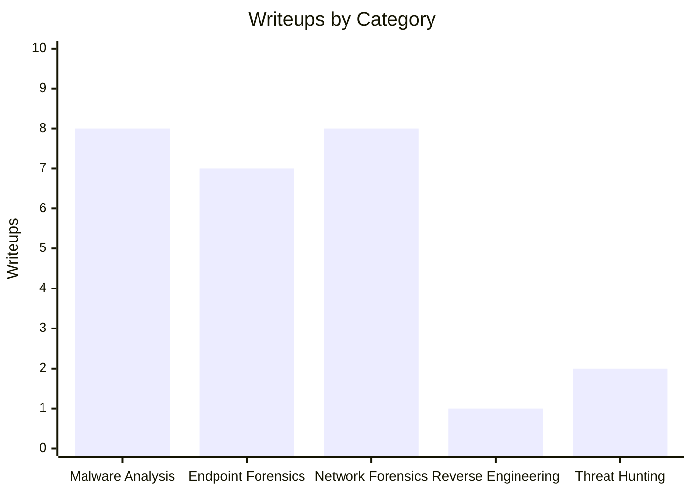

# CyberDefenders Writeups

**Read the writeups at [francisvillalon.github.io/cyberdefender-writeups](https://francisvillalon.github.io/cyberdefender-writeups/)**

Personal blue team CTF writeups covering memory forensics, malware analysis, network forensics, reverse engineering, and threat hunting. All challenges sourced from [CyberDefenders](https://cyberdefenders.org/).

## Writeup Coverage



**26 writeups** across 5 categories.

## Structure

Each challenge lives in its own folder under the relevant category:

```
category/
└── ChallengeName/
    ├── ChallengeName.md
    └── images/
```

Writeups cover the full methodology — tools used, approach per question, and reasoning behind each finding.
