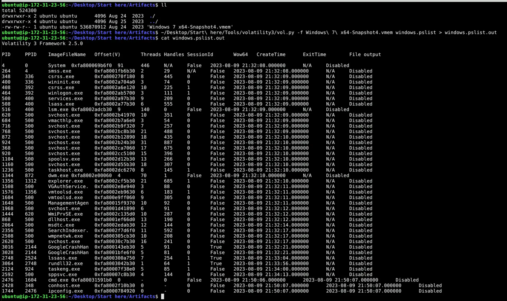
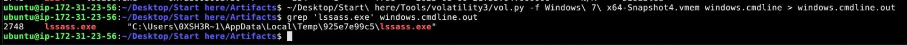
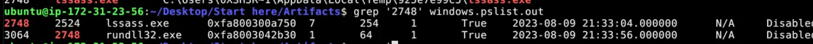
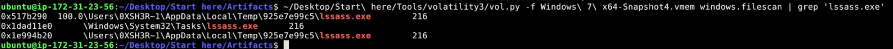
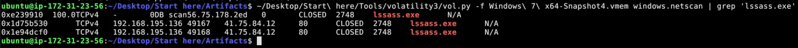
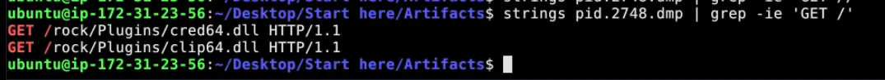
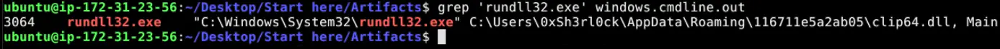
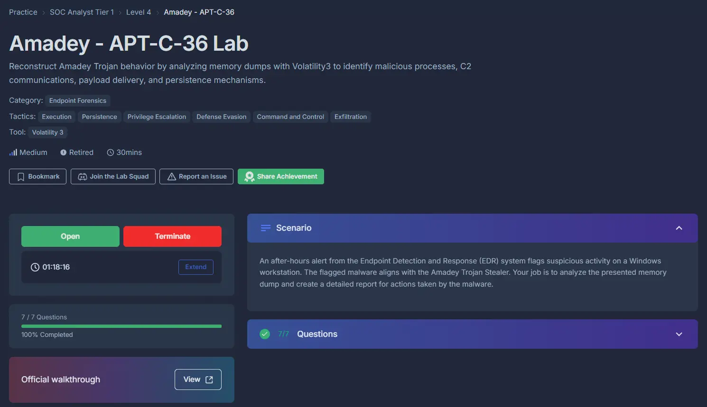

#cyberdefender-medium #endpoint-forensics #volatility3 #finished #reviewed

# Scenario
An after-hours alert from the Endpoint Detection and Response (EDR) system flags suspicious activity on a Windows workstation. The flagged malware aligns with the Amadey Trojan Stealer. Your job is to analyze the presented memory dump and create a detailed report for actions taken by the malware.

# Questions

## Q1 — Identifying the Malicious Parent Process
> In the memory dump analysis, determining the root of the malicious activity is essential for comprehending the extent of the intrusion. What is the name of the parent process that triggered this malicious behavior?

**Approach:** Inspect `pslist` for duplicate or suspicious process names, then use `cmdline` to confirm the execution path.

Let's have a look at the `pslist` and see if anything immediately stands out.



*Pslist output showing two instances of lsass.exe*

If we manually look through the list we will see immediately two instances of `lsass.exe`.
This is highly suspect as there should be one legitimate instance of `lsass.exe`.
Furthermore, if we inspect the other instance of this program we will see that the name has a typo in it.
The actual process name is `lssass.exe`.

Let's also check how this was invoked using `cmdline`.



*Cmdline output showing the suspicious process running from a Temp directory*

We can see from the output that the this process resides in a directory not typical of that of `lsass.exe`. Furthermore, it is running from a `Temp` directory. It is very likely that this program is a malicious executable masquerading as the legitimate `lsass.exe`.

If we also grep it's PID `2748` we will find that it spawns a `rundll32.exe`. This is characteristic of malware using living off the land techniques to execute malicious DLLs at runtime.



*grep of PID 2748 revealing the spawned rundll32.exe child process*

**Answer:** `lssass.exe`

---

## Q2 — Process Location on Disk
> Once the rogue process is identified, its exact location on the device can reveal more about its nature and source. Where is this process housed on the workstation?

**Approach:** Confirm the path via `cmdline` output and cross-check with `filescan`.

We have already identified where the executable resides through the output of `cmdline`.
Another approach to this question is through the use of `filescan` since we already know the name of the malicious executable.



*filescan output showing lssass.exe in the Temp directory and also in \Windows\System32\Tasks*

Which outputs another interesting finding as well, which is that `lssass.exe` also resides in `\Windows\System32\Tasks`. This means that the malicious process is using task scheduler as one of its methods to maintain persistence.

**Answer:** `C:\Users\0XSH3R~1\AppData\Local\Temp\925e7e99c5\lssass.exe`

---

## Q3 — C2 Server IP Address
> Persistent external communications suggest the malware's attempts to reach out C2C server. Can you identify the Command and Control (C2C) server IP that the process interacts with?

**Approach:** Use `netscan` filtered to the malicious process to identify external connections.

Having identified the name of the malicious executable, we can check if it had established any connections to external servers through the use of `grep` and `netscan`.



*netscan output showing lssass.exe connected to 41.75.84.12 over HTTP*

We can see here that it connected to `41.75.84.12` which is in the public IP address range. Furthermore, the connection was HTTP.

**Answer:** `41.75.84.12`

---

## Q4 — Files Downloaded from C2
> Following the malware link with the C2C, the malware is likely fetching additional tools or modules. How many distinct files is it trying to bring onto the compromised workstation?

**Approach:** Dump the process memory with `memmap`, run `strings`, then `grep` for GET requests to identify fetched files.

For this we need to do a `memmap` of the `lssass.exe` process.
This is because when a program makes a GET request for a file, the response data must live somewhere in RAM before the program can even use it. That somewhere is the process's virtual memory which is exactly what `memmap` captures.

```
~/Desktop/Start\ here/Tools/volatility3/vol.py -o ~/Desktop/Start\ here/Artifacts/ -f Windows\ 7\ x64-Snapshot4.vmem windows.memmap --dump --pid 2748
```

Then perform a `strings` on the dump to extract readable strings.
We can then use `grep` to search for `GET` requests.



*grep output revealing two GET requests for cred64.dll and clip64.dll*

We see that two get requests are being made for files:
- `/rock/Plugins/cred64.dll`
- `/rock/Plugins/clip64.dll`

Therefore, the malware tried to fetch 2 additional DLLs.

**Answer:** `2`

---

## Q5 — Full Path of Downloaded File
> Identifying the storage points of these additional components is critical for containment and cleanup. What is the full path of the file downloaded and used by the malware in its malicious activity?

**Approach:** Check `cmdline` for the arguments passed to `rundll32.exe` to identify which DLL was executed and from where.

We already know that `lssass.exe` uses `rundll32.exe`.
We can check what arguments `rundll32.exe` was invoked with to determine what was executed.



*cmdline showing the argument passed to rundll32.exe pointing to clip64.dll*

**Answer:** `C:\Users\0xSh3rl0ck\AppData\Roaming\116711e5a2ab05\clip64.dll`

---

## Q6 — Child Process for Execution
> Once retrieved, the malware aims to activate its additional components. Which child process is initiated by the malware to execute these files?

We already know this from the previous questions.
The malware uses `rundll32.exe` to execute the fetched files.

**Answer:** `rundll32.exe`

---

## Q7 — Additional Persistence Location
> Understanding the full range of Amadey's persistence mechanisms can help in an effective mitigation. Apart from the locations already spotlighted, where else might the malware be ensuring its consistent presence?

We already found this in Q2 when we grepped for `lssass.exe` in the `filescan` output.

In that output we saw that `lssass.exe` also resided in `\Windows\System32\Tasks`.
Which means that there is a scheduled task for the executable likely being used as part of its persistence strategy.

**Answer:** `C:\Windows\System32\Tasks\lssass.exe`

---

# Completion



I successfully completed Amadey - APT-C-36 Blue Team Lab at @CyberDefenders!
https://cyberdefenders.org/blueteam-ctf-challenges/achievements/francisvil3213/amadey-apt-c-36/

#CyberDefenders #CyberSecurity #BlueYard #BlueTeam #InfoSec #SOC #SOCAnalyst #DFIR #CCD #CyberDefender
