#endpoint-forensics #MemProcFS #VirusTotal #EvtxECmd #TimelineExplorer #ZimmermanTools #cyberdefender-medium #finished #reviewed #CyberDefenders #CyberSecurity #BlueYard #BlueTeam #InfoSec #SOC #SOCAnalyst #DFIR #CCD #CyberDefender

# Scenario
As a member of the DFIR team at SecuTech, you're tasked with investigating a security breach affecting multiple endpoints across the organization. Alerts from different systems suggest the breach may have spread via removable devices. You've been provided with a memory image from one of the compromised machines. Your objective is to analyze the memory for signs of malware propagation, trace the infection's source, and identify suspicious activity to assess the full extent of the breach and inform the response strategy.

# Investigation
## Quick Memory Triage
Let's first perform a memory triage just to get our bearings.
### Windows Info
Let's first check the basic info of the memory dump.

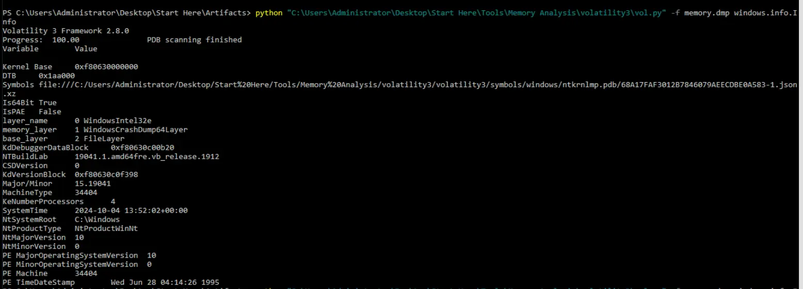

*`windows.info.Info` output*

We can see the Windows version is Windows 10 and the system clock was at `2024-10-04 13:52 UTC`.
Also note that this is a `.dmp` file meaning it's a Windows crash dump.
### Pslist
Let's now output the `pslist` into a file and see if we can find anything interesting.

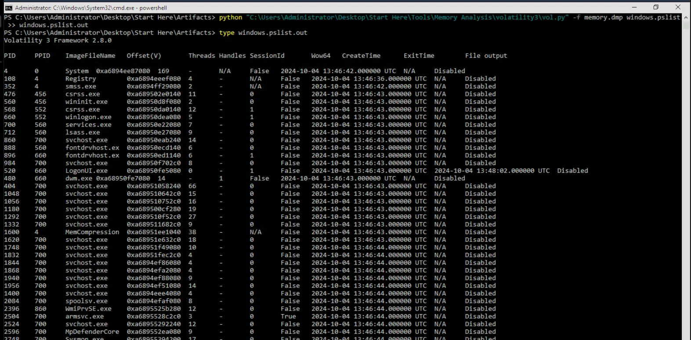

*Output `pslist` into `windows.pslist.out`*

Let's search for the following using `sls`
- `cmd.exe`
- `powershell.exe`
The intuition is that I am trying to find any suspicious parent child relationship with these processes.

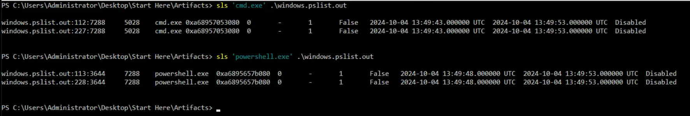

*Searching for PowerShell and cmd*

We can see that cmd was spawned by `5028`.
We can also see that PowerShell was spawned by the cmd processes.
If we search for the parent of the cmd process we will find that the process is `explorer.exe`.
As seen below.

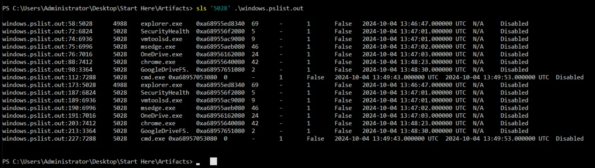

*Finding pid `5028`*

### Cmdline

Let's output the `cmdline` into a file and see if we can find clues on how PowerShell or cmd was invoked and with arguments.
We can also check this output for other interesting artifacts like odd files executing in temp directories or other suspicious locations.

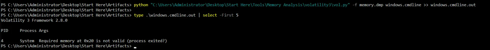

*Creating `windows.cmdline.out`*

If we `sls` for `explorer.exe`, `cmd.exe` and `powershell.exe` we will see the following,

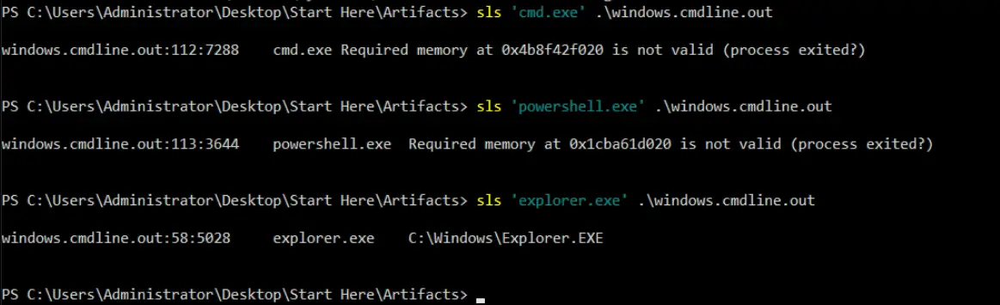

*Output of `sls` for processes*

We cannot find anything useful from the `cmdline` but now we know that both `cmd` and PowerShell ran and exited cleanly.
We can however find a username from the dump by `sls 'appdata' .\windows.cmdline.out`.
Which gives us `Tomy` as well as some really long output from `chrome.exe` as seen below,

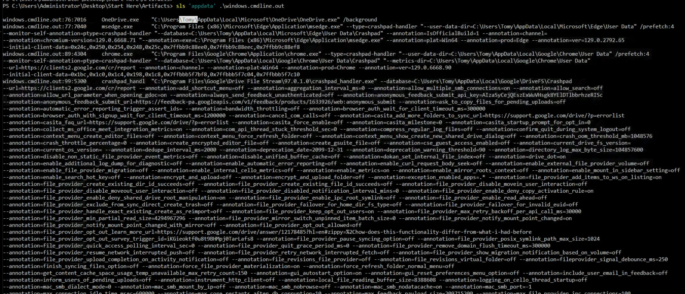

*`sls appdata` output*

### Netscan
We are not getting much back from `pslist` and `cmdline` but perhaps we can find some evidence of callbacks to the C2 that we can identify.
Let's also look at `netscan` to see if anything of interest was captured.
First we run the following command.


*Creating `windows.netscan.out`*

Then we just `sls` the following terms
- `ESTABLISHED` -> actively talking at point of dump
- `LISTENING` -> Processes waiting for connections
- `CLOSE_WAIT` -> Recently terminated connections

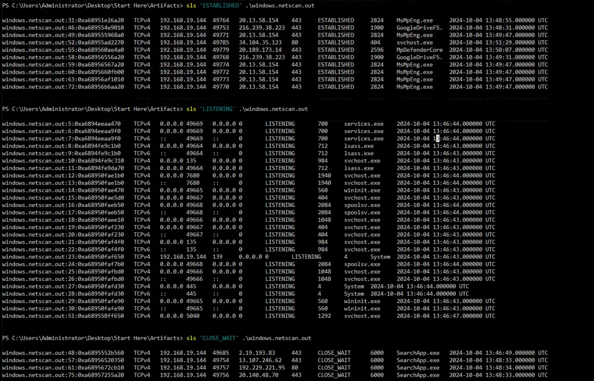

*Output of `sls`*

There are some potential connections which might be suspicious as they occur over unencrypted channels, for instance
- `SearchApp.exe` recently closed connection to `13.107.246.62` over port `80` which is not encrypted.
- `svchost.exe` connected successfully to `34.104.35.123` over port `80` which is also not encrypted

Researching into the `SearchApp.exe` connection to `13.107.246.62` reveals that while it was over an unencrypted channel, it is actually just a connection to the Microsoft and Azure CDN IP address range.

On the other hand, there are ~13800 community entries about `34.104.35.123` stating that this IP was referenced as part of a botnet and has a community score of -4.
However, all security vendors on VirusTotal did not flag this IP and some community members state that it is a benign update service.
This disagreement between community reports and vendor verdicts means we cannot rule it out.

### Concluding Triage
Initial triage of `pslist`, `cmdline` and `netscan` didn't give us anything concrete — just a suspicious process chain in `explorer.exe` > `cmd.exe` > `powershell.exe` and a negative community score on `34.104.35.123`. Not enough to work with.
As I worked through the plugins and reasoning, I felt that the output was giving me diminishing returns. The effort was high for not much pay off. We need to change the angle at which we approach this.

The next step requires some lateral thinking. We know from the `.dmp` extension that this is a Windows crash dump rather than a raw memory image, which matters because user space memory can be paged out in crash dumps to save space. That sounds like a limitation, but the fact that `pslist`, `cmdline` and `netscan` all returned real data is actually a good sign — it suggests this is either a full dump or at minimum a kernel dump, meaning it can contain Windows event logs.

That opens up a useful lead. Given that the scenario points to removable devices as the likely infection vector, the logical next step is to look for event logs embedded in the dump and carve them out for analysis.
## Getting Log Files
### Manually Looking for Log Files
#### File Scan & sls
We first have to run filescan.
We will output this to `windows.filescan.out` so we can run some `sls` queries on it.

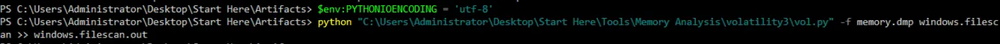

*Creating the `windows.filescan.out` file*

Notice that we also have to set the `PYTHONIOENCODING` to `utf-8`.
This was done because some filenames contain characters that the default PowerShell console encoding cannot represent.
Setting the encoding to `utf-8` allows us to write the output to a file and `sls` it.

Now all we have to do is search for `evtx` which is the file extension for Windows event logs.

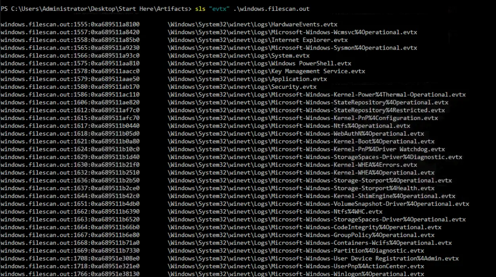

*`evtx` logs found in `windows.filescan.out`*

Fortunately, we managed to output a large list of Windows event logs.
Now we need to know what logs we are looking for.
For this I just searched Google for what Windows event logs are relevant to removable storage devices which gives me the list

- **`Microsoft-Windows-DriverFrameworks-UserMode%4Operational.evtx`** (Tracks connections and disconnections via Event IDs 2003, 2100, 2101, 2102)
- **`System.evtx`** (Logs Plug and Play driver installations via Event IDs 20001, 20003, 20005)
- **`Microsoft-Windows-Partition%4Diagnostic.evtx`** (Reveals capacity, manufacturer, model, and Volume Serial Number via Event ID 1006)
- **`Security.evtx`** (Records file reads, writes, and deletions if "Audit Removable Storage" policy is active via Event IDs 4656, 4663, 4658)
- **`Microsoft-Windows-Storage-ClassPnP/Operational.evtx`** (Logs low-level storage driver and device detection issues)
- **`Microsoft-Windows-Ntfs/Operational.evtx`** (Captures file system mounting actions)

Let's check if any of these are present by using

```
sls ".evtx" .\windows.filescan.out | sls 'System\.evtx|Microsoft-Windows-DriverFrameworks.*\.evtx|Partition\%4Diagnostic\.evtx|\\Security\.evtx|Microsoft-Windows-Ntfs|Microsoft-Windows-Storage-ClassPnP' 
```

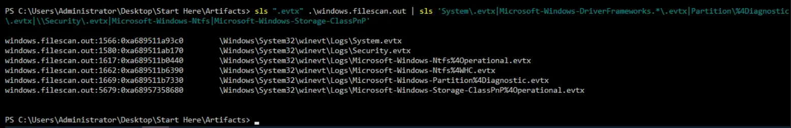

*Checking what logs are present*

We can see that the majority of the logs are present except for `Microsoft-Windows-DriverFrameworks-UserMode%4Operational.evtx`.
Let's carve these files out.

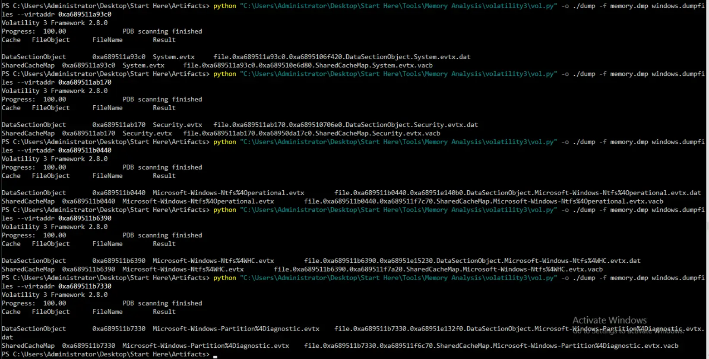

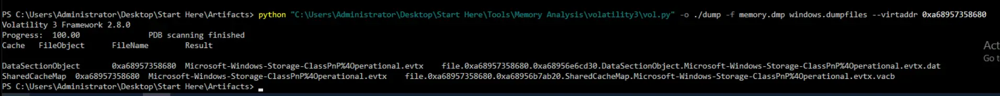

*Carving files out*

Notice how two file types are carved out for each log file.
One is `vacb` and one is `dat`.
An easy way of telling which one we want to look at for this use case is really just the size of the file.
For instance we can see that the `vacb` file is larger than the `dat` file for `Security.evtx`.
Therefore, we want to be analyzing the `vacb` files.

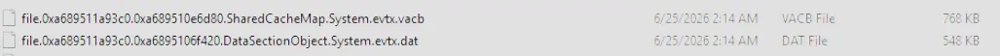

*File size difference*

#### Parsing the Log Files Using EvtxECmd.exe
We can now pass these files to `EvtxECmd.exe` to have them parsed.
However, we should first rename the `vacb` files to have extension `.evtx` as well as just a much shorter filename.
So we have something like this.

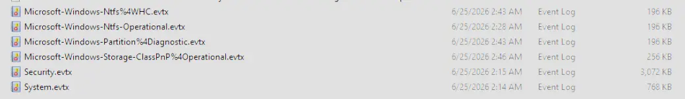

*Shorter filenames and correct extensions*

Now we pass these files to `EvtxECmd.exe`.
Using the `Microsoft-Windows-Ntfs-Operational.evtx` as an example we use the command

```
&"C:\Users\Administrator\Desktop\Start Here\Tools\ZimmermanTools\net6\EvtxeCmd\EvtxECmd.exe" -f .\Microsoft-Windows-Ntfs-Operational.evtx  --csv . --csvf microsoft-windows-ntfs-operational-parsed.csv  
```

Which then gives us the following output

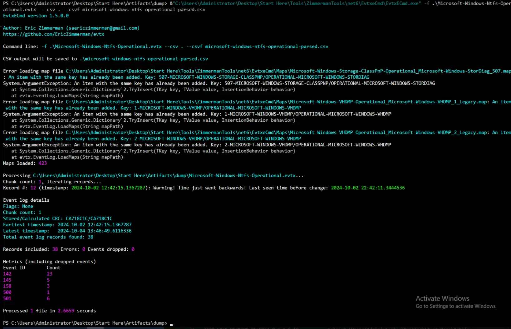

*Output of parsing tool*

as well as the csv file with all the data

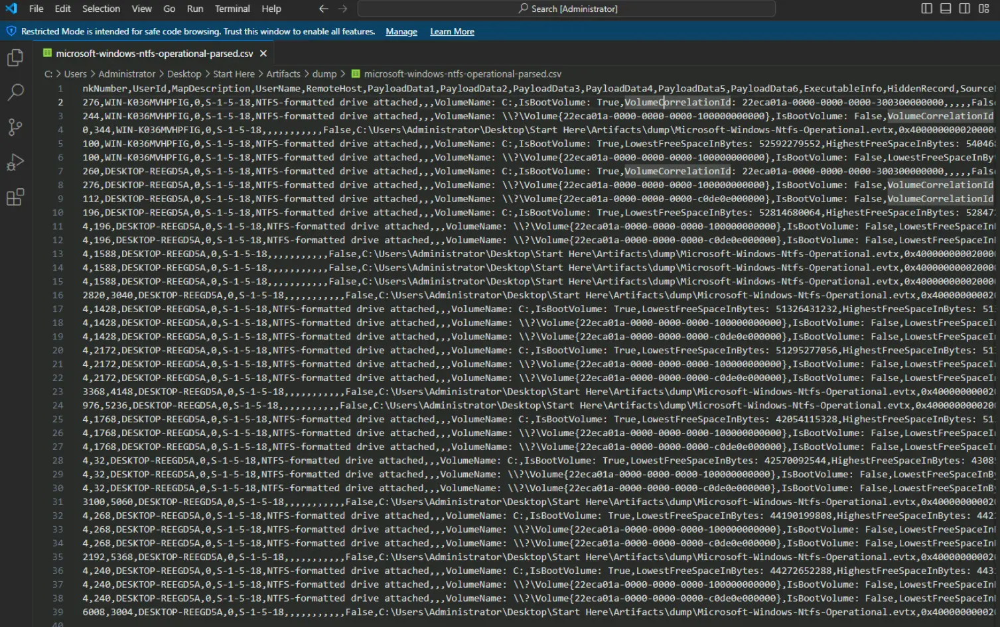

*Exported csv*

We can also just drag and drop the `evtx` files into `ELEX` to open them.
As shown below,

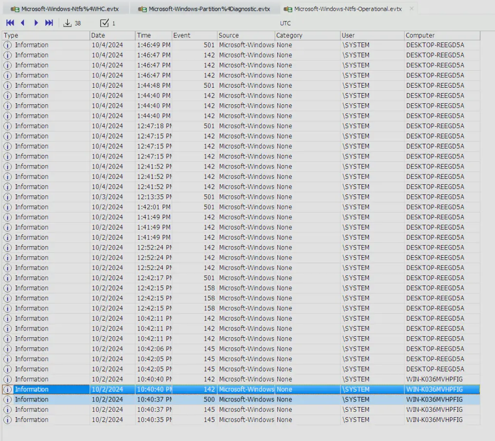

*ELEX output*

### Automatically Getting Log Files & More (MemProcFS)

As evident from the manual analysis of logs.
It is a highly involved process just to extract 1 set of logs.
Luckily, we have a tool that allows us to do all this automatically (and more) which is `MemProcFS`.

To get started we pass the `memory.dmp` to `MemProcFS` through the following command,

```
&"C:\Users\Administrator\Desktop\Start Here\Tools\Memory Analysis\MemProcFS\memprocfs.exe" -device .\memory.dmp -mount M -forensic 3 -license-accept-elastic-license-2-0  
```

This command means mount `memory.dmp` as files in virtual file system, mount it as drive `M`, set forensic mode `3` and also accept the `elastic-license-2-0` which enables the YARA scanning against the built in ruleset.

It is important to note the argument `-forensic 3` is here because this instructs `MemProcFS` to perform a batch-oriented analysis pass on top of the standard memory analysis. It will read the complete memory sequentially and perform multiple analysis tasks in parallel, the results of which are saved to a SQLite database. The omission of this argument means we have to manually perform the analysis ourselves.

The number after forensic just determines the persistence of the SQLite database holding the results.
As shown below,

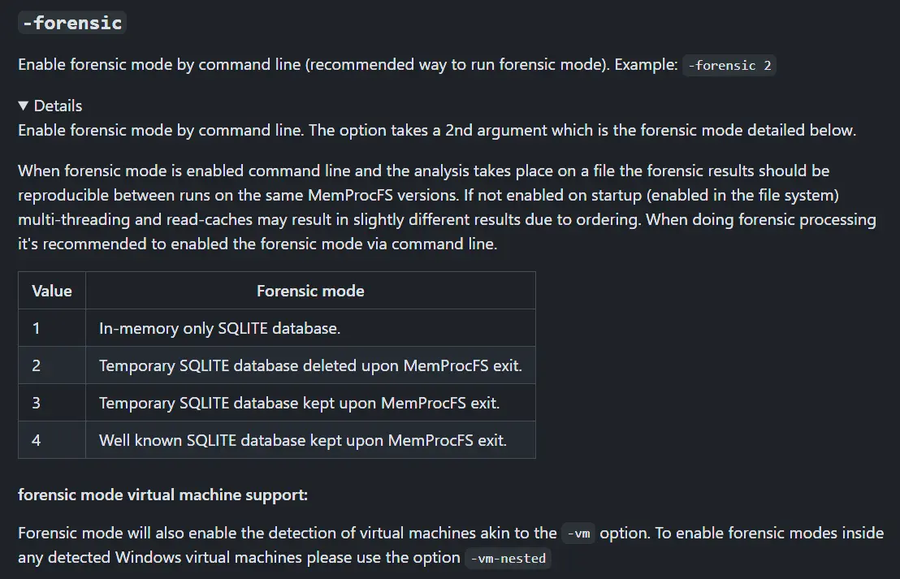

*Wiki page from official MemProcFS GitHub repo ([_CommandLine · ufrisk/MemProcFS Wiki](https://github.com/ufrisk/MemProcFS/wiki/_CommandLine))*

That's great but what does this mean for us as analysts.
It means that a lot of the forensic heavy lifting will be done by the program and we can just browse the results in the mounted drive.
Saving us time and effort.

Running the command will yield us the following,

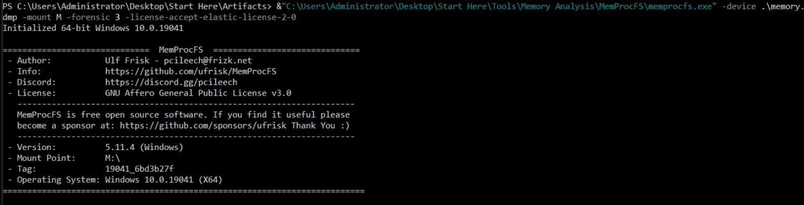

*Command output*

And in the file explorer, the mounted drive as seen below,

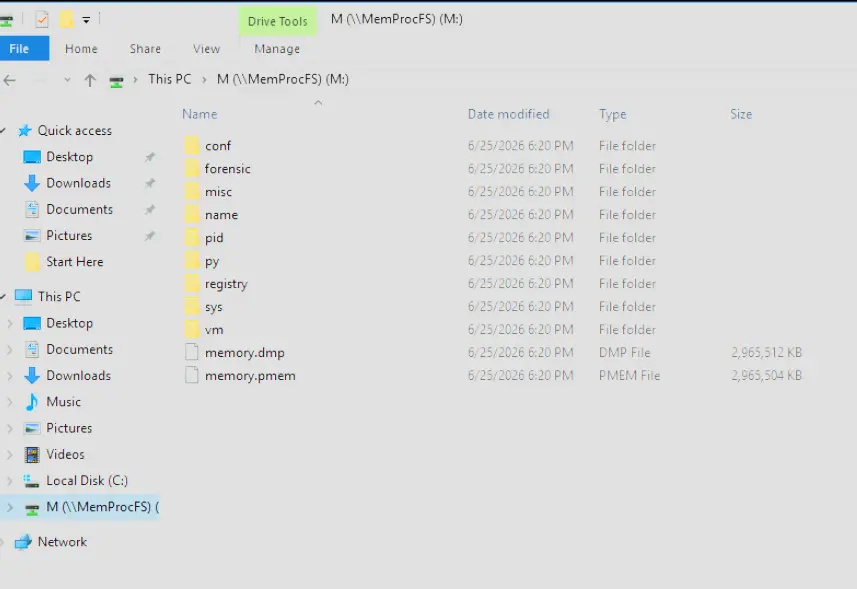

*Mounted drive*

If we click into `M:\forensic` too early, the forensic analysis may have not yet completed.
Therefore, we will not be able to view the results yet.
To check on the progress we can do a simple PowerShell script that just checks `M:\forensic\progress_percent.txt`.

```
while ($true) { Get-Content "M:\forensic\progress_percent.txt"; Start-Sleep 3}
```

Which gives us something like this

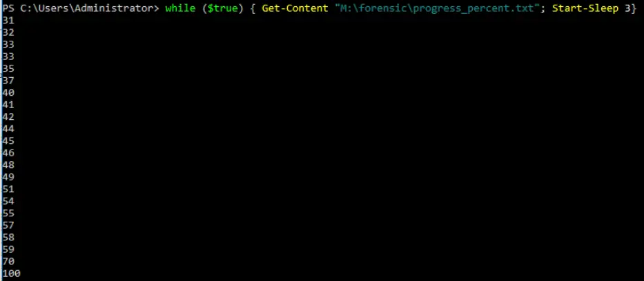

*Checking progress*

Once it reaches 100, we just `Ctrl+C` the program and view the results.
With this we can now answer the questions in the lab.

---
# Questions
## Q1 — Serial Number of USB Device
> Tracking the serial number of the USB device is essential for identifying potentially unauthorized devices used in the incident, helping to trace their origin and narrow down your investigation. What is the serial number of the inserted USB device?

**Approach:** Navigate to `M:\py\reg\usb\usb_storage` in the MemProcFS virtual filesystem to read USB device metadata from the registry plugin output.

In our `MemProcFS` mounted virtual file system is the directory `M:\py`.
This folder contains the output of the various Python plugins that `MemProcFS` uses.
If we look at the `MemProcFS` GitHub and check under `files/plugins` we will see one of the Python scripts is `pyp_reg_root_reg$usb_usb$storage.py`.

Which if we look at quickly actually gives us the serial number of USB storage devices.
Below, is the source code for the script.

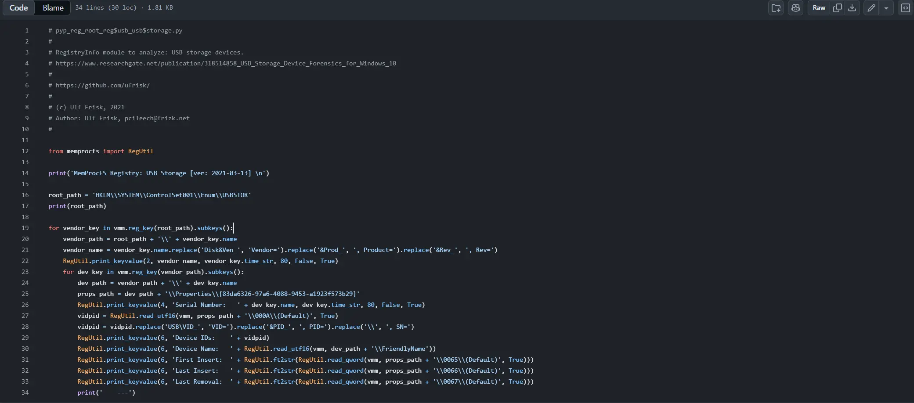

*Source for `usb_storage` script ([pyp_reg_root_reg$usb_usb$storage.py · ufrisk/MemProcFS](https://github.com/ufrisk/MemProcFS/blob/master/files/plugins/pyp_reg_root_reg%24usb_usb%24storage.py))*

Let's look into this folder and see what we can find.
If we navigate into `M:\py\reg\usb` we will find two files which are `usb_devices` and `usb_storage`.
The one we care about is `usb_storage` and it tells us the serial number of the USB device is `7095411056659025437&0`

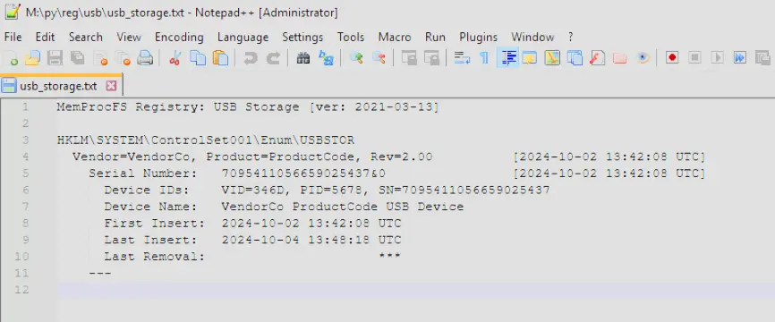

*`usb_storage.txt`*

**Answer:** `7095411056659025437&0`

---
## Q2 — Last USB Insertion Time
> Tracking USB device activity is essential for building an incident timeline, providing a starting point for your analysis. When was the last recorded time the USB was inserted into the system?

We can see this in `usb_storage.txt` under `Last Insert`.
The last insert time was `2024-10-04 13:48:18 UTC`.

**Answer:** `2024-10-04 13:48:18 UTC`

---
## Q3 — Full Path of Malware Executable
> Identifying the full path of the executable provides crucial evidence for tracing the attack's origin and understanding how the malware was deployed. What is the full path of the executable that was run after the PowerShell commands disabled Windows Defender protections?

**Approach:** Copy event logs from `M:\misc\eventlog` to disk, parse the whole directory with EvtxECmd into a single CSV, load into Timeline Explorer, and search for `cmd.exe` to surface the PowerShell execution command line.

For this we need to look at the Windows event logs which we will find in `M:\misc\eventlog`.

To analyze the Windows event logs, navigate to `M:\misc\eventlog` in `MemProcFS`. However, these files cannot be opened and analyzed directly as they are virtual files reconstructed from memory on the fly by `MemProcFS`, meaning they are not stable files on disk.

Since `M:` is a virtual filesystem, we first need to copy the logs to a real location on disk before any analysis tool can read them properly. Simply copy the contents of `M:\misc\eventlog` and paste them into a working directory of your choice as long as it points to a real on-disk location. Once copied, the files become stable and can be opened with any standard analysis tool.

I chose `C:\Users\Administrator\Desktop\Start Here\Artifacts\logs` as my working directory.
Going through each one of these `evtx` files or finding out which log file in particular is of interest can be tedious.
So what we can do instead is use `EvtxECmd.exe` to retrieve all the data from the log files and dump it all into one csv.
From there we can just search key terms in the csv through Timeline Explorer's search bar.

This command invokes `EvtxECmd.exe`, specifies the directory where our logs reside to recurse over, specifies the output directory for the resulting csv file as well as define the file name.

```
&'C:\Users\Administrator\Desktop\Start Here\Tools\ZimmermanTools\net6\EvtxeCmd\EvtxECmd.exe' -d .\logs\ --csv . --csvf results.csv
```

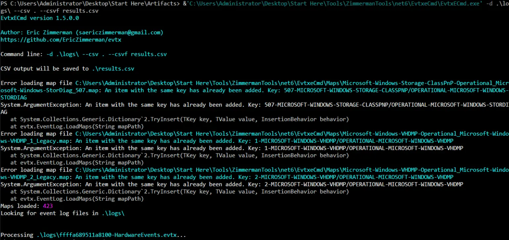

*Snippet of `EvtxECmd.exe` output*

We can then just drag and drop this into Timeline Explorer which gives us the following,

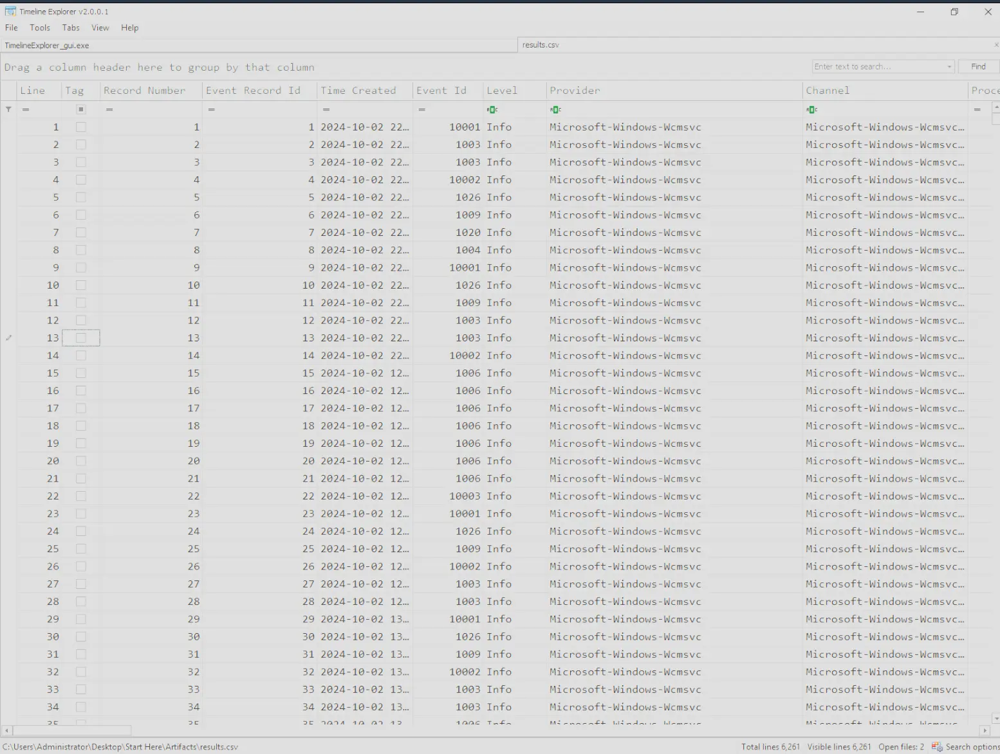

*`results.csv` loaded into Timeline Explorer*

With now a complete view of all Windows logs we can search for key terms in the logs.
We found out in our initial triage that there was a suspicious chain of processes specifically `explorer.exe` > `cmd.exe` > `powershell.exe`.
This could imply that `powershell.exe` was invoked using `cmd.exe`.
Let's try searching for `cmd.exe`.

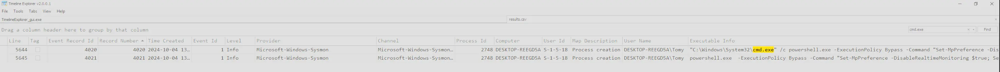

*Timeline Explorer output*

We can see that two logs are found with the following details
- Map Description: `Process creation`
- User Name: `DESKTOP-REEGD5A\Tomy`

Now if we look at Executable info we will see that these logs show the command `cmd.exe` was invoked with and the child `powershell.exe` process it spawned.
Let's look at the command that invoked `cmd.exe`.

```
"C:\Windows\System32\cmd.exe" /c powershell.exe -ExecutionPolicy Bypass -Command "Set-MpPreference -DisableRealtimeMonitoring $true; Set-MpPreference -DisableBehaviorMonitoring $true; Set-MpPreference -DisableIOAVProtection $true; Set-MpPreference -DisableScriptScanning $true; Set-MpPreference -DisableBlockAtFirstSeen $true; Set-MpPreference -DisableCloudProtection $true; Set-MpPreference -DisableArchiveScanning $true; Set-MpPreference -SubmitSamplesConsent 2; sc stop WinDefend; sc config WinDefend start= disabled; sc stop SecurityHealthService; sc config SecurityHealthService start= disabled; Start-Process 'E:\hidden\Trusted Installer.exe'"
```

This command means use `cmd.exe` to invoke `powershell.exe` with the following arguments then exit immediately after (`/c` argument).

This explains why we saw the processes in the `pslist` but not the corresponding `cmdline` record to show with what arguments they were invoked with. The `cmdline` field in Volatility 3 comes from the process PEB which only exists when the process is alive.

The author used `cmd.exe` as purely a launcher.
He used PowerShell to disable Microsoft Defender and start the malware at path `E:\hidden\Trusted Installer.exe`.

**Answer:** `E:\hidden\Trusted Installer.exe`

---
## Q4 — URL for C2 File
> Identifying the bot malware's C&C infrastructure is key for detecting IOCs. According to threat intelligence reports, what URL does the bot use to download its C&C file?

**Approach:** Search Timeline Explorer for `Trusted Installer` to surface the process creation event and extract its MD5 hash, then look it up on VirusTotal under Behaviour > MITRE ATT&CK > Command and Control.

Having found the name of the malicious executable, we can search through the logs to see how it interacted with the system.
Our main goal is to determine what URL the bot uses to download its C2 file.
Furthermore, the question specifically states `threat intelligence reports` so let's try finding something like a file hash that can be passed to platforms like VirusTotal.

First we just search `Trusted Installer` which gets us the following logs,

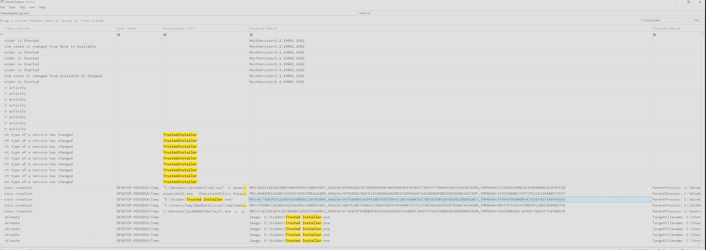

*Output of search*

We can see from the output that we have an MD5 hash of the created process from `E:\hidden\Trusted Installer.exe`.
Let's grab the MD5 hash which is `BC76BD7B332AA8F6AEDBB8E11B7BA9B6` then pass it to VirusTotal as seen below,

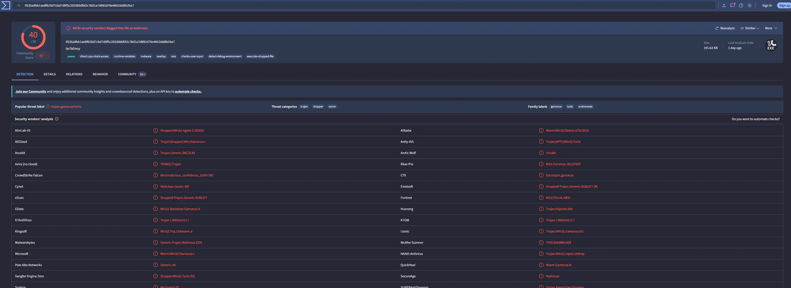

*Threat intelligence report of malware on VirusTotal*

As you can see, most security vendors have flagged this executable as malicious.
If we go under `Behaviour` then go to `MITRE ATT&CK Tactics and Techniques`, we will see a column for `Command and Control`.
In this column, is a clickable element labelled `Ingress Tool Transfer` which tells us that the malware downloads a file via `http://anam0rph.su/in.php`.

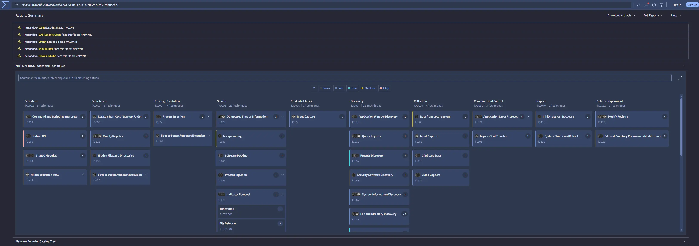

*Behaviors page*

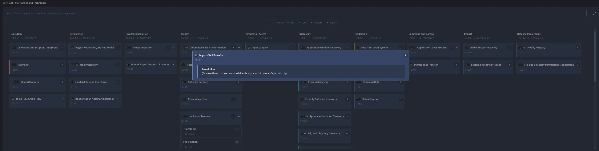

*Ingress Tool Transfer*

**Answer:** `http://anam0rph.su/in.php`

---
## Q5 — MD5 Hash of Dropped Executable
> Understanding the IOCs for files dropped by malware is essential for gaining insights into the various stages of the malware and its execution flow. What is the MD5 hash of the dropped **.exe** file?

**Approach:** Return to the Timeline Explorer search for `Trusted Installer`, sort records by time ascending to reveal file creation events, then search for the dropped executable name to retrieve its MD5 hash.

If we go back to our Timeline Explorer output after searching `Trusted Installer` and sort the records by time ascending.
We will see the following,

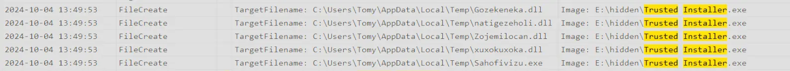

*File create records*

Therefore, the malware drops multiple DLLs as well as an executable `C:\Users\Tomy\AppData\Local\Temp\Sahofivizu.exe`.
Finding the MD5 hash for this is easy as we now have the actual file name.
We just search `Sahofivizu.exe` then find the following record,

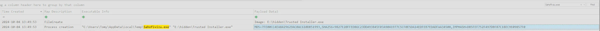

*Finding `Sahofivizu.exe` event logs*

Which gives us the MD5 hash `7FE00CC4EA8429629AC0AC610DB51993`.

**Answer:** `7FE00CC4EA8429629AC0AC610DB51993`

---
## Q6 — Full Path of First Dropped DLL
> Having the full file paths allows for a more complete cleanup, ensuring that all malicious components are identified and removed from the impacted locations. What is the full path of the first **DLL** dropped by the malware sample?

We have already seen this in the previous question in the file create records output.
Since the output was sorted by time ascending, the full path of the first DLL dropped is `C:\Users\Tomy\AppData\Local\Temp\Gozekeneka.dll`.

**Answer:** `C:\Users\Tomy\AppData\Local\Temp\Gozekeneka.dll`

---
## Q7 — APT Group Behind the Campaign
> Connecting malware to APT groups is crucial for uncovering an attack's broader strategy, motivations, and long-term goals. Based on IOCs and threat intelligence reports, which APT group reactivated this malware for use in its campaigns?

**Approach:** Research the C2 domain `anam0rph.su` online to find threat intelligence linking it to a known botnet and the APT group that reactivated it.

Recall that the C2 domain contacted by this malware was `http://anam0rph.su/in.php`.
If we research into this URL we will find that this domain was actually associated with the `Andromeda botnet`, a commodity malware that was prevalent in the 2010s.
We will also find this threat intelligence blog on Google Cloud — [Turla: A Galaxy of Opportunity | Mandiant | Google Cloud Blog](https://cloud.google.com/blog/topics/threat-intelligence/turla-galaxy-opportunity/) — which tells us that the APT group that reactivated this was `Turla`.

**Answer:** `Turla`

---
# Completion

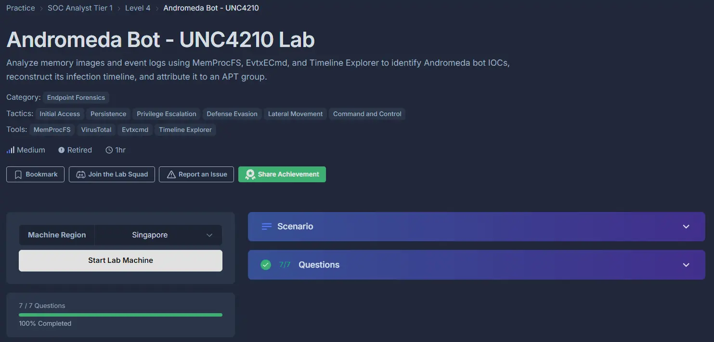

I successfully completed Andromeda Bot - UNC4210 Blue Team Lab at @CyberDefenders!
https://cyberdefenders.org/blueteam-ctf-challenges/achievements/francisvil3213/andromeda-bot-unc4210/
