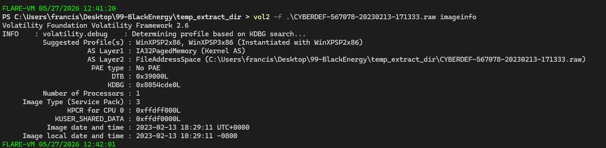
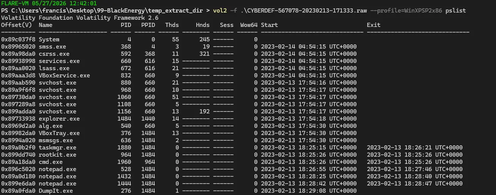
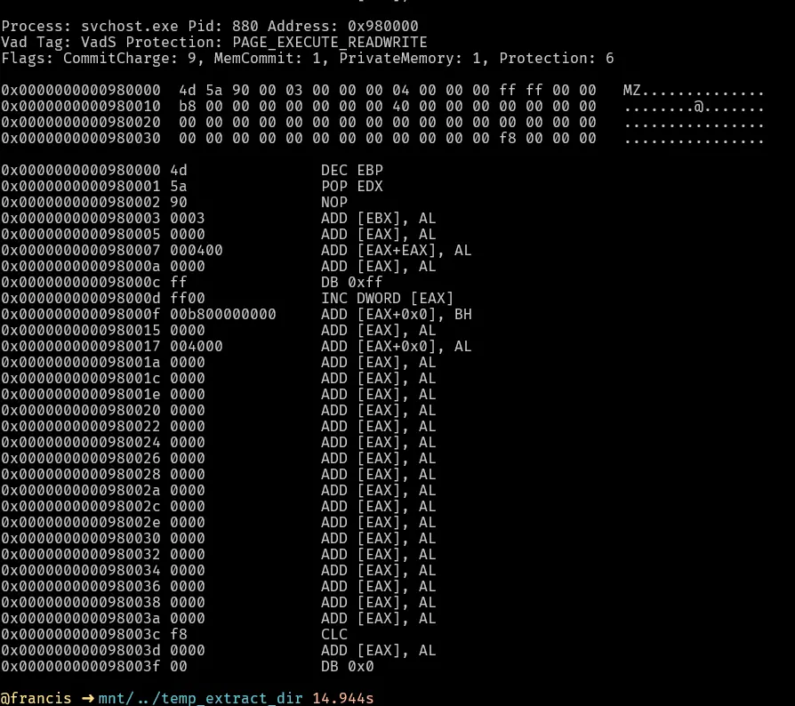
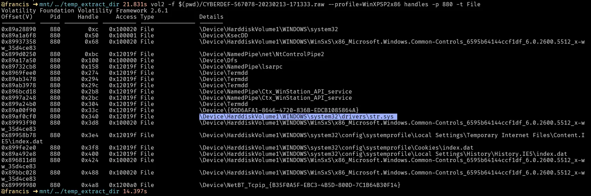
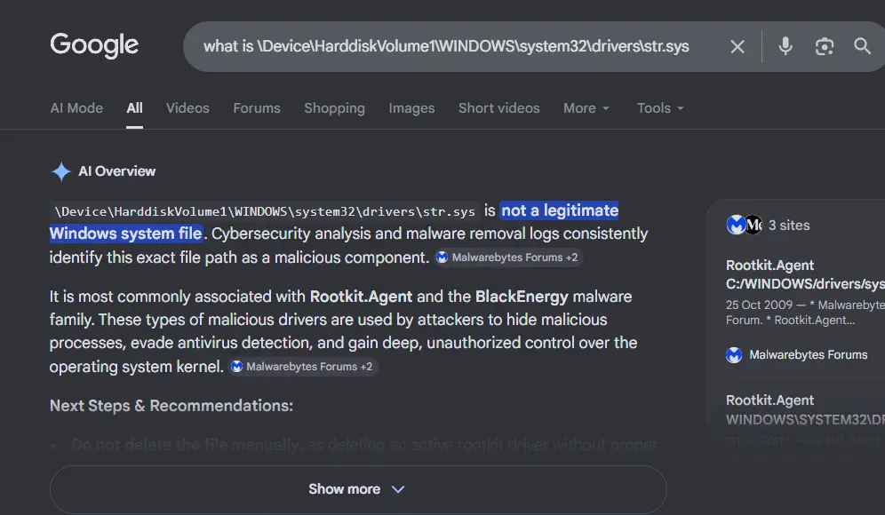
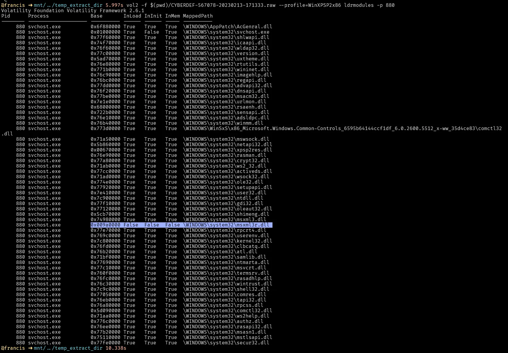
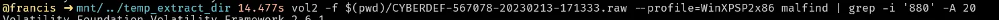
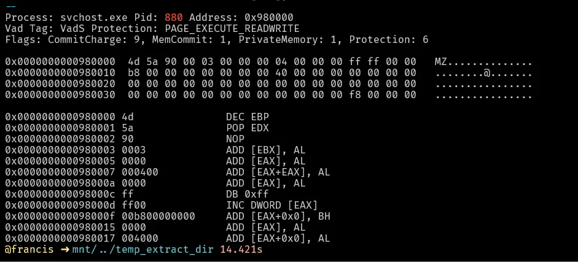
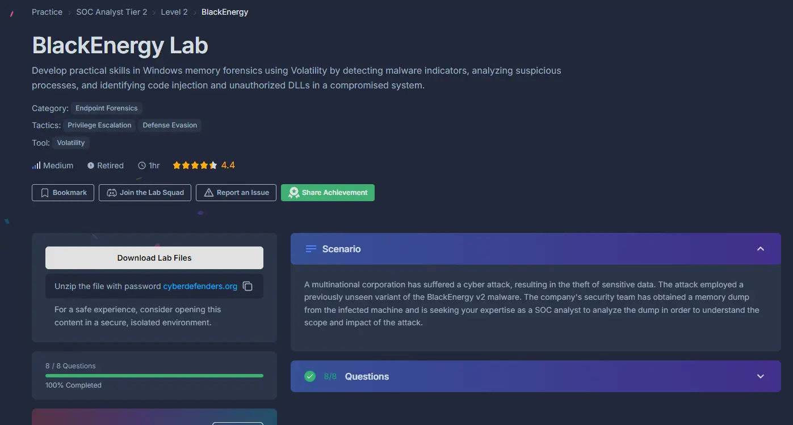

#volatility2 #endpoint-forensics #ldrmodules #injected-dll #cyberdefender-medium #reviewed #finished

# Scenario

A multinational corporation has suffered a cyber attack, resulting in the theft of sensitive data. The attack employed a previously unseen variant of the BlackEnergy v2 malware. The company's security team has obtained a memory dump from the infected machine and is seeking your expertise as a SOC analyst to analyze the dump in order to understand the scope and impact of the attack.

# Questions
## Q1 — Volatility Profile
>Which volatility profile would be best for this machine?

This is trivially answered by just using imageinfo.
This is also the necessary first step as without a profile, volatility cannot properly map the memory locations.



**Answer:** `WinXPSP2x86`

---
## Q2 — Number of Processes
>How many processes were running when the image was acquired?

After getting the profile, we run a pslist to see all the processes.



Notice that there are 25 processes, but 6 of them were exited as shown by the timestamp on the right side.
Therefore, we only have 19 running processes at the time of image dump.

**Answer:** `19`

---
## Q3 — Process ID of CMD
>What is the process ID of `cmd.exe`?

We can see from the pslist output that the PID is `1960`.


**Answer:** `1960`

---
## Q4 — Suspicious Process
>What is the name of the most suspicious process?

We can see from the pslist output a process called `rootkit.exe`.
This is highly suspect because a rootkit is a type of stealthy malware designed to evade detection and give an unauthorised threat actor administrator-level access to a computer.


**Answer:** `rootkit.exe`

---
## Q5 — Code Injection
>Which process shows the highest likelihood of code injection?

For this, we use a plugin for volatility called `malfind` that helps us to find potentially injected code or hidden malware in a memory image by scanning process memory.
There will be some processes that are legitimate that get flagged, but there will be one that is highly suspect.
This `svchost.exe` is highly suspect because of the following:
- The type of memory region is `VadS` which means it is private/anonymous memory not backed by a file. This means the memory region was allocated privately (e.g. via VirtualAlloc) with no corresponding file on disk.
- This region of memory has the magic bytes `MZ` which is the file signature of a Windows executable file.
- The area of memory has RWX permissions; legitimate loaded modules will usually only have 2 of the 3. Having all three is highly suspect.

These 3 reasons together heavily imply that there was code injected into `svchost.exe`.
`svchost.exe` is an attractive injection target because it runs as `SYSTEM`, the highest privilege on Windows, and the injected code will inherit those privileges.



**Answer:** `svchost.exe`

---
## Q6 — Path of Odd File
>There is an odd file referenced in the recent process. Provide the full path of that file.

To see what file is referenced by the above process, we check what handles of type `File` it was holding.



`svchost` should not be handling any `sys` files as `sys` files are kernel-mode device drivers and `svchost` runs in user-mode.
Therefore, `svchost`, which operates entirely in user-mode, should not be handling or loading a kernel-mode file.
Furthermore, Googling this path quickly tells us that it is malware.



**Answer:** `C:\WINDOWS\system32\drivers\str.sys`

---
## Q7 — Injected DLL
>What is the name of the injected DLL file loaded from the recent process?

We use ldrmodules here instead of dlllist. DllList basically only reads the InLoadOrder linked list, which means injected DLLs will not show up.
ldrmodules actually reads through the raw memory and finds the MZ magic bytes and also reads through all 3 linked lists.
It compares the results of both the scan of the memory and reading the linked lists and reports discrepancies.



This DLL stands out because:
- InLoad = False → means that the Windows loader never recorded loading it
- InInit = False → means that this DLL was never properly initialized by Windows
- InMem = False → the DLL is not in the memory order list at all

**Answer:** `msxml3r.dll`

---
## Q8 — Base of Injected DLL
>What is the base address of the injected DLL?

We can find the address by using `malfind`.



This tells us the address is `0x980000`.



**Answer:** `0x980000`

# Notes
## Summary of The 3 PEB Loader Linked Lists

### InLoadOrder

- Records DLLs **chronologically as the Windows loader loads them**
- Built from the **Import Table** at launch + any `LoadLibrary()` calls at runtime
- Answers: **"What DLLs did Windows loader touch and when?"**

```
ntdll.dll → kernel32.dll → advapi32.dll → ...
(first loaded)              (last loaded)
```

### InMemOrder

- Records DLLs **sorted by their base address in memory**
- An **index/lookup optimization** so Windows doesn't iterate to find where a DLL lives
- Answers: **"Where does this DLL live in memory?"**

```
0x5ad70000 → 0x6f880000 → 0x7c800000 → ...
(lowest address)           (highest address)
```

### InInitOrder

- Records DLLs **after their DllMain() constructor finishes**
- Only DLLs that are **fully set up and ready to use**
- ntdll.dll is never here (no DllMain)
- Answers: **"Which DLLs have finished constructing and are ready?"**

```
kernel32.dll → advapi32.dll → ...
(finished DllMain first)
```

### Together

|List|Analogy|Answers|
|---|---|---|
|InLoadOrder|Chronological arrival log|When did Windows load it?|
|InMemOrder|Desk location directory|Where is it in memory?|
|InInitOrder|"Ready to work" list|Has it finished setting up?|

### The Forensics Takeaway

```
Legitimate DLL = appears in ALL 3 lists
Injected DLL   = missing from ALL 3 lists
                 but EXISTS in raw memory scan
                        ↓
               Bypassed Windows loader completely
                        ↓
                  = Confirmed injection
```

# Completion


