#endpoint-forensics #volatility3 #hex-dump #byte-offset #cyberdefender-medium #reviewed #finished

# Scenario

Investigate Windows memory images using Volatility3, PowerShell, and a hex editor to extract system artifacts, analyze processes, network connections, and reconstruct user activity.

# Questions
## Q1 — Time of RAM Image
>What time was the RAM image acquired according to the suspect system?

Volatility 3 has a plugin, `windows.info.Info`, that provides basic information about the memory image being analyzed, including the acquisition timestamp.

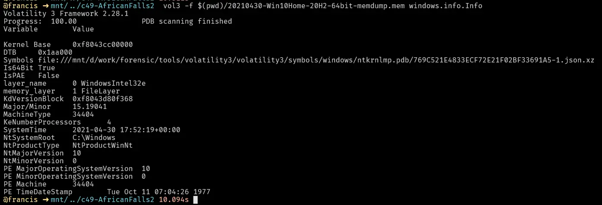

*Volatility 3 `windows.info` output showing the image acquisition time.*

**Answer:** `2021-04-30 17:52`

---
## Q2 — SHA256 Hash Value
>What is the SHA256 hash value of the RAM image?

We can get this by just using `sha256sum` on Linux systems or running `Get-FileHash` in PowerShell on Windows.

```
sha256sum <memory.dmp>
```

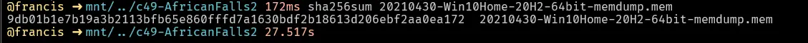

*SHA256 hash of the RAM image.*

**Answer:** `9db01b1e7b19a3b2113bfb65e860fffd7a1630bdf2b18613d206ebf2aa0ea172`

---
## Q3 — Process ID of Brave
>What is the process ID of **brave.exe**?

To find the process ID we use the plugin `windows.pslist`, which lists all the processes at the time of image capture.

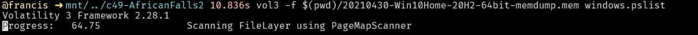

*Full `windows.pslist` output.*

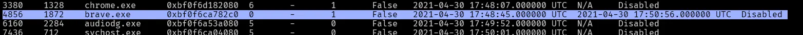

*brave.exe entry showing its process ID.*

**Answer:** `4856`

---
## Q4 — Number of Network Connections
>How many established network connections were there at the time of acquisition?

To find out what network connections were established, we use the plugin `windows.netscan` and filter with `grep -i established`. This lists all the network connections and filters for the ones that were established.

```
grep -i established
```

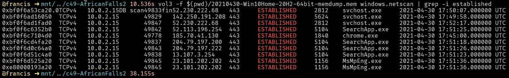

*`windows.netscan` output filtered to show only established connections.*

**Answer:** `10`

---
## Q5 — Domain Name
>Which domain name does Chrome have an established network connection with?

From the `windows.netscan` output, we see that Chrome has an established connection to `185.70.41.130`.
We perform a whois lookup on this and find that it belongs to the domain `protonmail.ch`.

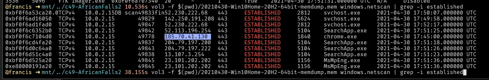

*Chrome's established connection to `185.70.41.130` in netscan output.*

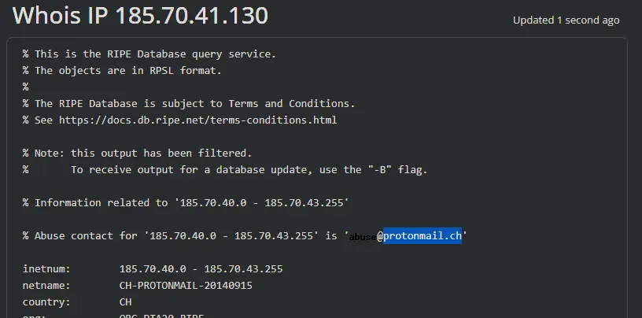

*Whois lookup confirming `185.70.41.130` belongs to `protonmail.ch`.*

**Answer:** `protonmail.ch`

---
## Q6 — MD5 Hash of PID 6988
>What is the MD5 hash value of the process executable for PID **6988**?

In Volatility 3, to dump a process's memory we use the plugin `windows.pslist` with arguments `--dump --pid 6988`.

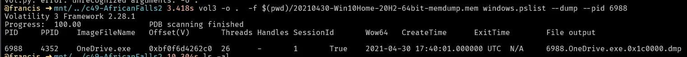

*Dumping the PID 6988 process executable with `--dump --pid 6988`.*

Then we just use `md5sum` on Linux systems or `Get-FileHash` in PowerShell on Windows.

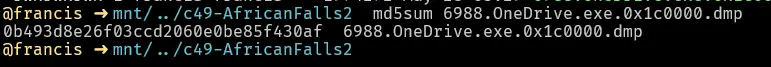

*MD5 hash of the dumped executable.*

**Answer:** `0b493d8e26f03ccd2060e0be85f430af`

---
## Q7 — Word at Offset
>Can you identify the word that begins at offset **0x45BE876** and is 6 bytes long?

We can do this using `xxd` where:
`-s` → seek/start offset (byte offset)
`-l` → length of whatever we are seeking in bytes starting from offset

```
xxd -s 0x45BE876 -l 6 <memory.dmp>
```

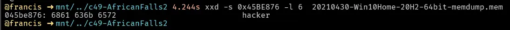

*`xxd` output showing the 6-byte value at offset `0x45BE876`.*

Or using HxD: `Ctrl+G` → enter the offset → cursor jumps to that byte.

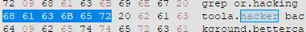

*HxD navigated to offset `0x45BE876`.*

**Answer:** `hacker`

---
## Q8 — Creation Date & Time
>What is the creation date and time of the parent process of **powershell.exe**?

In Volatility 3, we need to use `windows.pslist` and grep for the parent PID of powershell.
The reason we use `windows.pslist` and `grep` is because the Volatility 3 implementation of `pstree` does not include the creation date and time.

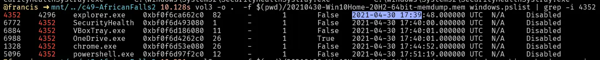

*`windows.pslist` output showing powershell.exe's parent process and its creation time.*

**Answer:** `2021-04-30 17:39`

---
## Q9 — Last File Opened in Notepad
>What is the full path and name of the last file opened in notepad?

To answer this we use `windows.cmdline` and `grep` for notepad.
This tells us how notepad is being invoked and what argument it is being invoked with (i.e. what files it was opening).
Thankfully, there is only one record, so we know the last file opened in notepad is this entry.

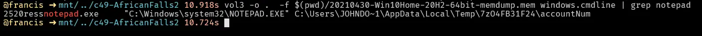

*`windows.cmdline` output for notepad.exe showing the last opened file path.*

**Answer:** `C:\Users\JOHNDO~1\AppData\Local\Temp\7zO4FB31F24\accountNum`

---
## Q10 — Time Spent on Brave
>How long did the suspect use **Brave** browser? (In Hours)

For this we use `windows.registry.userassist`, which tells us the total time the user had the window in focus.

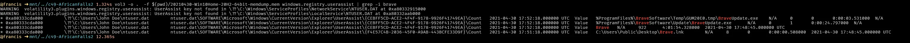

*`windows.registry.userassist` output showing Brave's total focus time.*

**Answer:** `4`

# Completion

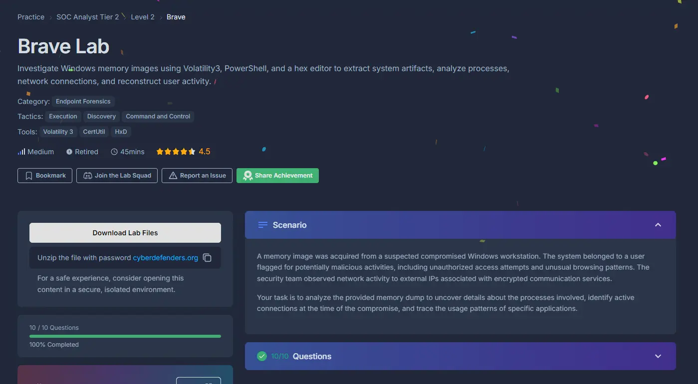
