#endpoint-forensics #volatility2 #powershell #shimcache #strings #cyberdefender-medium #reviewed #finished

# Scenario

A SOC analyst took a memory dump from a machine infected with a meterpreter malware. As a Digital Forensicator, your job is to analyze the dump, extract the available indicators of compromise (IOCs) and answer the provided questions.

# Questions
## Q1 — SHA1 Hash of Dump
>What is the SHA1 hash of Triage-Memory.mem (memory dump)?

We use `Get-FileHash` in PowerShell on Windows to get the hash of the memory dump.
Similarly, on Linux we can use `sha1sum`.

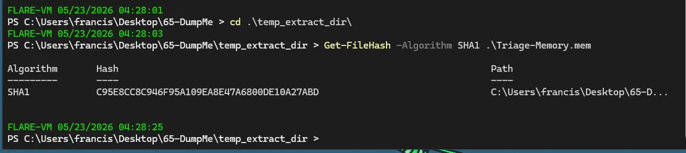

**Answer:** `C95E8CC8C946F95A109EA8E47A6800DE10A27ABD`

---
## Q2 — Volatility Profile Selection
>What volatility profile is the most appropriate for this machine? (ex: Win10x86_14393)

In volatility2, we need a profile, otherwise it will not be able to properly map memory locations.
We get suggested profiles using `imageinfo`.

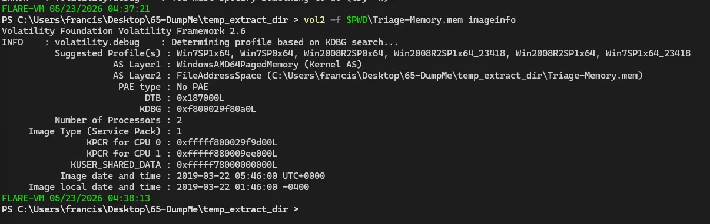

**Answer:** `Win7SP1x64`

---
## Q3 — Process ID of Notepad
>What was the process ID of notepad.exe?

We use the vol2 plugin `pslist` to list all the processes at the time of image capture and do a `sls`, the cmdlet for `select-strings`, for `notepad`.
This gets us the PID of notepad, which is `3032`.

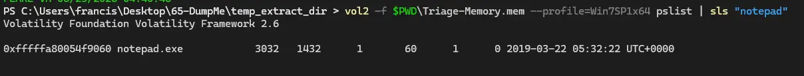

**Answer:** `3032`

---
## Q4 — Child Process of Wscript
>Name the child process of wscript.exe.

For this we use the plugin `pstree`, which shows the parent processes and their subsequent child processes.
We then do a `sls` for `wscript` with a context window of `0,10` which means include 10 lines after the match and 0 lines before the match.

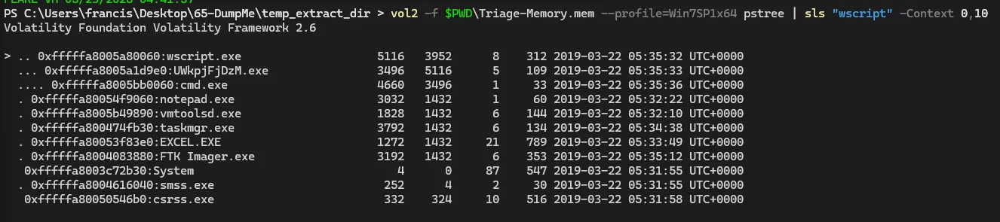

**Answer:** `UWkpjFjDzM.exe`

---
## Q5 — IP Address of Machine
>What was the IP address of the machine at the time the RAM dump was created?

For this we use `netscan`, which shows the network connections established at the time the RAM dump was created.
We can see the local IPv4 address is `10.0.0.101`.

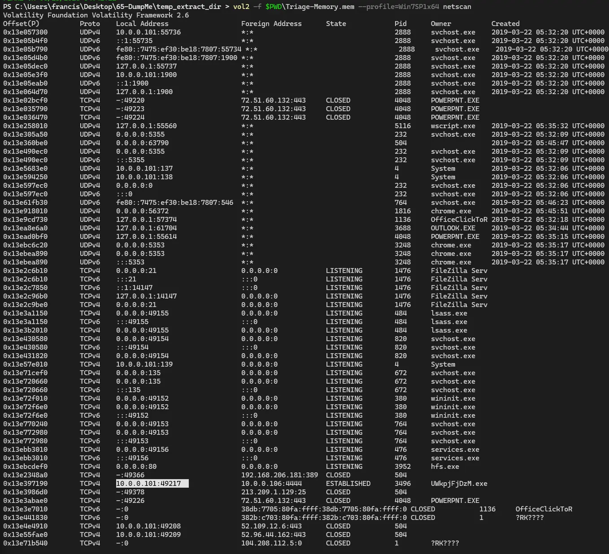

**Answer:** `10.0.0.101`

---
## Q6 — Attacker IP Address
>Based on the answer regarding the infected PID, can you determine the IP of the attacker?

We know the infected PID is `3496`, so we can find the IP of the attacker by checking if that process has established any network connections.
We can see this in the `netscan` output where PID `3496` has an established connection to `10.0.0.106`.

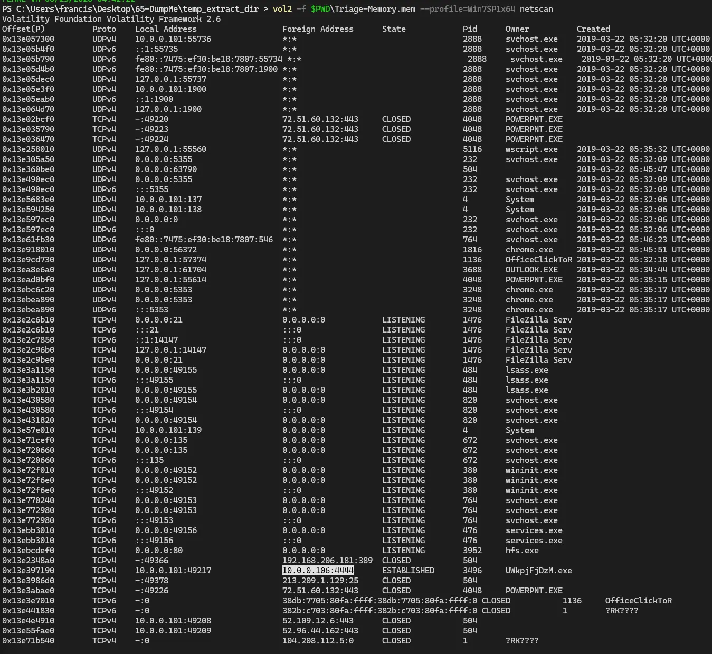

**Answer:** `10.0.0.106`

---
## Q7 — Number of Associated Processes
>How many processes are associated with VCRUNTIME140.dll?

For this we use the `dlllist` plugin and `sls` for `vcruntime140`.
This shows us how many processes are handling `VCRUNTIME140.dll`.

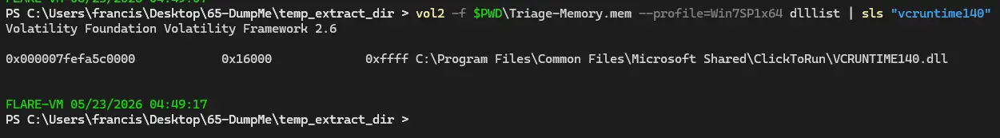

Note:
The command is actually correct, but only returns 1 process in my case.
I checked the sha1sum in question 1 and it matches, so the memory dump is not corrupted.
I am not sure why my output differs from the actual answer, but the command used here is correct.

**Answer:** `5`

---
## Q8 — MD5 of Infected Process
>After dumping the infected process, what is its md5 hash?

We first dump the process with PID `3496` using `procdump`.

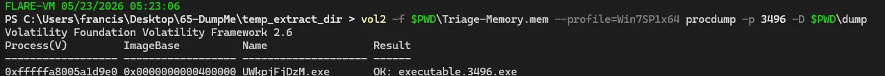

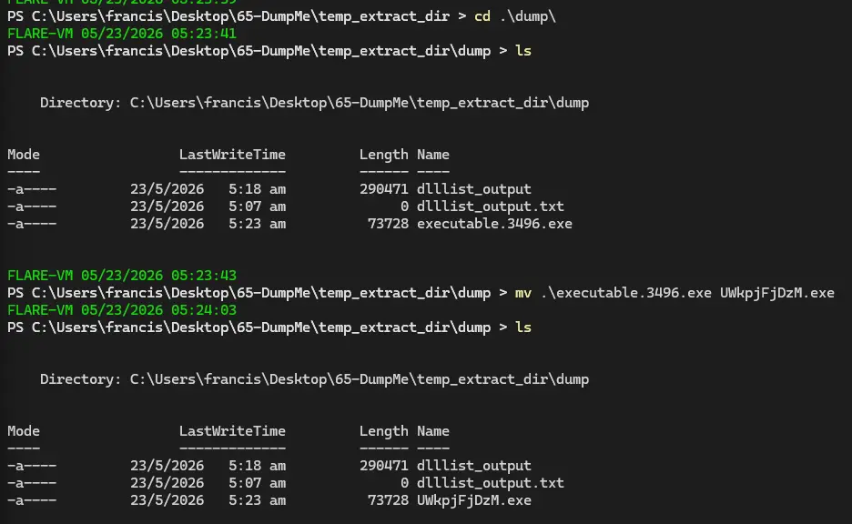

We then use `Get-FileHash` to get the MD5 hash of the malicious process.

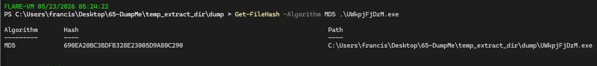

**Answer:** `690ea20bc3bdfb328e23005d9a80c290`

---
## Q9 — LM Hash of Bob's Account
>What is the LM hash of Bob's account?

This is trivially solved using the `hashdump` plugin, where the LM hash of Bob's account is the first hash (left to right) in his entry.

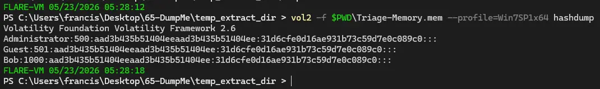

**Answer:** `aad3b435b51404eeaad3b435b51404ee`

---
## Q10 — Memory Protection Constants of VAD Node
>What memory protection constants does the VAD node at 0xfffffa800577ba10 have?

We use the `vadinfo` plugin for this and `sls` the memory location in the question to find the one we want.

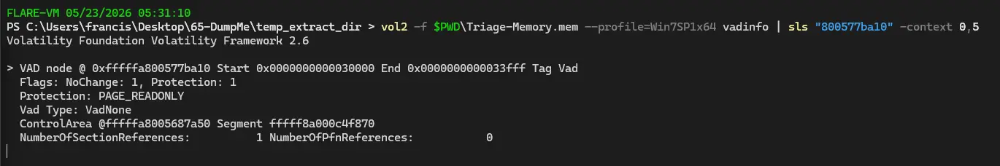

**Answer:** `PAGE_READONLY`

---
## Q11 — Memory Protection of VAD Range
>What memory protection did the VAD starting at 0x00000000033c0000 and ending at 0x00000000033dffff have?

Similarly, we use `vadinfo` again, but this time `sls` has two positive lookaheads. This causes the command to return matches that contain both values simultaneously.

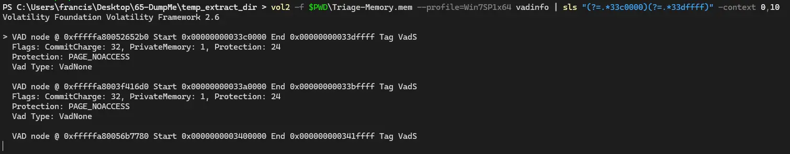

**Answer:** `PAGE_NOACCESS`

---
## Q12 — Name of VBS Script
>There was a VBS script that ran on the machine. What is the name of the script? (submit without file extension)

We use `cmdline` here because it scans how programs were invoked and what arguments were passed to them.
If a VBS script ran, it means wscript must have been invoked with the file as the argument.
Therefore, we can see the name of the script by looking through `cmdline`.

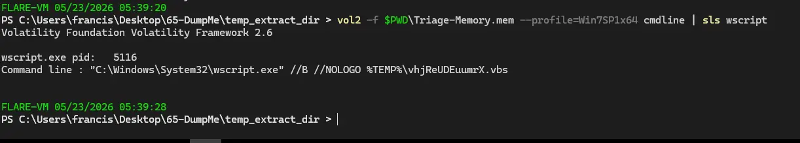

**Answer:** `vhjReUDEuumrX`

---
## Q13 — Application Run at Specific Timestamp
>An application was run at 2019-03-07 23:06:58 UTC. What is the name of the program? (Include extension)

`shimcache` is a plugin that allows us to track which executable files have been run or were present on the system.
It works by extracting the `Application Compatibility Cache` from a Windows memory image.
We can then `sls` for that timestamp to find what program was last modified at that time.

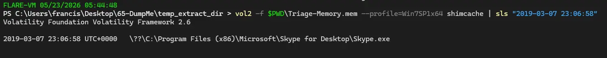

**Answer:** `Skype.exe`

---
## Q14 — Notepad Content at Time of Dump
>What was written in notepad.exe at the time when the memory dump was captured?

To figure this out we can dump the entire addressable memory of the notepad process using `memdump`.

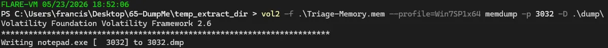

We can then rename the dump to notepad_memdump, then perform strings on it.
We will send the strings output into a text file, so it is easier to analyse.
It should also be noted that `-u` is passed to `strings` because Windows uses little endian.

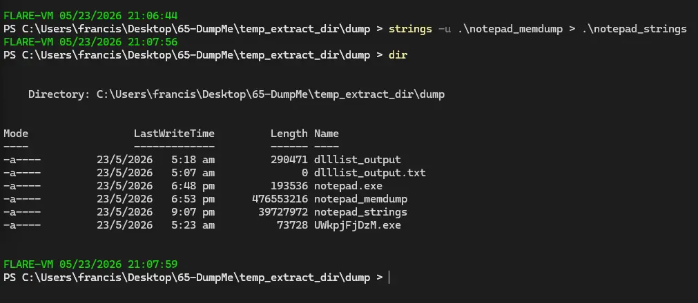

We can create a regex pattern based on the CyberDefenders censored placeholder.

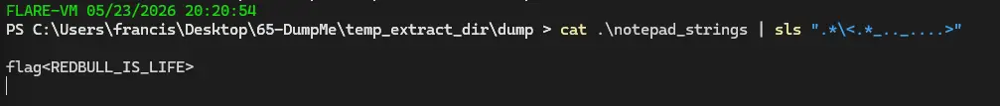

Though this is a pretty cheesy way of doing it, a more proper way is just to grep for some key terms like `flag` or a regex pattern like `.+\<.+>`.
Also a small note, we do not need to actually escape `<` or `>` here.

**Answer:** `flag<REDBULL_IS_LIFE>`

---
## Q15 — Short Name of File Record 59045
>What is the short name of the file at file record 59045?

To get the short name of a file we need to check the `MFT` which is the master file table.
To see the `MFT` we need to use `mftparser`.
Then we just `sls` for file record `59045`.

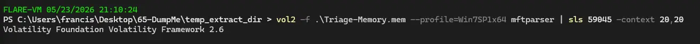

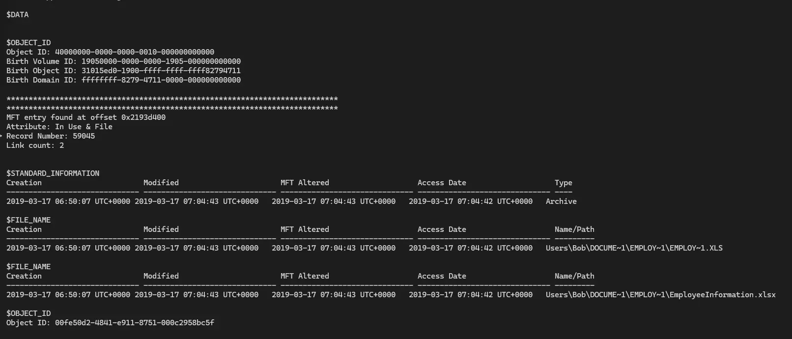

**Answer:** `EMPLOY~1.XLS`

---
## Q16 — Infected PID (Meterpreter)
>This box was exploited and is running meterpreter. What was the infected PID?

Meterpreter is a payload in Metasploit that functions as a RAT. We can check netscan to see if there are any services that connect on the default Metasploit port (4444).

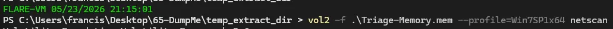

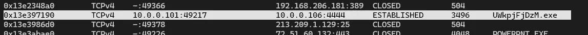

The PID is 3496, which corresponds to the infected process we found earlier.

**Answer:** `3496`

# Completion

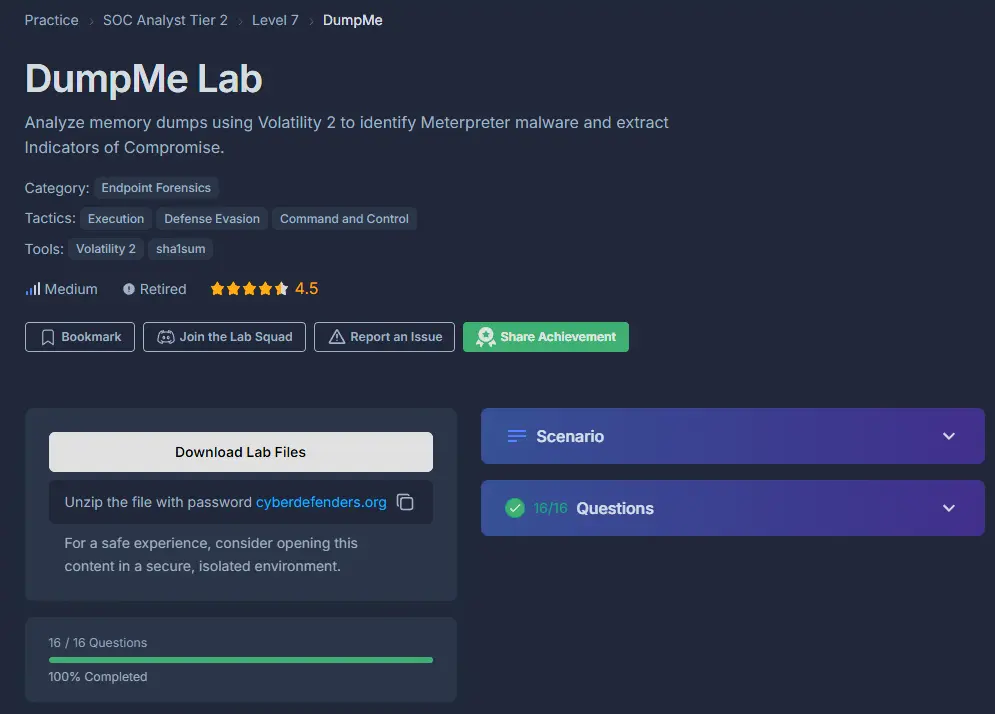
