#cyberdefender-medium #endpoint-forensics #finished #reviewed
# Scenario
A company's security team detected unusual network activity linked to a potential malware infection. As a forensic analyst, your mission is to investigate a memory dump, identify the malicious process, extract artifacts, and uncover Command and Control (C2) communications. Using `Volatility3`, analyze the attack, trace its origin, and provide actionable intelligence.
# Investigation
## Finding Leads
To get started on the investigation, let's gather some basic information about the memory dump.

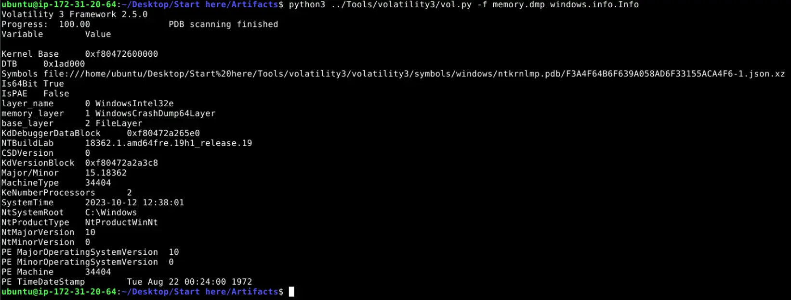

__`windows.info.Info` output__

The memory dump is of a system running Windows 10 and the captured system time was `2023-10-12 12:38:01`.

Let's look for some leads to chase.
Running `windows.pslist` gets us the following,

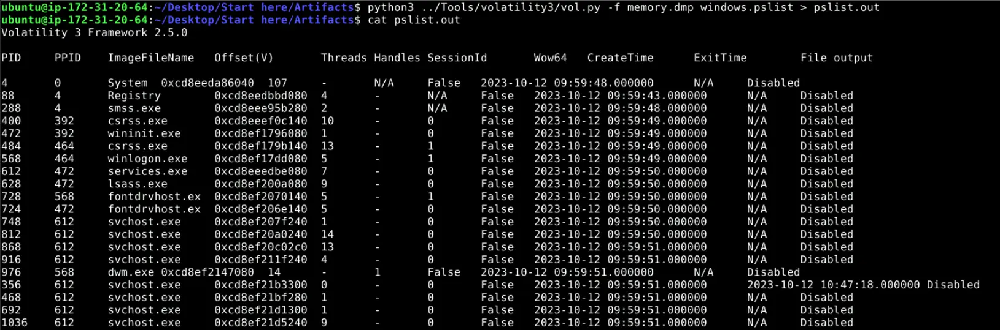

__Snippet of `pslist` output__

The output of the command is directed to a file ,`pslist.out`, so we do not need to keep rerunning the command.
To get the low hanging fruit out of the way, let's `grep` for `cmd` and `powershell` to see if any of these processes were captured.

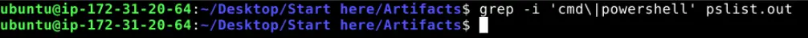

__grep result__

No instances of `cmd` or `powershell` were captured in this memory dump.
A manual scan of the process list reveals a captured `EXCEL.EXE` process during the time of the suspicious activity.
This is of significance because threat actors very commonly utilise office documents (`.docm`, `.xlsm`, etc.) with embedded malicious scripts as their vector for initial access.
One of the most prolific examples of which is `emotet`.

Running `windows.cmdline` gets us the following,

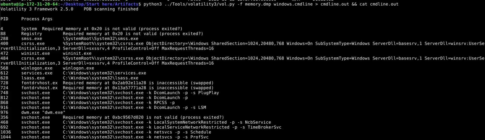

__Snippet of `cmdline` output__

`cmdline` can give us an idea of how a program was invoked.
Using `grep` to find `excel.exe` reveals that it was invoked with the argument `/dde`.

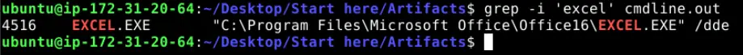

__`grep` of `excel`__

A Google search of what this argument is will tell us that `/dde` is a legacy command-line switch for Office applications that tells the app to launch as a `DDE` server.
This is odd because a normal user will rarely if ever find a legitimate use case for this mode in modern workflows especially since launching office applications in `DDE` server mode is actually disabled by default in patched recent versions of office apps.
Furthermore, Microsoft has made deliberate efforts to lock down launching office apps in `DDE` server mode to combat attackers using it as a means to spread malware as detailed [here](https://learn.microsoft.com/en-us/troubleshoot/microsoft-365-apps/excel/security-settings) (Last updated 04/01/2026) .
This implies that the endpoint was likely either using an unpatched version of Microsoft Excel or had its security settings in `Trust Center` misconfigured or intentionally re-enabled to either support legacy workflows or allow for another niche use case.
Regardless, the fact that `excel` was invoked to launch with `/dde` is highly suspect and warrants further investigation.

## Excel
The facts gathered about `excel.exe` such as how it was invoked with `/dde` and it was captured during the time of the suspicious activity has made it a strong lead.
We can dump the files related to this process using the `windows.dumpfiles` plugin available in `Volatility3`.
The reason for doing this is to see if we can further our investigation by checking if the process has any open handles to any files at the time of capture that could possibly be malicious.

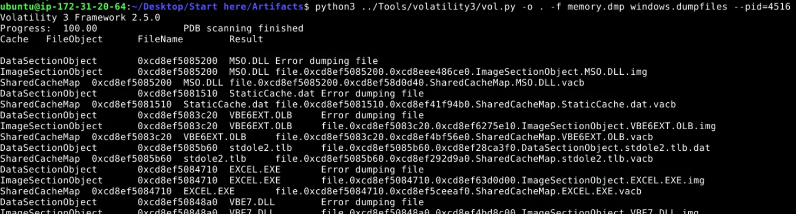

__Running `windows.dumpfiles`__

After the plugin is done running, check the dumped files if any of them have an `excel` file extension.

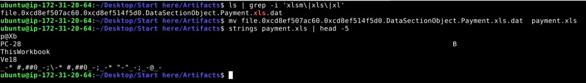

__Checking for excel files__

From the output, `excel` had an open file handle to `Payment.xls`.
Checking the location of this file on disk through the provided `windows.filescan.txt` artifact shows that this file was opened from the `\Users\PC-28\Downloads`.

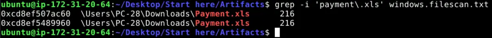

__Finding location of this file on disk__

Let's retrieve the checksum of this file and use `OSINT` to check if there are any reports on this file.

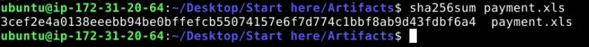

__Checksum of `Payment.xls`__

Submitting this hash to `VirusTotal` tells us that this file was flagged by 37 out of 62 security vendors as malicious.
Most of which are labelling it as a downloader `trojan`.

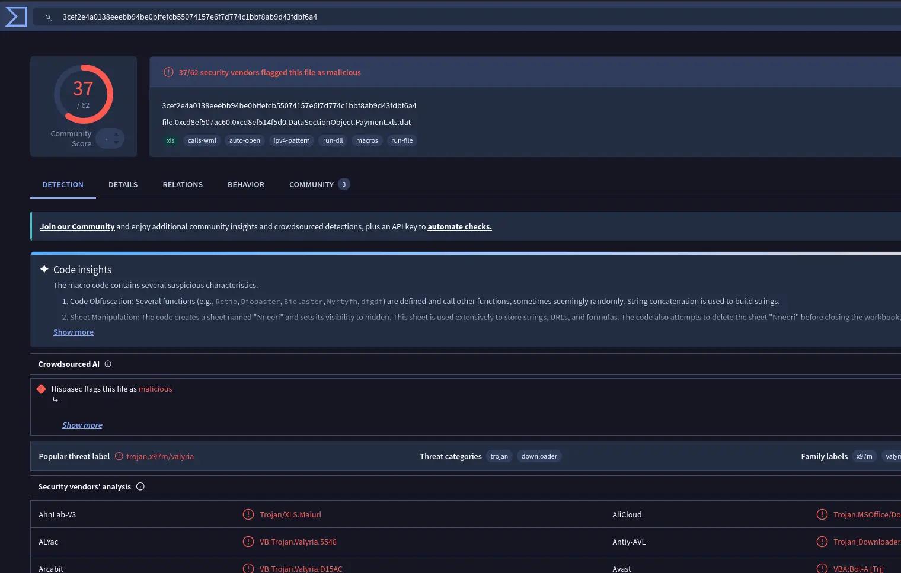

__`VirusTotal` report__

Going under the `Behaviour` tab we will also see that it matches rule `MALWARE-CNC Win.Trojan.IcedID download attempt`.
`IcedID` is a modular banking malware and is known to be downloaded by `emotet` in multiple campaigns ([Source](https://attack.mitre.org/software/S0483/)) .

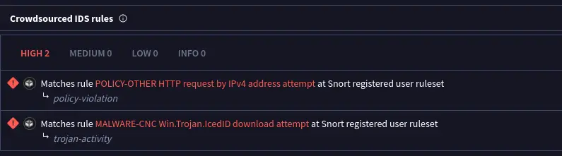

__Rule matching__

Under `Network Communication > IP Traffic` is a list of IPs that the malware contacts as well as the port used.

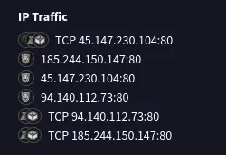

__List of IPs__

The next logical step is then to check if the captured memory dump has made any connections to these known malicious IPs.

# Network Activity
The connections we are looking for are connections made to the following `IP:PORT`,
- `94.140.112.73:80`
- `45.147.230.104:80`
- `185.244.150.147:80`

The provided artifacts include a `windows.netscan.txt`.
A grep of the netscan file shows that the end point has connected to 2 of the 3 known malicious IPs.

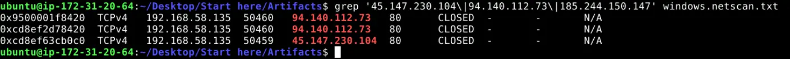

__`grep` of netscan file__

# Summary of findings
The analysis of the memory dump reveals a malware infection initiated through a malicious `excel` document.

The initial lead was the `excel` process that was invoked with `/dde`, which is a legacy switch for launching the application in `DDE` server mode.
This switch is rarely if ever used in modern workflows and is disabled by default on recent patched versions of office apps.
The invocation of an `excel` process with this switch should be treated as an anomaly and is commonly associated with techniques for initial access by threat actors rather than legitimate use.

Dumping files associated with the suspect `excel` process yields a legacy excel file, `Payment.xls`, which has `SHA256` checksum of `3cef2e4a0138eeebb94be0bffefcb55074157e6f7d774c1bbf8ab9d43fdbf6a4`.
The file was located in `\Users\PC-28\Downloads`.
Submission of this file hash to `VirusTotal` alerts that this file was flagged by 37 out of 62 vendors as malicious with detections categorizing it as a downloader trojan.

Attempts to communicate to known C2 infrastructure was captured and is validated through the analysis of the memory dump's network artifacts.
The infected endpoint tried to connect to 2 out of the 3 malicious IPs listed in the behavioural analysis available on `VirusTotal`.

# Note
In the investigation, the behaviour analysis on `VirusTotal` shows that crowd sourced IDS rules fire an alert on rule `MALWARE-CNC Win.Trojan.IcedID download attempt`.
`IcedID` is a modular banking malware that is downloaded by `emotet` and one of the listed campaigns on the MITRE ATT&CK is campaign `C0037` named `Water Curupira Pikabot Distribution` ([Source](https://attack.mitre.org/software/S0483/)).
Clicking into this campaign reveals that this activity followed the take-down of QakBot (alias QBot) with the campaign details noting several technical overlaps and similarities.
The technical overlaps and similarities are likely why there was a rule match for this `sample` attributing it to `IcedID` despite the challenge itself being named `QBot`.
# Questions
## Q1 — First IP address
>Our first step is identifying the initial point of contact the malware made with an external server. Can you specify the first IP address the malware attempted to communicate with?

**Answer:** `94.140.112.73`

---

## Q2 — Second IP address
>We need to determine if the malware attempted to communicate with another IP. Which IP address did the malware attempt to communicate with again?

**Answer:** `45.147.230.104`

---

## Q3 — Process Name
>Identifying the process responsible for this suspicious behavior helps reconstruct the sequence of events leading to the execution of the malware and its source. What is the name of the process that initiated the malware?

**Answer:** `excel.exe`

---

## Q4 — Malicious File
>The malware's file name is crucial for further forensic analysis and extracting the malware. Can you provide its file name?

**Answer:** `Payment.xls`

---

## Q5 — File Hash
>Hashes are like digital fingerprints for files. Once the hash is known, it can be used to scan other systems within the network to identify if the same malicious file exists elsewhere. What is the SHA256 hash of the malware?

**Answer:** `3cef2e4a0138eeebb94be0bffefcb55074157e6f7d774c1bbf8ab9d43fdbf6a4`

---

## Q6 — UTC Creation Time
>To trace the origin of the malware and understand its development timeline, can you provide the UTC creation time of the malware file?

This is trivially answered using the `VirusTotal` report by navigating to `Details`, which shows the following,

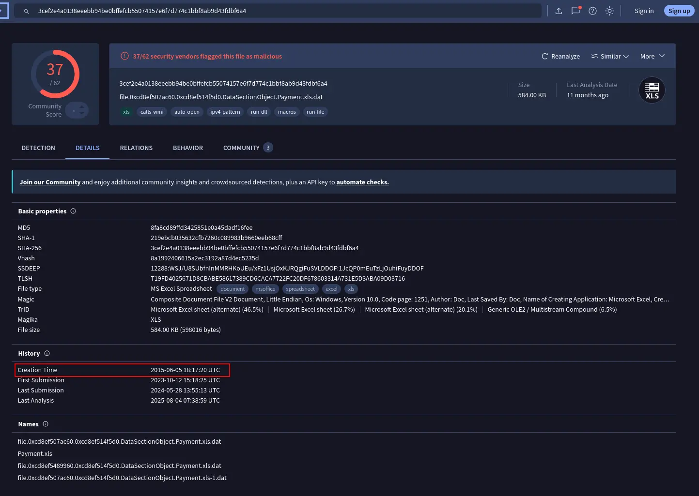

__Creation Time__

**Answer:** `2015-06-05 18:17`

---
# Completion

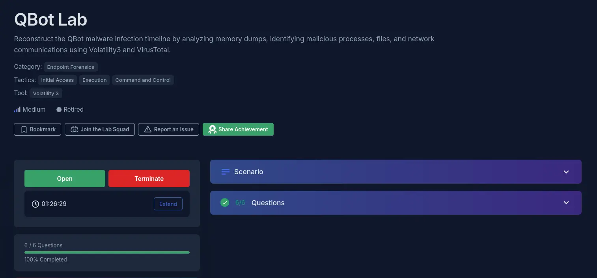

I successfully completed QBot Blue Team Lab at @CyberDefenders!
https://cyberdefenders.org/blueteam-ctf-challenges/achievements/francisvil3213/qbot/

#CyberDefenders #CyberSecurity #BlueYard #BlueTeam #InfoSec #SOC #SOCAnalyst #DFIR #CCD #CyberDefender