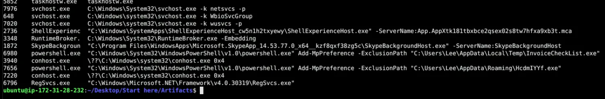
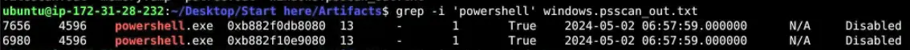
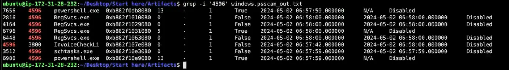
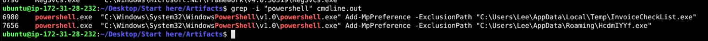
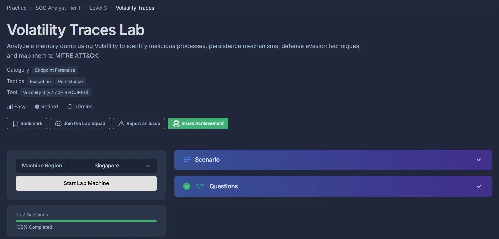

#volatility3 #endpoint-forensics #cyberdefender-easy #finished #reviewed 
# Scenario
On May 2, 2024, a multinational corporation identified suspicious PowerShell processes on critical systems, indicating a potential malware infiltration. This activity poses a threat to sensitive data and operational integrity.

You have been provided with a memory dump (`memory.dmp`) from the affected system. Your task is to analyze the dump to trace the malware's actions, uncover its evasion techniques, and understand its persistence mechanisms.

# Questions
## Q1 — Suspicious Parent Process
>Identifying the parent process reveals the source and potential additional malicious activity. What is the name of the suspicious process that spawned two malicious PowerShell processes?

One thing I like to do first for memory forensics is just quickly check the `cmdline`.
More often than not, this yields some fast and quick wins.

`~/Desktop/Start\ here/Tools/volatility3-develop/vol.py -f ./memory.dmp windows.cmdline

*Tail end of the output of the command*

If we look near the bottom, we will see two very suspicious invocations of `powershell.exe`.
These two lines are adding a microsoft defender exclusion for two executables which are
- `C:\Users\Lee\AppData\Local\Temp\InvoiceCheckList.exe`
- `C:\Users\Lee\AppData\Roaming\HcdmIYYf.exe`

These executables are suspect and we should investigate them.
There is a file named `windows.psscan_out.txt` in the `Artifacts` folder let's try looking through that first.
Let's run a grep on `powershell` to see which process spawned it.

*output of grep command*

Looks like a process with PID `4596` spawned it or invoked it.
Let's grep for `4596` and see what we find.

*output of grep `4596`*

The process that spawned it is `InvoiceCheckLi` which likely corresponds to `C:\Users\Lee\AppData\Local\Temp\InvoiceCheckList.exe`.

**Answer:**`InvoiceCheckList.exe`

---
## Q2 — Executable responsible for persistence
>By determining which executable is utilized by the malware to ensure its persistence, we can strategize for the eradication phase. Which executable is responsible for the malware's persistence?

In the output of our grep of `4596` in the last question, we can see that it also spawned `schtasks.exe`.
This is an executable concerned with scheduling tasks on the window's machine.
It is commonly used for establishing persistence.

**Answer:**`schtasks.exe`

---
## Q3 — Other active suspicious process
>Understanding child processes reveals potential malicious behavior in incidents. Aside from the PowerShell processes, what other active suspicious process, originating from the same parent process, is identified?

Similarly, in the output of our grep of `4596`.
We can see that `InvoiceCheckList.exe` also spawned `RegSvcs.exe`.

**Answer:**`RegSvcs.exe`

---
## Q4 — Powershell cmdlet used by malware
>Analyzing malicious process parameters uncovers intentions like defense evasion for hidden, stealthy malware. What PowerShell cmdlet used by the malware for defense evasion?

We already identified this on our `cmdline` output and the answer is `Add-MpPreference`.

*cmdline output*

**Answer:**`Add-MpPreference`

---
## Q5 — Two malicious applications
>Recognizing detection-evasive executables is crucial for monitoring their harmful and malicious system activities. Which two applications were excluded by the malware from the previously altered application's settings?

The two excluded malware can be seen from the same output in the last question.
Powershell was invoked twice to add the exclusions for `InvoiceCheckList.exe` and `HcdmIYYf.exe`.

**Answer:**`InvoiceCheckList.exe,HcdmIYYf.exe`

---
## Q6 — Mapping to Mitre
>What is the specific MITRE sub-technique ID associated with PowerShell commands that aim to disable or modify antivirus settings to evade detection during incident analysis?

The techniques used here is to effectively disable microsoft defender for these malware.
A google search will land us on this page [Impair Defenses: Disable or Modify Tools, Sub-technique T1562.001 - Enterprise | MITRE ATT&CK®](https://attack.mitre.org/versions/v14/techniques/T1562/001/). 
Therefore, our answer is `T1562.001`

**Answer:**`T1562.001`

---
## Q7 — Account linked to malicious process
>Determining the user account offers valuable information about its privileges, whether it is domain-based or local, and its potential involvement in malicious activities. Which user account is linked to the malicious processes?

We know the paths of the malicious executables are 
- `C:\Users\Lee\AppData\Local\Temp\InvoiceCheckList.exe`
- `C:\Users\Lee\AppData\Roaming\HcdmIYYf.exe`

Therefore, we can reasonably conclude that the user account linked to these processes is `Lee`.

**Answer:**`Lee`

# Completion

I successfully completed Volatility Traces Blue Team Lab at @CyberDefenders!
https://cyberdefenders.org/blueteam-ctf-challenges/achievements/francisvil3213/volatility-traces/
 
#CyberDefenders #CyberSecurity #BlueYard #BlueTeam #InfoSec #SOC #SOCAnalyst #DFIR #CCD #CyberDefender
