#x64dbg #cyberdefender-medium #ghidra #IDA #malware-analysis #finished #reviewed #CyberDefenders #CyberSecurity #BlueYard #BlueTeam #InfoSec #SOC #SOCAnalyst #DFIR #CCD #CyberDefender

# Scenario
As a malware analyst at CyberResponse Inc., you are presented with a challenging case involving ATM malware named ATMii. The malware has been reported to cause ATMs to dispense cash illicitly. Your mission is to dissect this malware sample, understand its components, and uncover its method of attack. This exercise is crucial in developing countermeasures to protect financial institutions from similar threats.

# Investigation
The provided tools in this lab are only `Ghidra`, `x64dbg` and `IDA`.
Let's skip the triage and just go straight to static analysis of the code to see if we can find anything of use.
We will use IDA here.

When opening the artifacts folder, we will see two files which are
- `executable`
- `library`

My first impression of the file is not much apart from that the name `library` feels like it hints towards a malicious DLL.
Let's start our investigation with the `executable` by opening it in IDA.

## Executable
### Strings
Before we really dive into the execution, let's just look over the hard coded strings.
We enter the string view for IDA by either navigating through `View > Open Subview > Strings` or just pressing `Shift + F12`.

Which gives us the following,

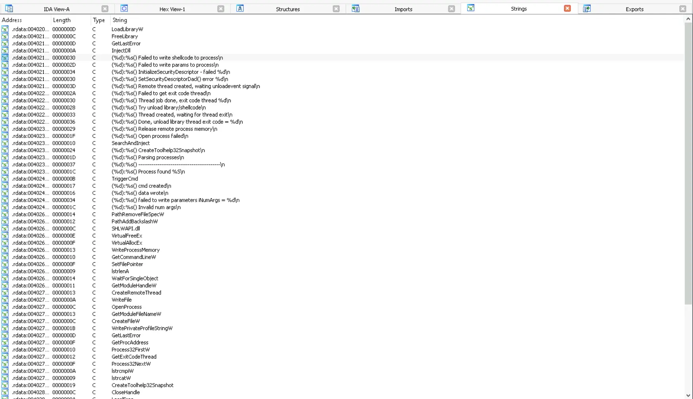

*Hard coded strings*

Immediately we will see some strings that are suspicious and tell us of the true purpose of the executable.
For instance, `.rdata:00402128	00000030	C	(%d):%s() Failed to write shellcode to process\n` implies the program has logic to write shell code into a process. Furthermore, `.rdata:00402368	00000010	C	SearchAndInject` and strings like `.rdata:0040211C	0000000A	C	InjectDll` implies the program has logic to search for something, likely a process, to inject a DLL into.

Let's now look at some of the code to see what we can find.

### Entry
If we look at the entry basic block of `executable` we will see the following,

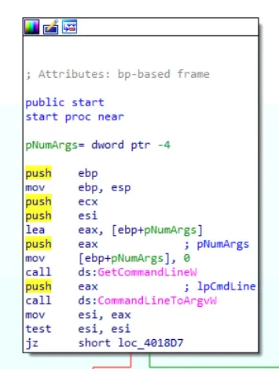

*Entry basic block*

If we resolve this block this essentially just takes the command line that invoked the process as a string then splits the string by space. This results in an array of arguments which is tested to be empty or not. If it is empty, then terminate. If not then continue to the next blocks.

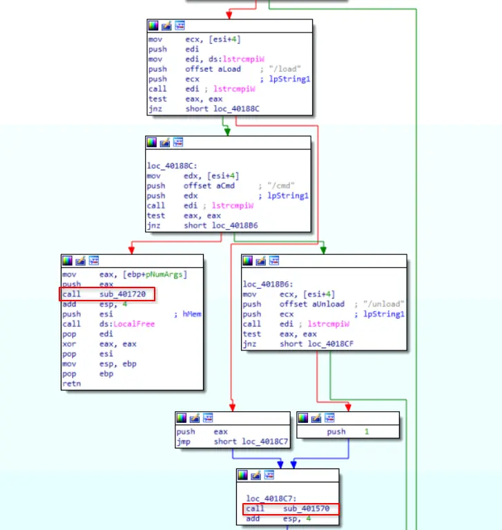

*Next blocks*

If we look at the next few blocks, it is checking what is the second argument in `argv` against a hard coded value. Based on the results of the comparison, it will call different functions.

In short,
- It checks if the second argument is `/load`
	- `!=0` :  go to `loc_40188C`
	- `0` :  jump to `loc_4018C7` and call `sub_401570`
- `loc_40188C` : Check if second argument is `/cmd`
	- `!=0`: go to `loc_4018B6`
	- `0`:  Grab value of `pNumArgs`, push on to stack and call `sub_401720`.
- `loc_4018B6`: Check if second argument is `/unload`
	- `!=0`: go `loc_4018CF`
	- `0`: call `sub_401570`

There are two interesting subroutines here and they are triggered based on the following
- Program was invoked with `/load` as argument -> Call `sub_401570`
- Program was invoked with `/cmd` as argument -> Call `sub_401720`
- Program was invoked with `/unload` as argument -> Call `sub_401570` but `push 1`. Passing `1` as argument is almost certainly a flag used in the actual load sub routine for something.
- Program was invoked with anything else or nothing -> Exit

Let's analyse these subroutines.
Let's start with `sub_401570` first because it seems to be main load function of the program.

### sub_401570

On opening this sub routine we will see that some of the strings we identified are actually referenced in this part of the code.

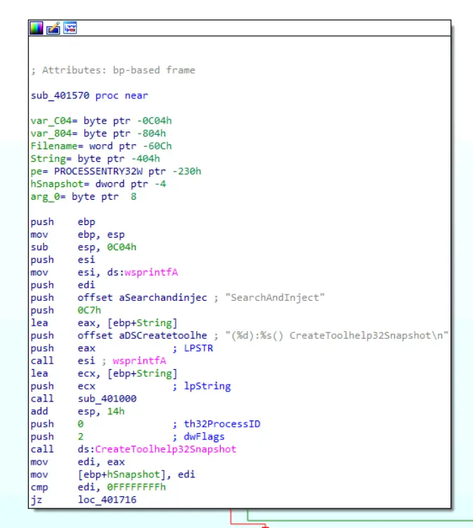

*First block in sub_401570*

The main thing in this block is the call made to `CreateToolhelp32Snapshot` which if we check on the MSDN is a call to the Windows API to take a snapshot of the specified processes.
We should also look at the arguments being passed to the call which are `dwFlags = 2, th32ProcessID = 0`, these configures `CreateToolhelp32Snapshot` to capture all processes in the system.

Furthermore, if we look at the code before the call to snap shot the processes. We can see what looks like logging with the calls being made to `wsprintfA`. If we resolve this we will get the line `(199): SearchAndInject() CreateToolhelp32Snapshot\n`.

It is clear that the malware is enumerating all processes on the system to find a particular process. We should determine what that process is. If we follow the code flow we will find the next block,

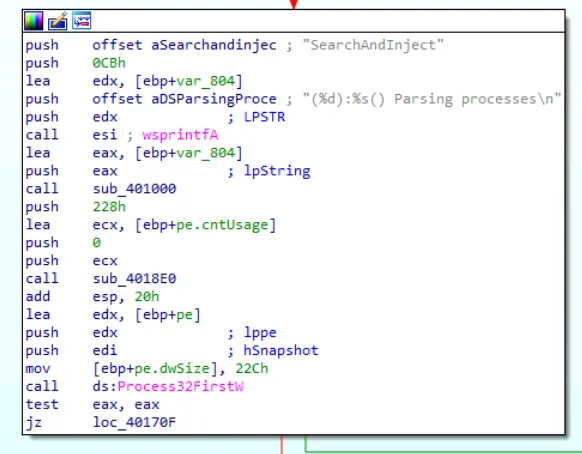

*Call made to `Process32FirstW`*

If we read the documentation on `CreateToolhelp32Snapshot`, we will see that to enumerate the processes, we will need to call `Process32FirstW` then `Process32NextW`. We can see the malware author doing that here together with another log message that resolves to `(203):SearchAndInject() Parsing processes\n`.

The next few blocks is essentially just the process looping through the processes on the system.
What is important is that we find what app it was looking for which we will see in the following blocks.

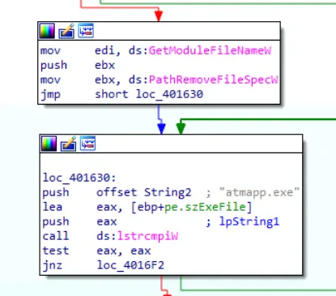

*Looking for specific process*

The first block in the above screenshot is actually doing a different job. The main outcome of that block is to grab the current working directory of the executable. We will see why the malware does this later on.

The second block is the most interesting here because it checks if the current process being checked has a process name that matches `atmapp.exe`. Therefore, this is the process that the malware is specifically trying to find.
If we continue to the blocks after the process found `atmapp.exe` we will see the injection process and also what is being injected.

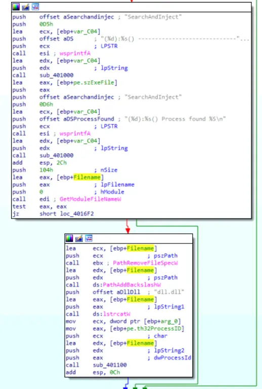

*Blocks following process match — log entries and DLL injection call*

Looking at these two blocks, we will see that once the process is found. The malware creates a few log entries and more importantly calls the subroutine to inject the DLL. We can see in the second block the DLL being injected is `dll.dll` as it is defined as a hard coded string and its full path is being passed to the next sub routine as an argument.

Also notice that the way the path is constructed for the `dll.dll`, implies that it must be in the same directory as the main malware executable.

Let's analyse subroutine `sub_401100` because this is likely the actual injection routine.

### sub_401100
This subroutine is characteristic of a DLL injection we can see this in the calls being made.

Firstly, the program gets a handle for the identified process by calling `OpenProcess` which we know is `atmapp.exe`. As seen below,

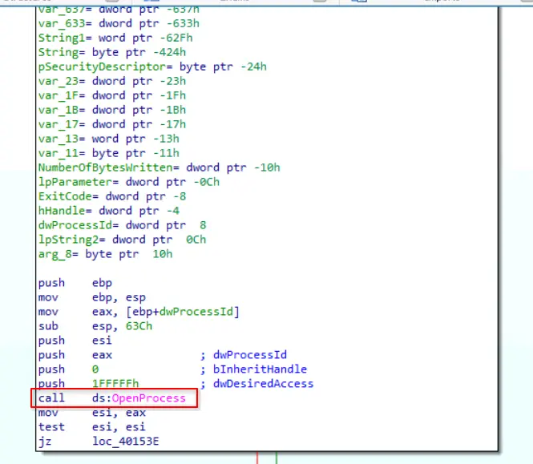

*Get handle for `atmapp.exe`*

Then it allocates memory inside the process by calling `VirtualAllocEx`.

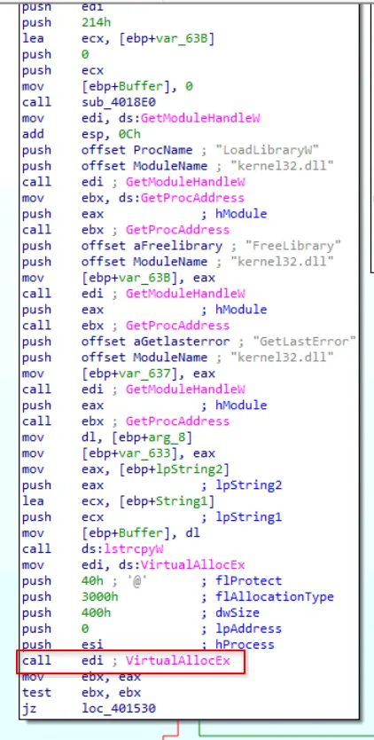

*`VirtualAllocEx` call*

Then it writes a subroutine into this allocated memory using `WriteProcessMemory`. The subroutine being written is `sub_401090`.

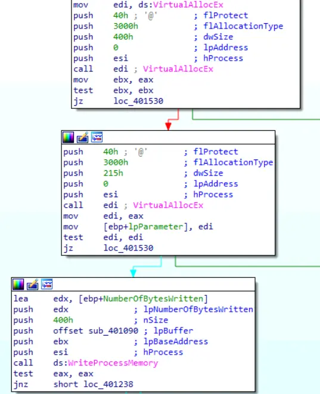

*Writing subroutine into `atmapp.exe` memory*

After writing the shell code into the memory, the program then creates a remote thread in `atmapp.exe` which runs the injected code.

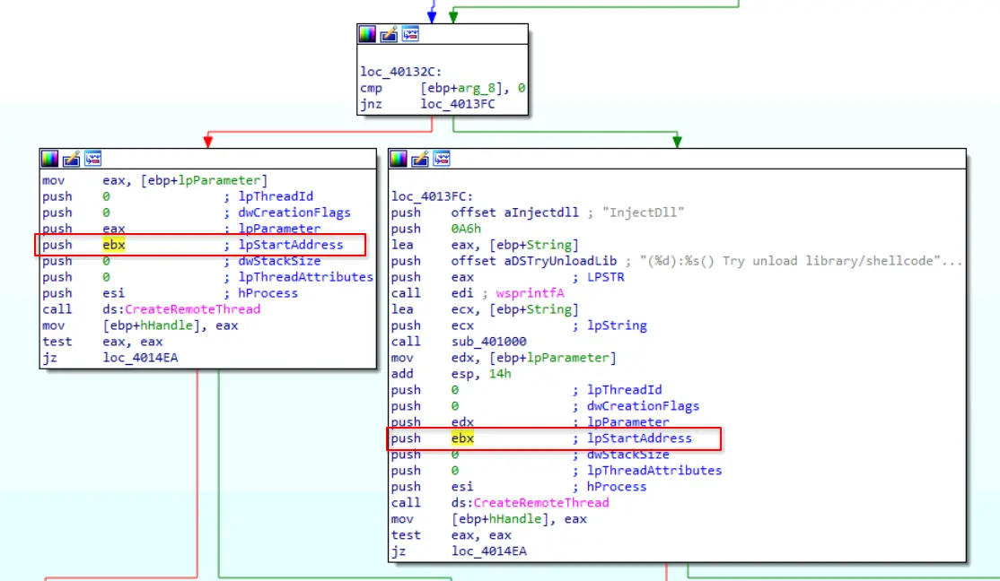

*`CreateRemoteThread` for executing injected code*

Interestingly, this is also where the flag passed as an argument is being used. Recall that when this program is invoked with `/unload`, the program pushes a `1` on the stack then calls `sub_401570` which calls `sub_401100`.
We can see that if `[ebp+arg_8]` is `0` then it goes the left block, if it is not `0` then it goes to the right block which tries to unload the library/shell code.

The created remote thread then runs to either run the shell code or unload the library.
After which, it frees the memory for the shell code and returns to the caller.

Therefore, this process handles the loading or unloading of a malicious DLL, `dll.dll`, into a process `atmapp.exe`.
The key details are
- Target process of malware: `atmapp.exe`
- Malicious DLL: `dll.dll`
- `dll.dll` and the malicious executable must be in the same directory
- The shell code is `sub_401090` and is therefore at `0x00401090`

### sub_401720
Having analysed `sub_401570`, let's step back a bit and look at the sub being called by the program if it was invoked with `/cmd`.
Below, is the block that calls `sub_401720`.

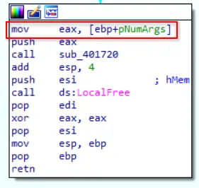

*Argument passed to `sub_401720`*

Take note that the `pNumArgs` which is the number of arguments parsed in the command line of the program is being used by `sub_401720` as an argument.
Clicking into the subroutine we will see,

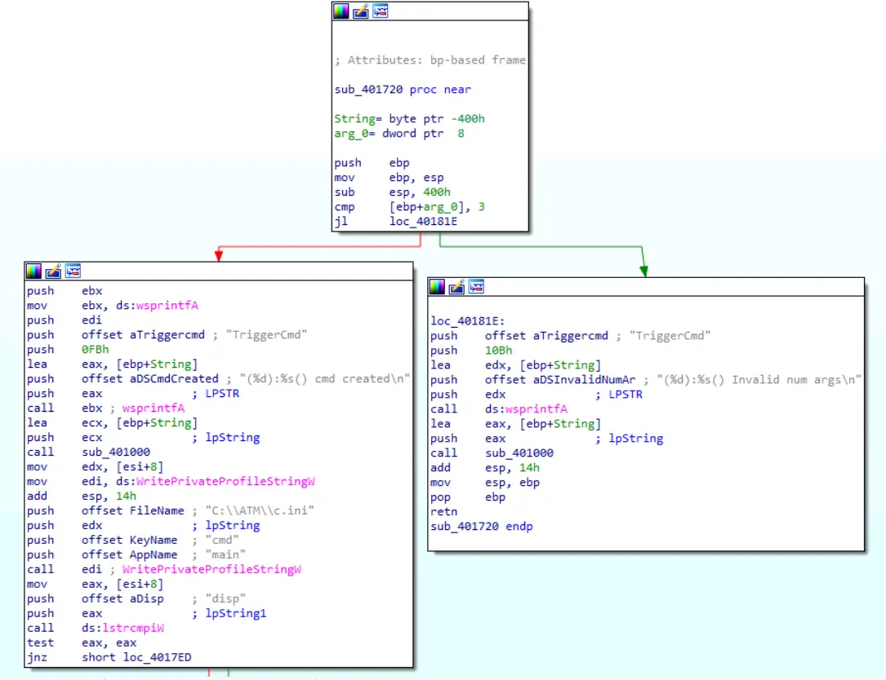

*First three blocks of `sub_401720`*

The malware checks if the supplied number of arguments is more than or equal to `3`. It does this by performing a `cmp` operation between `[ebp+arg0]` and 3. Then it performs a `jl` operation which applies the actual comparison logic and decides which branch to take.

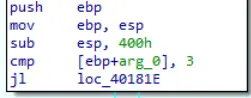

*Performing comparison*

If less than 3, it logs that the number of arguments is invalid, returns to the caller and exits the program.

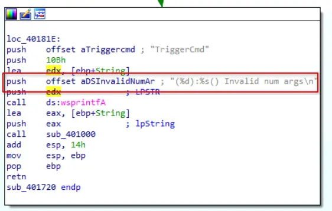

*Invalid number of arguments*

If it is more than or equal to `3` then it first logs the creation of the `cmd` then creates a `.ini` file by calling `WritePrivateProfileStringW`.
It then creates a section named `main` and a key with name `cmd`.
The value of that key is `[esi+8]` which is the third argument in the command line.

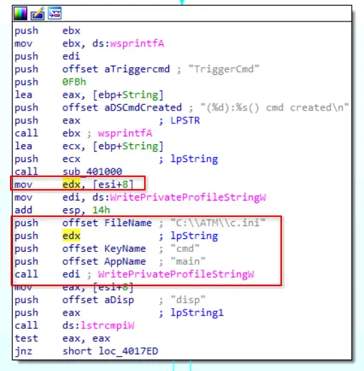

*Creating `.ini` file*

Therefore, if the program was called with `malware.exe /cmd arg2` then the corresponding content will be created.

```ini
[main]
cmd=arg2
```

It then checks if the third argument is equal to `disp` or not.
If it is not equal it will log a failure to write parameters and returns to caller.
If it is equal to `disp` then the program checks if the command line arguments are more than or equal to 5.
If not, it goes to the same block that logs a failure to write the parameters.
Otherwise, it performs the following,

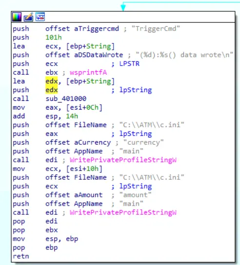

*Writing parameters*

It grabs the 4th and 5th arguments and use them to populate 2 more key value pairs.
It creates a key named `currency` under section `main` and the value is `[esi+0Ch]`.
It creates a key named `amount` under section `main` and the value is `[esi+10h]`.
Therefore, if the program was invoked with

```
malware.exe /cmd disp SGD 100
```

Then the resulting `c.ini` will be

```
[main]
cmd=disp
currency=SGD
amount=100
```

It is clear that this subroutine is defining a configuration file for the malware.
In particular, it seems to be defining the parameters for `disp` which is likely a short form of `dispense`.

Key details are
- Configuration file name: `c.ini`
- Configuration file hard coded path: `C:\\ATM\\c.ini`
- Configuration only accepts `disp` and related parameters

### Summary for executable
This executable file is a command line tool that accomplishes a few things
- Allows threat actor to configure the malware
- Allows threat actor to load or unload the malware's malicious DLL

It has the following accepted arguments
- `/cmd` : Allows for the configuration of the malware
	- `disp`
	- `currency`
	- `amount`
- `/load` : Injects shell code into a running process `atmapp.exe` and uses that to load `dll.dll`.
- `/unload` : Unloads the malicious library

Key details to note
- Target process of malware: `atmapp.exe`
- Malicious DLL: `dll.dll`
- `dll.dll` and the malicious executable must be in the same directory
- The shell code is `sub_401090`
- Configuration file name: `c.ini`
- Configuration file hard coded path: `C:\\ATM\\c.ini`
- Configuration only accepts `disp` and related parameters

## Library
Having investigated `executable`, let's now look at `library`.
This file is very likely the `dll.dll` we identified earlier.

### Strings
Similarly, to our investigation of `executable`, let's first look over the defined strings.

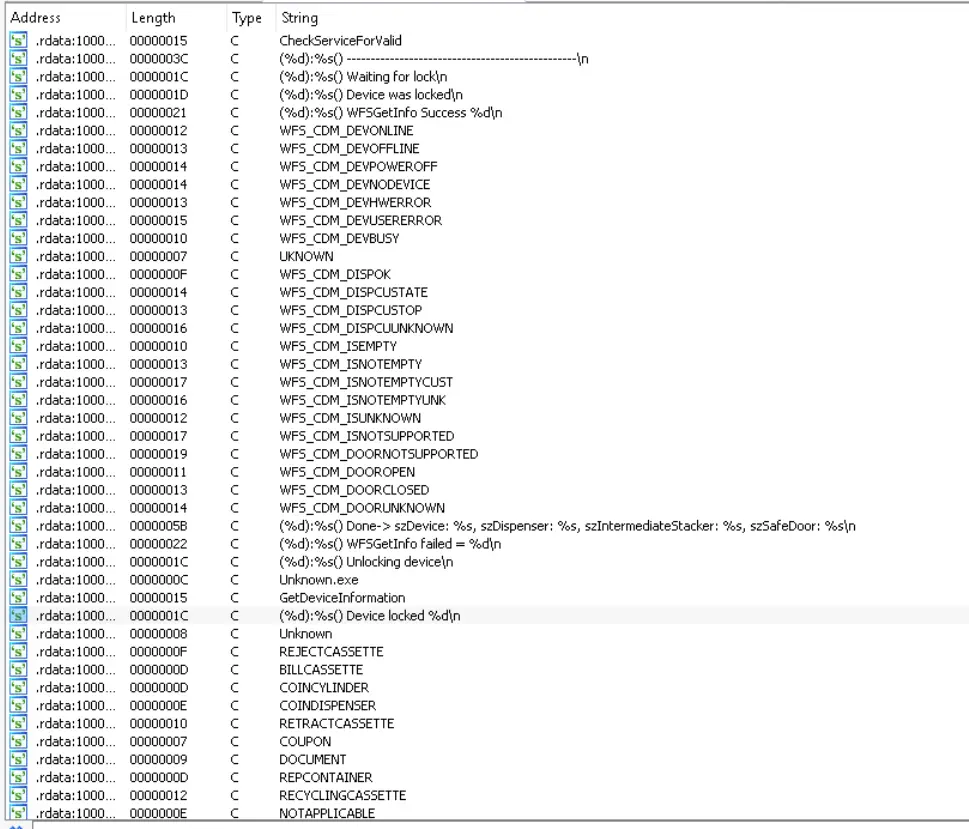

*Strings in library*

The strings that stand out the most are those prefixed with `WFS`.
These strings if we google them, we will find this document for [Cash Dispenser Device Class Interface](https://www.cencenelec.eu/media/CEN-CENELEC/AreasOfWork/CEN%20sectors/Digital%20Society/CWA%20Download%20Area/XFS/16926-5.pdf). In short, the strings found in the malicious DLL are either event information or commands.

Strings prefixed with `WFS_CDM` are just event information whereas strings prefixed with `WFS_CMD` are commands.

In fact, if we filter the defined strings for `WFS_CMD`.
We will find the following,

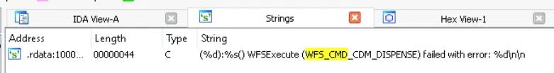

*Dispense command log*

Which looks like a log that states the command failed.
`WFS_CMD_CDM_DISPENSE` is a command that performs the dispensing of items to the customer. As defined in the documentation,

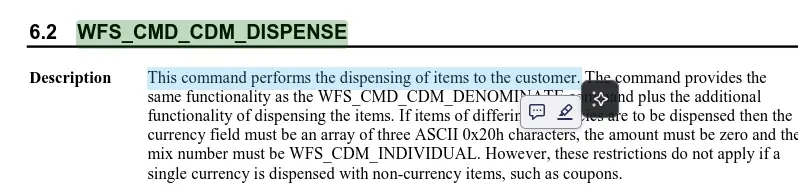

*Documentation definition of command*

Also note that the function calling this command is `WFSExecute`.

Therefore, we know that somewhere in this library is code that tries to make the ATM dispense money to the threat actor. This is corroborated by our findings in `executable` where we found a configuration file detailing the parameters to a `disp`, likely short form for dispense, function.

### DLL Entry
When we click into the `DllEntryPoint` we will find two branching paths.
One path unloads the malicious library and functions and the other initialises the library and hooks to a valid service.

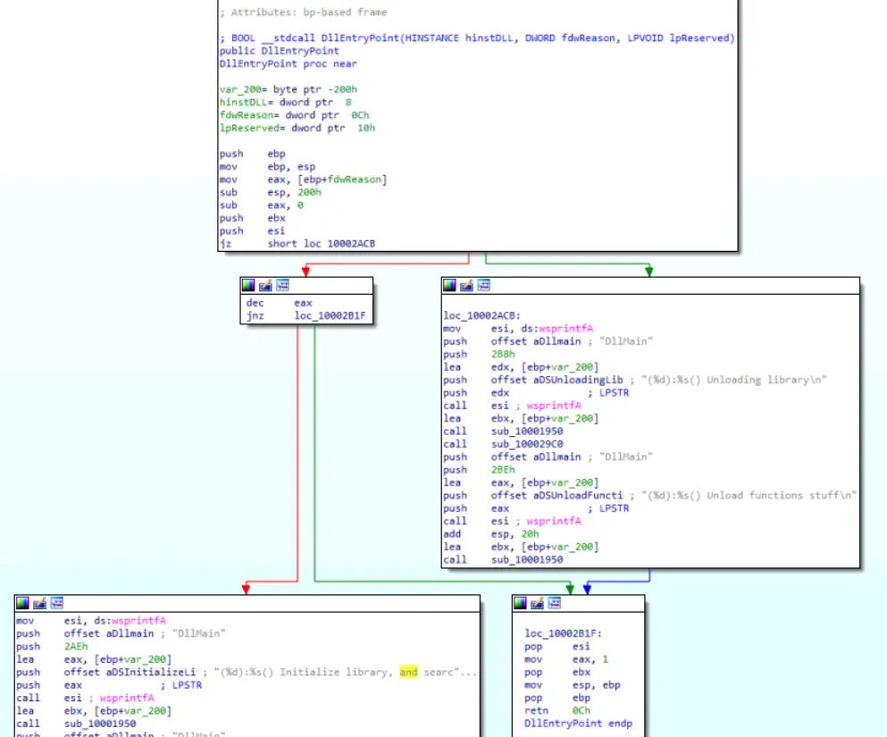

*Branching paths in `DllEntryPoint`*

We are primarily concerned with the path that initialises and hooks to a valid service which is the block below.

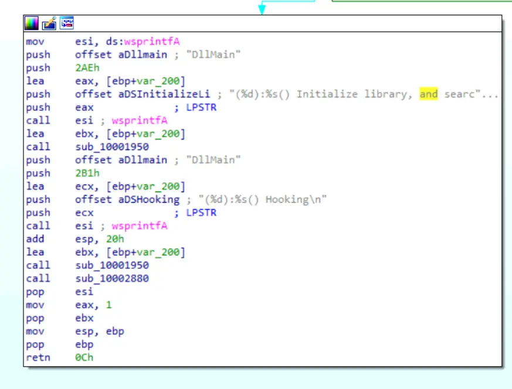

*Initialise and hook block*

Analysing the instructions this block just creates logs that the initialisation and hooking process is starting. The block makes calls to two subroutines which are
- `sub_10001950`
- `sub_10002880`

A brief look at each subroutine reveals that `sub_10001950` is just for logging purposes and the actual hooking process is defined in `sub_10002880`.
Let's look into that.

### sub_10002880
When we click into this subroutine we will see the following,

The process pushes variables `ProcName` which is `WFSGetInfo` and `ModuleName` which is `msxfs.dll` onto the stack.
A google search will also tell us that `msxfs.dll` is Microsoft's implementation/manager of the `XFS standard`, and it allows Windows-based ATM software to send standardised commands to banking hardware like cash dispensers, card readers, and pinpads, regardless of which vendor made them.

It then calls `LoadLibraryW` which returns the handle to the loaded library and only takes 1 argument. This step essentially tries to load `msxfs.dll` and get a handle for it.

It then caches the address of `GetProcAddress` into `edi` then makes the call to `GetProcAddress` with the arguments being the handle of `msxfs.dll` and `ProcName` which is `WFSGetInfo`.
This returns the procedure address of `WFSGetInfo` into `eax` which is then later saved into `dword_10004218`.

The author then gets the module handle to `msxfs.dll` again as `eax` was overwritten in the prior call to `GetProcAddress`.
This time he saves that handle into `esi` and checks if `esi` is zero or null.

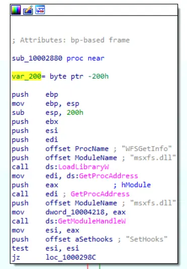

*Loading `msxfs.dll` and getting procedure address of `WFSGetInfo`*

The second block after this if it does not take the jump i.e. it falls through, is another block that
logs that module was found and gets the procedure address of `WFSGetInfo` again. This time saving that returned procedure address into `esi`.

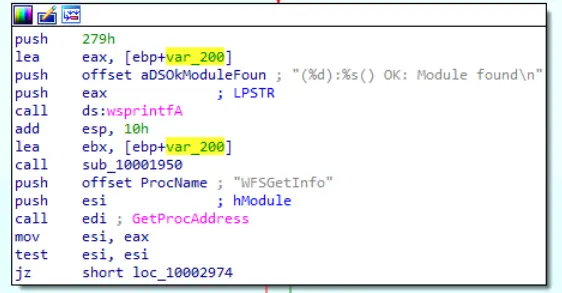

*Getting procedure address of `WFSGetInfo` again*

Then if the code falls through again, it tries to obtain the procedure address of `CloseHandle` in `kernel32.dll`.

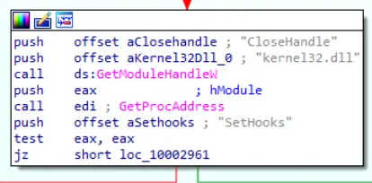

*Getting procedure address of `CloseHandle`*

The final block in this chain first logs that `WFSGetInfo` was found and the current registers are set with the following values
- `esi` : Procedure address of `WFSGetInfo`
- `eax` : Procedure address of `CloseHandle`

It then asks for a handle to the current process running this code. Which in this context and from what we found in the previous investigation of executable, is very likely a handle to the `atmapp.exe` process. This also overwrites the value in `eax` to instead be the handle to `atmapp.exe`.

It then pushes this handle onto the stack which IDA aptly automatically labelled as `hProcess`.
Then moves the literal address `1000420C` into `eax`.

Finally, it moves the procedure address of `WFSGetInfo` into `ecx` from `esi`.

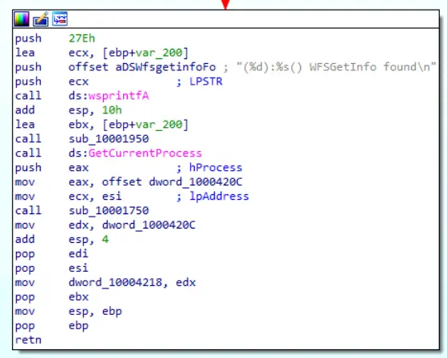

*Final block just before calling `sub_10001750`*

Therefore for `sub_10001750` following key details are
- `eax`: `1000420C`
- `ecx` : Procedure address of `WFSGetInfo`
- `dword_10004218` : Procedure address of `WFSGetInfo`, likely a cache

In summary, this chain of blocks was just to make sure `msxfs.dll` existed and that the program is able to grab both the handle of `atmapp.exe` and the procedure address of `WFSGetInfo` to setup the next stage of the hooking process.

Let's click into `sub_10001750` and analyse it.

### sub_10001750
We already know that the threat actor aims to hook into the `WFSGetInfo` API.
This means that we are likely to see the following calls

```
1. GetProcAddress -> Retrieved already in caller
2. VirtualAllocEx -> Allocate memory for the malicious patch nearby
3. VirtualProtectEx -> make WFSGetInfo's page writable
4. WriteProcessMemory -> apply the malicious patch
5. VirtualProtectEx -> Restore original page permissions
```

Our main target here is to identify the malicious code.
Since, the patch happens at the `WriteProcessMemory` and this only can happen after the `WFSGetInfo` page is writable.
We are very likely to find the malicious code in the area of code between a successful `VirtualProtectEx` and the call being made to `WriteProcessMemory`.
This allows us to skip ahead in this sub routine and just focus on what is important to us which is the code below,

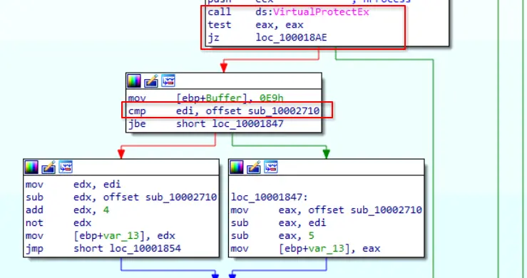

*Code of importance*

Notice how if the `VirtualProtectEx` is successful (return value is non-zero), it goes to a block that
- Pushes the opcode for a `JMP rel32` into a variable named `Buffer`. We can verify this is the opcode by referring to [this](https://www.felixcloutier.com/x86/jmp).
- Compares `edi` with `offset sub_10002710`, this sets the CPU flags used in the latter `jbe` operation

Let's trace what `edi` is.
For majority of the code up until this point, `edi` was not overwritten.
The only time its value was changed was at the very beginning of this subroutine where the value of `ecx` was moved into `edi`.

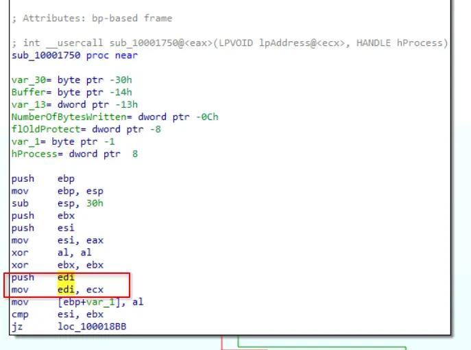

*Value of `edi`*

We know from our analysis of the caller that `ecx` is the procedure address of `WFSGetInfo` so that means `edi` will hold the same address.
Also notice how `Buffer` is a `byte ptr` and `var_13` is a `dword ptr`.
Furthermore, `Buffer` and `var_13` are arranged contiguously in memory, notice their offsets are `-14h` and `-13h` respectively.
Let's go back to the code constructing the patch.

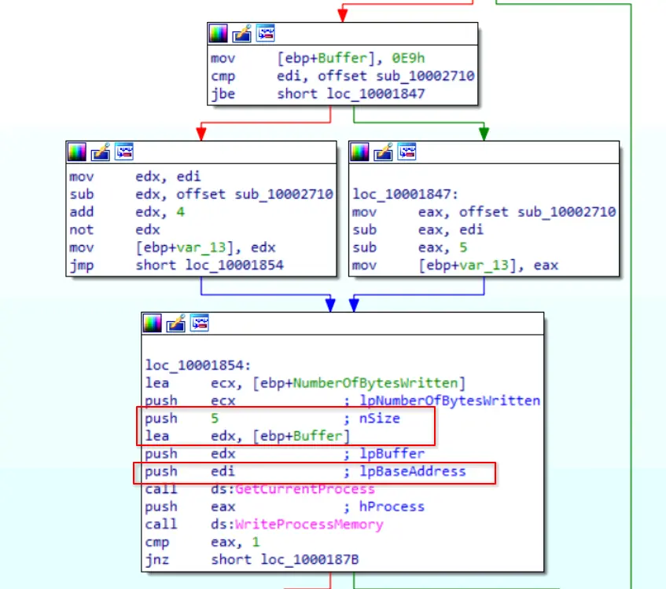

*Constructing and applying the patch*

After the op code `0xE9` is moved into `[epb+Buffer]`, the code needs to then figure out how much to jump by and in what direction.
It first performs a `jbe` operation comparing the procedure address of `WFSGetInfo` and `sub_10002710`.
This determines if `sub_10002710` is ahead or behind.
It then calculates the actual offset needed based on the result of that `jbe` operation.
The two blocks following it are just calculating the offset needed.
After calculating this offset, it saves the 4 byte offset into `var_13`.

Therefore, we can conclude

```
[buffer] 0xE9
[var_13] calculated offset byte 1
[var_13] calculated offset byte 2
[var_13] calculated offset byte 3
[var_13] calculated offset byte 4
```

It then constructs the arguments and the call to `WriteProcessMemory` where it sets the following arguments
- `nSize` : `5`
- `lpBuffer` : `edx` , which is just the effective address of `ebp+Buffer`
- `lpBaseAddress`: `edi`, which we know is the procedure address of `WFSGetInfo`

This means that once the call is made, the first 5 bytes starting from `lpBaseAddress` is replaced by the 5 bytes starting from the effective address of `ebp+Buffer`.
Since, `buffer` and `var_13` are contiguous in memory, this means the first 5 bytes of `WFSGetInfo` is instead replaced with a `JMP` instruction to `sub_10002710`.
Therefore, the main code we want to analyse is in `sub_10002710`.

### sub_10002710
Upon landing in this subroutine, we will see that the author identifies this as `mWFSGetInfo` as evident from the logging.

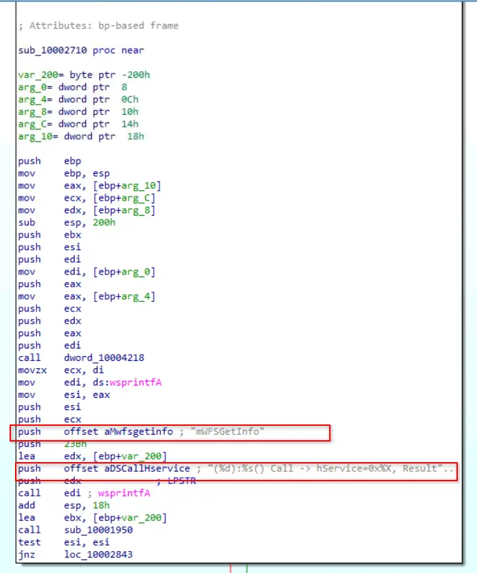

*First block in sub_10002710*

If we scroll down we will find a branch that checks if `c.ini` exists.
From our investigation of executable, we know that `c.ini` is the configuration file for the malware and contains parameters for functions.
Upon verifying `c.ini` exists, the code makes another call to `sub_10002580`.
We can also tell from the logs that this subroutine is trying to execute commands based on the `c.ini`.

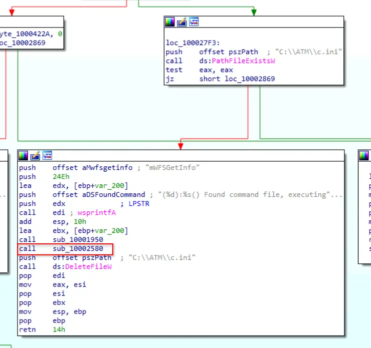

*Verify `c.ini` and execute*

### sub_10002580
This sub routine on analysing it parses the contents of `c.ini` and based on the values parsed, will call certain sub routines.
We already know in the analysis of `executable` that it writes `disp` and relevant parameters.
Let's find the particular branch that handles that command execution.

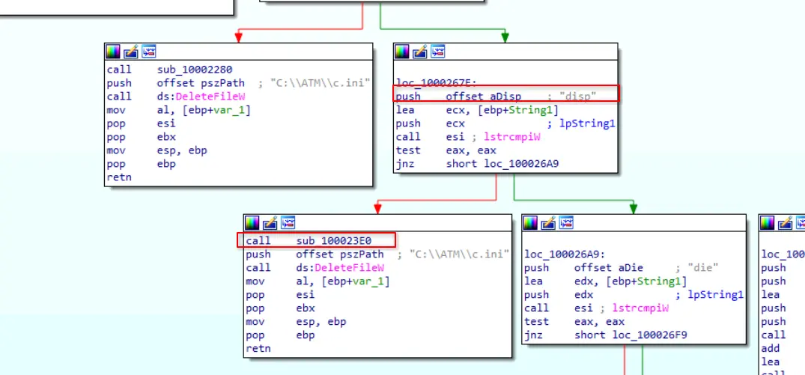

*Branch concerned with executing `disp` command*

From the above screenshot, we can see that upon verifying the `disp` command, it will make a call to `sub_100023E0` then delete the `c.ini` file after it completes.
Let's look into this sub routine.

### sub_100023E0
This sub routine is concerned with parsing the parameters defined for the `disp` command.
In the first block of the subroutine it retrieves the values of keys `currency` and `amount` under the app `main`.

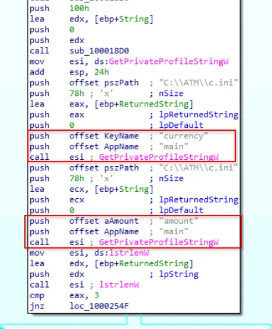

*Reading `currency` and `amount`*

After which it performs some validation checks on the retrieved values and if it passes will then make a call to `sub_100022D0` which is likely the actual code that dispenses the requested amount.

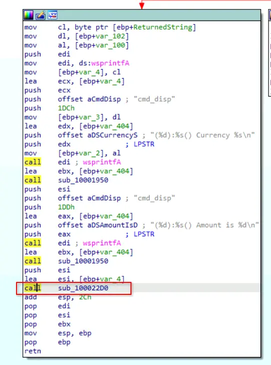

*Calling `sub_100022D0`*

### sub_100022D0
Finally, after tracing the flow of the program we will see that the process makes a call to `WFSExecute`.
The results of call then branches into two blocks where one block handles the failure of the dispense command and the other handles the success.
We can quickly determine the purpose of these blocks due to the verbose logging the author left in the code.

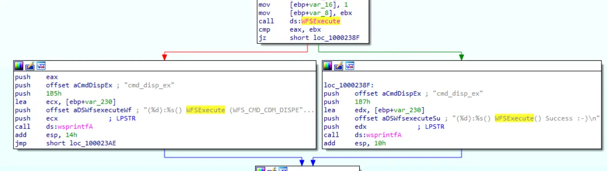

*`WFSExecute` call and branching paths*

Furthermore, if we look at the hard coded string for the logging of a failed `WFSExecute` call.
We can see the exact constant that is being passed for this command.

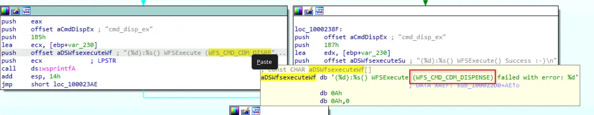

*Constant being passed to `WFSExecute`*

This is also validated by the [Cash Dispenser Device Class Interface](https://www.cencenelec.eu/media/CEN-CENELEC/AreasOfWork/CEN%20sectors/Digital%20Society/CWA%20Download%20Area/XFS/16926-5.pdf) documentation we found earlier.

### Summary for library
This DLL performs a few functions
- It searches for `msxfs.dll` and `WFSGetInfo`
- It applies a patch for `WFSGetInfo` that causes the program to jump to the code that the malware author wants to run
- The code then checks if `c.ini` exists and if it does, parses the values inside of it
- After it finishes parsing the values, it uses them to decide what command to dispatch to the ATM as well as the relevant parameters
- In this sample specifically, the threat actor was just mainly concerned with the `disp` command.
- The API being accessed to execute the dispense command is `WFSExecute`
- The constant that gets passed to `WFSExecute` is `WFS_CMD_CDM_DISPENSE`

# Conclusion
To conclude this malware consists of two files: an executable and a malicious dynamically linked library that gets injected into the target process.
Our analysis shows the threat actors used it to query and dispense cash from the ATM by hooking the legitimate `WFSGetInfo` function and redirecting the calls through a malicious wrapper. The wrapper then reads attacker-supplied commands from a configuration file named `c.ini` to define its behaviour. Knowing this we can now answer the following questions.

# Questions

## Q1 — Process Name
> Identifying the target process is crucial for understanding the injection vector. What is the name of the process into which the malicious library is injected?

We found this in `sub_401570` in `executable`.


*Process name check against `atmapp.exe`*

**Answer:** `atmapp.exe`

---

## Q2 — Configuration File Name
> Determining the source of configuration commands can reveal the malware's operational parameters. What is the configuration file name from which the DLL takes commands?

We found this in `sub_401720` in `executable`.


*Creating the `.ini` file — filename visible as hard coded string*

**Answer:** `c.ini`

---

## Q3 — Injected Library Name
> The success of the injection depends on the correct file name. What should be the original name of the injected library to ensure the attack is successful?

We found this in `sub_401570` in `executable`.


*Hard coded `dll.dll` filename used to construct the injection path*

**Answer:** `dll.dll`

---

## Q4 — Shellcode Function Address
> Identifying the function address where the shellcode resides helps track the malware's execution flow. What is the address within the injector that houses the shellcode responsible for loading and unloading the malicious DLL?

We found this in `sub_401100` in `executable`.


*Writing `sub_401090` into `atmapp.exe` memory as shellcode*

**Answer:** `0x00401090`

---

## Q5 — ATM Interface Library
> Understanding how the malware interfaces with the ATM hardware is key to analyzing its behavior. What is the name of the dynamic library that provides APIs for interacting with the ATM?

We found this in `sub_10002880` in `library`.


*Loading `msxfs.dll` and retrieving the address of `WFSGetInfo`*

**Answer:** `msxfs.dll`

---

## Q6 — Hooked API Function
> Hooking functions allow malware to manipulate normal operations. What is the name of the original API function that the program hooks and redirects to its wrapper?

We found this as well in `sub_10002880` in `library`.


*Final setup block showing `WFSGetInfo` address loaded into `ecx` before the hook call*

**Answer:** `WFSGetInfo`

---

## Q7 — Dispense API Function
> Knowing the function the malware utilizes is essential to identifying the malware's functionality. What API function does the malware call to dispense money?

We found this in `sub_100022D0` in `library`.


*`WFSExecute` call and branching paths for success and failure*

**Answer:** `WFSExecute`

---

## Q8 — Dispense Command Constant
> Recognizing specific constants can help in understanding command execution. What is the name of the constant responsible for the money dispensing command, which is passed as a parameter to the API function?

We also found this in `sub_100022D0` in `library`.


*Failure log string revealing the constant `WFS_CMD_CDM_DISPENSE`*

**Answer:** `WFS_CMD_CDM_DISPENSE`

---

# Completion


I successfully completed ATMii Blue Team Lab at @CyberDefenders!
https://cyberdefenders.org/blueteam-ctf-challenges/achievements/francisvil3213/atmii/
