#dnSpy #DetectItEasy #AutoITExtractor #procmon #CFFExplorer #ProcessHacker #pe-sieve #malware-analysis #static-analysis #dynamic-analysis #cyberdefender-medium #finished #reviewed

# Scenario

As a malware analyst at CyberResponse Inc., you are tasked with investigating a piece of malware that has been reported to steal sensitive information like passwords, keystrokes, and screenshots. Your goal is to dissect the malware sample, understand its components, and uncover its attack methods. This task is crucial for developing countermeasures to protect users and organizations.

# Questions
## Q1 — Embedded Scripting Engine
>Identifying the scripting engine or interpreter used in malware can provide insights into its functionality and potential behaviors. What is the name of the scripting engine embedded in this executable?

Let's first open the file in CFF Explorer to see if the executable is packed or not.

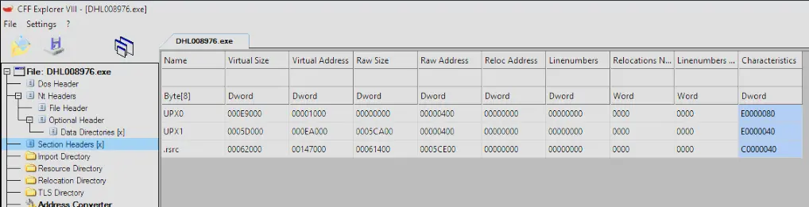

There are UPX0 and UPX1 section headers, so the executable is probably packed with UPX.
Let's try to unpack it.

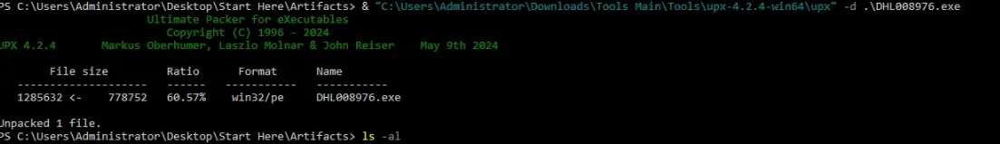

Then open it in PE Studio. If we go to resources (signature > AutoIt), we see that RCDATA has an embedded AutoIt compiled script.

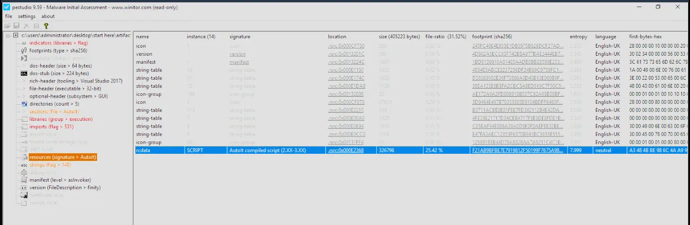

**Answer:** `AutoIt`

---
## Q2 — MD5 Hash of Bin Script
>Determining the hash of executable components is essential for verifying integrity and identifying malware. When the malware is executed, there are scripts running, one of them is a bin file. What is the MD5 hash of this file?

In the first step, we found out that there is an embedded AutoIt script. Let's try running this file through AutoIt Extractor.

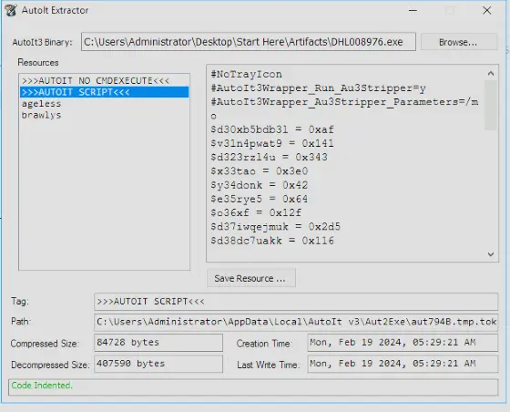

There are 2 embedded binary resources: ageless and brawlys.

Ageless looks like a binary but the first few bytes do not look like any magic bytes I recognise.

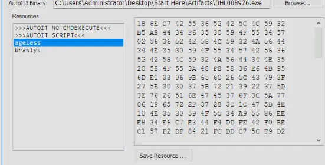

Brawlys looks like a text file of some sort.

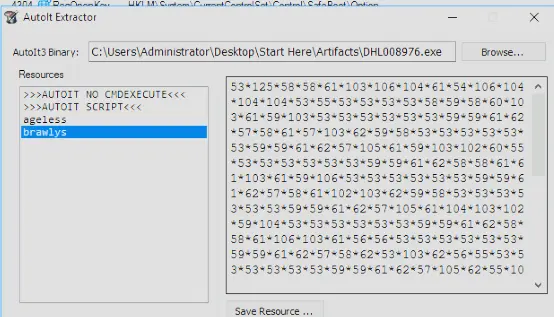

Let's get the MD5 hash of the ageless binary to answer the question.

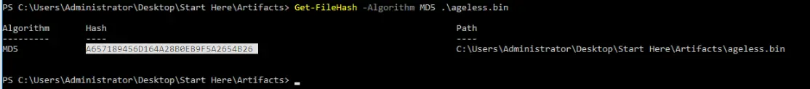

**Answer:** `a657189456d164a28b0eb9f5a2654b26`

---
## Q3 — Main Logging Method Name
>Recognizing key methods in the malware's code helps to pinpoint its main functionalities. What is the name of the method that has main logging functionalities, such as keylogging and screen logging?

When we do a quick Google search of AutoIt, we find that it's a BASIC-like scripting language designed for automating the Windows GUI and other general tasks.

Furthermore, when we passed the executable to AutoIt Extractor and have a look at the hexdump of ageless, we can see that the file is likely encrypted because the first few bytes are not any recognizable magic bytes. Additionally, when we try to open ageless in HxD, nothing is legible and it looks completely random.

Our static analysis has not given us much and we know the executable itself is UPX packed. Furthermore, there seems to be an embedded binary that looks encrypted.
Let's shift to dynamic analysis to see if we can retrieve any useful artifacts from running the process.

Let's run the process, then open Process Hacker to see if the malware spawns any processes and its PID.

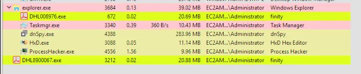

It does not spawn any processes, but we can now use PE-Sieve to recover useful artifacts from the live process memory.

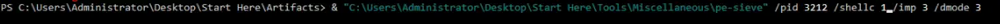

This gets us these artifacts in a folder process_3212.

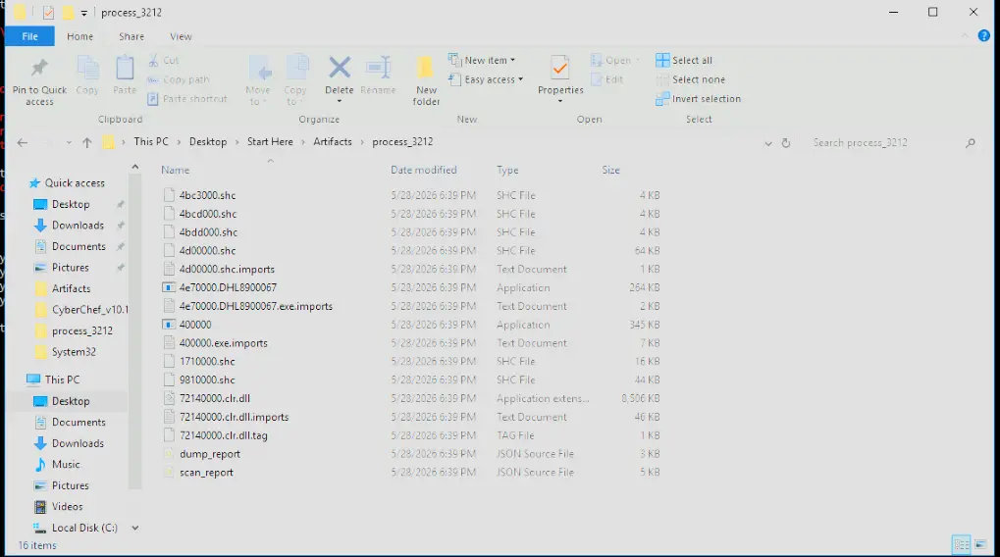

We then use Detect It Easy to see what types of files these are.

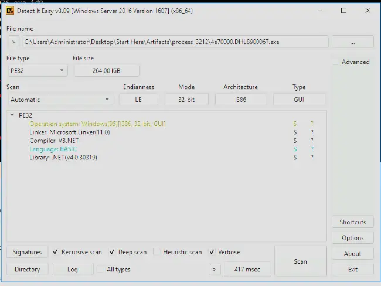

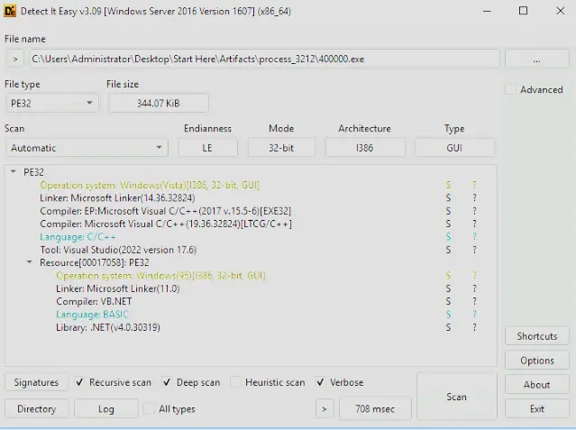

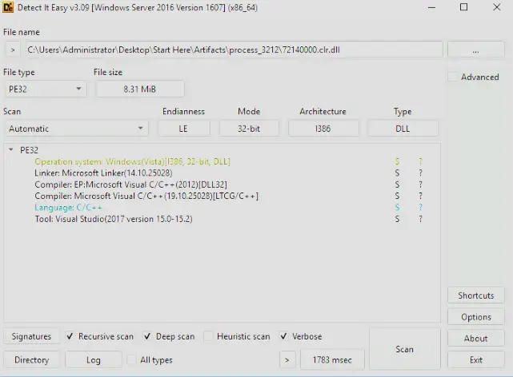

We can see that:
- 400000.exe has a C++ wrapper and inside of it is a .NET resource
- 4e70000.DHL8900067 is pure .NET or VB.NET, likely the most readable — we should analyse this in dnSpy
- 72140000.clr.dll is just the .NET runtime, the core execution engine for the .NET Framework. We can ignore this.

Let's load 4e70000.DHL8900067 into dnSpy and see what we can get.

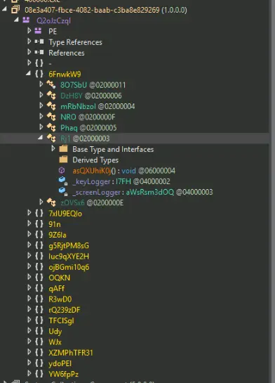

In dnSpy we see many namespaces; expanding them will show the defined classes.

The class names and namespace names are all obfuscated but we can still make sense of what some classes are used for.

For example, under `8O7SbU`:

We find this:

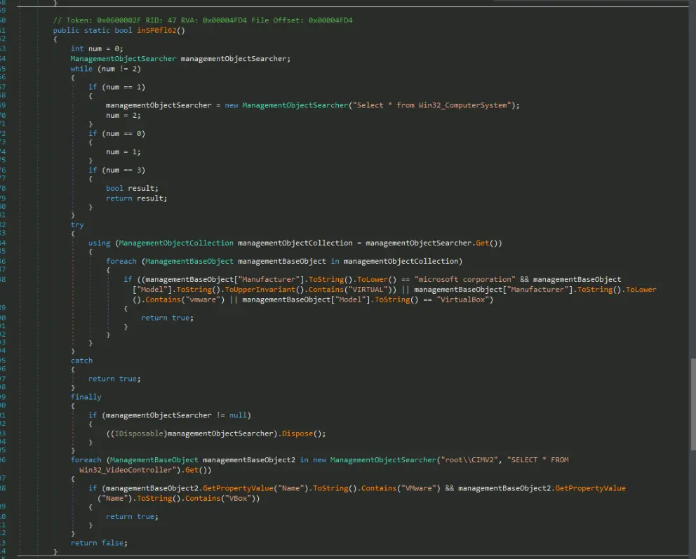

Which is a VM detection function for common virtualization tools like VMware, VirtualBox and VBox.

If we look through more of these, we will find `Rj1` which is the class with a method specifically for main logging functionalities.

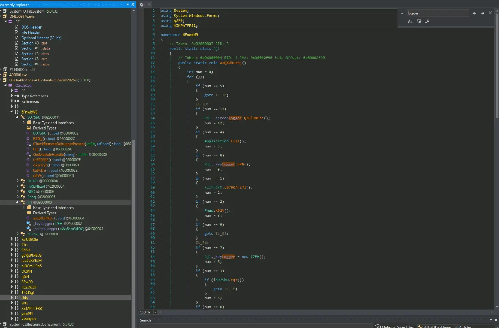

This also shows us the answer for this question.

**Answer:** `asQXUhiK0j`

---
## Q4 — Keylog Output Format
>Understanding the output format of keylogging functionalities assists in tracing and decoding captured data. What is the specific format (programming language) for the output of the malware keylogging functionality?

To figure out the output of the malware keylogging function, let's click into the keylogger methods and analyse them.

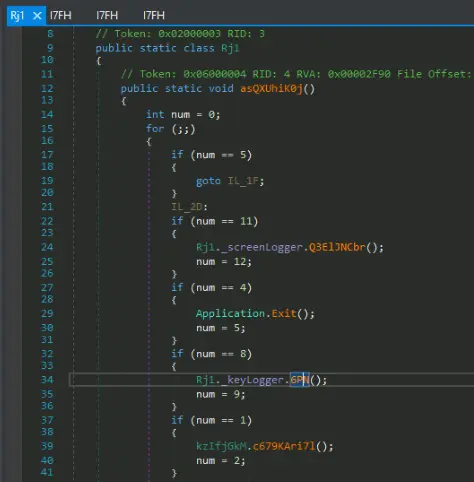

After clicking into it, we can see an interesting variable `KeylogText`.

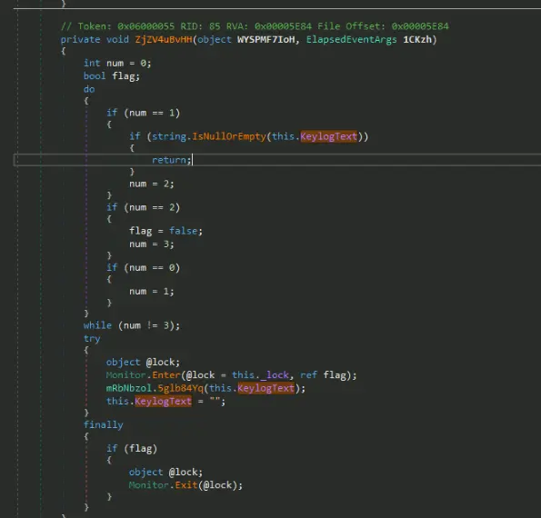

The try block looks like it is resetting the variable `this.KeylogText` by assigning it `""`.
Before doing so, it calls a function, passing the current value of KeylogText to it.
Let's look into this function because it looks like it is the export or dump function of the captured keylogger text.

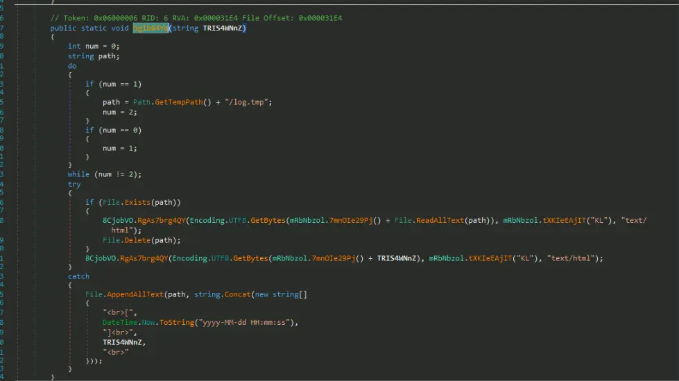

This function is for exporting the keylogger output, `KeylogText`.

**Answer:** `HTML`

---
## Q5 — Telegram Exfiltration URL
>Knowing the exfiltration methods used by malware is crucial for identifying data breaches and protecting sensitive information. What is the full URL the malware uses for exfiltration of data using Telegram?

For this we just click through the other classes and when we land on class `Phaq`, we will see some static strings defined which include the `TelegramApi`.

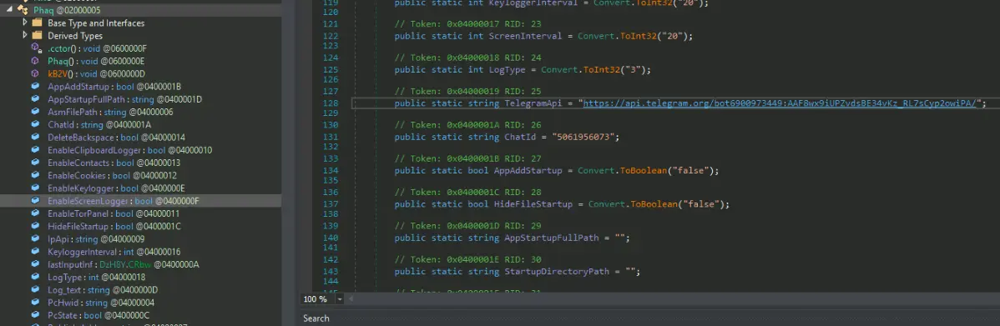

**Answer:** `https://api.telegram.org/bot6900973449:AAF8wx9iUPZvdsBE34vKz_RL7sCyp2owiPA/`

---
## Q6 — Persistence Dropped File
>To better understand the persistence strategies of the malware, can you provide the name of the file that was dropped by the malware as part of its persistence mechanism?

For this we just use ProcMon and track what the process does when we run it.
We add the following filters to ProcMon,

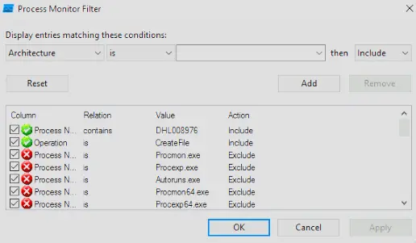

Then we look through the activity and see that it creates a file `C:\Users\Administrator\AppData\Roaming\Microsoft\Windows\Start Menu\Programs\Startup\DHL8900067.vbs`.

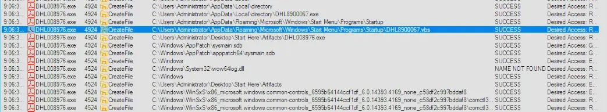

This operation means that the malware created a VBS script that automatically runs every time the computer boots and a user logs in.

**Answer:** `DHL8900067.vbs`

---
## Q7 — Public IP Lookup Service
>Knowing the legitimate services abused by malware can aid in recognizing suspicious network activities. Which legitimate service does the malware use to get the public IP address of the victim?

To find this out we can go back to dnSpy and look at the class `Phaq` with all the static strings.

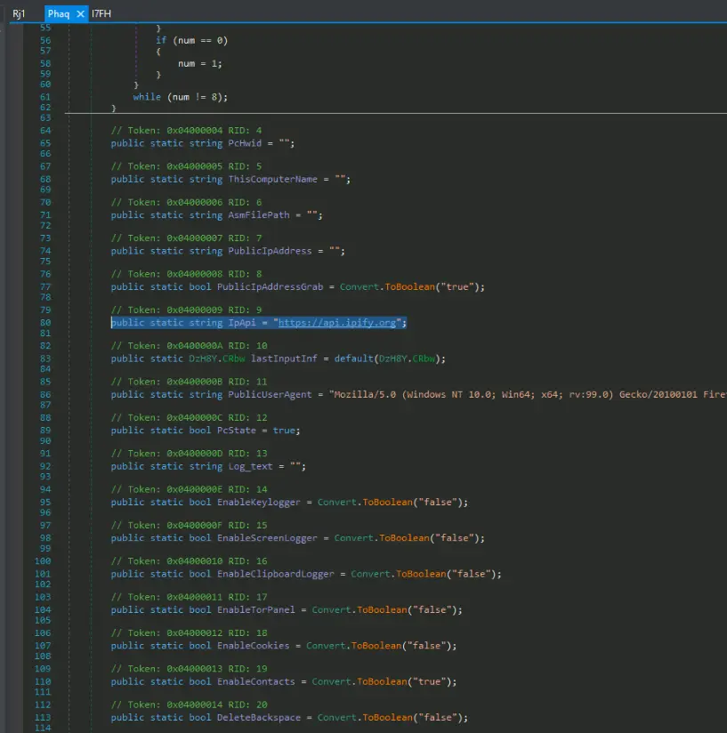

In this class there is a static string `IpApi` that points to `https://api.ipify.org`.

Googling this API shows us that it is an API to get the machine's public IP address programmatically.

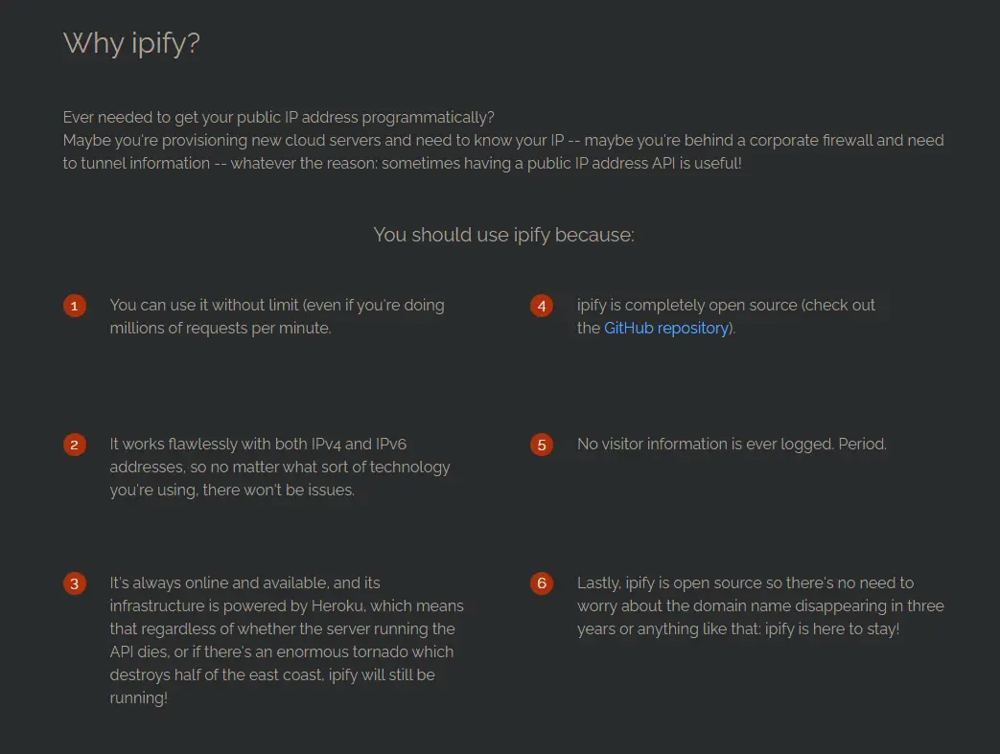

**Answer:** `ipify`

---
## Q8 — Anti-VM Function Name
>Understanding the anti-VM techniques used by malware is essential for bypassing detection in analysis environments. What is the function name used for the Anti-VM technique?

We already found this actually — if we go back to dnSpy and go under `8O7SbU` then `inSP0fl62`, we will find a function for checking what environment the malware is running in.

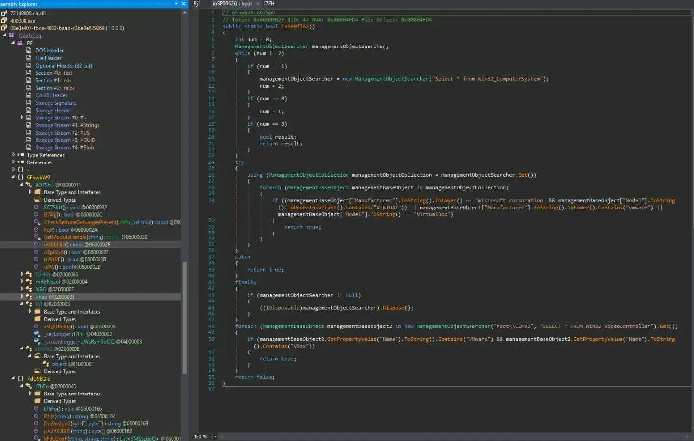

**Answer:** `inSP0fl62`

# Completion

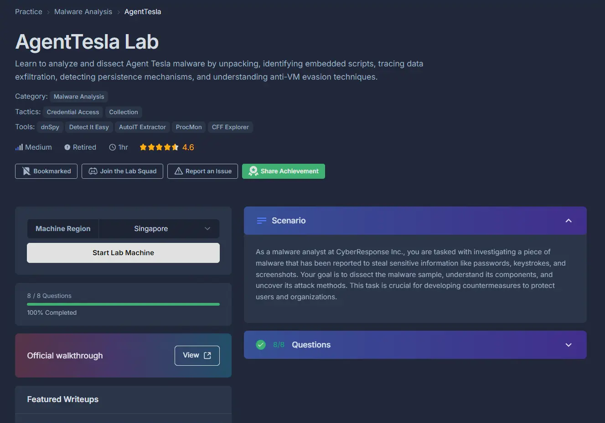
