#malware-analysis #static-analysis #RegSetValueExA #procmon #dynamic-analysis #capa #strings #floss #VirtualAlloc #IDA #cyberdefender-medium #finished #reviewed

# Scenario

During routine monitoring at MalaCrypt company, a suspicious binary named "malware.exe" was found on a device. Initial checks of its hash values against threat intelligence platforms yielded no results, suggesting the attacker may have altered the malware to evade detection. As a security analyst, the next action is to investigate further, using alternative methods beyond hash-based detection, considering that attackers often modify hashes to bypass initial security checks.

# Questions
## Q1 — Binary Architecture
>Understanding the type of binary architecture allows us to determine the types of registers being used. What architecture is this binary built for?

We can inspect the PE header using PE Studio to find the answer to this question.

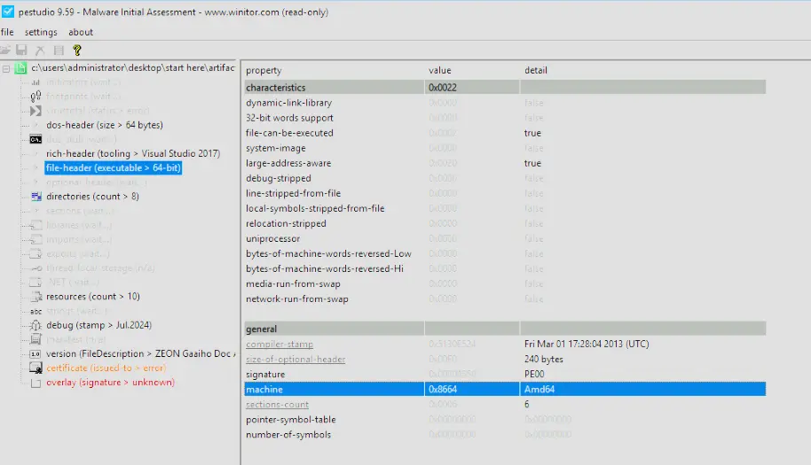

From the file header, we can see the executable is for AMD64, so the architecture it was built for was x64.

**Answer:** `x64`

---
## Q2 — Original Executable Name
>Executables are sometimes renamed or altered to evade detection or disguise their true purpose. What is the original name of the executable?

We can find the original file name through the PE header as shown below.

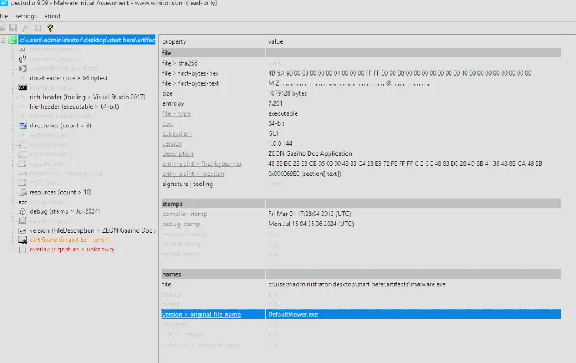

**Answer:** `DefaultViewer.exe`

---
## Q3 — Registry-Manipulating DLL
>Some DLL files are responsible for accessing Windows registries. Which DLL file is utilized to manipulate the Windows Registry?

To find which DLL files are responsible for accessing Windows registries, we check the executable's imports.
The imports that we are looking for begin with Reg, and as shown below, the program imports `RegSetValueExA` as well as other imports that manipulate the registry.
We can see that these are coming from a DLL file named `ADVAPI32.dll` which is also the answer to this question.

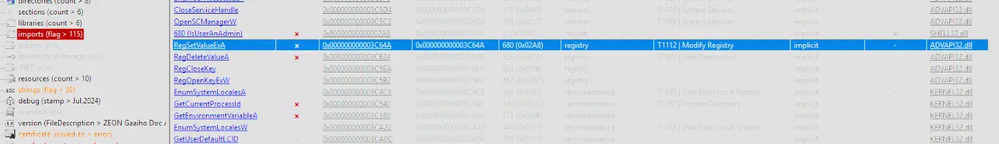

**Answer:** `ADVAPI32.dll`

---
## Q4 — Chinese Messaging App String
>Certain strings may reveal specific information. What is the name of the Chinese messaging app discovered in the basic static analysis?

Quickly scrolling through the extracted strings in PE Studio does not give us anything that helps to answer the question.
However, we know that we can find the name of the Chinese messaging app through strings.
Perhaps the strings are obfuscated or hidden in a way that the standard strings utility is unable to retrieve.
This is also likely because strings is only really capable of finding static, hardcoded strings sitting plainly in the binary.
Let's use FLOSS to potentially extract strings that the normal strings utility could not retrieve.

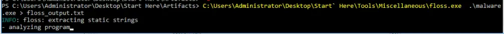

After it runs, we can see that in the stack strings is the answer to our question.

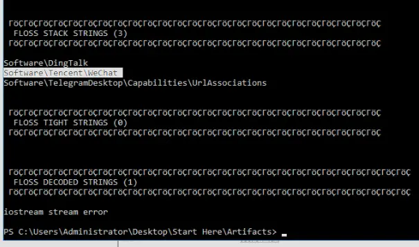

**Answer:** `WeChat`

---
## Q5 — API for Destroying Encryption Keys
>The Windows API can be used for malicious purposes. Which Windows API is used to destroy previously generated encryption keys?

To find this Windows API we return to PE Studio and look under imports.
There is an import called `CryptDestroyKey`, which after searching on the MSDN we find is actually a function to destroy keys and free the memory that the key used.

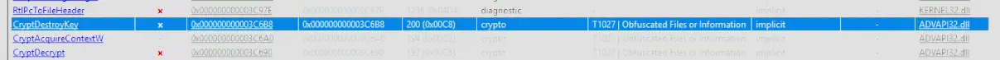

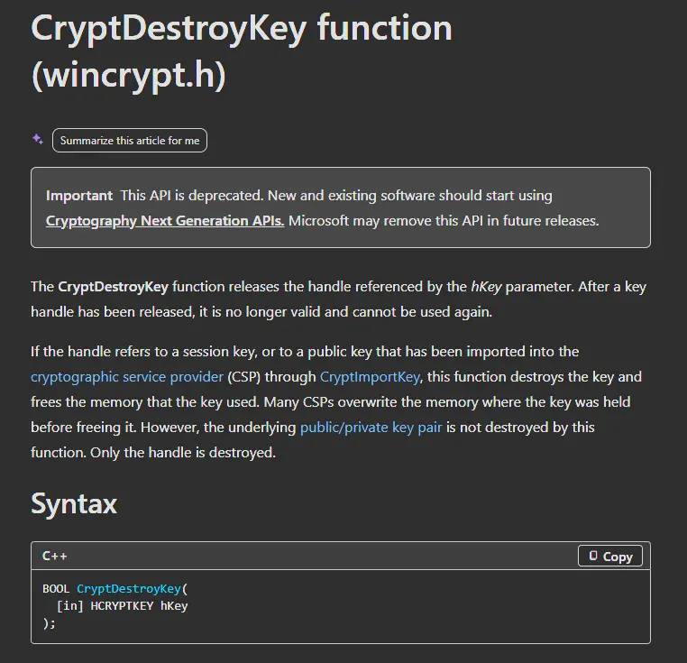

**Answer:** `CryptDestroyKey`

---
## Q6 — Hong Kong IP Address
>Knowing the attacker's IP can help trace the source of the attack and gather information about their location and network. What IP address is found in the executable that belongs to Hong Kong?

To find the answer to this, we first pass the executable to strings and do a select-strings with a basic regex pattern for IP addresses.
This may surface the IP used if it was hardcoded and plainly sitting in the binary.

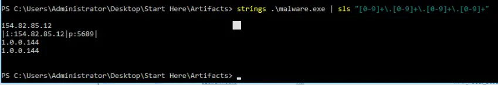

Luckily, we found an IP address.
After passing this to an IP location finder online, we see that the IP originates from Hong Kong.

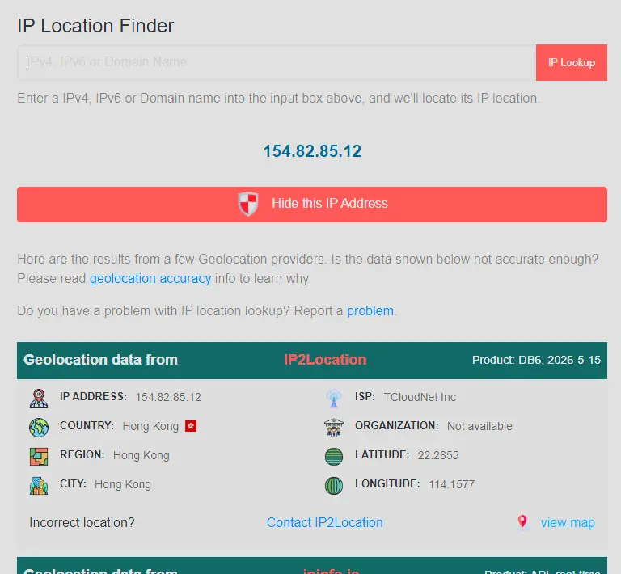

**Answer:** `154.82.85.12`

---
## Q7 — Displayed Error Message
>In dynamic analysis, we examine the behavior of the malware and identify any suspicious activities, What message is displayed on the screen when the binary is executed?

We run the program in IDA and an error shows up.
We can also just run it normally by double clicking it and it should show the same error.
However, we will see soon that running it in IDA actually helps with answering the next question.

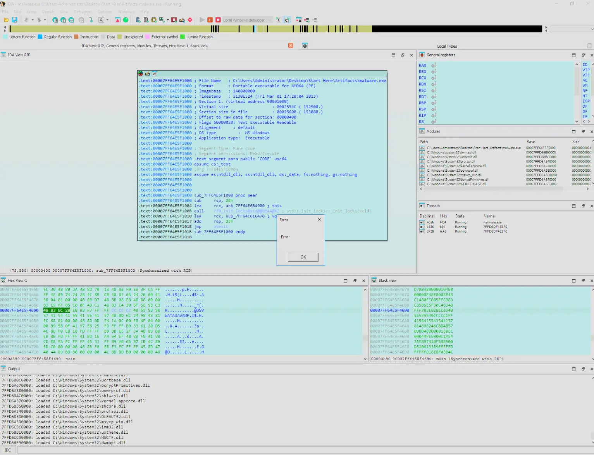

**Answer:** `Error`

---
## Q8 — First DLL Loaded
>Identifying the executed DLLs gives us insight into the attacker's strategies and goals. What is the name of the first DLL file that is loaded after the binary is executed?

When we ran it in IDA, we could check the output and see which DLLs were loaded first.
In this case, the first DLL loaded was `ntdll.dll`.

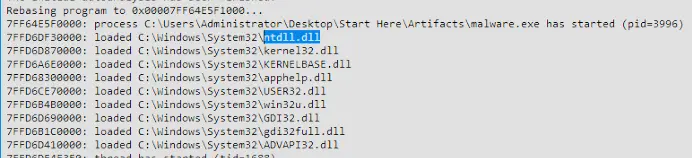

**Answer:** `ntdll.dll`

---
## Q9 — Language Pack Fallback Registry Key
>Registry enumeration involves listing all the keys and values in the Windows Registry that a process has accessed to understand its structure and contents. What is the full path of the registry key associated with fallback handling in language packs that was successfully enumerated?

To check this, we first open ProcMon and add a filter where `Process` `contains` `malware.exe` or similar.
We also add another filter `Operation` `is` `RegCloseKey`.
We want to only see the activity from the malware sample where it is closing the handle it had on certain registry keys.
This allows us to see which registry keys it opened and closed completely.
This is not the most robust way of checking what keys were enumerated, but it gets us started and it shows the full registry path.
We then run the malware sample and check what shows up.

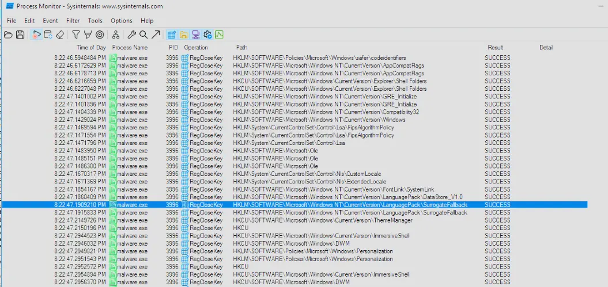

One of the records shows it opened and closed `HKEY_LOCAL_MACHINE\SOFTWARE\Microsoft\Windows NT\CurrentVersion\LanguagePack\SurrogateFallback`.
This is of interest with regards to the question because it has something to do with language packs.
Googling this registry key tells us that it provides a built-in fallback font if the system encounters an unsupported character.

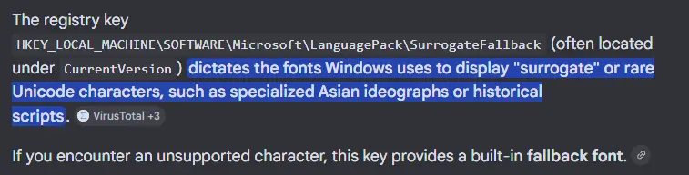

Therefore, `HKEY_LOCAL_MACHINE\SOFTWARE\Microsoft\Windows NT\CurrentVersion\LanguagePack\SurrogateFallback` is our answer.

**Answer:** `HKLM\SOFTWARE\Microsoft\Windows NT\CurrentVersion\LanguagePack\SurrogateFallback`

---
## Q10 — First API Call from Main Function
>Tracing Windows API calls helps understand what the malware is intended to do by analyzing specific patterns or arguments used in these calls. What is the first Windows API call made from the function that is called from the main function?

This is trivially answered by having the program open in IDA and stepping through its execution.
The first Windows API call it makes is `GetEnvironmentVariableA`, which is a function that retrieves the contents of a specified variable from the environment block of the process.

[GetEnvironmentVariableA function (processenv.h) - Win32 apps | Microsoft Learn](https://learn.microsoft.com/en-us/windows/win32/api/processenv/nf-processenv-getenvironmentvariablea)

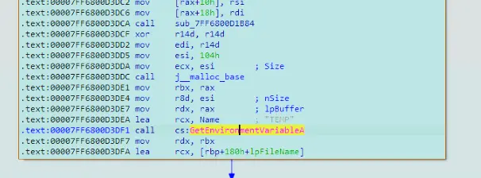

**Answer:** `GetEnvironmentVariableA`

---
## Q11 — Argument Count for API Call
>Understanding the number of arguments passed helps identify the data type being transmitted or processed. How many arguments does the API mentioned in the previous question accept?

Referencing the MSDN documentation page for this function we will see that this function takes in 3 arguments.

[GetEnvironmentVariableA function (processenv.h) - Win32 apps | Microsoft Learn](https://learn.microsoft.com/en-us/windows/win32/api/processenv/nf-processenv-getenvironmentvariablea)

We can also see the arguments being passed to the function in the IDA disassembled view.

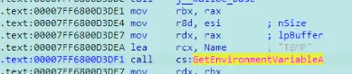

**Answer:** `3`

---
## Q12 — Embedded Company Name
>Identifying specific details within a binary can provide insights into the target's identity or the attacker's intent. What is the name of the company embedded in the binary?

This answer is found by passing the executable to FLOSS, which shows `ZEON Corporation` embedded in the binary.

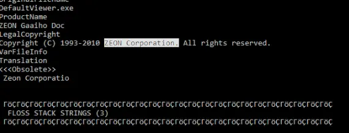

**Answer:** `Zeon Corporation`

---
## Q13 — VirtualAlloc Memory Location (Capa)
>Injecting shellcode through a **Windows callback** function involves placing the shellcode into a process and using a callback mechanism. What is the memory location of VirtualAlloc as identified in the Capa rules related to this technique?

We can use Mandiant's CAPA to answer this question.
CAPA is a static analysis tool that automatically identifies capabilities in executable files without needing us to reverse engineer it manually.
To find the exact memory location, we need to pass `-vv` to capa to make sure the output is in very verbose mode.

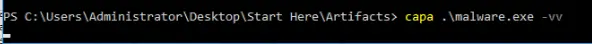

This gives us the answer.

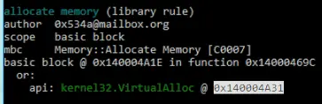

**Answer:** `0x140004A31`

# Completion

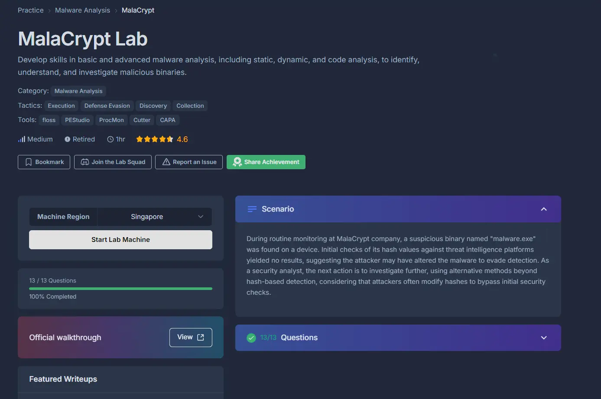
