#malware-analysis #cyberdefender-medium #cmdwatcher #sha256sum #olevba #dd #VSCode #CyberChef #finished #reviewed
# Scenario
While working as a SOC analyst, you may encounter alerts from the enterprise Endpoint Detection and Response (EDR) system regarding unusual activity on an end-user machine. In one instance, a user reported receiving an email containing a DOC file from an unknown sender. The user subsequently submitted the document for analysis to ensure it does not pose a security risk.
# Questions
## Q1 — SHA256 of DOC file
>What is the SHA256 hash of the **DOC** file?

We unzip the file then pass the file to `sha256sum`.

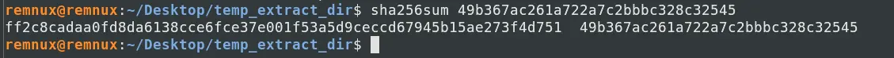

*sha256sum of DOC file*

We can also confirm it is a DOC file by passing it to `file`.

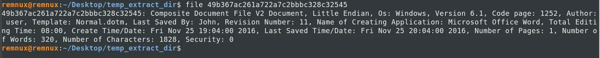

*file output of malware*

**Answer:** `ff2c8cadaa0fd8da6138cce6fce37e001f53a5d9ceccd67945b15ae273f4d751`

---
## Q2 — Number of lowest stream with macro
>Multiple streams contain macros in this document. Provide the number of the lowest one.

We pass this file to `oledump.py` to see each stream.
Each stream marked with an `m` or `M` indicates that the stream has a macro.

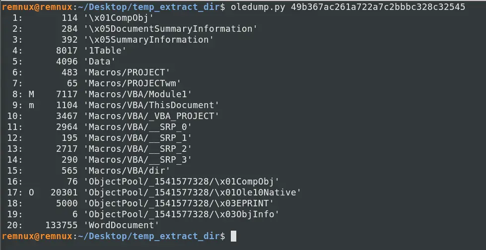

*oledump.py output of the file*

Streams 8 and 9 are both marked.
Stream 8 marked with `M` indicates that the stream contains macro code with the source code present.
Stream 9 marked with `m` indicates that the stream contains a VBA macro but the `m` implies a mismatch in source code and p-code. 
Therefore, only the p-code remains in stream 9.
Stream 17 is marked with `O` , this means there is another embedded file in the stream.

**Answer:** `8`

---
## Q3 — Decryption key
>What is the decryption key of the obfuscated code?

To find this decryption key we need to inspect the macro code.
Recall that stream 9 which corresponds to `Macros/VBA/ThisDocument` is marked with `m` .
This implies that this stream has had their macro code either removed or stomped as the `m` indicates a mismatch with p-code and the source. 
What this means for us as analyst is that we cannot fully trust the output of `oledump` for this file as the underlying p-code which holds the actual malicious logic is never surfaced in a readable form.
What we need to do is to use `pcode2code` to disassembled the compiled p-code and see what is the output if any.

Let's use `pcode2code` to extract the code.

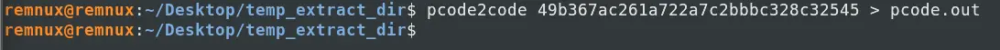

*Using pcode2code to extract the macro code*

The output is as follows,

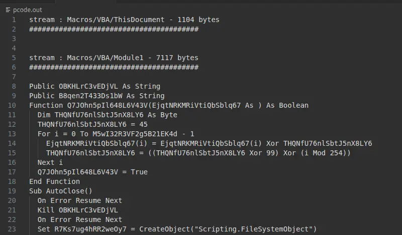

*Short snippet of output of `pcode2code`*

If we look at the stream `Macros/VBA/ThisDocument`, `pcode2code` did not manage to extract anything meaningful.
Even running the same file through `pcodedmp` yields nothing of use.
For now, it seems that this stream will yield nothing of use.
Let us move our efforts to `Macros/VBA/Module1`.

One thing to note is that the `pcode2code` output may contain some artifacts i.e. the output is imperfect.
This is seen in the first function defined starting with `Q7John...` in `Macros/VBA/Module1` .
The function arguments look cut off.
Let's try running this file through `olevba` instead to get a cleaner output since the stream we are focusing on had no mismatches in the source and p-code. Therefore, `olevba` should be able to get the source code cleanly.

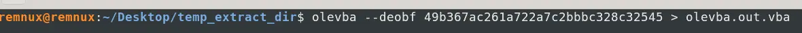

*Running the olevba command*

This gets us the following,

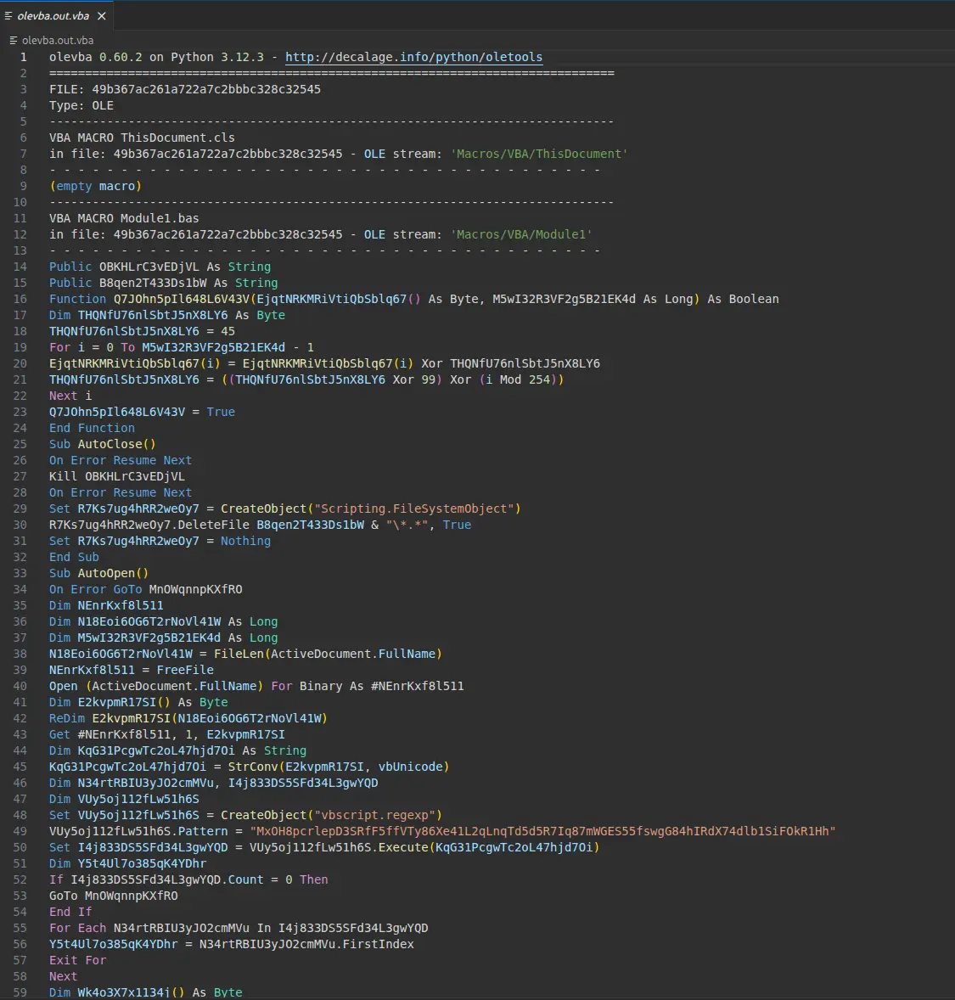

*Code of olevba.oput.vba*

Our goal here is to find a decryption key.
We should probably look at the `AutoOpen()` sub to see if we can get any clues.
This is because `AutoOpen()` is the sub that runs immediately upon opening the file.
Therefore, the payload is likely dropped in this part of the code.
Let's also make the output more readable by indenting the code.

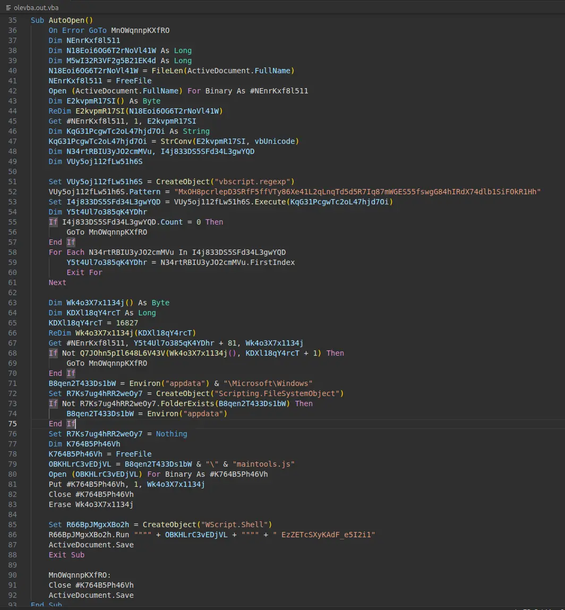

*`AutoOpen()` code block*

There is a few interesting code blocks in the sub but if we focus near the end where a `WScript.Shell` object is created, we can see an
interesting call being made.

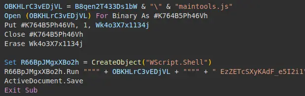

*`WScript.Shell` call*

We can see in this code snippet that there is a call being made to `WScript.Run` where the argument passed is a single string consisting of two parts which are
- `OBKHLrC3vEDjVL` 
- ` EzZETcSXyKAdF_e5I2i1`

The first part is a path to a file called `maintools.js`.
The second part is a string that is neither a function, variable nor was it manipulated anywhere else in the code.
Each `""""` -> `"`  so the call being made here is a single string and when resolved looks like,

`Wscript.Shell.Run(""Path\to\maintools.js" EzZETcSXyKAdF_e5I2i1")

Therefore, `Wscript` is running a file `maintools.js` and this script only takes in 1 argument which is a string literal.
This is characteristic of a decryption key being passed to the next stage of a malware to decrypt the payload.
We are very likely to find the decryption algorithm as well as the actual payload of the malware in `maintools.js`.

**Answer:** `EzZETcSXyKAdF_e5I2i1`

---
## Q4 —  Name of dropped file
>What is the name of the dropped file?

We have already identified this earlier in the previous question. 
The dropped file is `maintools.js`

**Answer:** `maintools.js`

---
## Q5 — Script language
>This script uses what language?

The first instinct especially for modern programmers is that `.js` is `javascript`.
However we need to remember that this is running through a call made to `Wscript.exe` and is being dropped from a VBA macro.
`WScript` natively runs `Jscript` so the script language is likely that over `javascript`.
`JScript` is Microsoft's older and custom version of `javascript`.

**Answer:** `jscript`

---
## Q6 — Variable name for command-line args
>What is the name of the variable that is assigned the command-line arguments?

To determine the variable that is assigned the command-line arguments we need to inspect `maintools.js`.
To do that we can detonate the file in a controlled environment using Microsoft Word or get it out manually by inspecting the macro code.
We will cover both approaches here.

### Dynamic Analysis Approach
We need to first change some settings to ensure the payload is created.
In Microsoft Word, go to `File>Options>Trust Center>Trust Center Settings`.

Under `Macro Settings`, check `Enable all macros`.

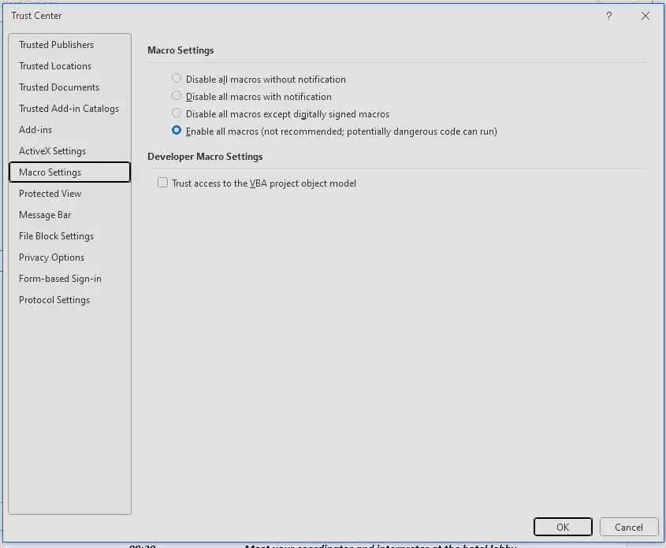

*Macro Settings*

Under `Protected View`, uncheck all three boxes and click ok.

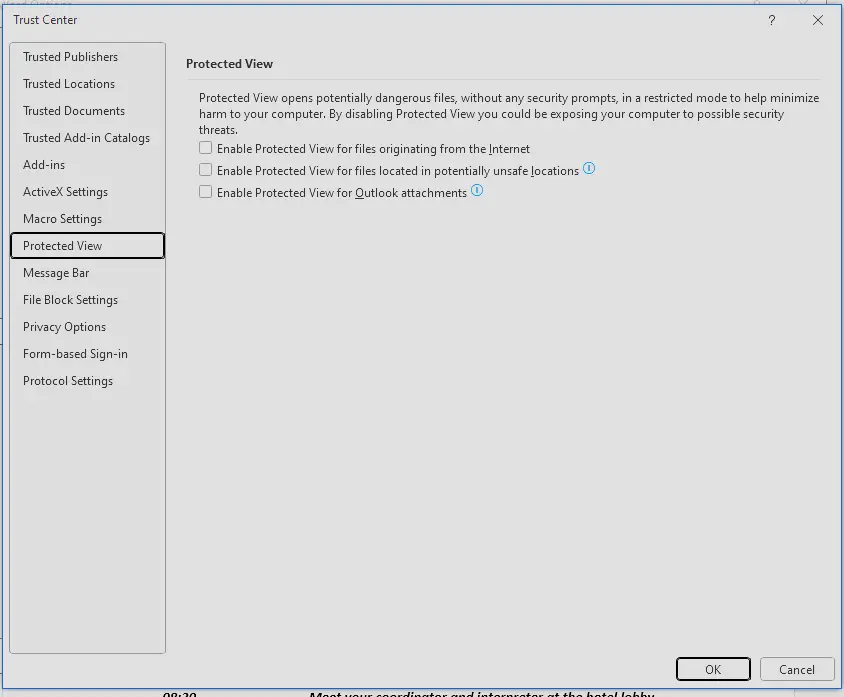

*Protected View Settings*

Now Microsoft Word is ready to detonate the sample.
However, before that let's run `procmon` and set a filter for `wscript`.
We already know from static analysis that `wscript` will reference a `maintools.js` at some point.
Therefore, we are looking for `wscript` interacting with the file and at the point with the document still open we can try to grab the contents of `maintools.js` for analysis.

After detonating the file, we see the following word content.

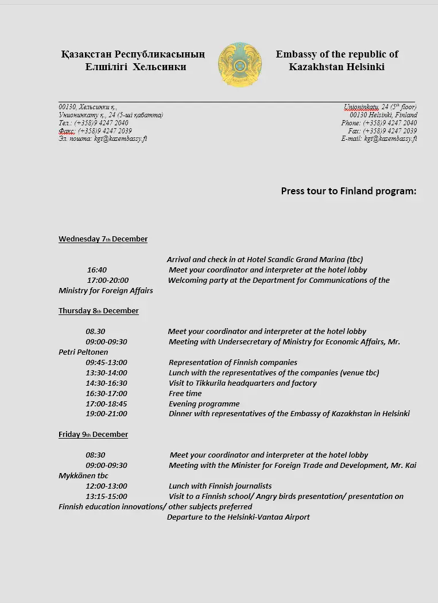

*Contents of malicious sample*

The document looks like a schedule of some sort.
Let's have a look at the `procmon`.
In `procmon`, we can see that the program interacted with `maintools.js`.

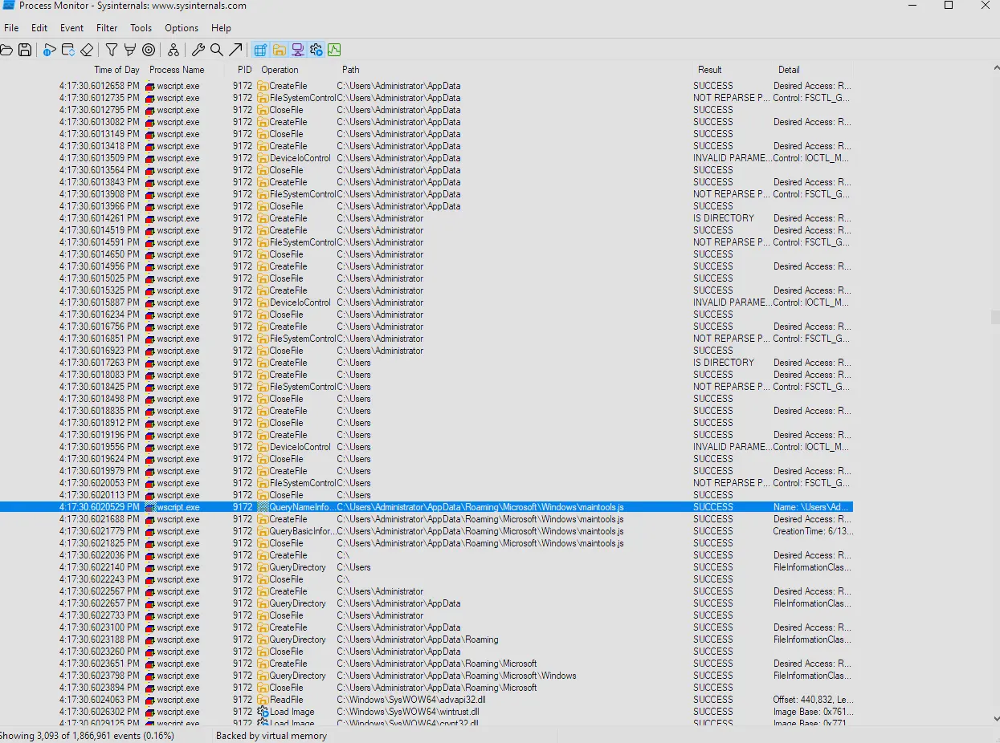

*Procmon captured output*

And that the file is in `%APPDATA%\Microsoft\Windows\maintools.js`.
Opening the file in `VS Code` we can see the following,

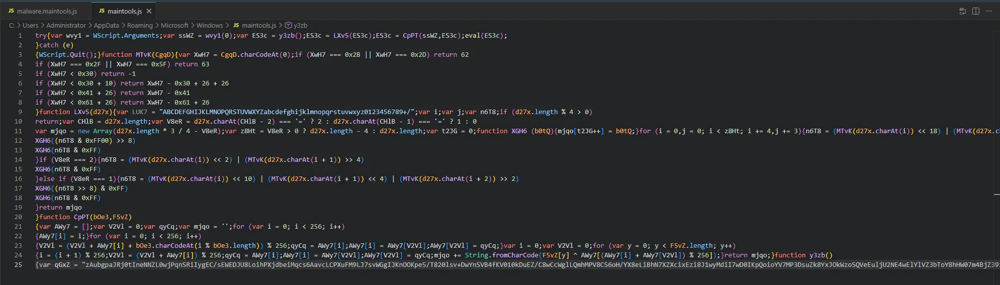

Which is really hard to read so let's copy the file and format it to be more readable.

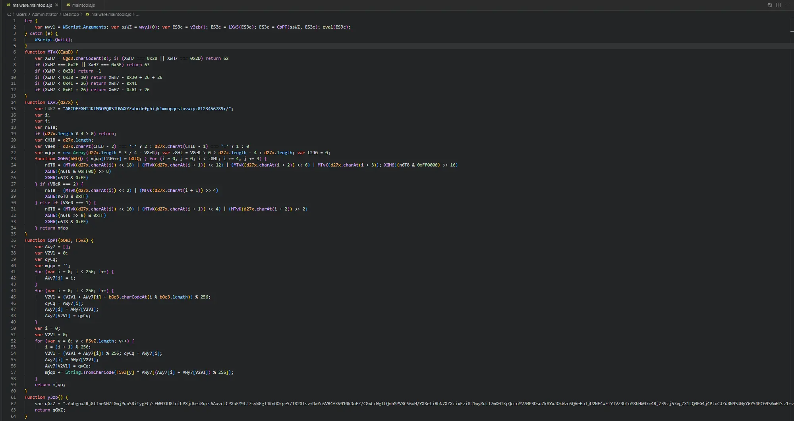

### Static Analysis Approach
If we analyse the macro code that drops the `maintools.js` we can reverse engineer the mechanism in which the file is dropped as well as how it is decrypted. 

If we go under `AutoOpen()`, we will find this section of code that performs a regex match on the binary of the current document.

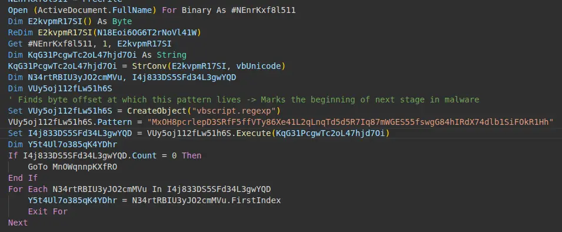

*Regex matching in `AutoOpen()`*

We can see in this code that it matches the string that begins with `MxOH...` with the bytes of the `ActiveDocument`.
This likely marks the byte offset where the next stage of the malware is located.
If we look at the lines after this we will see the following, (with added comments to follow more easily)

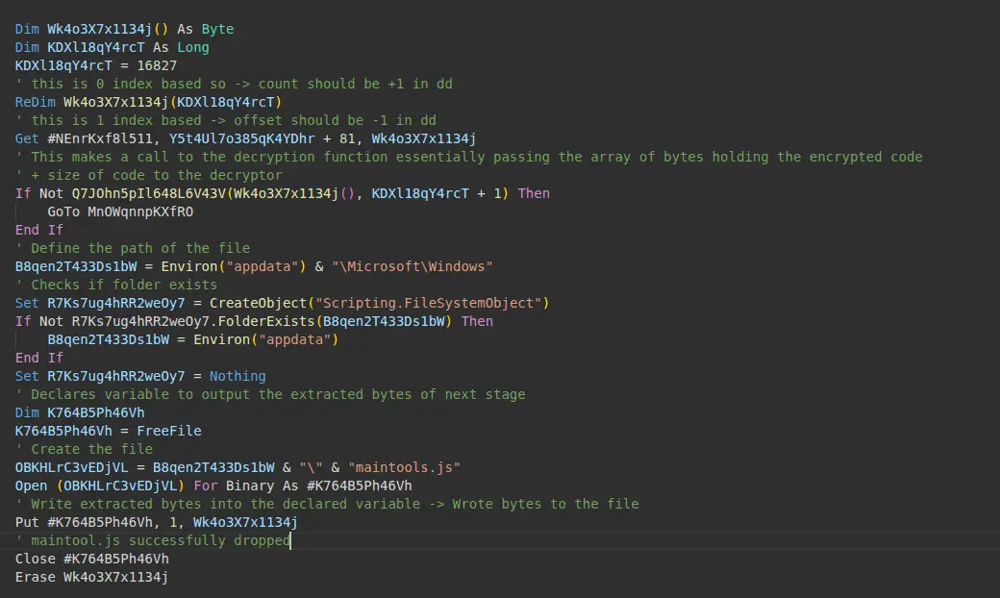

*Creation of `maintools.js`*

In summary, what is being done in this part of the code is that 
- The bytes of the next stage is extracted using the byte offset determined from the last block of code + 81
- The bytes are passed to the decryption function defined by `Q7JOhn...`
- The size of the next malware stage is hardcoded at 16827 + 1
- The code checks if the folder `%appdata%\Microsoft\Windows` exists other wise set path to just `%appdata%`
- Creates an open file handle for `maintools.js` -> Effectively creates the file `maintools.js` at the path 
- Writes the extracted bytes of the next stage into the open file handle

Therefore to extract the next stage we need to
- Find the offset at which the next stage starts at -> `grep`
- Dump the next stage at that offset with the correct size/count -> `dd`
- Reverse Engineer the decryption algorithm to get the plaintext.
#### Finding the byte offset
To find the offset we need to perform the same regex matching to the document binary. 
We can do that using `grep -Eboa <value to match>` which gets us this 

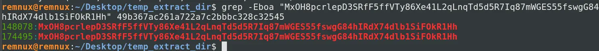

*`grep` output*

Now do note that the offset here needs to be incremented by 80 , 81-1.
The reasons as to why is because in the code we can see the author adds 81 to the offset and since VBA `Get` is 1-index based we need to adjust the offset of our grep by decrementing by 1.
Since 1-index based offset = 0-index based offset - 1.

Therefore, our byte offset is `148158`.
#### Finding the count and dumping the binary

Now we need to get the count.
This one is easier than the byte offset since it is hardcoded.
One interesting thing about VBA is that when the code performs `ReDim someVar(16827)`, VBA actually creates an array with indices `0` to `16827` which consists of `16828` elements.
So the size is `16827+1` which is `16828`.

With both byte offset and count, we can finally dump the binary.

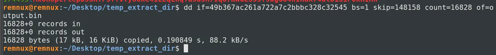

*`dd` command to dump the binary*

#### Reverse Engineering the Decryption
We already know the decryption function is a function name that starts with `Q7JOhn...`.
Let's look at that function in the `olevba` output.
Below is the function,

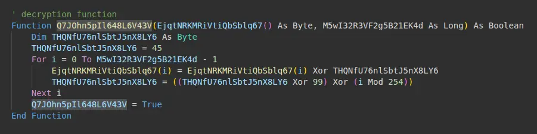

This function takes two arguments , an array of bytes and a long.
The starting key is `45`.
It then iterates through every byte in the array.
On the first byte, it Xor's the byte with `45`.
In the next iteration, the key is changed by the operation `((key Xor 99) Xor (i Mod 254))`.
As a result, the key is a rolling key and is designed to change with each iteration.

Knowing this, we can create a simple python script to recreate this.

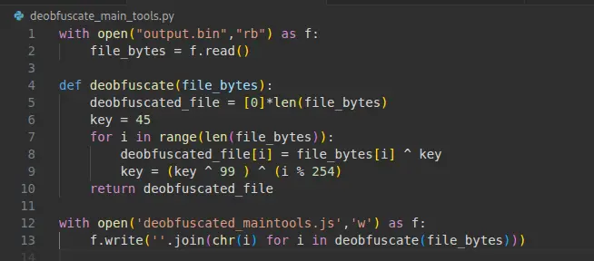

*Decryption algorithm in python*

Running this script then gives us the plaintext `maintools.js`.

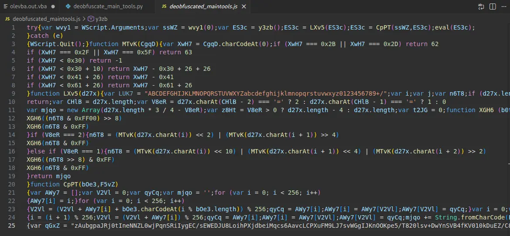

*Extracted `maintools.js`*

### Finding the Answer

We already know that this script only takes 1 argument.
That argument is the decryption key.
We determined this during our static analysis of the stream `Macros/VBA/Module1`.

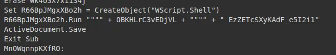

*Snippet of code showing script call*

To see how this decryption key is processed we need to also know which variable holds the command-line arguments.
At the very top of the script is the following,

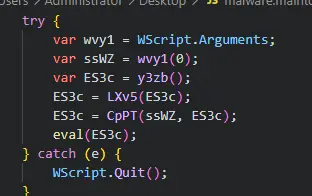

*Top of the maintools.js script*

We can see that `Wscript.Arguments`  is assigned to `wvy1`.
This means that `wvy1` is our answer.
Furthermore, the argument in index 0 of `wvy1` is being assigned to `ssWZ`.
`ssWZ` holds our decryption key.

**Answer:** `wvy1`

---
## Q7 — Number of arguments
>How many command-line arguments does this script expect?

From our static analysis of the `olevba` output as well as the code of `maintools.js`. We can tell that only one argument is passed to the script.
Where this argument is the decryption key.

**Answer:** `1`

---
## Q8 — Instruction executed on Error
>What instruction is executed if this script encounters an error?

We can see this in the `try catch` block at the very start of the script.

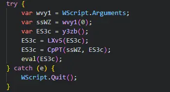

*`try catch` block*

The script quits if it encounters any error.

**Answer:** `Wscript.Quit()`

---
## Q9 — Function that returns next stage
>What function returns the next stage of code (i.e. the first round of obfuscated code)?

We can see this in the first assignment of the variable `ES3c`.
The value being assigned is the return value of the function `y3zb()`.

**Answer:** `y3zb`

---
## Q10 — Variable with important key string value
>The function **LXv5** is important, what variable is assigned a key string value in determining what this function does?

Let's have a look at `LXv5`.

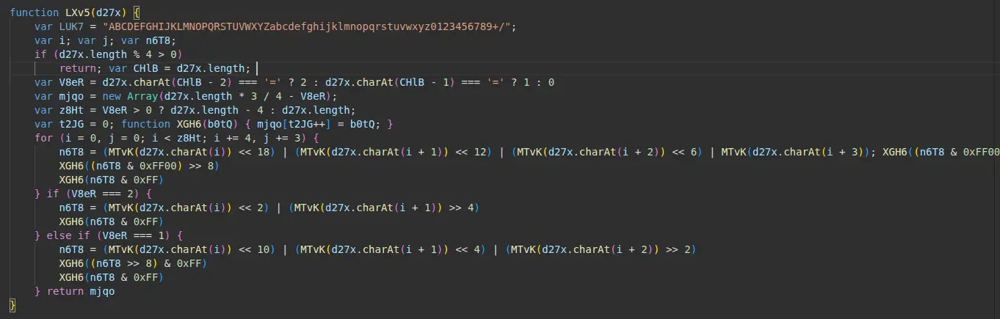

*function `LXv5`*

The variable `LUK7` is a long string value and if we pay attention to how the characters are lined up we can tell that is actually 
the entire alphabet for `base64` starting from index 0.

**Answer:** `LUK7`

---
## Q11 — Encoding scheme
>What encoding scheme is this function responsible for decoding?

We already deduced this from the last question.
`LUK7` is holding a long string that represents the entire alphabet of `base64`.
Furthermore, if we examine the code, this entire function `LXv5` is just an algorithm to manually
decode the base64 encoded string that get's passed to it.

The long string that gets passed to it is the return value of `y3zb()`.
Therefore, we can get the raw bytes of the payload of the malware by decoding this long string.

We can decode it in cyberchef then save the output as a file.

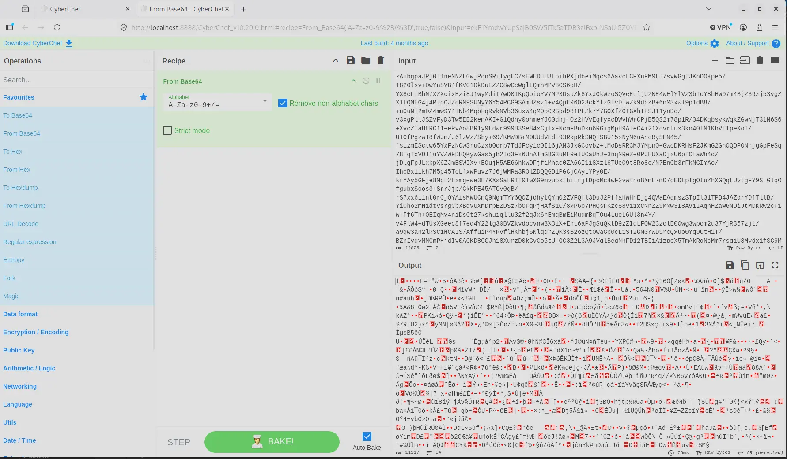

*CyberChef base64 decode*

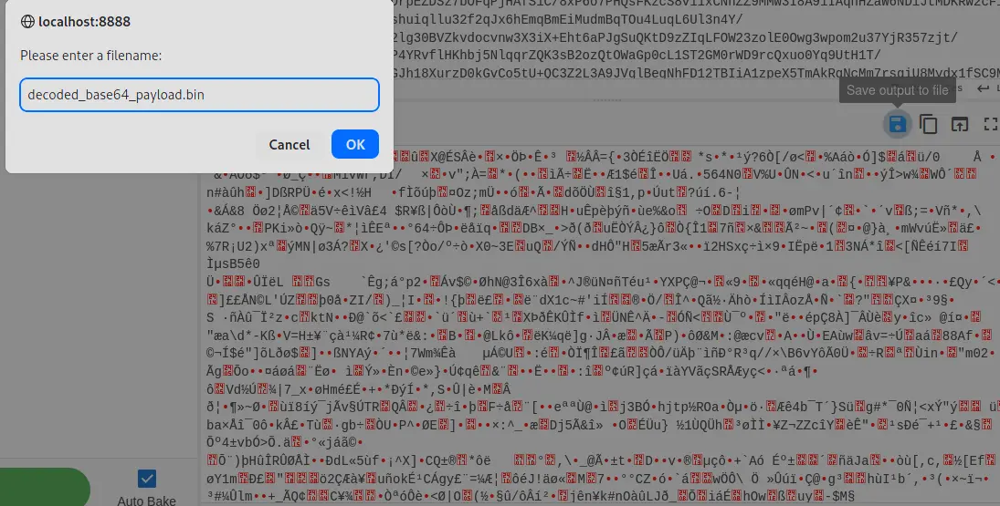

*Saving the output as a file*

**Answer:** `base64`

---
## Q12 — Important part of function
>In the function **CpPT**, the first two **for()** loops are responsible for what important part of this function?

At a first glance, we can intuitively tell that this function is decrypting the encrypted bytes returned 
from decoding the base64 value returned from `y3zb()`.

However, to answer this question we need to identify the encryption algorithm being used here.
If we look carefully at the code below we can tell that,

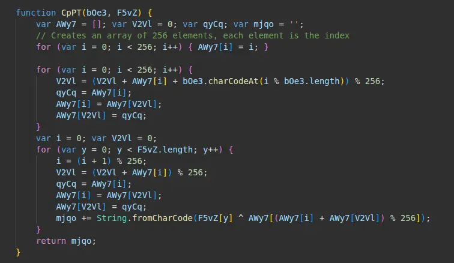

*Function `CpPT`*

In the first and second for loop,
- The code initializes a 256-byte array each element in the array is just the value of it's index. So array[0] = 0. 
- It takes the decryption key that it gets passed then shuffles the values in the array based on the key. This way of shuffling creates a specific permutation that is entirely determined by the key. This same key will always produce the same shuffle.

In the third loop, it actually decrypts the encrypted data.
- In each iteration we determine what element in the scrambled array of 256 bytes is the byte we need to Xor with the current encrypted byte
- We then swap the position of 2 bytes in the array at positions `i` and `V2Vl` to prepare for the next iteration

This is highly characteristic of `RC4` and the first two loops is the first phase of the algorithm called `KSA` which is `Key-Scheduling Algorithm`.

**Answer:** `Key-Scheduling Algorithm`

---
## Q13 — Value of first arg
>The function CpPT requires two arguments, where does the value of the first argument come from?

To answer this we just have to look at the `try` block at the start of `maintools.js`.

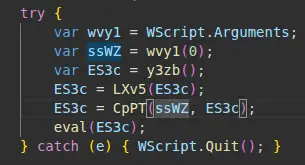

*`try` block*

We can see that the first argument is `ssWZ` which is derived from  the `command-line argument` at index 0.
Therefore, the first argument comes from `command-line argument`.

**Answer:** `command-line argument`

---
## Q14 — First arg represents
>For the function **CpPT**, what does the first argument represent?

We know that the only argument passed to this script is the decryption key.
Therefore, the first argument represents the `key`.

**Answer:** `key`

---
## Q15 — Encryption Algorithm
>What encryption algorithm does the function **CpPT** implement in this script?

We determined that this algorithm is characteristic of `RC4`.

**Answer:** `RC4`

---
## Q16 — Function to load code
>What function is responsible for executing the deobfuscated code?

The return value of `CpPT` is the unencrypted payload.
If we look at the below code,

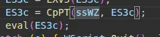

*Function that calls decrypted payload*

We can see that `eval()` is used to execute the deobfuscated code.

**Answer:** `eval`

---
## Q17 — Windows Script Host program
>What Windows Script Host program can be used to execute this script in command-line mode?

To execute a script in `command-line` mode we just need to find the command line version of `wscript.exe` which is `cscript.exe`

**Answer:** `cscript.exe`

---
## Q18 — Name of function
>What is the name of the first function defined in the deobfuscated code?

Having identified the encryption algorithm we can trivially decrypt this code using cyberchef or a simple python script.

### CyberChef decryption

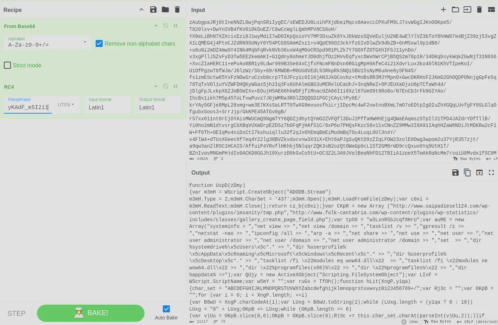

*Output of decryption using CyberChef*

### Python Script

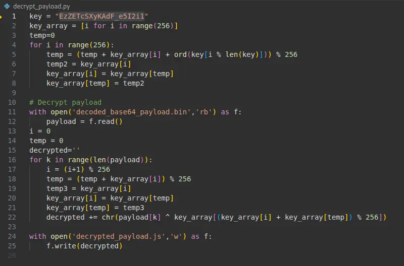

*Python script used to decrypt payload*

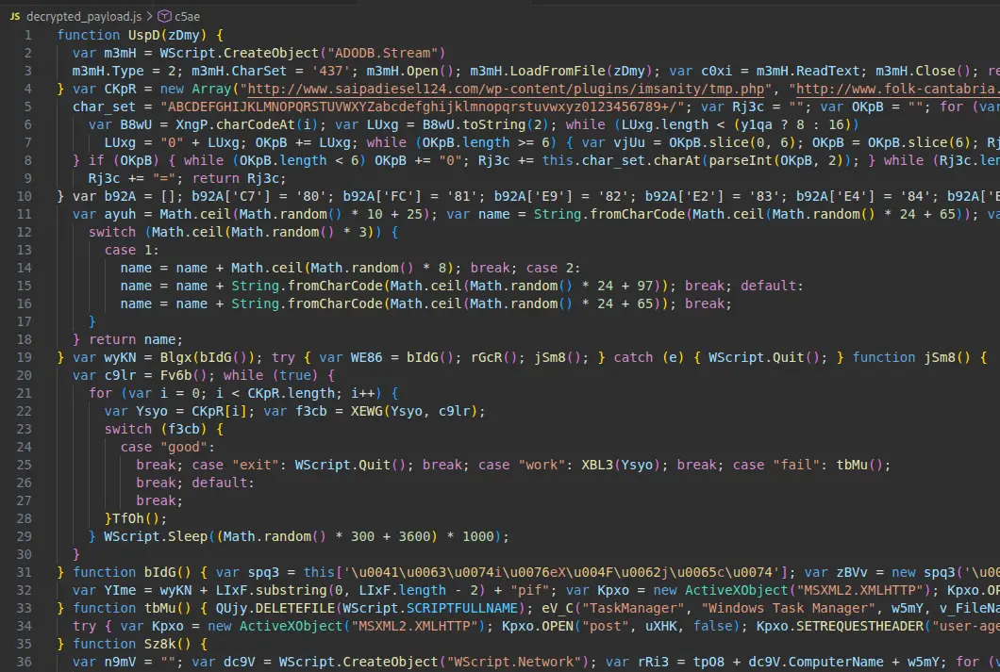

*Snippet of decrypted payload*

From the decrypted payload we can see the first function defined is `UspD`.

**Answer:** `UspD`

---

# Completion

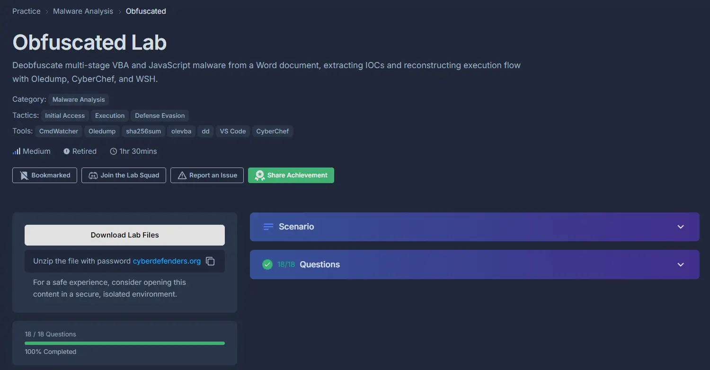

I successfully completed Obfuscated Blue Team Lab at @CyberDefenders!
https://cyberdefenders.org/blueteam-ctf-challenges/achievements/francisvil3213/obfuscated/
 
#CyberDefenders #CyberSecurity #BlueYard #BlueTeam #InfoSec #SOC #SOCAnalyst #DFIR #CCD #CyberDefender
