#malware-analysis #cyberdefender-medium #finished #reviewed

# Scenario

Analyze Excel 4.0 macros using XLMDeobfuscator and OLEDUMP to identify anti-analysis techniques and subsequent stage download attempts.

**Instructions:**

- Uncompress the lab (pass: **cyberdefenders.org**)
- Zip sha256: 35fb4497de1633d6887fd1453ee1426ca627eeec
- Zip size: 74 KB

  
**Scenario:**  
Recently, we have seen a resurgence of Excel-based malicious office documents. However, instead of using VBA-style macros, they are using older style Excel 4 macros. This changes our approach to analyzing these documents, requiring a slightly different set of tools. In this challenge, you, as a security blue team analyst will get hands-on with two documents that use Excel 4.0 macros to perform anti-analysis and download the next stage of the attack.

**Samples:**

- Sample1: MD5: fb5ed444ddc37d748639f624397cff2a
- Sample2: MD5: b5d469a07709b5ca6fee934b1e5e8e38

# Questions

## Sample1: What is the document decryption password

To get started let's just validate the checksum first.

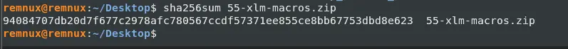

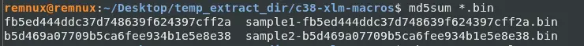

The checksums for the samples match but the zip file does not.
This is to be expected as the sample were probably zipped again, causing the hash to be different.
Anyways, we will run these files through `PEFrame`.

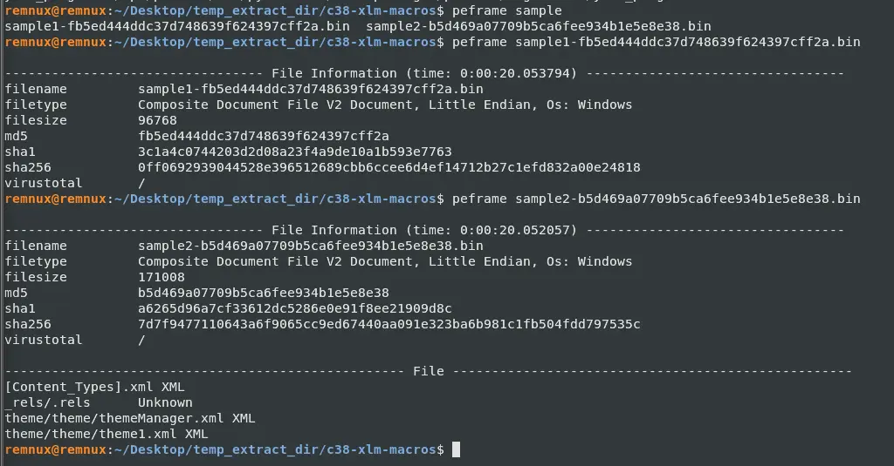

Both files are OLE structured storage.
However, notice how nothing was immediately caught by `peframe` whereas for `maldoc101` , another cyberdefenders challenge, this step immediately gave us a few hints.
This is likely due to what is described in the scenario.
The malware is using Excel 4.0 macros which are older and actually predate VBA.
This leaves little to nothing for `peframe` to flag which results in the short output.
Let's try passing the first sample to `oledump` and see what we get.

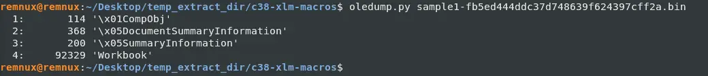

This does not really tell us much because oledump operates at the OLE container level whereas XLM macros (i.e. Excel 4 Macros) live inside the workbook itself.
While, oledump has a plugin specifically for this, there is a dedicated tool that does a better job at finding these XLM macros.
Let's use `XLMDeobfuscator`.

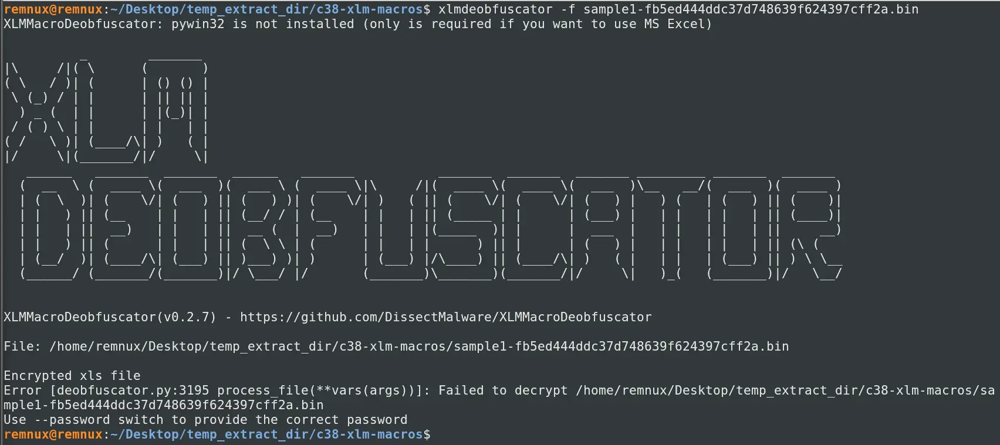

When we try to pass the first sample in, it states it needs a password.

One interesting thing to note before we start this though, is that the password `VelvetSweatshop` is unique because Microsoft built that password in.
Whenever Excel encounters an encrypted file, it silently tries `VelvetSweatshop` before prompting the user for a password.
If this decryption works, the file just opens with no dialog.
Why is this significant? Because the encryption means that it is harder to detect the payload but to the end user, it is trivially opened with no password required.
Malware authors abuse this a lot as an evasion technique for this specific reason.

Let's try to crack the password of sample1 file using `msoffcrypto-crack.py`.
Which gives us the password.

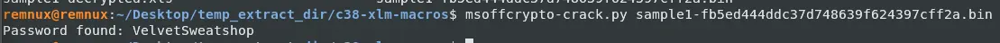

Unsurprisingly, the password is `VelvetSweatshop`.
Let's get the decrypted `xls` by using `msoffcrypto-tool`.

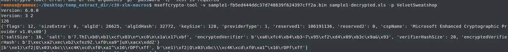

So now we have the decrypted version of the file and we determined the password.

## Sample1: This document contains six hidden sheets. What are their names? Provide the value of the one starting with S.

With the decrypted xls we can now run this through `XLMDeobfuscator` to see what we can get.

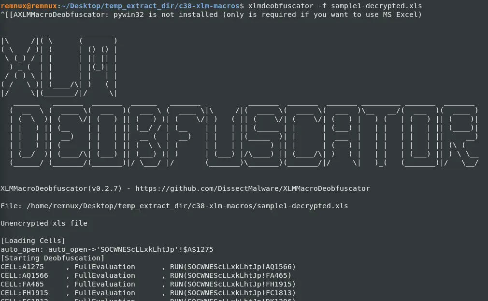

We can see that the file auto opens a sheet named `SOCWNEScLLxkLhtJp` and this line also gives us the entry point of the malware which is `$A$1275`.

## Sample1: What URL is the malware using to download the next stage? Only include the second-level and top-level domain. For example, xyz.com.

If we scroll down further in the `XLMDeobfuscator` output, we will see that it creates a directory using this call

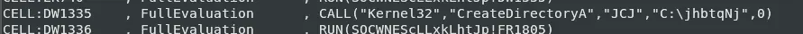

And just under that is a url that is constructing using different cells

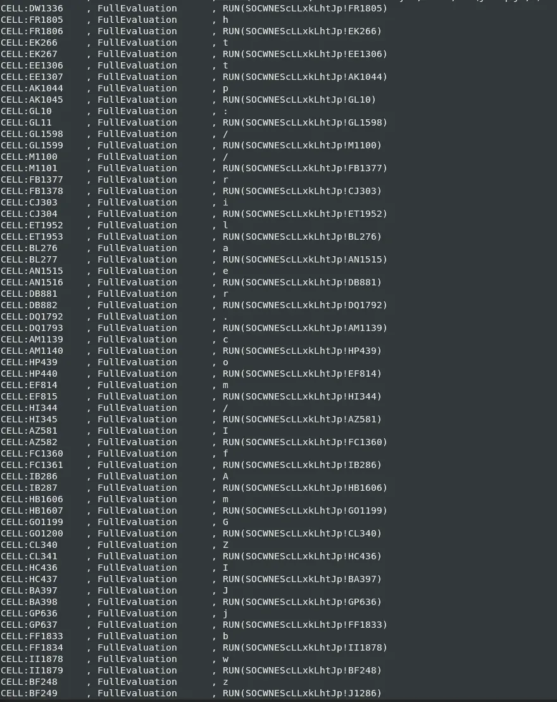
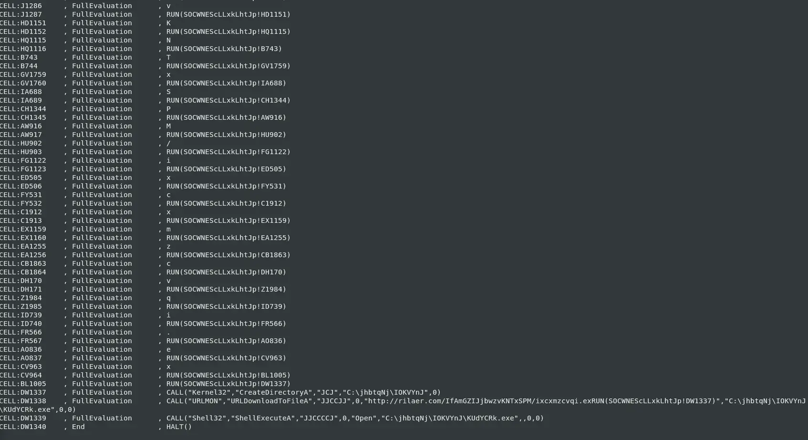

This url is called in the last few lines and when we put everything together, sample1
- Creates a new directory `C:\jhbtqNj`
- Creates a sub directory `C:\jhbtqNj\IOKVYnJ`
- Downloads a file from a malicious domain shown above and writes it into the `C:\jhbtqNj\IOKVYnJ` with name `KUdYCRk.exe`
- It then executes the downloaded payload

To determine what type of malware is this we can go to URLhaus and search for the domain we found.

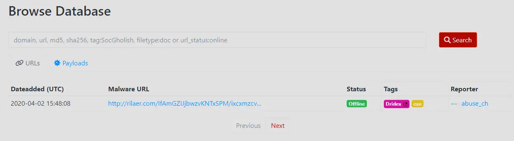

We found it. This malware belongs to `dridex`.

## Sample2: This document has a very hidden sheet. What is the name of this sheet?

Let's run sample2 through `XLMDeobfuscator` and see what output we get.

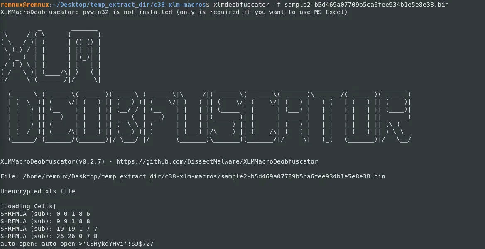

This file was not encrypted and we can see that it auto opens `CSHykdYHvi` with an entry point `$J$727`.
If we scroll down, we will see that this malware is trying to hide this sheet as well.

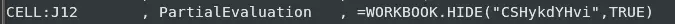

Furthermore, the second argument being `TRUE` means that the sheet is set to be `very hidden`.

## Sample2: This document uses reg.exe. What registry key is it checking?

Apart from hiding this work sheet, it also seems to access the registry.

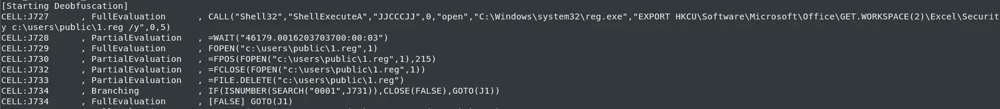

It is accessing `HKCU\Software\Microsoft\Office\GET.WORKSPACE(2)\Excel\Security`.
To understand what this means, we need to grab a reference for `Get.Workspace`, which as we will see soon enough, is used a lot in this file.
I will be referring to this [get.workspace](https://xlladdins.github.io/Excel4Macros/get.workspace.html).

Using the reference, we can see that `HKCU\Software\Microsoft\Office\GET.WORKSPACE(2)\Excel\Security` means he is grabbing the current version of Excel so he can access the registry keys under security. There are a few registry keys under `Security` but the key it is likely referencing is `VBAWarnings`.

I found this out through google when I was trying to determine what subkeys `Security` has.

[windows - Help me find the reg-key which is preventing me from chaning excel macro security-level? - Stack Overflow](https://stackoverflow.com/questions/626149/help-me-find-the-reg-key-which-is-preventing-me-from-chaning-excel-macro-securit)

The stack overflow question linked above really helped to deduce this because the original poster was looking for a way to set the macro security to be the lowest due to his test-framework requiring it. The key point here was he is trying to lower the macro security as much as possible and the first answer to his question directly references `\Security\VBAWarnings`.

Therefore, I deduced that it is likely that this was the key that the malware author was referencing.
I will elaborate further in the next question.

## Sample2: From the use of reg.exe, what value of the assessed key indicates a sandbox environment?

From examining the code, we can see that it has branches in its execution.

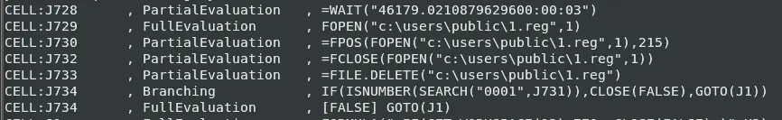

If we look at `J734` in particular we can see that the malware is checking if `VBAWarning` is already set to `0001` and if it is, it closes the program.
Otherwise, jump to the next instruction at `J1`.

It is likely that it is checking this value to be `0x1` because that means that Excel has the macro security set as low as possible.
This is an anomaly for legitimate machines as this registry key is almost never set as this value, it is way too permissive.
Furthermore, in the last question, we found a stack overflow question where the original poster had to go through great lengths to even try to enable this.
Therefore, if this value is set, the rationale is probably that the machine it is running on, is not a legitimate victim machine and is instead an analysis or sandbox environment.

## Sample2: This document performs several additional anti-analysis checks. What Excel 4 macro function does it use?

If we look back at our `get.workspace` reference, we can easily start to see why this function keeps showing up.
`get.workspace` allows the malware author to check if the program is running in a legitimate user environment.
For instance,

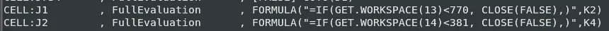

`GET.WORKSPACE(13)` : checks the usable workspace width in pixels
`GET.WORKSPACE(14)` : checks the usable workspace height in pixels

Therefore, it is checking if the usable workspace is a certain size in pixels otherwise it halts the execution.
This is likely because automated analysis environments will have a workspace much smaller than what it is checking for since the display is not needed in those environments.
A legitimate user on the other hand is likely to have the application in a proper resolution so the values are readable.

If we explore the rest of the code we can see it makes liberal use of `GET.WORKSPACE` and if we translate them we get the following,

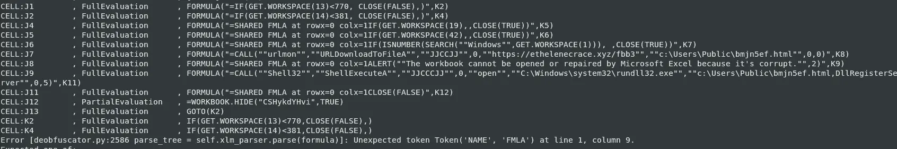

`GET.WORKSPACE(19)` :  Check if a mouse is present
`GET.WORKSPACE(42)` :  Check if the computer is capable of playing sound
`GET.WORKSPACE(1)` :  Check name of the environment in which Excel is running. It checks if it is 'Windows'.

This shows just how much effort the malware author went through to really make sure the device it is running in is a legitimate user work station.

## Sample2: What type of payload is downloaded?

After it passes the anti-analysis checks, it downloads a payload as seen below,

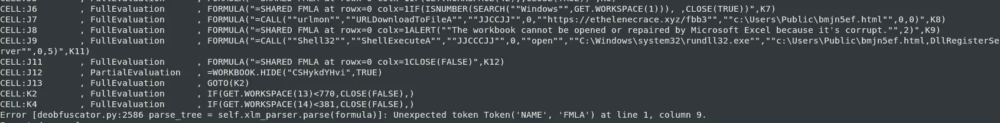

The url downloads itself as a html but later calls `rundll32.exe` to execute the file.
Therefore, the payload is `dll`.

## Sample2: What URL does the malware download the payload from?

We can also see from this snippet of code the URL that the malware downloads from.

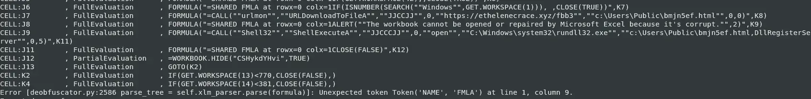

Which is `https://ethelenecrace.xyz/fbb3`

## Sample2: What is the filename that the payload is saved as?

From the same snippet of code and call we can see the file saves itself as `bmjn5ef.html`.
This was probably done to make the file seem benign.
Furthermore, `rundll32.exe` does not care what the file extension is, it will just run the file as a `dll`.

## Sample2: How is the payload executed? For example, mshta.exe

We can see it was called using `rundll32.exe` so it was being ran as a dll.

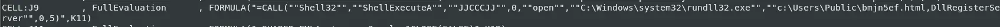

## Sample2: What was the malware family?

When we search the domain we come across a few reports about this malware sample in particular.

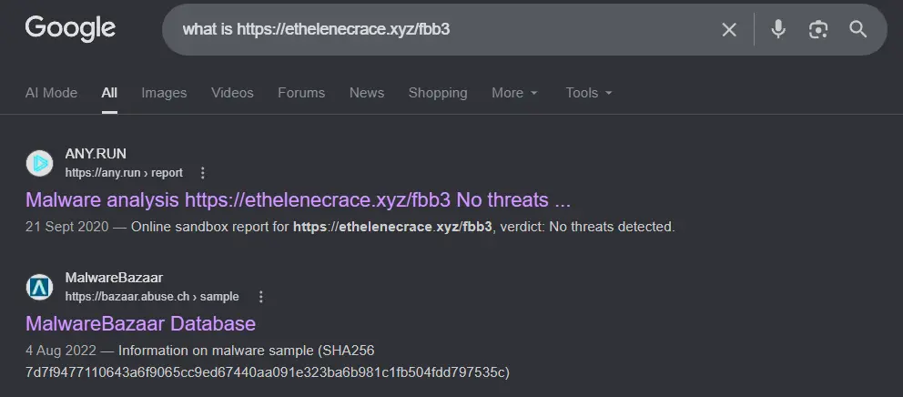

We click into the malware bazaar link.
Unfortunately, the tags are not very descriptive.

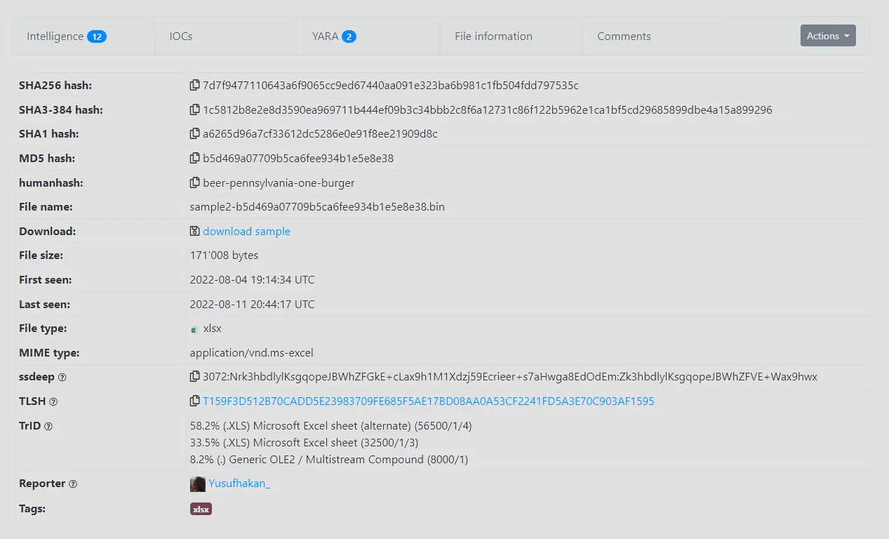

However, if we google the md5 hash of the sample `b5d469a07709b5ca6fee934b1e5e8e38`.
We will find this filescan.io report.

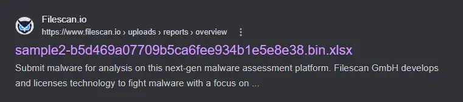

Which has an interesting tag named `zloader`.

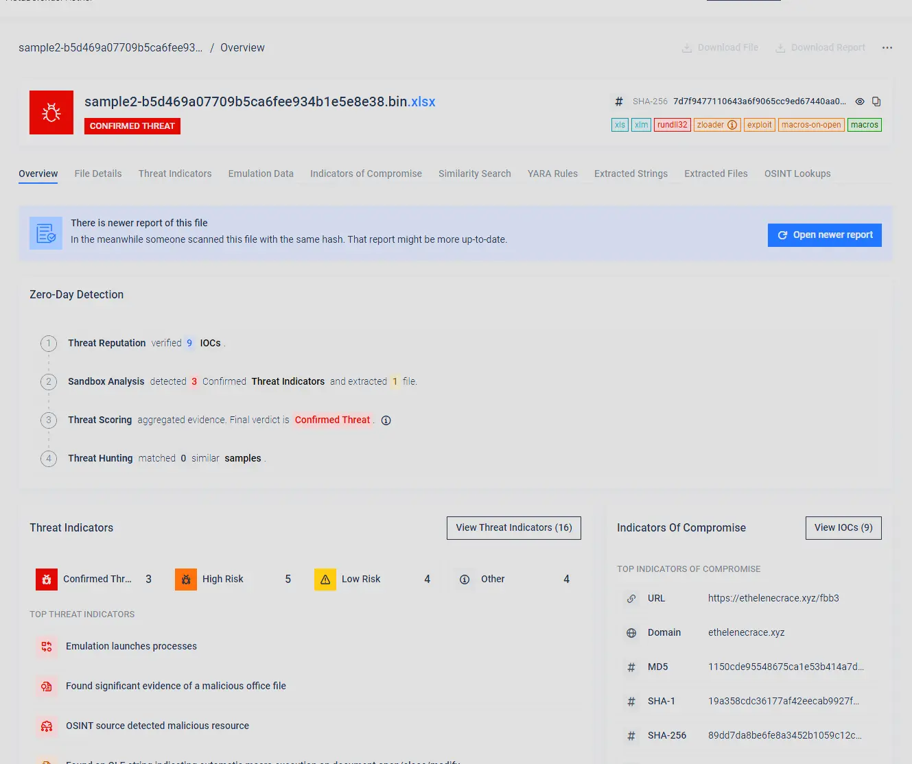

Googling this tells us that `zloader` is a malware family.

[Zloader (Malware Family)](https://malpedia.caad.fkie.fraunhofer.de/details/win.zloader)

Therefore, this malware belongs to `zloader`.

# Completion

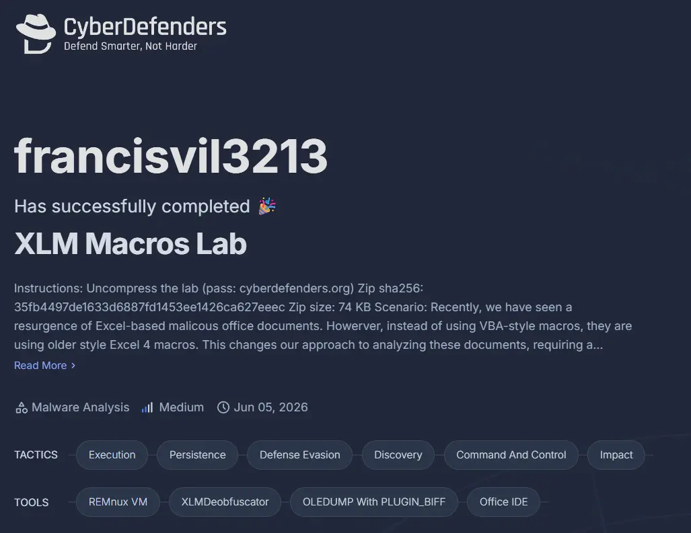
