#DetectItEasy #CFFExplorer #pestudio #dnSpy #python3 #malware-analysis #cyberdefender-medium #finished #reviewed #static-analysis

# Scenario

Analyze malware behavior to identify persistence methods, evasion techniques, and C2 infrastructure by extracting artifacts and configuration data from static and dynamic analysis.

# Questions
## Q1 — Compile Timestamp

> What is the compile timestamp (UTC) of the sample?

**Approach:** Inspect the PE header in PE Studio.

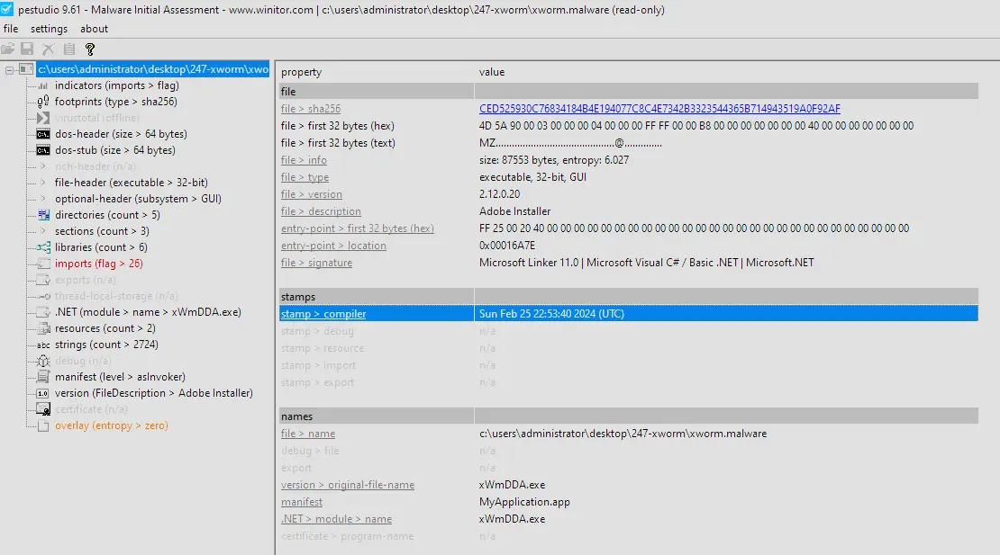

*PE Studio PE header view showing the compile timestamp.*

**Answer:** `Sun Feb 25 22:53:40 2024 (UTC)`

## Q2 — Impersonated Company

> Which legitimate company does the malware impersonate in an attempt to appear trustworthy?

**Approach:** Check Indicators → file → description in PE Studio.

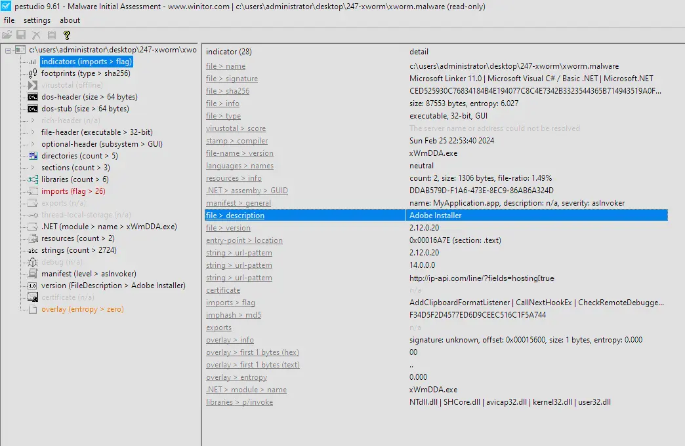

*PE Studio indicators showing "Adobe Installer" under file description.*

**Answer:** `Adobe`

## Performing Basic Static Analysis

Before doing more advanced static analysis, let's get rid of the low hanging fruit.
Let's first try to search for the SHA256 hash we found on the first page of PE Studio on VirusTotal and see if it is flagged by anything.

### VirusTotal SHA256 Check

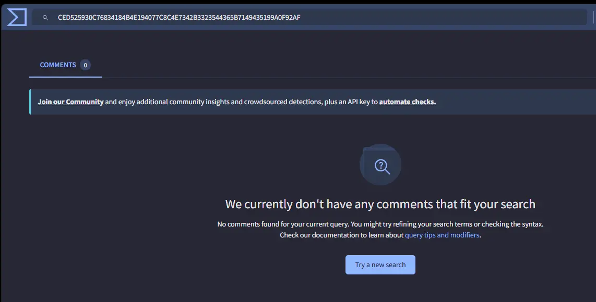

*VirusTotal SHA256 search returning no results.*

VirusTotal comes up blank.

### Checking File Entropy

We should check the file entropy as really high values (>= 7) can indicate the malware is packed.

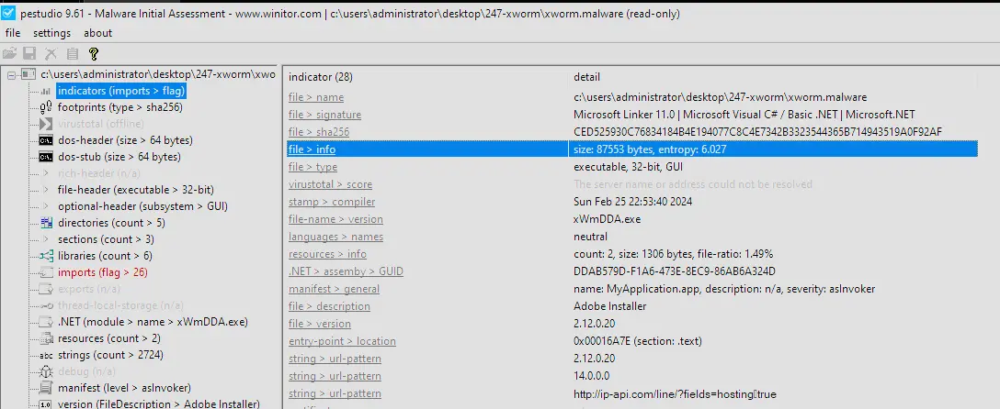

*PE Studio entropy view showing 6.07 — elevated but below the packing threshold.*

The file has an entropy of `6.07` which is higher than normal but is not high enough to really conclude packing.

### File Signature, File Subsystem and OS Version

The file signature states `Basic .NET` and `Microsoft.NET`. We should try disassembling this file through dnSpy later.

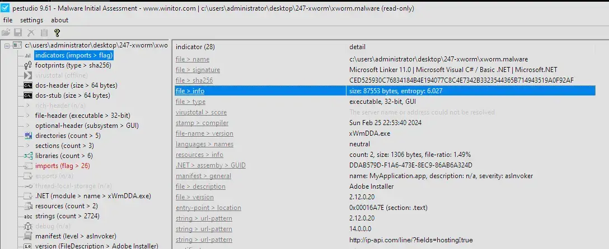

*File signature showing Basic .NET / Microsoft.NET.*

The subsystem of this file is 4.0 and the OS version is Windows NT 4.0 as seen below.

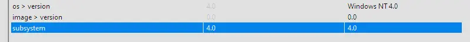

*Subsystem 4.0 and OS version Windows NT 4.0 — inconsistent with the 2024 compile timestamp, suggesting tampering.*

This is really strange because the header states the time compiled was `Sun Feb 25 22:53:40 2024 (UTC)` whereas Windows NT 4.0 came out in 1996. Trying to find what subsystem 4.0 corresponds to on MSDN yields nothing either. These values have been obviously tampered with.

### Comparing Section Raw Size to Virtual Size

Let us first check the sections and see if any of them have a much larger virtual-size than raw-size. That is almost always a tell-tale sign that something suspicious is happening (except for `.bss`).

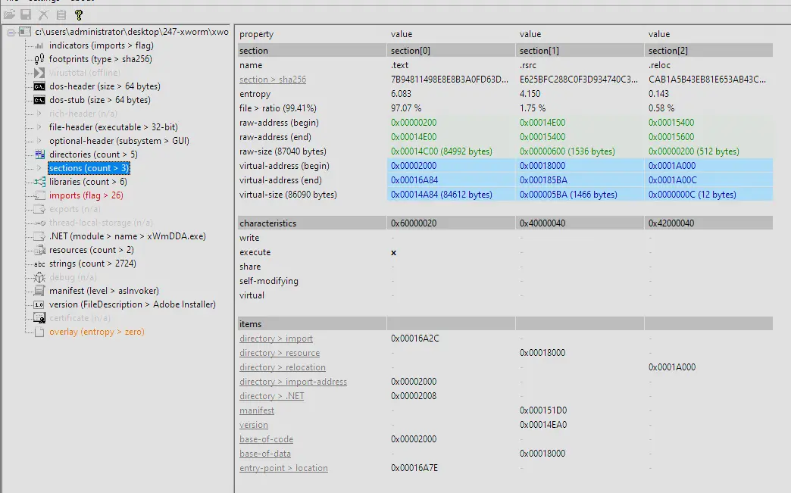

*Section table; `.reloc` raw size is 500 bytes larger than virtual size.*

The virtual-size and raw-size of most sections look normal except for `.reloc`. The raw-size is 500 bytes larger than virtual-size. This could be benign or normal because the raw-size must have a value that is a multiple of the file-alignment which we can see below is 512 bytes. However, it is most likely that there are only 12 meaningful bytes of data while the rest is just padding because the section entropy is near 0.

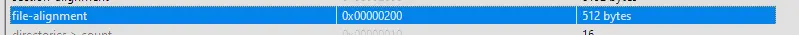

*`.reloc` section detail showing 512-byte file alignment and near-zero entropy.*

### Checking Imports

Now we go to imports to see if any common packed executable imports like `LoadLibraryA/W`, `GetProcAddress` or `VirtualAlloc` were imported. We can also check if there are any other suspicious imports.

The first thing that stands out is the abundance of obfuscated imports from mscoree.dll. The presence of these might be why the file entropy is as high as it was.

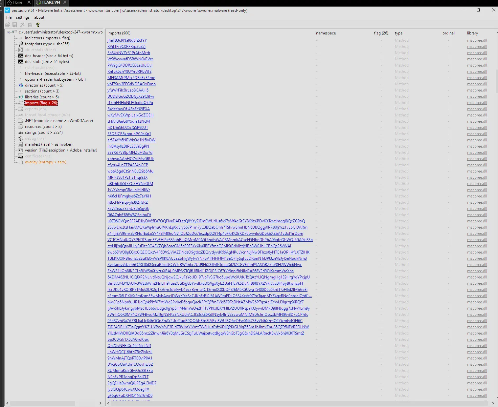

*Obfuscated imports from mscoree.dll contributing to elevated entropy.*

The other thing that stands out immediately are the flagged imports.

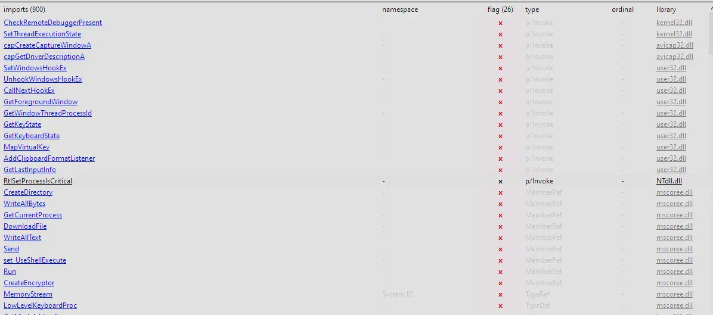

*Flagged imports indicating anti-debug, keylogging, file operation, and network capabilities.*

`CheckRemoteDebuggerPresent` is a function to check whether the specified process is being debugged. This is likely an anti-analysis tool.

`GetLastInputInfo` queries the timestamp of the last keyboard or mouse event in the system. This is used for either analysis evasion or user activity detection.

`SetWindowsHookEx`, `GetKeyState`, `GetKeyboardState`, `MapVirtualKey` among others are Windows API calls that enable keylogging functionalities.

`DownloadFile` as its name suggests, is a .NET framework call that allows for downloading a file.

`CreateDirectory`, `WriteAllBytes` and `WriteAllText` are all file operations, we can maybe see something interesting in ProcMon.

`RtlSetProcessIsCritical` is an import that allows the executable to mark itself as critical so trying to kill it or causing it to terminate unexpectedly causes a BSOD. Furthermore, this import is directly from ntdll.dll which by itself is odd as most legitimate programs would never have to handle ntdll.dll directly.

`CreateEncryptor` allows for the encryption of data or files.

`AddClipboardFormatListener` registers the process to receive notifications whenever clipboard content changes. This is used for clipboard theft.

`Send` in the context of .NET is almost always network related so it may imply some exfiltration capabilities.

These imports make me believe that the malware has:
- Keylogging capabilities
- Mechanisms to evade analysis
- Anti-kill mechanisms
- Manipulation of folders and the ability to download files
- Encryption capabilities
- Exfiltration capabilities

However, we do not see any of the usual suspect imports for packing.

### Checking Strings

When we look over the strings, there is actually some very interesting readable text here. It is likely that the obfuscated imports were actually the reason why the entropy was as high as it was. The executable is not packed; there was just a lot of random noise from the obfuscated imports.

For the strings itself, we can already identify the following:

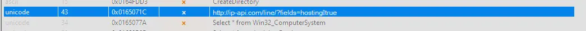

*String referencing `ip-api` with `?fields=hosting` — checks whether the machine is a hosted/sandboxed environment.*

`ip-api` is a service that returns some information about the host that made the request. In this string, we can see the URL parameter `?fields=hosting` is set. This means that the malware actually does not care about the location or IP of the machine at all. It is purely checking if the host machine is running in a datacenter/VM/sandbox which resolves this field to true (IP is associated with hosting provider or data center) or if it is running in a real victim machine which resolves this field to false. This is another analysis evasion technique.

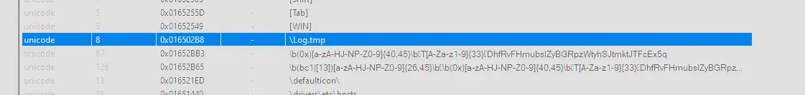

*`Log.tmp` path string — likely the keylogger output file.*

This is a path and a file with name `Log.tmp`. I have seen another keylogger utilize this exact same file name for its output file so it is possible that this is actually the output file for the capture output of the keylogger.

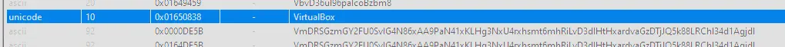

*Hardcoded "VirtualBox" string — VM detection.*

Has VirtualBox hardcoded, possible that malware is checking for this platform and other virtualization platforms specifically. Yet another analysis evasion technique.

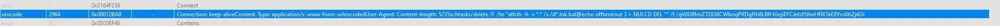

*A very long string visible in PE Studio strings view.*

This string is massive, let us try to copy it into a text editor.

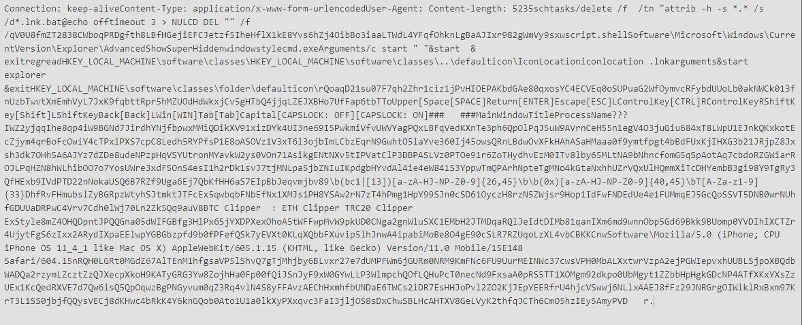

*Long string in a text editor, revealing HTTP headers, scheduled task deletion commands, and cryptocurrency clipper keywords.*

The above really long string actually looks like a few things:
- There are HTTP headers, so maybe an HTTP request template
- There is a section that looks like commands to delete a scheduled task of some name but the section looks like a bunch of commands concatenated so it is quite hard to read
- The rest of the text is an amalgamation of many things; I see some text which is related to User-Agents and Clipper malware for major cryptocurrencies like ETH and BTC

However, this is really telling. It basically confirms that the malware might try to create a scheduled task, create HTTP traffic, and hijack the clipboard for cryptocurrency-related activities.

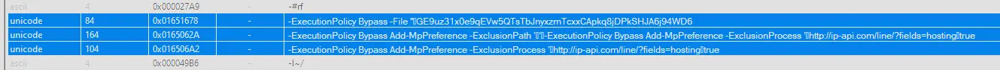

*Strings showing a PowerShell execution policy bypass for an obfuscated filename and Microsoft Defender exclusion commands.*

These few lines:
- Add an execution policy bypass for a specific file which has its name obfuscated — a telltale sign of PowerShell abuse
- Add an exclusion process and exclusion path to Microsoft Defender

The malware is actively targeting and bypassing the built-in defenses of Windows.

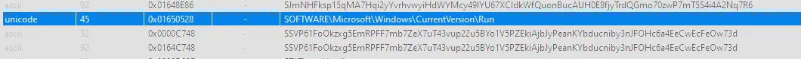

*Registry key string commonly used for persistence.*

This registry key is very commonly used for persistence.

### Conclusion of Basic Static Analysis

We have gathered a lot of useful data from just the analysis of the PE headers and strings of the executable. We have concluded that this is likely a sophisticated malware that has mechanisms to evade analysis, establish persistence, perform keylogging, perform clipboard hijacking, and perform exfiltration. Let's disassemble it in dnSpy to see what else we can find out about the program.

## Q3 — Anti-Analysis Check Count

> How many anti-analysis checks does the malware perform to detect/evade sandboxes and debugging environments?

**Approach:** Disassemble in dnSpy and search for key terms (starting with "VirtualBox") to find the VM check function, then use Analyze to trace the caller that aggregates all checks.

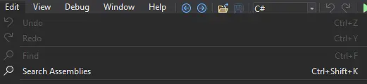

*dnSpy Search Assemblies dialog.*

Change the following options and select the xWmDDA assembly in the Assembly Explorer.

*Search options configured; xWmDDA assembly selected.*

Then search for "VirtualBox":

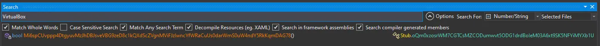

*Search result for "VirtualBox" in the assembly.*

Double-clicking into this brings us to a function that checks if the machine is a virtual machine. It enumerates `Win32_ComputerSystem` to look for key terms like `vmware`, `VirtualBox`, and `Virtual`.

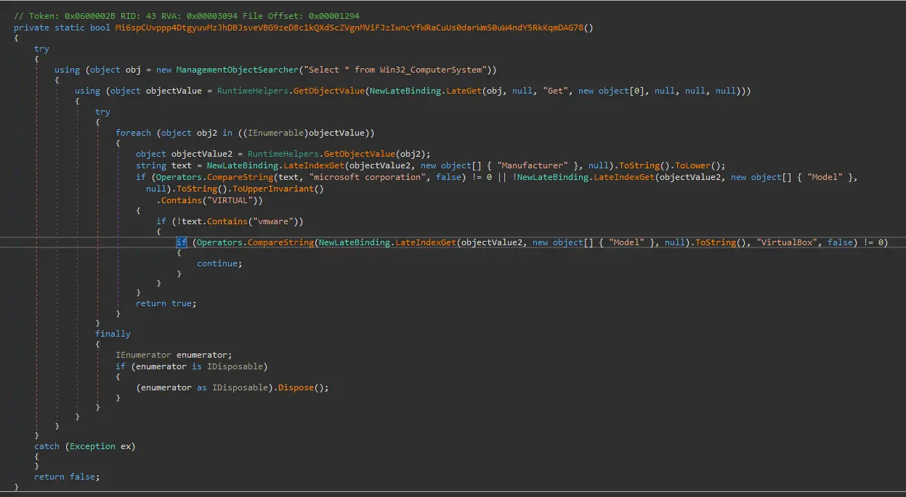

*VM detection function checking for virtualization keywords in Win32_ComputerSystem.*

We know this is just one of the few ways the malware tries to evade sandbox and analysis environments. Let us try to find what function uses this one. To do this we right-click the function name and click Analyze (`Ctrl+Shift+R`).

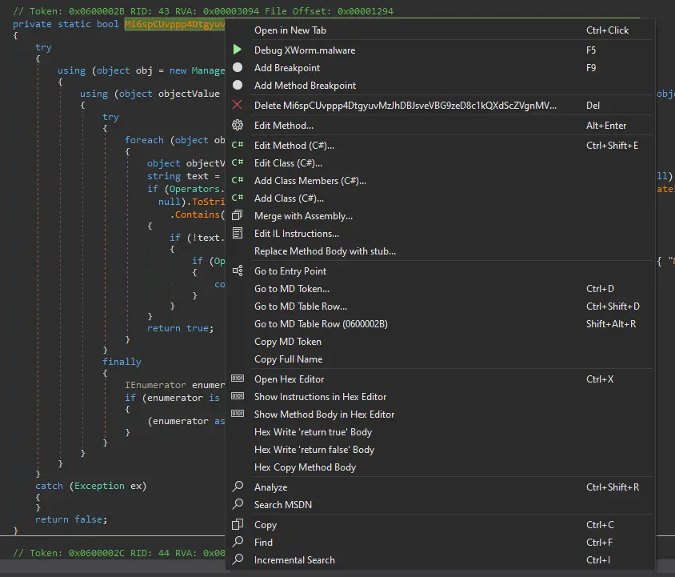

*Right-click → Analyze on the VM detection function.*

This gives us the following after we expand the dropdowns.

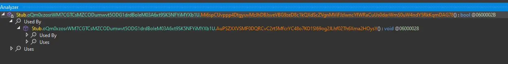

*Analyze results showing the function is used by one caller.*

We can see it is used by another function. Double-clicking into that shows a function with multiple nested if statements.

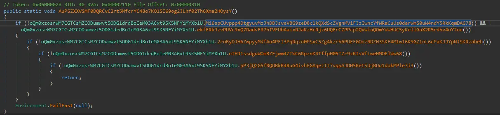

*Caller function with 5 nested checks ending in `Environment.FailFast(null)`.*

The very last line `Environment.FailFast(null)` is actually a programmatic way used in .NET to immediately kill the program without any error message (hence, the null). This snippet of code above, actually performs 5 checks and if any of them are satisfied, it instantly kills the program.

We already know one of the checks is to see if the process is running in a virtualized environment. Let us try looking at another function being called here.

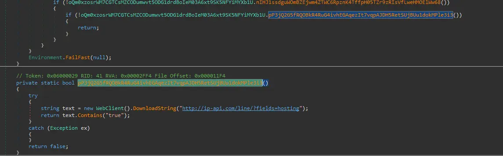

*IP-API hosting check — the fifth condition in the evasion function.*

The very last if condition is the `ip-api` check for if the machine is associated with a host provider or data center. We can reasonably conclude that this function is being used to enable the malware to evade analysis or sandbox environments and that it performs 5 separate checks to do so.

**Answer:** `5`

## Q4 — Scheduled Task Name

> What is the name of the scheduled task created by the malware to achieve execution with elevated privileges?

**Approach:** Search for `schtasks` in dnSpy to locate the persistence code, identify the `/RL HIGHEST` invocation, then trace the obfuscated task name string through the decryption function using Python and CyberChef.

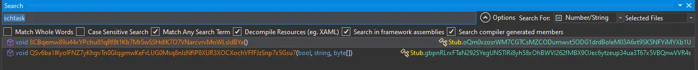

*dnSpy search results for "schtasks" showing two functions.*

We found two functions that use it. Let's click into the first one.

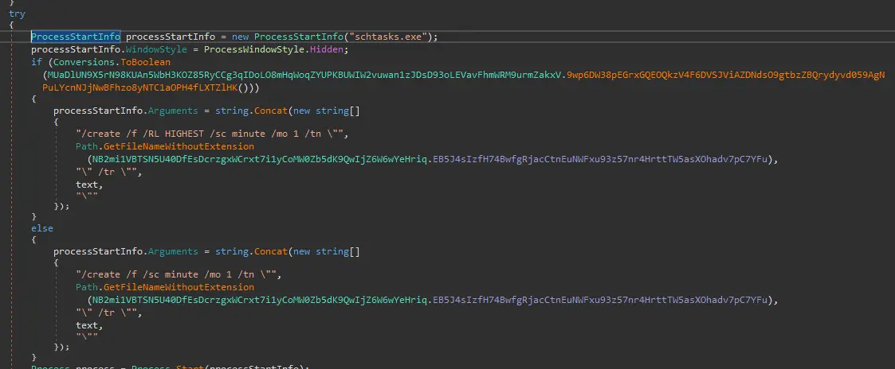

*First function — two schtasks.exe invocations.*

There are two different invocations of `schtasks.exe`. The one we are looking for is one that achieves execution with elevated privileges. Let us first go to MSDN and see what arguments `schtasks.exe` takes.

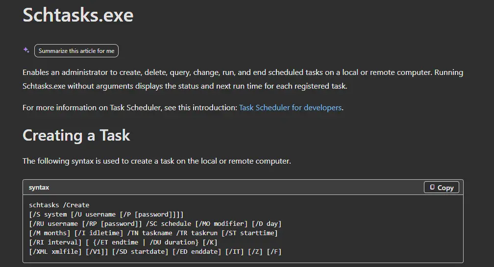

*MSDN schtasks argument reference.*

Let's search for `/RL HIGHEST` because this stands out the most — if I had to guess, it's the privilege level the task would run at.

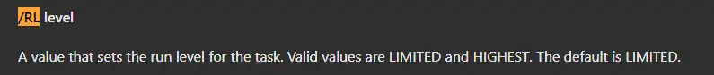

*`/RL HIGHEST` — task runs at highest privilege.*

This tells us the first task defined is running with highest privilege.

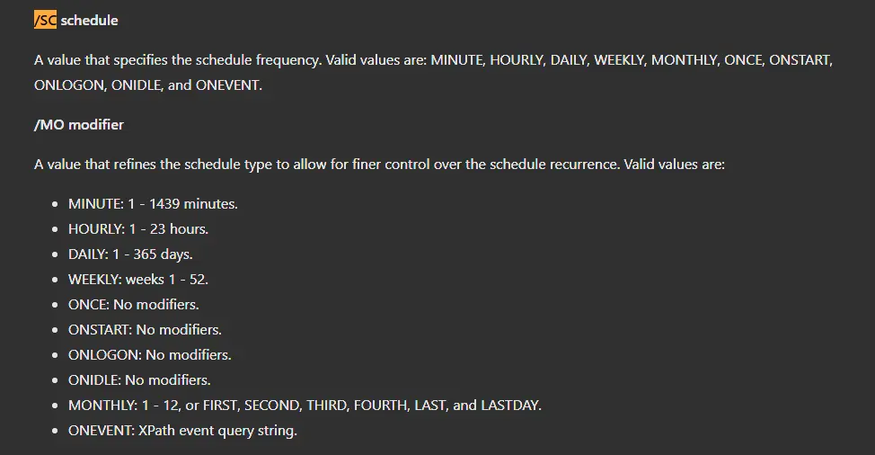

*Additional schtasks arguments.*

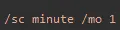

*`/sc minute /mo 1` — task scheduled to run every minute.*

`/sc minute /mo 1` means this task should run every minute.

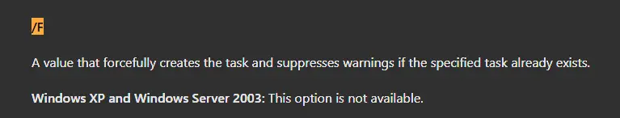

*`/f` forces task creation and suppresses warnings; `/tn` defines the task name variable.*

`/f` force-creates the task and suppresses warnings if the task already exists.

`/tn` is the interesting one because this defines the name of the task. That means the name of the task is what is highlighted below.

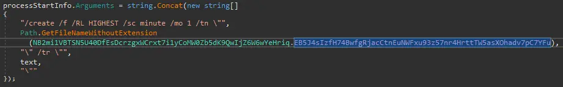

*Task name variable — obfuscated, passed to `Path.GetFileNameWithoutExtension`.*

But if we try to double-click into this, we will find that this string is not in plain text and looks obfuscated. The fact it is obfuscated and not the actual value is supported by the fact that the malware passes that string to `Path.GetFileNameWithoutExtension`.

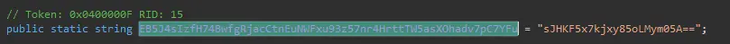

*Obfuscated ciphertext for the task name string.*

If we trace that string in the same function we will see that the function actually reassigns the value of it.

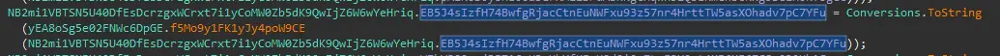

*String reassigned to the return value of a decryption function.*

It reassigns the return value of another function which takes the current value as the argument. Double-clicking into this reveals the following:

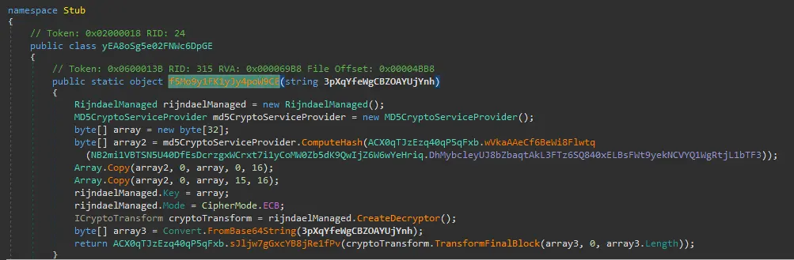

*Decryption function — `array2` calculates the MD5 hash of the key input string.*

This is a decryption function and we can see it constructing the key. `array2` seems to calculate the MD5 hash of the return value of some function. Let's inspect that function and check what argument is being passed to it.

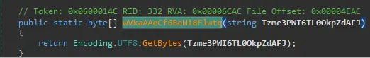

*Function that provides the key input value.*

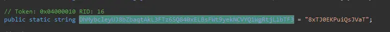

*UTF-8 bytes of `8xTJ0EKPuiQsJVaT` being MD5-hashed to derive the key.*

It seems that this gets the UTF-8 bytes of `8xTJ0EKPuiQsJVaT` then MD5-hashes it. It then constructs the key using that MD5 hash but it is constructed in a way such that there is a 1-byte overlap.

The first array copy moves the MD5 hash into the array at index 0 and states the size is 16 bytes. This populates the first 16 bytes, so index 0 to 15. It then copies the MD5 hash again but it starts at index 15 not at index 16. This causes the byte at the 15th index to be overwritten by the first byte of the MD5 hash. Therefore, the key is just the MD5 hash copied twice but with a 1-byte overlap. The last byte is `0x00`.

We should note that the key size here is 32 bytes. In .NET, `rijndaelManaged` uses the full implementation of `Rijndael` which is the predecessor of `AES`. However, they both use the same fundamental algorithm with only some small differences. The difference between `AES` and `Rijndael` is that `Rijndael` allows for variable block sizes. However, if we look at the code, the author does not define any block size. Without explicitly defining it, it will default to 128 bits. You can check this here:

[RijndaelManaged Class (System.Security.Cryptography) | Microsoft Learn](https://learn.microsoft.com/en-us/dotnet/api/system.security.cryptography.rijndaelmanaged?view=netframework-4.8.1)

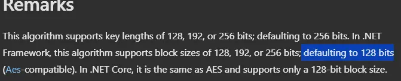

*RijndaelManaged documentation confirming 128-bit default block size — effectively AES-256 in ECB mode.*

This means that the malware author is effectively just using AES-256 here to encrypt and decrypt strings. Furthermore, he is using ECB cipher mode which means no IV is required.

After constructing the key, it then instantiates a decryptor. It then decodes the ciphertext from base64 then sends it to the decryptor. From this we can determine what the task name will be.

Let us first just write a simple Python script to get the hex values of both the ciphertext and key after the necessary operations.

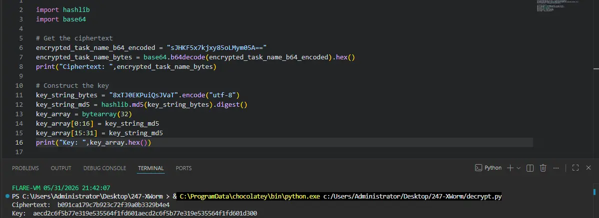

*Python script outputting the ciphertext hex and the constructed key.*

This gives us the hex of the ciphertext as well as the complete key. We can just plug this into CyberChef AES and this gives us the plaintext string.

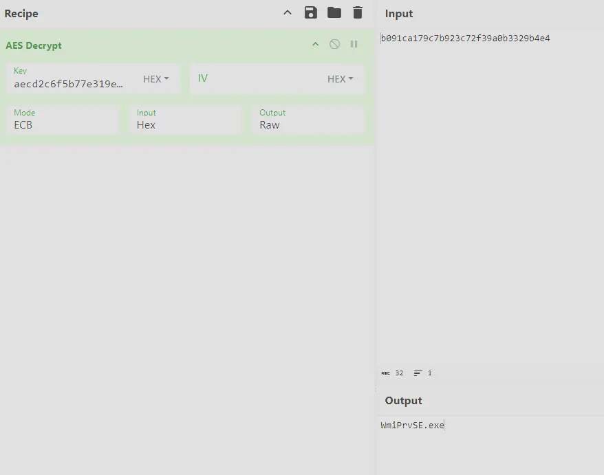

*CyberChef AES decryption yielding `WmiPrvSE.exe`.*

Which is `WmiPrvSE.exe`. Going back to the `schtasks.exe` command we see that the task name is just the plaintext string without the extension. With this, we also uncovered the mechanism by which the malware obfuscates strings.

**Answer:** `WmiPrvSe`

## Q5 — Dropped Binary in AppData

> What is the filename of the malware binary that is dropped in the AppData directory?

**Approach:** Examine the schtasks code section — the path to the scheduled task executable is constructed from two obfuscated strings; decrypt the directory portion to reveal the full path.

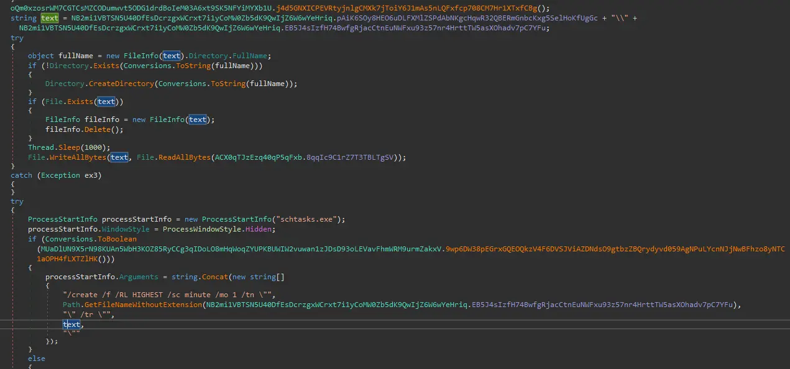

*`text` path variable constructed by joining two obfuscated strings with `\\`.*

We can see that `text` is constructed by two obfuscated strings joined by `\\` so it is likely that the first part of this string is actually a directory. The second part is the string we discovered in the last question, `WmiPrvSE.exe`. Let us deobfuscate the first part as well. Clicking into the first part of the string we are directed to this ciphertext.

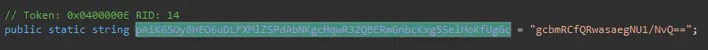

*Ciphertext for the directory portion of the path.*

Similarly to the last question, we decrypt this string and we get the following.

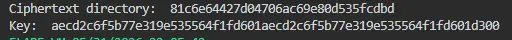

*Python script decrypting the directory string.*

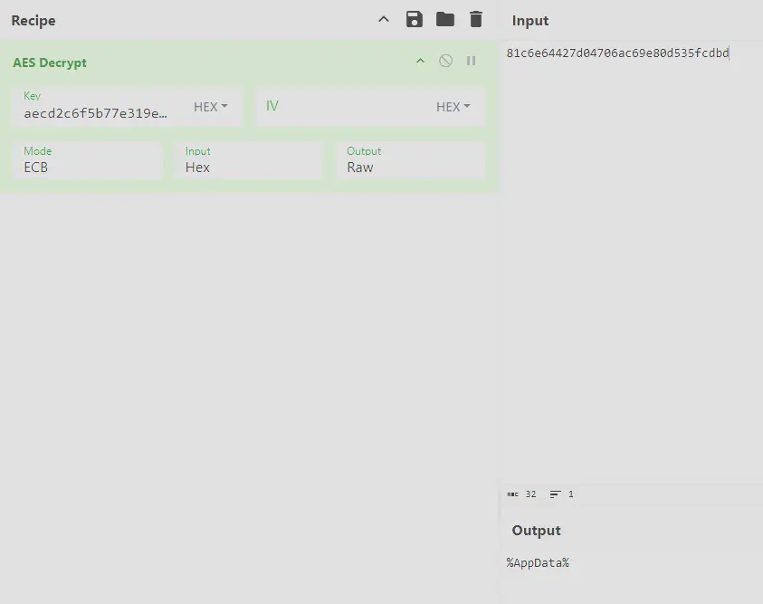

*CyberChef output showing `%AppData%`.*

So the full path is `%AppData%\\WmiPrvSE.exe`. This also tells us the answer to the question as `WmiPrvSE.exe` is likely the malicious binary that is dropped into AppData.

**Answer:** `WmiPrvSE.exe`

## Q6 — Encryption Algorithm

> Which cryptographic algorithm does the malware use to encrypt or obfuscate its configuration data?

We already determined this when reverse-engineering the string obfuscation mechanism. The encryption used here is AES (or more accurately the Rijndael algorithm). It is a symmetric form of encryption and in this case had a key size of 256 bits (32 bytes) and a block size of 128 bits. The cipher mode used was ECB, meaning no IV was required.

**Answer:** `AES`

## Q7 — Hardcoded Encryption Key String

> To derive the parameters for its encryption algorithm (such as the key and initialization vector), the malware uses a hardcoded string as input. What is the value of this hardcoded string?

We also already determined this earlier by analyzing the decryption function.

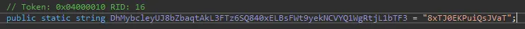

*Decryption function showing `8xTJ0EKPuiQsJVaT` as the key input string.*

**Answer:** `8xTJ0EKPuiQsJVaT`

## Q8 — C2 IP Addresses

> What are the Command and Control (C2) IP addresses obtained after the malware decrypts them?

**Approach:** Identify all remaining obfuscated string variables in the same section, label them by RID, then batch-decrypt with an improved Python script and confirm the IPs by tracing the socket connection code.

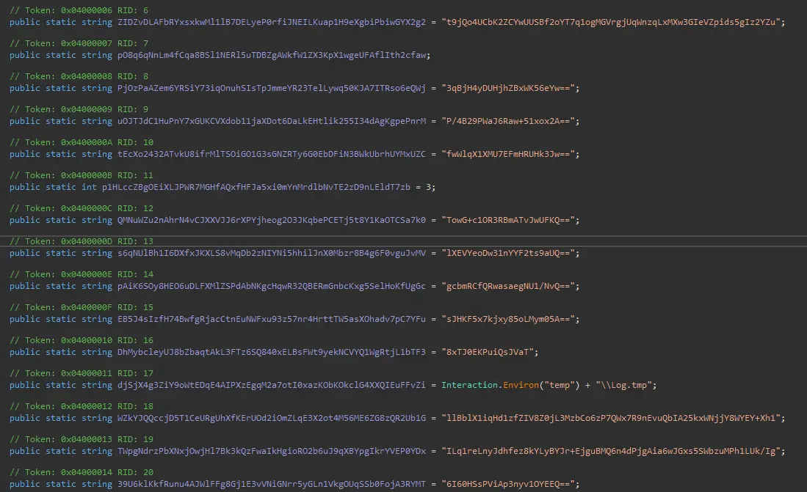

*All obfuscated string variables in the same section, each with a RID.*

Let's label each obfuscated string by their RID and then go through each one (skipping the key). Let us also improve the Python script to just have a decrypt function that does the entire process for us.

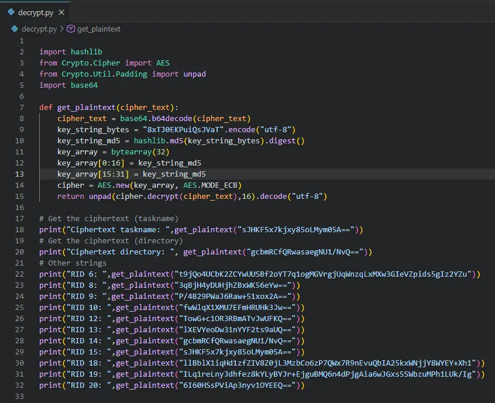

*Improved Python decrypt script processing all RID strings at once.*

This gives us:

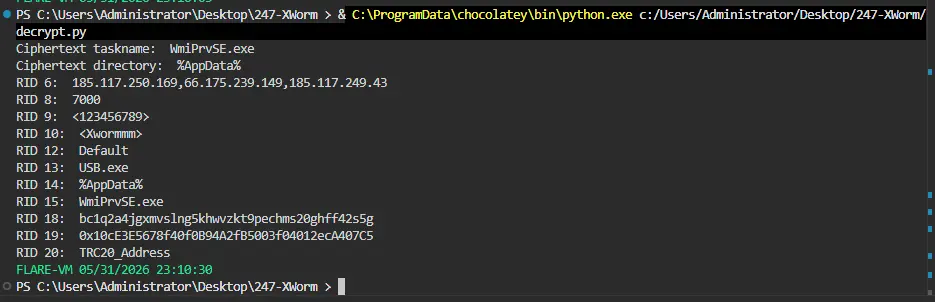

*Decryption output showing a list of IP addresses followed by port `7000`.*

From the strings, we can see a list of IP addresses and immediately after that `7000` which might be the port number. Let's investigate and see what functions read these values.

Let's start with the IPs. From below, we can see there is 1 function that assigns and reads it, whereas there is another one that only reads it.

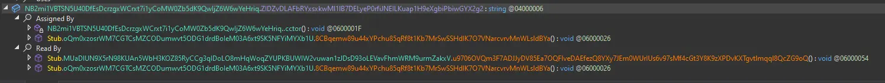

*Analyze results on the IP variable — one function assigns and reads, one only reads.*

Double-clicking into the function that both reads and assigns it will just direct us back to the function that decrypts the string. We should examine the other function that only reads it, which shows the following.

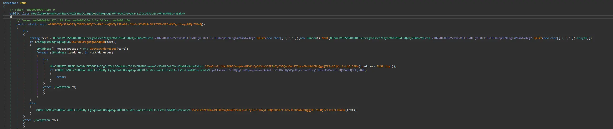

*Function looping through the IP addresses.*

This function looks like it is just looping through the addresses. Let us click into the function that is consuming each IP address.

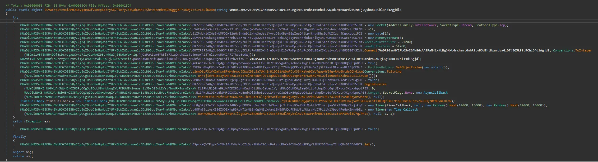

*Function creating a socket using the IP and port to initiate a connection.*

This function creates a socket using the IP passed to it as an argument, and then uses the other obfuscated string with RID 8 as the port number. We can see this on this line where it initiates the connection.

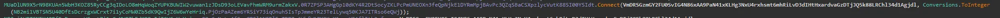

*Socket connection line using the decrypted IP and port.*

Therefore, this is very likely the connection to the C2 servers and the IPs we found from the obfuscated strings are the IP addresses of said servers.

**Answer:** the values shown in the decryption output above

## Q9 — C2 Port Number

> What port number does the malware use for communication with its Command and Control (C2) server?

We found this already in the previous question at this line of code.

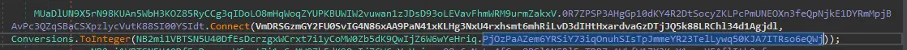

*Code line showing the port variable resolving to the obfuscated string — plaintext `7000`.*

That variable points to an obfuscated string which is actually `7000` in plaintext.

**Answer:** `7000`

## Q10 — USB Spread Filename

> The malware spreads by copying itself to every connected removable device. What is the name of the new copy created on each infected device?

**Approach:** One of the decrypted strings was `USB.exe`; trace its usage to confirm it is written to removable drives.

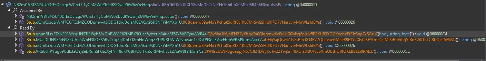

*Analyze results for the `USB.exe` variable showing all functions that read it.*

If we go through each one manually, we will see that the first and last function that read this value are of interest.

The first call looks like code to loop through each drive and if it is removable, unhide all the files and delete `USB.exe`.

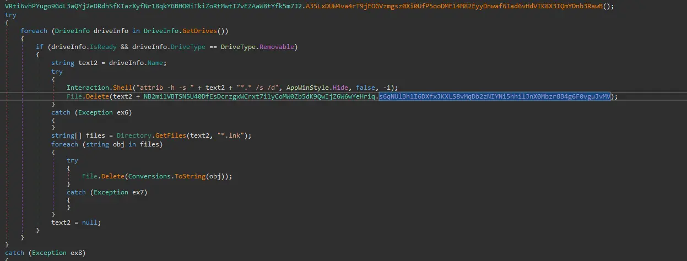

*First call — loops through removable drives, unhides files, and deletes USB.exe.*

Whereas the last call iterates through every single drive on the machine. If a drive is removable, it checks if the file already exists and if it doesn't it writes that file into the removable drive.

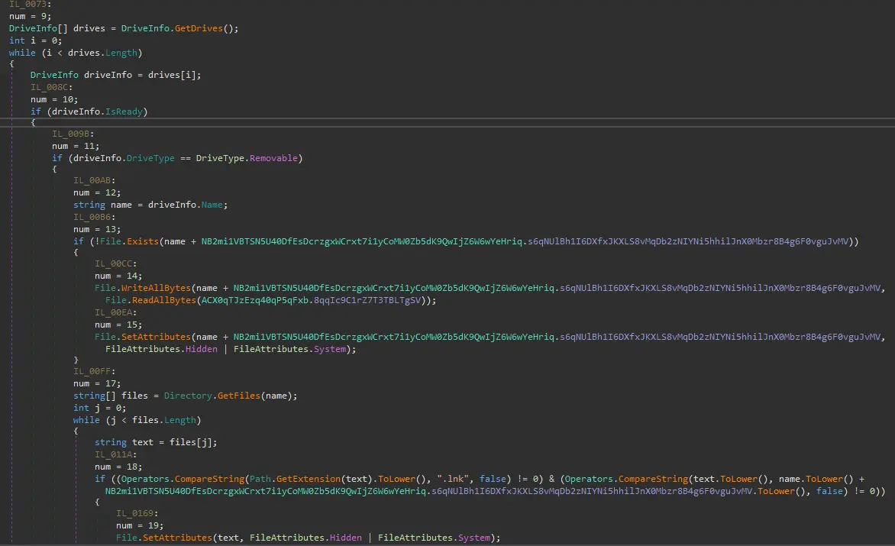

*Last call — writes USB.exe to each removable drive if not already present.*

Therefore, the file that it copies into every removable device is `USB.exe`.

**Answer:** `USB.exe`

## Q11 — Created File Extension

> To ensure its execution, the malware creates specific types of files. What is the file extension of these created files?

**Approach:** Continue examining the USB spread code to see what additional files are created alongside USB.exe.

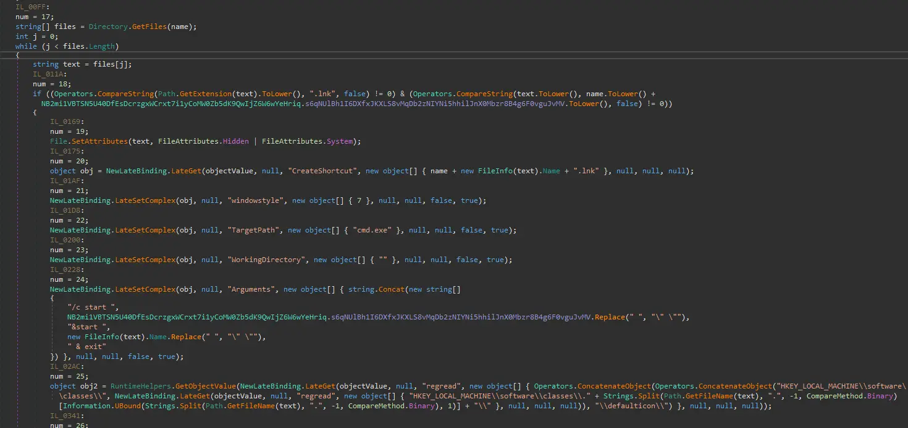

*Code iterating every file on the removable drive — originals are hidden and `.lnk` shortcuts are created in their place.*

If we scroll down further to see what else the malware does after creating `USB.exe`, we will see that it iterates through every single file in the removable drive. For every file, it checks if the file is a `.lnk` file and if the file is `USB.exe`. If it is not, it hides that file by setting the file attributes to `Hidden` and `System`. These hide the actual file from the legitimate user. It then creates a new shortcut file that masquerades as the original file. We can see that in the following lines of code.

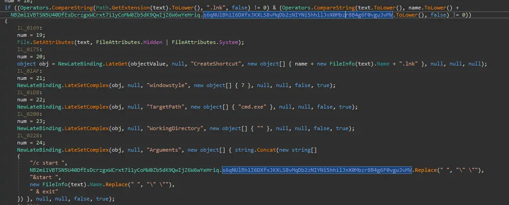

*Shortcut creation code — a cmd process runs the malware then opens the real file with WindowStyle 7 (minimized).*

Each shortcut file is a cleverly designed trap where once the user clicks on it, it launches an instance of cmd that runs the malware AND opens the real file. Furthermore, he codes the cmd to start in a minimized state by specifying `"windowstyle", new object [] { 7 }`.

To the victim, once he clicks one of the shortcuts, it just looks like he opened the file normally. However, the machine is already being infected.

**Answer:** `.lnk`

## Q12 — Sandbox Detection DLL

> What is the name of the DLL the malware uses to detect if it is running in a sandbox environment?

**Approach:** Revisit the 5-check analysis evasion function and click through each individual check until finding the one that directly references a DLL.

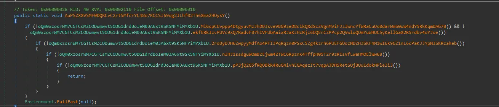

*The 5-check analysis evasion function.*

We can click through each one of these functions and eventually find this.

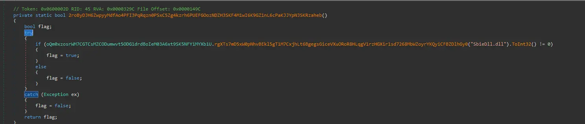

*The only check that directly references a specific DLL — the Sandboxie user-mode DLL.*

This is the only check that directly references a specific DLL and when we Google this DLL, it is a core user-mode DLL for Sandboxie. Sandboxie is a popular sandboxing program for Windows.

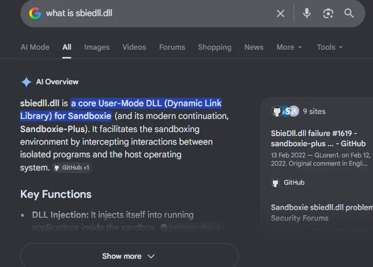

*Google search confirming the DLL is a core user-mode component of Sandboxie.*

**Answer:** the value shown above

## Q13 — Hidden Files Registry Key

> What is the name of the registry key manipulated by the malware to control the visibility of hidden items in Windows Explorer?

**Approach:** Revisit the `.lnk` file creation code — just before drive enumeration begins, the malware accesses a registry key.

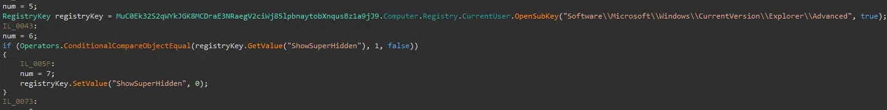

*Registry key accessed just before drive enumeration in the `.lnk` creation code.*

`ShowSuperHidden` is a registry key that controls whether files with attributes `Hidden` and `System` are displayed. As we know already from our analysis in the previous question, the malware adds the `Hidden` and `System` attributes to each legitimate file. Therefore, the malware checking and setting this registry key to 0 is just another way that it ensures the legitimate files are hidden.

**Answer:** `ShowSuperHidden`

## Q14 — Critical Process API

> Which API does the malware use to mark its process as critical in order to prevent termination or interference?

**Approach:** Start from the main function and follow the administrator privilege check into the critical process setup sequence.

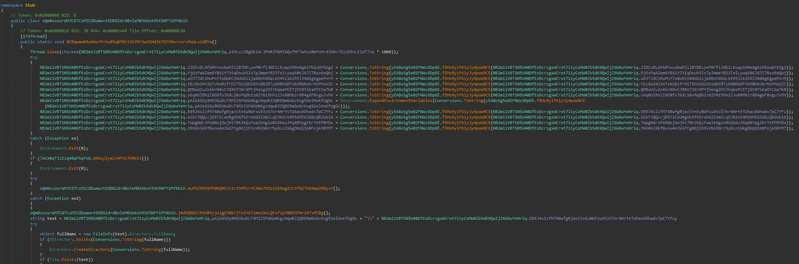

*Main function — first calls decrypt all obfuscated strings to plaintext.*

If we scroll down near the end, we will see the last few calls are all starting new threads.

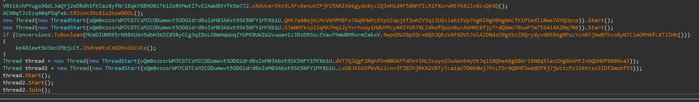

*End of main function — last calls start new threads.*

If we look primarily at this line:

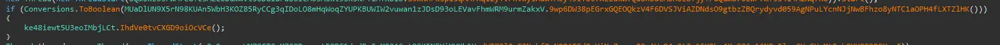

*Administrator check conditional.*

Double-click into the conditional:

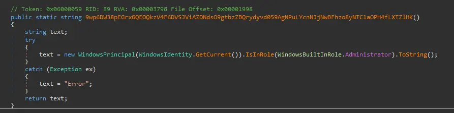

*Admin check function — if the user is an administrator, proceeds to the critical process setup.*

We can see that this if statement is checking if the current user is an administrator. If it is an administrator, it goes into this function.

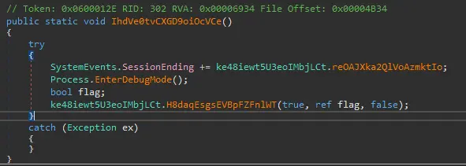

*Function setting the prerequisites needed to mark the process as critical.*

This function is setting the prerequisites needed to set the process as critical.

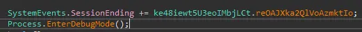

*First two prerequisite calls: unmark on shutdown to avoid BSOD, then set the critical process flag.*

The first line makes it so when the user is shutting down or the user logs off, it will unmark the process as critical before it exits. The reason it does this is to avoid triggering a BSOD on a normal shutdown.

The second line is a prerequisite required for the process to be even marked as critical. The next call which we will go into shortly will fail silently without this flag being set in the process. The next call leads us to code below.

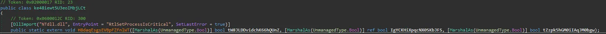

*`RtlSetProcessIsCritical` renamed to an obfuscated identifier — marks the process as critical.*

This code is essentially just renaming the API `RtlSetProcessIsCritical` to an obfuscated name. We also identified this API very early in the PE header static analysis portion. This API is responsible for marking the process as critical.

**Answer:** `RtlSetProcessIsCritical`

## Q15 — Keyboard Hook API

> Which API does the malware use to insert keyboard hooks into running processes in order to monitor or capture user input?

**Approach:** Follow the function calls in the main thread setup to locate the keylogger installation routine.

The answer is `SetWindowsHookEx`, which is a Windows API that installs a hook procedure that intercepts system-wide events before they reach their target. We identified this API very early in the PE header static analysis.

If we go to the section of code where we found that the malware is setting the process as critical, we can find where this API is being used. Let us focus on the highlighted function.

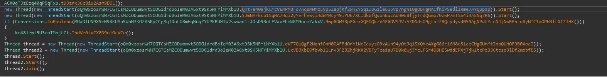

*Main thread setup — highlighted function leads to the keylogger installation.*

If we follow its calls we will land on the function below.

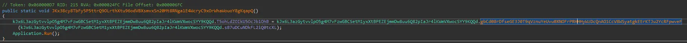

*Intermediate function call leading to keylogger instantiation.*

If we click into what is highlighted we will find a section of code that looks like it is instantiating a keylogger.

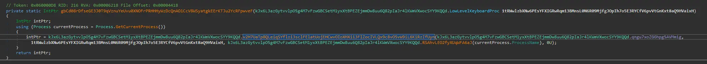

*Keylogger instantiation in a `using` block with obfuscated API calls.*

In the `using` block the obfuscated API calls are actually:

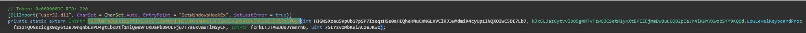

*First obfuscated API call in the keylogger block.*

and

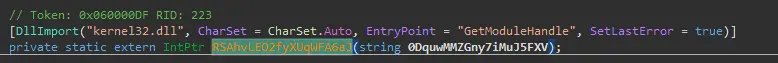

*Second obfuscated API call in the keylogger block.*

Therefore, this block is the keylogger installation routine.

**Answer:** `SetWindowsHookEx`

## Q16 — Primary Malware Functionality

> Given the malware's ability to insert keyboard hooks into running processes, what is its primary functionality or objective?

From our entire analysis, we can reasonably conclude that this is likely a keylogger. However, analyzing this malware through the code reveals that it is capable of more than just keylogging. For instance, you can see it has some clipper functionality as well.

**Answer:** `Keylogger`

# Completion

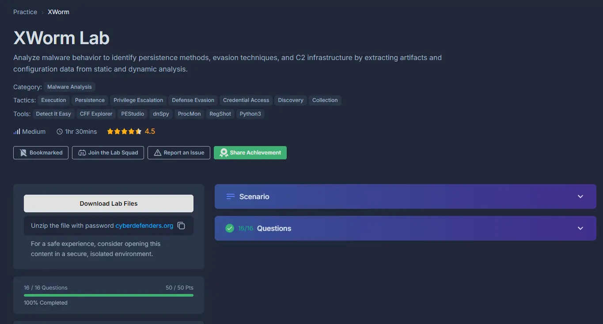
