#network-forensics #cyberdefender-medium #NetworkMiner #Wireshark #Suricata #ZUI/Brim #finished #reviewed #CyberDefenders #CyberSecurity #BlueYard #BlueTeam #InfoSec #SOC #SOCAnalyst #DFIR #CCD #CyberDefender

# Scenario
Instructions:

- Ensure that there are no blockers, such as Adblock extensions, that might prevent the lab from opening in a new tab or affect lab's functionality.
- All the lab-related files and tools are on the desktop.

The attached PCAP belongs to an Exploitation Kit infection. As a security blue team member, analyze it using your favorite tool and answer the challenge questions.

## Investigation

Before we start querying anything let's have an overview of the captured packets.
Let's start with `Statistics > Endpoints`.

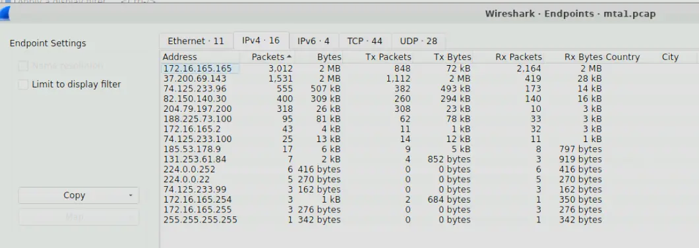

*Endpoint Statistics*

We can see that most of the capture traffic are from two endpoints
- `172.16.165.165`
- `37.200.69.143`

Let's check `Statistics > Conversations`

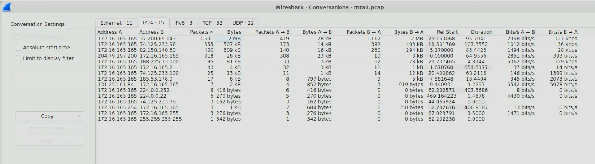

*Conversation Statistics*

We can see that majority of the traffic is communication between `172.16.165.165` and `37.200.69.143`.
We should also note that `172.16.165.165` is a private IP address whereas `37.200.69.143` is a public one.

Let's also look at `Statistics > Protocol Hierarchy Statistics`.

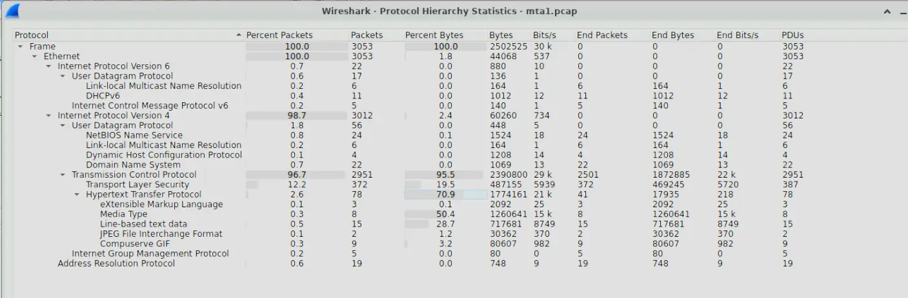

*Protocol Hierarchy Statistics*

A few things immediately stand out to me.
- 98.7% of all traffic is IPv4
- 96.7% of all packets are TCP
- 2.6% of all packets are HTTP
- Even though HTTP only accounts for 2.6% of the traffic, it accounts for 70.9% of all bytes
- Media Type Transfers also account for 50.4% of all bytes

Therefore, a significant amount of the total data transferred captured in this pcap are in media/files and these transfers are few but large. Furthermore, these transfers happen over unencrypted HTTP.

Additional details are also that the captured packets consists of DNS and DHCP.

To summarize,
- A private address `172.16.165.165` communicated heavily with a public address `37.200.69.143`
- 2.6% of all packets captured are unencrypted HTTP and account for 70.9% of all bytes
- Majority of the data transferred were large media/files transfers over unencrypted HTTP over a few requests.

The biggest red flag we spot right now is the HTTP traffic. Let's investigate the HTTP traffic of the private address first in ZUI to see what we can find.

Let's open the pcap in ZUI then run the following query

```
(id.orig_h == 172.16.165.165 or id.resp_h == 172.16.165.165) AND id.resp_p==80 |
cut ts,id.orig_h,id.resp_h,host,referrer, resp_mime_types, method,user_agent|
sort ts |
fuse
```

This query looks for all HTTP traffic related to the IP `172.16.165.165` and sorts by timestamp.

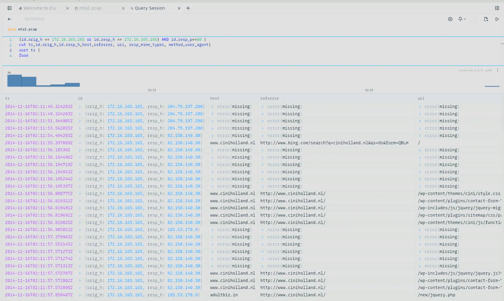

*ZUI output*

We can see from the screenshot that `172.16.165.165` performed a Bing search for a domain `ciniholland.nl` at `02:11 AM UTC`. This domain has IP `82.150.40.30`.
If we analyze it further we see that the user is redirected a few times to other domains.

He is first redirected to `adultbiz.in` from `ciniholland.nl`. This happens within the same minute of landing on the site.


*First redirect*

He is then redirected again to `24corp-shop.com` which has IP `188.225.73.100`.
He is redirected from `ciniholland.nl`.

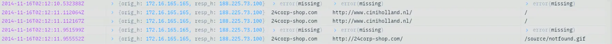

*Second redirect*

The third and final redirect is to `stand.trustandprobaterealty.com` from `24corp-shop.com`.
This domain has the IP `37.200.69.143`, which we identified earlier as IP that `172.16.165.165` communicates with the most.

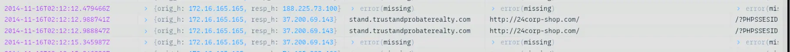

*Third and final redirect*

Therefore, `172.16.165.165` used Bing search to find the domain `ciniholland.nl` and within 1 minute (`02:11 AM UTC` to `02:12 AM UTC`) he is redirected to three completely different domains.
- `ciniholland.nl` > `adultbiz.in`
- `ciniholland.nl` > `24corp-shop.com` > `stand.trustandprobaterealty.com`

When we search these domains through VirusTotal, we will find that all of these domains have been flagged as malicious by at least one security vendor.

Furthermore, if we look at the traffic between `172.16.165.165` and `37.200.69.143` and we change our query to be instead

```
_path == "http" AND (id.orig_h == 172.16.165.165 or id.resp_h == 172.16.165.165) AND id.resp_p==80 |
cut ts,id.orig_h,id.resp_h,host,referrer,  resp_mime_types, method, status_code|
grep(/application/,resp_mime_types) and status_code == 200 |
sort ts |
fuse
```

We will see multiple files are being requested and transferred successfully.

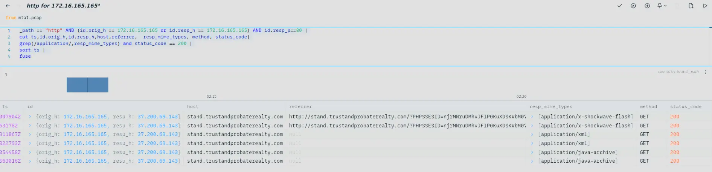

*Querying for transferred application files*

The transferred files are
- `.swf`
- `.xml`
- `.jar`

Therefore, my initial hypothesis is that `172.16.165.165` navigated to a compromised website at `82.150.140.30` which redirected it to multiple known malicious domains including the C2 server at `37.200.69.143` of the threat actor.
From that point, malware payloads and other malicious files were transferred to the machine infecting it.

Knowing this, let's answer the questions.

---

# Questions
## Q1 — Victim IP Address

> What is the IP address of the Windows VM that gets infected?
In the initial investigation we found a private address `172.16.165.165` communicating with known malicious external domains.
Furthermore, during these communications, multiple files were transferred to the machine.
Therefore, it is likely the infected endpoint.

We can also verify that this is likely the Windows VM by looking at the DHCP traffic captured.

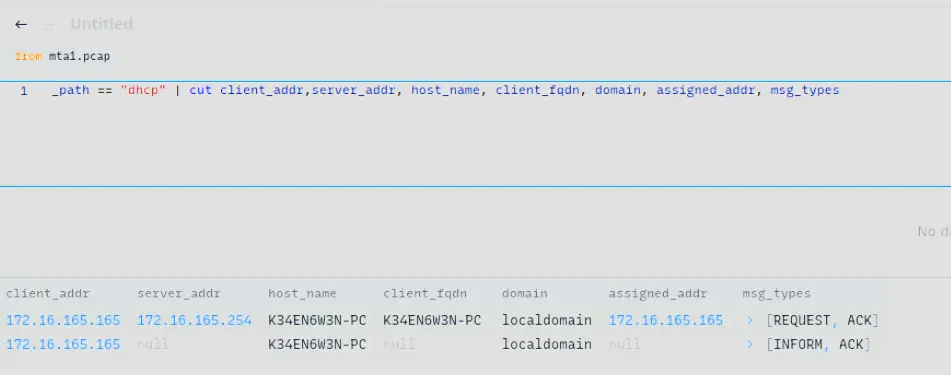

*DHCP traffic showing `172.16.165.165` leased to host `K34EN6W3N-PC` on `localdomain`*

**Answer:** `172.16.165.165`

---

## Q2 — Compromised Website IP

> What is the IP address of the compromised web site?
We found this in our initial investigation where once `172.16.165.165` landed on `82.150.140.30`,
`172.16.165.165` was redirected multiple times to known malicious domains.
Therefore, the IP of the compromised web site is likely `82.150.140.30`.

**Answer:** `82.150.140.30`

---

## Q3 — C2 Server IP

> What is the IP address of the server that delivered the exploit kit and malware?
When `172.16.165.165` communicated with `37.200.69.143`, multiple files were downloaded.
Therefore, the IP address of the server that delivered the malware is `37.200.69.143`.

**Answer:** `37.200.69.143`

---

## Q4 — Compromised Website FQDN

> What is the FQDN of the compromised website?
We already know the IP of the compromised website.
All we have to do now is find what domain name it resolves to.
We saw this in our ZUI output under the field `host` but we can also find this out through looking at Wireshark DNS traffic.

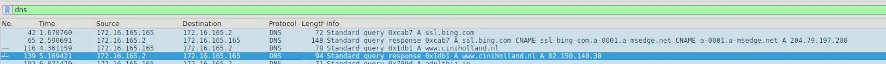

*DNS response resolving `82.150.140.30` to `ciniholland.nl`*

**Answer:** `ciniholland.nl`

---

## Q5 — C2 FQDN

> What is the FQDN that delivered the exploit kit and malware?
Similarly to Q4, we already know the IP of the server that delivered the malware.
Therefore, all we have to do is find the domain name it resolves to.
Again, we saw this in our ZUI output in investigation but we can also get the same answer through analyzing DNS traffic in Wireshark.

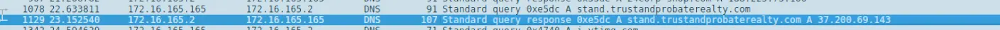

*DNS response resolving `37.200.69.143` to `stand.trustandprobaterealty.com`*

**Answer:** `stand.trustandprobaterealty.com`

---

## Q6 — Redirect URL to EK Landing Page

> What is the redirect URL that points to the exploit kit (EK) landing page?
From the investigation we found that `172.16.165.165` follows the following redirects:
- `ciniholland.nl` > `24corp-shop.com` > `stand.trustandprobaterealty.com`

Therefore, the redirect URL that points to the EK landing page is `24corp-shop.com`.

There is also another way of checking this through Wireshark which is to perform the following filter

```
ip.src == 172.16.165.165 && ip.dst == 37.200.69.143 && http.request.method == GET
```

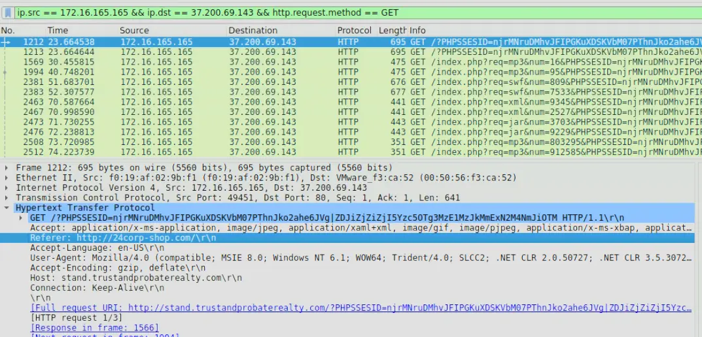

*GET request to EK landing page showing referrer `24corp-shop.com`*

If we look at the referrer field we will see that it is the domain `24corp-shop.com`.
Additionally, the query parameters of this request are odd because it includes a `PHPSSESID` which is a mistyped `PHPSESSID`.
It is possible that the threat actor is trying to disguise the traffic as benign PHP traffic through the use of this fake session parameter.

**Answer:** `24corp-shop.com`

---

## Q7 — Other Application Exploited

> Other than CVE-2013-2551 IE exploit, another application was targeted by the EK and starts with "J". Provide the full application name.
We found this in our ZUI where the other file that was downloaded from the C2 server was a `.jar` file.
Therefore, the other application is Java.

We can also see this in Wireshark by querying,

```
ip.dst == 172.16.165.165 && ip.src == 37.200.69.143 && http.response.code == 200
```

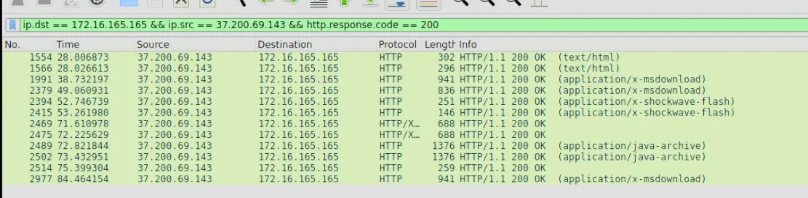

*HTTP 200 responses from C2 to infected endpoint, including `.jar` file delivery*

**Answer:** `Java`

---

## Q8 — Number of Times Payload Delivered

> How many times was the payload delivered?
We can verify this in ZUI through the query `event_type=="alert" and alert.severity==1`.

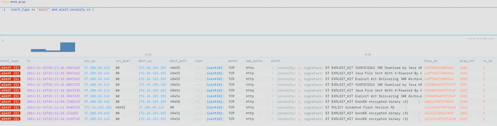

*ZUI alert query output showing three deliveries of GoonEK encrypted binary*

Which shows us that `ET EXPLOIT_KIT GoonEK encrypted binary` was delivered to `172.16.165.165` `3` times.

**Answer:** `3`

---

## Q9 — URL in Malicious Script

> The compromised website has a malicious script with a URL. What is this URL?
From our investigation we know that once the user landed on the compromised website, he was redirected to the malicious domains. Let's inspect the HTML response of the compromised website to see if we find anything interesting.

For that we just perform the following filter,

```
ip.addr == 172.16.165.165 && ip.addr == 82.150.140.30 && http && http.response.code == 200
```

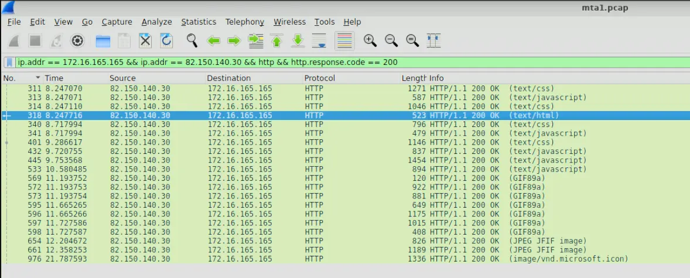

*Filter output showing HTTP 200 responses from the compromised website*

Let's follow the HTTP stream of frame number 318 and see if we find anything interesting.
As we scroll through the response we will see an interesting section of code.

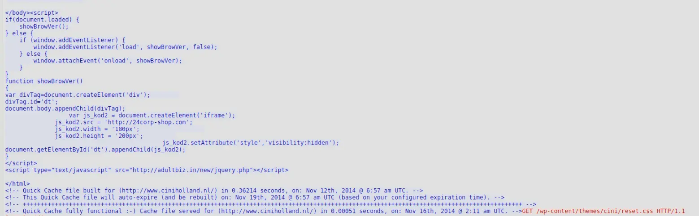

*Malicious script embedded in the landing page — invisible iframe loading `http://24corp-shop.com` and pulling `jquery.php` from `adultbiz.in`*

This is a malicious script embedded in the landing page of the compromised website that automatically loads `http://24corp-shop.com` silently in the background using an invisible iframe (notice the `visibility:hidden`). It also pulls a malicious script `jquery.php` from `adultbiz.in`.

**Answer:** `http://24corp-shop.com`

---

## Q10 — MD5 Hashes of Exploit Files

> Extract the two exploit files. What are the MD5 file hashes? (comma-separated)
For this we can use NetworkMiner which through file details calculates the MD5 hash for us.
If we open the pcap in NetworkMiner then go under `Files`.
We will see the following at the bottom,

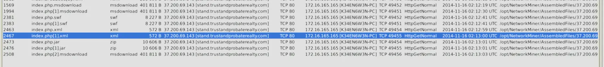

*Files extracted by NetworkMiner from the PCAP*

If we right click each file and click on file details we can get the MD5 sum.
Which gives us the following (ignoring duplicates),
- `index.php.msdownload` : `d276c86dcdbcdb6b74ee02496bc90d98`
- `index.php.swf` : `7b3baa7d6bb3720f369219789e38d6ab`
- `index.php.xml` : `885959f375176e8ed49668b20859d1f4`
- `index.php.jar` : `1e34fdebbf655cebea78b45e43520ddf`

If we pass each of these hashes to VirusTotal we will find that `index.php.jar` and `index.php.swf` are flagged by numerous security vendors as being malicious. Therefore, these are the exploit files and are our answers for this question.

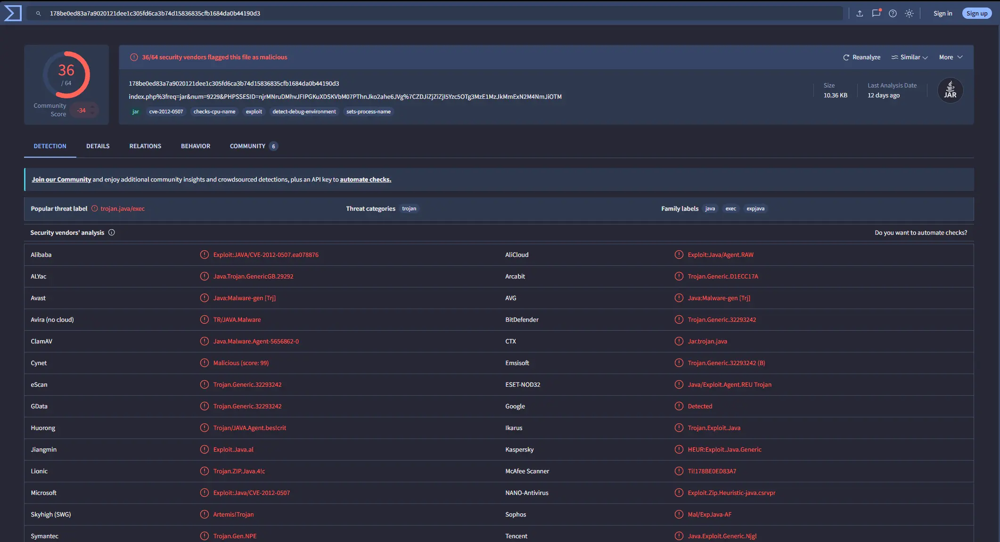

*VirusTotal report for `index.php.jar`*

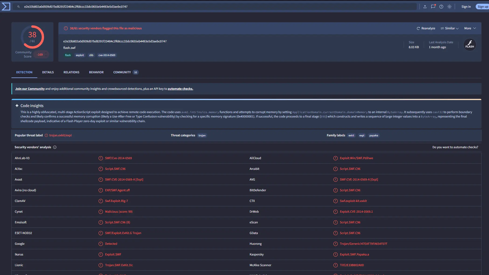

*VirusTotal report for `index.php.swf`*

**Answer:** `7b3baa7d6bb3720f369219789e38d6ab,1e34fdebbf655cebea78b45e43520ddf`

---

# Completion

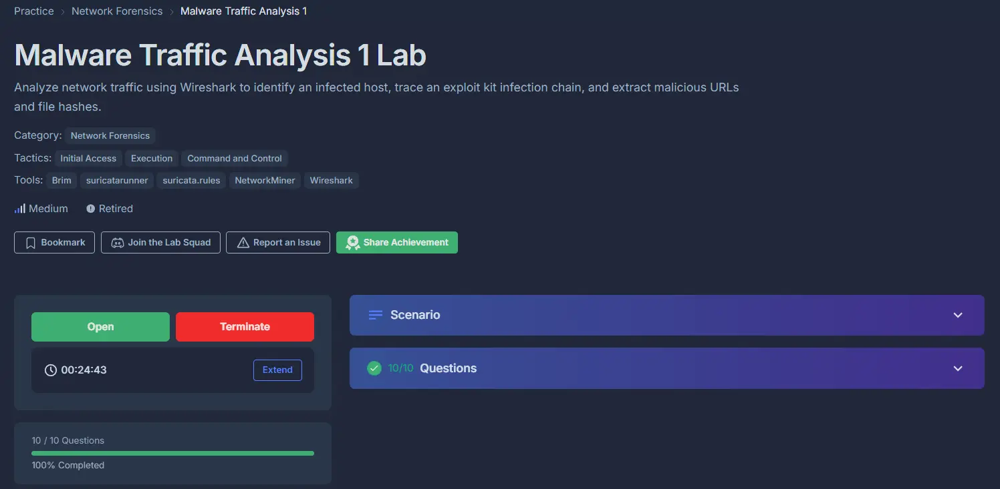

I successfully completed Malware Traffic Analysis 1 Blue Team Lab at @CyberDefenders!
https://cyberdefenders.org/blueteam-ctf-challenges/achievements/francisvil3213/malware-traffic-analysis-1/
