#network-forensics #cyberdefender-medium #Wireshark #ZUI/Brim #finished #reviewed #CyberDefenders #CyberSecurity #BlueYard #BlueTeam #InfoSec #SOC #SOCAnalyst #DFIR #CCD #CyberDefender

# Scenario
Instructions:

- Ensure that there are no blockers, such as Adblock extensions, that might prevent the lab from opening in a new tab or affect lab's functionality.
- All the lab-related files and tools are on the desktop.

The attached PCAP belongs to an Exploitation Kit infection. As a security blue team member, analyze it using your favorite tool and answer the challenge questions.
# Investigation
To start the investigation let's check the statistics of the network capture in Wireshark.
These often can point us in the right direction and help us to identify some leads to chase.
## Statistics
Let's first look at the `Statistics > Protocol Hierarchy`.

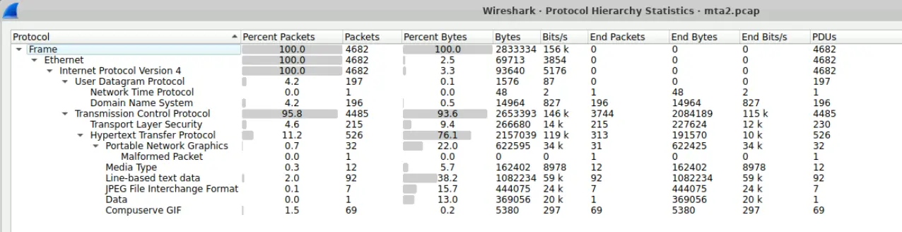

*Protocol Hierarchy*

This tells us the following
- `95.8%` of all captured packets are `TCP`
- `11.2%` of all captured packets are `HTTP`
- `76.1%` of all bytes are attributed to `HTTP`
- `22.0%` of all bytes are attributed to `PNG` data
- `15.7%` of all bytes are attributed to `JPEG` data
- There is 1 malformed `PNG` packet.
- `38.2%` of all bytes captured are attributed to Line-based text data.

Therefore, the majority of the captured network traffic is `TCP` and it seems that a non-negligible amount of data is attributed to image data with one packet being malformed.
Furthermore, the substantial amount of `HTTP` traffic should also be investigated.

Let's also look at `Statistics > Endpoints`.

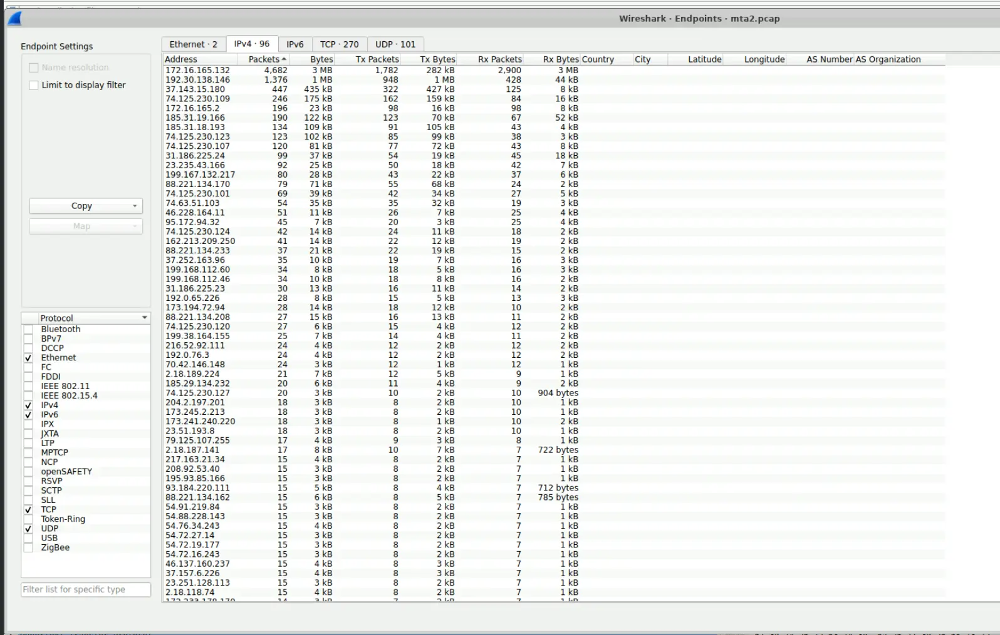

*Endpoints*

Sorting by packets descending we will see that
- `172.16.165.132` had the most packets attributed to it with a number of packets more than double than the second IP
- `192.30.138.146` while not having as much packets as `172.16.165.132` is also a substantial outlier compared to the other IPs.

At the same time let's also look at `Statistics > Conversations`.

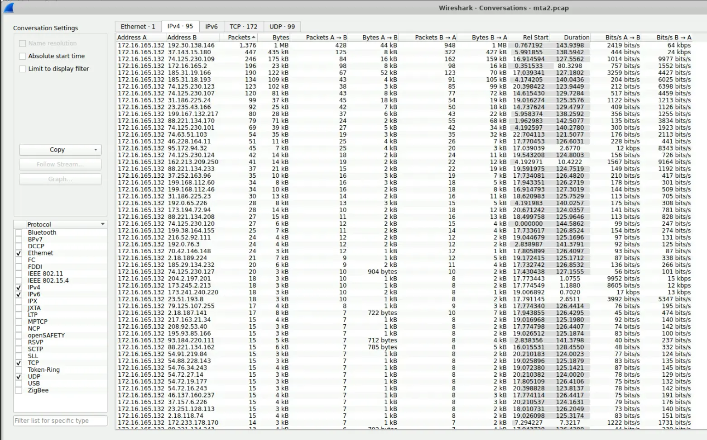

*Conversations IPv4*

Interestingly, `172.16.165.132` conversed a lot with `192.30.138.146`.
Furthermore, `172.16.165.132` has initiated conversations with numerous other IPs.
A majority of which lie in public address space and are short conversations.
These conversations also oddly have a similar number of packets shared between them.

Let's look at the TCP sessions captured.

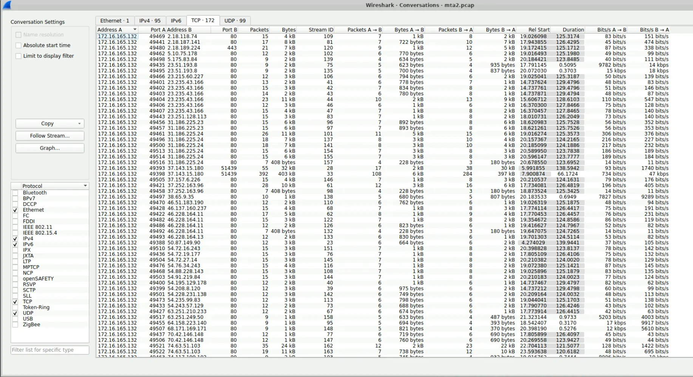

*Captured `TCP` sessions*

Majority of the captured `TCP` sessions are on `HTTP` i.e. port `80`. However, there are some abnormal ports being used here. If we look specifically at the following,

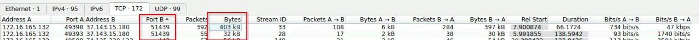

*Sessions of interest*

We will see that the port being used is `51439` and is a non-standard port. It does not map to any known service on the `IANA` registrar. Furthermore, the amount of data being transferred is significant with the size of the data being `403 kB`. The IP being contacted here by `172.16.165.132` is also a public IP address `37.143.15.180`.
This behaviour is highly suspect and warrants further investigation.

To summarise our findings thus far,
- `172.16.165.132` and `192.30.138.146` have the highest amount of packets attributed to them and these two endpoints talked a lot with each other.
- `37.143.15.180` is a suspicious endpoint that was contacted by `172.16.165.132` on port `51439`.
- Majority of the traffic is `HTTP` and `TCP`, we should craft our queries to focus on these search spaces
- A significant amount of the data transmitted is being attributed to image formats like `PNG` and `JPEG`.
- A single malformed `PNG` packet was automatically flagged by Wireshark

## Anomalous `TCP` Session
In our triage of the network capture we found a `TCP` session between `37.143.15.180` and `172.16.165.132`.
Let's investigate this further and determine what type of traffic was being transmitted during this session.

We first filter for packets related to the identified IPs.

```
ip.addr == 172.16.165.132 && ip.addr == 37.143.15.180
```

Which gives us

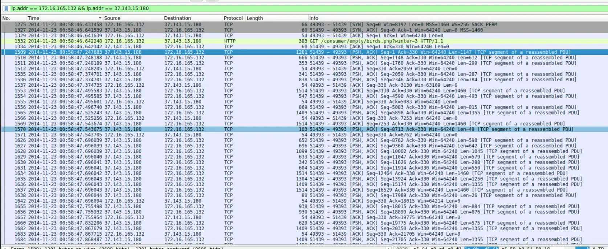

*Snippet of query result*

It shows that `172.16.165.132` requested a resource `/consumer/empty/birds.php?winter=3`. This is then followed by a chunk of `TCP` packets.

If we scroll down further we will see that it also requests another resource `/cars.php?honda=1185&proxy=2442&timeline=4&jobs=823&image=171&join=757&list=679` . Following this request is an even larger chunk of `TCP` packets.

Furthermore, if we click on the first `TCP` packet with the `PSH` flag set after the request for `/cars.php?honda=1185&proxy=2442&timeline=4&jobs=823&image=171&join=757&list=679` was made, we will see in the payload are the magic bytes for a Windows executable.

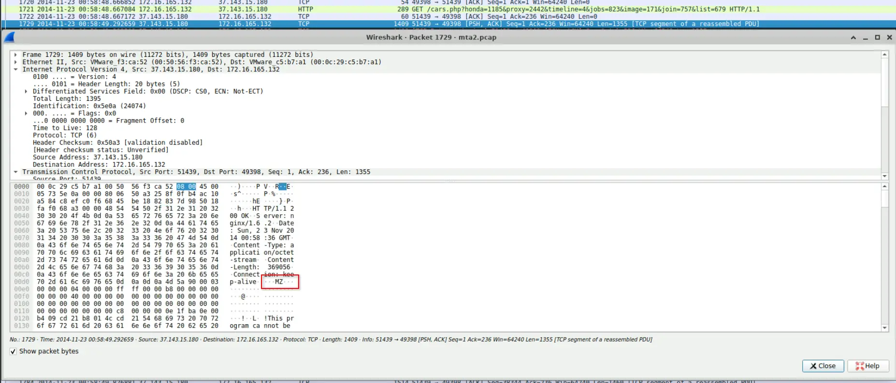

*Magic bytes in `TCP` payload*

We can also determine the FQDN's of the server since we already know its IP.
To determine the resolved FQDN's, we search the captured DNS traffic in Wireshark through the query,

```
dns.a == 37.143.15.180
```

Which gives us,

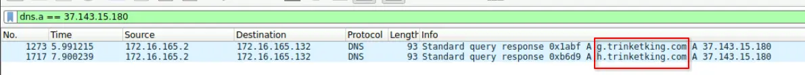

*Identified FQDN's*

Let's also search for the transmitted files in ZUI/Brim.
Finding the files are simple as we can just filter for `_path=="files"` and set the appropriate origin and responding hosts. We should also just cut the result so it is more concise. This gives us the query,

```
_path=="files"
| id.orig_h == 172.16.165.132 AND id.resp_h == 37.143.15.180
| cut id.orig_h,id.resp_h,id.resp_p,source,mime_type,md5
```

Which results in the following,

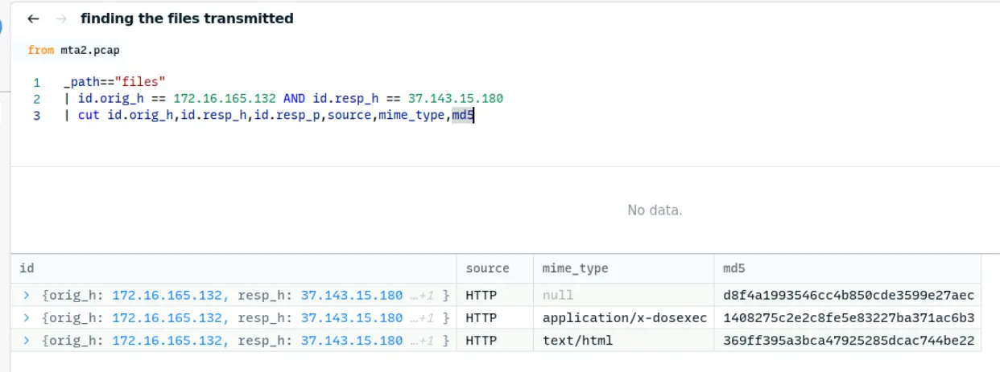

*ZUI query result*

The file that is interesting here is 2nd one being transmitted which has mime type `application/x-dosexec`.
Which means that the transmitted file is a Windows executable.

If we search this file's md5 hash through OSINT platforms like VirusTotal we will see that is a known malware flagged by multiple vendors as seen in this [report](https://www.virustotal.com/gui/file/cc185105946c202d9fd0ef18423b078cd8e064b1e2a87e93ed1b3d4f2cbdb65d/behavior).

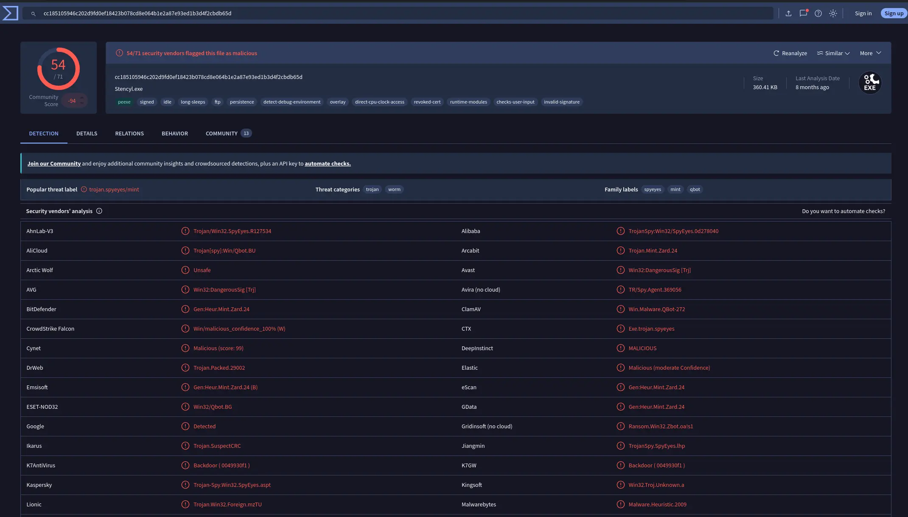

*VirusTotal results*

Searching this same hash in `joesandbox.com` also shows that this malware is `QBot` and is attributed to threat actor `GOLD CABIN` as detailed [here](https://www.joesandbox.com/analysis/1629723/0/html).

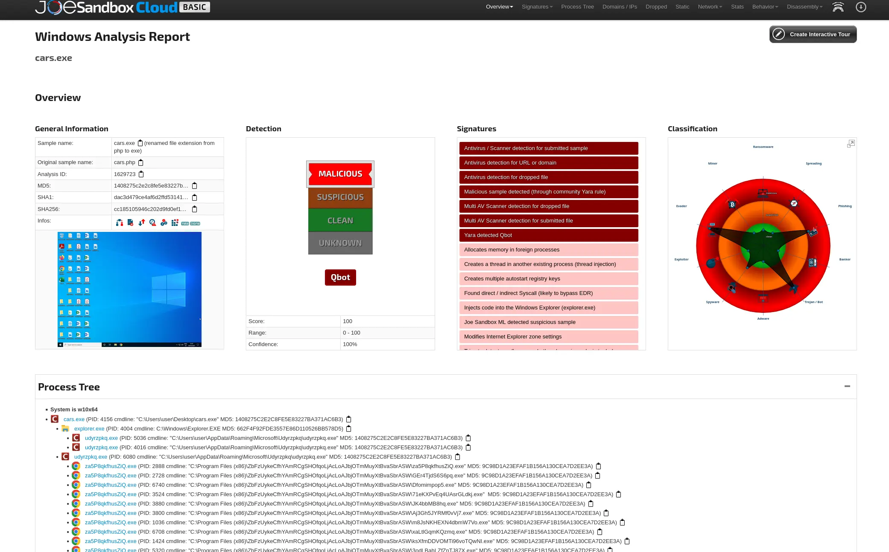

*JoeSandbox analysis results*

Also notice the timestamps of this network capture are in the year 2014.
If we google for information related to `QBot` in `2014` we will land on this [article](https://www.sonicwall.com/blog/sweetorange-exploitkit-and-qakbot-july-11-2014) which talks about an incident where a `SweetOrange ExploitKit` was used to drop `QBot`.

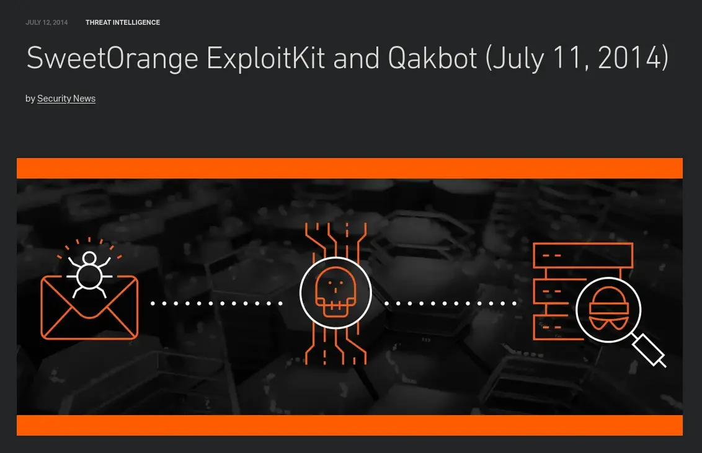

*Header of article*

Given the information we have gathered so far, we now know that `37.143.15.180` is a C2 server that serves the malware `QBot`. It has 2 FQDN's which are `g.trinketking.com` and `h.trinketking.com`. We also know that `172.16.165.132` is the victim of the infection and is likely a Windows device given how the transferred file is a dos executable. We also know from reports about `QBot` during this time frame that one of the exploit kits being used to drop the malware was `Sweet Orange`.
## Identifying Redirect
Having identified the malware that was dropped, we still need to determine what caused `172.16.165.132` to initiate that request in the first place.

If we look at the `HTTP` requests between `172.16.165.132` and `37.143.15.180`, we will see that the first `GET` request had referrer `Referer: http://hijinksensue.com/\r\n`.

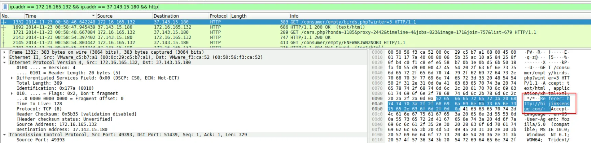

*Referrer for first GET request*

If we filter the DNS queries looking for what IP resolved to this domain, we will find `192.30.138.146` which is the other IP we identified early on. The query we used to find this is

```
dns && dns.qry.name contains "hijink"
```

Which tells us the IP of the server for that FQDN is `192.30.138.146`,

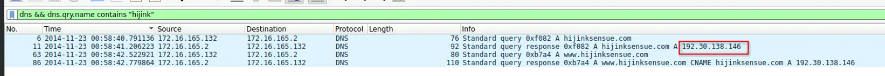

*Wireshark DNS query result*

We can also look for frames just before frame number `1332` satisfying `ip.addr == 172.16.165.132`.
Frame number `1332` corresponds to the first GET request to the malicious server so by scoping our search to just before that, we can find how `172.16.165.132` reached it.

For this we use the query,

```
ip.addr == 172.16.165.132 && frame.number <= 1332 && http
```

Which gives us,

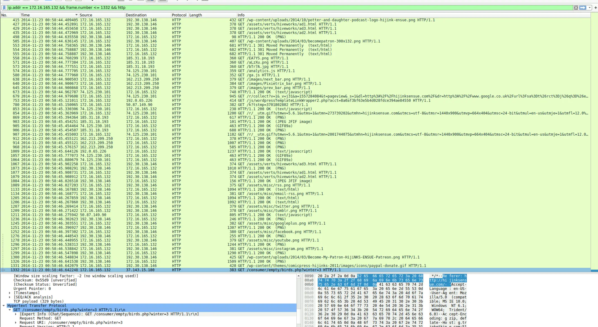

*Result of query*

If we focus on the following snippet of the results,

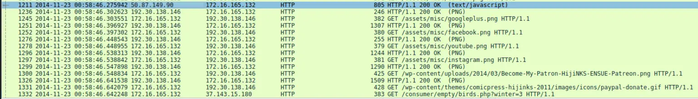

*Interesting portion of the query results*

We will see that there is another IP contacting `172.16.165.132` that we have not seen yet.
This IP is `50.87.149.90`.
This IP is highly suspect because if we ignore the noisy requests regarding getting misc assets and word press content, this response happens just before the first GET request being made to `37.143.15.180`.
Notably, the response returns javascript content.
If we follow this `HTTP` stream we will see a block of obfuscated javascript code.

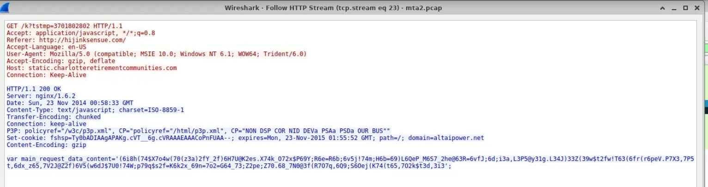

*Obfuscated javascript*

We do not have to decode this obfuscated javascript code as the main tell is the name of the variable itself and what happens after.
The variable is named `main_request_data` and we know that shortly after this, a request was made by `172.16.165.132` to download files from the malicious server.
It is highly probable and defensible that this conversation led to `172.16.165.132` landing on the malicious server.
We can also retrieve the request URI by performing the query

```
ip.addr == 172.16.165.132 && ip.addr == 50.87.149.90 && http
```

Which tells us `[Request URI: http://static.charlotteretirementcommunities.com/k?tstmp=3701802802]`

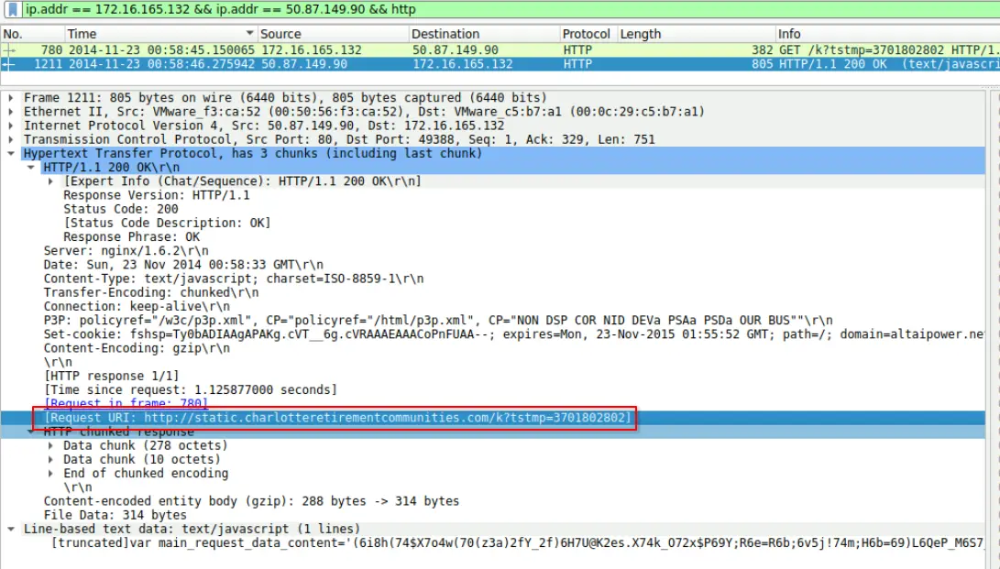

*Request URI*

Therefore, what initiated `172.16.165.132` to download the malware is malicious javascript obtained from `http://static.charlotteretirementcommunities.com/k?tstmp=3701802802`.
We also found out that `192.30.138.146` is a compromised server with FQDN `http:\\hijinksensue.com` that is referring victims to `37.143.15.180:51439`.

Using this information, we can now answer the following questions.

---

# Questions
## Q1 — Infected Windows VM IP
>What is the IP address of the Windows VM that gets infected?

**Answer:** `172.16.165.132`

---

## Q2 — Malicious IP and Port
>What are the IP address and port number that delivered the exploit kit and malware?

**Answer:** `37.143.15.180:51439`

---

## Q3 — FQDN's that delivered EKs
>What are the two FQDN's that delivered the exploit kit? comma-separated in alphabetical order.

**Answer:** `g.trinketking.com,h.trinketking.com`

---

## Q4 — Compromised Website FQDN
>What is the FQDN of the compromised website?

**Answer:** `hijinksensue.com`

---

## Q5 — Name of EK
>What is the name exploit kit (EK) that delivered the malware? (two words)

>[!NOTE]
>One thing I want to note here is that the identification of the EK `Sweet Orange` is mainly inferred from OSINT reporting on known `QBot` and `Sweet Orange` campaigns active around the same period, rather than confirmed directly from exploit artifacts. I attempted to close this gap by analysing the other files transmitted by `37.143.15.180`. In particular the first file transmitted. However, I could not find anything conclusive that would allow me to conclude that the exploit kit used here for certain is `Sweet Orange`.

**Answer:** `Sweet Orange`

---

## Q6 — Redirect URL to EK
>What is the redirect URL that points to the exploit kit landing page?

**Answer:** `static.charlotteretirementcommunities.com/k?tstmp=3701802802`

---

## Q7 — IP Address of redirect
>What is the IP address of the redirect URL that points to the exploit kit landing page?

**Answer:** `50.87.149.90`

---

## Q8 — MD5 hash of malware
>Extract the malware payload (PE file) from the PCAP. What is the MD5 hash?

**Answer:** `1408275c2e2c8fe5e83227ba371ac6b3`

---

## Q9 — CVE Used
>What is the CVE of the exploited vulnerability?

To determine the CVE used we just search for information about the identified EK in the time frame of the network capture.
It is important we scope our search to the same time frame because tools naturally change over time.
This search results in the following,

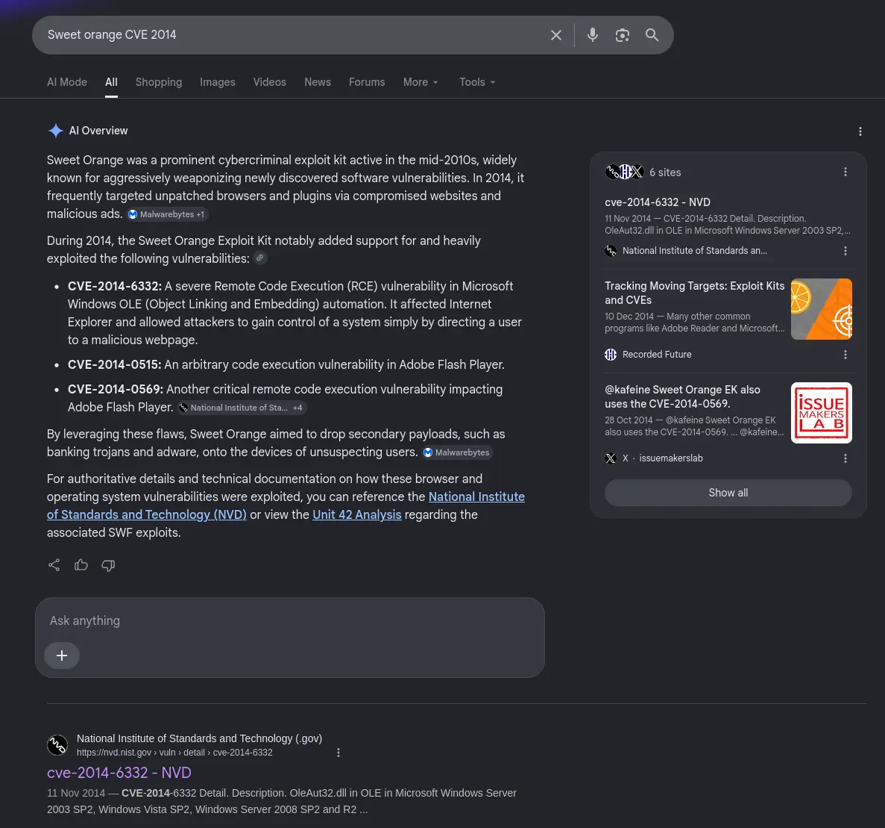

*Google search results*

I also found this [article](https://www.malwarebytes.com/blog/news/2015/01/major-malvertising-campaign-hits-sites-with-combined-total-monthly-traffic-of-1-5bn-visitors) detailing a different major malvertising campaign where it states that the exploit kit used is `Sweet Orange` and the vulnerability exploited by the EK was `CVE-2014-6332`.

>[!NOTE]
> Sweet Orange in this time period was actually known to have exploited multiple CVEs. The answer we found is again from OSINT reports about known campaigns that have utilised this exploit kit in particular rather than exploit artifacts in this capture.

**Answer:** `CVE-2014-6332`

---

## Q10 — Referrer for URI that returned "f.txt"
>What was the referrer for the visited URI that returned the file "f.txt"?

To find this we first need to find which IP even transmitted this file.
We can do this through ZUI/Brim by performing the query,

```
_path == "files"
| cut id.orig_h,id.resp_h,filename
```

Which tells us the IP of the server serving this file is `74.125.230.109`.
As seen below,

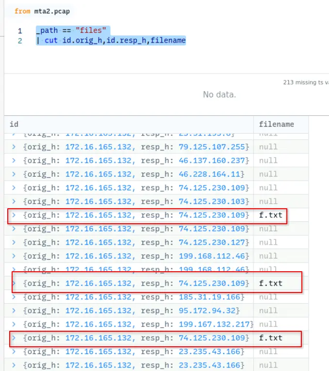

*IP of server serving "f.txt"*

We can then search for this IP in Wireshark through,

```
ip.addr == 74.125.230.109 && http
```

Which tells us that one of the request URIs for this file is
`[Request URI: http://pagead2.googlesyndication.com/pagead/js/adsbygoogle.js]`.

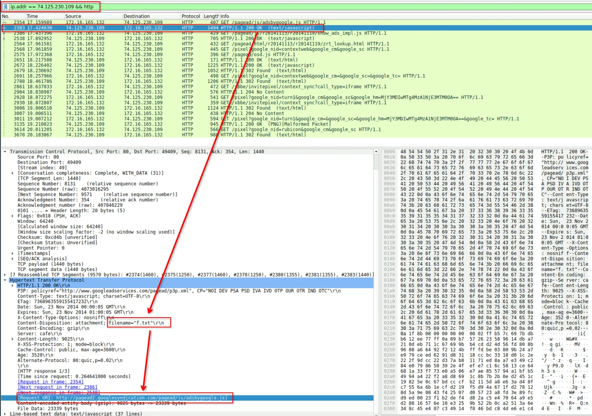

*One of the request URI for "f.txt"*

We can then click into the packet just before that made the request to that URI and find the referrer is `Referer: http://hijinksensue.com/assets/verts/hiveworks/ad1.html\r\n`.

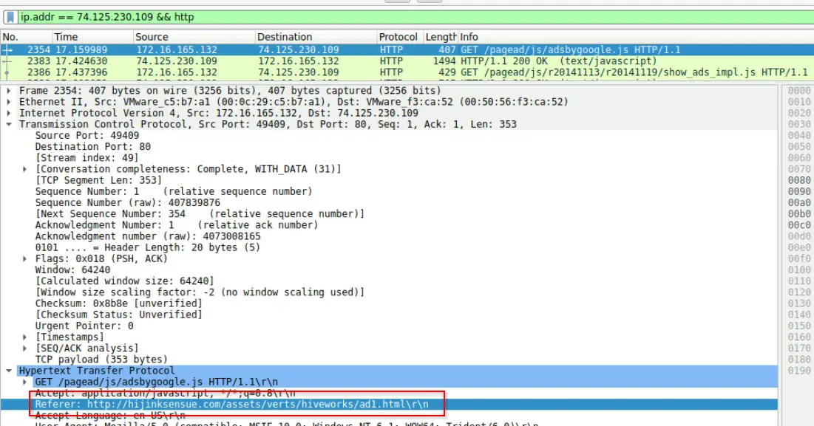

*Identified Referrer*

**Answer:** `http://hijinksensue.com/assets/verts/hiveworks/ad1.html`

---

# Completion

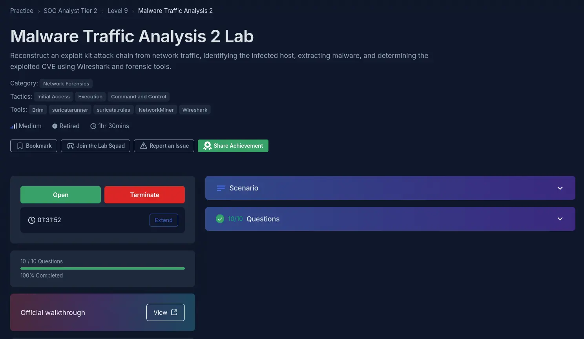

I successfully completed Malware Traffic Analysis 2 Blue Team Lab at @CyberDefenders!
https://cyberdefenders.org/blueteam-ctf-challenges/achievements/francisvil3213/malware-traffic-analysis-2/
