#network-forensics #wireshark #cyberdefender-easy #finished #reviewed #CyberDefenders #CyberSecurity #BlueYard #BlueTeam #InfoSec #SOC #SOCAnalyst #DFIR #CCD #CyberDefender

# Scenario
An alert from the Intrusion Detection System (IDS) flagged suspicious lateral movement activity involving PsExec. This indicates potential unauthorized access and movement across the network. As a SOC Analyst, your task is to investigate the provided PCAP file to trace the attacker's activities. Identify their entry point, the machines targeted, the extent of the breach, and any critical indicators that reveal their tactics and objectives within the compromised environment.

# Questions
## Investigation

Let's first look over some basic statistics to get an overview of the capture.

Let's start with `Statistics > Endpoints`.

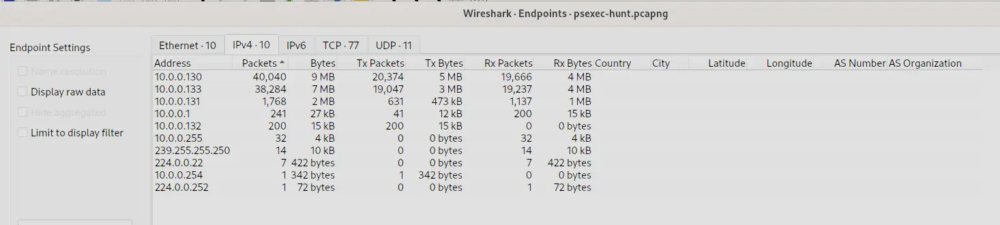

*Endpoints statistics sorted by packet count*

We can see that majority of the traffic is concentrated around 2 IPs which are 
- `10.0.0.130`
- `10.0.0.133`

Let's continue under `Statistics > Conversations`.

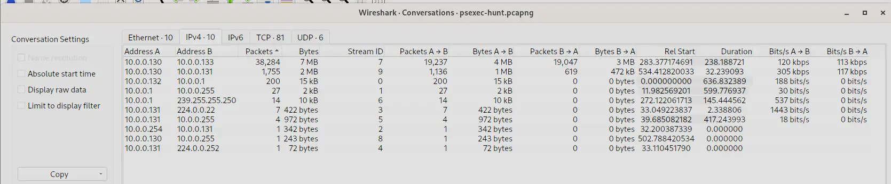

*Conversations statistics sorted by packet count*

We can also see that most of the traffic is just `10.0.0.130` communicating with `10.0.0.133`.
Furthermore, notice how `10.0.0.130` also communicates with `10.0.0.131`.
We should probably start our investigation on `10.0.0.130` because this IP shows up multiple times in the conversations with the highest traffic.

Let's continue in `Statistics > I/O Graphs`.

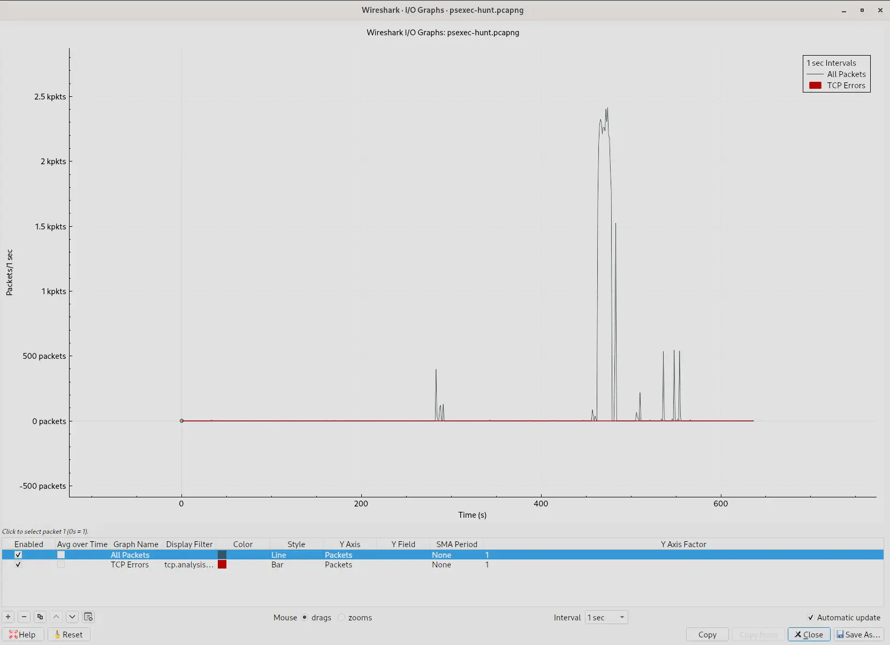

*I/O graph of the capture*

The captured traffic is mostly flat in the beginning then spikes extremely high.
After which it returns to much lower traffic with a few more shorter spikes after.
This burst of sudden activity is highly suspicious.

Let's conclude our initial triage with `Statistics > Protocol Hierarchy`.

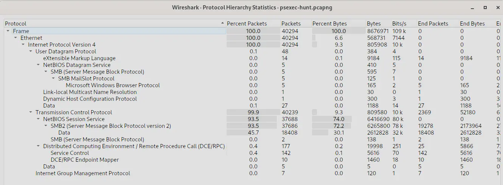

*Protocol hierarchy statistics*

This tells us the following,
- Almost all packets is TCP
- Almost all packets is SMB2
- SMB2 traffic accounts for ~70% of all bytes
- However, SMB2 traffic that carries actual file read/write payload is only 30% of all bytes.

Given, this information, my initial hypothesis would be that a malicious actor at `10.0.0.130` is enumerating and exploiting SMB2 services.
Let's investigate and see if what I find confirms this hypothesis or not.

## Q1 — Victim IP Address
> To effectively trace the attacker's activities within our network, can you identify the IP address of the machine from which the attacker initially gained access?

From our investigation, we know that majority of the traffic is SMB/SMB2 traffic.
We also know that `10.0.0.130` is involved in the two conversations with the highest traffic.
Let's start by searching for SMB/SMB2 traffic for the IP `10.0.0.130` using the following filter,

```
ip.addr == 10.0.0.130 && (smb||smb2)
```

Which gives us,

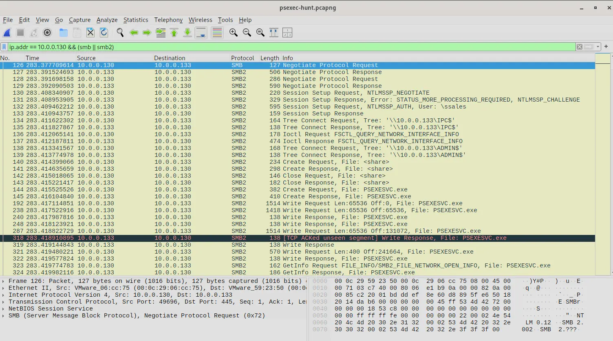

*Wireshark output filtered for SMB/SMB2 traffic from 10.0.0.130*

If we inspect the output we can tell that `10.0.0.130` is the endpoint and `10.0.0.133` is the SMB server.
This is evident when `10.0.0.133` responds with `Session Setup Response` and `Tree Connect Response` to the corresponding requests of `10.0.0.130`.

If we inspect frame 132 which is the third step in the setup phase, we can see 
- What user `10.0.0.130` is authenticating as
- What host name is `10.0.0.130`
- What host name is `10.0.0.133`
Which we will see below,

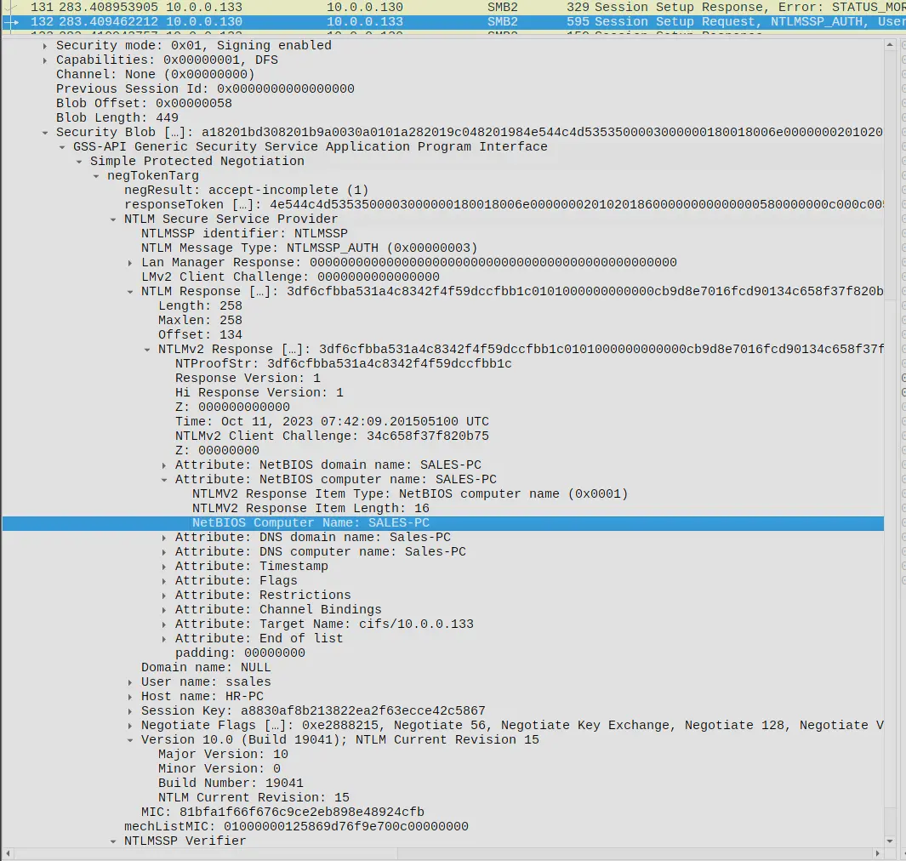

*Frame 132 — NTLMv2 response revealing hostnames and the authenticating user*

We can see in NTLMv2 response that the NetBIOS computer name of `10.0.0.133` is `SALES-PC`.
Furthermore, we will see under negTokenTarg that `10.0.0.130` is authenticating as `ssales` and has host name `HR-PC`.
However, what is interesting here is the domain name is set to null.
Furthermore, if we inspect the actions the authenticated user does , we will see the following,

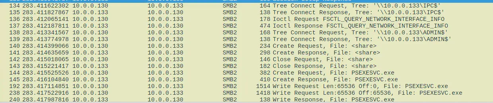

*Actions conducted by the authenticated user on the ADMIN$ share*

He navigates to the `ADMIN$` share then uploads a `PSEXECSVC.exe` file which is the remote agent component of PsExec.
It is a remote administration tool.
Remember that this user,
- Authenticated with a null domain (Known indicator of suspicious/pass-the-hash authentication)
- Authenticated as user `ssales` on `SALE-PC` from `HR-PC` 
- Accessed an `ADMIN$` only share then uploaded a `PSEXECSVC.exe` to it
This is highly suspicious as it is characteristic of lateral movement using psexec and is consistent with the alert flagged in the IDS in the provided scenario.
`10.0.0.130` is the machine that the attacker first gained access.

**Answer:** `10.0.0.130`

---
## Q2 — Hostname of Machine Attacker Pivoted To
> To fully understand the extent of the breach, can you determine the machine's hostname to which the attacker first pivoted?

We saw this earlier in frame 132 when the attacker was establishing a session with the target machine.
The target machine host name is `SALES-PC`.

**Answer:** `SALES-PC`

---
## Q3 — Username Used for Authentication
> Knowing the username of the account the attacker used for authentication will give us insights into the extent of the breach. What is the username utilized by the attacker for authentication?

Similarly, we saw this already in frame 132 where the attacker authenticated with `ssales`.

**Answer:** `ssales`

---
## Q4 — Service Executable
> After figuring out how the attacker moved within our network, we need to know what they did on the target machine. What's the name of the service executable the attacker set up on the target?

We saw this in frames 144 and 145 where after establishing a tree connect, the attacker performs a create request for `PSEXESVC.exe`.
We can also check this in ZUI using the following filter

```
_path == "smb_files"
| cut ts,id.orig_h,id.resp_h,action,path,name,size
| sort ts
```

Which gives us,

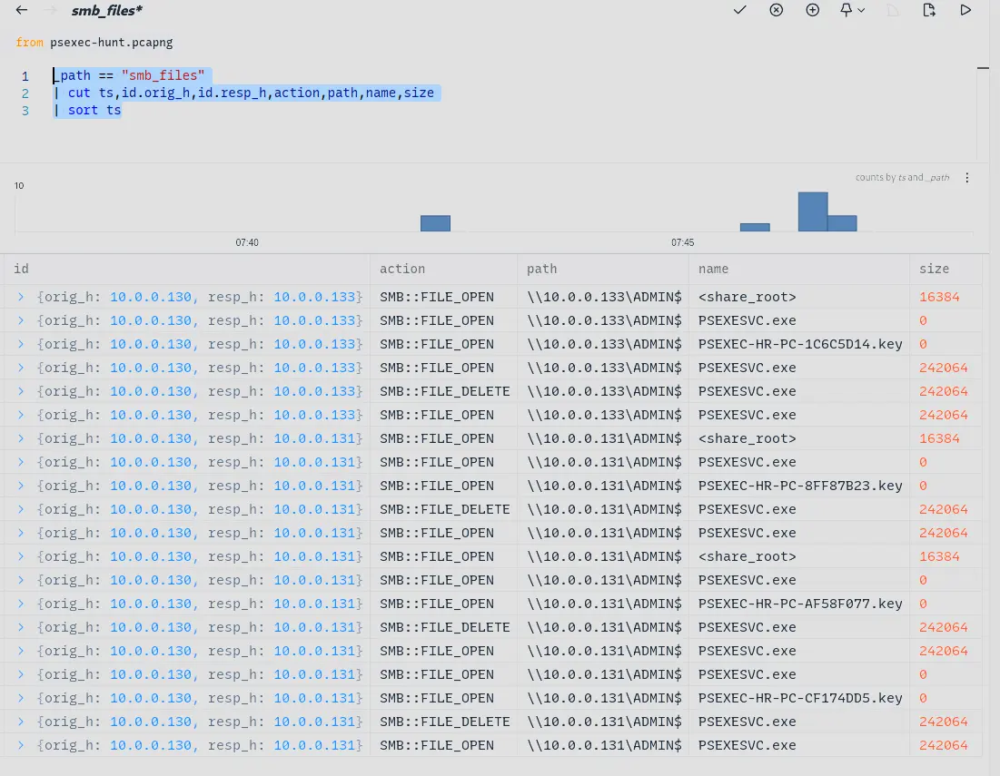

*ZUI output showing SMB file creation events across targeted machines*

We can see that the attacker creates the file on `10.0.0.133`.
Furthermore, we can see the attacker also creates the file on `10.0.0.131`.
Also, notice both `10.0.0.131` and `10.0.0.133` has a `PSEXEC-HR-PC-*.key` file create on their `ADMIN$` SMB shares?
That is evidence that the attacker actually managed to open multiple interactive sessions on these machines.
You can also see the self cleaning behavior of `PSEXESVC.exe` exhibits after a remote session closes.

**Answer:** `PSEXECSVC.exe`

---
## Q5 — Target Network Share
> We need to know how the attacker installed the service on the compromised machine to understand the attacker's lateral movement tactics. This can help identify other affected systems. Which network share was used by PsExec to install the service on the target machine?

From both our ZUI output as well as Wireshark output we can see that the attacker is targeting the `ADMIN$` share.

**Answer:** `ADMIN$`

---
## Q6 — Network Share Used for Communication
> We must identify the network share used to communicate between the two machines. Which network share did PsExec use for communication?

Notice how in Wireshark, every time the attacker wants to use the shell and we see the subsequent traffic corresponding to that usage, we will see the attacker complete a Tree Connect request and response to the network share `IPC$`?
This is a hard requirement for the shell to even work and `IPC$` stands for `Inter Process Communication`.
It is a hidden share that is not mapped to any folder or drive and is instead only used to purely exposed named pipes.
These named pipes are created and used by the shell instantiated by `PSEXESVC.exe`

Furthermore, the attacker has to renegotiate the Tree Connect to IPC$ each time they invoke the shell.
This is why you see 4 separate session keys being created in our ZUI output which corresponds to the 4 times the attacker had to re-negotiate the Tree Connect to `IPC$`.

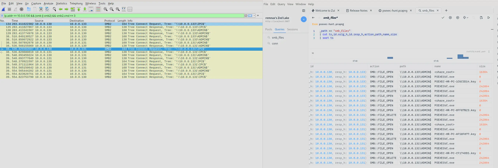

*Wireshark and ZUI output side by side showing IPC$ Tree Connect re-negotiations*

**Answer:** `IPC$`

---
## Q7 — Further Lateral Movement
> Now that we have a clearer picture of the attacker's activities on the compromised machine, it's important to identify any further lateral movement. What is the hostname of the second machine the attacker targeted to pivot within our network?

All we have to do is filter for the Session Setup Request and Response packets between `10.0.0.130` and `10.0.0.131`.
We do this using the filter,

```
ip.adder == 10.0.0.130 && ip.addr == 10.0.0.131 && smb2.cmd == 1
```

Giving us the following,

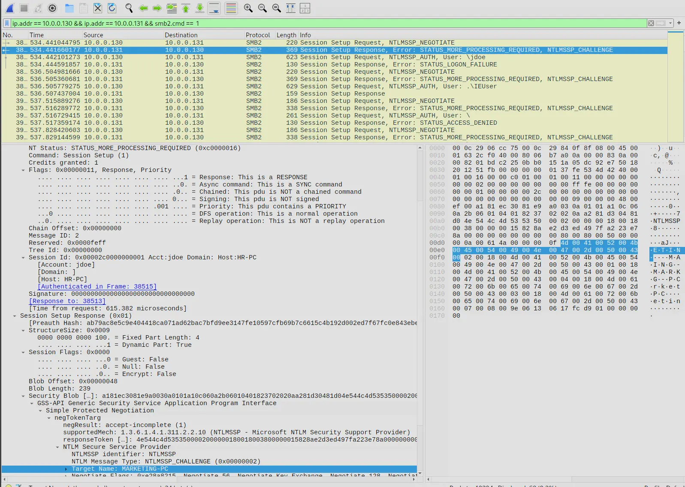

*Session Setup response revealing the hostname of the second targeted machine*

Which tells us `10.0.0.131` has host name `MARKETING-PC`.

**Answer:** `MARKETING-PC`

---
# Completion

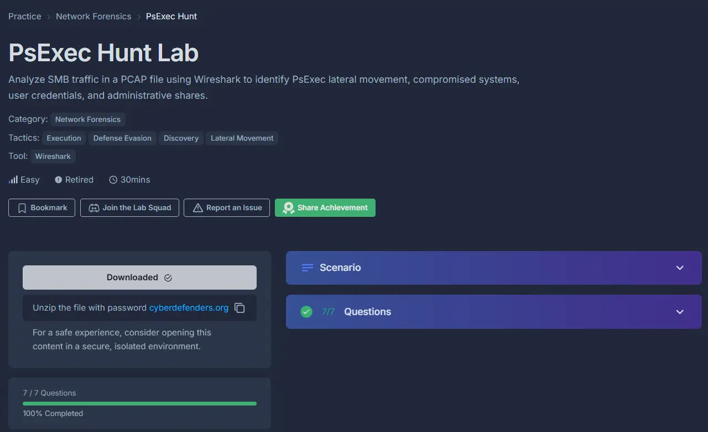

I successfully completed PsExec Hunt Blue Team Lab at @CyberDefenders!
https://cyberdefenders.org/blueteam-ctf-challenges/achievements/francisvil3213/psexec-hunt/
