#network-forensics #cyberdefender-easy #wireshark #network-miner #zui/brim #finished #reviewed 
# Scenario
In recent days, ShopSphere, a prominent online retail platform, has experienced unusual administrative login activity during late-night hours. These logins coincide with an influx of customer complaints about unexplained account anomalies, raising concerns about a potential security breach. Initial observations suggest unauthorized access to administrative accounts, potentially indicating deeper system compromise.

Your mission is to investigate the captured network traffic to determine the nature and source of the breach. Identifying how the attackers infiltrated the system and pinpointing their methods will be critical to understanding the attack's scope and mitigating its impact.
# Questions
## Q1  — Identifying attacker's IP address
>Identifying an attacker's IP address is crucial for mapping the attack's extent and planning an effective response. What is the attacker's IP address?

To get started let's have a look at the `Statistics > Conversations`.
This will allow us to have an overview of what IP Addresses are talking to what.

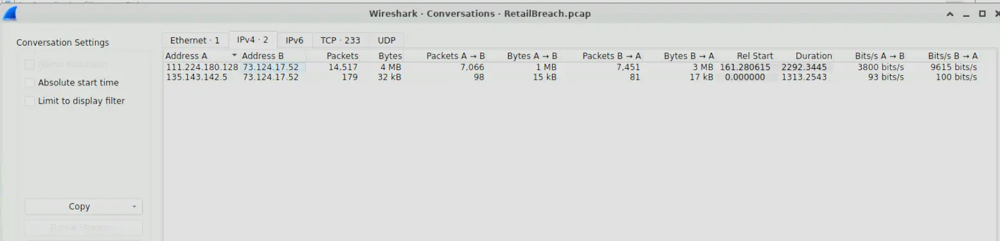

*Wireshark Conversations output*

We can see from the screenshot the following IPs.
1. `111.224.180.128`
2. `135.143.142.5`
3. `73.124.17.52`

A quick inspection of the `73.124.17.52` traffic shows us that is the web server IP. We can rule that out.
If we inspect the http traffic of `135.143.142.5` we will see that this is likely the IP of the legitimate admin user.

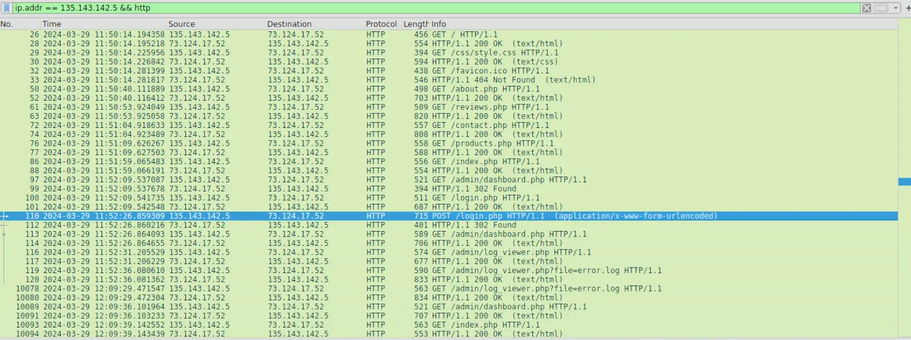

*Snippet of traffic from `135.143.142.5`*

However, `111.224.180.128` not only constitutes most of packets captured in this `pcap`. We will see that the traffic he is producing is highly suspicious.

For instance, if we filter using `ip.addr = 111.224.180.128 && http` we will see that he is producing traffic characteristic of directory enumeration.

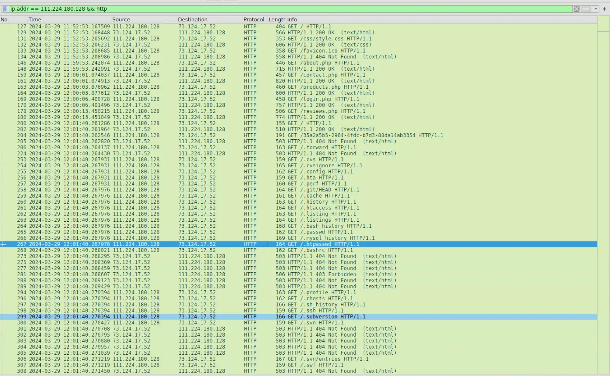

*Snippet of traffic produced by `111.224.180.128`*

This is a common method used in reconnaissance used by attackers to determine what URIs are accessible on the website.
It is very likely that `111.224.180.128` is the attacker as this pattern of traffic is not consistent with that of a normal user.

**Answer:**`111.224.180.128`

---
## Q2  — Identifying brute force tool
>The attacker used a directory brute-forcing tool to discover hidden paths. Which tool did the attacker use to perform the brute-forcing?

We have already identified that the attacking IP was performing directory enumeration.
To determine what tool is being used we can inspect the request body of each attempt.

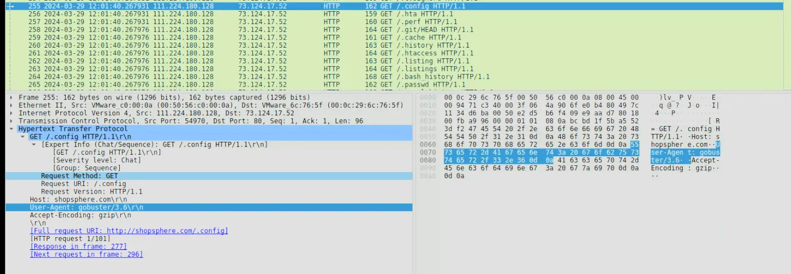

*Request body of one packet in the directory enumeration*

We can see from the above, that the user agent is set to `gobuster 3.6` which is not a browser.
`gobuster 3.6` is a popular open source tool for brute forcing directories.

**Answer:** `gobuster`

---
## Q3  — Finding the XSS payload
>Cross-Site Scripting (XSS) allows attackers to inject malicious scripts into web pages viewed by users. Can you specify the XSS payload that the attacker used to compromise the integrity of the web application?

To find the XSS payload we can inspect the traffic of the attacker after the enumeration.
We will do that using the filter `ip.src == 111.224.180.128 && http && !(http.user_agent contains "gobuster") `.

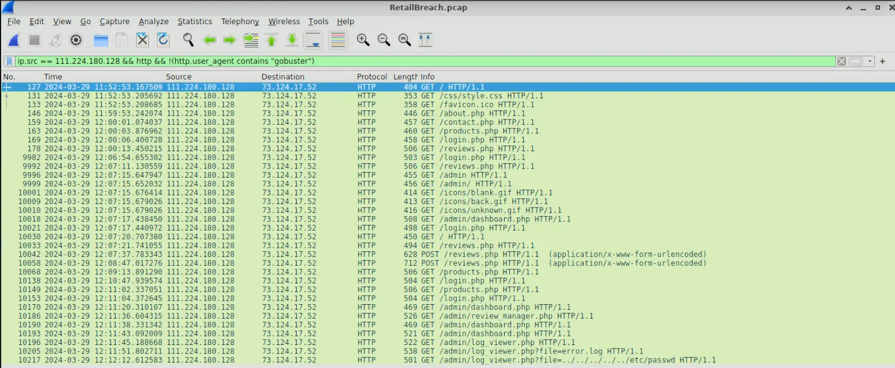

*Traffic of attacker that is not directory enumeration*

There are 2 POST requests in the traffic that look highly suspect. 
The first one is a benign request whereas the second one has a payload in it's body.

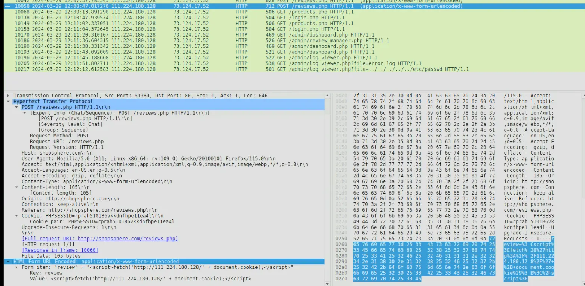

The payload is an XSS payload which steals the clients cookie then makes a request to the attacker's server.
Thereby, allowing the attacker to steal a legitimate user's cookie when they navigate to that page.

**Answer:**``

---
## Q4  — Timestamp of admin first visiting compromised page
>Pinpointing the exact moment an admin user encounters the injected malicious script is crucial for understanding the timeline of a security breach. Can you provide the UTC timestamp when the admin user first visited the page containing the injected malicious script?

In the previous question we found the packet where the payload is sent to the server.
What we can do now is take note of the time of the payload reaching the server and inspect the traffic of `135.143.142.5` after that point in time.

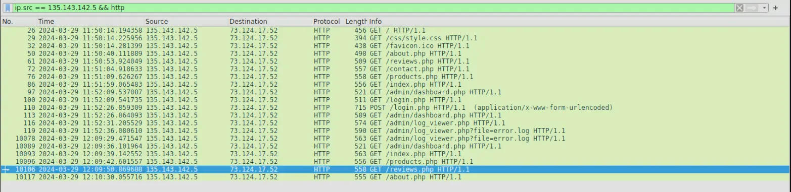

*`135.143.142.5` traffic to server*

We know the attack happened at `12:08` and it was posted to the `/reviews.php`.
Therefore, we are looking for when `135.143.142.5` accessed `/reviews.php` after `12:08`.
In the above screenshot, we found that `135.143.142.5` accessed `/reviews.php` at `12:09`.

**Answer:**`2024-03-29 12:09`

---
## Q5  — Session token used by attacker
>The theft of a session token through XSS is a serious security breach that allows unauthorized access. Can you provide the session token that the attacker acquired and used for this unauthorized access?

Now we know the admin was compromised at `12:09`.
We can look at traffic beyond that point from the attacker.

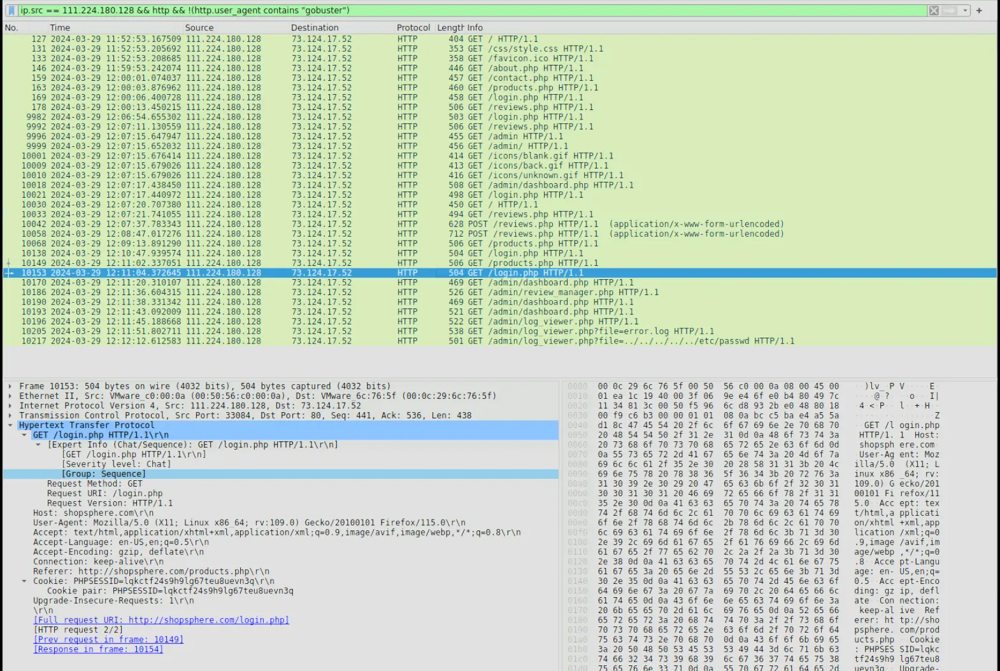

*Traffic from attack*

If we focus at the traffic after `12:09` and monitor how `PHPSESSID` changes we will find the answer.
The first get request, packet number `10138` has a `PHPSESSID` that belongs to the attacker when he first authenticated with the website.
The second request, packet number `10149`, has a different `PHPSESSID` which is `lqkctf24s9h9lg67teu8uevn3q`.
If we go and inspect the traffic of `135.143.142.5` we will find that this session ID actually belongs to him instead of the attacker ip.

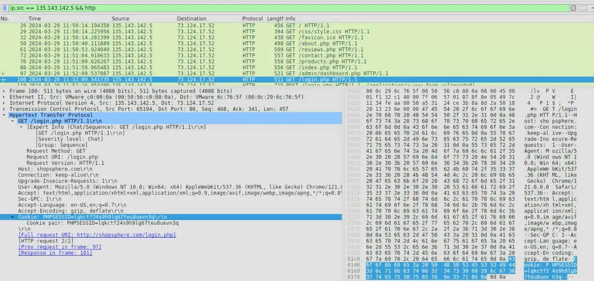

*`135.143.142.5` session ID*

**Answer:**`lqkctf24s9h9lg67teu8uevn3q`

---
## Q6  — Exploited Script
>Identifying which scripts have been exploited is crucial for mitigating vulnerabilities in a web application. What is the name of the script that was exploited by the attacker?

If we continue the inspect the attacker traffic we will see some interesting GET requests being made.

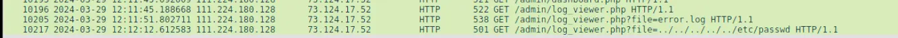

*Suspicious GET requests*

The above screenshot shows suspicious requests being made by the attacker. 
These requests are characteristic of a local file inclusion attack where by passing a relative file path, the attacker is able to read the contents of local files.

The file or script that was being exploited was `/admin/log_viewer.php`

**Answer:**`log_viewer.php`

---
## Q7  — Sensitive system file that was accessed
>Exploiting vulnerabilities to access sensitive system files is a common tactic used by attackers. Can you identify the specific payload the attacker used to access a sensitive system file?

We have already identified the suspicious traffic.
The file being accessed can be trivially spotted in the HTTP parameters.

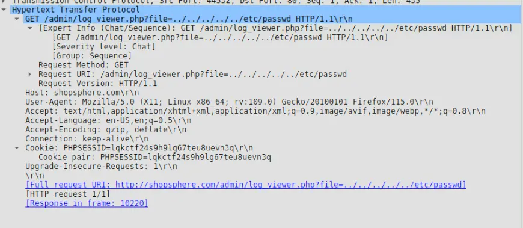

*Request body of suspicious request*

From the body we can tell that the user is trying to access `/etc/passwd`

**Answer:** `../../../../../etc/passwd`

---
# Completion

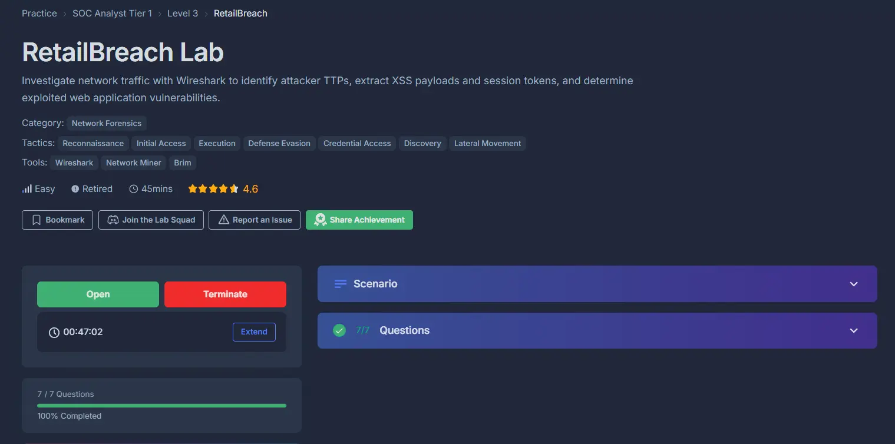

I successfully completed RetailBreach Blue Team Lab at @CyberDefenders!
https://cyberdefenders.org/blueteam-ctf-challenges/achievements/francisvil3213/retailbreach/
 
#CyberDefenders #CyberSecurity #BlueYard #BlueTeam #InfoSec #SOC #SOCAnalyst #DFIR #CCD #CyberDefender
