#network-forensics #python3 #cyberdefender-easy #virusTotal #powershell #wireshark #finished #reviewed #remnux

# Scenario

A compromised machine has been flagged due to suspicious network traffic. Your task is to analyze the PCAP file to determine the attack method, identify any malicious payloads, and trace the timeline of events. Focus on how the attacker gained access, what tools or techniques were used, and how the malware operated post-compromise.

---

# Questions

## Q1 — Finding the Malicious URL

> The attacker successfully executed a command to download the first stage of the malware. What is the URL from which the first malware stage was installed?

**Approach:** Filter Wireshark for HTTP GET requests and follow the HTTP stream on any suspicious connection to inspect the response body.

The method of request we are looking for here is `GET`. Let's filter for those and see what we get.

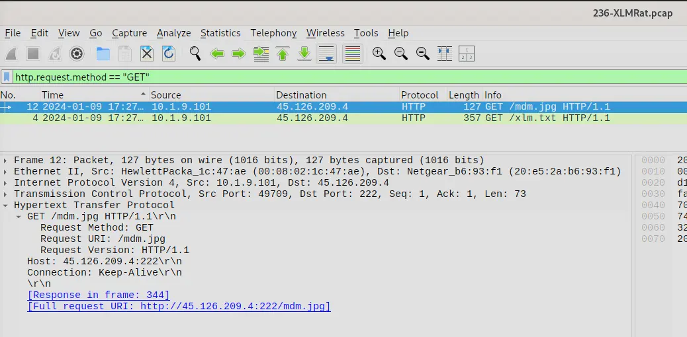

*Wireshark output of GET request filter*

From the above, we can see a couple of requests being made. The first request is highly suspect because it is retrieving an image from a raw IP without a proper domain name. Legitimate services rarely, if ever, host content directly on a raw IP.

If we right-click and follow the HTTP stream, we can see that the image being retrieved is not what it seems.

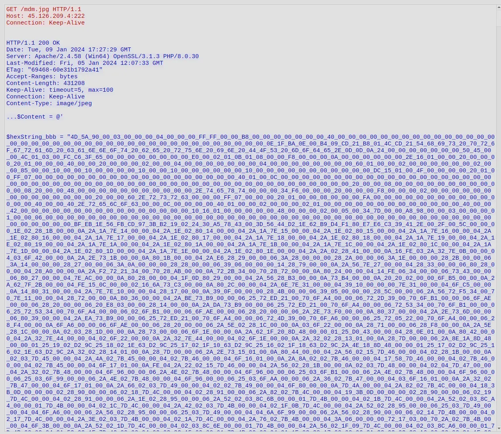

*HTTP response body from the raw IP*

The response does not look typical of a JPEG despite the `Content-Type` being declared as `image/jpeg`. If we scroll down, we will see that this is actually a malicious PowerShell script with embedded binaries.

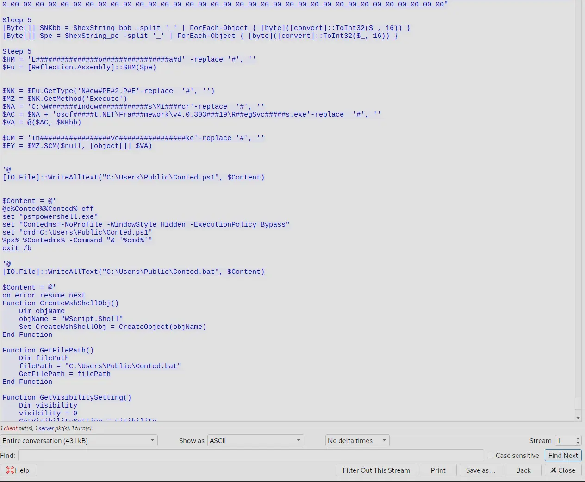

*Malicious VBS script embedded in the fake image*

It is clear `http://45.126.209.4:222/mdm.jpg` is a piece of malware.
Furthermore, the other request with the `xlm.txt` only shows a script that reconstructs an obfuscated string.
This obfuscated string when reconstructed and deobfuscated is actually a command to download`http://45.126.209.4:222/mdm.jpg`.

**Answer:** `http://45.126.209.4:222/mdm.jpg`

---

## Q2 — Hosting Provider of the IP

> Which hosting provider owns the associated IP address?

**Approach:** Perform an ASN lookup on the identified IP using an online lookup tool.

To find the answer, we just need to perform an ASN lookup of `45.126.209.4`. There are many online tools for this, and the output below is from one of them.

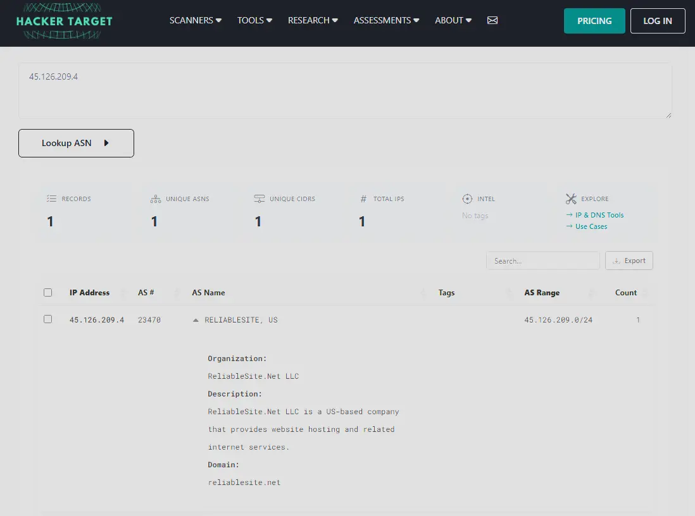

*HackerTarget ASN lookup results for the malicious IP*

**Answer:** `ReliableSite.Net`

---

## Q3 — SHA256 of the Malware Executable

> By analyzing the malicious scripts, two payloads were identified: a loader and a secondary executable. What is the SHA256 of the malware executable?

**Approach:** Export HTTP objects from Wireshark to retrieve `mdm.jpg`, extract the two embedded hex-encoded binaries using CyberChef, analyse the script logic to identify which binary is the payload, then hash it.

If we inspect `mdm.jpg`, we will see that there are two executable files embedded in the file. The first one is defined by `$hexString_bbb` and the other is defined by `$hexString_pe`. We will need to extract these binaries. To do this, we export the objects in Wireshark via `File` > `Export Objects` > `HTTP`, which brings up the following window.

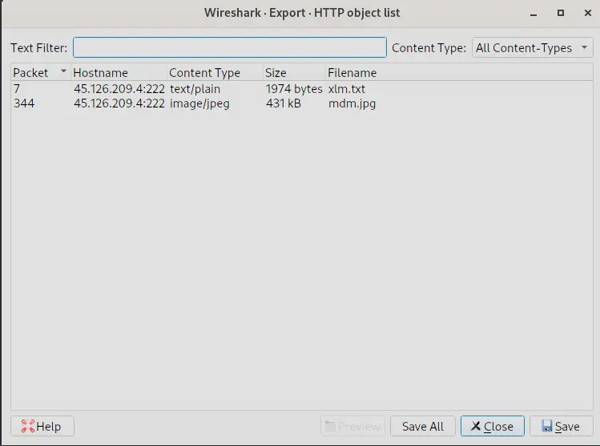

*Export HTTP objects window in Wireshark*

We need to save `mdm.jpg` since that is what contains the binaries. We then create two copies of this image, and for each one we strip out everything that is not the binary we are trying to extract. We have two binaries, but one of them is the loader and one is the executable. These binaries are represented in hex, so we get the raw bytes from the files in CyberChef using `From Hex` and save them.

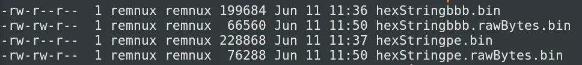

*Extracted malware files after hex decoding*

However, only one of these embedded binaries is the actual malware executable; the other is a loader. To determine which is which, we need to inspect the code.

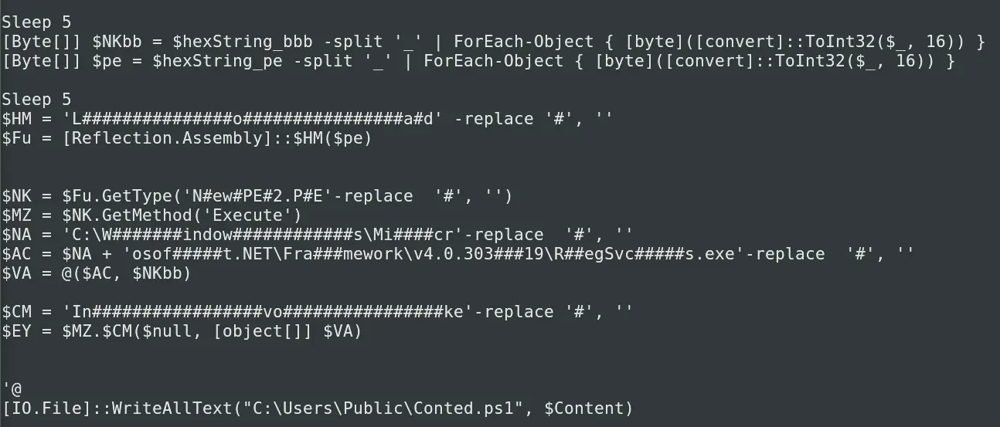

*Code snippet from the malware script*

If we resolve the obfuscation tricks, we will see that the binary defined by `$hexStringbbb` is passed as an argument to a function call from the binary defined by `$hexStringpe` — we can see this in `$EY`. Furthermore, the binary defined by `$hexStringbbb` is never loaded or executed directly in the script, which is characteristic of passing the main payload to a loader.

Therefore, we know that `$hexStringbbb` is likely the main malware executable, whereas `$hexStringpe` is just the loader. Having identified the payload, we can now pass it to CyberChef to get the SHA256 sum.

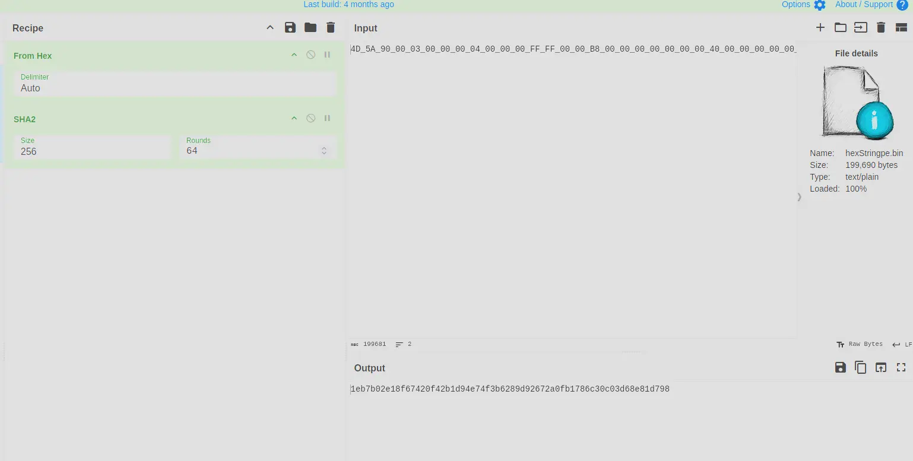

*CyberChef SHA256 output for the extracted payload*

**Answer:** `1eb7b02e18f67420f42b1d94e74f3b6289d92672a0fb1786c30c03d68e81d798`

---

## Q4 — Malware Family via Alibaba

> What is the malware family label based on Alibaba?

**Approach:** Submit the SHA256 of the payload to VirusTotal and check the Alibaba vendor detection label.

For this, we submit the SHA256 sum of the malware executable to VirusTotal.

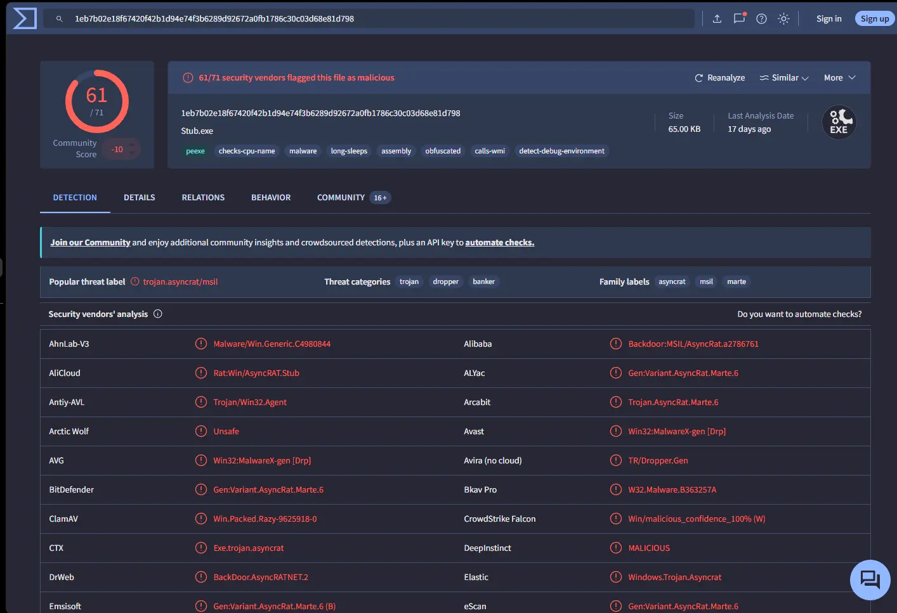

*VirusTotal detection results for the payload*

We can tell from the above output that the malware family is `AsyncRAT`.

**Answer:** `AsyncRAT`

---

## Q5 — Malware Creation Timestamp

> What is the timestamp of the malware's creation?

**Approach:** Run peframe on the extracted payload bytes to read the PE header timestamp.

To determine the timestamp of the malware's creation, we just need to pass the payload bytes to peframe. It will inspect the PE header and extract a timestamp for us.

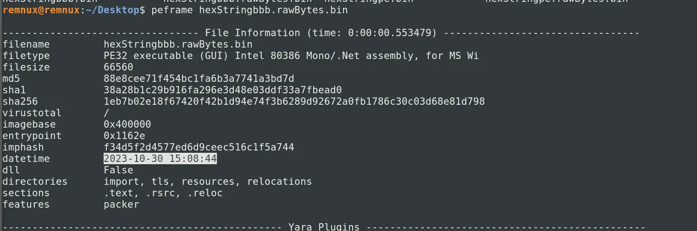

*peframe output showing the PE header compilation timestamp*

**Answer:** `2023-10-30 15:08`

---

## Q6 — LOLBin for Stealthy Execution

> Which LOLBin is leveraged for stealthy process execution in this script? Provide the full path.

**Approach:** Resolve the string obfuscation in the PowerShell script within `mdm.jpg` to reveal the full LOLBin path.

By inspecting the code and resolving the obfuscation tricks, we can find the LOLBin leveraged in the PowerShell script.

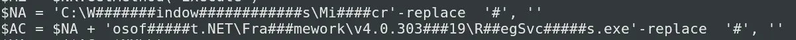

*Snippet of PowerShell script showing the obfuscated LOLBin reference*

Removing the obfuscation — which is just inserting variable-length `#` strings into the plaintext — we get:

`C:\Windows\Microsoft.NET\Framework\v4.0.30319\RegSvcs.exe`

**Answer:** `C:\Windows\Microsoft.NET\Framework\v4.0.30319\RegSvcs.exe`

---

## Q7 — Files Dropped by the Script

> The script is designed to drop several files. List the names of the files dropped by the script.

**Approach:** Inspect the PowerShell script for `WriteAllText` calls to enumerate all dropped file names.

We can check the names of all the files dropped by the script by inspecting the code. We will find the following:

- `[IO.File]::WriteAllText("C:\Users\Public\Conted.ps1", $Content)`
- `[IO.File]::WriteAllText("C:\Users\Public\Conted.bat", $Content)`
- `[IO.File]::WriteAllText("C:\Users\Public\Conted.vbs", $Content)`

We can also grep for `WriteAllText`, which will give us the same result.

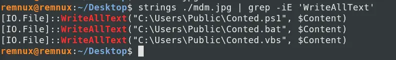

*Grep output showing all WriteAllText calls in the script*

**Answer:** `Conted.ps1, Conted.bat, Conted.vbs`

---

# Completion

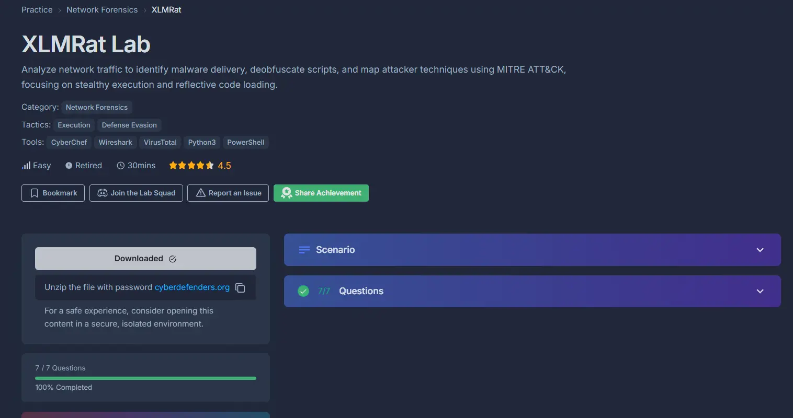

*XLMRat Lab completion badge*

I successfully completed XLMRat Blue Team Lab at @CyberDefenders!
https://cyberdefenders.org/blueteam-ctf-challenges/achievements/francisvil3213/xlmrat/

#CyberDefenders #CyberSecurity #BlueYard #BlueTeam #InfoSec #SOC #SOCAnalyst #DFIR #CCD #CyberDefender
