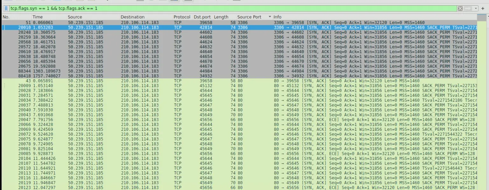
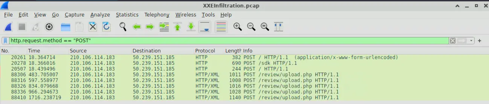
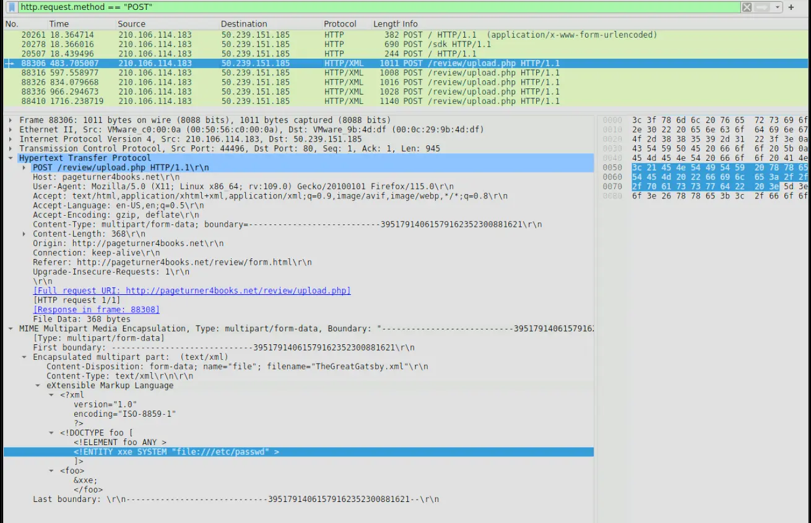
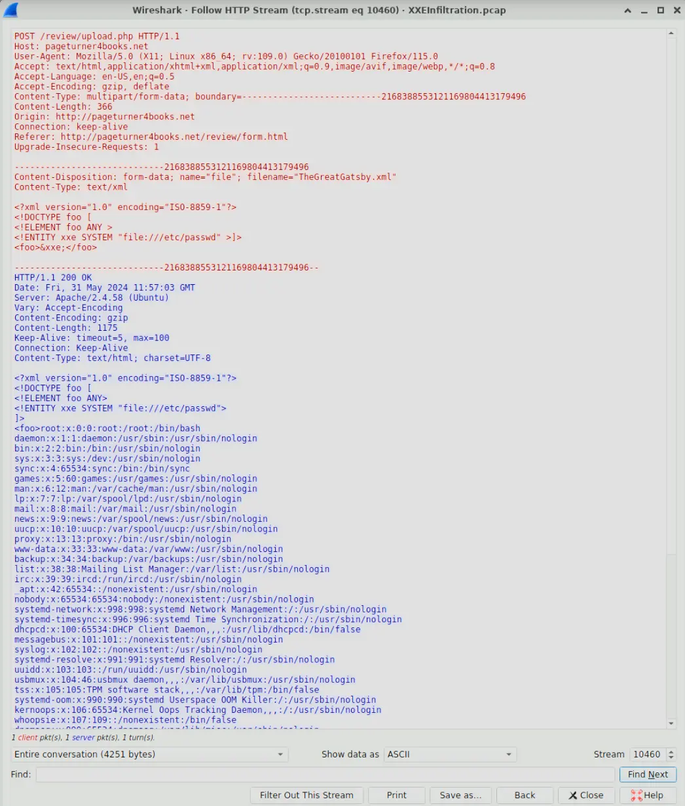
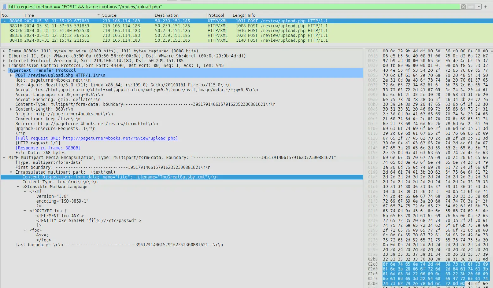
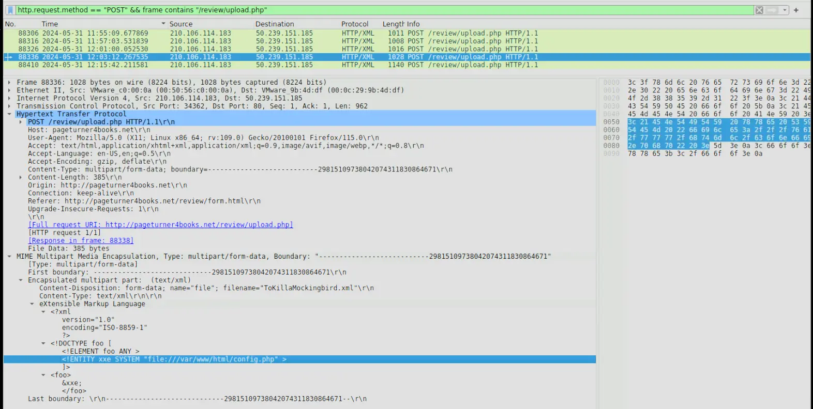
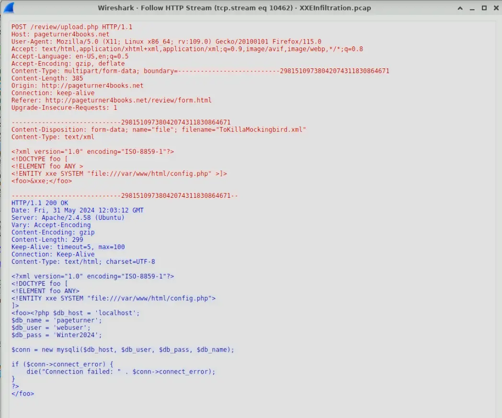
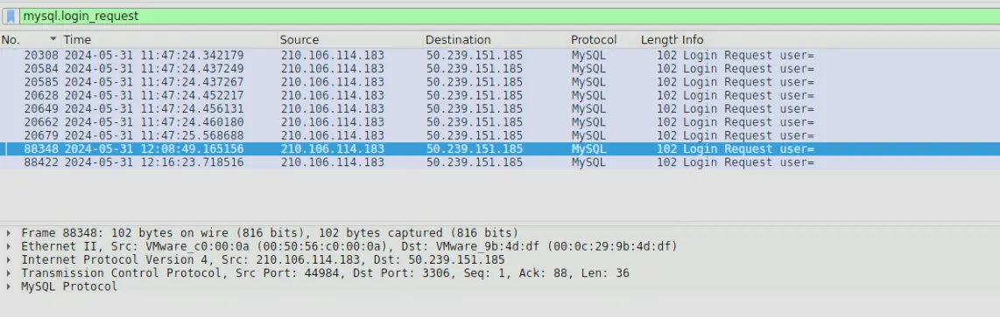
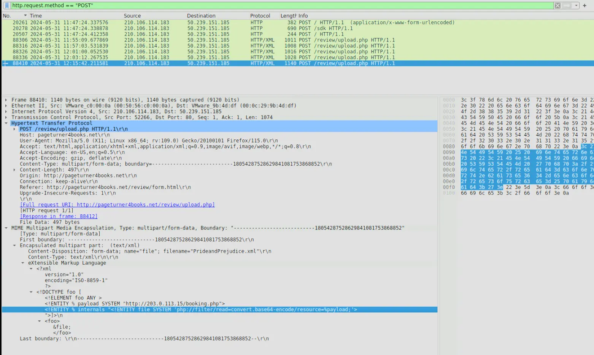
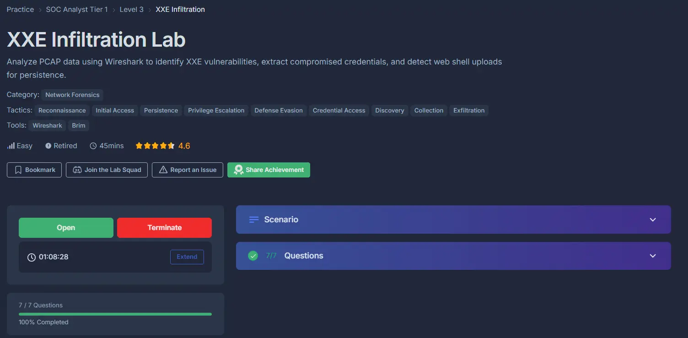

#network-forensics #cyberdefender-easy #wireshark #zui/brim #finished #reviewed
# Scenario

An automated alert has detected unusual XML data being processed by the server, which suggests a potential XXE (XML External Entity) Injection attack. This raises concerns about the integrity of the company's customer data and internal systems, prompting an immediate investigation.

Analyze the provided PCAP file using the network analysis tools available to you. Your goal is to identify how the attacker gained access and what actions they took.

# Questions
## Q1  — Identifying highest-numbered open port
> Identifying the open ports discovered by an attacker helps us understand which services are exposed and potentially vulnerable. Can you identify the highest-numbered port that is open on the victim's web server?

**Approach:** Open ports reply to `SYN` scans with `SYN-ACK`, so filter for those response from the victim and sort by port descending.

The most common type of scan is the `SYN scan`.
Let's look for that first.
The attacker would send `SYN` packets to any port and if the port is open the machine will reply with `SYN-ACK`.
To look for the highest number port that is open on the victim's webserver, we have to just look for the packets originating from the machine with those flags set.
Therefore, we use the filter `tcp.flags.syn == 1 && tcp.flags.ack == 1`.
Then apply `source port`  as column then sort by `source port`.

_Wireshark output with filter_

Also note that the attacker's IP is `210.106.114.183`.

**Answer:** `3306`

---
## Q2 — Finding the URI of the vulnerable PHP Script
>By identifying the vulnerable PHP script, security teams can directly address and mitigate the vulnerability. What's the complete URI of the PHP script vulnerable to XXE Injection?

**Approach:** Look for suspicious POST requests and identify what path they were being made to.

First, we filter for all http requests of method POST.

_HTTP POST Request captured_

If we inspect each one, we will see that the attacker is trying to determine if the vulnerability exists in `/review/upload.php`.

_Request body of suspicious POST request_

In the packet inspected above, we can see that the attacker is trying to read `/etc/passwd` using `XXE`.
Furthermore, if we follow the `HTTP Stream` of packet `88316` we will see that the attacker succeeds in his attack.

*HTTP Stream showing the successful XXE attack*

**Answer:** `/review/upload.php`

---
## Q3 — Finding name of first malicious XML file
> To construct the attack timeline and determine the initial point of compromise. What's the name of the first malicious XML file uploaded by the attacker?

**Approach:** Identify suspicious POST requests, sort by time and inspect body of earliest request made to vulnerable URI

We already found this in the last question but to be explicit we can make the following query and analyze the output.

`http.request.method == "POST" && frame contains "/review/upload.php"`

*Filtered output showing request body of earliest request*

From the request body we can determine the first file uploaded was `TheGreatGatsby.xml`

**Answer:** `TheGreatGatsby.xml`

---

## Q4 — Finding the name of the compromised configuration file
>Understanding which sensitive files were accessed helps evaluate the breach's potential impact. What's the name of the web app configuration file the attacker read?

**Approach:** We have established in the previous questions that XXE is being used to read critical files. We continue to inspect the suspicious POST request and determine what config file is compromised.

To answer this question, we just have to identify a POST request with a payload that is targeting a configuration file.

*POST request made by attacker to access `config.php`*

We can see from the above output that the attacker accessed `config.php`.
Take note that the packet number is `88336`.

**Answer:** `config.php`

---

## Q5 — Identifying compromised password
>To assess the scope of the breach, what is the password for the compromised database user?

**Approach:** We already identified the POST request made to read `config.php`. We should follow the HTTP stream and see if the password is stored on the configuration file in plaintext.

Having identified the post request to read `config.php`.
Let's follow the http stream and see what is returned to the attacker.

*HTTP Stream of POST request*

In the HTTP stream, we can see the entire contents of `config.php` was returned to the attacker.
In the contents of this file was the password.

**Answer:** `Winter2024`

---

## Q6 — Determining timestamp of first login
>Following the database user compromise. What is the timestamp of the attacker's initial connection to the MySQL server using the compromised credentials after the exposure?

**Approach:** The answers from previous questions allow us to construct a timeline that will allow us to determine which `MySql` login request corresponds with the attacker's first login.

We know from the previous questions that the POST request packet that resulted in the exposure of credentials was `88336`.
Now we just have to filter the `pcap` for `mysql.login_request` and see which one is the closest to when the credentials were compromised.

*Login request made after exposure*

We can tell that the above packet corresponds to the first login using exposed credentials as the packet number is closest to the packet in which the exposure happened.

The intuition is that, the attacker exposed some credentials as well as the service on which these credentials were used then immediately went to attempt a login with them. Now, we just have to read the timestamp associated with the packet.

**Answer:** `2024-05-31 12:08`

---

## Q7 — Finding the persistence mechanism
>To eliminate the threat and prevent further unauthorized access, can you identify the name of the web shell that the attacker uploaded for remote code execution and persistence?

**Approach:** Inspect the POST request packets made to the vulnerable URI and inspect their body.

*Request body of last POST request captured*

We can see from the above output that the last post request captured defines an external entity `&payload` that points to a remote file at `http://203.0.113.15/booking.php`. What ever is returned there is then used in another entity `internals`.
The `internals` entity reads a resource defined by the `&payload` then base64 encodes it. The base64 encoding is probably used to by pass basic content filters.
`&payload` is likely a file path and what the attacker is doing is establishing a method to exfiltrate data.

**Answer:** `booking.php`

# Completion

