#reverse-engineering #strings #pestudio #base64 #js-obfuscation #js-fuck #brainfuck #file-header #zip #ida #stack-strings #encryption #bit-operations #xor #python #cyberdefender-medium #finished #reviewed

# Scenario

RE101 challenge is a binary analysis exercise — a task security blue team analysts do to understand how a specific malware works and extract possible intel.

# Questions

## Q1 — MALWARE000: base64 "encryption"

> File: MALWARE000 - I've used this new encryption I heard about online for my warez; I bet you can't extract the flag

**Approach:** Run the file through PE Studio, then review the strings for anything encrypted.

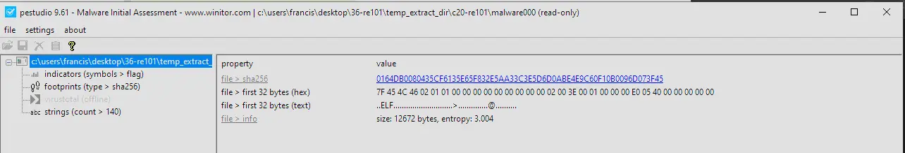

*PE Studio analysis of MALWARE000.*

Looking over the strings for anything that looks encrypted:

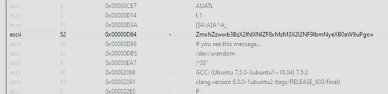

*Strings view.*

There is text that looks base64 encoded. Decoding it:

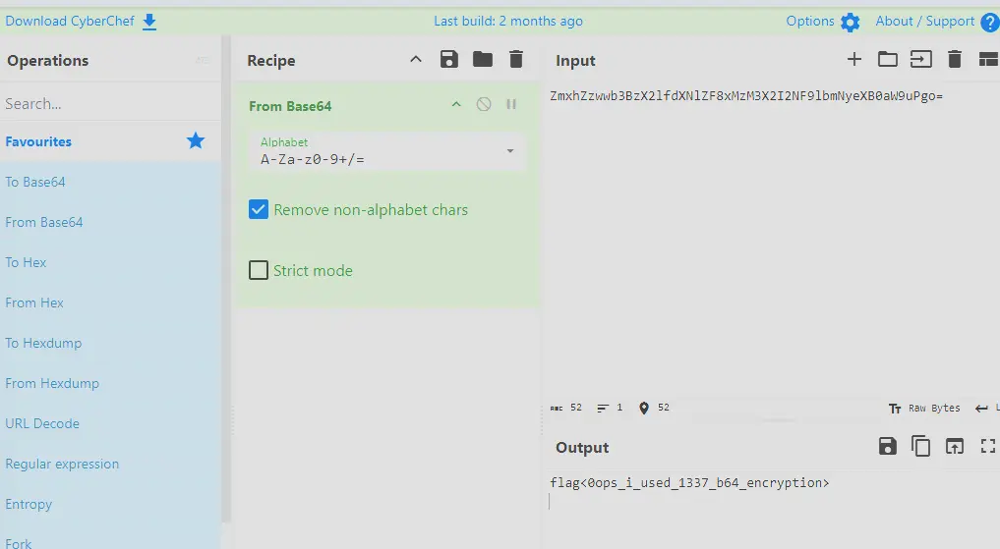

*Decoding the base64 string.*

**Answer:** `flag<0ops_i_used_1337_b64_encryption>`

## Q2 — Just some JS: JSFuck

> File: Just some JS - Check out what I can do!

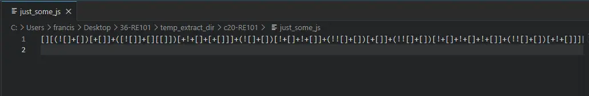

*The JS file.*

Opening the file in VS Code, the code is obfuscated using JSFuck. JSFuck uses only six characters to encode any valid JavaScript program.

Using an online tool to decode it:

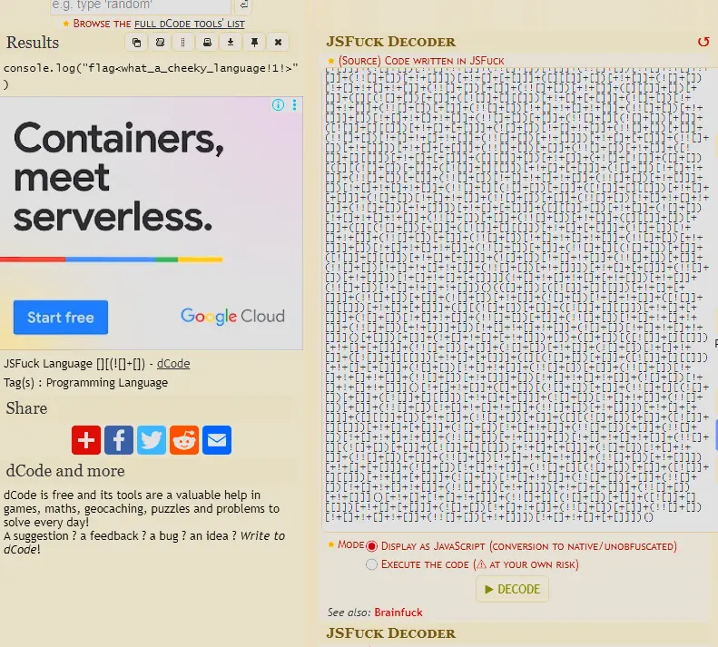

*Decoding the JSFuck.*

**Answer:** `flag<what_a_cheeky_language!1!>`

## Q3 — This is not JS: brainfuck

> This is not JS - I'm tired of Javascript. Luckily, I found the grand-daddy of that lame last language!

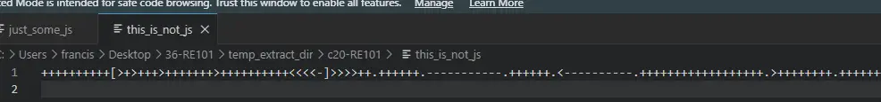

*The file contents.*

A Google search shows this language is called "brainfuck". Using the same website to interpret the code:

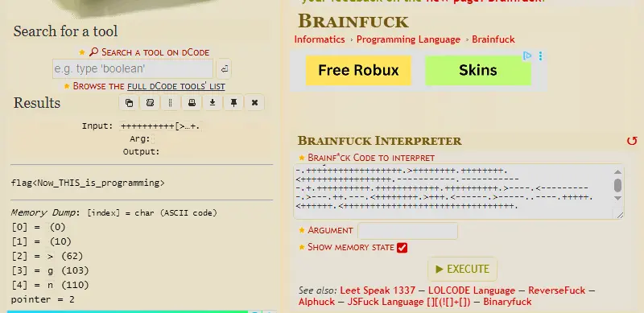

*Interpreting the brainfuck.*

**Answer:** `flag<Now_THIS_is_programming>`

## Q4 — Unzip Me: corrupted ZIP header

> File: Unzip Me - I zipped flag.txt and encrypted it with the password "password", but I think the header got messed up... You can have the flag if you fix the file

**Approach:** Look up the ZIP file header format, then fix the broken field in HxD.

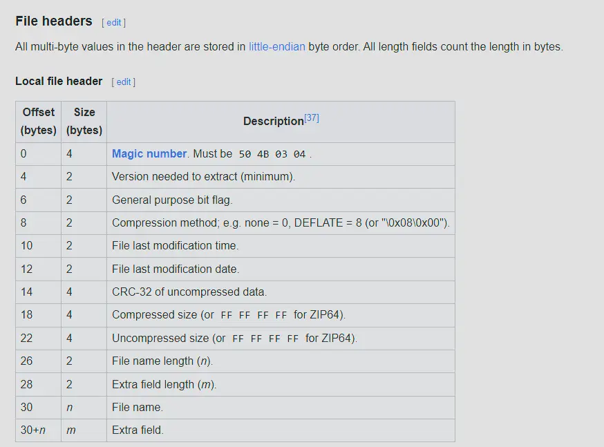

*ZIP file header format.*

The file header of the broken ZIP:

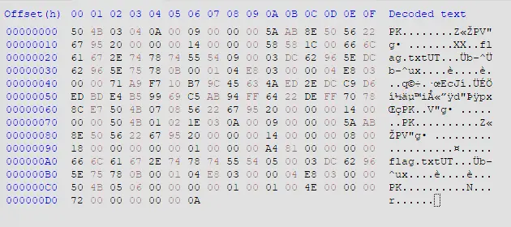

*Header of the broken ZIP.*

At 0x1A, that field should be the file name length.

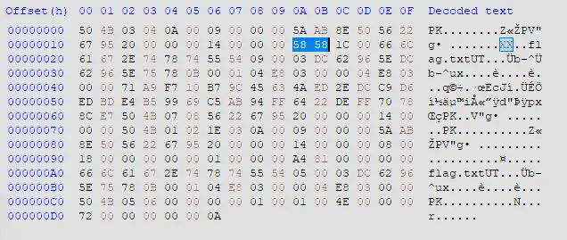

*The file name length field at 0x1A.*

However, the current value is 0x5858, which is an absurdly large number in decimal. The actual value should be 8 since `flag.txt` is 8 bytes long. Fix this in HxD and save it.

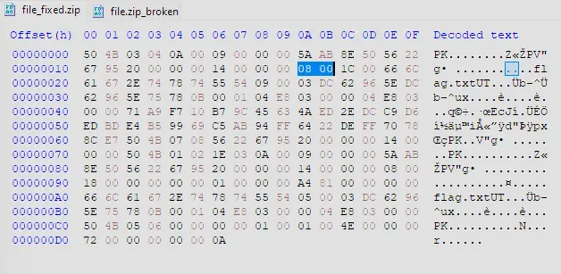

*Correcting the field in HxD.*

Unzip the file and read the txt file inside, which shows the flag.

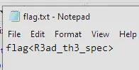

*The recovered flag.*

**Answer:** the flag shown above

## Q5 — MALWARE101: IDA stack strings

> File: MALWARE101 - Apparently, my encryption isn't so secure. I've got a new way of hiding my flags!

**Approach:** Identify the file type, open it in IDA, and reconstruct the stack string in main.

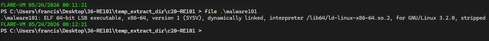

*File type check.*

It's a Linux executable. Opening it in IDA:

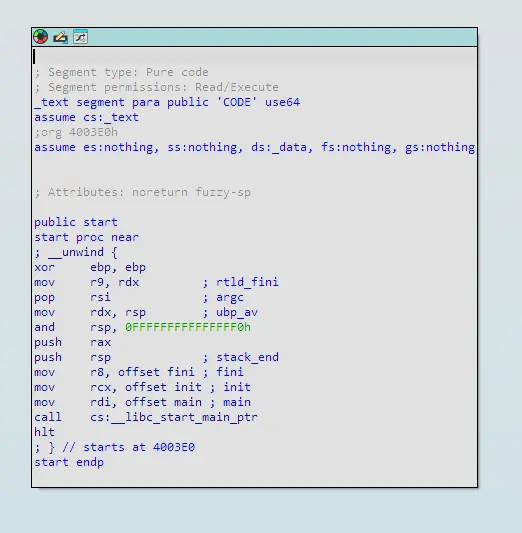

*MALWARE101 in IDA.*

Clicking into main:

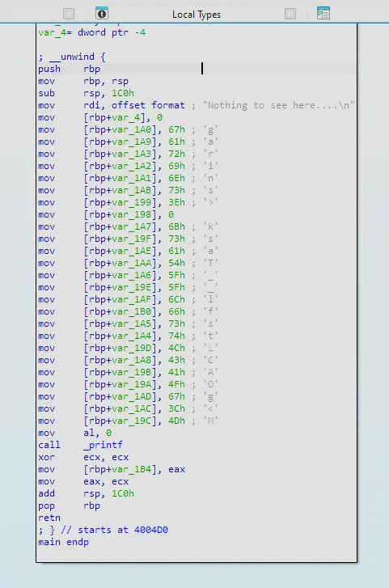

*The main function.*

There is decoy text saying nothing to see here, but under it the code constructs a string by pushing onto the stack. Notice it is not in order — we need to view the stack to see the order in which the characters fall. Press Ctrl+K in IDA to view the stack.

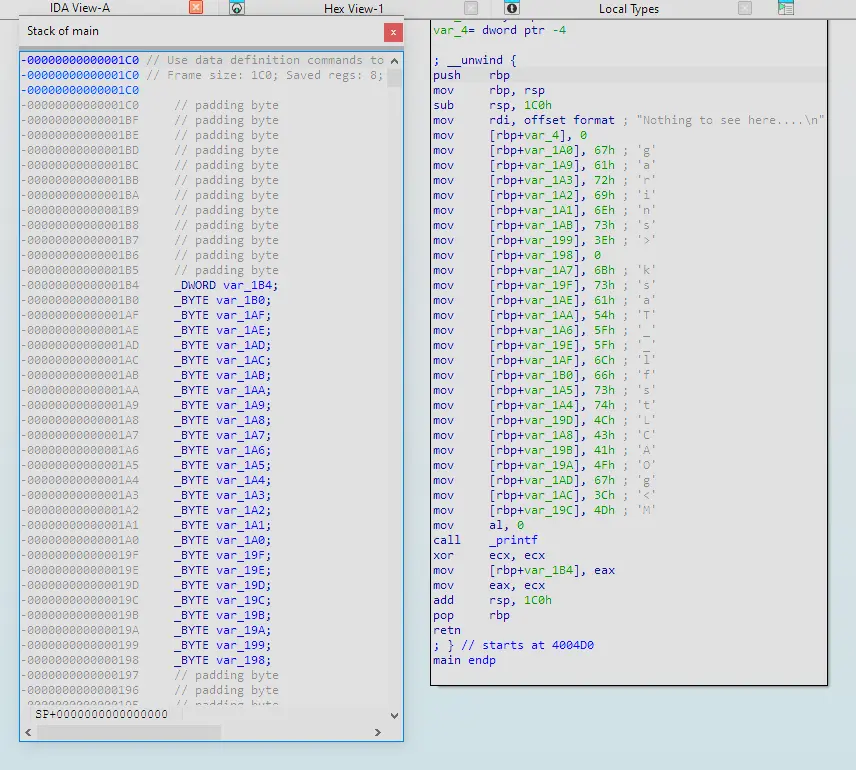

*Stack view in IDA.*

Putting them side by side, we can manually reconstruct the string. Ordering them gives the flag.

**Answer:** `flag<sTaCk_strings_LMAO>0`

## Q6 — MALWARE201: custom XOR cipher

> File: MALWARE201 - Ugh... I guess I'll just roll my own encryption. I'm not too good at math, but it looks good to me!

**Approach:** Identify the file type, open it in IDA, analyse the encryption subroutine, extract the encrypted flag, and reverse the algorithm in Python.

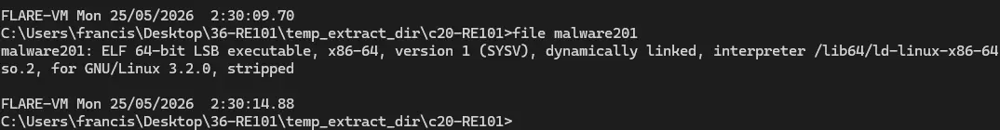

*File type check.*

It is a Linux executable. Open it in IDA and click into main.

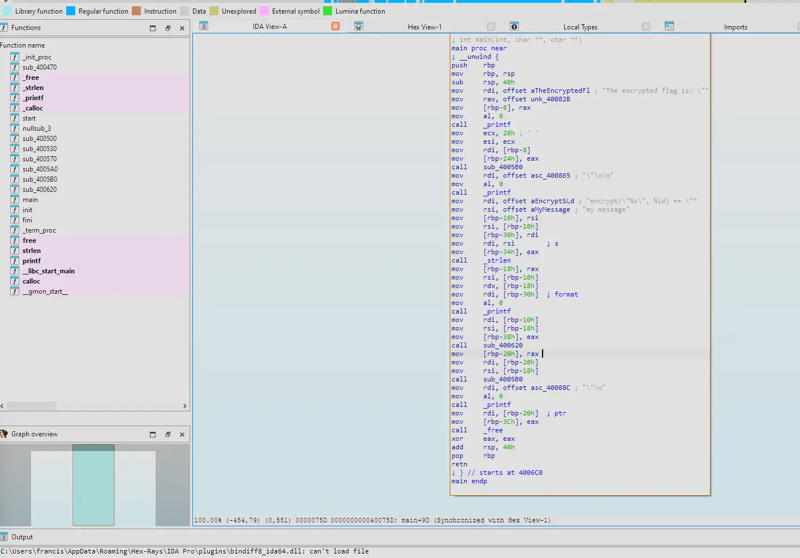

*The main function.*

The decompiled view:

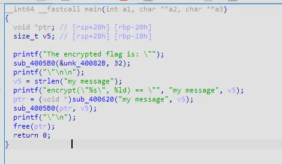

*Decompiled main.*

`sub_4005B0` looks like a subroutine to print out ciphertext. Clicking into it:

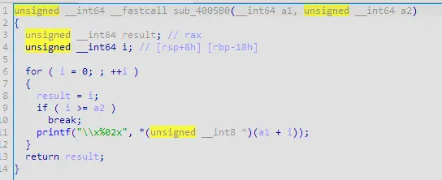

*sub_4005B0.*

It aims to print each byte of the ciphertext represented as a 2-digit hex value (evident by the `x%02x`). `sub_400620` on the other hand looks like the subroutine for encrypting the plaintext. This is because it takes the plaintext as an argument as well as the length of the plaintext. In addition, the print statement before is stating that the program will encrypt a plaintext. Clicking into this subroutine:

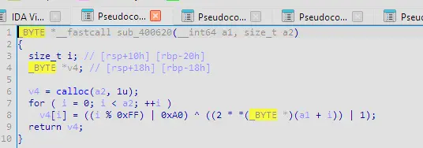

*sub_400620 — the encryption routine.*

This looks like an encryption algorithm where:

- A buffer of the same size as the plaintext length is created
- It iterates through the buffer using i to track the index
- At each position i of the buffer it is populated with an encrypted byte
- The encryption starts by determining the encryption key by clamping i to be in range 0-254 decimal then doing a bitwise OR with hex 0xA0 (decimal 160). This results in an XOR key derived from index i which is 1 byte long and the 7th and 5th bit is always 1.
- Each byte in the plaintext is first shifted left by 1 bit (multiplied by 2, overflow is truncated) and then bitwise OR'd with 1
- This makes it so the byte is always odd as when ASCII text is doubled the last bit is always 0; it then does a bitwise OR with 1 which makes the last bit always 1
- This byte is then XOR'd with the derived key
- After iterating through the entire plaintext length, it returns the pointer to the buffer which now holds the ciphertext

Rename these so it's more readable.

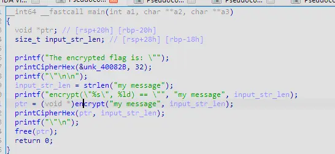

*Renamed subroutines.*

We can also extract the encrypted flag from the binary by clicking into `&unk_40082B`. We also know the encrypted flag is 32 bytes long because the length of the encrypted flag (0x20) was also passed to the subroutine to print the cipher hex.

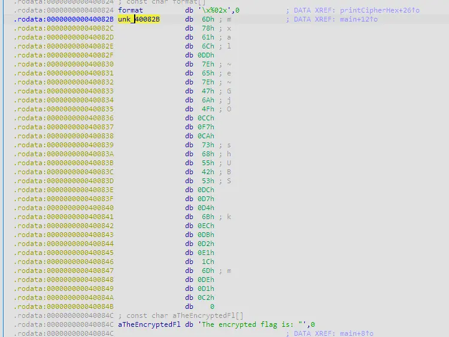

*The encrypted flag in the binary.*

Export this encrypted flag as a hex string.

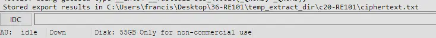

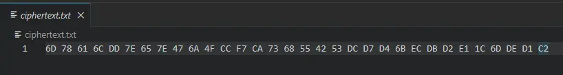

*Exporting the encrypted flag as hex.*

To reverse the encryption we have to do the following:

- Derive the key
- XOR the encrypted byte with the key
- Subtract 1
- Shift right by 1 bit

Write a Python script for this.

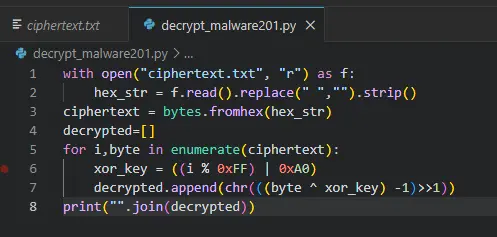

*The Python decryption script.*

This gives us the flag.

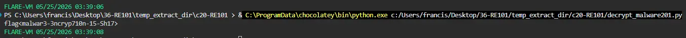

*The recovered flag.*

**Answer:** `flag<malwar3-3ncryp710n-15-Sh17>`

# Completion

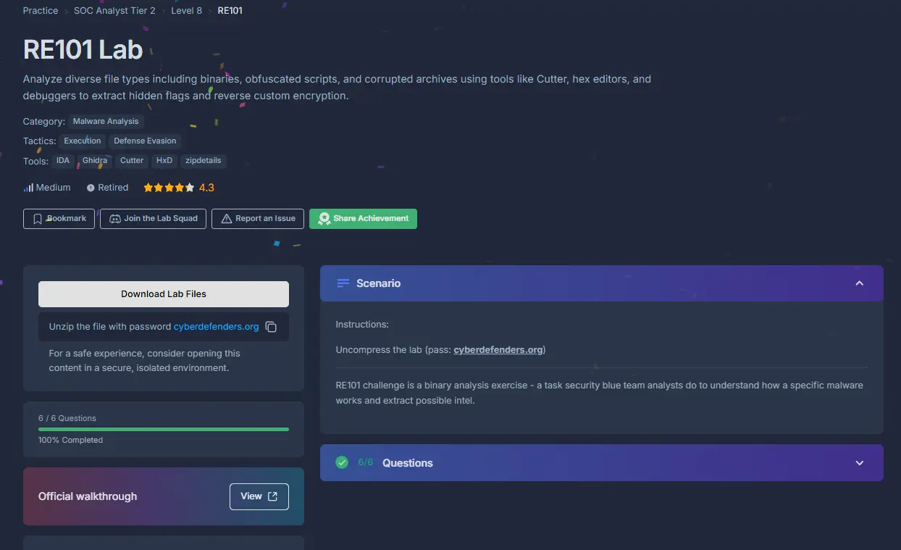