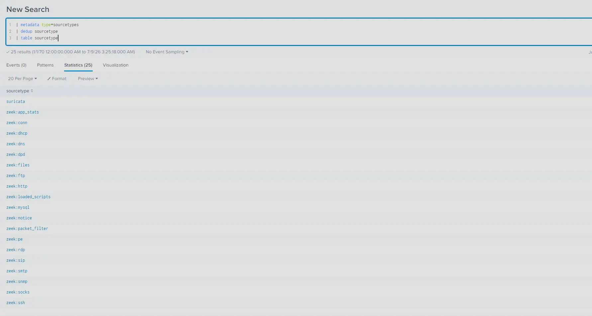
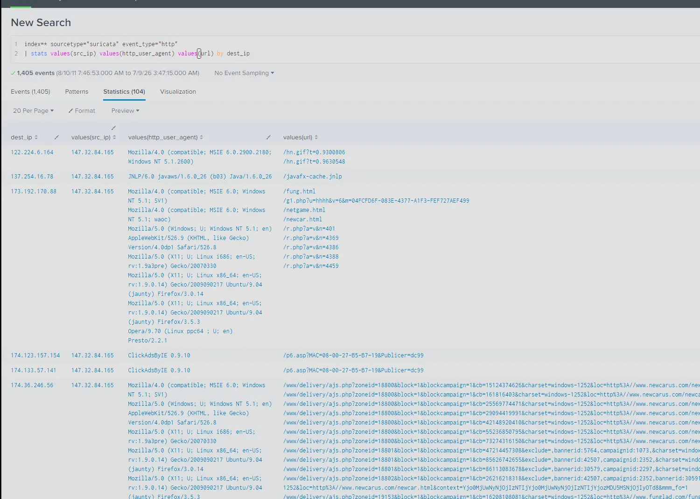
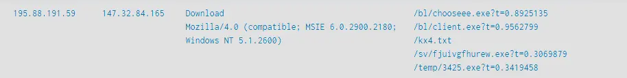
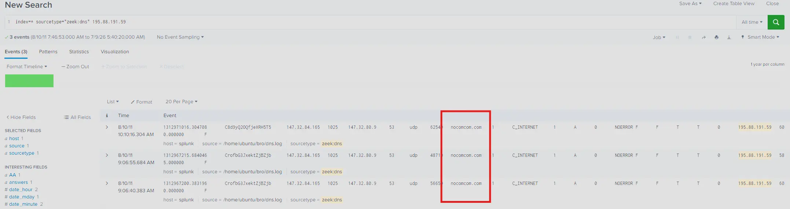
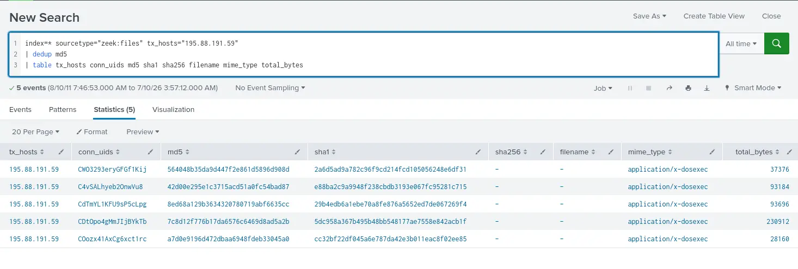
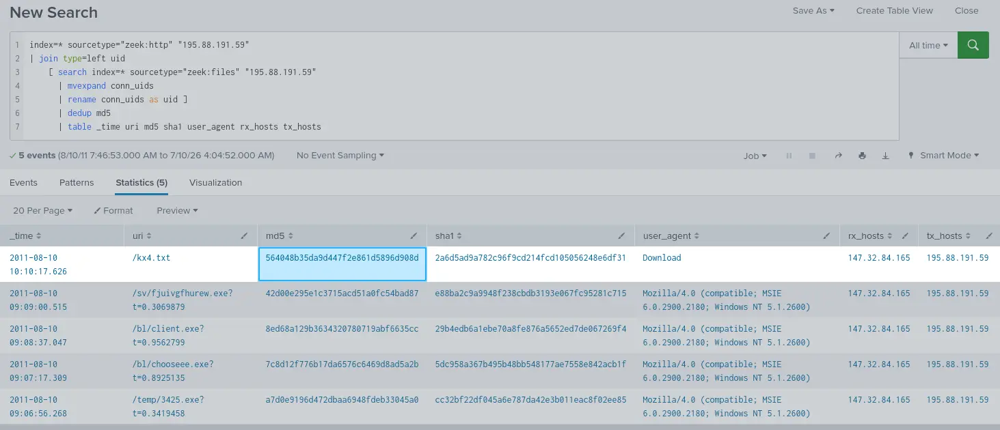
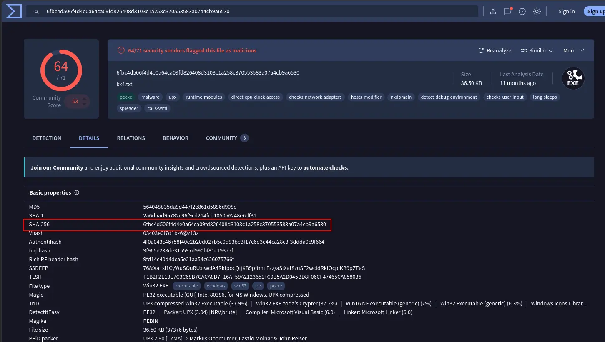
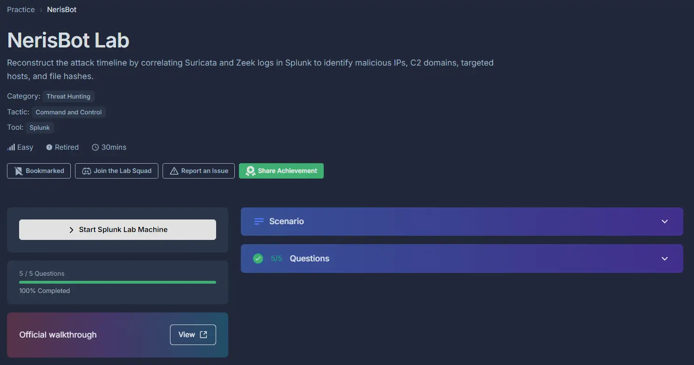

#cyberdefender-easy #threat-hunting #splunk #finished #reviewed
# Scenario
Unusual network activity has been detected within a university environment, indicating potential malicious intent. These anomalies, observed six hours ago, suggest the presence of command and control (C2) communications and other harmful behaviors within the network.

Your team has been tasked with analyzing recent network traffic logs to investigate the scope and impact of these activities. The investigation aims to identify command and control servers and uncover malicious interactions.
# Questions
## Q1 — IP Address of initial access
>During the investigation of network traffic, unusual patterns of activity were observed in Suricata logs, suggesting potential unauthorized access. One external IP address initiated access attempts and was later seen downloading a suspicious executable file. This activity strongly indicates the origin of the attack. What is the IP address from which the initial unauthorized access originated?

Let's get a high level overview of the logs to orient ourselves.
We first check what available sources there are using the following command

```
| metadata type=sourcetypes 
| dedup sourcetype 
| table sourcetype
```

Which gets us,



*Available source types*

This dataset contains entirely `zeek` and `suricata` logs.

A few things that can help us get started is through the information provided in the question which tells us that

- Unusual patterns of activity were observed in `suricata` logs
- One external IP initiated access attempts
- One external IP downloaded a suspicious executable file

The downloading of a suspicious file means we should start by looking at `http` traffic.
Let's create a query on the `suricata` logs filtering for just `http` logs that aggregates them by `dest_ip` and retrieve values of `src_ip`, `http_user_agent` and `url`.

This allows us to see the server IPs being connected to, which IP is connecting to them, the user agent being used to connect and the `url`s that were accessed.

```
index=* sourcetype="suricata" event_type="http"
| stats values(src_ip) values(http_user_agent) values(url) values(hostname) values(http_refer) by dest_ip
```

Which gets us,



*Snippet of search result*

Scrolling down, we will see a server that was connected to using with `http_user_agent` value of `Download`.
This is not a standard `http_user_agent` and if we look at the `url`s that were accessed. We will see that every `url` is only corresponding to executable files. There was no landing page or any other resources, the endpoint connecting to this server purely just downloaded some files.



*Suspicious IP*

Furthermore, the naming of the both the endpoints and the resources seem purposefully obfuscated or meaningless which is in stark contrast to the other entries found in our search.

In conclusion, this server stands out with the rest of the traffic because not only does it fit the description of the anomaly described in the provided questions, it also used a non-standard user agent and only served executable files to connecting endpoints.

**Answer:** `195.88.191.59`

---
## Q2 — Domain Name of attack server
>Investigating the attacker's domain helps identify the infrastructure used for the attack, assess its connections to other threats, and take measures to mitigate future attacks. What is the domain name of the attacker server?

Having identified the suspicious IP, we can query the `dns` logs to see what domain name was resolved.
However, the `suricata` `dns` logs break up the events such that the IP being queried is not included in the answer for the query.
We can query `zeek:dns` instead which gives us the full picture in a single log message.

```
index=* sourcetype="zeek:dns" 195.88.191.59
```



*DNS query results*

Which tells us that the resolved domain name is `nocomcom.com`

**Answer:** `nocomcom.com`

---
## Q3 — IP Address of targeted system
>Knowing the IP address of the targeted system helps focus remediation efforts and assess the extent of the compromise. What is the IP address of the system that was targeted in this breach?

When identifying the suspicious activity, we found both the suspicious server as well as the endpoints connecting to it by the query,

```
index=* sourcetype="suricata" event_type="http"
| stats values(src_ip) values(http_user_agent) values(url) values(hostname) values(http_refer) by dest_ip
```

This gives us the IP of the targeted system under `values(src_ip)` which is `147.32.84.165`.


*Query result*

**Answer:** `147.32.84.165`

---
## Q4 — Number of files transferred
>Identify all the unique files downloaded to the compromised host. How many of these files could potentially be malicious?

To identify all unique files downloaded we can just query `zeek:files` and filter where `tx_hosts` is `195.88.191.59` and `md5` is unique.

```
index=* sourcetype="zeek:files" tx_hosts="195.88.191.59"
| dedup md5 
| table tx_hosts conn_uids md5 sha1 sha256 filename mime_type total_bytes
```

Which gives us,



*unique files transferred*

This shows us unique 5 unique results which is our answer.

**Answer:** `5`

---
## Q5 — SHA256 hash of malicious file
>What is the SHA256 hash of the malicious file disguised as a `.txt` file?

Notice how in the previous question our query gave us no returned values in `sha256` and `filename`?
To find the `sha256` hash of a specific file we first need to match the `md5` hash values to their corresponding `uri`.
This allows us to determine which of the `md5` hash values actually belong to the `.txt` file.

We can do that by joining `zeek:http` and `zeek:files` on `uid`.
However, `zeek:files` does not have a `uid` field and instead has a `conn_uids` field.
This is because the same file can show up in multiple connections.
Therefore, we need to explode and rename this field first into their own rows before performing the join otherwise it will fail.
This gives us the query,

```
index=* sourcetype="zeek:http" "195.88.191.59"
| join type=left uid
    [ search index=* sourcetype="zeek:files" "195.88.191.59"
      | mvexpand conn_uids
      | rename conn_uids as uid ]
      | dedup md5
      | table _time uri md5 sha1 user_agent rx_hosts tx_hosts 
```

Which tells us that the `md5` hash value of the `.txt` file is `564048b35da9d447f2e861d5896d908d`.



*Search results*

Using `OSINT` platforms like `VirusTotal` we can find the `sha256` hash of this file.



*`VirusTotal` Reports*

Therefore our answer is `6fbc4d506f4d4e0a64ca09fd826408d3103c1a258c370553583a07a4cb9a6530`.

**Answer:** `6fbc4d506f4d4e0a64ca09fd826408d3103c1a258c370553583a07a4cb9a6530`

# Completion


I successfully completed NerisBot Blue Team Lab at @CyberDefenders!
https://cyberdefenders.org/blueteam-ctf-challenges/achievements/francisvil3213/nerisbot/

#CyberDefenders #CyberSecurity #BlueYard #BlueTeam #InfoSec #SOC #SOCAnalyst #DFIR #CCD #CyberDefender
