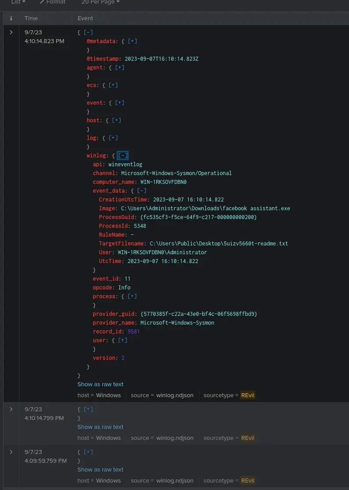
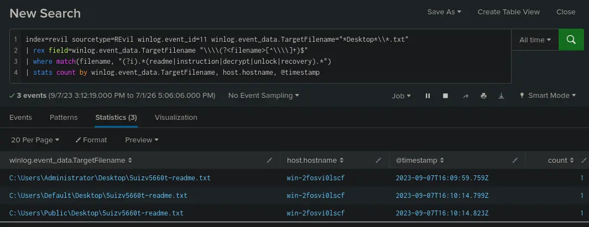
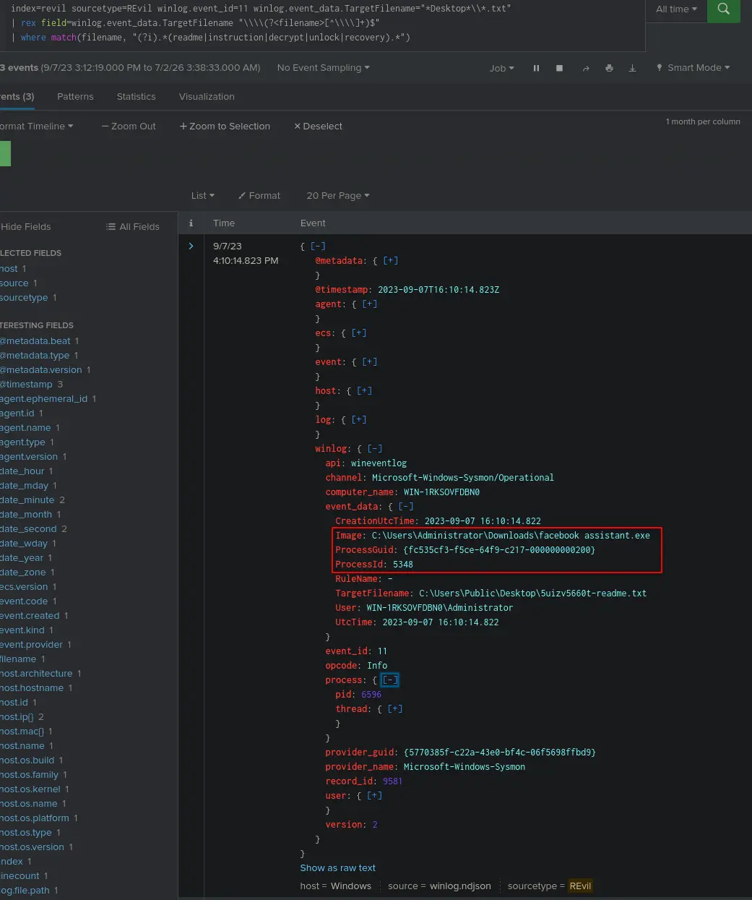
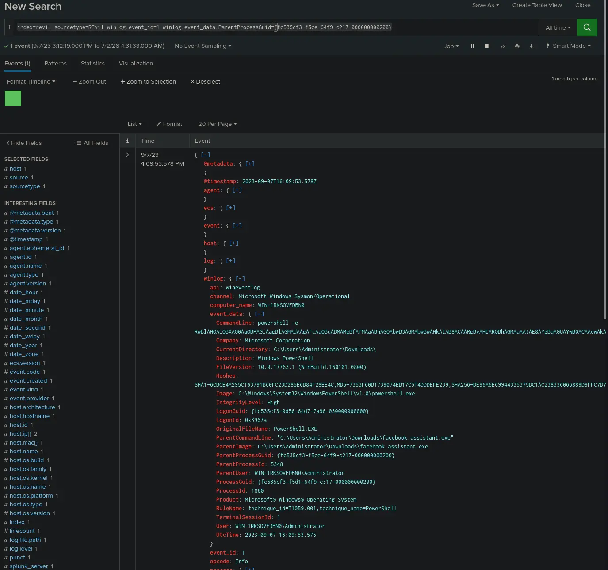
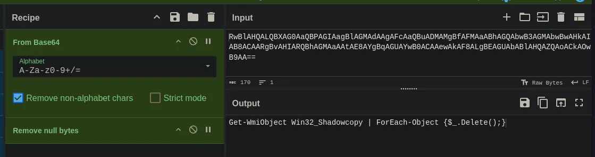
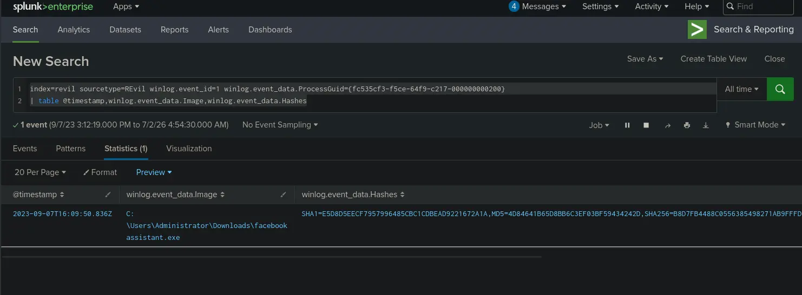
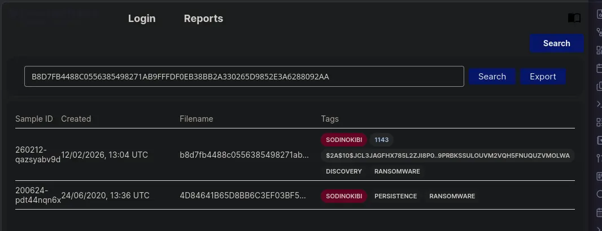
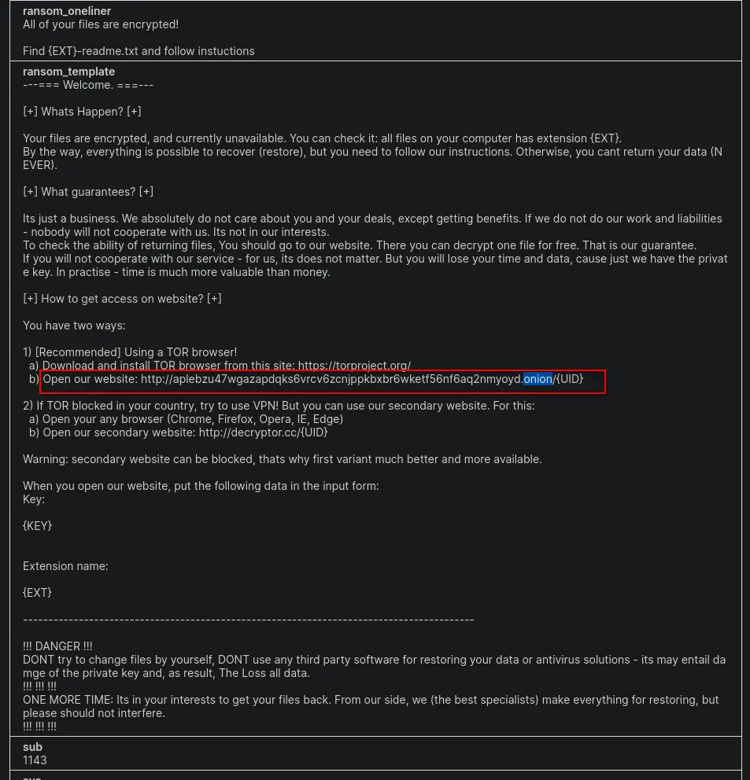
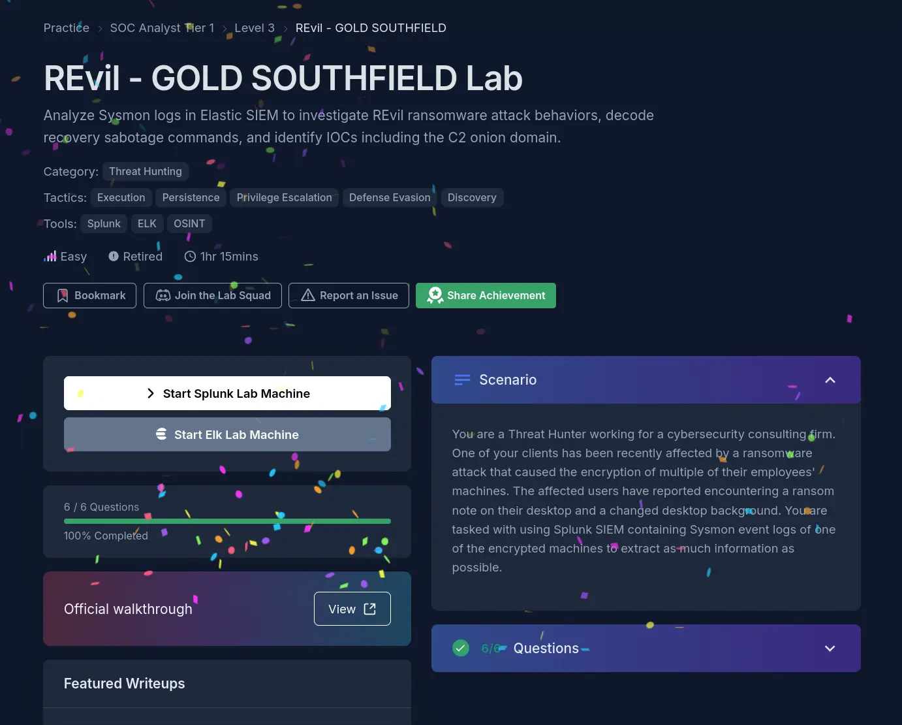

#cyberdefender-easy #threat-hunting #splunk #finished #reviewed
# Scenario
You are a Threat Hunter working for a cybersecurity consulting firm. One of your clients has been recently affected by a ransomware attack that caused the encryption of multiple of their employees' machines. The affected users have reported encountering a ransom note on their desktop and a changed desktop background. You are tasked with using Splunk SIEM containing Sysmon event logs of one of the encrypted machines to extract as much information as possible.

# Investigation
Before we start querying, let's check the facts and what possible leads we may have.

| #   | Lead / Observation                          | Reasoning                                                                                                    | Investigative Action                                                                                                                                          |
| --- | ------------------------------------------- | ------------------------------------------------------------------------------------------------------------ | ------------------------------------------------------------------------------------------------------------------------------------------------------------- |
| 1   | Sysmon is a Windows-only service            | Since we were given Sysmon logs, the affected machines are confirmed to be Windows endpoints                 | Tailor all queries to Windows-specific artifacts (registry paths, .exe processes, Desktop folder structure, etc.)                                             |
| 2   | Users reported a ransom note on the Desktop | The note is a file, and file writes are logged by Sysmon EventCode 11 (FileCreate)                           | Query EventCode=11 with TargetFilename containing Desktop to find the note's exact filename and the process (Image) that dropped it                           |
| 3   | Users reported a changed desktop background | On Windows, wallpaper changes require modifying registry keys, logged by Sysmon EventCode 13 (RegistryEvent) | Query EventCode=13 with TargetObject containing Control Panel\Desktop\Wallpaper to find the process that made the change and the new wallpaper path (Details) |

Let's start answering the questions.
# Questions
## Q1 — filename of ransom note
> To begin your investigation, can you identify the filename of the note that the ransomware left behind?

We know that event id 11 is `FileCreate` for sysmon and the ransom note was found on the Desktop.
Using this we can create the following query which performs the following
- Looks for all logs with event id 11 and `TargetFilename` matching the pattern `*Desktop*\\*.txt`
- Isolates the filename using `rex`
- Performs a `match` retrieving `txt` files that contain any of the common terms included in a ransom note filename

```
index=revil sourcetype=REvil winlog.event_id=11 winlog.event_data.TargetFilename="*Desktop*\\*.txt"
| rex field=winlog.event_data.TargetFilename "\\\\(?<filename>[^\\\\]+)$"
| where match(filename, "(?i).*(readme|instruction|decrypt|unlock|recovery).*")
```

Which gives us the following results



*Results of query*

3 logs are shown as a result and if we look at the `TargetFilename` we find that the `txt` is prefixed by a random short UID.
The file location is also on `Desktop` and if we aggregate by count on `TargetFilename`,`hostname` and `@timestamp`.
We will see that the same file was actually dropped into every `Desktop` directory for every user at around the same time on the same endpoint.



*Aggregate result*

This fits the description of what was described in our scenario and has characteristics of a typical ransom note.
Therefore, the answer is `5uizv5660t-readme.txt`

**Answer:** `5uizv5660t-readme.txt`

---
## Q2 — Process ID
> After identifying the ransom note, the next step is to pinpoint the source. What's the process ID of the ransomware that's likely involved

We already found the event where the ransom note is dropped.
We can check what process did by just looking under `event_data`.
Let's reuse our query from the previous question

```
index=revil sourcetype=REvil winlog.event_id=11 winlog.event_data.TargetFilename="*Desktop*\\*.txt"
| rex field=winlog.event_data.TargetFilename "\\\\(?<filename>[^\\\\]+)$"
| where match(filename, "(?i).*(readme|instruction|decrypt|unlock|recovery).*")
```

Which gives us



*Finding `ProcessID`*

Therefore, our answer is `5348`.

**Answer:** `5348`

---
## Q3 — Ransomware's executable file
> Having determined the ransomware's process ID, the next logical step is to locate its origin. Where can we find the ransomware's executable file?

The executable file is seen under the `Image` in the previous question.
Therefore, our answer is `C:\Users\Administrator\Downloads\facebook assistant.exe`

**Answer:** `C:\Users\Administrator\Downloads\facebook assistant.exe`

---
## Q4 — Command used
> Now that you've pinpointed the ransomware's executable location, let's dig deeper. It's a common tactic for ransomware to disrupt system recovery methods. Can you identify the command that was used for this purpose?

To identify this we need to know what event id to look for.
It is common for malware to spawn `powershell.exe` or `cmd.exe` processes during their execution for various objectives.
For ransomware specifically, it is common to utilise living off the land techniques to disable defenses and hinder recovery.
We can expect to find the malware executable spawning children processes that reflect this.

Therefore, we should construct our query such that 
- We are looking for event id 1 which is the event for the creation of a process
- `ParentProcessGUID` as `{fc535cf3-f5ce-64f9-c217-000000000200}`, which is the `ProccessGUID` of the identified malware executable

> [!NOTE]
> ProcessId is reused by Windows, so ProcessGuid/ParentProcessGuid should be used instead for reliable correlation in larger datasets.

This gives us the query
```
index=revil sourcetype=REvil winlog.event_id=1 winlog.event_data.ParentProcessGuid={fc535cf3-f5ce-64f9-c217-000000000200}
```

This returns a single log in our dataset which is the following,



*Malicious child process*

Looks like the malware spawned a `powershell.exe` process and invoked it with the following `CommandLine`.

```
powershell -e RwBlAHQALQBXAG0AaQBPAGIAagBlAGMAdAAgAFcAaQBuADMAMgBfAFMAaABhAGQAbwB3AGMAbwBwAHkAIAB8ACAARgBvAHIARQBhAGMAaAAtAE8AYgBqAGUAYwB0ACAAewAkAF8ALgBEAGUAbABlAHQAZQAoACkAOwB9AA==  
```

`powershell` was invoked with the `-e` flag which tells it to take in a `Base64-encoded` string as a command to execute.
If we decode the string we will get the following,



*Decoding base64 string*

This command deletes every shadow copy snapshot found on the system.
A shadow copy is a point-in-time snapshot of a volume's data, and by deleting all of them, the ransomware ensures the victim has no built-in means of recovering their data. Thereby, leaving payment of the ransom as the only apparent option.

**Answer:** `Get-WmiObject Win32_Shadowcopy | ForEach-Object {$_.Delete();}`

---
## Q5 — SHA256 hash of executable
> As we trace the ransomware's steps, a deeper verification is needed. Can you provide the sha256 hash of the ransomware's executable to cross-check with known malicious signatures?

To retrieve the `SHA256` hash of the executable we just need to track down the process creation log for the identified malware.
We already have the malware's `ProcessGuid` so we can just use the query,

```
index=revil sourcetype=REvil winlog.event_id=1 winlog.event_data.ProcessGuid={fc535cf3-f5ce-64f9-c217-000000000200} 
| table @timestamp,winlog.event_data.Image,winlog.event_data.Hashes
```

Which gets us,



*Returned table*

Then under `winlog.event_data.Hashes` we find 

```
SHA1=E5D8D5EECF7957996485CBC1CDBEAD9221672A1A,
MD5=4D84641B65D8BB6C3EF03BF59434242D,
SHA256=B8D7FB4488C0556385498271AB9FFFDF0EB38BB2A330265D9852E3A6288092AA,
IMPHASH=C686E5B9F7A178EB79F1CF16460B6A18
```

Therefore, our answer is `B8D7FB4488C0556385498271AB9FFFDF0EB38BB2A330265D9852E3A6288092AA`

**Answer:** `B8D7FB4488C0556385498271AB9FFFDF0EB38BB2A330265D9852E3A6288092AA`

---
## Q6 — Onion domain
> One crucial piece remains: identifying the attacker's communication channel. Can you leverage threat intelligence and known Indicators of Compromise (IoCs) to pinpoint the ransomware author's onion domain?

Given the hash of the malware executable, we can try to find reports of this malware through `tria.ge` and `any.run`.
Let's try searching on `tria.ge` .



*Searching malware hash on `tria.ge`*

We have two hits.
Let's click into the [first one](https://tria.ge/260212-qazsyabv9d) and see if we can find any hints on the ransomware author's onion domain.
If we `Ctrl+F` for `.onion` we will find the ransom template that the threat actors use.
Inside this template are instructions on how to navigate to their onion domain to restore the victim's data.



*Ransom template*

Therefore, our answer is `aplebzu47wgazapdqks6vrcv6zcnjppkbxbr6wketf56nf6aq2nmyoyd.onion`

**Answer:** `aplebzu47wgazapdqks6vrcv6zcnjppkbxbr6wketf56nf6aq2nmyoyd.onion`

---
# Completion



I successfully completed REvil - GOLD SOUTHFIELD Blue Team Lab at @CyberDefenders!
https://cyberdefenders.org/blueteam-ctf-challenges/achievements/francisvil3213/revil-gold-southfield/