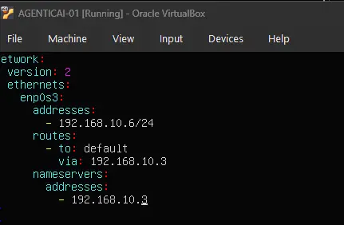
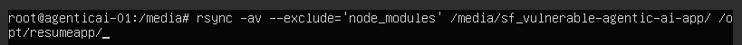
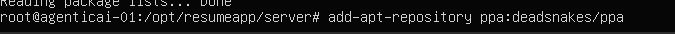
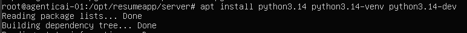
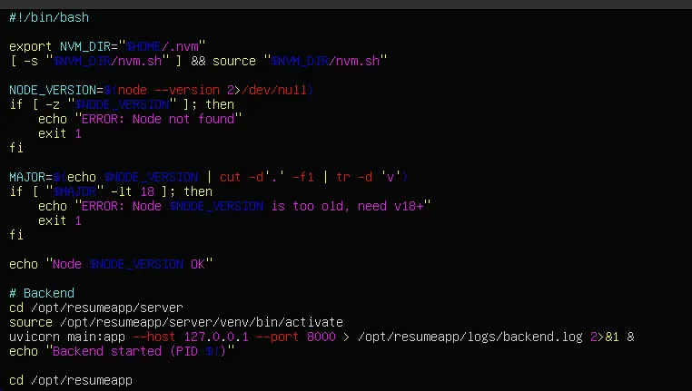
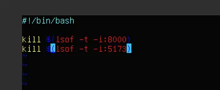
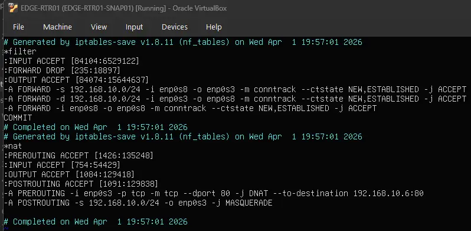
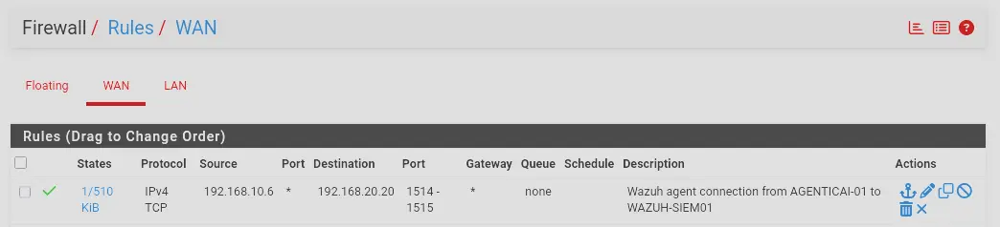

# AGENTICAI-01

AGENTICAI-01 is the DMZ-hosted web application server for the lab. It runs a full-stack agentic AI resume application — a React frontend backed by a Python/FastAPI server — exposed externally through nginx acting as a reverse proxy. The machine is intentionally reachable from WAN_NET as a target for attack simulation scenarios.

---

## VM Hardware Configuration

| Feature     | Configuration                         |
| :---------- | :------------------------------------ |
| **OS**      | Ubuntu Server 22.04.5                 |
| **vCPU**    | 2                                     |
| **RAM**     | 2 GB                                  |
| **Disk**    | 50 GB                                 |
| **Network** | `DMZ_NET` (Static IP: `192.168.10.6`) |

> [!IMPORTANT]
> In VirtualBox, the NIC must be attached to **DMZ_NET**.

---

## OS Installation & Initial Configuration

### Install Ubuntu Server

Install Ubuntu Server 22.04.5 using default options.

### Network Configuration (Netplan)

Set a static IP on DMZ_NET before proceeding.



### Update & Upgrade

```bash
sudo apt update && sudo apt upgrade -y
```

### Install VirtualBox Guest Additions

```bash
sudo apt install -y virtualbox-guest-utils virtualbox-guest-additions-iso
sudo reboot
```

---

## Application Deployment

`resumeapp` is a full-stack agentic AI resume application. The backend is a Python/FastAPI server; the frontend is a React single-page app built with Vite.

### Deploy Application Source

Copy the application source code onto the server at `/opt/resumeapp`.



### Backend — Python 3.14

Ubuntu 22.04 does not ship Python 3.14. Add the **deadsnakes** PPA first.



```bash
sudo apt update
sudo apt install -y python3.14
```



Create a virtual environment and install dependencies:

```bash
cd /opt/resumeapp/server
python3.14 -m venv venv
source venv/bin/activate
pip install -r requirements.txt
```

### Frontend — Node.js

Ubuntu 22.04's packaged Node.js is outdated. Use **nvm** to install the LTS release. Reference: [nvm-sh/nvm](https://github.com/nvm-sh/nvm?tab=readme-ov-file#install--update-script)

```bash
curl -o- https://raw.githubusercontent.com/nvm-sh/nvm/v0.39.7/install.sh | bash
source ~/.bashrc
nvm install --lts
nvm use --lts
node --version
```

Install dependencies and build the frontend:

```bash
cd /opt/resumeapp/client
npm install
npm run build
```

### Start and Stop Scripts

Create helper scripts to manage the application processes.

**Start script:**



**Stop script:**



---

## Network Exposure (DNAT & pfSense)

Two rule changes are required to expose AGENTICAI-01 to WAN_NET and allow its Wazuh agent to reach WAZUH-SIEM01 — one on EDGE-RTR01 and one on pfSense.

### EDGE-RTR01 iptables



Two rules were added:

| Table  | Chain      | Rule | Purpose |
| :----- | :--------- | :--- | :------ |
| filter | FORWARD    | 3rd rule (top to bottom) | Permits packets originating from and destined for devices within DMZ_NET to be forwarded. Required so AGENTICAI-01's Wazuh agent can reach WAZUH-SIEM01 on LAN_NET via pfSense — without this, the FORWARD chain's default DROP policy would silently block the traffic. |
| nat    | PREROUTING | —   | DNAT rule that rewrites the destination of inbound WAN_NET packets on port 80 to `192.168.10.6:80`, exposing the application to external traffic. |

### pfSense



A firewall rule on the WAN interface (which faces DMZ_NET) permits TCP traffic from `192.168.10.6` to WAZUH-SIEM01 (`192.168.20.20`) on ports 1514–1515:

| Port | Purpose |
| :--- | :------ |
| 1515 | Wazuh agent enrollment |
| 1514 | Ongoing agent event forwarding |

---

## Hosting with nginx

### Why nginx

nginx acts as a reverse proxy, sitting in front of both the frontend and backend. It is the only service exposed on port 80 — the backend binds to `127.0.0.1` and is never directly reachable from the network, and the frontend is served as static files rather than running a dev server. This means only a single DNAT rule is needed on the edge router.

### Install nginx

```bash
sudo apt install -y nginx
```

### Build the Frontend

```bash
cd /opt/resumeapp/client
source ~/.bashrc
nvm use --lts
npm run build
```

Output goes to `/opt/resumeapp/client/dist/`.

### Copy Static Files to /var/www

`/var/www/` is the standard web root and is accessible by `www-data` (the nginx user). The source code stays in `/opt/resumeapp/`.

```bash
sudo mkdir -p /var/www/resumeapp
sudo cp -r /opt/resumeapp/client/dist/* /var/www/resumeapp/
sudo chown -R www-data:www-data /var/www/resumeapp
```

### Create nginx Config

```bash
sudo nano /etc/nginx/sites-available/resumeapp
```

```nginx
server {
    listen 80;

    root /var/www/resumeapp;
    index index.html;

    location / {
        try_files $uri $uri/ /index.html;
    }

    location /api/ {
        proxy_pass http://127.0.0.1:8000/;
        proxy_set_header Host $host;
        proxy_set_header X-Real-IP $remote_addr;
    }
}
```

- `location /` — serves static frontend files; falls back to `index.html` for React client-side routing
- `location /api/` — proxies API calls to the backend; the browser never contacts the backend directly

### Enable the Site and Reload nginx

```bash
sudo ln -s /etc/nginx/sites-available/resumeapp /etc/nginx/sites-enabled/
sudo rm /etc/nginx/sites-enabled/default
sudo nginx -t
sudo systemctl reload nginx
```

### Update iptables DNAT to Port 80

Remove the old frontend DNAT rule and replace with a single rule pointing to nginx on port 80:

```bash
iptables -t nat -D PREROUTING -i enp0s3 -p tcp -m tcp --dport 5173 -j DNAT --to-destination 192.168.10.6:5173
iptables -t nat -A PREROUTING -i enp0s3 -p tcp -m tcp --dport 80 -j DNAT --to-destination 192.168.10.6:80
```

### Update Start Script

Bind the backend to `127.0.0.1` so it is not reachable from outside the machine. Remove the frontend startup block entirely — nginx serves the static files directly.

```bash
# Backend
cd /opt/resumeapp/server
source /opt/resumeapp/server/venv/bin/activate
uvicorn main:app --host 127.0.0.1 --port 8000 > /opt/resumeapp/logs/backend.log 2>&1 &
echo "Backend started (PID $!)"
```

---

## systemd Service (Auto-start on Boot)

The backend is managed as a systemd service so it starts automatically on boot without relying on the manual start script.

### Create the Service Unit

```bash
sudo nano /etc/systemd/system/resumeapp.service
```

```ini
[Unit]
Description=ResumeApp Backend
After=network.target

[Service]
Type=simple
WorkingDirectory=/opt/resumeapp/server
ExecStart=/opt/resumeapp/server/venv/bin/uvicorn main:app --host 127.0.0.1 --port 8000
Restart=on-failure
StandardOutput=append:/opt/resumeapp/logs/backend.log
StandardError=append:/opt/resumeapp/logs/backend.log

[Install]
WantedBy=multi-user.target
```

> [!NOTE]
> Use the full path to `uvicorn` inside the venv — systemd does not source shell profiles, so `source venv/bin/activate` has no effect here.

> [!IMPORTANT]
> The service runs as **root** by default (no `User=` directive). This is intentional — `AGENTICAI-01` is a deliberately vulnerable target for attack simulation.

### Enable and Start

```bash
sudo systemctl daemon-reload
sudo systemctl enable resumeapp
sudo systemctl start resumeapp
sudo systemctl status resumeapp
```

- `daemon-reload` — tells systemd to pick up the new unit file
- `enable` — creates the symlink so it starts on boot
- `start` — starts it immediately without rebooting

---

## Wazuh Agent

### Install

```bash
curl -so wazuh-agent.deb https://packages.wazuh.com/4.x/apt/pool/main/w/wazuh-agent/wazuh-agent_4.9.2-1_amd64.deb
WAZUH_MANAGER='192.168.20.20' WAZUH_AGENT_NAME='AGENTICAI-01' dpkg -i ./wazuh-agent.deb
systemctl daemon-reload
systemctl enable wazuh-agent
systemctl start wazuh-agent
```

### pfSense Firewall Rule

Traffic from AGENTICAI-01 to WAZUH-SIEM01 enters pfSense on its WAN interface (which is the DMZ). The rule must be on the **WAN tab** in pfSense:

| Field                  | Value           |     |
| :--------------------- | :-------------- | --- |
| Protocol               | TCP             |     |
| Source                 | `192.168.10.6`  |     |
| Destination            | `192.168.20.20` |     |
| Destination Port Range | 1514 – 1515     |     |

### EDGE-RTR01 iptables FORWARD Rule

By default the FORWARD chain is DROP. Traffic from AGENTICAI-01 destined for `192.168.20.20` is routed through EDGE-RTR01 and forwarded out the same interface (`enp0s8 → enp0s8`). No existing rule covered same-interface forwarding, so this must be added on EDGE-RTR01:

```bash
iptables -A FORWARD -i enp0s8 -o enp0s8 -m conntrack --ctstate NEW,ESTABLISHED -j ACCEPT
```

### Verify Enrollment

```bash
systemctl status wazuh-agent
sudo tail -30 /var/ossec/logs/ossec.log
```

Agent should appear as active in the Wazuh dashboard at `https://wazuh.lab.internal`.

### FIM Real-time Monitoring for /etc

By default Wazuh scans `/etc` on a schedule (every 12 hours). For real-time detection of writes to `/etc/cron.d/` during attack simulation, configure realtime monitoring via `agent.conf` on WAZUH-SIEM01 (pushed to all agents in the default group):

```bash
sudo nano /var/ossec/etc/shared/default/agent.conf
```

```xml
<agent_config>
  <syscheck>
    <directories realtime="yes">/etc</directories>
  </syscheck>
</agent_config>
```

```bash
sudo systemctl restart wazuh-manager
```

Verify the agent received the config:

```bash
sudo tail -f /var/ossec/logs/ossec.log | grep syscheck
```
