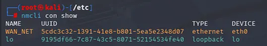
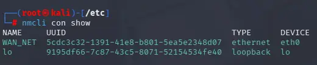
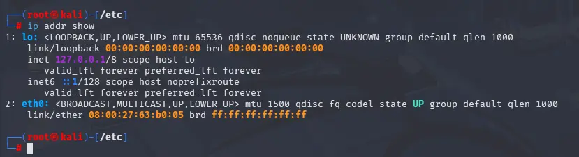

# ATTACKER01 (Kali Linux)

ATTACKER01 is the primary threat actor system in this lab environment. It resides in the **WAN_NET** segment, simulating an external attacker attempting to breach the network perimeter. It is also used for vulnerability scanning and executing various attack scenarios against the DMZ and internal networks.

---

## VM Hardware Configuration

| Feature     | Configuration                           |
| :---------- | :-------------------------------------- |
| **OS**      | Kali Linux (Latest Image)               |
| **vCPU**    | 2                                       |
| **RAM**     | 2 GB                                    |
| **Disk**    | 20 GB (Pre-allocated)                   |
| **Network** | `WAN_NET` (Static IP: `203.0.113.4/24`) |

---

## Installation & Initial Setup

To quickly set up the attacker system, we utilize the official Kali Linux VirtualBox images provided by the Kali team.

> [!NOTE]
> **Download Link**
> Official Kali Linux images can be found [here](https://www.kali.org/get-kali/#kali-platforms).

---

## Network Configuration (WAN_NET)

The `WAN_NET` segment is configured without DHCP to simulate a controlled public IP space. We must manually assign the static IP, default gateway, and DNS server using the Network Manager CLI (`nmcli`).

### Identify the Connection
First, verify the connection name bound to the `eth0` interface:

```bash
nmcli con show
```



> [!NOTE]
> In this case, the connection name is **"WAN_NET"**, which is bound to device `eth0`.

### Assign Static IP & Gateway
Apply the following commands to configure the static network settings:

```bash
# Set IPv4 address
nmcli con mod "WAN_NET" ipv4.addresses 203.0.113.4/24

# Set DNS server (Google DNS)
nmcli con mod "WAN_NET" ipv4.dns "8.8.8.8"

# Set Default Gateway (EDGE-RTR01)
nmcli con mod "WAN_NET" ipv4.gateway 203.0.113.1

# Set method to manual (Disable DHCP)
nmcli con mod "WAN_NET" ipv4.method manual

# Apply changes
nmcli con up "WAN_NET"
```

Once applied, internet connectivity should be established. In `nmcli`, the connection status should turn green.



---

## Expanding Network Connectivity

While ATTACKER01 is primarily situated in the **WAN_NET**, it can be pivoted into other segments (like **DMZ_NET** or **LAN_NET**) for lateral movement testing and internal scanning.

### Phase 1: VirtualBox Hardware Setup

> [!TIP]
> **Adding a Secondary Interface**
> 1. **Power Off** the VM.
> 2. Navigate to **Settings > Network**.
> 3. Enable **Adapter 2** (or the next available slot).
> 4. Set "Attached to" to **Internal Network**.
> 5. Set "Name" to the target segment (e.g., `DMZ_NET` or `LAN_NET`).

### Phase 2: OS Network Configuration

Once the VM is powered on, the configuration approach depends on the target segment's network services.

#### Option A: Static Configuration (No DHCP)
*Applicable to segments like **DMZ_NET** where IPs are manually managed.*

```bash
# 1. Identify the new interface (typically eth1)
ip addr show

# 2. Add the connection profile
nmcli con add type ethernet ifname eth1 con-name "DMZ_NET"

# 3. Configure static addressing & disable DHCP
nmcli con mod "DMZ_NET" ipv4.addresses 192.168.10.5/24
nmcli con mod "DMZ_NET" ipv4.method manual

# 4. Bring the connection up
nmcli con up "DMZ_NET"
```

#### Option B: Dynamic Configuration (DHCP)
*Applicable to segments like **LAN_NET** where **pfSense** provides DHCP services.*

> [!TIP]
> **Automatic Provisioning**
> In DHCP-enabled segments, Kali Linux will automatically detect the new interface and complete the **DORA** process to obtain an IP. No manual `nmcli` configuration is required for basic connectivity.

**Optional: Organize Connection Profiles**
To keep the Network Manager organized, you can rename the auto-generated connection profile:

```bash
# Rename the default "Wired connection X" to something descriptive
nmcli con mod "Wired connection 1" connection.id "LAN_NET"
```

---

## Troubleshooting: No Connection Bound to eth0

If `nmcli con show` only displays the loopback interface, you must create a new connection from scratch.

### Verify Interface Name
Check the available interfaces:

```bash
ip addr show
```



Confirm that the target interface is indeed `eth0`.

### Create the Connection
Manually create and bind the connection to the interface:

```bash
nmcli con add type ethernet ifname eth0 con-name "WAN_NET"
```

After creating the connection, proceed with the [Static IP configuration](#2.-assign-static-ip-&-gateway) steps above.
