# DC01

DC01 is the primary domain controller for the `lab.internal` forest. It runs Active Directory Domain Services, DNS, Kerberos, and LDAP — providing centralized identity management and name resolution for all domain-joined endpoints in LAN_NET.

---

## VM Hardware Configuration

| Feature     | Configuration                           |
| :---------- | :-------------------------------------- |
| **OS**      | Windows Server 2019 Standard Evaluation |
| **vCPU**    | 4                                       |
| **RAM**     | 4 GB                                    |
| **Disk**    | 60 GB                                   |
| **Network** | `LAN_NET` (Static IP: `192.168.20.10`)  |

---

## VirtualBox Guest Additions

VirtualBox Guest Additions are installed on DC01 to enable bidirectional clipboard sharing during initial setup. This makes it easier to copy and paste commands while configuring the machine.

To install Guest Additions:

1. Start DC01 and log in
2. In the VirtualBox menu bar → **Devices** → **Insert Guest Additions CD Image...**
3. Open **File Explorer** → navigate to the mounted CD drive
4. Run **`VBoxWindowsAdditions.exe`** → follow the installer wizard → reboot when prompted

To enable bidirectional clipboard:

1. In the VirtualBox menu bar → **Devices** → **Shared Clipboard** → **Bidirectional**

> [!IMPORTANT]
> Once initial setup is complete, clipboard sharing must be disabled. DC01 is a Tier 0 asset and clipboard sharing is a security risk in an isolated lab environment.
> **Devices** → **Shared Clipboard** → **Disabled**

---

## Sysmon

Sysmon is a free Windows system service from Microsoft Sysinternals that logs detailed system activity to Windows Event Log. DC01 is a high-value target as it runs AD, DNS, Kerberos, and LDAP.

Installing Sysmon on critical infrastructure such as DC01 is considered best practice, providing the telemetry needed to detect and investigate attacks.

### Installing Sysmon

To install Sysmon we will provide a shared folder to DC01 with the required Sysmon installer and a baseline config. This simulates best practice — instead of downloading the installer from the internet on the domain controller itself, we are providing it access to a file share where vetted tools are made available to it.

To simulate this in VirtualBox, create a folder on the host machine and add it as a shared folder to DC01.

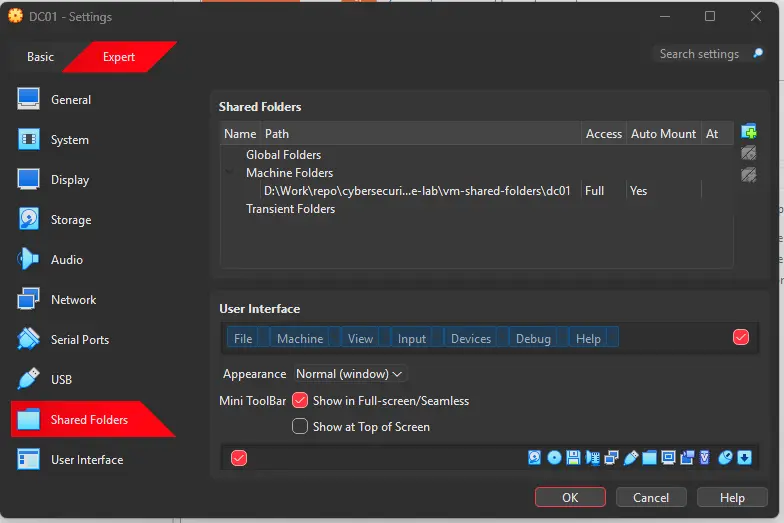

Download Sysmon from Microsoft Sysinternals and the baseline config, then place them in this folder. The baseline config used here is [SwiftOnSecurity/sysmon-config](https://github.com/SwiftOnSecurity/sysmon-config) — a well-maintained template with default high-quality event tracing. There are more comprehensive configs that build on top of it, but this is sufficient for this lab.

Open a PowerShell terminal as Administrator and run the following:

```powershell
# Navigate to shared folder on DC01
cd \\VBOXSVR\dc01

# Install Sysmon with SwiftOnSecurity config
.\Sysmon-install\Sysmon64.exe -accepteula -i .\sysmon-config\sysmonconfig-export.xml

# Verify Sysmon is running
Get-Service Sysmon64
```

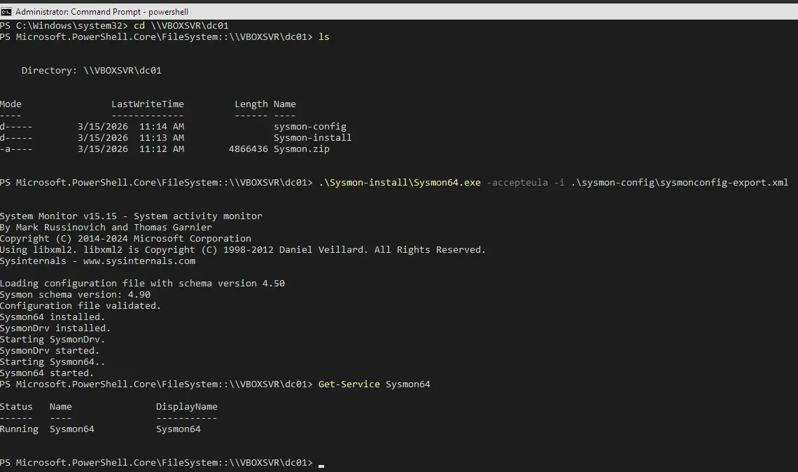

### Viewing Sysmon Logs

Sysmon logs can be found in Event Viewer by navigating to:
`Applications and Services Logs` → `Microsoft` → `Windows` → `Sysmon` → `Operational`

We can verify it is working by running `ping google.com` on DC01 and checking for a Sysmon Event ID 22 (DNS Query) log entry.

```powershell
# On another terminal
ping google.com
```

```powershell
# On a privileged terminal, check for Event ID 22 (DNS Query)
Get-WinEvent -LogName "Microsoft-Windows-Sysmon/Operational" -FilterXPath "*[System[EventID=22]]" -MaxEvents 5 | Format-List TimeCreated, Message
```

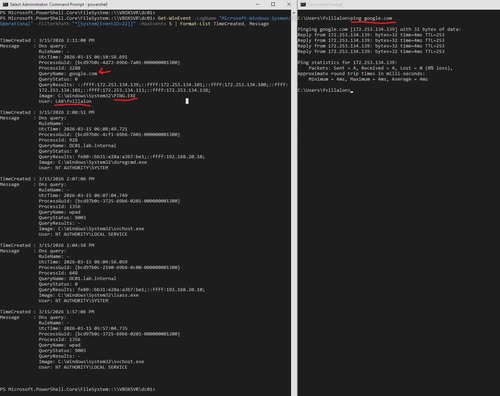

> [!NOTE]
> DC01 has internet connectivity for now just for testing. A pfSense firewall rule to block all outbound internet traffic from DC01 will be configured in a later phase.

---

## Active Directory Setup

### Prerequisites

Before adding Active Directory Domain Services to the server, the following prerequisites must be satisfied:

- Windows Server installed
- Static IP address configured
- Adequate RAM (4 GB recommended) and storage

---

### Setting a Static IP

Since PFSENSE-FW01 acts as the DHCP server, DC01 will be automatically assigned an IP on first boot. This can be verified via `ipconfig /all`:

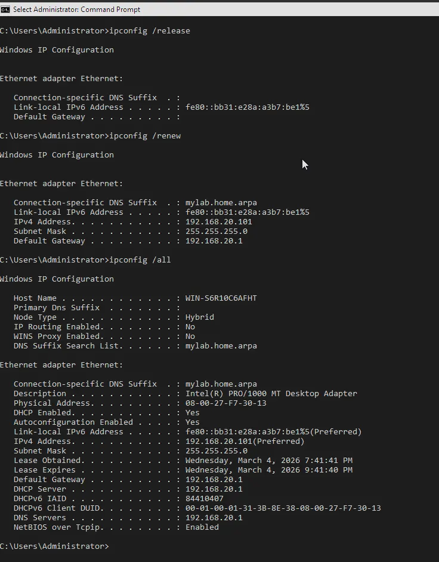

To configure a static IP via the GUI:

1. Click the **Network** icon on the taskbar → **Network & Internet Settings**
2. Click **Change Adapter Options**
3. Select the Ethernet interface connected to `LAN_NET`
4. Right-click → **Properties** → **Internet Protocol Version 4 (TCP/IPv4)**
5. Select **Use the following IP address** and enter the values below

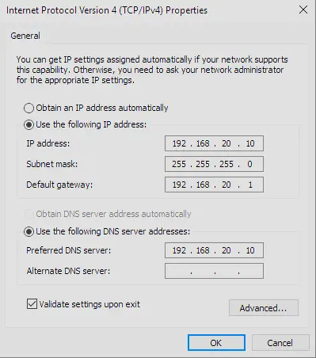

> [!IMPORTANT]
> Active Directory is heavily dependent on DNS. Clients query DNS for SRV records to locate domain services such as LDAP and Kerberos. The AD DS DNS server automatically registers and manages these records.
>
> Without them, clients **cannot join the domain, authenticate, or find domain controllers**. pfSense has no knowledge of AD SRV records and is not Active Directory-aware. Therefore, the DNS server must be **DC01** itself.

---

### Setting the Time Zone

DC01 may default to an incorrect time zone. Correct this before promoting to a domain controller:

1. Click **Start** → **Settings**
2. Select **Time & Language** → **Date & Time**
3. Set the correct **Time Zone**

Below is DC01's confirmed configuration prior to AD DS installation:

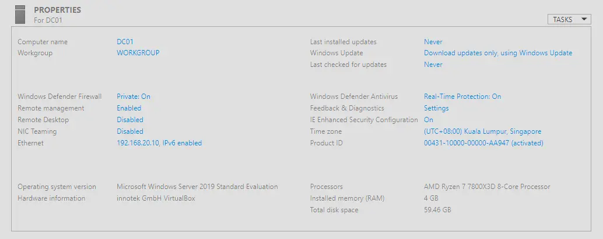

> [!NOTE]
> Windows Updates are paused and disabled. This server is intentionally kept in a vulnerable state to simulate attacks in a controlled lab environment. Remediations and security controls will be documented and applied in a later phase.

---

### Installing Active Directory Domain Services

1. Open **Server Manager** → **Manage** → **Add Roles and Features**
2. Select **Role-based or feature-based installation**
3. Select **DC01** from the server pool
4. Check **Active Directory Domain Services**
5. Accept additional features → click through the wizard → **Install**

---

### Promoting DC01 to Domain Controller

1. Click the **flag icon** (top-right in Server Manager) → **Promote this server to a domain controller**
2. Select **Add a new forest** and set the root domain name to `lab.internal`
3. Click through the wizard until prompted to set the **DSRM password** → set to `P@ssw0rd123`
4. Continue through the wizard → **Install** — the server will reboot automatically

---

### Verifying the Installation

**AD DS Service Status**

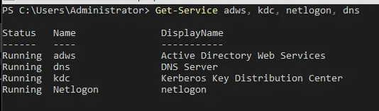

**AD Domain**
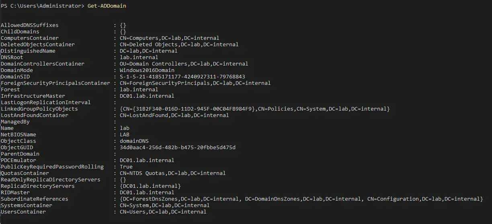

**Domain Controller**
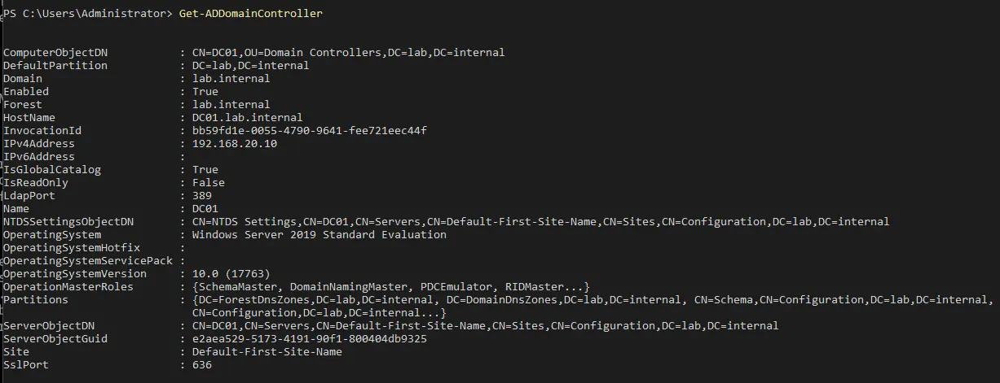

---

## OU Structure

### Verifying DNS Before Proceeding

Before building the OU structure, verify that DNS is functioning correctly. This means confirming that the SRV records for LDAP and Kerberos authentication are registered, that DC01 can resolve its own domain, and that it can reach the internet.

```powershell
Resolve-DnsName lab.internal
Resolve-DnsName _ldap._tcp.lab.internal -Type SRV
Resolve-DnsName _kerberos._tcp.lab.internal -Type SRV
Resolve-DnsName google.com
```

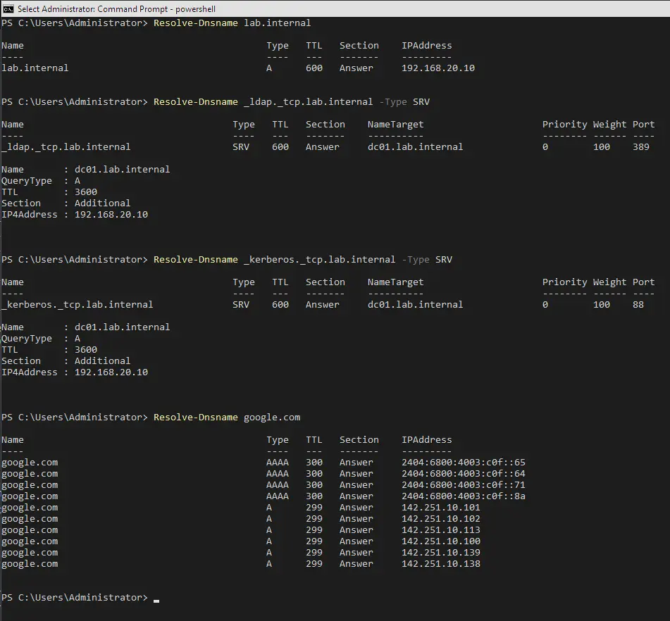

---

### Creating the OU Structure

1. Open **ADUC** → right-click **`lab.internal`** → **New** → **Organizational Unit**
2. Build out the following structure:

```
lab.internal
└── LAB
    ├── Computers
    │   ├── Workstations
    │   └── Servers
    ├── Users
    │   ├── Admins
    │   └── Standard
    └── Groups
        └── Security
```

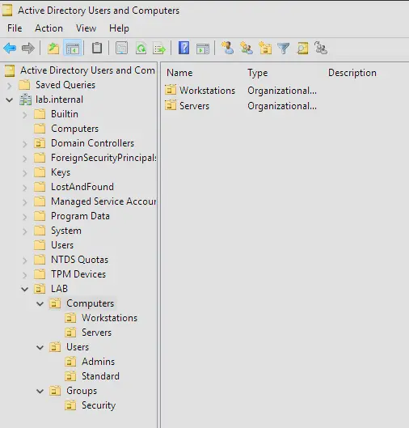

> [!NOTE]
> The built-in `Computers` and `Users` containers that AD creates by default are not OUs and cannot have GPOs linked to them. All objects should be moved into this custom structure.

---

### Creating User Accounts

Two accounts will be created — one standard user and one domain admin.

#### Jane Doe (Standard User)

1. Right-click `LAB > Users > Standard` → **New** → **User**
2. Populate the user fields as shown below

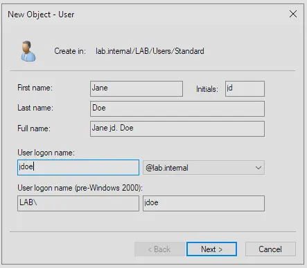

3. Set the initial password to `Welcome1!`
4. Check **"User must change password at next logon"** — this ensures the admin never knows the user's actual password

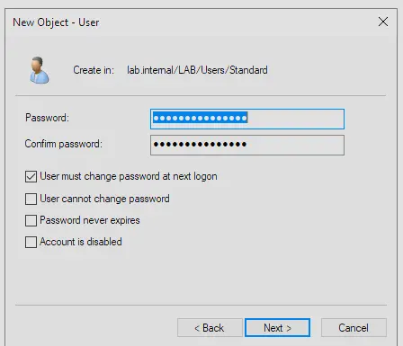

#### Francis Villalon (Domain Admin)

1. Right-click `LAB > Users > Admins` → **New** → **User**
2. Populate the user fields as shown below

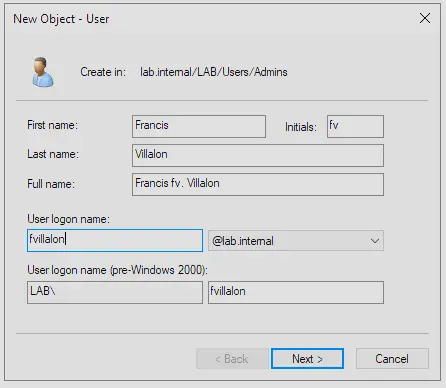

3. Set password to `P@ssw0rd123`
4. Uncheck **"User must change password at next logon"** — this is a personal admin account

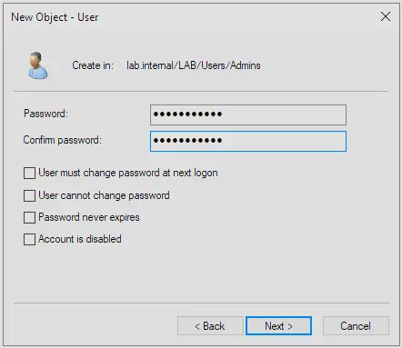

5. Once the account is created, right-click `francis.villalon` → **Add to a group**
6. In the **Select Groups** window, type `Domain Admins` → **Check Names** → **OK**

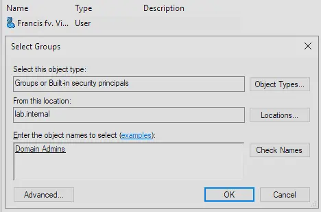

> [!IMPORTANT]
> Log out of the `Administrator` account and log back in as `LAB\francis.villalon`. This account will be used for all domain administration going forward. Also support audit trails as we now know who makes what changes instead of just "Administrator".

---

### Enabling the Active Directory Recycle Bin

Enabling the Recycle Bin allows deleted objects (users, OUs, computers) to be restored easily without requiring a full AD restore.

1. Open **Active Directory Administrative Center (ADAC)**
2. Click **`lab (local)`** in the left panel
3. In the **Tasks** panel → click **Enable Recycle Bin** → confirm the prompt

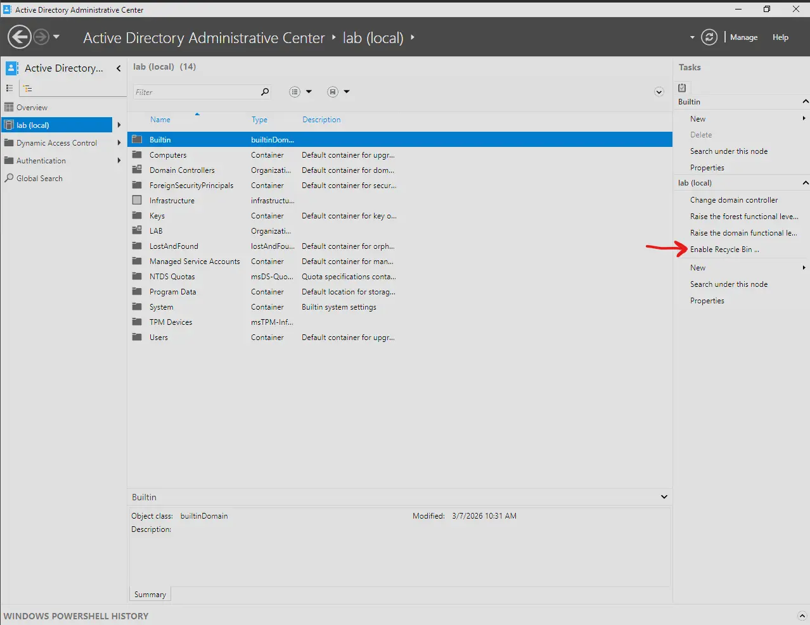

> [!NOTE]
> This change is irreversible once enabled. Restart DC01 for the configuration to take full effect.

---

## Managing New Domain-Joined Computers

When a PC joins the domain, it appears in ADUC under the built-in `Computers` container as a new computer object:

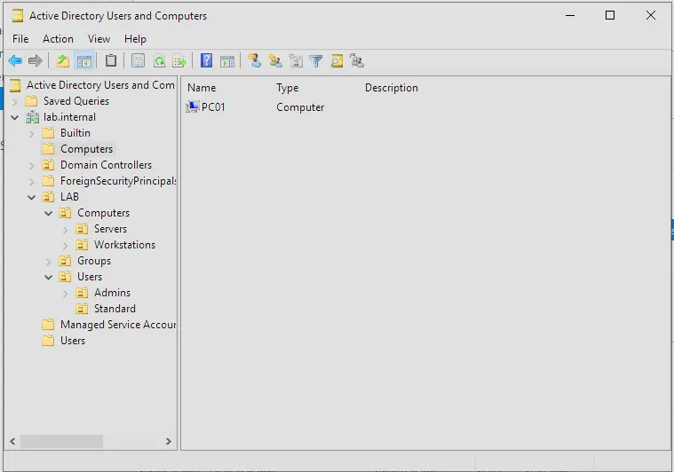

Move it to the appropriate OU by right-clicking the object → **Move** → navigate to the correct OU:

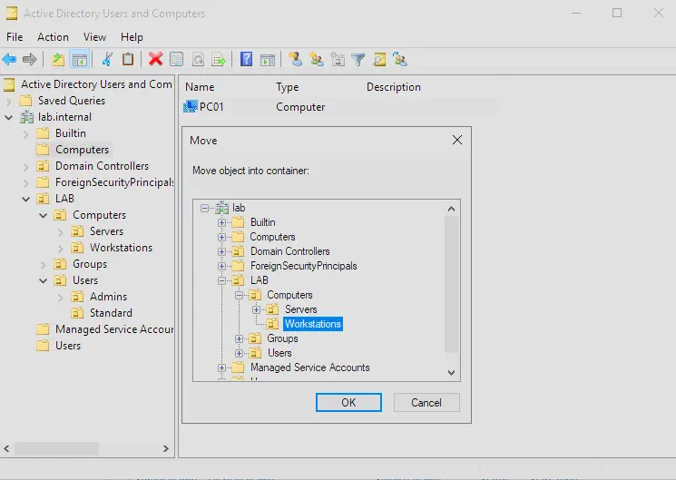

For example, PC01 being a workstation should be moved to `LAB > Computers > Workstations`. The computer object should then appear at `lab.internal/LAB/Computers/Workstations`:

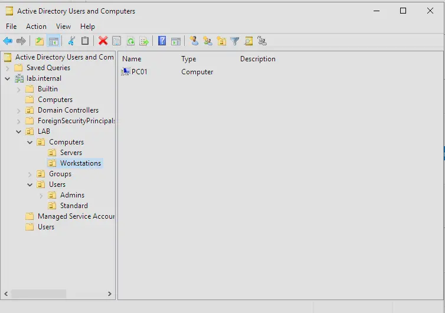

> [!NOTE]
> GPO configuration for OUs and security hardening procedures will be documented in a later phase.

---

## DNS Management

### Adding a DNS Forwarder

DNS queries that DC01 cannot resolve locally (i.e. anything outside `lab.internal`) should be forwarded to PFSENSE-FW01, which passes them upstream to EDGE-RTR01.

1. Open **DNS Manager** on DC01

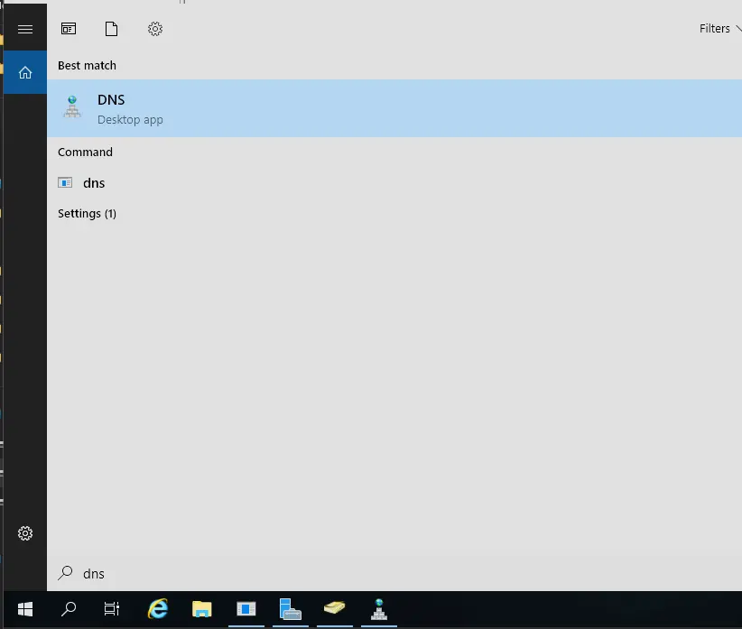

2. Right-click **DC01** → **Properties** → **Forwarders** tab
3. Click **Edit** → add `192.168.20.1` (PFSENSE-FW01) → **OK**

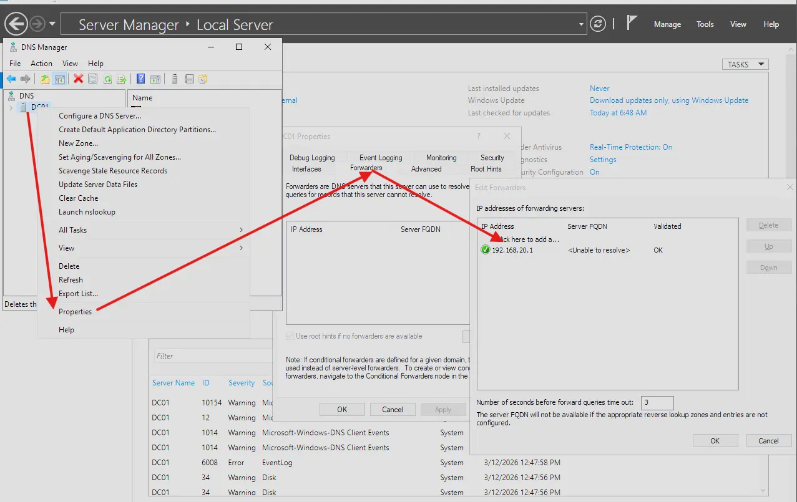

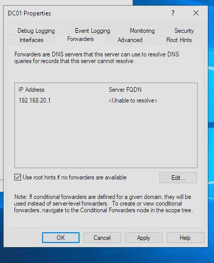

> [!NOTE]
> The forwarder may show "Unable to resolve" next to `192.168.20.1` at this stage. This is expected — it simply means no PTR record exists for pfSense yet. The forwarder will still function correctly. This will be resolved when the reverse lookup zone and PTR records are configured below.

---

### Creating the Reverse Lookup Zone

A reverse lookup zone allows DC01 to resolve IP addresses back to hostnames (PTR records). This zone is not created automatically — it must be configured manually.

1. In **DNS Manager** → expand **DC01** → right-click **Reverse Lookup Zones** → **New Zone**
2. This opens the New Zone Wizard — configure as follows:

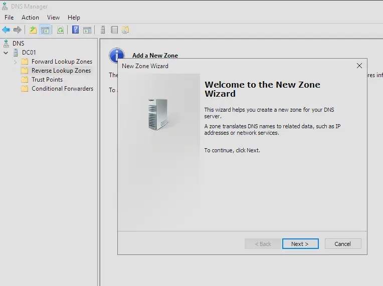

| Setting | Value |
| :--- | :--- |
| **Zone Type** | Primary Zone |
| **Replication Scope** | All DNS servers running on domain controllers in this domain |
| **Zone Type** | IPv4 Reverse Lookup Zone |
| **Network ID** | `192.168.20` |
| **Dynamic Updates** | Allow only secure dynamic updates |

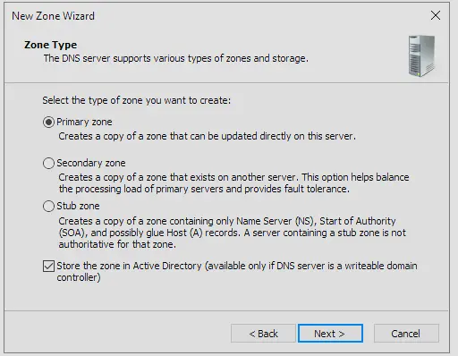

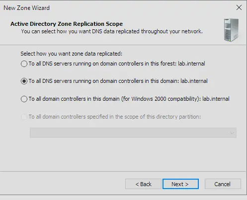

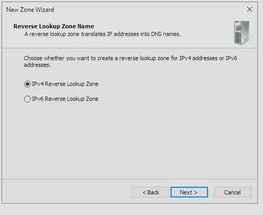

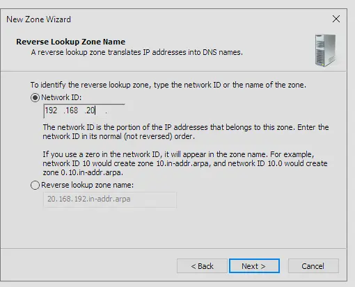

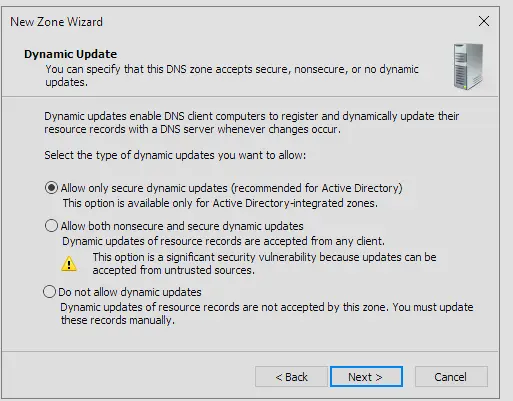

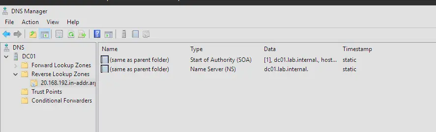

---

### Adding a PTR Record for PFSENSE-FW01

Since **Allow only secure dynamic updates** is enabled, only domain-joined machines can automatically register their own PTR records. Non-domain devices such as PFSENSE-FW01 must have their PTR records added manually.

1. Expand **Reverse Lookup Zones** → right-click `20.168.192.in-addr.arpa` → **New Pointer (PTR)**
2. Host IP: `1`, Host name: `pfsense.lab.internal` → **OK**

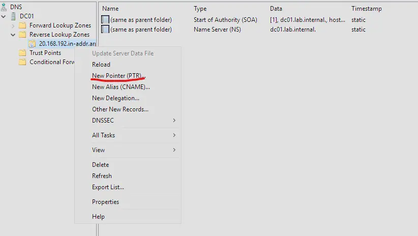

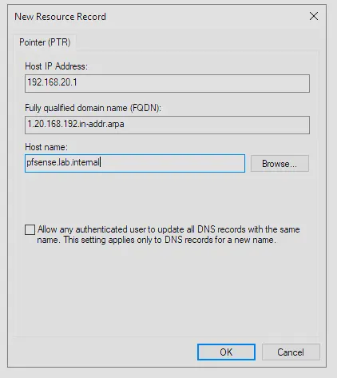

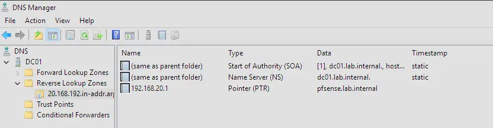

---

### Registering the PTR Record for Domain-joined Devices

DC01's PTR record is normally auto-registered at promotion time. However, since the reverse lookup zone did not exist when DC01 was promoted, no PTR record was created. Force a re-registration now that the zone exists:

```powershell
ipconfig /registerdns
```

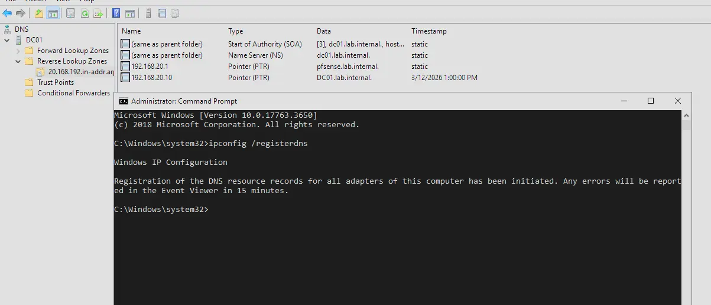

---

### Verifying the Reverse Lookup Zone

Use `dig` on ATTACKER01 to confirm both PTR records are resolving correctly:

```bash
dig -x 192.168.20.1
dig -x 192.168.20.10
```

Both hostnames should resolve correctly — `pfsense.lab.internal` and `dc01.lab.internal` respectively. The `SERVER` field in the output should show `192.168.20.10`, confirming that DNS queries are being handled by DC01.

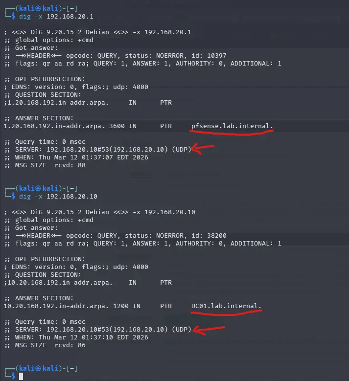


---

## Installation Script

```powershell
# Windows PowerShell script for AD DS Deployment

Import-Module ADDSDeployment
Install-ADDSForest `
    -CreateDnsDelegation:$false `
    -DatabasePath "C:\Windows\NTDS" `
    -DomainMode "WinThreshold" `
    -DomainName "lab.internal" `
    -DomainNetbiosName "LAB" `
    -ForestMode "WinThreshold" `
    -InstallDns:$true `
    -LogPath "C:\Windows\NTDS" `
    -NoRebootOnCompletion:$false `
    -SysvolPath "C:\Windows\SYSVOL" `
    -Force:$true
```

---

## Troubleshooting

### Cannot Log In — Wrong Credentials

If a user account such as `jane.doe` cannot be logged into, reset the password via ADUC:

1. Open **ADUC** → locate the user account
2. Right-click → **Reset Password**

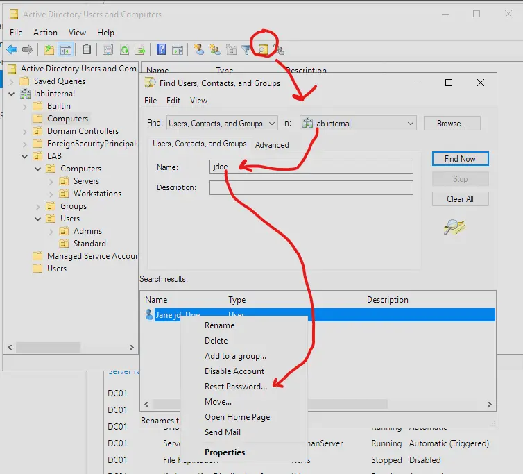
