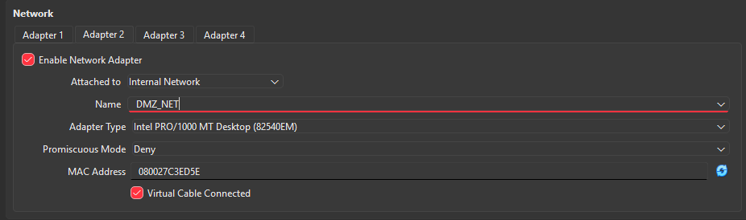
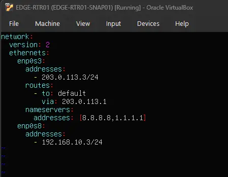
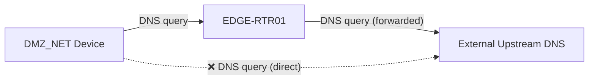
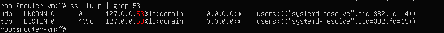
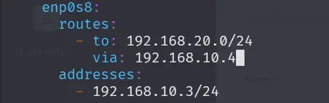
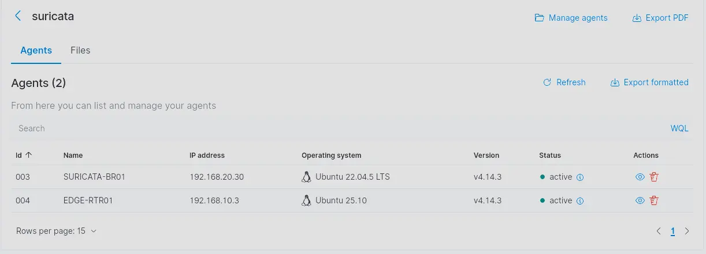

# EDGE-RTR01 (Edge Router)

EDGE-RTR01 serves as the boundary device between the **WAN_NET** and the **DMZ_NET**. Since devices in the DMZ use private, non-routable IP addresses, this router performs Network Address Translation (NAT) for packets exiting the WAN interface, ensuring external connectivity for DMZ assets.

---

## VM Hardware Configuration

| Feature   | Configuration                |
| :-------- | :--------------------------- |
| **OS**    | Ubuntu Server 25.10          |
| **RAM**   | 512MB                        |
| **vCPU**  | 1 Core                       |
| **Disk**  | 10GB                         |
| **NIC 1** | `WAN_NET` (NAT Network)      |
| **NIC 2** | `DMZ_NET` (Internal Network) |


> [!IMPORTANT]
> To facilitate system updates during initial setup, the network adapters are initially set to **NAT** mode. Once updates are complete, they are reconfigured to their respective lab segments.




### Network Segmentation Approach
This lab utilizes dual NICs for physical segmentation, which is simple and effective for small-scale environments. In larger enterprise deployments, **VLANs (802.1Q)** are typically preferred for scalability and cost-efficiency. However, due to VirtualBox's native limitations with VLAN tagging compared to other hypervisors, the multi-NIC approach was chosen for reliability.

---

## OS Installation & Configuration

### Installation & Initial Updates
During the Ubuntu Server installation, use the following credentials:

| Field | Value |
| :--- | :--- |
| **Username** | `router-vm` |
| **Password** | `P@ssw0rd123` |

After the first boot, ensure the VM has internet access (via temporary NAT settings) and run:

```bash
sudo apt update && sudo apt upgrade -y
```

Additionally, install `vim` (or just use `nano`):

```bash
sudo apt install vim -y
```

Once updated, power off the VM and revert the VirtualBox NIC settings to their permanent lab segments (**WAN_NET** and **DMZ_NET**).

### Network Configuration (Netplan)
Identify the interface names assigned by the OS:

```bash
ip addr show
```


> [!NOTE]
> The screenshot above shows the interfaces *after* configuration. Use MAC addresses in VirtualBox settings to verify which interface (e.g., `enp0s3`) maps to which network segment.

#### Creating the Netplan Configuration
Disable the default installer configuration and create a new lab-specific plan:

```bash
sudo su -
cd /etc/netplan
mv 00-installer-config.yaml 00-installer-config.yaml.bak
touch 01-EDGE-RTR01-config.yaml
chmod 600 01-EDGE-RTR01-config.yaml
```

> [!NOTE]
> It is important that the permissions for the netplan yaml file are restrictive e.g set to 600 as root ( read and write for owner only! ) . Otherwise, netplan will outright refuse to use the configuration as the permissions are too open!
> 
> Why is this required?
>
> 1. **Security:** Netplan files contain sensitive information such as Wi-Fi passwords (Pre-Shared Keys), tunnel secrets, or internal network topology details.
> 2. **Best Practice:** Since these files define the core networking of the system, only the root user should be able to read and modify them.


Edit `01-EDGE-RTR01-config.yaml` with the following settings:



> [!NOTE]
> A very common gotcha in configuring yaml files is the use of `tab` character. Only use `space`! 
> The standard is 2 space per indentation level.


**Configuration Summary:**

| Interface | Segment | IP Address        | Gateway       | DNS Servers          |
| :-------- | :------ | :---------------- | :------------ | :------------------- |
| `enp0s3`  | WAN_NET | `203.0.113.3/24`  | `203.0.113.1` | `8.8.8.8`, `1.1.1.1` |
| `enp0s8`  | DMZ_NET | `192.168.10.3/24` | None          | None                 |

Apply the changes:

```bash
netplan apply
```

---

## DNS Services (dnsmasq)

To increase visibility into network activity, DMZ devices forward DNS queries to EDGE-RTR01 rather than resolving them externally.



### Installation
Install `dnsmasq` to provide DNS forwarding and caching services:

```bash
sudo apt install dnsmasq -y
```

### Resolving Port 53 Conflicts
By default, `systemd-resolved` listens on port 53, conflicting with `dnsmasq`.

> [!NOTE]
> **What is a DNS Stub Listener?**
> A lightweight service that sits between local applications and upstream servers, caching queries to improve performance.

Identify the conflict:

```bash
# ss socket statistics
# -t Show TCP sockets
# -u Show UDP sockets
# -l Show only listening sockets
# -p Show the process using the socket

ss -tulp | grep 53
```



#### Fix: Disable the Stub Listener
Edit `/etc/systemd/resolved.conf`:

```ini
[Resolve]
DNSStubListener=no
```

Update the `/etc/resolv.conf` symlink to point to the real upstream configuration instead of the local stub:

```bash
sudo ln -sf /run/systemd/resolve/resolv.conf /etc/resolv.conf
```

Restart the service and verify port 53 is free:

```bash
sudo systemctl restart systemd-resolved
ss -tulp | grep 53
ping -c 4 google.com
```

### Configuring dnsmasq
Create a clean configuration file:

```bash
sudo mv /etc/dnsmasq.conf /etc/dnsmasq.conf.bak
sudo vim /etc/dnsmasq.conf
```

Add the following directives:

```text
# Security & Performance
domain-needed 
bogus-priv
no-resolv

# Upstream Servers
server=8.8.8.8
server=1.1.1.1

# Listening Interface (DMZ only)
interface=enp0s8 

# Logging for SIEM/Visibility
log-queries
log-facility=/var/log/dnsmasq.log
```

> [!NOTE]
> 1. **domain-needed** — Never forward plain hostnames (without a dot) to upstream DNS. Prevents leakage of internal hostnames to the outside world.
>
> 2. **bogus-priv** — Never forward reverse DNS lookups for private IP ranges to upstream DNS. All private IPs are resolved locally.
>
> 3. **no-resolv** — Ignore `/etc/resolv.conf` entirely. Upstream servers are defined directly in `dnsmasq.conf`, providing a single source of truth. This also prevents DNS behaviour from changing if something modifies `/etc/resolv.conf`. On devices like pfSense, multiple services compete to write that file — ignoring it completely provides stability in complex environments.

Restart and verify:
```bash
dnsmasq --test
sudo systemctl restart dnsmasq
sudo systemctl status dnsmasq
```

---

## Routing & NAT (iptables)

### Enable IP Forwarding
Enable the kernel's ability to forward packets between interfaces:

```bash
echo "net.ipv4.ip_forward=1" | sudo tee /etc/sysctl.d/99-ip-forward.conf
sudo sysctl -p /etc/sysctl.d/99-ip-forward.conf
```

> [!NOTE]
> `echo "net.ipv4.ip_forward=1"` alone is not enough. This setting must persist through reboots, so we write it to a dedicated conf file instead.

### Configure Firewall Rules
Set a default-deny policy and define allowed traffic flows:

```bash
# Set default policy
sudo iptables -P FORWARD DROP

# Allow packet fowarding, DMZ -> WAN (New & Established)
sudo iptables -A FORWARD -i enp0s8 -o enp0s3 -s 192.168.10.0/24 \
-m conntrack --ctstate NEW,ESTABLISHED -j ACCEPT

# Allow packet fowarding, WAN -> DMZ (Return Traffic Only)
sudo iptables -A FORWARD -i enp0s3 -o enp0s8 -d 192.168.10.0/24 \
-m conntrack --ctstate ESTABLISHED,RELATED -j ACCEPT
```

### Configure NAT (Masquerading)
Mask the internal DMZ IP addresses with the router's WAN IP for outbound communication:

```bash
sudo iptables -t nat -A POSTROUTING -s 192.168.10.0/24 -o enp0s3 -j MASQUERADE
```

### Persistence
Ensure rules persist through reboots:

```bash
sudo apt install iptables-persistent -y
sudo netfilter-persistent save
```


## Wazuh Agent & Suricata

To provide security telemetry from the DMZ, EDGE-RTR01 runs both a **Wazuh agent** (for log forwarding and system monitoring) and **Suricata** (for network intrusion detection). Since EDGE-RTR01 sits at the boundary of the DMZ, it is the ideal vantage point for IDS inspection of all inbound and outbound DMZ traffic.

### Add Route to SIEM Network

The Wazuh manager resides on a separate network segment (`192.168.20.0/24`). EDGE-RTR01 needs an explicit static route to reach it via the DMZ gateway (`192.168.10.4`).

Edit `01-EDGE-RTR01-config.yaml` and add a `routes` block under the `enp0s8` interface:



Apply the changes:

```bash
netplan apply
```

> [!NOTE]
> Verify the route is active with `ip route show` — you should see `192.168.20.0/24 via 192.168.10.4 dev enp0s8`.

---

### Install Wazuh Agent

Install and register the Wazuh agent with the Wazuh manager. Use the manager's **IP address** (`192.168.20.20`) rather than a hostname — EDGE-RTR01 does not resolve internal names since its DNS configuration forwards queries externally only.

Ensure the following during setup:

| Setting | Value |
| :--- | :--- |
| **Manager IP** | `192.168.20.20` |
| **Agent Group** | `linux-baseline` |

> [!NOTE]
> Port **1515** is used for agent enrollment. Port **1514** is used for ongoing event forwarding to the manager. Both must be reachable from `192.168.10.3`.

> [!IMPORTANT]
> Firewall rules permitting traffic from `192.168.10.3` to `192.168.20.20` on ports **1514** and **1515** must be configured on **pfSense**.

---

### Install & Configure Suricata

#### Installation & Rule Updates

```bash
sudo apt install suricata -y
sudo suricata-update
```

> [!NOTE]
> `suricata-update` downloads and merges the latest **Emerging Threats Open** ruleset (and any other configured providers). Run it periodically to keep detection signatures current.

#### Interface Configuration

Configure Suricata to monitor `enp0s8` (the DMZ-facing interface), which carries all inbound and outbound DMZ traffic. In `/etc/suricata/suricata.yaml`, set the `af-packet` interface:

> [!NOTE]
> Promiscuous mode is not required on `enp0s8`. Unlike a passive tap listening on a switch SPAN port, EDGE-RTR01 is the actual router — every packet entering or leaving DMZ_NET is routed through this interface by design, so `af-packet` already has full visibility without needing to capture traffic addressed to other hosts.

```yaml
af-packet:
  - interface: enp0s8
```

Restart Suricata to apply:

```bash
sudo systemctl restart suricata
sudo systemctl status suricata
```

> [!NOTE]
> `eve.json` verbosity can cause Wazuh's `analysisd` to throw a "too many fields" error, silently dropping events. To fix this, a trim of the HTTP/DNS output fields in `suricata.yaml` and an increase of the analysisd field limit on WAZUH-SIEM01 are both required. See [SURICATA-BR01](SURICATA-BR01.html#handling-the-analysisd-too-many-fields-error) for the fix.


---

### Configure Wazuh Agent Groups

#### Add Agent to the Suricata Group

In the Wazuh manager, assign EDGE-RTR01's agent to the **Suricata** agent group. This applies the group's `ossec.conf` which includes the localfile entry for ingesting Suricata's `eve.json` alerts.



#### Create the Edge Router Agent Group

Create a dedicated **Edge Router** agent group in the Wazuh manager and configure it to ingest the `dnsmasq` query log:

```xml
<localfile>
  <log_format>syslog</log_format>
  <location>/var/log/dnsmasq.log</location>
</localfile>
```

> [!NOTE]
> This gives Wazuh full visibility into every DNS query resolved by EDGE-RTR01, covering all DMZ devices that use it as their DNS forwarder.

---

### Verify Telemetry

Trigger a test NIDS alert using a known test signature and confirm both log sources are being picked up by the Wazuh manager:

```bash
curl http://testmynids.org/uid/index.html
```

Verify in the Wazuh dashboard that:
- **Suricata alerts** appear under the agent's security events
- **DNS queries** from `dnsmasq.log` are being ingested