# NESSUS-SCAN01

NESSUS-SCAN01 is the vulnerability management node for the lab. It runs Nessus Essentials on Tenable Core and is used to perform authenticated and unauthenticated scans against lab endpoints to identify misconfigurations, missing patches, and known vulnerabilities.

## Understanding Nessus

Nessus is a widely-used vulnerability scanner developed by Tenable. In this lab, **Nessus Essentials** (the free tier) is used — it supports up to 5 IP addresses per scan, which is sufficient for this environment.

Scans can be run in two modes:

- **Unauthenticated:** Nessus probes each target externally without credentials. It can identify open ports, exposed services, and some externally visible vulnerabilities, but visibility is limited to what is reachable from the network.
- **Credentialed:** Nessus logs into each target using supplied credentials. This allows it to enumerate installed software, check patch levels, audit registry settings, and surface far more vulnerabilities than an unauthenticated scan can detect.

In this lab, Windows credentials are added to the scan so that results from Windows endpoints (DC01, PC01) are as complete and actionable as possible.

---

## VM Hardware Configuration

| Feature     | Configuration                          |
| :---------- | :------------------------------------- |
| **OS**      | Tenable Core                           |
| **vCPU**    | 2                                      |
| **RAM**     | 4 GB                                   |
| **Disk**    | 50 GB                                  |
| **Network** | `LAN_NET` (Static IP: `192.168.20.40`) |

> [!IMPORTANT]
> In VirtualBox, the NIC must be attached to **LAN_NET**.

---

## Initial Setup

Nessus on Tenable Core ships with a first-run wizard. On first boot, access the web interface and step through the wizard to configure the OS and create the initial admin account.

### Default Credentials

The wizard begins with the following built-in credentials:

| Field        | Value    |
| :----------- | :------- |
| **Username** | `wizard` |
| **Password** | `admin`  |

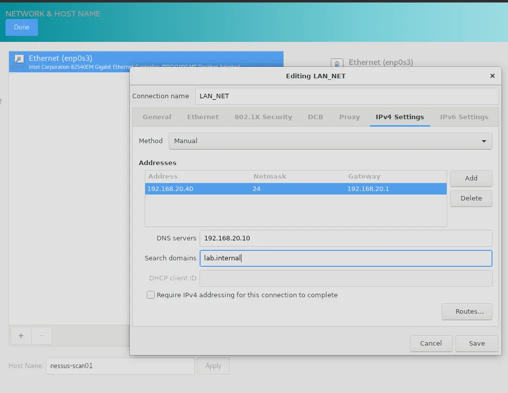
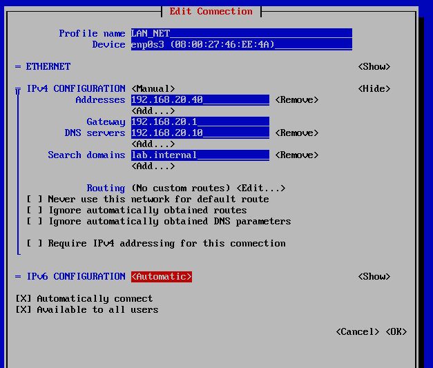

### Static IP Assignment

The wizard prompts whether to configure a static address. Set a static IP at this stage rather than relying on DHCP — this ensures the scanner is always reachable at a known address and its DNS record remains valid.

| Segment | IP Address         | Gateway        | DNS Server      |
| :------ | :----------------- | :------------- | :-------------- |
| LAN_NET | `192.168.20.40/24` | `192.168.20.1` | `192.168.20.10` |

### Creating the OS Admin Account

Create the Tenable Core OS admin account when prompted:

| Field        | Value           |
| :----------- | :-------------- |
| **Username** | `nessus-scan01` |
| **Password** | `P@ssw0rd123`   |

---

## DNS Registration in DC01

### Adding the A Record and PTR

1. Open **DNS Manager** on DC01
2. Expand **DC01** → **Forward Lookup Zones** → right-click **`lab.internal`** → **New Host (A or AAAA)**
3. Set the following values and check **"Create associated pointer (PTR) record"**

| Field    | Value           |
| :------- | :-------------- |
| **Name** | `nessus-scan01` |
| **IP**   | `192.168.20.40` |

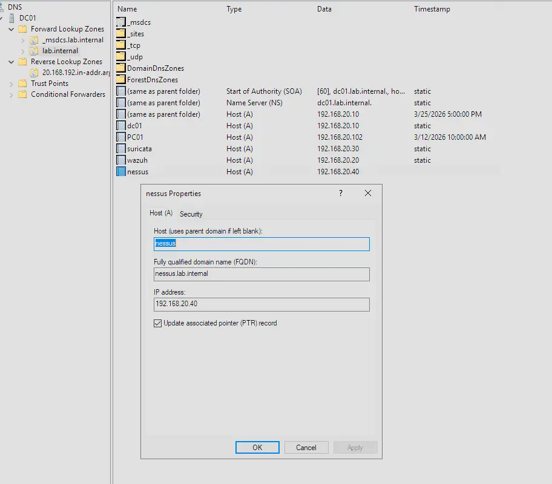
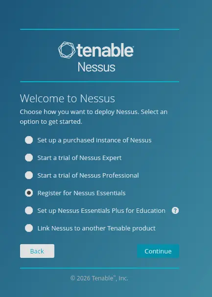

---

## Nessus Activation

After the OS wizard completes, the Nessus web interface walks through its own setup. Follow the on-screen steps to obtain an activation code for **Nessus Essentials** — a free Tenable account is required to receive one.

Once activated, create the Nessus service admin account:

| Field        | Value           |
| :----------- | :-------------- |
| **Username** | `nessus-scan01` |
| **Password** | `P@ssw0rd123`   |

> [!NOTE]
> This is a separate account from the Tenable Core OS admin created during the initial wizard. The OS account manages the underlying appliance; this account is used to log in to the Nessus web interface and manage scans.

---

## Running Scans

### Host Discovery Scan

Once Nessus finishes loading its plugins and rules, it runs a **host discovery scan** by default. This performs a lightweight sweep of the network to enumerate live hosts before running deeper vulnerability scans.

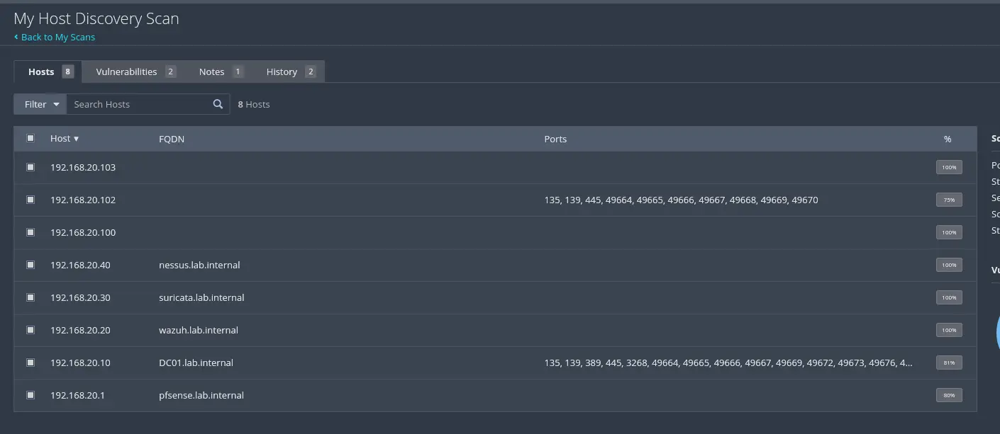

---

### Basic Network Scan

The main vulnerability scan targets the following LAN_NET hosts:

| Device       | IP Address       |
| :----------- | :--------------- |
| PFSENSE-FW01 | `192.168.20.1`   |
| DC01         | `192.168.20.10`  |
| WAZUH-SIEM01 | `192.168.20.20`  |
| PC01         | `192.168.20.102` |

To create the scan:

1. In the Nessus web interface, select **New Scan → Basic Network Scan**
2. Set the targets to: `192.168.20.1, 192.168.20.10, 192.168.20.20, 192.168.20.102`

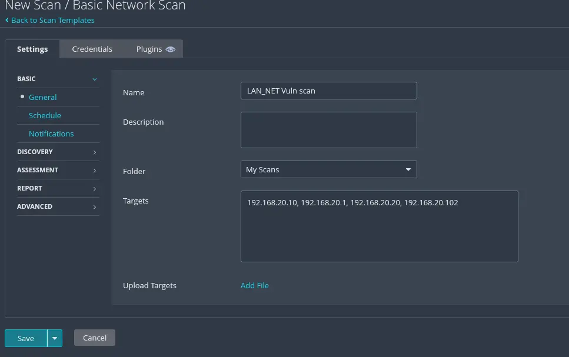

#### Adding Windows Credentials

To run a **credentialed scan** against Windows targets (DC01, PC01), add Windows credentials under the scan's **Credentials** tab. This allows Nessus to authenticate to those machines and perform deep local inspection — checking installed software versions, patch levels, registry settings, and local security configuration. The difference in findings between a credentialed and an unauthenticated scan against a Windows host is significant.

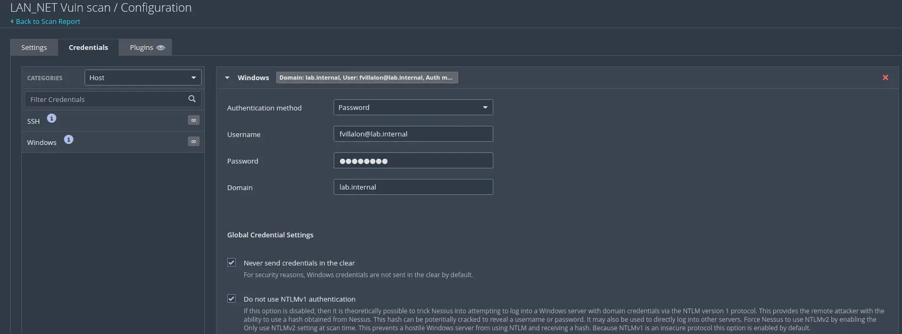

---

## Validating Detection During the Scan

While the scan is running, we can verify that the lab's NIDS and HIDS systems are correctly picking up the scanning activity. A vulnerability scan generates a large volume of probe traffic across many ports and protocols — it should be loud and highly visible to any properly configured detection system. This is a useful opportunity to validate end-to-end detection coverage.

### Suricata (NIDS)

Suricata on SURICATA-BR01 monitors all traffic traversing LAN_NET. It should fire multiple alerts as Nessus sweeps the network:

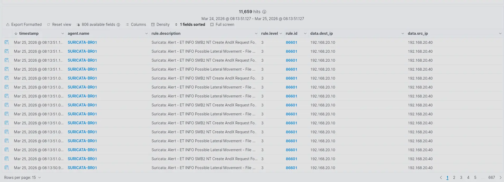

### Wazuh — PC01 (HIDS)

The Wazuh agent on PC01 should surface alerts triggered by the credentialed scan probing the workstation locally:

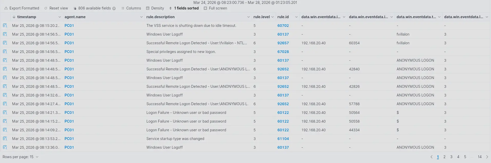

### Wazuh — DC01 (HIDS)

The Wazuh agent on DC01 should similarly alert as Nessus authenticates and enumerates the domain controller:

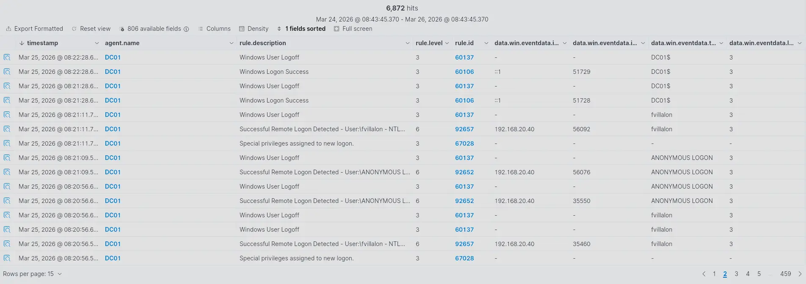

---

## Scan Results

Once the scan completes, Nessus presents a full breakdown of findings grouped by severity — **Critical**, **High**, **Medium**, **Low**, and **Info**. These results form the basis for prioritising remediation work across the lab.

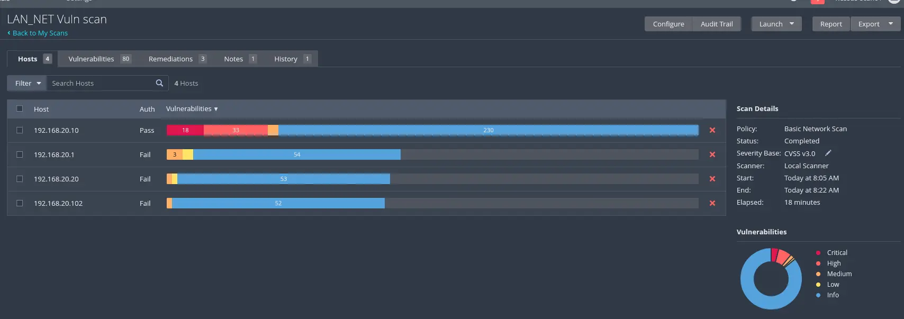
