# PC01

PC01 is a domain-joined Windows 11 workstation residing in LAN_NET. It represents a standard end-user endpoint and is intentionally kept in an unpatched state to facilitate attack simulation scenarios.

---

## VM Hardware Configuration

| Feature     | Configuration                    |
| :---------- | :------------------------------- |
| **OS**      | Windows 11 Pro 22H2 (22621.4108) |
| **vCPU**    | 2                                |
| **RAM**     | 4 GB                             |
| **Disk**    | 64 GB                            |
| **Network** | `LAN_NET` (DHCP)                 |

---

## Windows 11 Installation

### Obtaining the ISO

Download the ISO from UUPdump using the following link: [Windows 11, version 22H2 (22621.4108) amd64, English (United States)](https://uupdump.net/selectedition.php?id=abcb6f67-a9a4-42f7-a612-ffaaf3098ec4&pack=en-us)

> [!IMPORTANT]
> It is important to use a build of Windows prior to the January 2025 Patch Tuesday. This machine is intentionally kept in a vulnerable state to facilitate attack simulation scenarios later in the lab.

### Installation

> [!NOTE]
> Before starting the VM, ensure the NIC is **not attached** in VirtualBox settings. This prevents Windows from automatically downloading updates during the installation wizard.

1. Boot the VM from the ISO and click through the **country** and **keyboard** selection screens
2. When prompted to connect to the internet, press **Shift + F10** to open a command prompt and run:

```cmd
OOBE\BYPASSNRO
```

The VM will reboot and return to the setup wizard with an option to proceed without internet.

3. Set **Country** to Singapore
4. Set **Keyboard** layout
5. When prompted to connect to the internet, click **"I don't have internet"** → **"Continue with limited setup"**
6. Set the username to `PC01user` — this local account will go largely unused once the machine is joined to the domain
7. Set the password to `P@ssw0rd123` or any temporary throwaway password
8. For security questions, we can mostly ignore this. For this lab, just select any questions and set the answer to anything you like. This lab I will just set the answer to my name `francis`.
9. Click through the remainder of the wizard

### Disabling Windows Updates

Once on the desktop, immediately pause and disable Windows Updates before attaching the NIC:

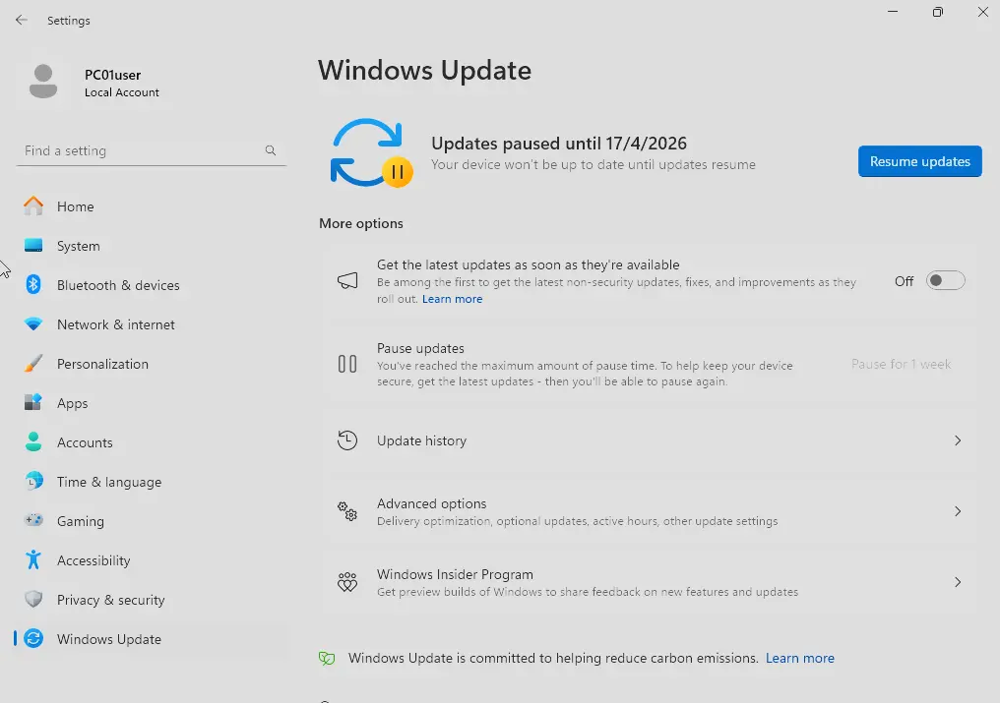

> [!IMPORTANT]
> Do not skip this step. Failing to disable updates before attaching the NIC may result in the machine automatically patching itself, which would undermine the intentionally vulnerable state required for attack simulation.

### Taking a Snapshot

Shut down the machine and take a VirtualBox snapshot of the current clean state. This allows rollback in the event that an update is accidentally installed or the machine is compromised during a simulation.

### Attaching the NIC

Once the snapshot is taken, attach the NIC to **LAN_NET** in VirtualBox settings:

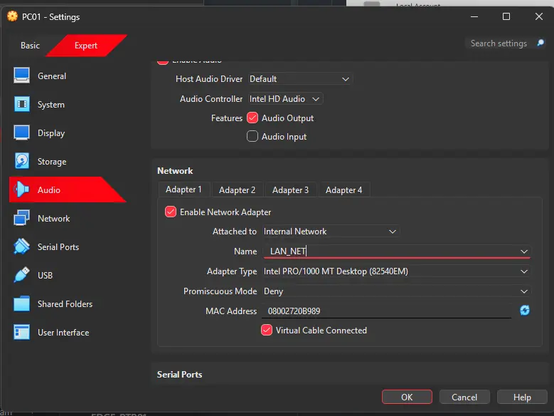

---

## Joining the Domain

### Verifying the DHCP Lease

Before joining the domain, verify that the DNS server assigned by DHCP is pointing to DC01 (`192.168.20.10`). This is required for PC01 to locate the LDAP and Kerberos SRV records needed for a successful domain join.

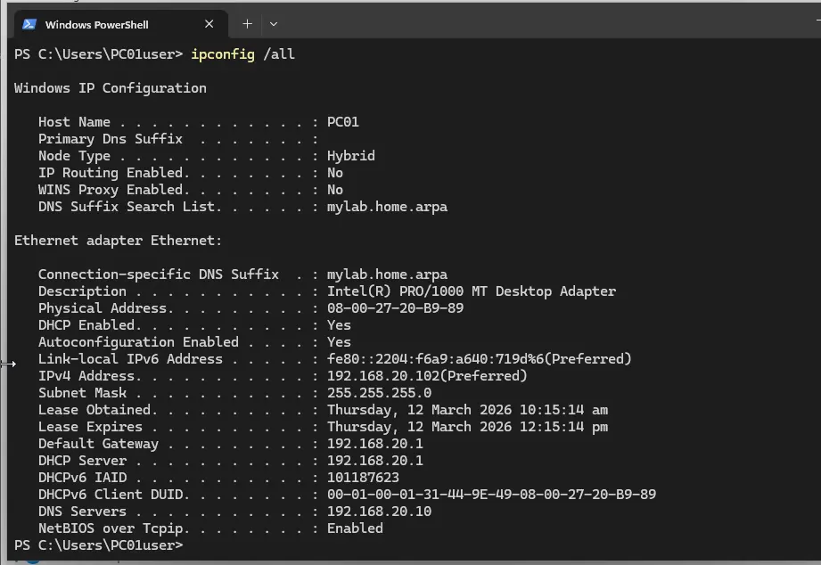

> [!NOTE]
> If the DNS server shows `192.168.20.1` (pfSense) instead of `192.168.20.10` (DC01), refer to the DNS configuration section in **PFSENSE-FW01.md** — specifically disabling the DNS Resolver, enabling the DNS Forwarder, and setting DC01's IP as the DHCP DNS server. Then run the following on PC01 to obtain a fresh lease:
>
> ```powershell
> ipconfig /release
> ipconfig /flushdns
> ipconfig /renew
> ```

### Verifying DNS Resolution

Once the correct DNS server is confirmed, verify that `lab.internal` resolves correctly:

```powershell
nslookup lab.internal
```

The output should return `192.168.20.10`. The "Unknown" server name is expected — it simply means no reverse DNS PTR record has been configured for DC01 yet. This will be set up during the SIEM deployment phase.

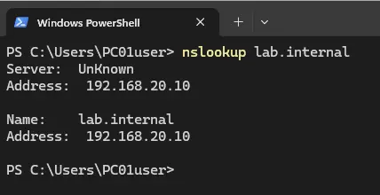

### Joining the Domain

1. **Settings** → search **"Access work or school"** → **Connect** → **"Join this device to a local Active Directory domain"**
2. Enter `lab.internal`

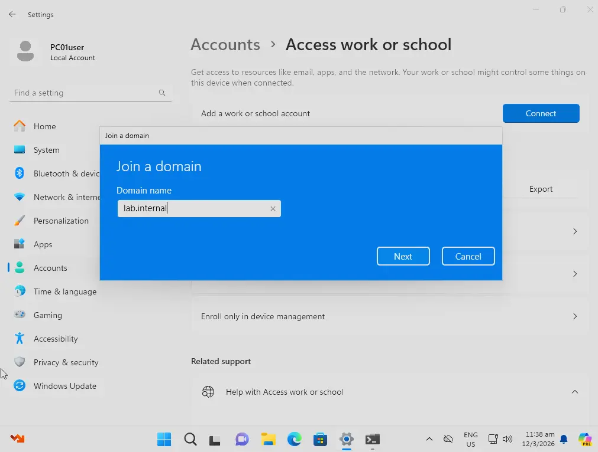

3. When prompted for credentials, log in with the domain admin account (`LAB\fvillalon` or whichever domain admin account was created in the DC01 documentation)

> [!NOTE]
> Joining a domain requires permission to create a computer object in Active Directory. By default, only domain admins or accounts with delegated permissions have this right — standard user accounts cannot join machines to the domain.

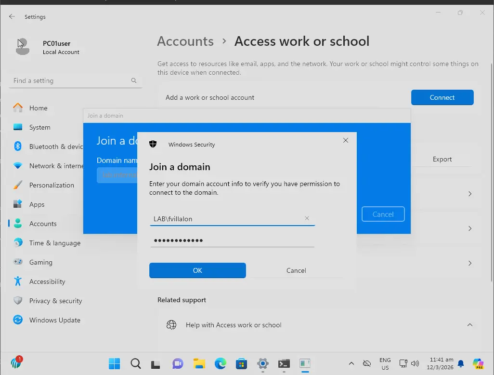

4. When prompted to add the account that will use this machine, add the standard user (`LAB\jane.doe` or whichever standard user was created in the DC01 documentation) and set the account type to **Standard User**

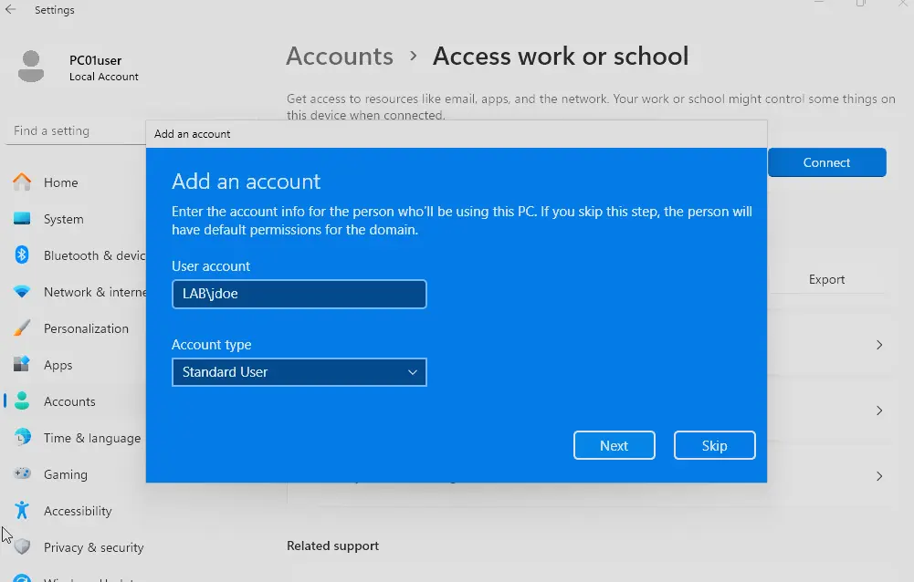

5. Restart the machine when prompted to apply the configuration

---

## First Login

After the reboot, log in to the `jane.doe` account using the initial password set in DC01. This will prompt a mandatory password change on first logon — set the new password to `P@ssw0rd123`.

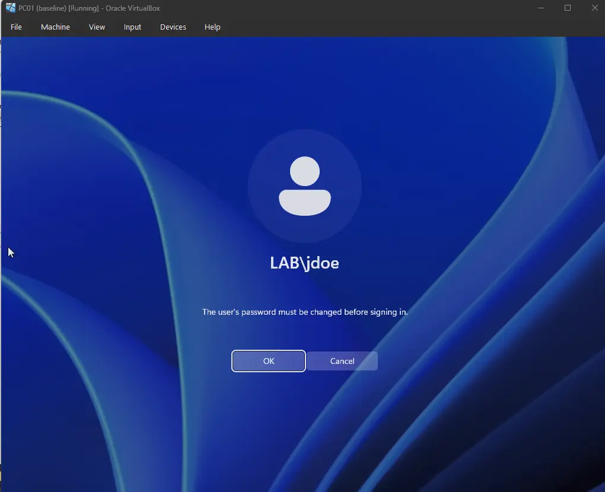

If all goes well, PC01 is now domain-joined and accessible via `jdoe@lab.internal`.

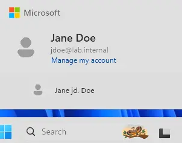

---

## Installing Sysmon & Wazuh Agent

To install these tools, we first mount a shared folder to the VM. This simulates the enterprise practice of hosting security software installers and configs on an SMB share accessible to endpoints.

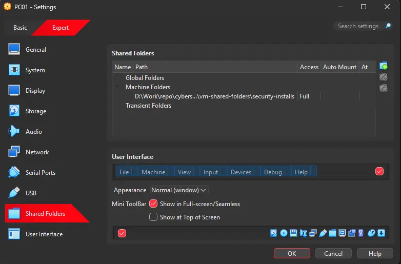

---

### Installing Sysmon

Navigate to the shared folder and install Sysmon using the SwiftOnSecurity config:

```powershell
# Navigate to the shared folder
cd \\VBOXSVR\security-installs

# Install Sysmon with SwiftOnSecurity config
.\Sysmon-install\Sysmon64.exe -accepteula -i .\sysmon-config\sysmonconfig-export.xml

# Verify Sysmon is running
Get-Service Sysmon64
```

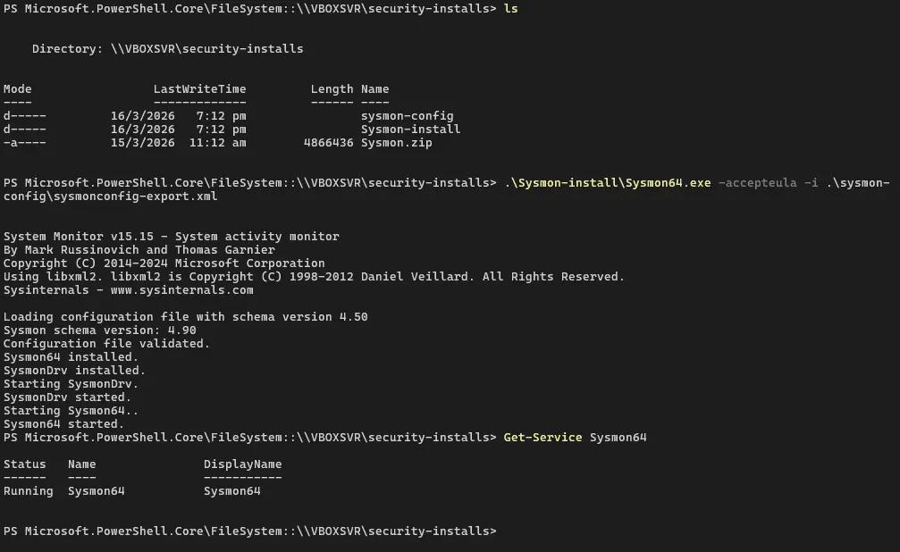

---

### Installing the Wazuh Agent

Generate the agent deployment command from the Wazuh dashboard (`wazuh.lab.internal`) and run it in a privileged terminal on PC01.

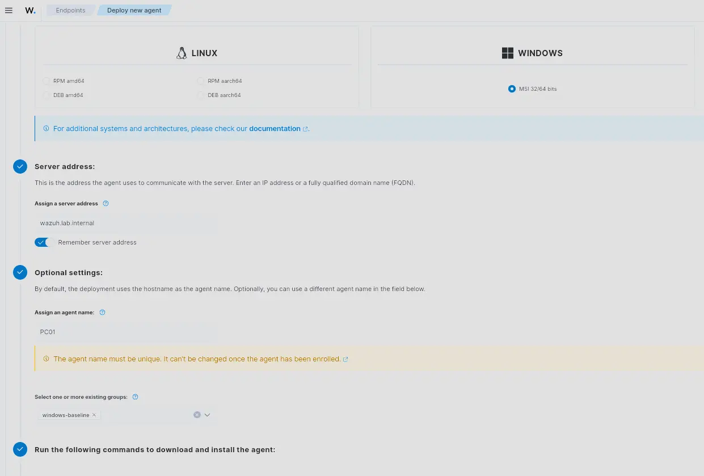

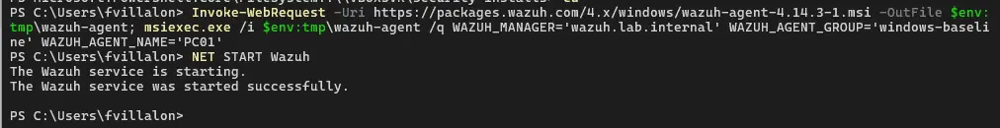

---

### Verifying the Installation

In the Wazuh dashboard, confirm that PC01 appears as a new agent assigned to the correct group.

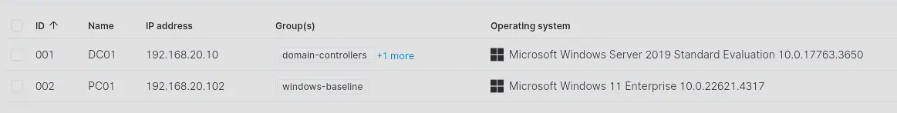

To confirm Sysmon logs are being ingested, navigate to the PC01 agent dashboard → **Threat Hunting** → **Events** and run the following query:

```
rule.groups:sysmon
```

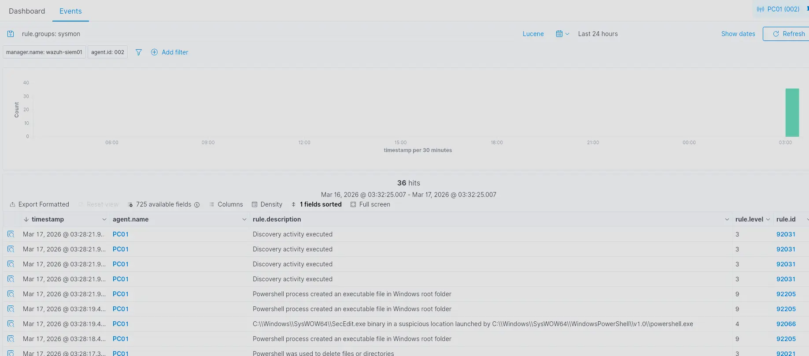