# PFSENSE-FW01

PFSENSE-FW01 is the primary security gateway for the lab. It sits between DMZ_NET and LAN_NET, enforcing inter-zone firewall policies and providing DHCP services to LAN_NET clients.

---

## VM Hardware Configuration

| Feature     | Configuration                |
| :---------- | :--------------------------- |
| **OS**      | pfSense (FreeBSD)            |
| **RAM**     | 2 GB                         |
| **vCPU**    | 1 Core                       |
| **Disk**    | 16 GB                        |
| **NIC 1**   | `DMZ_NET` (Internal Network) |
| **NIC 2**   | `LAN_NET` (Internal Network) |


---

## Installation

### WAN Interface Assignment

The installation wizard prompts for WAN interface selection. Match the MAC address shown
in the wizard against the NIC intended for the WAN-facing segment. In this lab, `em0`
corresponds to the DMZ-facing NIC and is selected as WAN.


### WAN Network Mode Configuration

The wizard then prompts for the WAN network operation mode. The default is DHCP, which
is not suitable here as EDGE-RTR01 does not provide DHCP services on DMZ_NET. Static
addressing is required.

| Setting             | Value             |
| :------------------ | :---------------- |
| **Interface Mode**  | Static            |
| **VLAN Tagging**    | Disabled          |
| **IP Address**      | `192.168.10.4/24` |
| **Default Gateway** | `192.168.10.3`    |
| **DNS Server**      | `192.168.10.3`    |


### LAN Interface Assignment

The wizard prompts for LAN interface selection. Since PFSENSE-FW01 has only two NICs,
`em1` is the only remaining option and is automatically selected as LAN.

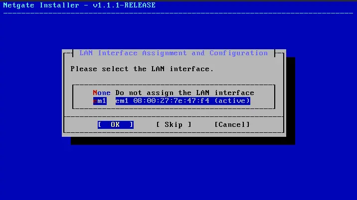

### LAN Network Mode Configuration

| Setting               | Value             |
| :-------------------- | :---------------- |
| **Interface Mode**    | Static            |
| **VLAN Tagging**      | Disabled          |
| **IP Address**        | `192.168.20.1/24` |
| **DHCPD Enabled**     | Yes               |
| **DHCPD Range Start** | `192.168.20.100`  |
| **DHCPD Range End**   | `192.168.20.199`  |


> [!NOTE]
> The DHCP range begins at `192.168.20.100` to reserve `192.168.20.1–192.168.20.99`
> for statically assigned devices. Assets such as DC01 require a fixed IP address and
> must fall outside the dynamic range.

This concludes the pfSense installation wizard.

---

## Web-Based Setup Wizard

After the installation wizard, the web-based setup wizard must be completed at `https://192.168.20.1`.

Since DC01 has not yet been provisioned, ATTACKER01 is temporarily connected to `LAN_NET` to access the pfSense web UI. Configuring this connection follows the similar steps as establishing ATTACKER01's `WAN_NET` connection — refer to [ATTACKER01](ATTACKER01.md) for those steps and adjust them for `LAN_NET`.

> [!NOTE]
> The configuration below was completed prior to DC01 being provisioned. Fields such as the firewall domain name and NTP server hostname are left as placeholders and will be updated once Active Directory is established.

---

### Welcome & Support Registration

The wizard opens with a welcome screen followed by a Netgate support registration page. Both are skipped.

---

### General Information

| Setting                  | Value             |
| :----------------------- | :---------------- |
| **Hostname**             | `PFSENSE-FW01`    |
| **Domain**               | `mylab.home.arpa` |
| **Primary DNS Server**   | `192.168.10.3`    |
| **Secondary DNS Server** | —                 |


> [!NOTE]
> The domain is left as a placeholder and will be updated to `pfsense.lab.internal` once DC01 is
> provisioned. The Primary DNS Server is set to EDGE-RTR01 (`192.168.10.3`) as this field
> defines the DNS server used for pfSense's own operations — package updates, NTP lookups,
> etc. — not the DNS handed out to LAN clients. DC01 will be configured as the LAN client
> DNS server separately in the DHCP server settings.

---

### Time Server

The NTP hostname is left as default. The timezone is set to **Asia/Singapore**. DC01 will
be configured as the authoritative time source in a later phase.


---

### WAN Interface

The WAN interface settings are pre-populated from the installation wizard. Values are
reviewed and confirmed with no changes required.


---

### LAN Interface

The LAN interface settings are pre-populated from the installation wizard. Values are
reviewed and confirmed with no changes required.

---

### Admin Password

The admin password is set to `P@ssw0rd123`.

---

### Reload & Complete

pfSense reloads to apply all configurations. The setup wizard is complete.

---

## Further Configuration After DC01

Now that DC01 is provisioned, all endpoints in LAN_NET must use DC01 as their DNS server. DNS queries that DC01 cannot resolve locally should be forwarded to pfSense, which then forwards them upstream to EDGE-RTR01.

This requires changes to pfSense's DNS and DHCP configuration.

### Disable DNS Resolver

The DNS Resolver causes pfSense to act as a full recursive DNS server — it resolves everything itself, ignores the DHCP DNS setting, and assigns its own LAN IP (`192.168.20.1`) as the DNS server in every DHCP lease granted to endpoints. This must be disabled.

1. Navigate to the pfSense web interface at `https://192.168.20.1`
2. Go to **Services → DNS Resolver**
3. Uncheck **Enable DNS Resolver** → **Save**


---

### Set DC01 as the DHCP DNS Server

With the DNS Resolver disabled, configure the DHCP server to hand out DC01's IP as the DNS server for all LAN clients.

1. Go to **Services → DHCP Server → LAN**
2. Under **DNS Servers**, set the first entry to `192.168.20.10`
3. Edit the **Domain Name** under Other DHCP options to be `lab.internal`
4. **Save** and **Apply Changes**

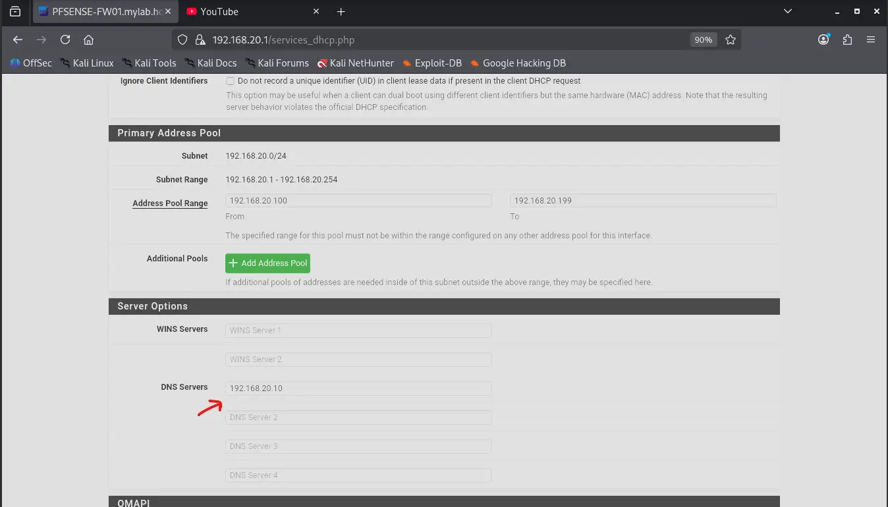
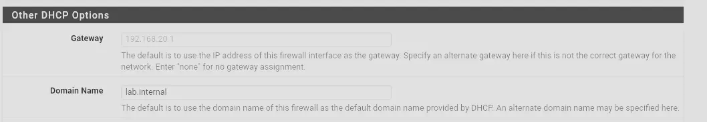

---

### Enable DNS Forwarder

The DNS Forwarder replaces the DNS Resolver as a lightweight pass-through service. Rather than resolving queries itself, it simply forwards them upstream to EDGE-RTR01. Notably, pfSense uses **dnsmasq** under the hood for this — the same tool configured on EDGE-RTR01.

1. Go to **Services → DNS Forwarder**
2. Check **Enable DNS Forwarder**
3. Under **Interfaces**, select **LAN** only — there is no reason to listen on the WAN interface
4. **Save**


---

### Update Domain Name

Before adding PFSENSE-FW01 as a DNS forwarder, its domain name should be updated from the placeholder set during initial setup to a name consistent with the `lab.internal` namespace. This is also required for adding a reverse lookup PTR record for this device in DC01's DNS.

1. Navigate to the pfSense web interface at `https://192.168.20.1`, using a device connected to `LAN_NET`. ATTACKER01 is used here for now.
2. Go to **System → General Setup**
3. Change **Domain** from `mylab.home.arpa` to `pfsense.lab.internal`
4. **Save**

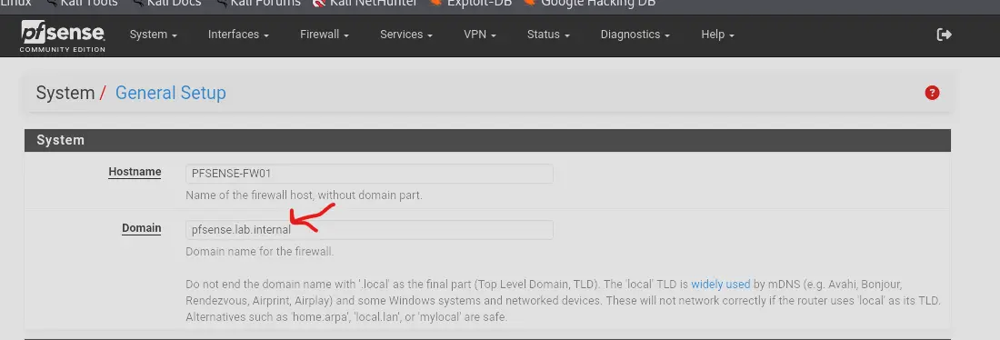

---

## Syslog Forwarding to Wazuh

To provide Wazuh with visibility into PFSENSE-FW01 and ingest essential logs — including `filterlog` firewall events.

### Architecture

pfSense's built-in syslogd forwards logs to syslog-ng on the local loopback. syslog-ng rewrites the hostname and forwards to WAZUH-SIEM01 over TCP.

```
pfSense syslogd → 127.0.0.1:5140 (loopback, UDP) → syslog-ng → 192.168.20.20:514 (TCP) → Wazuh
```

Wazuh must be configured first to open the listener before pfSense begins forwarding.

---

### Configuring Wazuh to Accept Syslog

Wazuh must be configured to accept incoming syslog on a network port. SSH into WAZUH-SIEM01 or access the device directly, then:

1. Switch to a superuser: `sudo su -`
2. Navigate to `/var/ossec/etc`
3. Edit `ossec.conf` and add the following `<remote>` block:

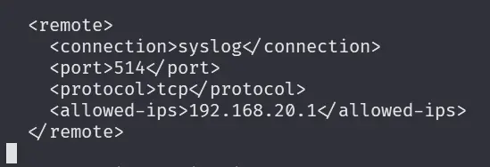

4. Save and restart the Wazuh manager:

```bash
systemctl restart wazuh-manager
```

This configures Wazuh to accept syslog from PFSENSE-FW01.

Additionally, enable `<logall>` and `<logall_json>` in `ossec.conf`. This writes all received events to `archives.log` regardless of whether they match a rule — useful for verifying that logs are arriving at Wazuh at all.

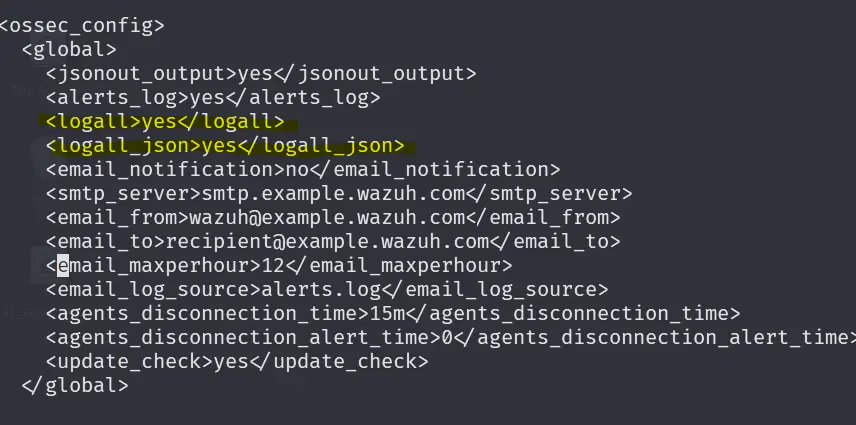

---

### Installing Packages

Install the following packages on PFSENSE-FW01 via **System → Package Manager → Available Packages**:

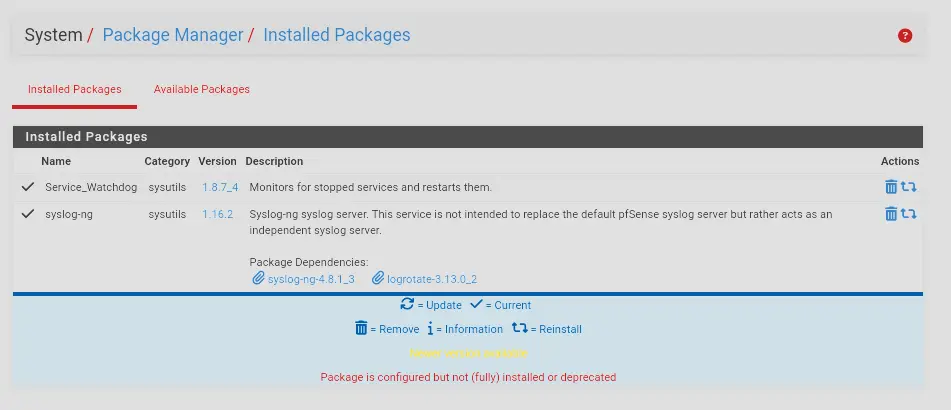

- **Watchdog** — monitors services and automatically restarts them if they go down. We will add `syslogd` and `syslog-ng` to its watch list.
- **syslog-ng** — an enhanced syslog daemon that replaces the forwarding role of the built-in syslogd. It supports TCP transport, hostname rewriting, and disk buffering — all of which are critical for reliable log forwarding to WAZUH-SIEM01.

---

### Configuring Watchdog

Navigate to **Services → Service Watchdog** and add two services: `syslogd` and `syslog-ng`. Watchdog checks approximately every minute and restarts any service that is no longer running.

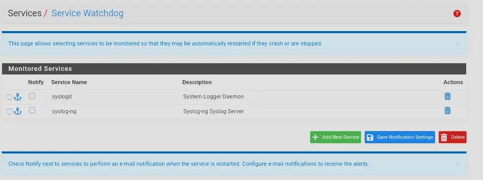

---

### Configuring syslogd

Navigate to **Status → System Logs → Settings** and set the following:

- **Log Message Format:** BSD (RFC 3164, default)
- Check everything under **Logging Preferences**

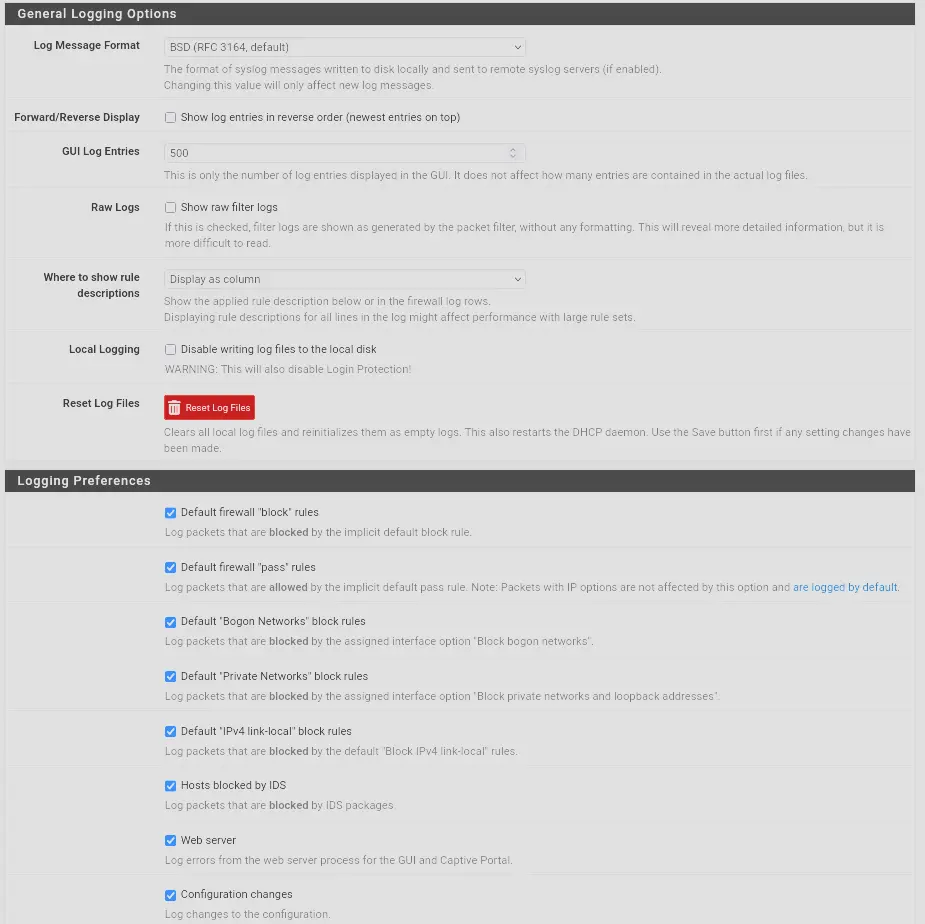

Then under **Remote Logging Options**:

- Enable remote logging
- Set the remote log server to `127.0.0.1:5140` — syslog-ng will be listening on this loopback port
- Check the desired entries under **Remote Syslog Contents**

> [!NOTE]
> There is an option to check everything under Remote Syslog Contents. However, this behaves erratically. If checking everything does not forward all expected log types, manually check each category individually.

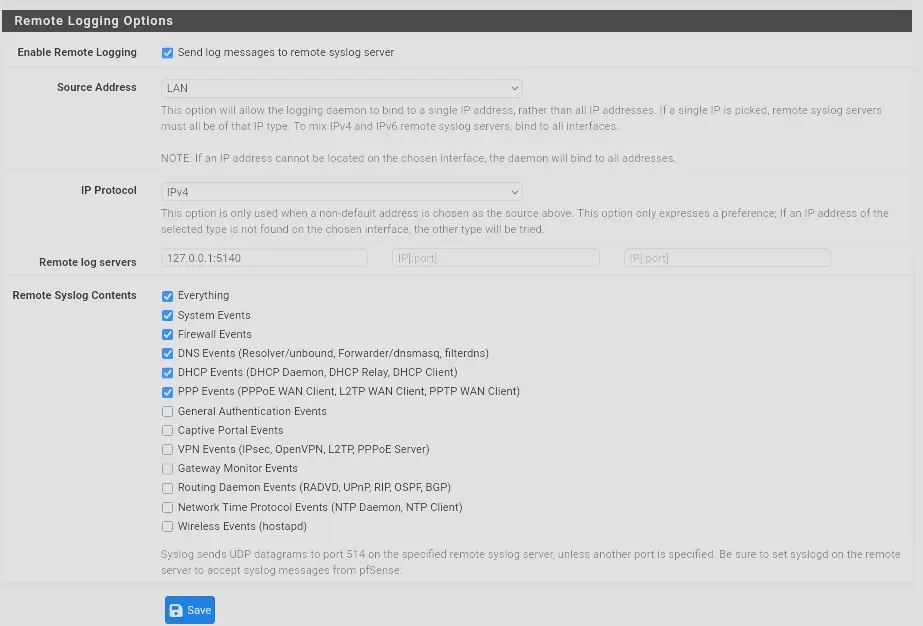

---

### syslog-ng

#### Why Use syslog-ng Alongside syslogd?

The issue with the built-in syslogd is that it forwards syslogs purely over UDP and silently fails after wazuh-manager restarts. The likely cause is ICMP port unreachable.

When wazuh-manager restarts, no service is listening on the UDP port that pfSense is forwarding logs to. PFSENSE-FW01 does not stop sending, so WAZUH-SIEM01 responds to the incoming UDP packets with ICMP port unreachable messages. pfSense's syslogd interprets this as the destination being dead and stops sending logs entirely. From the outside it just looks like syslogd is silently failing — a frustrating issue since log forwarding should intuitively survive a Wazuh restart.

The only recovery is to restart syslogd or re-save the remote logging config in the pfSense web interface, meaning every wazuh-manager restart requires manual intervention on pfSense to resume log forwarding.

#### How syslog-ng Fixes This

Instead of syslogd forwarding logs directly to Wazuh, syslog-ng takes over that role. This has several advantages:

- Logs can be rewritten before forwarding — useful for injecting a hostname so Wazuh correctly attributes events to `pfsense.lab.internal`
- syslog-ng forwards over TCP and automatically retries the connection when Wazuh goes down momentarily
- syslog-ng buffers logs to the filesystem when the destination is unreachable and replays them once it comes back up, so logs are not lost during outages

This allows wazuh-manager to be restarted freely without manual intervention on pfSense.

#### Configuring syslog-ng

Navigate to **Services → syslog-ng → General** and set the following:

- **Interface selection:** Loopback — syslog-ng listens on this interface for logs forwarded by syslogd
- **Default protocol:** UDP — syslogd only forwards over UDP, so syslog-ng must accept on UDP
- **Default port:** `5140` — must match the destination port set in syslogd's remote logging config
- **Include SCL:** Checked — SCL (System Configuration Library) is a collection of pre-built syslog-ng config modules that reduces boilerplate, useful when adding additional destinations such as an ELK stack later

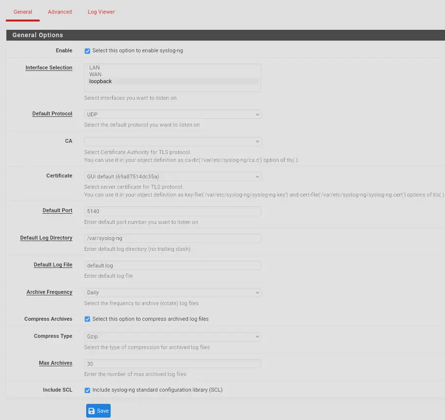

Then navigate to **Advanced** and create the following objects:

**Rewrite object — `REWRITE_HOSTNAME`**
Sets the hostname field to `pfsense.lab.internal` on all forwarded logs. pfSense's syslogd omits the hostname from outgoing syslog messages, so this rewrite ensures Wazuh correctly identifies the log source.

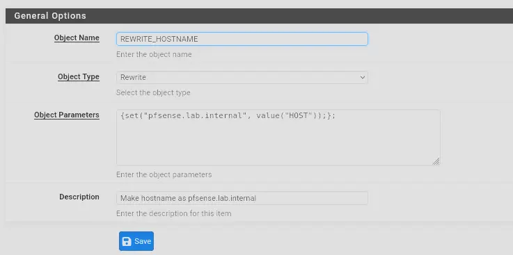

**Destination object — `WAZUH-SIEM01`**
Defines the forwarding target. Set `transport` to `tcp` and include `time_reopen(1)` so the connection is retried every second if Wazuh goes down. `disk-buffer` is enabled so logs are held in a buffer and replayed to Wazuh once it comes back up rather than being dropped. On pfSense, this buffer is written to the RAM-backed filesystem, so it survives syslog-ng crashes but not a full reboot.

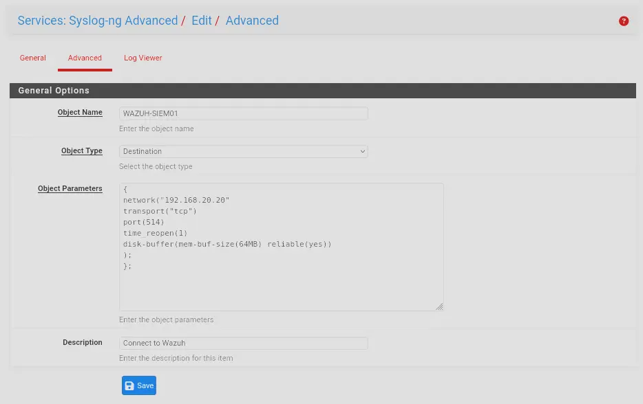

**Log object — `LOG_WAZUH_FORWARD`**
Ties everything together. This defines the pipeline: default source → `REWRITE_HOSTNAME` → `WAZUH-SIEM01`. All logs received from syslogd have their hostname rewritten and are forwarded to Wazuh over TCP.

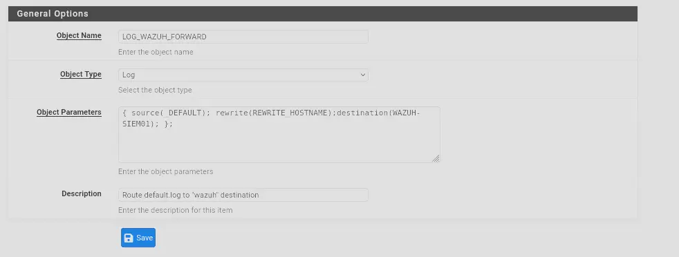

---

### Verifying Logs Are Flowing

To verify that Wazuh is receiving pfSense logs, run:

```bash
tail -f /var/ossec/logs/archives/archives.log | grep pfsense
```

pfSense logs should appear as shown below.

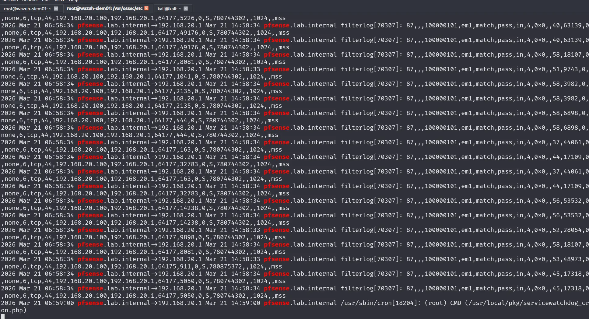

If no logs appear, generate traffic by running an Nmap scan from a machine on `LAN_NET` targeting PFSENSE-FW01. ATTACKER01 is used here for demonstration:

```bash
nmap -sS 192.168.20.1
```

This produces a burst of traffic from the scanning machine to PFSENSE-FW01, which should trigger firewall rule hits and appear as `filterlog` entries in Wazuh.

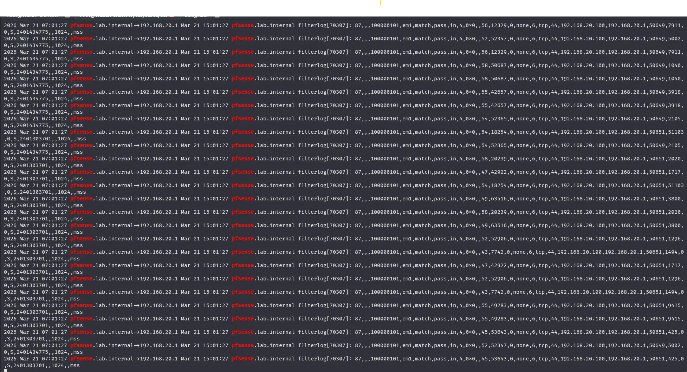

---

### Verifying Log Decoding

Wazuh ships with a built-in decoder for pfSense `filterlog` entries — no custom decoder is needed. To verify it is working, take a log line from `archives.log` and pipe it into `wazuh-logtest`.

> [!NOTE]
> Each entry in `archives.log` is prepended with a Wazuh archive header (e.g. `2026 Mar 21 07:12:30 pfsense.lab.internal→192.168.20.1`). This header must be stripped — only pass the raw syslog line that follows it.

```bash
echo "Mar 21 15:12:29 pfsense.lab.internal filterlog[70307]: 82,,,1000002661,em0,match,pass,out,4,0xb8,,64,21719,0,none,17,udp,76,192.168.10.4,172.237.88.124,123,123,56" | /var/ossec/bin/wazuh-logtest
```

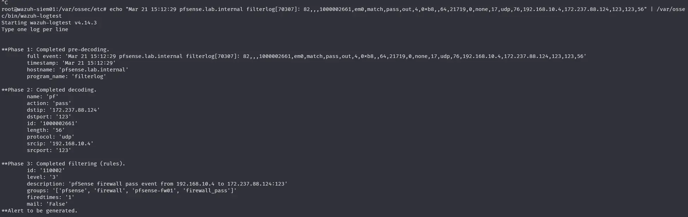

The key phases to check in the output:

- **Phase 1 — Pre-decoding:** Parses the standard syslog envelope to extract the timestamp, hostname, and program name. Wazuh uses the program name to select the appropriate decoder. Confirm that `filterlog` is identified correctly here.
- **Phase 2 — Decoding:** The built-in `pf` decoder fires and extracts field values from the `filterlog` payload. If fields such as `action`, `srcip`, `dstip`, `srcport`, `dstport`, and `protocol` are populated correctly, the decoder is working and Wazuh will generate alerts for these logs.

---
