# SURICATA-BR01

SURICATA-BR01 is the network intrusion detection sensor for the lab. It sits inline on LAN_NET as a Linux bridge, meaning all traffic passing through it is transparently forwarded. Suricata listens on the bridge interface (`br01`) and writes alerts to `eve.json`, which are forwarded to WAZUH-SIEM01 for analysis.

## VM Hardware Configuration

| Feature     | Configuration                          |
| :---------- | :------------------------------------- |
| **OS**      | Ubuntu Server 22.04.5                  |
| **vCPU**    | 2                                      |
| **RAM**     | 4 GB                                   |
| **Disk**    | 50 GB                                  |
| **Network** | `LAN_NET` (Static IP: `192.168.20.30`) |

> [!IMPORTANT]
> In VirtualBox, one NIC must be attached to **PFSENSE_LAN_NET** and the other to **LAN_NET**. This split is intentional — it's a workaround for a VirtualBox limitation that forces all traffic through the Linux bridge on SURICATA-BR01 before it reaches the rest of LAN_NET.

---

## OS Installation & Configuration

### Network Configuration (Netplan)

Set a static IP before doing anything else. This follows the same approach as other Linux machines in the lab — configured via Netplan.

```bash
sudo su -

cd /etc/netplan

# File name prefix determines load order — use a number lower than any existing configs
touch 01-SURICATA-BR01-config.yaml
chmod 600 01-SURICATA-BR01-config.yaml

netplan apply

# Verify
ip a
resolvectl status
```

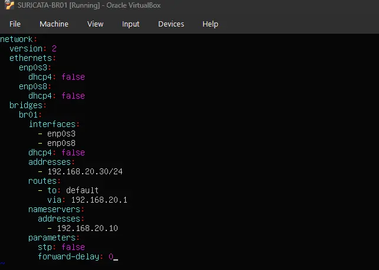

**Configuration Summary:**

| Interface | Segment | IP Address         | Gateway        | DNS Server      |
| :-------- | :------ | :----------------- | :------------- | :-------------- |
| `br01`    | LAN_NET | `192.168.20.30/24` | `192.168.20.1` | `192.168.20.10` |

---

## Bridge Interface Setup

SURICATA-BR01 uses a Linux bridge (`br01`) as its primary interface. The two physical NICs are added as bridge members in Netplan — all traffic flowing between them passes through `br01`, which is where Suricata listens.

### Interface Assignment
**Promiscuous mode must be enabled on both NICs.** Without it, VirtualBox will only deliver frames addressed directly to each NIC's MAC address — the bridge will never see traffic it needs to forward, and Suricata will miss everything. Set each NIC to **Allow All** under the Advanced network settings in VirtualBox.

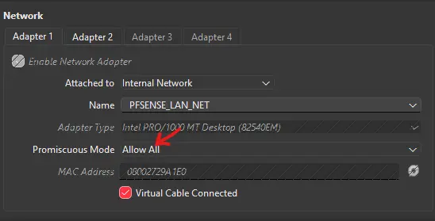

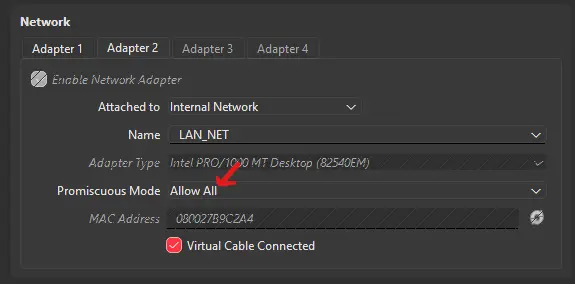

> [!IMPORTANT]
> SURICATA-BR01's two NICs are attached to **different** VirtualBox internal networks — one to **PFSENSE_LAN_NET** and the other to **LAN_NET**. This is intentional: VirtualBox does not allow a single internal network to be bridged transparently, so splitting across two named networks is what forces all traffic through the Linux bridge on SURICATA-BR01 before it reaches the rest of LAN_NET.


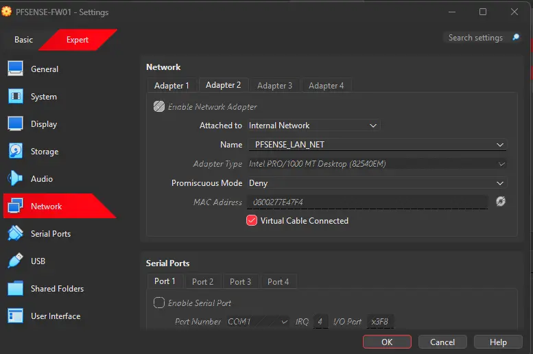

---

### Disabling br_netfilter

The `br_netfilter` kernel module causes the kernel to pass bridge traffic through iptables before Suricata ever sees it. This can silently drop or alter packets, resulting in incomplete or inaccurate detections. We disable it so Suricata always sees the raw, unmodified traffic on the wire.

The sysctl.conf changes below are only needed if `br_netfilter` is currently loaded.

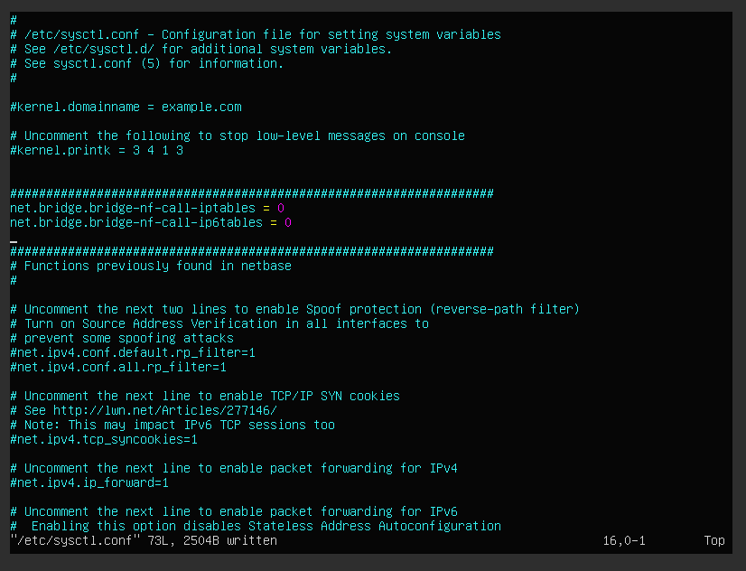

```bash
# Load the module first so the sysctl keys exist
sudo modprobe br_netfilter

# Disable bridge traffic from being processed by iptables
sudo sysctl -w net.bridge.bridge-nf-call-iptables=0
sudo sysctl -w net.bridge.bridge-nf-call-ip6tables=0

# Persist the changes
sysctl -p

# Unload the module
sudo modprobe -r br_netfilter

# Blacklist it from loading on boot
echo "blacklist br_netfilter" | sudo tee /etc/modprobe.d/no-bridge-nf.conf
```

---

## DNS Registration in DC01

### Adding the A Record and PTR

1. Open **DNS Manager** on DC01
2. Expand **DC01** → **Forward Lookup Zones** → right-click **`lab.internal`** → **New Host (A or AAAA)**
3. Set the following values and check **"Create associated pointer (PTR) record"**

| Field    | Value           |
| :------- | :-------------- |
| **Name** | `suricata`      |
| **IP**   | `192.168.20.30` |

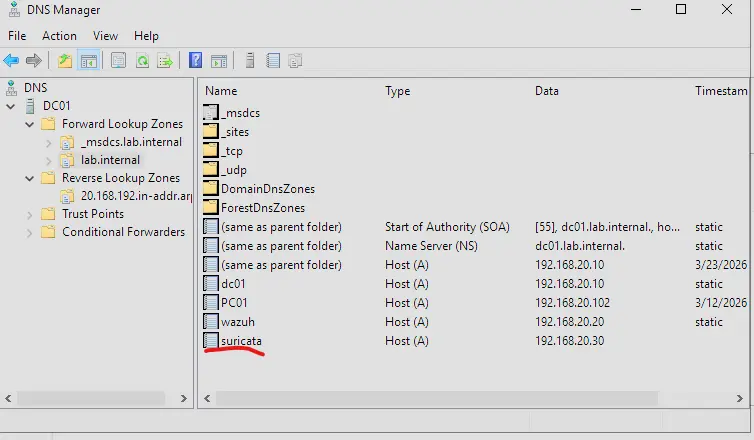

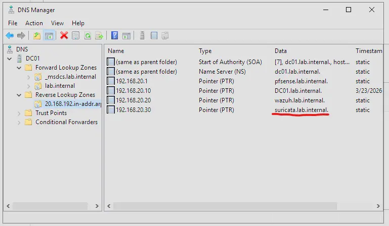

---

## Wazuh Agent Installation

Install the Wazuh agent and register it against the manager before installing Suricata. The `eve.json` log source is added to the agent config later via the `suricata` agent group.

```bash
wget https://packages.wazuh.com/4.x/apt/pool/main/w/wazuh-agent/wazuh-agent_4.14.3-1_amd64.deb && sudo WAZUH_MANAGER='wazuh.lab.internal' WAZUH_AGENT_GROUP='linux-baseline' WAZUH_AGENT_NAME='SURICATA-BR01' dpkg -i ./wazuh-agent_4.14.3-1_amd64.deb

sudo systemctl daemon-reload
sudo systemctl enable wazuh-agent
sudo systemctl start wazuh-agent
```

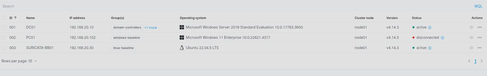

---

## Suricata Installation

Install Suricata from the OISF stable PPA, following the [official quickstart guide](https://docs.suricata.io/en/latest/quickstart.html).

```bash
sudo apt-get install software-properties-common
sudo add-apt-repository ppa:oisf/suricata-stable
sudo apt update
sudo apt install suricata jq
```

### Configuration

Edit `/etc/suricata/suricata.yaml` and set the following:

- Set the `af-packet` interface to `br01`
- Set `HOME_NET` to the LAN segment: `192.168.20.0/24`
- Add DC01 and DNS server addresses

```bash
# Confirm the bridge interface name before editing
ip a
```

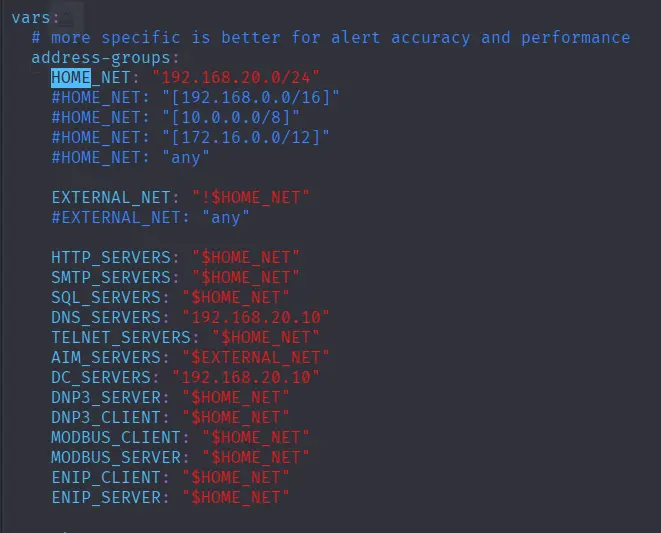

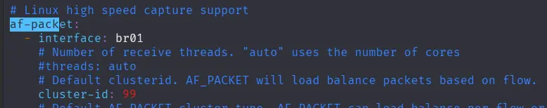

### Updating Rules

Run `suricata-update` to pull the latest ruleset before starting the service.

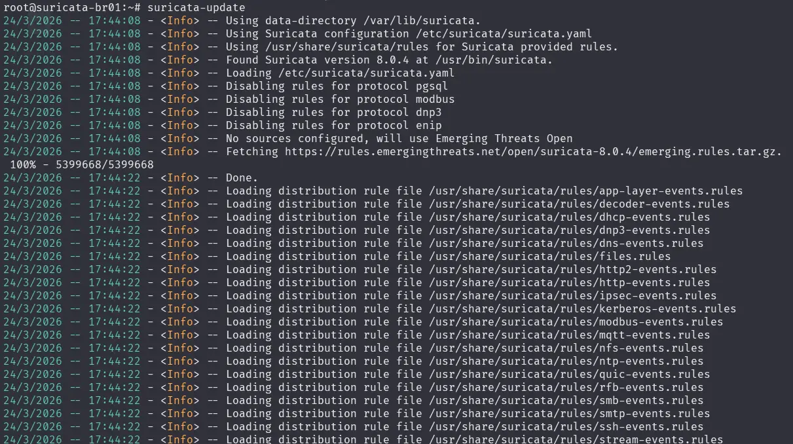

> [!NOTE]
> When suricata pulls these rules it is consolidated into a single suricata.rules file.
> You can find this by default in /var/lib/suricata/rules.

---

## Configuring Wazuh Agent to Ingest eve.json

With both Suricata and the Wazuh agent running, the agent needs to be told to monitor `eve.json` — this isn't configured by default.

Rather than editing the config directly on the machine, we create a dedicated agent group (`suricata`) so the configuration is centrally managed from the Wazuh dashboard. There's only one Suricata machine in this lab but it's still the right approach — it keeps all agent configuration in one place.

Navigate to **Agent Management → Groups** at `https://wazuh.lab.internal`:

1. Create a new group: `suricata`
2. Add `SURICATA-BR01` to the group
3. Edit the group's `agent.conf` and add:

```xml
<localfile>
  <log_format>json</log_format>
  <location>/var/log/suricata/eve.json</location>
</localfile>
```

---

## Handling the analysisd "Too Many Fields" Error

`eve.json` is verbose by default — HTTP events and DNS responses in particular produce deeply nested JSON with a large number of fields. Wazuh's analysisd enforces a hard cap on how many JSON fields it will parse per event, and with default settings it rejects these events entirely.

Two changes are needed to fix this:

**1. On WAZUH-SIEM01** — increase the analysisd field limit in `/var/ossec/etc/local_internal_options.conf`:

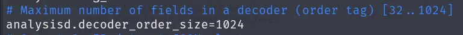

**2. On SURICATA-BR01** — reduce `eve.json` verbosity in `/etc/suricata/suricata.yaml` by trimming the HTTP and DNS output fields:

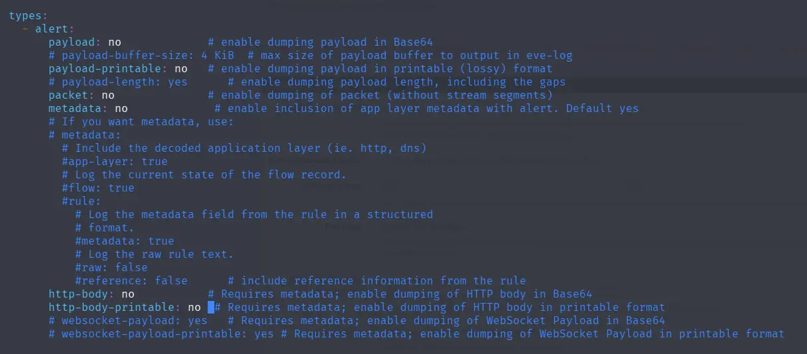

---

## Verifying eve.json Logs Reach Wazuh

Use the OISF test URL to trigger a known Suricata signature. Suricata should detect the request and generate an alert that appears in Wazuh.

```bash
curl http://testmynids.org/uid/index.html
```

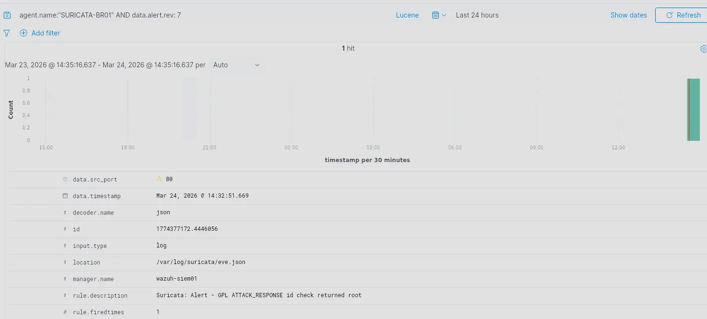

---

## Troubleshooting

### wazuh-agent Killed by systemd on Boot 

On boot, `wazuh-agent` can start before `br01` is fully up. The agent gets stuck trying to open a socket, and if systemd's `TimeoutStartSec` is short enough it interprets this as a failed start and kills the process.

The fix is a systemd override that:
- Waits for `br01` to be up before allowing the agent to start
- Automatically restarts the agent if it fails, with a 10-second delay between retries

```bash
systemctl edit wazuh-agent
```
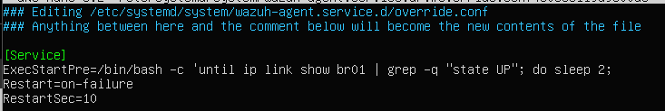

---

### 2-Minute Boot Delay

`systemd-networkd-wait-online` blocks the boot process until all managed interfaces reach an online state. Since `br01` takes time to form and may not satisfy its online criteria immediately, the service times out after its default 2-minute timeout — stalling the entire boot.

The fix is to pass `--any`, which unblocks boot as soon as *any* interface comes online rather than waiting for all of them.

Two changes are needed in the override — `ExecStart` must be cleared first before being overwritten, otherwise systemd appends to the existing value instead of replacing it:

```bash
systemctl edit systemd-networkd-wait-online.service
```

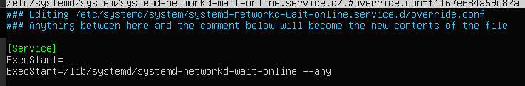
