# WAZUH-SIEM01

WAZUH-SIEM01 is the primary security monitoring server for the lab. It runs the Wazuh all-in-one stack and collects alerts from agents deployed across the environment.

## Understanding Wazuh
Wazuh has three central components which are `wazuh-manager`, `wazuh-indexer`, `wazuh-dashboard`.
We can think of it as a **collect** -> **store** -> **visualize** pipeline.
### Wazuh-manager
The `wazuh-manager` or `wazuh-server` is the component of Wazuh that analyses the data received from the agents. It processes the data through decoders and rules. The server is also capable of looking well-known IoCs using threat intelligence and can scale horizontally when set up as a cluster.

### Wazuh-indexer
`wazuh-indexer` is a highly scalable, full-text search and analytics engine built on `OpenSearch`.

### Wazuh-dashboard
`wazuh-dashboard` is the web user interface for data visualization and analysis. It is also used to manage wazuh configurations and to monitor its status. It was built on `OpenSearch Dashboards`.

### Wazuh-agents
`wazuh-agents` are installed on endpoints and they provide threat prevention, detection, and response capabilities. 

### General Workflow
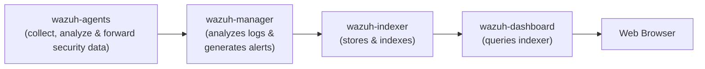

---

## VM Hardware Configuration

Wazuh documentation recommends the following specifications for environments with 1–25 agents.

### Specifications

| Feature     | Configuration                          |
| :---------- | :------------------------------------- |
| **OS**      | Ubuntu Server 22.04.5                  |
| **vCPU**    | 4                                      |
| **RAM**     | 8 GB                                   |
| **Disk**    | 50 GB                                  |
| **Network** | `LAN_NET` (Static IP: `192.168.20.20`) |

> [!IMPORTANT]
> In VirtualBox, the NIC must be attached to **LAN_NET**.

---

## OS Installation & Configuration

### Installation & Initial Updates

During the Ubuntu Server installation, use the following credentials:

| Field        | Value          |
| :----------- | :------------- |
| **Username** | `wazuh-siem01` |
| **Password** | `P@ssw0rd123`  |

### Network Configuration (Netplan)

Before doing anything else, set a static IP for this server. Similarly to EDGE-RTR01, this is done with Netplan.

```bash
# Need to be root
sudo su -

cd /etc/netplan

# Make sure this config is highest in the order
touch 01-WAZUH-SIEM01-config.yaml

# Manage permissions
chmod 600 01-WAZUH-SIEM01-config.yaml

# Apply netplan
netplan apply

# Verify
ip a
resolvectl status
```

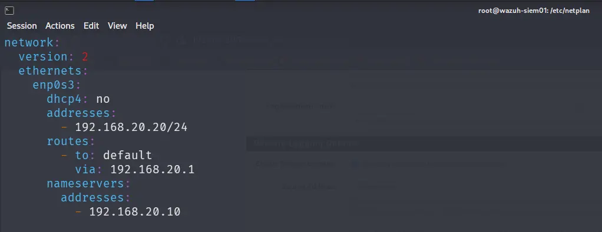


**Configuration Summary:**

| Interface | Segment | IP Address         | Gateway        | DNS Server      |
| :-------- | :------ | :----------------- | :------------- | :-------------- |
| `enp0s3`  | LAN_NET | `192.168.20.20/24` | `192.168.20.1` | `192.168.20.10` |

---

## DNS Registration in DC01

### Adding the A Record and PTR

1. Open **DNS Manager** on DC01
2. Expand **DC01** → expand **Forward Lookup Zones** → right-click **`lab.internal`** → **New Host (A or AAAA)**
3. Set the following values and check **"Create associated pointer (PTR) record"**

| Field    | Value           |
| :------- | :-------------- |
| **Name** | `wazuh`         |
| **IP**   | `192.168.20.20` |


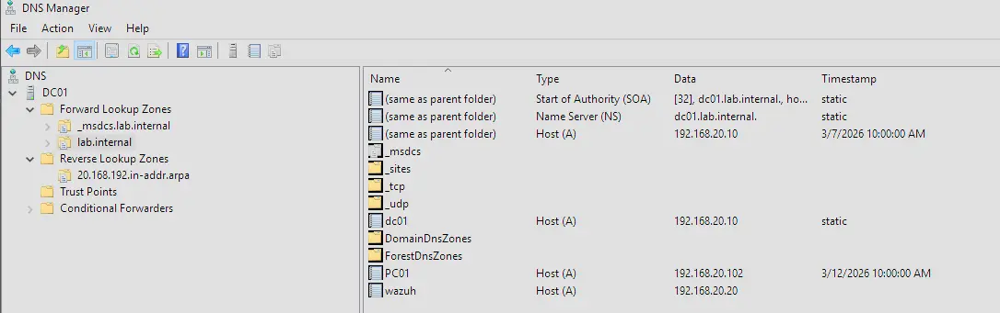
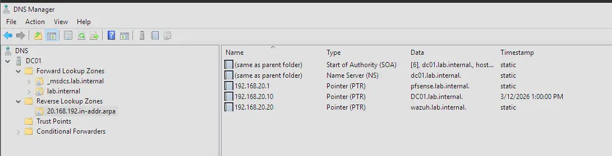

### Verifying the PTR Record

```bash
nslookup 192.168.20.20
# Expected: wazuh.lab.internal
```

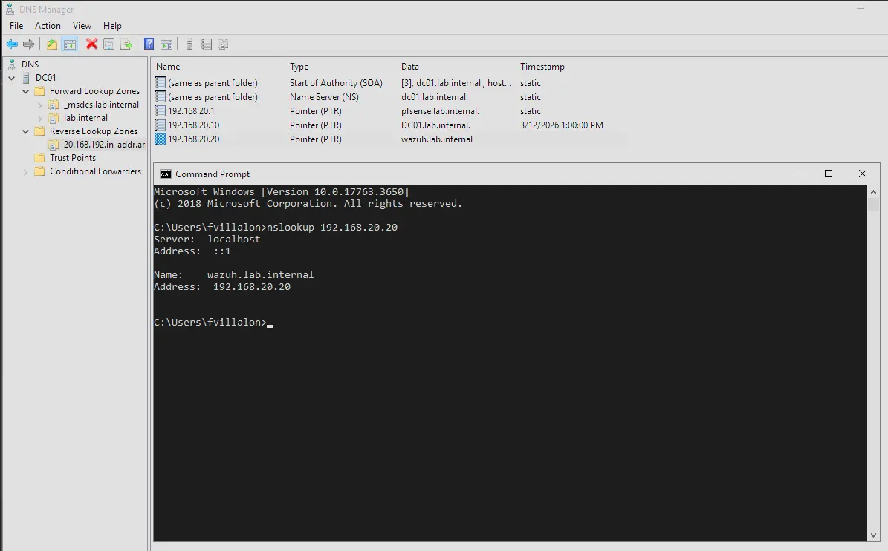

---

## Wazuh Installation

SSH into WAZUH-SIEM01 from the Kali machine to manage it. This makes it easier to copy/paste commands from the Wazuh quickstart documentation.

```bash
ssh wazuh-siem01@192.168.20.20

# OR

ssh wazuh-siem01@wazuh.lab.internal
```


Follow the steps described here: [Quickstart · Wazuh documentation](https://documentation.wazuh.com/current/quickstart.html)

Once complete, access the dashboard using the credentials below:

| Field        | Value                                  |
| :----------- | :------------------------------------- |
| **Username** | `admin`                                |
| **Password** | `6kN+Inwz2HU9GnTY*Fmt9DxshWLKTGbq`     |
| **URL**      | `https://wazuh.lab.internal/app/login` |


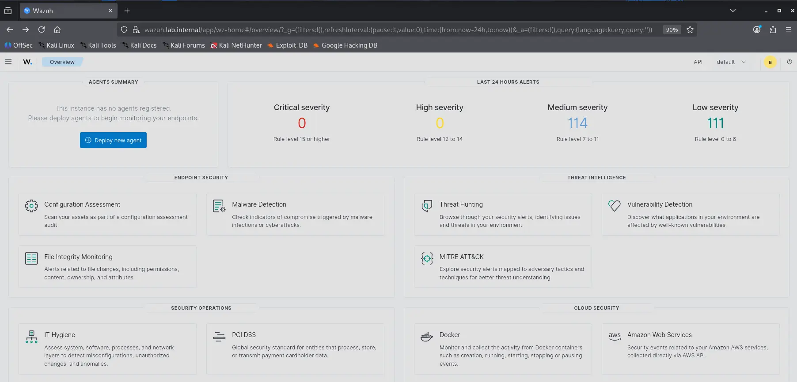

Additional, we are recommended to disable updates to wazuh that can break deployment.

```bash
sed -i "s/^deb /#deb /" /etc/apt/sources.list.d/wazuh.list
apt update
```


## Deploying Agents

Agents are deployed through the web interface at `https://wazuh.lab.internal/`. The UI walks through the process of deploying an agent on an endpoint by generating a custom install command that can be run directly on the target machine.

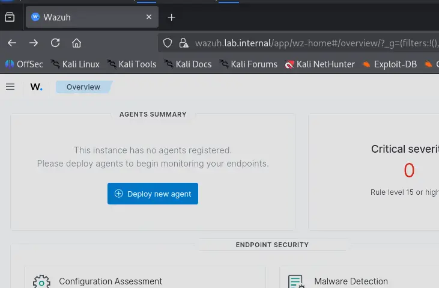

---

### Creating Agent Groups

Wazuh groups allow us to push a single configuration uniformly to all agents in that group. In the context of this lab, this is useful because rather than configuring each agent individually to ingest Sysmon logs, we can push a single `agent.conf` to all agents in the group at once.


We will create the following groups and assign the following memberships in this setup. Moving forward, as changes are introduced to infrastructure, a section in high-level design or the readme of the project will have a table that is updated to reflect the latest changes.

#### Groups

| Group                | Purpose                                       |
| :------------------- | :-------------------------------------------- |
| `windows-baseline`   | Common config for all Windows endpoints       |
| `domain-controllers` | DC-specific config (AD logs, stricter Sysmon) |
| `linux-baseline`     | Common config for all Linux endpoints         |

#### Group Membership

| Device | Groups | Method |
| :--- | :--- | :--- |
| DC01 | `windows-baseline`, `domain-controllers` | Wazuh agent |
| PC01 | `windows-baseline` | Wazuh agent |
| WSUS01 | `windows-baseline` | Wazuh agent |
| ELK-SIEM01 | `linux-baseline` | Wazuh agent |
| EDGE-RTR01 | — | Syslog forwarding only |
| PFSENSE-FW01 | — | Syslog forwarding only |
| WAZUH-SIEM01 | — | Configured locally via `/var/ossec/etc/ossec.conf` |

> [!NOTE]
> WAZUH-SIEM01 is agent ID `000` — the manager itself. It cannot be assigned to a group and is configured directly on the host.

Groups are created by navigating to **Agent Management → Groups**.

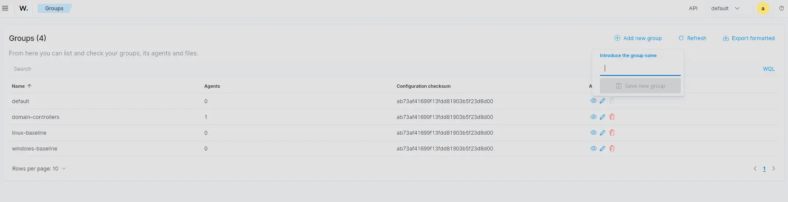

---

### Adding Sysmon Log Ingestion to windows-baseline

Navigate to the `agent.conf` for the group via **Agent Management → Groups → windows-baseline → Files → agent.conf**.

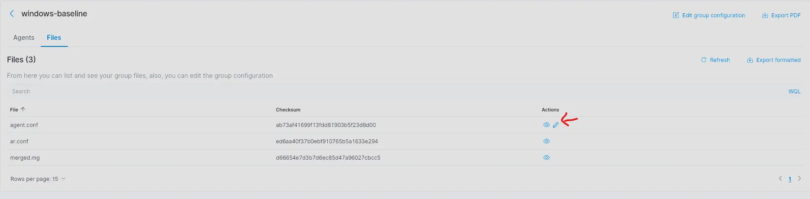

Add the following block:

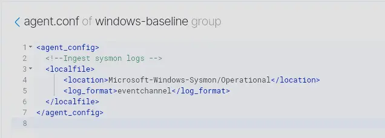

#### Verifying Ingestion

To confirm logs are flowing, check one of the agents in the `windows-baseline` group. Using DC01 as an example — navigate to **DC01 → Threat Hunting → Events** and run the following query:

```
data.win.system.channel: "Microsoft-Windows-Sysmon/Operational"
```

If Sysmon events appear as below, the agent is correctly ingesting Sysmon logs.

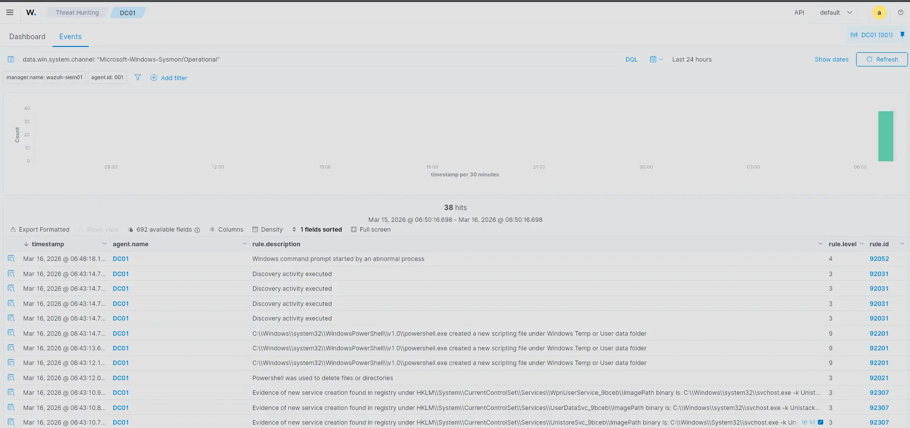

---

### Deploying an Agent on Windows Machines

The following steps apply to any Windows machine in the lab. DC01 is used as the example here.

Generate the install command from the web interface, selecting Windows as the OS:

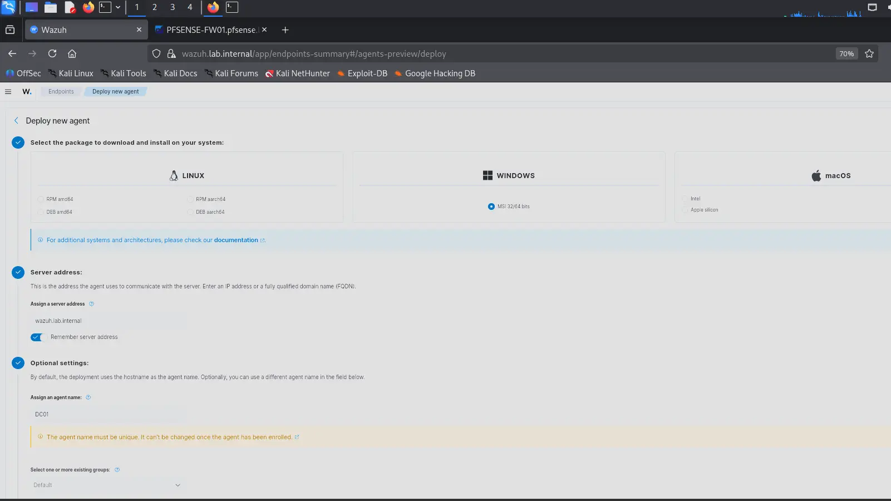

Copy the generated PowerShell command and paste it into an **elevated PowerShell terminal** on the target machine.

> [!NOTE]
> This requires a privileged account to run.

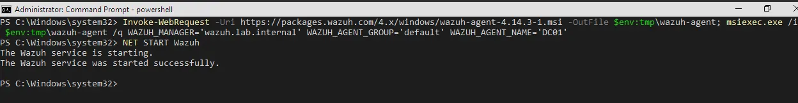

Once complete, the agent will appear in the web interface as active.

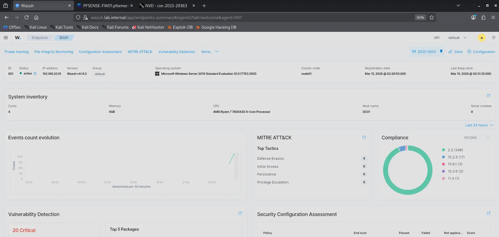

---

### Assigning Agents to Groups

Navigate to **Agent Management → Groups → \<group-name\> → Manage Agents**, select the agent, and add it.

Using DC01 as an example — add it to both `domain-controllers` and `windows-baseline`:

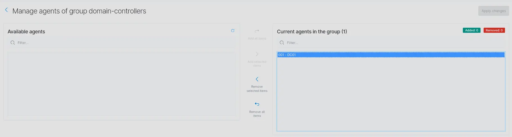

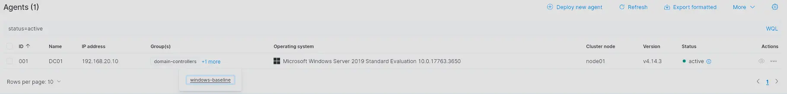


## Enabling the Archives Index

By default, Wazuh writes all ingested logs to `archives.log` but does not index them in OpenSearch — only events that match a rule are indexed into `wazuh-alerts-*`. Enabling the archives index allows unmatched logs (e.g. dnsmasq, raw syslog) to be queried in Discover.

### 1. Enable JSON archiving on the manager

In `/var/ossec/etc/ossec.conf`, ensure the `<global>` block contains:

```xml
<logall>yes</logall>
<logall_json>yes</logall_json>
```

Restart the manager:

```bash
sudo systemctl restart wazuh-manager
```

This causes the manager to write all received events to `/var/ossec/logs/archives/archives.json` in addition to `archives.log`. This is incredible for debugging issues where we need to check if logs are being ingested properly.

### 2. Enable the archives input in Filebeat

Filebeat ships logs from the manager to the OpenSearch indexer. The archives input is present in the config but disabled by default.

In `/etc/filebeat/filebeat.yml`, find the `archives` section and set:

```yaml
archives:
  enabled: true
```

Restart Filebeat:

```bash
sudo systemctl restart filebeat
```

### 3. Create the index pattern in OpenSearch Dashboards

Navigate to:

```
https://wazuh.lab.internal/app/management/opensearch-dashboards/indexPatterns
```

Click **Create index pattern** and set:

| Field | Value |
| :--- | :--- |
| **Index pattern name** | `wazuh-archives-*` |
| **Time field** | `timestamp` |

The archives index is now queryable in **Discover** by selecting `wazuh-archives-*` from the index dropdown.

---

## Troubleshooting

### LVM Not Claiming Full Virtual Disk

Ubuntu's LVM may only claim a portion of the allocated virtual disk during installation (e.g. 24 GB out of 50 GB). The Wazuh all-in-one installer requires significant disk space — if the filesystem runs out mid-installation, `dpkg` will fail to extract packages and the installer will roll back everything.

Verify with:

```bash
df -h
```

Check that `/dev/mapper/ubuntu--vg-ubuntu--lv` size roughly matches the virtual disk size assigned in VirtualBox. If it doesn't, expand the logical volume and resize the filesystem:

```bash
lvextend -l +100%FREE /dev/mapper/ubuntu--vg-ubuntu--lv
resize2fs /dev/mapper/ubuntu--vg-ubuntu--lv
```


### Service Management
Wazuh services are managed by systemd and should auto-start on boot by default after quickstart installation. If for some reason the services do not start we can do the following
```bash
# Start all wazuh services
sudo systemctl start wazuh-manager wazuh-indexer wazuh-dashboard

# Check status
sudo systemctl status wazuh-manager
sudo systemctl status wazuh-indexer
sudo systemctl status wazuh-dashboard


# Enable auto-start on boot (if not already enabled)
sudo systemctl enable wazuh-manager wazuh-indexer wazuh-dashboard
```

### Manager not monitoring SSH Logins
Wazuh-agent by default monitors ssh but this is not necessarily true for the wazuh-manager machine, which runs agent.id 000.
My best guess as to why this is the case is that the user is intended to only ever change config files through the web UI. Regardless, it is good hygiene to track SSH logins.

To do so, add the following section to /var/ossec/etc/ossec.conf
```
<localfile>
	<log_format>syslog</log_format>
	<location>/var/log/auth.log</location>
</localfile>
```
Then restart the manager
```bash
# need to be super user for this
systemctl restart wazuh-manager
```