# Challenge description

My sister's computer crashed. We were very fortunate to recover this memory dump. Your job is get all her important files from the system. From what we remember, we suddenly saw a black window pop up with some thing being executed. When the crash happened, she was trying to draw something. Thats all we remember from the time of crash.

**Note**: This challenge is composed of 3 flags.

# Initial thoughts
- Black window that popped up and ran something -> Likely cmd window so we will look at cmdscan, consoles, cmdline
- She was drawing something then it crashed -> Likely has something to do with mspaint or some other software to draw 
- My job is to get all her important files -> Maybe use filescan and see if any files have an interesting name that tells me it is important


# First Flag

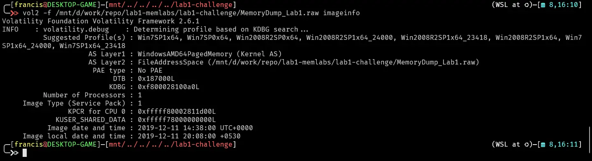

Sister was apparently drawing something when crash happened. Challenge also stated cmd window opened with something being executed. Let us look at the pslist.

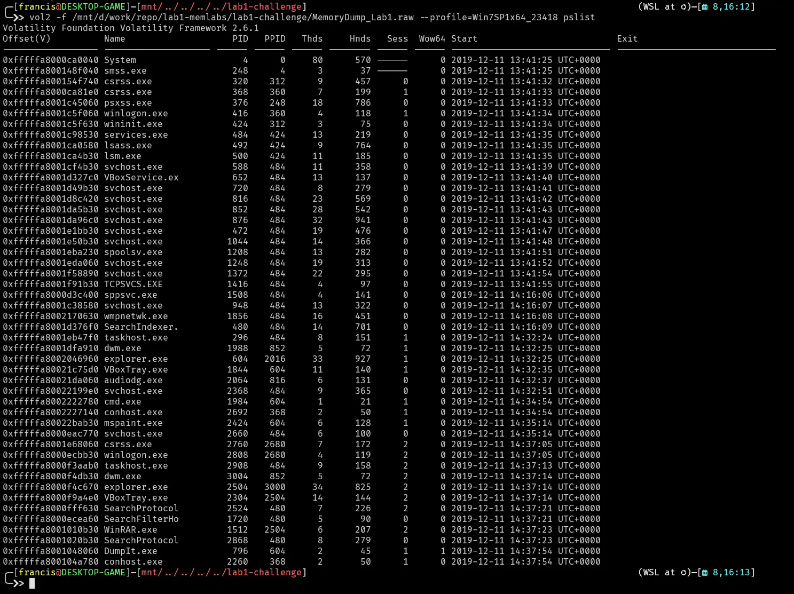

A cmd window launched

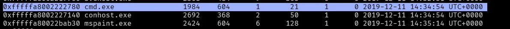

Lets do a cmdscan

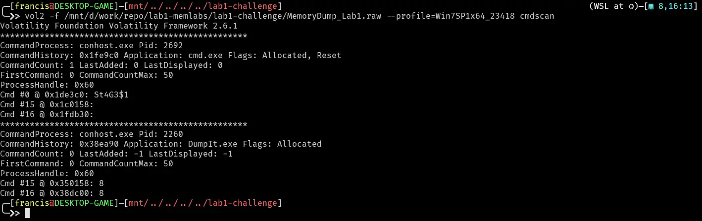

Looks like someone executed leetspeak for stage1. Lets see if that produced any output.

```
St4G3$1
```

Lets use consoles plugin.

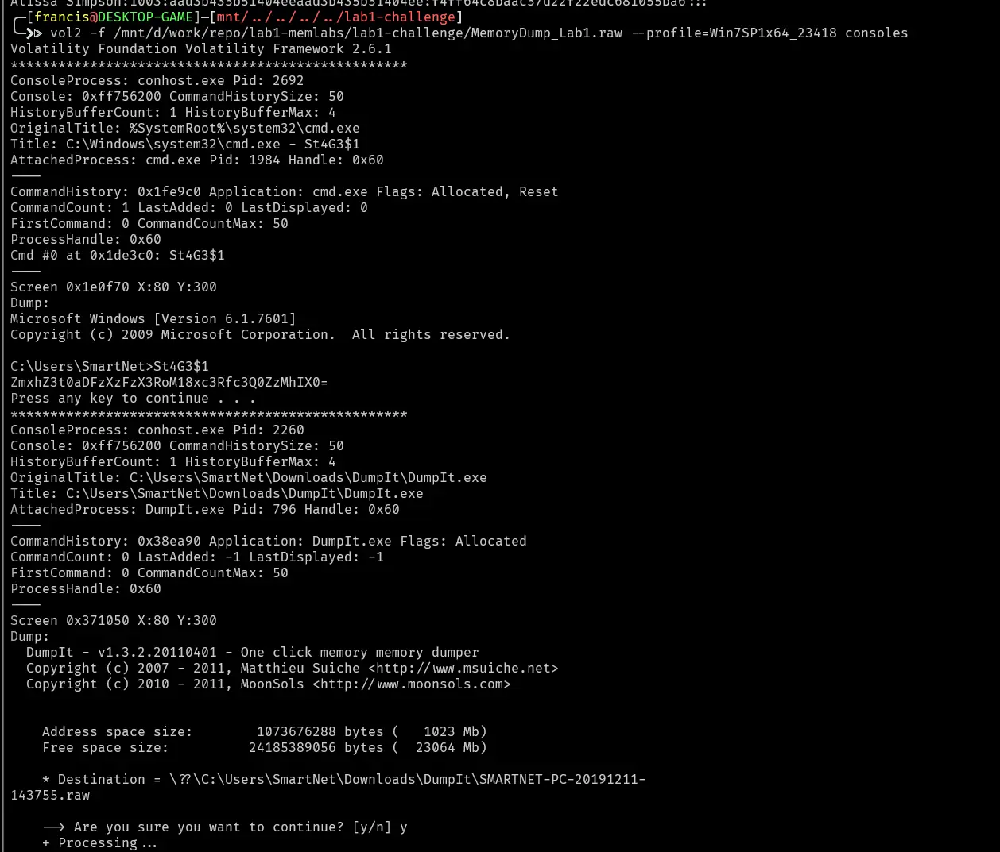

That stage 1 command looks like it produced a base64 encoded string
```
ZmxhZ3t0aDFzXzFzX3RoM18xc3Rfc3Q0ZzMhIX0=
```

Lets decode

```
echo "ZmxhZ3t0aDFzXzFzX3RoM18xc3Rfc3Q0ZzMhIX0=" | base64 -d
```

Which decodes to 
```
flag{th1s_1s_th3_1st_st4g3!!}
```

# Second Flag

Challenge states that she was drawing something on mspaint before a crash. Mspaint stores the canvas as raw pixel data in memory.  Lets dump the mspaint memory and try to get an image out of it. The pid of mspaint.exe is 2424.

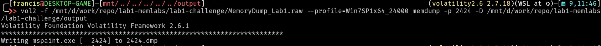

This produced the file 2424.dmp which we can change the file extension to .data to then open in gimp.

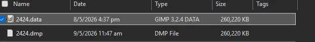

Then we just do trial and error for the width, height, offset and pixel format until something that looks like an image appears

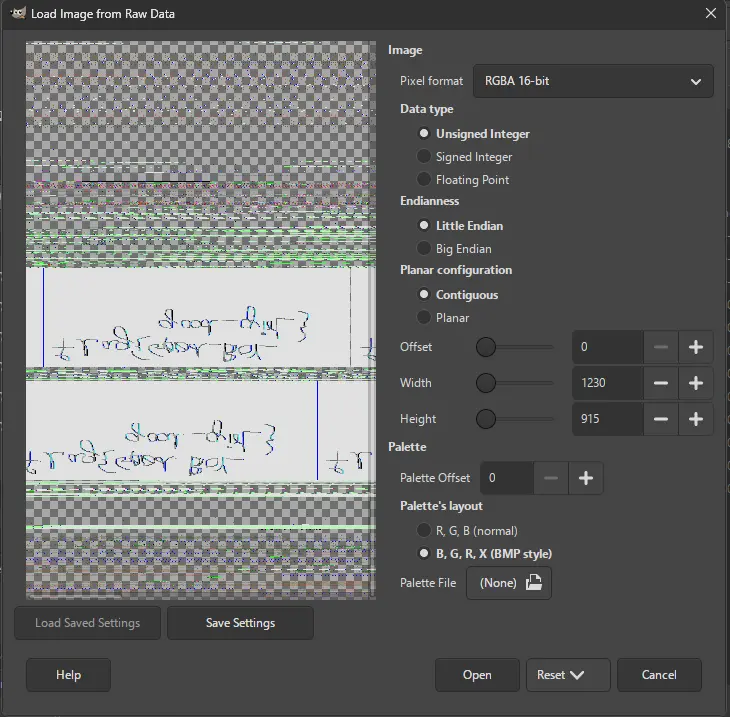

We then open this image and notice that the canvas looks transformed like it was flipped horizontally or vertically.
We then just flip it either horizontal or vertically a few times until something legible appears.

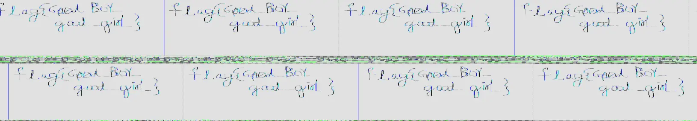
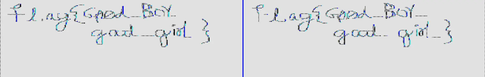

This tells us the second flag is 

```
flag{G00d_BoY_good_girL}
```

# Third flag 

Lets look more into the phrase "all her important files".
Lets do a filescan and grep "Important"

```
vol2 -f /mnt/d/work/repo/lab1-memlabs/lab1-challenge/MemoryDump_Lab1.raw --profile=Win7SP1x64_23418 filescan | grep -i "Important"
```

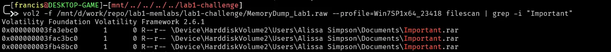

Lets dump the file and check if its a legitimate rar file

```
vol2 -f /mnt/d/work/repo/lab1-memlabs/lab1-challenge/MemoryDump_Lab1.raw --profile=Win7SP1x64_23418 dumpfiles -Q 0x000000003fa3ebc0 --dump-dir=/mnt/d/work/repo/lab1-
memlabs/lab1-challenge/output

xxd file.None.0xfffffa8001034450.dat | head -20
```

Header has rar as well as a hint to the password of the rar file.

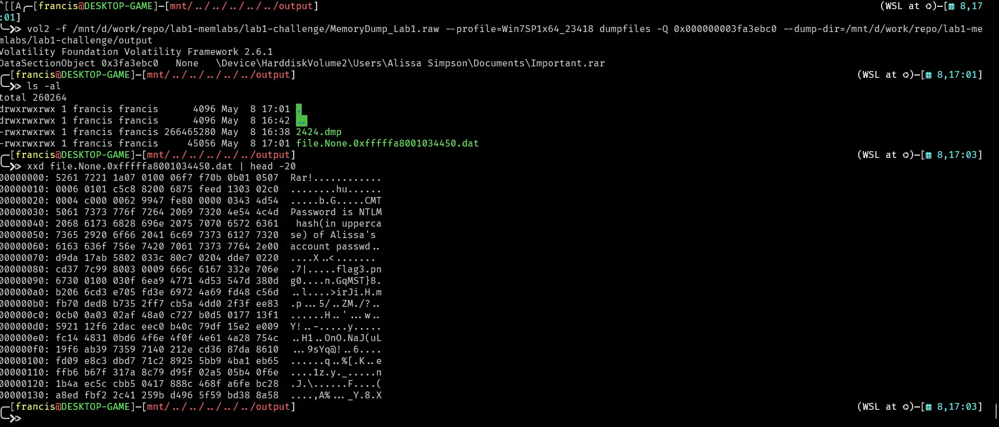

Password to the rar file is NTLM hash of alissa so lets hashdump

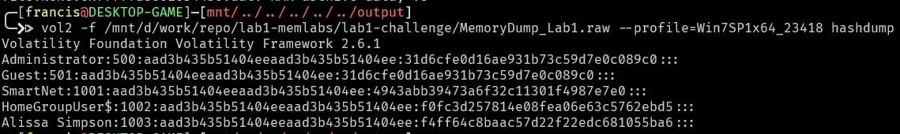

Then just upper case the entire hash

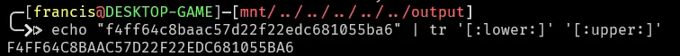

so the password is
```
F4FF64C8BAAC57D22F22EDC681055BA6
```

We then just unpack rar file

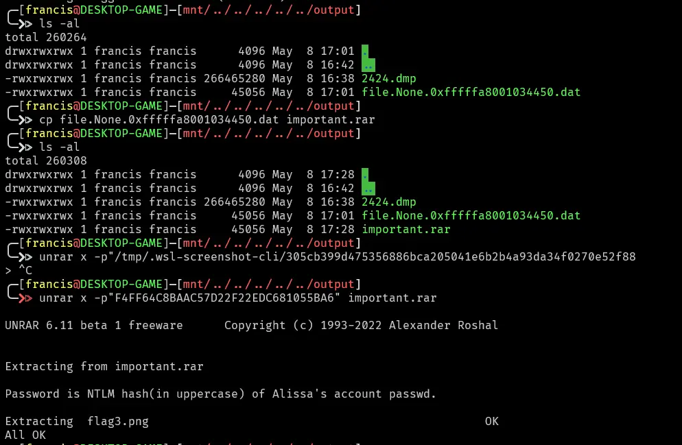

Then we just open the png

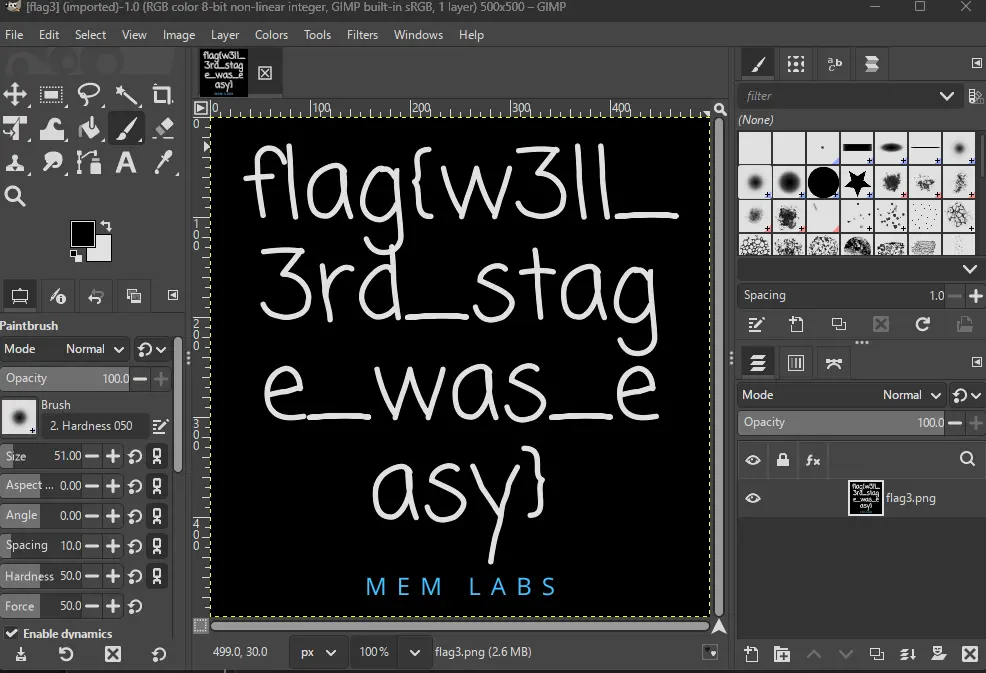

flags collected

```
flag1 : flag{th1s_1s_th3_1st_st4g3!!}
flag2 : flag{G00d_BoY_good_girL}
flag3 : flag{w3ll_3rd_stage_was_easy}
```
# Submission

Lets now submit
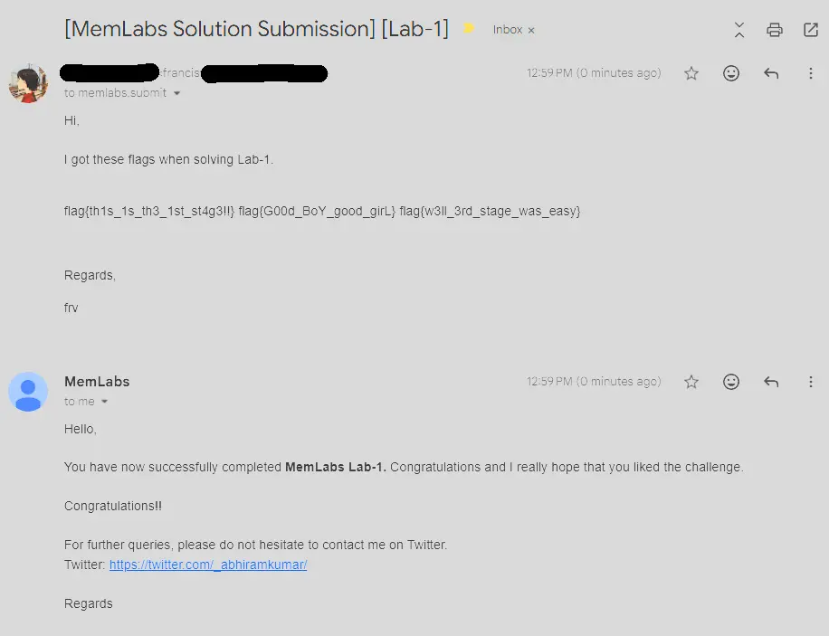

# Additional Notes
We could have used cmdline to determine

Winrar was used to create the important.rar, important for flag 2

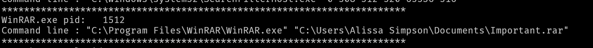


Mspaint had no arguments so likely the image was not saved, challenge description also hints at this because she was trying to draw something then it crashed. Heavily implies a memdump is required on that process.

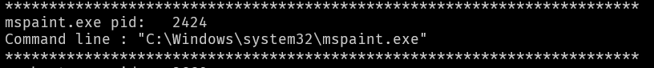

