# Challenge Description

A malicious script encrypted a very secret piece of information I had on my system. Can you recover the information for me please?

**Note-1**: This challenge is composed of only 1 flag. The flag split into 2 parts.

**Note-2**: You'll need the first half of the flag to get the second.

You will need this additional tool to solve the challenge,

```shell
$ sudo apt install steghide
```

The flag format for this lab is: **inctf{s0me_l33t_Str1ng}**

# Initial Thoughts

- Explicitly was told to install steghide implies information was hidden in an image
- Encrypted a secret piece of information, maybe we can find something interesting in cmdline to see what was invoked

# Finding Flag

Lets get the image info to get started

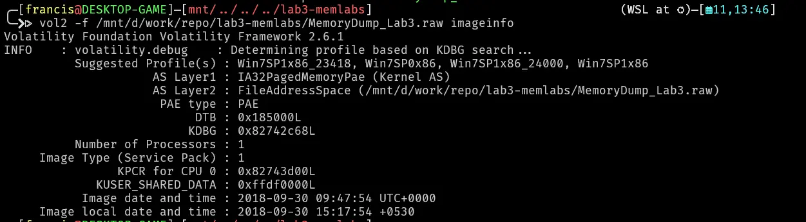

Then lets do a pslist

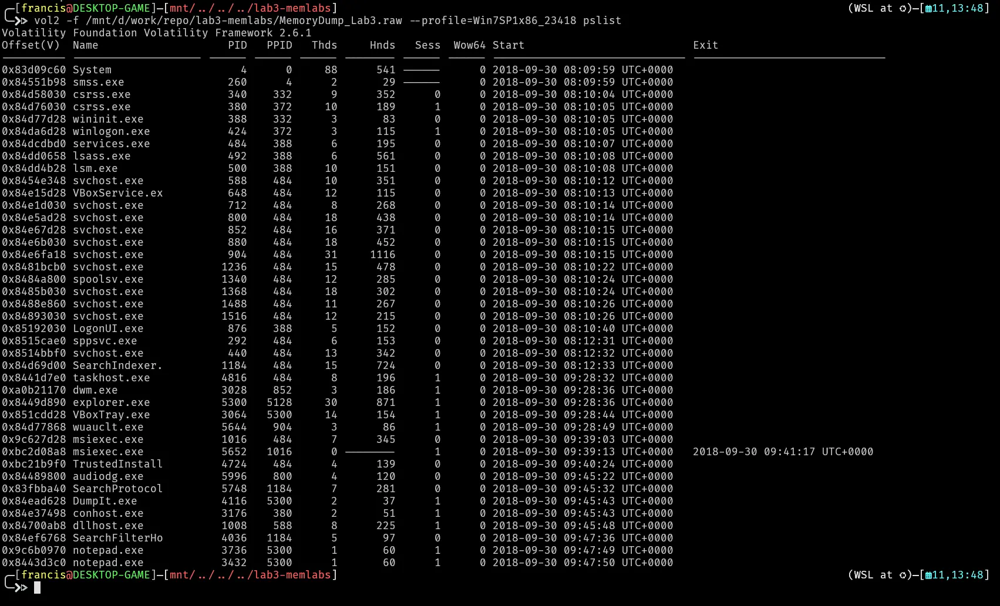

We can see two notepad instances open lets try doing a cmdline to see how notepad was invoked or maybe find some clues pertaining to that

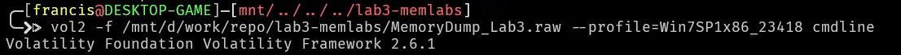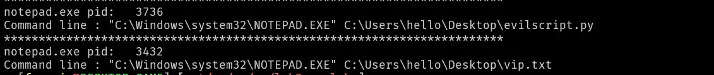

Found 2 files evilscript.py and vip.txt, lets find the offset and dump them

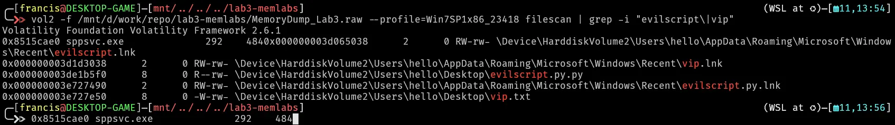

We found the offset lets try dumping them 

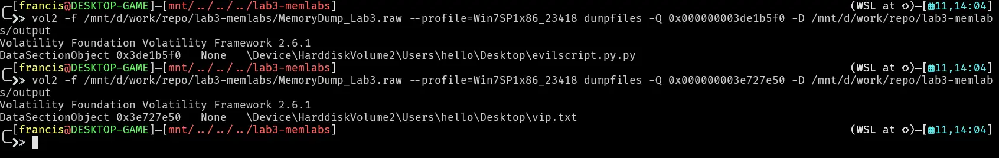

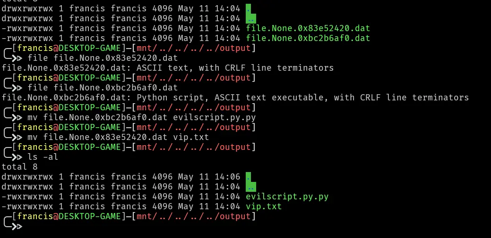

Now lets examine each file

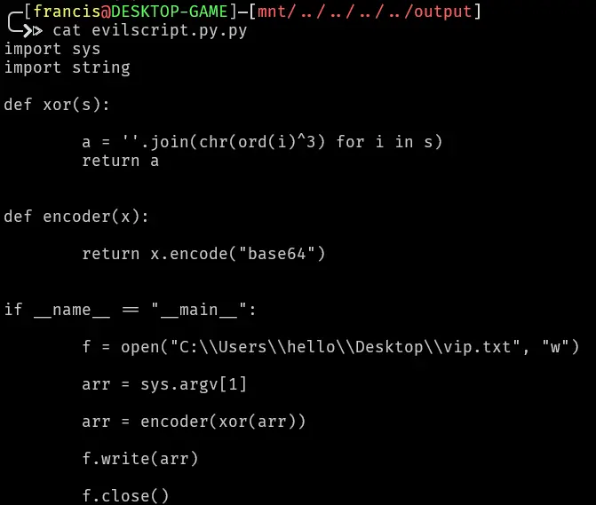

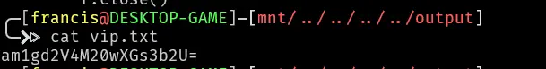

The text in vip.txt was first xor'ed then encoded in base64. 
Lets decode the text using a simple python script

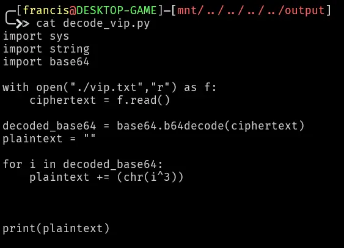

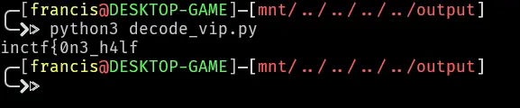

This gets us the first half of the flag
```
inctf{0n3_h4lf
```

The path of these files were`hello\Dekstop` lets try to do a filescan and grep `'hello\\desktop`, maybe we can find something else of value just sitting on the desktop.
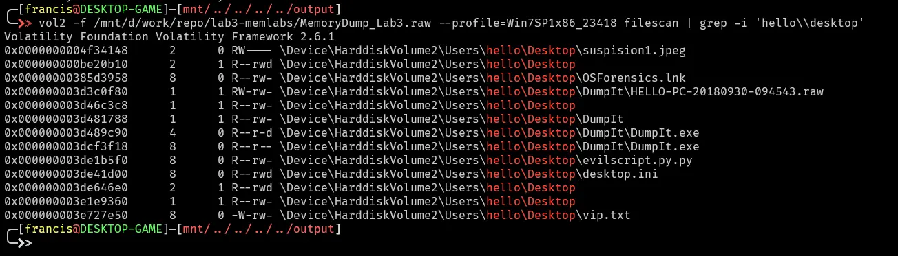

There is an image sitting on the desktop lets try dumping that
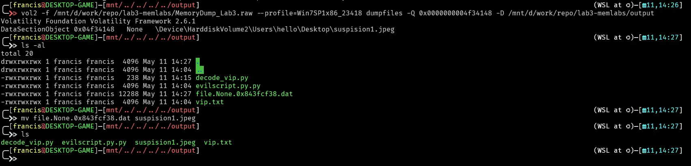

Lets inspect the file using file and xxd and see if anything immediately shows up
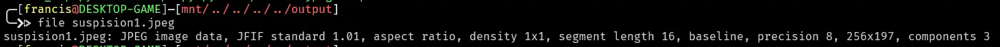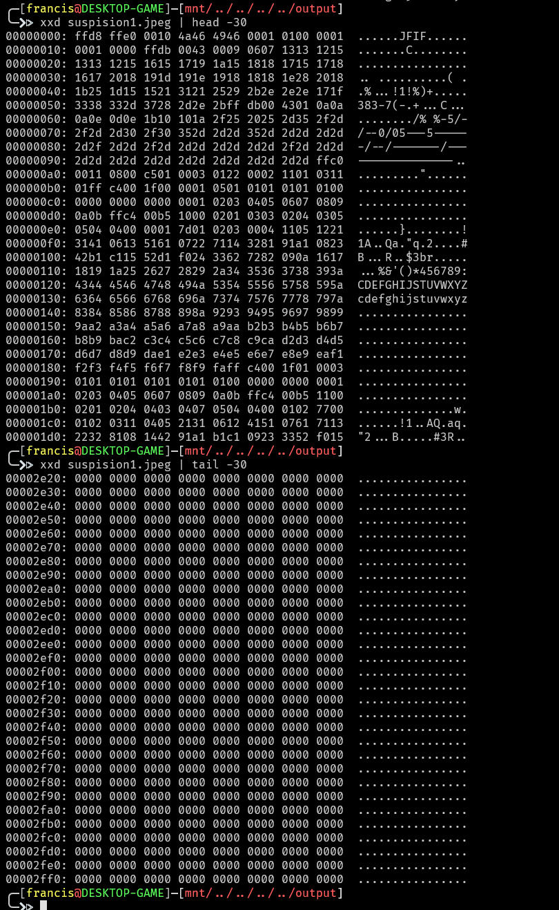

Opening the image as well just gives us a normal shutterstock photo
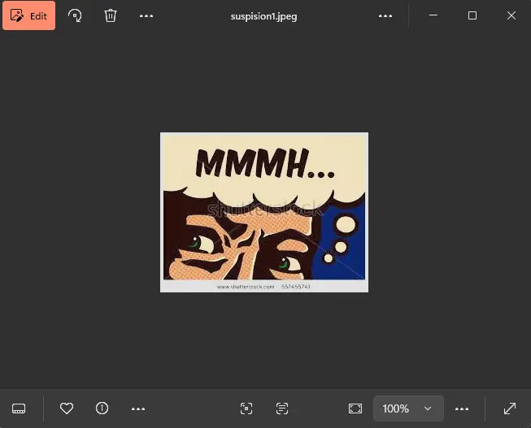

Maybe the  information is hidden in the image using steghide, also the challenge description does we need steghide to actually solve this.
Another note also states that we need the first part of the flag to get the second so maybe the first flag is the passphrase to extract the image.

Lets try that

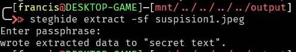

We got it
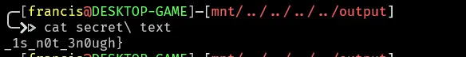

The full flag is

```
inctf{0n3_h4lf_1s_n0t_3n0ugh}
```

# Submission

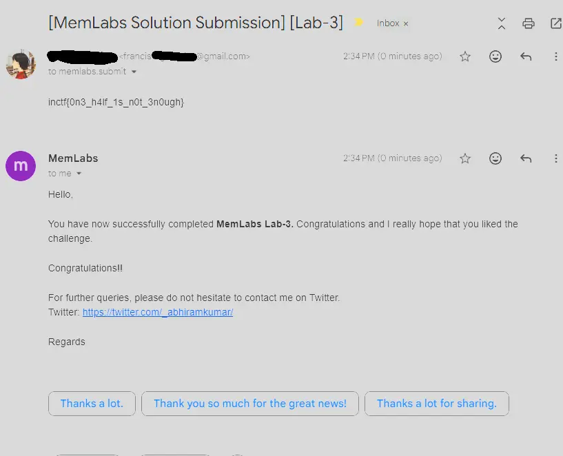