# Challenge Description

My system was recently compromised. The Hacker stole a lot of information but he also deleted a very important file of mine. I have no idea on how to recover it. The only evidence we have, at this point of time is this memory dump. Please help me.

**Note**: This challenge is composed of only 1 flag.

The flag format for this lab is: **inctf{s0me_l33t_Str1ng}**

**Challenge file**: [MemLabs_Lab4](https://mega.nz/#!Tx41jC5K!ifdu9DUair0sHncj5QWImJovfxixcAY-gt72mCXmYrE)

# Initial Thoughts

- Deleted a very important file of his maybe we can look at the MFT 

# Finding Flag

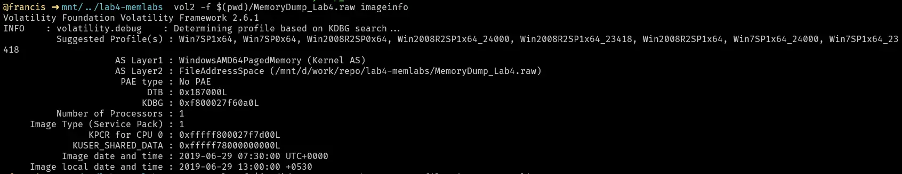

Standard first few steps, get image, run pslist
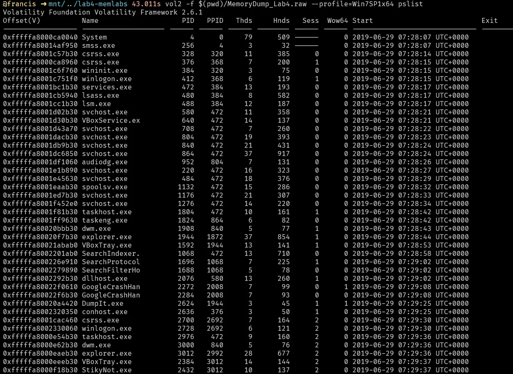

StikyNot.exe looks suspect we should investigate that but before that lets try running cmdline to see if we can get anything interesting.

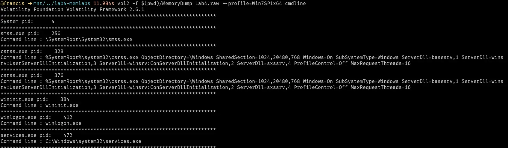

Nothing that immediately stands out to me, lets have a look at consoles

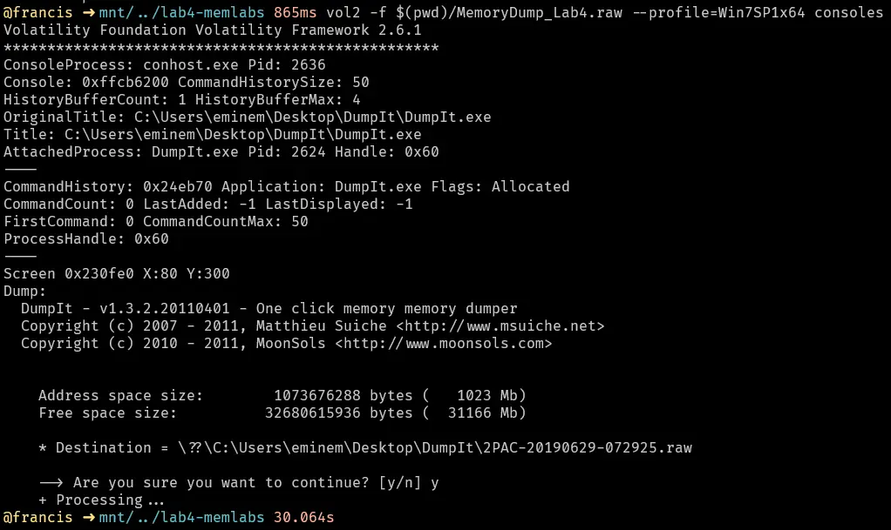

Again nothing of note lets look at the handles of StikyNot.exe, in particular the files.

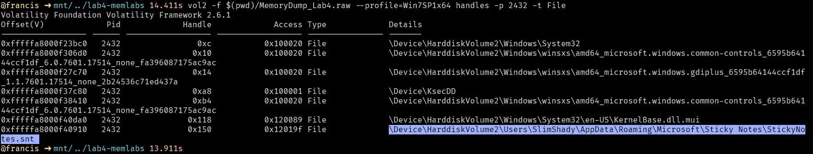

It accessed StickyNotes.snt of user SlimShady, lets try dumping that file and seeing what type of information we can get.

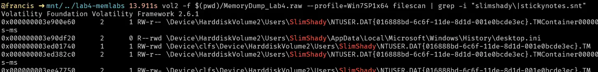

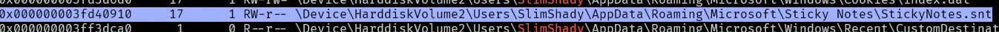

Lets dump it and view it with a hex editor
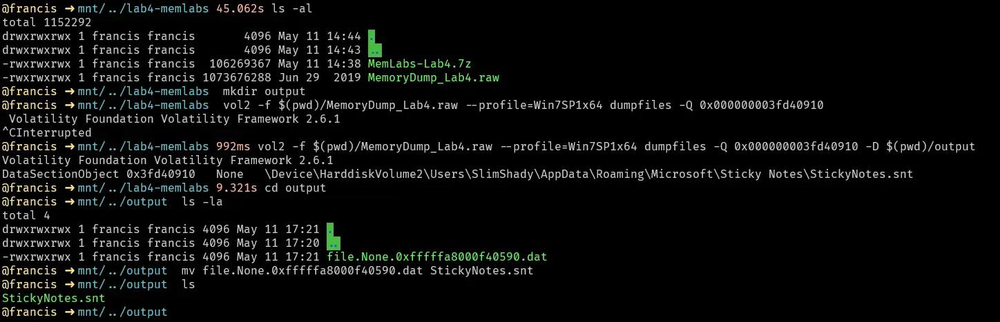

This does not end up giving us any interesting it just says that the clipboard plugin will not give us the flag.

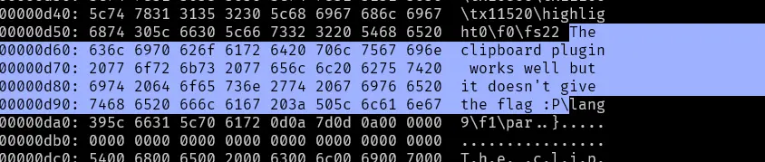

Lets try dumping the entire process instead

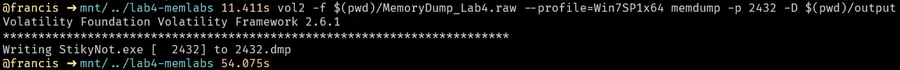

Lets start with doing a strings of the process

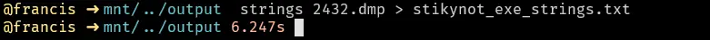

Lets try some keywords like secret, password, flag or inctf and see what we get back

Grepping for secret gets us an interesting hint, theres a secret.txt file sitting on `eminem\Desktop`

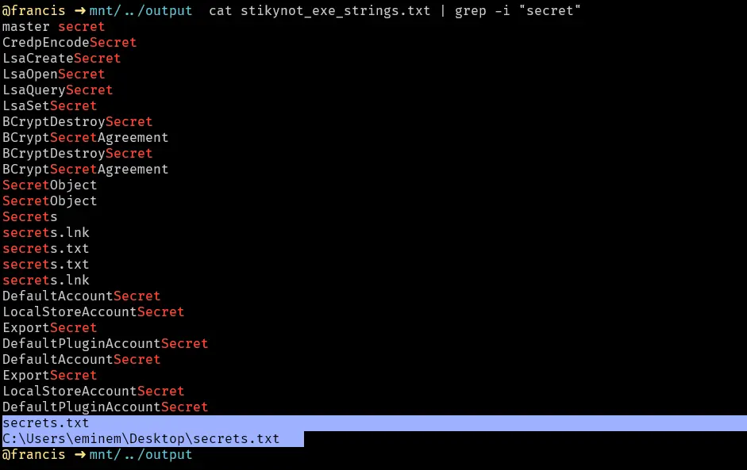

Nothing really interesting when grepping for password, flag or inctf. Lets follow up on the secrets.txt shown above.
Lets try doing a filescan grepping for all files with `eminem\Desktop` , maybe there are other files sitting on the desktop

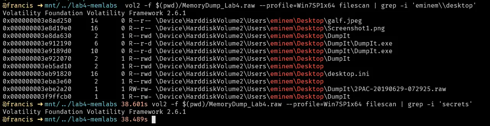

This is really interesting, there are 2 images sitting on desktop but no sign of the secrets.txt.
Even grepping for "secrets" directly yields no file.
It is likely this file was deleted.
Lets check the mft for this file in particular.

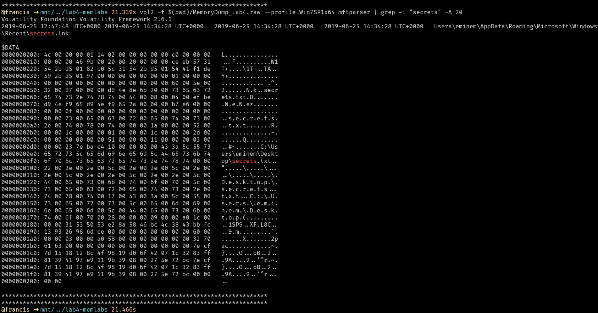

We can only find the lnk file for it. Lets try searching the recycling bin

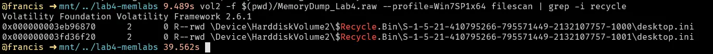

Nothing of note which is strange.
I will pivot to investigating the two image files instead

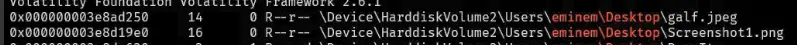

Lets first dump these files

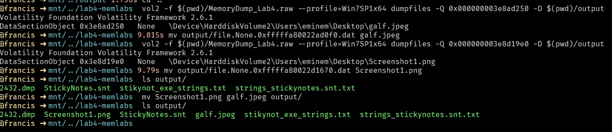

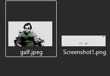

galf.jpeg looks like an image of the joker, its in jpeg so it is possible there maybe some information hidden using steg techniques in this file.
Screenshot1.png shows a google search webpage. However, there have been no clues found so far that would pertain to a possible passcode for stego in galf.jpeg. Looking at the hex values of both files does not yield anything useful either. Additionally, we never could find the secrets.txt file that existed on `eminem\desktop`. 

Lets instead revisit the strings output for the stikynot.exe process. There was another user on the desktop which was `slimshady` lets try grepping for `slimshady` in the strings output.

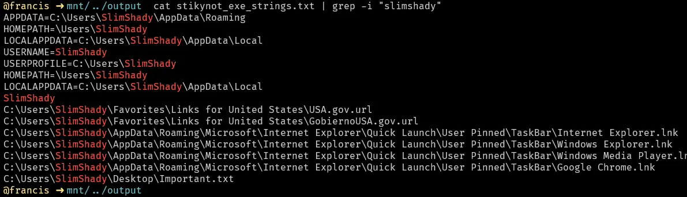

This was another important.txt sitting on the desktop of slimshady.
However trying to dump it causes no file to be created

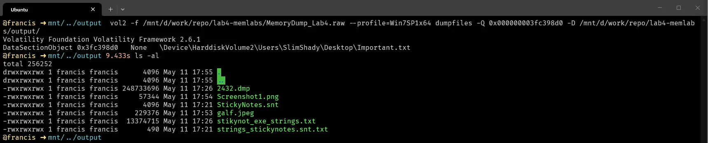

Lets try looking at the mftparser instead to see if we can see the data 

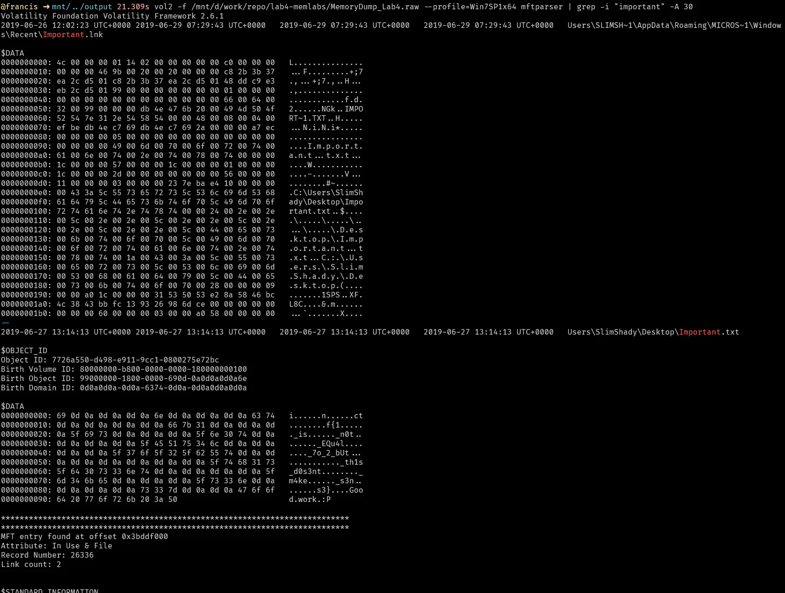

This actually reveals the flag which is `inctf{1_is_n0t_EQu4l_7o_2_bUt_th1s_d0s3nt_m4ke_s3ns3}`.
It seems like the other artifacts we found were red herrings.

# Submission

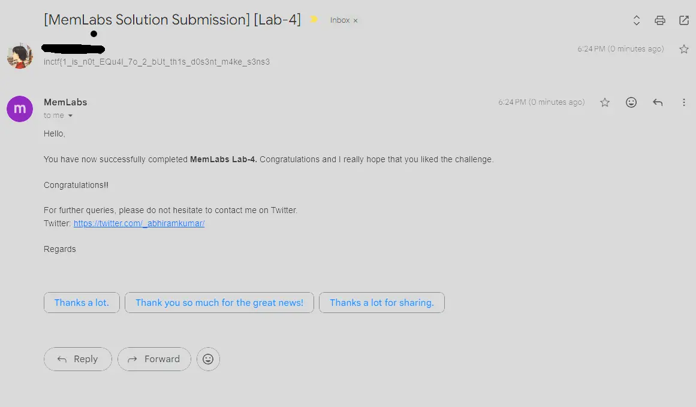