# Challenge Description

We received this memory dump from our client recently. Someone accessed his system when he was not there and he found some rather strange files being accessed. Find those files and they might be useful. I quote his exact statement,

> The names were not readable. They were composed of alphabets and numbers but I wasn't able to make out what exactly it was.

Also, he noticed his most loved application that he always used crashed every time he ran it. Was it a virus?

**Note-1**: This challenge is composed of 3 flags. If you think 2nd flag is the end, it isn't!! :P

**Note-2**: There was a small mistake when making this challenge. If you find any string which has the string "**_L4B_3_D0n3_!!**" in it, please change it to "**_L4B_5_D0n3_!!**" and then proceed.

**Note-3**: You'll get the stage 2 flag only when you have the stage 1 flag.

# Initial thoughts
- Strange files being accessed -> Maybe can find something interesting in filescan
- Names were not readable and composed of alphabets and numbers -> maybe encoded
- Most loved application he always used crashed everytime he ran it -> maybe userassist can tell us something about what his most loved application is then memdump it

# Finding flag

 Get the image info
 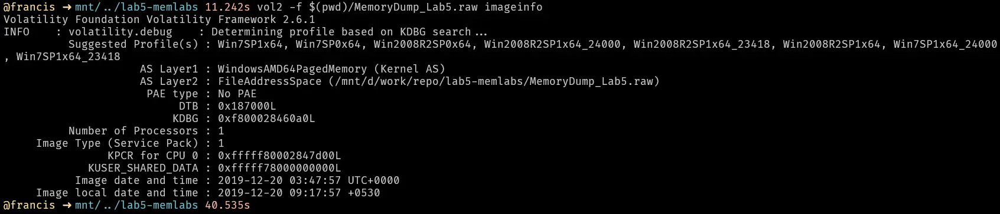

List the processes 

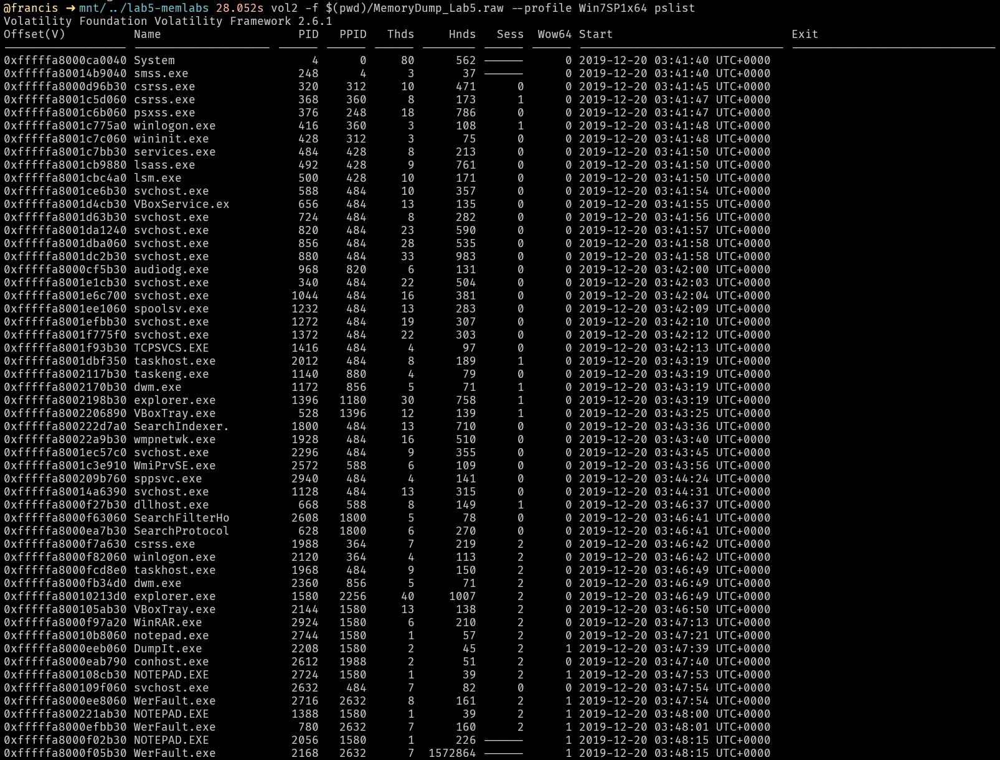

Few things that immediately stand out 
- WinRAR.exe was in memory, maybe something was being archived 
- multiple notepad.exe processes were running
- multiple WerFault.exe processes were running

# Winrar 

Lets investigate the winrar process and see how it was invoked

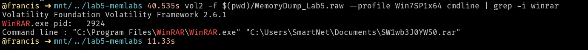

Theres a rar file with a name that looks base64 encoded. lets decode it.

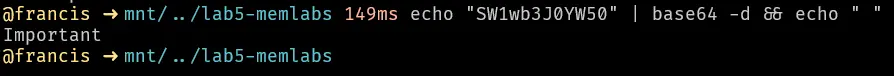

This rar file is actually called "Important.rar".

Lets find the memory offset then dump it.

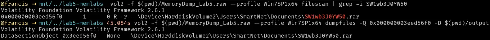

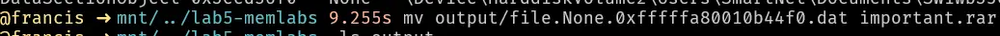

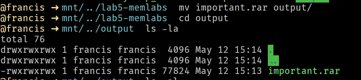

Trying to unrar this file will prompt for a password

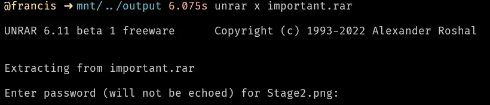

This password is very likely the first flag since in the challenge description  it states `**Note-3**: You'll get the stage 2 flag only when you have the stage 1 flag.` . We will revisit this later.

# Cmdline

Lets run cmdline to see how the programs were invoked

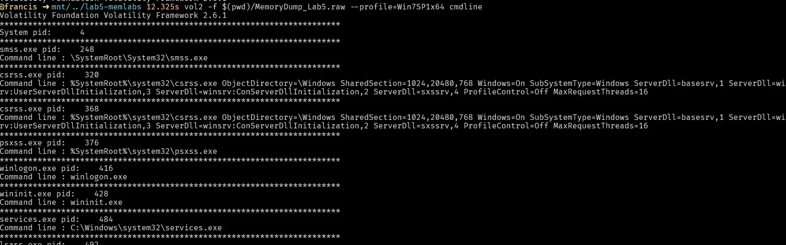

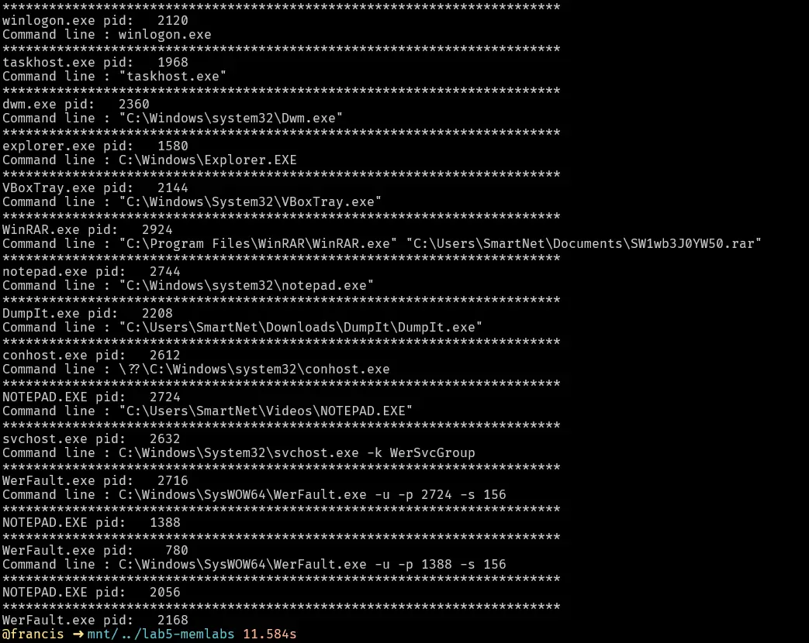

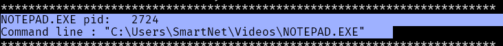

Notice how the nodepad.exe on pid 2724 is running from the videos directory? That is highly suspect.
The name is also fully capitalized which is odd.
Notepad.exe should be in C:\Windows\System32 or C:\Windows.

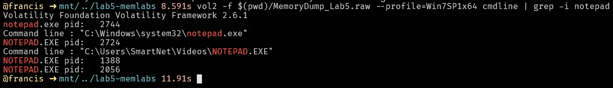

It is very likely this is a malicious program masquerading as a legitimate one.

# Werfault and Notepad

Lets do a cmd line and grep for werfault to see for what processes werfault was invoked for.

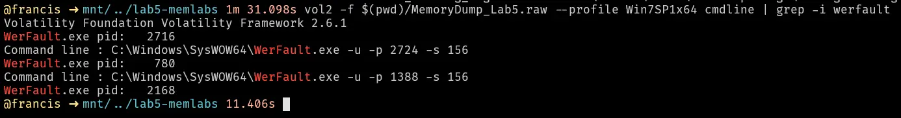

Werfault was invoked for pid 2724 and 1388. lets see what those processes were.

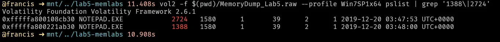

Both of these processes that were crashing were notepad. The challenge description states that the clients most loved application keeps crashing when he uses it and also hints at a virus. Putting together all we know about how the NOTEPAD.exe is running from a suspicious directory and how the NOTEPAD processes keeps crashing. We can reasonably conclude that 
- The clients most loved application is likely notepad
- NOTEPAD.exe is a malicious program masquerading as a legitimate one 

## Handles and weird filenames

Lets check what handles each notebook process had to see if there is anything interesting before we dump the processes.

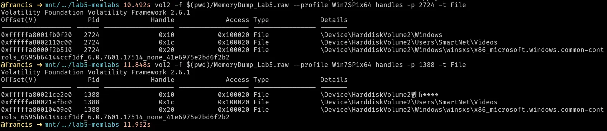

The immediate standout is there pid 1388 was accessing a file with a path that looks garbled. Lets use regex with grep to find it

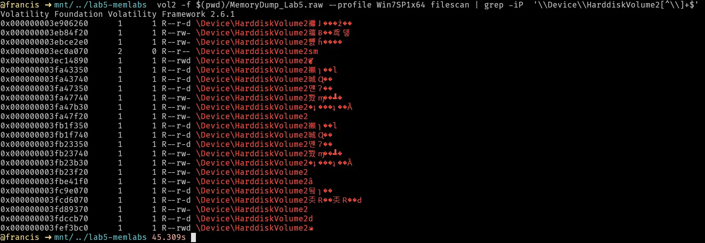

The results are interesting, it reveals multiple files all with garbled names. Trying to dump them results in no files being created.

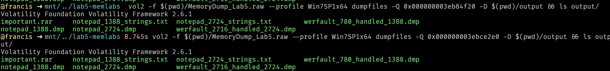

Maybe the clue is in the filenames themselves. Lets save the output into a text file so we can process it. 
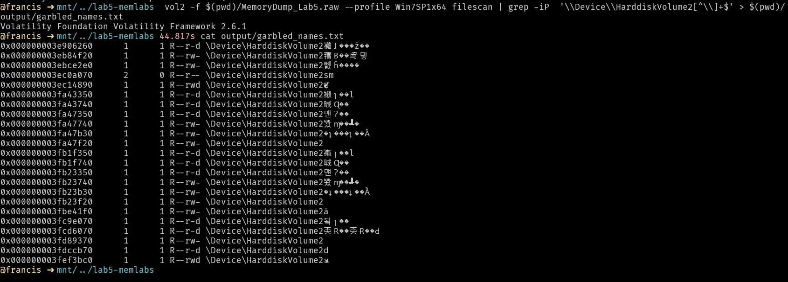

Lets use python to just isolate the weird looking text.

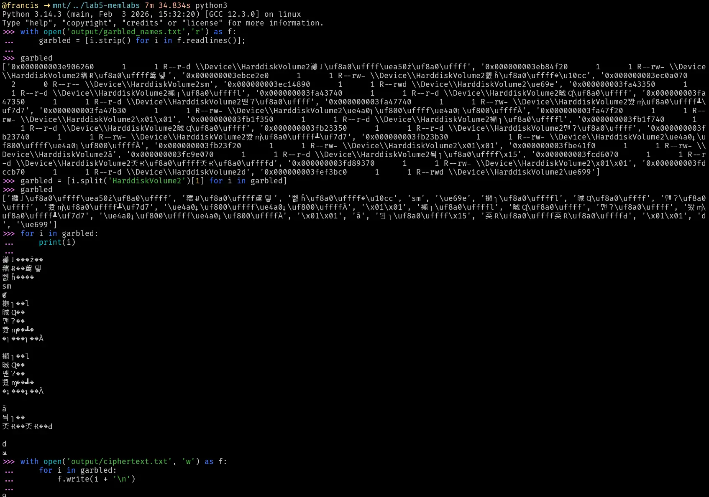

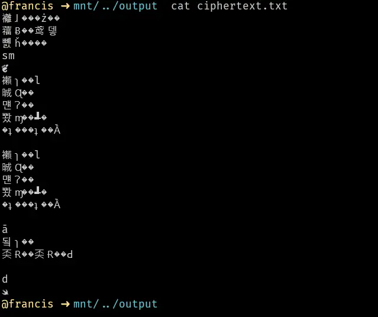

For now this looks encrypted or is just illegible binary so we will revisit this later to see if there is anything that can help us with this or if it is a deadend.

## Notepad memorydump and strings

Let us memdump both notepad and werfault processes and see if we can find anything interesting.

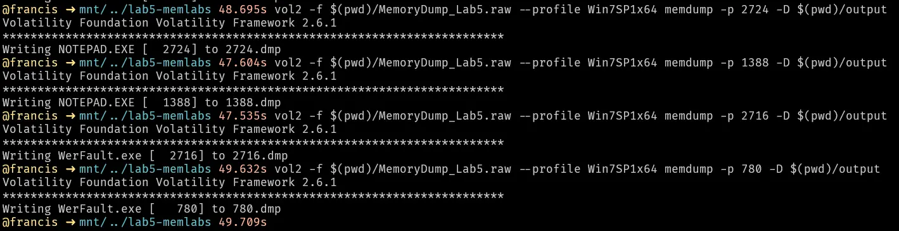

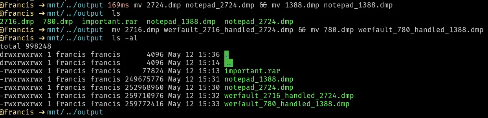

Lets do a strings on the notepad dumps and the werfault dumps.

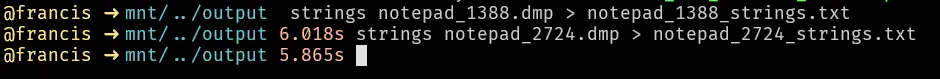
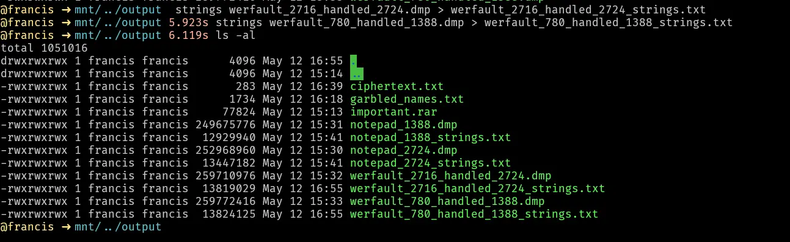

Let us grep some keywords in the strings of the 2724 dump and see if we can find anything useful.
### keyword: SmartNet

Earlier we found an important.rar sitting on the documents of user "SmartNet". 
Let us try to grep "SmartNet" in notepad_2724_strings.txt and see if there was any other interesting files being accessed by this process.


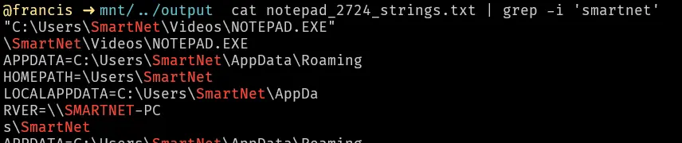

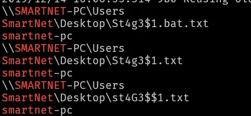

This stands out because it is leetspeak for stage1, maybe we can find the first flag here.
Interestingly, this file had double extensions which were .bat and .txt.
Lets perform a filescan of files that are in path `SmarNet\Desktop` to see if that file exists there and if there is anything else interesting.

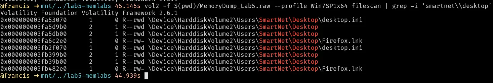
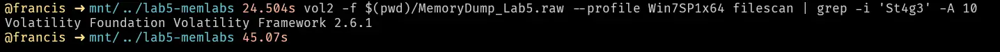

We cannot find the files through a basic filescan. Lets try looking at the mft instead.
Grepping for smartnet\\desktop doesnt yield anything interesting.

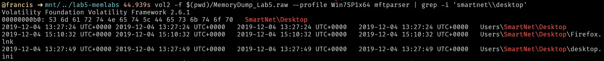

Narrowing our search with grep 'st4g3' also does not yield anything interesting

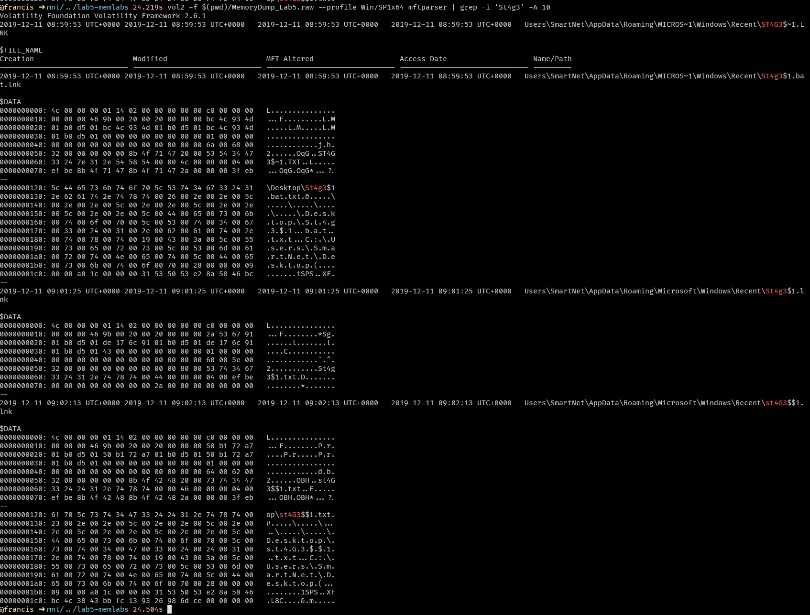

### keyword: Password

Lets try searching for keyword password.

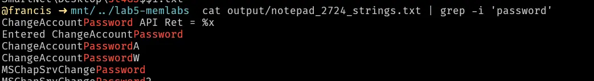

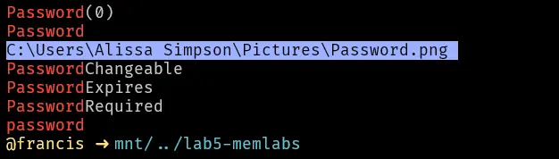

there is an image `password.png`.
Trying to find this file through filescan and mftparser also yields the same issues as trying to find the st4g3 file. 
They both cannot be found.

# Trying to find files

When I analyzed the strings in the notepad processes we found some interesting names of files st4g3$1 and password.png etc.
However, trying to find these files through filescan and mftparser does not get us anything. Even cmdline, cmdscan and consoles gives us nothing.

We can try to see how these files were maybe accessed in another way by using iehistory. 

Why does this even work? iehistory intuitively means that we are just checking the history of urls accessed by internet explorer right?
The reality is that both windows explorer and IE logs the urls they access to the same url cache file that iehistory reads from. Furthermore, the way windows explorer was designed, it internally converts every file path into a url format. So when a user navigates to a file through the 
GUI, this action gets logged in the urlcache because he is navigating to a url.


Using iehistory we see a few interesting things,

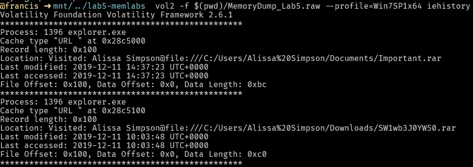

We can find the rar file we found earlier was being accessed.

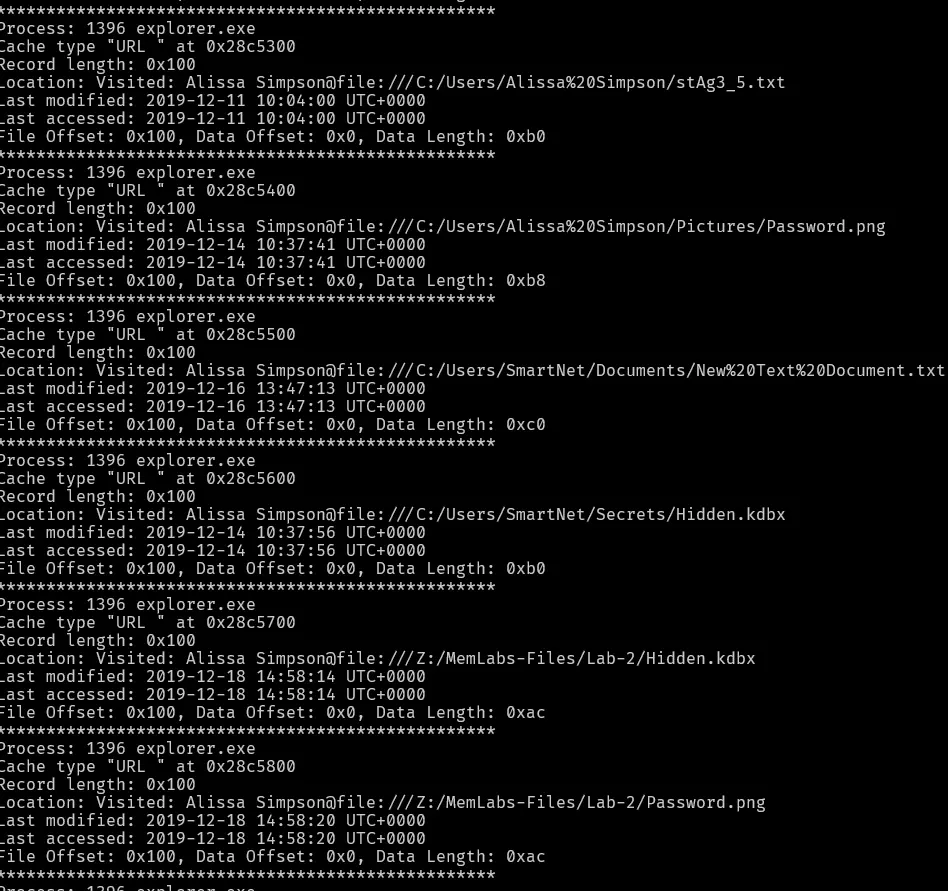

We can see the password.png was being accessed.
We can also see another stag3_5.txt file was being accessed.
Interestingly, we can see that the user was accessing a network drive for files used in lab2 of the memlabs.
Maybe, password.png existed because there was overlap or a mistake in the creation of the ctf lab for lab2 and 5.

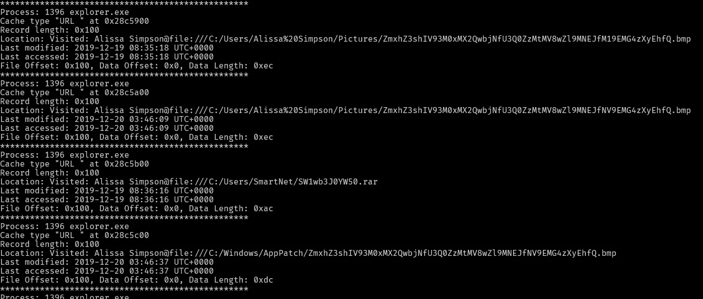

This is the most interesting find in the iehistory, because it shows a bmp file with what looks a base64 encoded name was being accessed.
If we decode this file name we find the following,

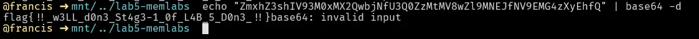

This is the first flag in the lab
```
flag{!!_w3LL_d0n3_St4g3-1_0f_L4B_5_D0n3_!!}
```

# Unlocking the winrar

Now with the first flag we can go unlock the rar archive.

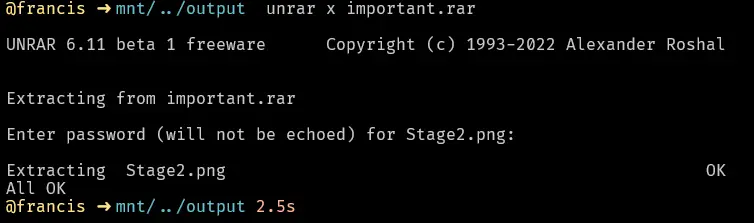

This extracts an image which just shows us flag 2 in plaintext 

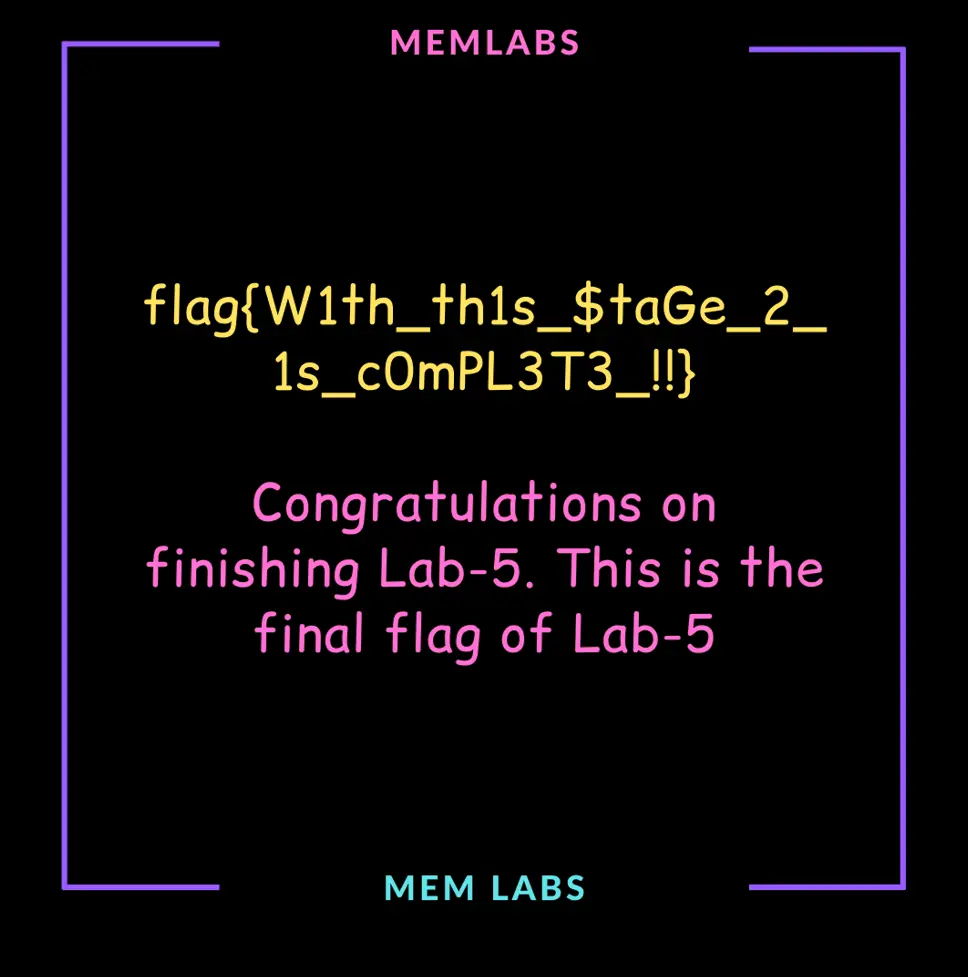

```
flag{W1th_th1s_$taGe_2_1s_c0mPL3T3_!!}
```

# Finding the final flag

Stage2.png states that this is the end of lab5 but the challenge description says otherwise. What I find weird is that I managed to find both flag 1 and 2 just through decoding base64 strings.

The hint about most loved application and crashing was not really fully utilized.
So far I have established a few things
- Notepad keeps crashing
- NOTEPAD.exe is highly suspect, it is running from a directory where it should not even exist

Lets try getting the procdump for this process (pid:2724) and analysing it in x64dbg

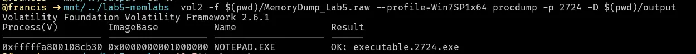

If we step through the instructions, we finally land on an exception access violation

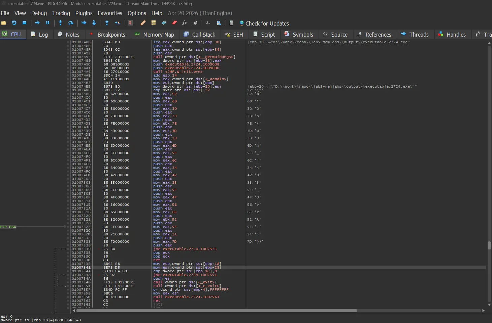

If we look at the assembly instructions, it actually spells out the final flag.
Each instruction is moving a byte into registers , each byte spelling out the flag.

The final flag is 

```
bi0s{M3m_l4B5_OVeR_!}
```

# Submission

The submission through email was not working (no reply was being received) but we can verify the flags based on other writeups available online. Regardless, these are the 3 flags in this challenge.

```
flag 1 : flag{!!_w3LL_d0n3_St4g3-1_0f_L4B_5_D0n3_!!}
flag 2 : flag{W1th_th1s_$taGe_2_1s_c0mPL3T3_!!}
flag 3 : bi0s{M3m_l4B5_OVeR_!}
```