# Challenge Description

We received this memory dump from the Intelligence Bureau Department. They say this evidence might hold some secrets of the underworld gangster David Benjamin. This memory dump was taken from one of his workers whom the FBI busted earlier this week. Your job is to go through the memory dump and see if you can figure something out. FBI also says that David communicated with his workers via the internet so that might be a good place to start.

**Note**: This challenge is composed of 1 flag split into 2 parts.

The flag format for this lab is: **inctf{s0me_l33t_Str1ng}**

**Challenge file**: [MemLabs_Lab6](https://mega.nz/#!C0pjUKxI!LnedePAfsJvFgD-Uaa4-f1Tu0kl5bFDzW6Mn2Ng6pnM)

# Initial thoughts

- Communicated with workers via internet -> Browser related artifacts and maybe also netscan

# Getting Started

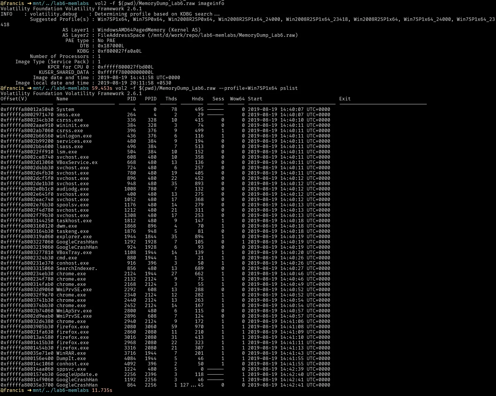

There is alot of chrome and firefox processes running. The google crash handler also was running so the browser likely crashed.
Lets see cmdline as well to see if any interesting programs were invoked and with arguments.

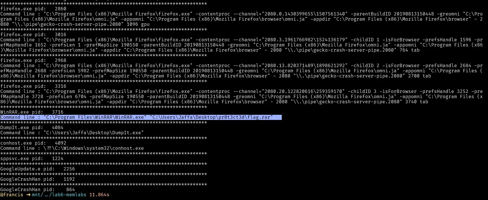

Winrar was invoked to archive a rar file for user jaffa. We can also see that cmd was running lets try checking cmdscan and consoles for any clues.

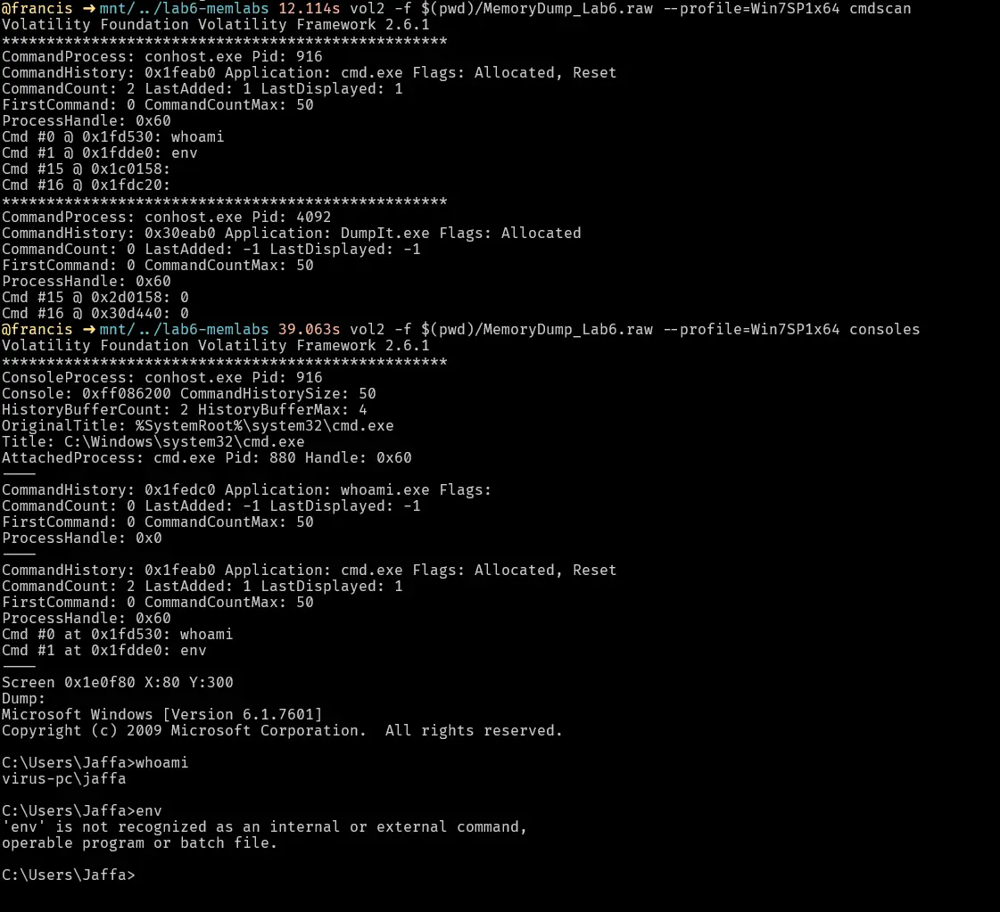

This is odd, the user ran whoami and env on the cmd. Also the name of the pc is virus-pc.
Env is a linux command to show the current environment variables so it is strange to see it be used in cmd.

From this we have a few interesting leads
- Browser processes , both firefox and chrome
- Crash handlers for chrome were running
- Winrar was invoked for a rar archive called flag 
- whoami and env were run on the cmd for some reason

# Checking envars

The user ran `env` in cmd for some reason. 
Maybe there is something hidden in the envars, lets investigate.
Lets output the envars into a file then grep from there since the output is very long.
Lets start with grepping chrome to see if anything interesting surfaces.

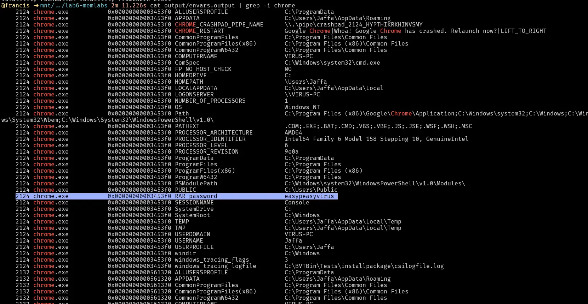

Interestingly enough, there is a rar password in the envars `easypeasyvirus`.
This could be the password to the rar file.

# WinRAR
Lets start with investigating the rar file. 
We first do a filescan and grep the path `jaffa\desktop` and see what we get.

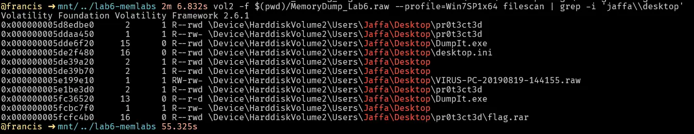

Few interesting files come up.
Flag.rar looks like it contains part of the flag in the challenge.
However, there is a memory dump file as well.
Lets dump both these files and investigate them.

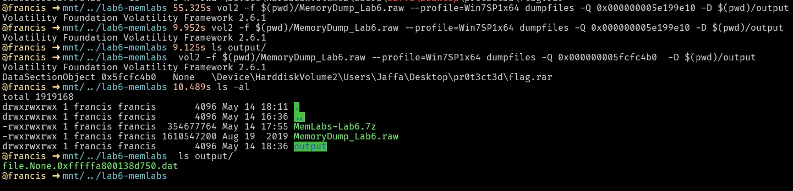

Trying to dump the .raw file results in nothing being written.
Lets inspect the rar file and see what we can find.

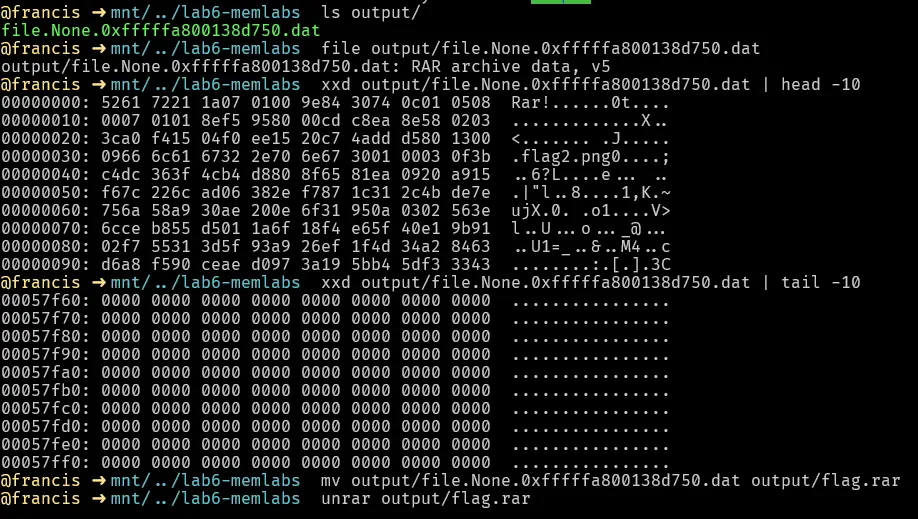
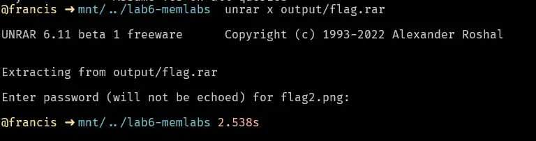

The rar archive contains an image called flag2.png is password protected. Lets then use the password we found in envars to unlock it.

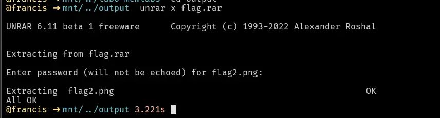

This outputs a flag2.png which when opened reveals

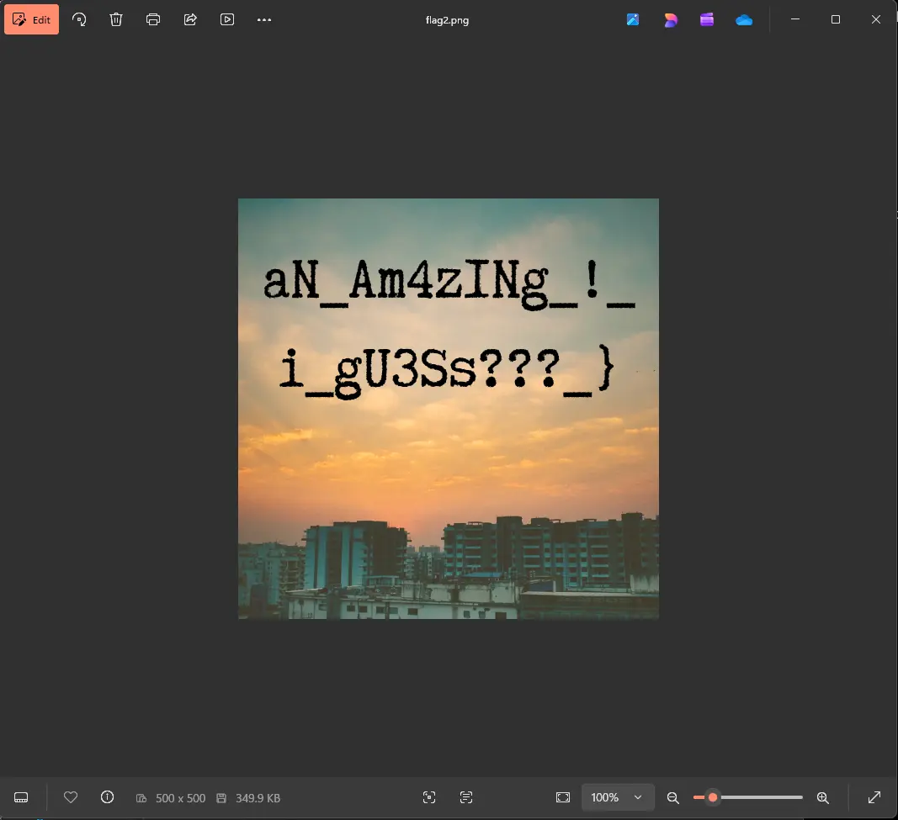

Part2 of the flag is `aN_Am4zINg_!_i_gU3Ss???_}`
# Browsers
Lets see how these browsers were invoked through cmdline.

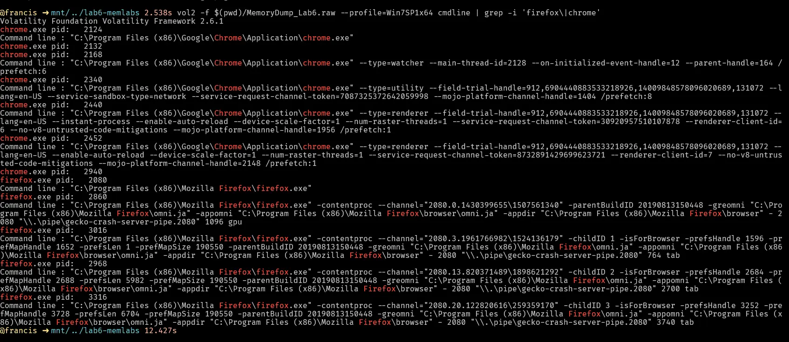

Looks like they are running from the expected directories, lets try a filescan to see if we can get the local db for the browsers

For firefox the file is called places.sqlite  so we grep for that.

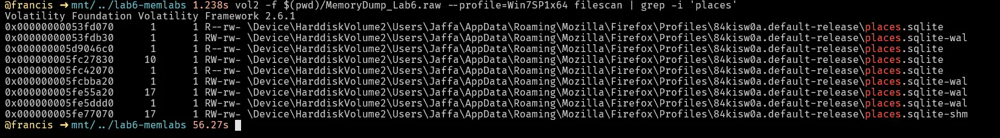

For google chrome its just called History but its actually also an sqlite db.

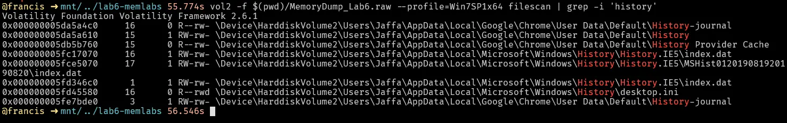

There is also history files for internet explorer, we can investigate those as well.

## Dumping the firefox history files

We should dump the shm,wal and main sqlite files. These are all required for a fuller picture because the main places.sqlite file may not have the most recent changes.

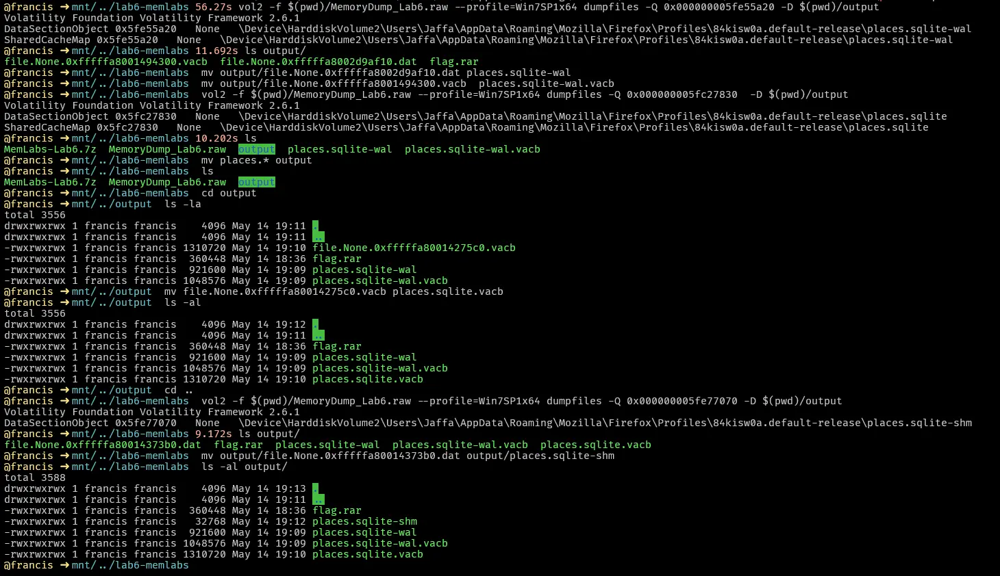

Lets perform a strings on the places.sqlite-wal file because it was the only file that we got from dumpfiles that was a .dat file.
The actual places.sqlite file was only .vacb which means its only the memory mapped cached view. 
We should look at both regardless but we can start on the .dat first.

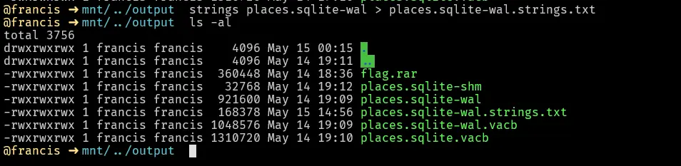

The challenge description states that `FBI also says that David communicated with his workers via the internet so that might be a good place to start` . One of the most common ways to communicate with anyone on the internet is through email, let's try to grep for keyword mail to see what we can get.

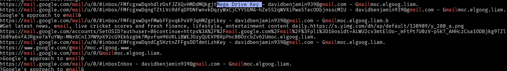

Here we see a few interesting things
- User received an email from davidbenjamin939@gmail.com 
- The email was about a mega drive key

Lets try grepping for mega to see if we can get the actual link 

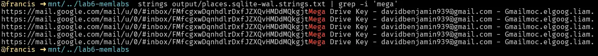

We get nothing.  Lets try dumping the firefox process later to see if we can get something interesting.

##  Dumping google history files

Before dumping the history files for google chrome we have to also note that googlecrashhandler was running. 
This could mean that the history for the browser is instead in the history-journal file instead of history since chrome ended abruptly.
History-journal is the write ahead journal for the history file.
It is the temporary transaction log created by sqlite so that when chrome crashes, it can roll back incomplete transactions.

Lets dump both files to see what we get.

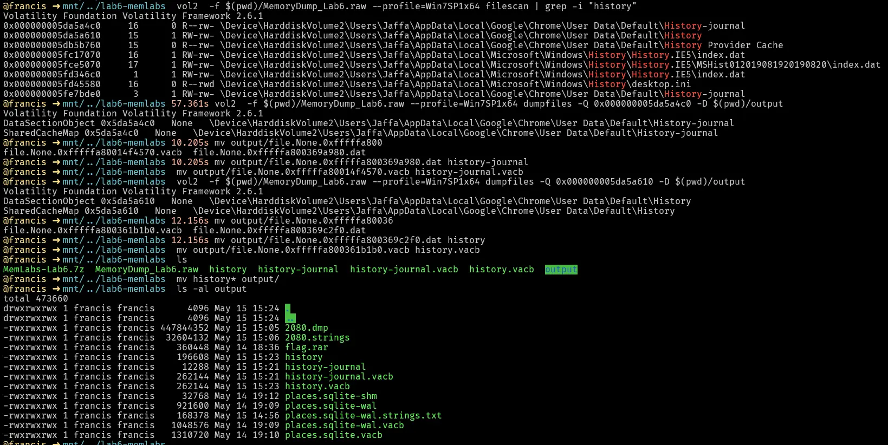

Lets do a strings on the history-journal and see what we get

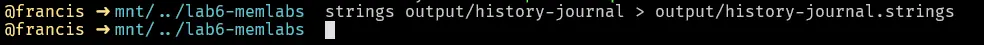
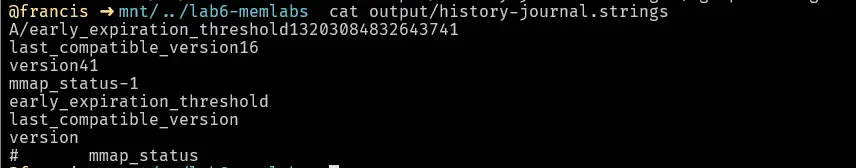

Nothing of use , lets strings history instead 

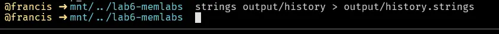

When we do a strings on history and cat the output we find something interesting.

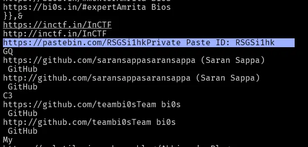

We find a pastebin link. Going to this pastebin link we will see 

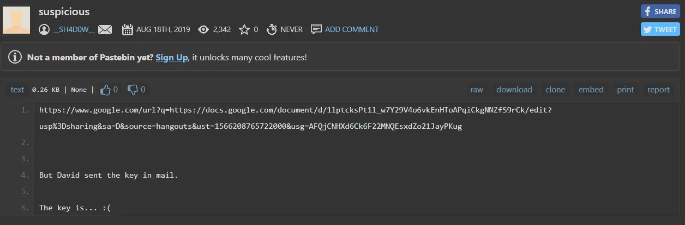

It confirms the david sent the key in the mail and if we look at the google doc it links to

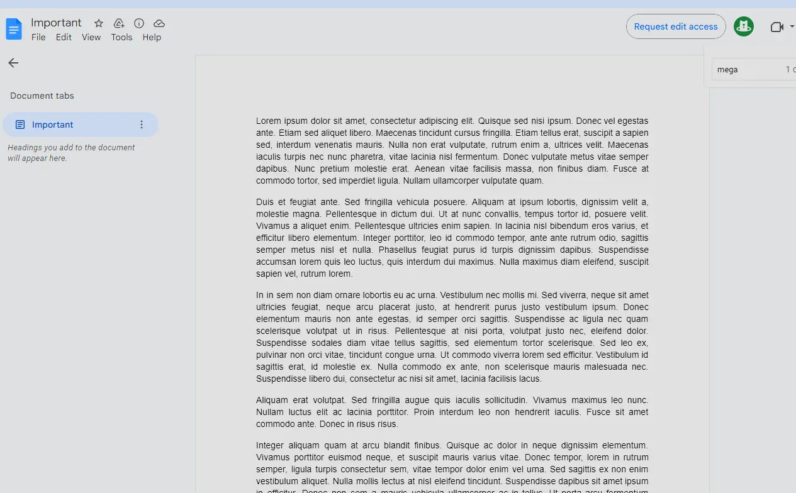

At first it looks like nothing but if we look through the text , we ill find a mega link hidden inside it.

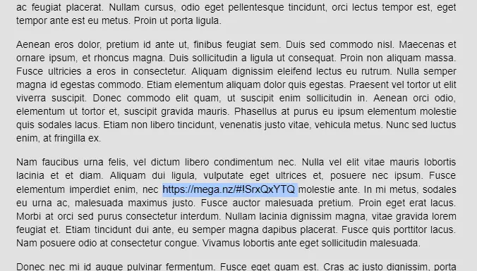

Going to this link will ask us for a decryption key which confirms what we found in the firefox history strings dump as well.

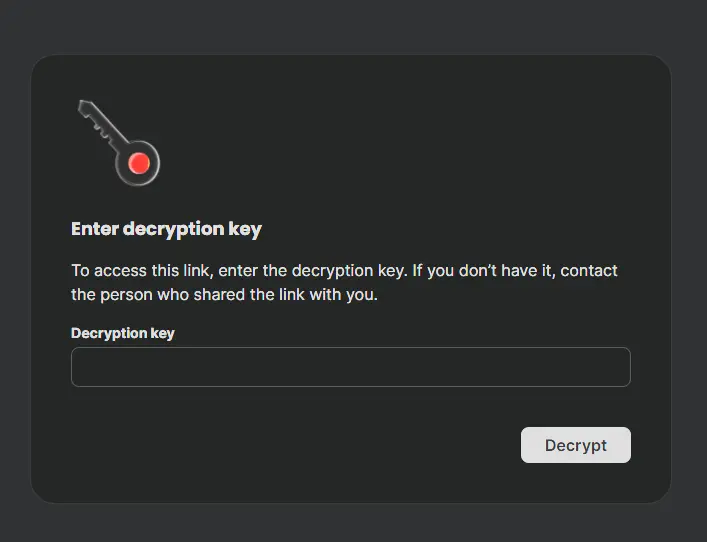

We need to find the key to this mega drive.

## Dumping firefox process

Lets dump the firefox process to see if we can find anything interesting.

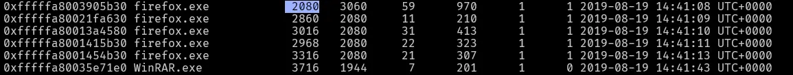

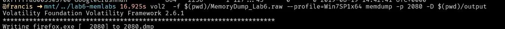

Then lets do a strings on the dump and grep davidbenjamin emails

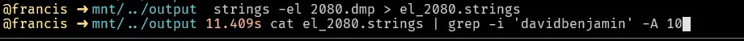

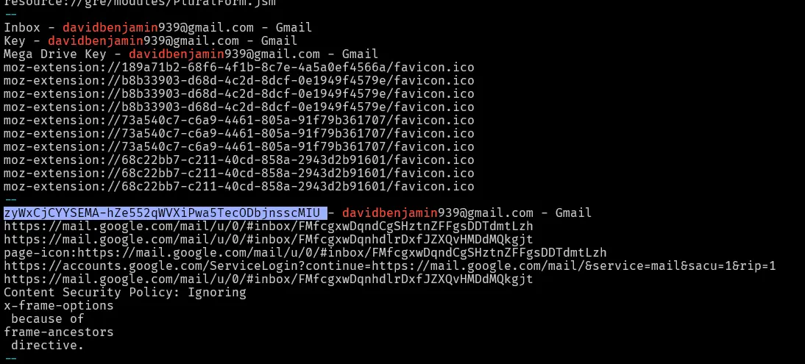

This shows an email with subject "zyWxCjCYYSEMA-hZe552qWVXiPwa5TecODbjnsscMIU" which is highly suspect.
Lets try using it to unlock the mega drive.

## Unlocking the mega drive

In the firefox process we found the an email subject `zyWxCjCYYSEMA-hZe552qWVXiPwa5TecODbjnsscMIU`.
Lets try to unlock the mega drive using that key.

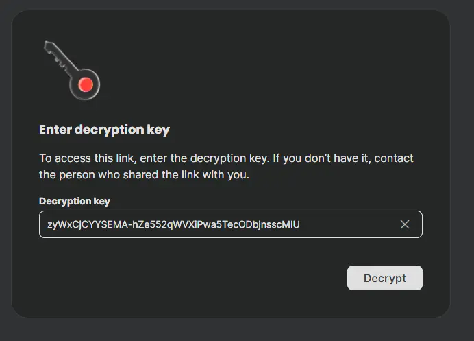

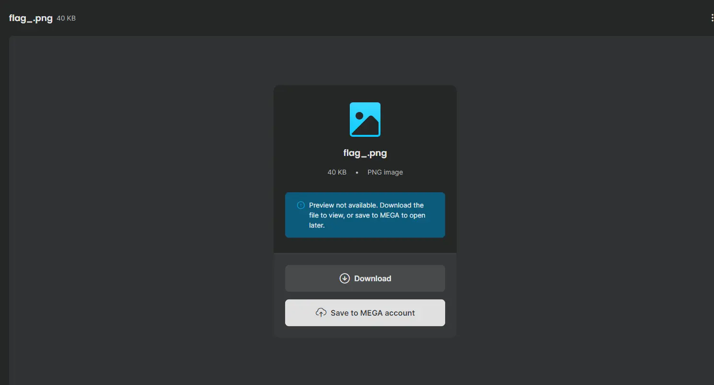

Success! Lets download this file and see what it looks like.

## flag_.png

Trying to open this image results in this

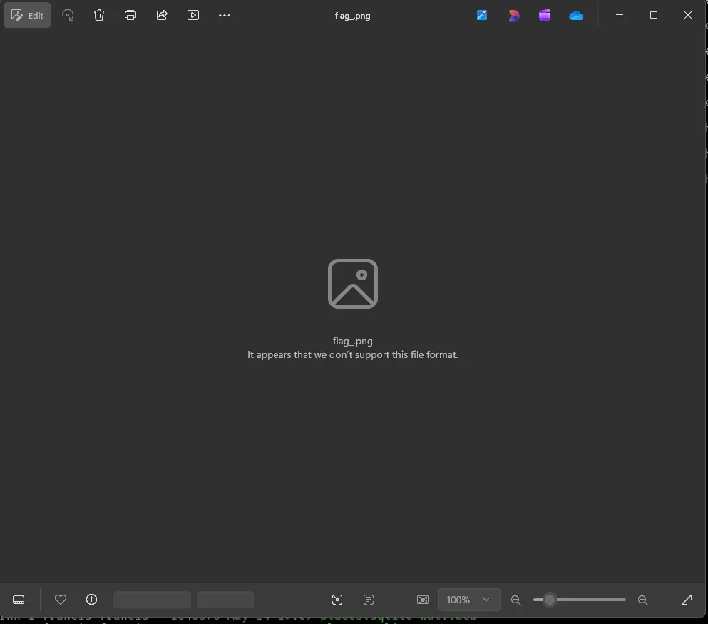

Maybe there is something else hidden in the image lets first check what type of file is this

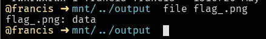

If we do xxd on the file we can see its header

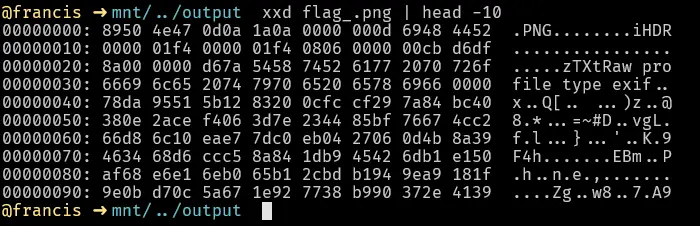

We can see the png magic bytes but for some reason file is not properly classifying it as a png file.
Lets google what a png header should be.
We find [PNG Specification: Chunk Specifications](https://www.libpng.org/pub/png/spec/1.2/PNG-Chunks.html#:~:text=The%20IDAT%20chunk%20contains%20the%20output%20datastream%20of%20the%20compression,of%20all%20the%20IDAT%20chunks) .

It states that an IHDR chunk must appear first. 
However, if we look at the hex output of flag_.png , we can see instead of IHDR it is iHDR.
Maybe the file is not opening because of the lower case "i".
Lets edit that in hxd.

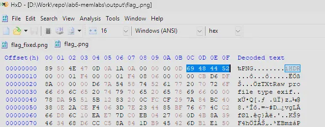
 
Change "i" to "I".

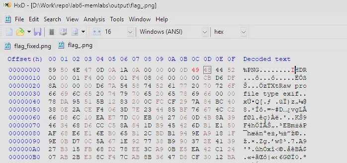

Then we save it as a new file and try to open it.

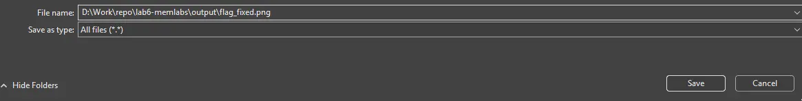

Opening it now, we get

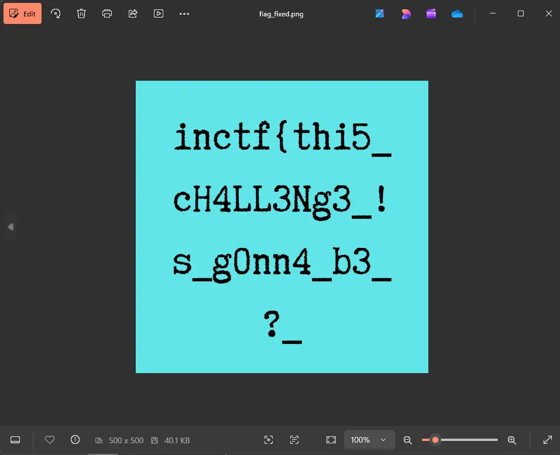

Giving us the first part of the flag which is `inctf{thi5_cH4LL3Ng3_!s_g0nn4_b3_?_`

# Combining the flags

We found two parts of the flag
- Part 1 : `inctf{thi5_cH4LL3Ng3_!s_g0nn4_b3_?_`
- Part 2 : `aN_Am4zINg_!_i_gU3Ss???_}`

Putting this together we have ,

`inctf{thi5_cH4LL3Ng3_!s_g0nn4_b3_?_aN_Am4zINg_!_i_gU3Ss???_}`

# Submission

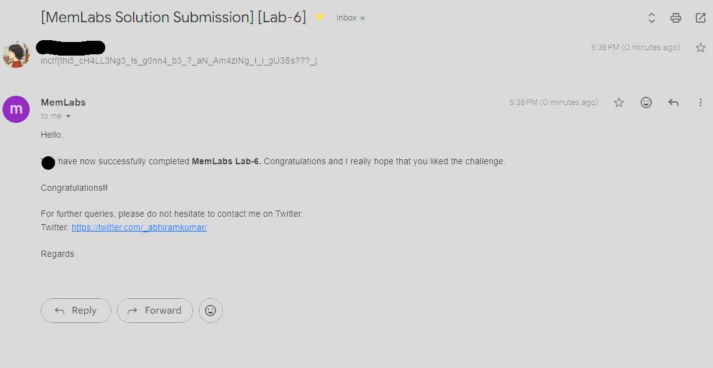
